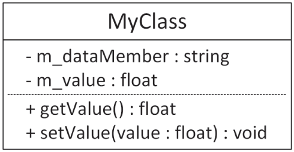
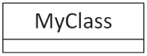
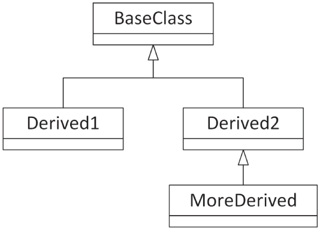
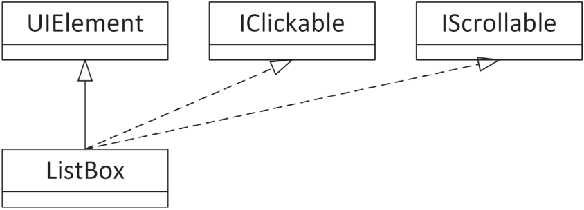
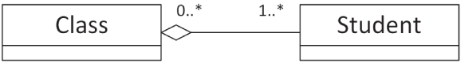
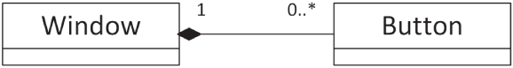
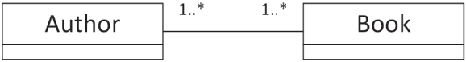
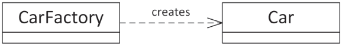

The Unified Modeling Language (UML) is the industry standard for diagrams visualizing class hierarchies, subsystem interactions, sequence diagrams, and so on. This book uses UML for its class diagrams. Explaining the entire UML standard warrants a book in itself, so this appendix is just a brief introduction to only those aspects of UML that are used throughout this book. There are different versions of the UML standard. This book uses UML 2.

## DIAGRAM TYPES

UML defines the following types of diagrams:

- Structural UML diagrams
  - Class diagram
  - Object diagram
  - Package diagram
  - Composite structure diagram
  - Component diagram
  - Deployment diagram
  - Profile diagram
- Behavioral UML diagrams
  - Use case diagram
  - Activity diagram
  - State machine diagram
  - Interaction diagram
    - Sequence diagram
    - Communication diagram
    - Timing diagram
    - Interaction overview diagram

Because this book uses only class and sequence diagrams, those are the only diagrams further discussed in this appendix.

## CLASS DIAGRAMS

Class diagrams are used to visualize individual classes and can include data members and member functions. They are also used to show the relationships between different classes.

### Class Representation

A class is represented in UML as a box with a maximum of three compartments, containing the following:

- The name of the class
- The data members of the class
- The member functions of the class

[Figure D.1](#bapp04-fig-0001) shows an example. `MyClass` has two data members—one of type `string`, the other of type `float`—and it has two member functions. The plus and minus signs in front of each member specify its visibility. The following table lists the most commonly used visibilities:

 

[^FIGURE D.1]

| VISIBILITY | MEANING |
| --- | --- |
| + | public member |
| - | private member |
| # | protected member |

Depending on the goal of your class diagram, sometimes details of members are left out, in which case a class is represented with a box, as shown in [Figure D.2](#bapp04-fig-0002). This can, for example, be used if you are only interested in visualizing the relationships between different classes.

 

[^FIGURE D.2]

### Relationship Representation

UML 2 supports six kinds of relationships between classes: inheritance, realization/implementation, aggregation, composition, association, and dependency. The following sections introduce these relationships.

#### Inheritance

Inheritance is visualized using a line starting from the derived class and going to the base class. The line ends in a hollow triangle on the side of the base class, depicting the is-a relationship. [Figure D.3](#bapp04-fig-0003) shows an example.

 

[^FIGURE D.3]

#### Realization/Implementation

A class implementing an interface is basically inheriting from that interface (is-a relationship). However, to make a distinction between generic inheritance and interface realization, the latter is visualized similar to inheritance but using a dashed instead of a solid line, as shown in [Figure D.4](#bapp04-fig-0004). The `ListBox` class is derived from `UIElement` and implements/realizes the `IClickable` and `IScrollable` interfaces.

 

[^FIGURE D.4]

#### Aggregation

Aggregation represents a has-a relationship. It is visualized using a line with a hollow diamond shape on the side of the class that contains the instance or instances of the other class. In an aggregation relationship, you can also optionally specify the multiplicity of each participant in the relationship. The location of the multiplicity, that is, on which side of the line you need to write it, can be confusing at first. For example, in [Figure D.5](#bapp04-fig-0005), a `Class` can contain/aggregate one or more `Student`s, and each `Student` can follow zero or more `Class`es. An aggregation relationship means that the aggregated object or objects can continue to live when the aggregator is destroyed. For example, if a `Class` is destroyed, its `Student`s are not destroyed.

 

[^FIGURE D.5]

The following table lists a few examples of possible multiplicities:

| MULTIPLICITY | MEANING |
| --- | --- |
| N | Exactly N instances |
| 0..1 | Zero or one instance |
| 0..\* | Zero or more instances |
| N..\* | N or more instances |

#### Composition

Composition is similar to aggregation and is visually represented almost the same, except that a full diamond is used instead of a hollow diamond. With composition, in contrast to aggregation, if the class that contains instances of the other class is destroyed, those contained instances are destroyed as well. [Figure D.6](#bapp04-fig-0006) shows an example. A `Window` can contain zero or more `Button`s, and each `Button` has to be contained by exactly one `Window`. If the `Window` is destroyed, all `Button`s it contains are destroyed as well.

 

[^FIGURE D.6]

#### Association

An association is a generalization of an aggregation. It represents a binary link between classes, while an aggregation is a unidirectional link. A binary link can be traversed in both directions. [Figure D.7](#bapp04-fig-0007) shows an example. Every `Book` knows who its authors are, and every `Author` knows which books she wrote.

 

[^FIGURE D.7]

#### Dependency

A dependency visualizes that a class depends on another class. It is depicted as a dashed line with an arrow pointing toward the dependent class. Usually, some text on the dashed line describes the dependency. To come back to the car factory example of [Chapter 33](../c33), “Applying Design Patterns,” a `CarFactory` is dependent on a `Car` because the factory creates the cars. This is visualized in [Figure D.8](#bapp04-fig-0008).

 

[^FIGURE D.8]

## INTERACTION DIAGRAMS

UML 2 supports four types of interaction diagrams: sequence, communication, timing, and interaction overview diagrams. This book uses only sequence diagrams, briefly discussed in the following section.

### Sequence Diagrams

A sequence diagram graphically represents which messages are sent between different objects and the order in which these are sent. A sequence diagram consists of the following components:

- **Objects:** Object instances involved in the interactions.
- **Lifelines:** Graphically represent the lifetime of objects.
- **Messages:** Messages are sent from one object to another object.
- **Replies:** When an object receives a message from another object, it sends a reply.
- **Self-messages:** Messages an object sends to itself.
- **Alternatives:** Represent alternative flows, similar to the branching in an `if`-`then`-`else` statement.

[Figure D.9](#bapp04-fig-0009) shows an example of a sequence diagram. It's a simplified version of the diagram from [Chapter 4](../c04), “Designing Professional C++ Programs,” but this time with labels indicating the meaning of the important parts of the diagram.

 

[^FIGURE D.9]
