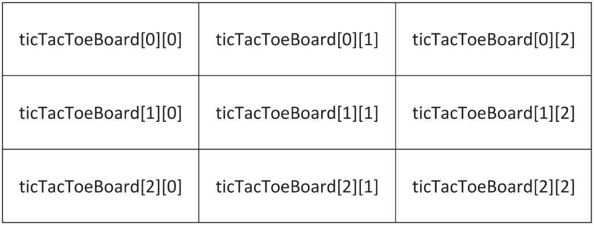
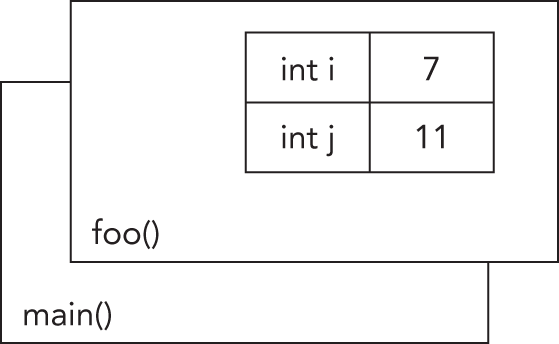

:::tip[WHAT'S IN THIS CHAPTER?]
- A brief overview of the most important parts and syntax of the C++ language and the C++ Standard Library
- How to write a basic class
- How scope resolution works
- What uniform initialization is
- The use of `const`
- What pointers, references, exceptions, and type aliases are
- Basics of type inference
:::

:::tip[WILEY.COM DOWNLOADS FOR THIS CHAPTER]
Please note that all the code examples for this chapter are available as a part of the chapter's code download on this book's website at `www.wiley.com/go/proc++6e` on the Download Code tab.
:::

The goal of this chapter is to cover briefly the most important parts of C++ so that you have a foundation of knowledge before embarking on the rest of this book. This chapter is not a comprehensive lesson in the C++ programming language or the Standard Library. Certain basic points, such as what a program is and what recursion is, are not covered. Esoteric points, such as the definition of a `union`, or the `volatile` keyword, are also omitted. Certain parts of the C language that are less relevant in C++ are also left out, as are parts of C++ that get in-depth coverage in later chapters.

This chapter aims to cover the parts of C++ that programmers encounter every day. For example, if you're fairly new to C++ and don't understand what a reference variable is, you'll learn about that kind of variable here. You'll also learn the basics of how to use the functionality available in the Standard Library, such as `vector` containers, `optional` values, `string` objects, and more. These modern constructs from the Standard Library are briefly introduced in this chapter so that they can be used throughout examples in this book from the beginning.

If you already have significant experience with C++, skim this chapter to make sure that there aren't any fundamental parts of the language on which you need to brush up. If you're new to C++, read this chapter carefully and make sure you understand the examples. If you need additional introductory information, consult the titles listed in [Appendix B](../b02), “Annotated Bibliography.”

## C++ CRASH COURSE

The C++ language is often viewed as a “better C” or a “superset of C.” It was mainly designed to be an object-oriented C, commonly called as “C with classes.” Later on, many of the annoyances and rough edges of the C language were addressed as well. Because C++ is based on C, some of the syntax you'll see in this section will look familiar to you if you are an experienced C programmer. The two languages certainly have their differences, though. As evidence, the C23 standard specification document is a little fewer than 800 pages in size, while the C++23 standard specification document is more than 2,000 pages. So, if you're a C programmer but also if you are coming from other languages such as Java, C#, Python, and so on, be on the lookout for new or unfamiliar syntax!

### The Obligatory “Hello, World” Program

In all its glory, the following code is the simplest C++ program you're likely to encounter. If you are using an older version of C++, then `import std;` and `std::println()` might not work. In that case, you'll need to use alternatives discussed shortly.

```cpp
// 01_helloworld.cpp
import std;
 
int main()
{
    std::println("Hello, World!"); 
    return 0;
}
```

This code, as you might expect, prints the message “Hello, World!” on the screen. It is a simple program and unlikely to win any awards, but it does exhibit the following important concepts about the format of a C++ program:

- Comments
- Importing modules
- The `main()` function
- Printing text
- Returning from a function

These concepts are briefly explained in upcoming sections.

#### Comments

The first line of the program is a *comment*, a message that exists for the programmer only and is ignored by the compiler. In C++, there are two ways to delineate a comment. You can use two forward slashes to indicate that whatever follows on that line is a comment:

```cpp
// 01_helloworld.cpp
```

The same behavior (this is to say, none) can be achieved by using a *multiline comment*. Multiline comments start with `/*` and end with `*/`. The following code shows a multiline comment in action (or, more appropriately, inaction):

```cpp
/* This is a multiline comment.
   The compiler will ignore it.
 */
```

Comments are covered in detail in [Chapter 3](../c03), “Coding with Style.”

#### Importing Modules

Support for *modules* was one of the big four new features of C++20, replacing the old mechanism of *header files*. If you want to use functionality from a module, you simply import that module. This is done with an `import` declaration. Starting with C++23, you can get access to the entire C++ Standard Library by importing a single *standard named module* called `std`. The first line of the “Hello, World” application imports this standard module:

```cpp
import std;
```

If the program did not import that module, it would be unable to perform its only task of printing text.

Without C++23's standard named module support, you have to explicitly import all individual header files that your code requires. As there are more than 100 header files in the Standard Library, it's not always obvious to know which specific header you need to import to use a certain feature. As a reference, [Appendix C](../b03), “Standard Library Header Files,” lists all header files of the C++ Standard Library including a short description of their contents. For example, instead of importing the standard named module `std` in the “Hello, World” application, you can import only those header files that the code really needs. In this example, the code only needs to import `<print>` to get access to the text printing functionality. Notice that when importing the named module `std`, you don't use angle brackets, but when importing individual header files, you need to use angle brackets as follows:

```cpp
import <print>;
```

Since this is a book about C++23, this book uses modules everywhere. All functionality provided by the C++ Standard Library is provided in well-defined header files. Most examples in this book simply import the `std` named module, instead of individual header files, but the text always mentions in which header file certain functionality is provided.

Modules are not limited to Standard Library functionality. You can write your own modules to provide custom types and functionality, as you will learn throughout this book.

:::note
If your compiler does not yet have full support for modules, you can replace explicit header file `import` declarations with `#include` preprocessor directives, discussed in an upcoming section.
:::

#### How the Compiler Processes Your Source Code

In short, building a C++ program is a three-step process. Technically, there are a few more phases in the compilation process, but this simplified view is sufficient for now.

1. First, the code is run through a *preprocessor*, which recognizes meta-information about the code and handles preprocessor directives, such as `#include` directives. A source file in which all preprocessor directives are handled is called a *translation unit*.
2. Next, all translation units are independently *compiled*, or translated, into machine-readable *object files* in which references to functions and so on are not yet defined.
3. Resolving those references is done in the final phase by the *linker*, which links all object files together into the final *executable*.

<cpp23></cpp23>

:::note
Starting with C++23, the standard mandates that C++ compilers accept source code files saved with UTF-8 encoding. [Chapter 21](../c21), “String Localization and Regular Expressions,” discusses different encodings, including UTF-8. I recommend configuring your toolchain to use UTF-8. This will improve portability of your files between different platforms and will allow you to use non-English characters in your source files.
:::

#### Preprocessor Directives

If your compiler does not yet support modules, then instead of importing modules or header files, you need to `#include` header files. That is, explicit `import` declarations such as `import <print>;`, need to be replaced with `#include` preprocessor directives as follows:

```cpp
#include <print>
```

Directives aimed at the preprocessor start with the `#` character, as in `#include <print>`. In this case, the `#include` directive tells the preprocessor to take everything from the `<print>` header file and copy it into the current file. The `<print>` header provides the functionality to print text to the screen.

[Chapter 11](../c11), “Modules, Header Files, and Miscellaneous Topics,” discusses preprocessor directives in a bit more detail. But, as mentioned, this book uses modules instead of old-style header files.

#### The main() Function

`main()` is, of course, where the program starts. The return type of `main()` is an `int`, indicating the result status of the program. The `main()` function either takes no parameters or takes two parameters as follows:

```cpp
int main(int argc, char** argv)
```

`argc` gives the number of arguments passed to the program, and `argv` contains those arguments. Note that `argv[0]` can be the program name, but it might as well be an empty string, so do not rely on it; instead, use platform-specific functionality to retrieve the program name. The important thing to remember is that the actual arguments contained in `argv` start at index 1.

#### <cpp23></cpp23> Printing Text

Before C++23, you would use *I/O streams* to output text to the screen. Streams are briefly covered in the next section and in detail in [Chapter 13](../c13), “Demystifying C++ I/O.” However, C++23 introduces a new, easier-to-use mechanism to print text to the screen, which is used in almost every code snippet in this book: `std::print()` and `println()`, both defined in `<print>`.

[Chapter 2](../c02), “Working with Strings and String Views,” discusses the `std::print()` and `println()` string formatting and printing functions in detail. However, their basic use is straightforward and introduced here so that they can already be used in upcoming code snippets. In its most basic form, `println()` can be used to print a line of text that automatically ends with a new line:

```cpp
std::println("Hello, World!");
```

The first argument to `println()` is a format string, which can contain replacement fields to be replaced with values passed in as second and subsequent arguments. You indicate where a replacement field goes by including curly brackets, `{}`, for each field to be included. For example:

```cpp
std::println("There are {} ways I love you.", 219);
```

In this example, the number 219 is inserted into the string, so the output is:

```cpp
There are 219 ways I love you.
```

You can have as many replacement fields as needed, for example:

```cpp
std::println("{} + {} = {}", 2, 4, 6);
```

In this example, each field is applied in order, so the resulting output is:

```cpp
2 + 4 = 6
```

There is much more to be said about the format of replacement fields, but that's for [Chapter 2](../c02).

If you use `print()` instead of `println()`, the printed text will not end with a new line character.

#### I/O Streams

If your compiler does not yet support the C++23 `std::print()` and `println()` functions, you have to rewrite them using I/O streams.

*I/O streams* are covered in depth in [Chapter 13](../c13), but the basics of output and input are simple. Think of an output stream as a laundry chute for data. Anything you toss into it will be output appropriately. `std::cout` is the chute corresponding to the user console, or *standard out*. There are other chutes, including `std::cerr`, which outputs to the error console. The `<<` operator tosses data down the chute. Output streams allow multiple types of data to be sent down the stream sequentially on a single line of code. The following code outputs text, followed by a number, followed by more text:

```cpp
std::cout << "There are " << 219 << " ways I love you." << std::endl;
```

Starting with C++20, though, it is recommended to use `std::format()`, defined in `<format>`, to perform string formatting. The `format()` function uses the same concept of replacement fields as `print()` and `println()`and is discussed in detail in [Chapter 2](../c02). However, using it to rewrite the previous statement is easy enough:

```cpp
std::cout << std::format("There are {} ways I love you.", 219) << std::endl;
```

Thus, if your compiler doesn't support `print()` and `println()` yet, you can easily rewrite such statements to use `cout`, `format()`, and `endl`. For example, suppose you have the following statement:

```cpp
std::println("{} + {} = {}", 2, 4, 6);
```

In this statement, replace `println()` with `format()`, stream the result to `cout`, and add an output of `endl`:

```cpp
std::cout << std::format("{} + {} = {}", 2, 4, 6) << std::endl;
```

`std::endl` represents an end-of-line sequence. When the output stream encounters `std::endl`, it will output everything that has been sent down the chute so far and move to the next line. An alternate way of representing the end of a line is by using the `\n` character. The `\n` character is an *escape sequence*, which refers to a new-line character. Escape sequences can be used within any quoted string of text. The following table shows the most common ones:

| ESCAPE SEQUENCE | MEANING |
| --- | --- |
| `\n` | New line: moves the cursor to the beginning of the next line |
| `\r` | Carriage return: moves the cursor to the beginning of the current line, but does not advance to the next line |
| `\t` | Tab |
| `\\` | Backslash character |
| `\"` | Quotation mark |

:::warning
Keep in mind that `endl` inserts a new line into the stream and flushes everything currently in its buffers down the chute. Overusing `endl`, for example in a loop, is not recommended because it will have a performance impact. On the other hand, inserting `\n` into the stream also inserts a new line but does not automatically flush the buffers.
:::

By default, `print()` and `println()` print text to the standard output console, `std::cout`. You can print to the error console, `std::cerr`, as follows:

```cpp
std::println(std::cerr, "Error: {}", 6);
```

Streams can also be used to accept input from the user. The simplest way to do so is to use the `>>` operator with an input stream. The `std::cin` input stream accepts keyboard input from the user. Here is an example:

```cpp
import std;
int main()
{
    int value;
    std::cin >> value;
    std::println("You entered {}", value);
}
```

The `>>` operator stops input when it encounters a space character after reading a value. That also means you cannot use the operator to read text containing spaces. Additionally, user input can be tricky because you never know what kind of data the user will enter. [Chapter 13](../c13) discusses input streams in detail, including how to read text with embedded spaces.

If you're new to C++ and coming from a C background, you're probably wondering what has been done with the trusty old `printf()` and `scanf()` functions. While these functions can still be used in C++, I strongly recommend using the modern `print()`, `println()`, and `format()` functions and the streams library instead, mainly because the `printf()` and `scanf()` family of functions do not provide any type safety.

#### Returning from a Function

The last line in the “Hello, World” program is as follows:

```cpp
    return 0;
```

Since this is the `main()` function, returning from it returns control to the operating system. When doing so, it passes the value 0, which usually signals to the operating system that there were no errors while executing the program. For error cases, you can return non-zero values.

A `return` statement in `main()` is optional. If you don't write one, the compiler will implicitly add a `return 0;` for you.

### Namespaces

*Namespaces* address the problem of naming conflicts between different pieces of code. For example, you might be writing some code that has a function called `foo()`. One day, you decide to start using a third-party library, which also has a `foo()` function. The compiler has no way of knowing which version of `foo()` you are referring to within your code. You can't change the library's function name, and it would be a big pain to change your own.

Namespaces come to the rescue in such scenarios because you can define the context in which names are defined. To place code in a namespace, enclose it within a namespace block. Here's an example:

```cpp
namespace mycode {
    void foo()
    {
        std::println("foo() called in the mycode namespace");
    }
}
```

By placing your version of `foo()` in the namespace `mycode`, you are isolating it from the `foo()` function provided by the third-party library. To call the namespace-enabled version of `foo()`, prepend the namespace onto the function name by using `::`, also called the *scope resolution operator*, as follows:

```cpp
mycode::foo();    // Calls the "foo" function in the "mycode" namespace
```

Any code that falls within a `mycode` namespace block can call other code within the same namespace without explicitly prepending the namespace. This implicit namespace is useful in making the code more readable. You can also avoid prepending of namespaces with a `using` *directive*. This directive tells the compiler that the subsequent code is making use of names in the specified namespace. The namespace is thus implied for the code that follows:

```cpp
using namespace mycode;
 
int main()
{
    foo();  // Implies mycode::foo();
}
```

:::note
The `main()` function must never be put in a namespace. It must be in the global namespace.
:::

A single source file can contain multiple `using` directives, but beware of overusing this shortcut. In the extreme case, if you declare that you're using every namespace known to humanity, you're effectively eliminating namespaces entirely! Name conflicts will again result if you are using two namespaces that contain the same names. It is also important to know in which namespace your code is operating so that you don't end up accidentally calling the wrong version of a function.

You've seen the namespace syntax before—you used it in the “Hello, World” program, where `println` is a name defined in the `std` namespace. You can write “Hello, World” with a `using` directive as shown here:

```cpp
import std;
 
using namespace std;
 
int main()
{
    println("Hello, World!");
}
```

:::note
Most code snippets in this book assume a `using` directive for the `std` namespace so that everything from the C++ Standard Library can be used without the need to qualify it with `std::`.
:::

A `using` *declaration* can be used to refer to a particular item within a namespace. For example, if the only part of the `std` namespace that you want to use unqualified is `print`, you can use the following `using` declaration:

```cpp
using std::print;
```

Subsequent code can refer to `print` without prepending the namespace, but other items in the `std` namespace, such as `println`, still need to be explicit:

```cpp
using std::print;
print("Hello, ");
std::println("World!");
```

:::warning
Never put a `using` directive or `using` declaration in a header file at global scope; otherwise, you force it on everyone who includes your header file. Putting it in a smaller scope, for instance at namespace or class scope, is OK, even in a header file. It's also perfectly fine to put a `using` directive or declaration in a module interface file, as long as you don't export it. However, this book always fully qualifies all types in module interface files, as I think it makes it easier to understand an interface. Module interface files and exporting entities from modules are explained later in this chapter.
:::

#### Nested Namespace

A *nested namespace* is a namespace inside another one. Each namespace is separated by a double colon. Here's an example:

```cpp
namespace MyLibraries::Networking::FTP {
    /* … */
}
```

This compact syntax was not available before C++17 in which case you had to resort to the following:

```cpp
namespace MyLibraries {
    namespace Networking {
        namespace FTP {
            /* … */
        }
    }
}
```

#### Namespace Alias

A *namespace alias* can be used to give a new and possibly shorter name to another namespace. Here's an example:

```cpp
namespace MyFTP = MyLibraries::Networking::FTP;
```

### Literals

Literals are used to write numbers or strings in your code. C++ supports a couple of standard literals. Integral numbers can be written using the following literals (the examples represent the same number, 123):

- Decimal literal, `123`
- Octal literal, `0173` (starts with a zero)
- Hexadecimal literal, `0x7B` (starts with 0x)
- Binary literal, `0b1111011` (starts with 0b)

:::warning
Never put a zero, `0`, in front of a numerical literal, unless it's an octal literal!
:::

Other examples of literals in C++ include the following:

- A floating-point value (such as `3.14f`)
- A double floating-point value (such as `3.14`)
- A hexadecimal floating-point literal (such as `0x3.ABCp-10` and `0Xb.cp12l`)
- A single character (such as `'a'`)
- A zero-terminated array of characters (such as `"character array"`)

A literal can have a suffix, such as the `f` in `3.14f`, to force a certain type. In this case, `3.14f` results in a `float`, while `3.14` results in a `double`.

Single quote characters can be used as digit separators in numeric literals. For example:

- `23'456'789`
- `2'34'56'789`
- `0.123'456f`

Multiple string literals separated only by whitespace are automatically concatenated into a single string. For example:

```cpp
    std::println("Hello, "
                 "World!");
```

is equivalent to:

```cpp
    std::println("Hello, World!");
```

It is also possible to define your own type of literals, which is an advanced feature explained in [Chapter 15](../c15), “Overloading C++ Operators.”

### Variables

In C++, *variables* can be declared just about anywhere in your code and can be used anywhere in the current block below the line where they are declared. Variables can be declared without being given a value. These uninitialized variables generally end up with a semi-random value based on whatever is in memory at that time, and they are therefore the source of countless bugs. Variables in C++ can alternatively be assigned an initial value when they are declared. The code that follows shows both flavors of variable declaration, both using `int`s, which represent integer values:

```cpp
int uninitializedInt;
int initializedInt { 7 };
println("{} is a random value", uninitializedInt);
println("{} was assigned as an initial value", initializedInt);
```

:::note
Most compilers will issue a warning or an error when code is using uninitialized variables. Some compilers will generate code that will report an error at run time.
:::

The `initializedInt` variable is initialized using the *uniform initialization* syntax. You can also use the following assignment syntax for initializing variables:

```cpp
int initializedInt = 7;
```

Uniform initialization was introduced with the C++11 standard in 2011. It is recommended to use uniform initialization instead of the old assignment syntax, so that's the syntax used in this book. The section “[Uniform Initialization](#c01-sec-0085)” later in this chapter goes deeper in on the benefits and why it is recommended.

Variables in C++ are strongly typed; that is, they always have a specific type. C++ comes with a whole set of built-in types that you can use out of the box. The following table shows the most common types:

| TYPE | DESCRIPTION | USAGE |
| --- | --- | --- |
| ```cpp (signed) int signed ``` | Positive and negative integers; the range depends on the compiler (usually 4 bytes) | ```cpp int i {-7}; signed int i {-6}; signed i {-5}; ``` |
| ```cpp (signed) short (int) ``` | Short integer (usually 2 bytes) | ```cpp short s {13}; short int s {14}; signed short s {15}; signed short int s {16}; ``` |
| ```cpp (signed) long (int) ``` | Long integer (usually 4 bytes) | ```cpp long l {-7L}; ``` |
| ```cpp (signed) long long (int) ``` | Long long integer; the range depends on the compiler but is at least the same as for `long` (usually 8 bytes) | ```cpp long long ll {14LL}; ``` |
| ```cpp unsigned (int) unsigned short (int) unsigned long (int) unsigned long long (int) ``` | Limits the preceding types to values >= 0 | ```cpp unsigned int i {2U}; unsigned j {5U}; unsigned short s {23U}; unsigned long l {54UL}; unsigned long long ll     {140ULL}; ``` |
| ```cpp float ``` | Single precision floating-point numbers | ```cpp float f {7.2f}; ``` |
| ```cpp double ``` | Double precision floating-point numbers; precision is at least the same as for `float` | ```cpp double d {7.2}; ``` |
| ```cpp long double ``` | Long double precision floating-point numbers; precision is at least the same as for `double` | ```cpp long double d {16.98L}; ``` |
| ```cpp char unsigned char signed char ``` | A single character | ```cpp char ch {'m'}; ``` |
| ```cpp char8_t char16_t char32_t ``` | A single *n*-bit UTF-*n*-encoded Unicode character where *n* can be 8, 16, or 32 | ```cpp char8_t c8 {u8'm'}; char16_t c16 {u'm'}; char32_t c32 {U'm'}; ``` |
| ```cpp wchar_t ``` | A single wide character; the size depends on the compiler | ```cpp wchar_t w {L'm'}; ``` |
| ```cpp bool ``` | A Boolean type that can have one of two values: `true` or `false` | ```cpp bool b {true}; ``` |

The range of `signed` and `unsigned` integer and `char` types is as follows:

| TYPE | SIGNED | UNSIGNED |
| --- | --- | --- |
| `char` | -128 to 127 | 0 to 255 |
| 2-byte integers | -32,768 to 32,767 | 0 to 65,535 |
| 4-byte integers | -2,147,483,648 to 2,147,483,647 | 0 to 4,294,967,295 |
| 8-byte integers | -9,223,372,036,854,775,808 to 9,223,372,036,854,775,807 | 0 to 18,446,744,073,709,551,615 |

Type `char` is a different type compared to both the `signed char` and `unsigned char` types. It should be used only to represent characters. Depending on your compiler, it can be either signed or unsigned, so you should not rely on it being signed or unsigned.

The range and precision of floating-point types is discussed in the section “[Floating-Point Numbers](#c01-sec-0031)” later in this chapter.

Related to `char`, `<cstddef>` provides the `std::byte` type representing a single byte. Before C++17, a `char` or `unsigned char` was used to represent a byte, but those types make it look like you are working with characters. `std::byte` on the other hand clearly states your intention, that is, a single byte of memory. A `byte` can be initialized as follows:

```cpp
std::byte b { 42 };
```

:::note
C++ does not provide a basic string type. However, a standard implementation of a string is provided as part of the Standard Library, as briefly discussed later in this chapter and in detail in [Chapter 2](../c02).
:::

#### Numerical Limits

C++ provides a standard way to obtain information about numeric limits, such as the maximum possible value for an integer on the current platform. In C, you could access constants, such as `INT_MAX`. While those are still available in C++, it's recommended to use the `std::numeric_limits` class template defined in `<limits>`. Class templates are discussed later in this book, but those details are not important to understand how to use `numeric_limits`. For now, you just need to know that, since it is a class template, you have to specify the type you are interested in between a set of angle brackets. For example, to get numeric limits for integers, you write `std::numeric_limits<int>`. Consult a Standard Library reference (see [Appendix B](../b02)) to learn exactly what kind of information you can query using `numeric_limits`.

Here are a few examples:

```cpp
println("int:");
println("Max int value: {}", numeric_limits<int>::max());
println("Min int value: {}", numeric_limits<int>::min());
println("Lowest int value: {}", numeric_limits<int>::lowest());
        
println("\ndouble:");
println("Max double value: {}", numeric_limits<double>::max());
println("Min double value: {}", numeric_limits<double>::min());
println("Lowest double value: {}", numeric_limits<double>::lowest());
```

The output of this code snippet on my system is as follows:

```cpp
int:
Max int value: 2147483647
Min int value: -2147483648
Lowest int value: -2147483648
 
double:
Max double value: 1.7976931348623157e+308
Min double value: 2.2250738585072014e-308
Lowest double value: -1.7976931348623157e+308
```

Note the differences between `min()` and `lowest()`. For an integer, the minimum value equals the lowest value. However, for floating-point types, the minimum value is the smallest positive value that can be represented, while the lowest value is the most negative value representable, which equals `-max()`.

#### Zero Initialization

Variables can be initialized to zero with `{0}`, or with a *zero initializer*, `{}`. Zero initialization initializes primitive integer types (such as `char`, `int`, and so on) to zero, primitive floating-point types to 0.0, pointer types to `nullptr`, and constructs objects with the default constructor (discussed later).

Here is an example of zero initializing a `float` and an `int`:

```cpp
float myFloat {};
int myInt {};
```

#### Casting

Variables can be converted to other types by *casting* them. For example, a `float` can be cast to an `int`. C++ provides three ways to *explicitly* change the type of a variable. The first method is a holdover from C; it is not recommended but, unfortunately, still commonly used. The second method is rarely used. The third method is the most verbose but is also the cleanest one and is therefore recommended.

```cpp
float myFloat { 3.14f };
int i1 { (int)myFloat };                // method 1
int i2 { int(myFloat) };                // method 2
int i3 { static_cast<int>(myFloat) };   // method 3
```

The resulting integer will be the value of the floating-point number with the fractional part truncated. [Chapter 10](../c10), “Discovering Inheritance Techniques,” describes the different casting methods in more detail. In some contexts, variables can be automatically cast, or *coerced*. For example, a `short` can be automatically converted into a `long` because a `long` represents the same type of data with at least the same precision:

```cpp
long someLong { someShort };          // no explicit cast needed
```

When automatically casting variables, you need to be aware of the potential loss of data. For example, casting a `float` to an `int` throws away the fractional part of the number, and the resulting integer can even be completely wrong if the floating-point value represents a number bigger than the maximum representable integer value. Most compilers will issue a warning or even an error if you assign a `float` to an `int` without an explicit cast. If you are certain that the left-hand side type is fully compatible with the right-hand side type, it's OK to cast implicitly.

#### Floating-Point Numbers

Working with floating-point numbers can be more complicated than working with integral types. You need to keep a few things in mind. Calculations with floating-point values that are orders of magnitude different can cause errors. Furthermore, calculating the difference between two floating-point numbers that are almost identical will cause the loss of precision. Also keep in mind that a lot of decimal values cannot be represented exactly as floating-point numbers. However, going deeper in on the numerical problems with using floating-point numbers and how to write numerical stable floating-point algorithms is outside the scope of this book, as these topics warrant a whole book on their own.

There are several special floating-point numbers:

- **+/-infinity:** Represents positive and negative infinity, for example the result of dividing a non-zero number by zero
- **NaN:** Abbreviation for not-a-number, for example the result of dividing zero by zero, a mathematically undefined result

To check whether a given floating-point number is not-a-number, use `std::isnan()`. To check for infinity, use `std::isinf()`. Both functions are defined in `<cmath>`.

To obtain one of these special floating-point values, use `numeric_limits`, for example `std::numeric_limits<double>::infinity()`.

##### <cpp23></cpp23> Extended Floating-Point Types

As mentioned in the section on variables earlier, C++ provides the following *standard floating-point types*: `float`, `double`, and `long double`.

C++23 introduces the following *extended floating-point types* that have become popular in certain domains. Support for these is optional, and not all compilers provide these types.

| TYPE | DESCRIPTION | LITERAL SUFFIX |
| --- | --- | --- |
| `std::float16_t` | 16-bit format from the IEEE 754 standard. | `F16` or `f16` |
| `std::float32_t` | 32-bit format from the IEEE 754 standard. | `F32` or `f32` |
| `std::float64_t` | 64-bit format from the IEEE 754 standard. | `F64` or `f64` |
| `std::float128_t` | 128-bit format from the IEEE 754 standard. | `F128` or `f128` |
| `std::bfloat16_t` | Brain floating point.[^1] Used in certain AI domains. | `BF16` or `bf16` |

Most of the time, the standard types, `float`, `double`, and `long double`, are enough. From these, `double` should be your default type. Using `float` can trigger loss of precision, and, depending on your use case, this might or might not be acceptable.

##### Range and Accuracy of Floating-Point Types

Floating-point types have a limited range and a limited precision. The following table gives detailed specifications of all standard and extended floating-point types supported by C++. However, the specifications of the standard types, `float`, `double`, and `long double`, are not specified exactly by the C++ standard. The standard says only that `long double` should have at least the same precision as `double`, and `double` should have at least the same precision as `float`. For these three types, the table shows values commonly used by compilers.

| TYPE | NAME | MANTISSA BITS | DECIMAL DIGITS | EXPONENT BITS | MIN | MAX |
| --- | --- | --- | --- | --- | --- | --- |
| `float` | Single precision | 24 | 7.22 | 8 | 1.18x10-38 | 3.40x1038 |
| `double` | Double precision | 53 | 15.95 | 11 | 2.23x10-308 | 1.80x10308 |
| `long double` | Extended precision | 64 | 19.27 | 15 | 3.36x10−4932 | 1.19x104932 |
| `std::float16_t` | Half precision | 11 | 3.31 | 5 | 6.10x10-5 | 65504 |
| `std::float32_t` | Single precision | 24 | 7.22 | 8 | 1.18x10-38 | 3.40x1038 |
| `std::float64_t` | Double precision | 53 | 15.95 | 11 | 2.23x10-308 | 1.80x10308 |
| `std::float128_t` | Quadruple precision | 113 | 34.02 | 15 | 3.36x10−4932 | 1.19x104932 |
| `std::bfloat16_t` | Brain floating point | 8 | 2.41 | 8 | 1.18x10-38 | 3.40x1038 |

### Operators

What good is a variable if you don't have a way to change it? The following table shows common *operators* used in C++ and sample code that makes use of them. Operators in C++ can be *binary* (operate on two expressions), *unary* (operate on a single expression), or even *ternary* (operate on three expressions). There is only one ternary operator in C++, and it is explained in the section “[The Conditional Operator](#c01-sec-0045)” later in this chapter. Furthermore, [Chapter 15](../c15), “Overloading C++ Operators,” is reserved for operators and explains how you can add support for these operators to your own custom types.

| OPERATOR | DESCRIPTION | USAGE |
| --- | --- | --- |
| `=` | Binary operator to assign the value on the right to the expression on the left. | ```cpp int i; i = 3; int j; j = i; ``` |
| `!` | Unary operator to complement the true/false (non-0/0) status of an expression. | ```cpp bool b {!true}; bool b2 {!b}; ``` |
| `+` | Binary operator for addition. | ```cpp int i {3 + 2}; int j {i + 5}; int k {i + j}; ``` |
| `-  *  /` | Binary operators for subtraction, multiplication, and division. | ```cpp int i {5 – 1}; int j {5 * 2}; int k {j / i}; ``` |
| `%` | Binary operator for the remainder of a division operation. This is also referred to as the *mod* or *modulo* operator. For example: 5%2=1. | ```cpp int rem {5 % 2}; ``` |
| `++` | Unary operator to increment an expression by 1. If the operator occurs after the expression, or *post-increment*, the result of the expression is the unincremented value. If the operator occurs before the expression, or *pre-increment*, the result of the expression is the new value. | ```cpp i++; ++i; ``` |
| `--` | Unary operator to decrement an expression by 1. | ```cpp i--; --i; ``` |
| `+=  -=  *=  /=  %=` | Shorthand syntax for:  ```cpp i = i + (j); i = i - (j); i = i * (j); i = i / (j); i = i % (j); ``` | ```cpp i += j; i -= j; i *= j; i /= j; i %= j; ``` |
| `&  &=` | Takes the raw bits of one expression and performs a bitwise AND with the other expression. | ```cpp i = j & k; j &= k; ``` |
| `|  |=` | Takes the raw bits of one expression and performs a bitwise OR with the other expression. | ```cpp i = j | k; j |= k; ``` |
| `<<  >>  <<=  >>=` | Takes the raw bits of an expression and “shifts” each bit left (`<<`) or right (`>>`) the specified number of places. | ```cpp i = i << 1; i = i >> 4; i <<= 1; i>>= 4; ``` |
| `^  ^=` | Performs a bitwise exclusive or, also called XOR operation, on two expressions. | ```cpp i = i ^ j; i ^= j; ``` |

Operators of the form `op=`, e.g., `+=`, are called *compound assignment operators*.

When a binary operator is applied to two operands of different types, the compiler inserts an *implicit conversion* to convert one of them to the other before applying the operator. You can also use *explicit conversions* to convert one type to another using `static_cast()`.

For implicit conversions, the compiler has certain rules to decide which type it converts to which other type. For example, for a binary operation with a small integer type and a larger integer type, the smaller type will be converted to the larger one. However, the results might not always be as you would expect. Thus, I recommend being careful with implicit conversions and using explicit conversions to make sure the compiler does what you intend.

The following code snippet shows the most common variable types and operators in action. It also shows explicit conversions and explains why they are necessary. If you are unsure about how variables and operators work, try to figure out what the output of this program will be, and then run it to confirm your answer.

```cpp
int someInteger { 256 };
short someShort;
long someLong;
float someFloat;
double someDouble;
 
someInteger++;
someInteger *= 2;
// Conversion from larger integer type to smaller integer type
// can cause a warning or error, hence static_cast() is required.
someShort = static_cast<short>(someInteger);
someLong = someShort * 10000;
someFloat = someLong + 0.785f;
// To make sure the division is performed with double precision,
// someFloat is explicitly converted to double first.
someDouble = static_cast<double>(someFloat) / 100000;
println("{}", someDouble);
```

The C++ compiler has a recipe for the order in which expressions are evaluated. If you have a complicated expression with many operators, the order of execution may not be obvious. For that reason, it's probably better to break up a complicated expression into several smaller expressions, or explicitly group subexpressions by using parentheses. For example, the following line of code might be confusing unless you happen to know the exact evaluation order of the operators:

```cpp
int i { 34 + 8 * 2 + 21 / 7 % 2 };
```

Adding parentheses makes it clear which operations are happening first:

```cpp
int i { 34 + (8 * 2) + ( (21 / 7) % 2 ) };
```

For those of you playing along at home, both approaches are equivalent and end up with `i` equal to 51. If you assumed that C++ evaluated expressions from left to right, your answer would have been 1. C++ evaluates `/`, `*`, and `%` first (in left-to-right order), followed by addition and subtraction, then bitwise operators. Parentheses let you explicitly tell the compiler that a certain operation should be evaluated first.

Formally, the evaluation order of operators is expressed by their *precedence*. Operators with a higher precedence are executed before operators with a lower precedence. The following list shows the precedence of the operators from the previous table. Operators higher in the list have higher precedence and hence are executed before operators lower in the list.

- `++ −−` (postfix)
- `! ++ −−` (prefix)
- `* / %`
- `+ −`
- `<< >>`
- `&`
- `^`
- `|`
- `= += -= *= /= %= &= |= ^= <<= >>=`

This is only a selection of the available C++ operators. [Chapter 15](../c15) gives a complete overview of all available operators, including their precedence.

### Enumerations

An integer really represents a single value from a larger set of values—the entire sequence of integral numbers. *Enumerations* are types that let you define your own sequences so that you can declare variables with values in that sequence. For example, in a chess program, you *could* represent each piece as an `int`, with constants for the piece types, as shown in the following code. The integers representing the types are marked `const` to indicate that they can never change.

```cpp
const int PieceTypeKing { 0 };
const int PieceTypeQueen { 1 };
const int PieceTypeRook { 2 };
const int PieceTypePawn { 3 };
//etc.
int myPiece { PieceTypeKing };
```

This representation can become dangerous. Since a piece is just an `int`, what would happen if another programmer added code to increment the value of a piece? By adding 1, a king becomes a queen, which really makes no sense. Worse still, someone could come in and give a piece a value of -1, which has no corresponding constant.

*Strongly typed enumerations* solve these problems by tightly defining the range of values for a variable. The following code declares a new type, `PieceType`, which has four possible values, called *enumerators*, representing four of the chess pieces:

```cpp
enum class PieceType { King, Queen, Rook, Pawn };
```

This new type can be used as follows:

```cpp
PieceType piece { PieceType::King };
```

Behind the scenes, an enumeration is just an integer value. The underlying values for `King`, `Queen`, `Rook`, and `Pawn` are 0, 1, 2, and 3, respectively. It's possible to specify the integer values for enumerators yourself. The syntax is as follows:

```cpp
enum class PieceType
{
    King = 1,
    Queen,
    Rook = 10,
    Pawn
};
```

If you do not assign a value to an enumerator, the compiler automatically assigns it a value that is the previous enumerator incremented by 1. If you do not assign a value to the first enumerator, the compiler assigns it the value 0. So, in this example, `King` has the integer value 1, `Queen` has the value 2 assigned by the compiler, `Rook` has the value 10, and `Pawn` has the value 11 assigned automatically by the compiler.

Even though enumerators are internally represented by integer values, they are not automatically converted to integers, which means the following is illegal:

```cpp
int underlyingValue { piece };
```

<cpp23></cpp23> Starting with C++23, you can use `std::to_underlying()`. For example:

```cpp
int underlyingValue { to_underlying(piece) };
```

By default, the underlying type of an enumerator is an integer, but this can be changed as follows:

```cpp
enum class PieceType : unsigned long
{
    King = 1,
    Queen,
    Rook = 10,
    Pawn
};
```

For an `enum class`, the enumerator names are not automatically exported to the enclosing scope. This means they cannot clash with other names already defined in the parent scope. As a result, different strongly typed enumerations can have enumerators with the same name. For example, the following two enumerations are perfectly legal:

```cpp
enum class State { Unknown, Started, Finished };
enum class Error { None, BadInput, DiskFull, Unknown };
```

A big benefit of this is that you can give short names to the enumerators, for example, `Unknown` instead of `UnknownState` and `UnknownError`. However, it also means that you either have to fully qualify enumerators, or use a `using enum` or `using` declaration. Here's an example of a `using enum` declaration:

```cpp
using enum PieceType;
PieceType piece { King };
```

A `using` declaration can be used if you want to avoid having to fully qualify specific enumerators. For example, in the following code snippet, `King` can be used without full qualification, but other enumerators still need to be fully qualified:

```cpp
using PieceType::King;
PieceType piece { King };
piece = PieceType::Queen;
```

:::warning
Even though C++ allows you to avoid fully qualifying enumerators, I recommend using this feature judiciously. At least try to minimize the scope of the `using enum` or `using` declaration because if this scope is too big, you risk reintroducing name clashes. The section on the `switch` statement later in this chapter shows a properly scoped use of a `using enum` declaration.
:::

#### Old-Style Enumerations

New code should always use the strongly typed enumerations explained in the previous section. However, in legacy code bases, you might find *old-style enumerations*, also known as *unscoped enumerations*: `enum` instead of `enum class`. Here is the previous `PieceType` defined as an old-style enumeration:

```cpp
enum PieceType { PieceTypeKing, PieceTypeQueen, PieceTypeRook, PieceTypePawn };
```

The enumerators of such old-style enumerations are exported to the enclosing scope. This means that in the parent scope you can use the names of the enumerators without fully qualifying them, for example:

```cpp
PieceType myPiece { PieceTypeQueen };
```

This of course also means that they can clash with other names already defined in the parent scope resulting in a compilation error. Here's an example:

```cpp
bool ok { false };
enum Status { error, ok };
```

This code snippet does not compile because the name `ok` is first defined to be a Boolean variable, and later the same name is used as the name of an enumerator. Visual C++ 2022 emits the following error:

```cpp
error C2365: 'ok': redefinition; previous definition was 'data variable'
```

Hence, you should make sure such old-style enumerations have enumerators with unique names, such as `PieceTypeQueen`, instead of simply `Queen`.

These old-style enumerations are not strongly typed, meaning they are not *type safe*. They are always interpreted as integers, and thus you can inadvertently compare enumerators from completely different enumerations, or pass an enumerator of the wrong enumeration to a function.

:::warning
Always use strongly typed `enum class` enumerations instead of old-style, unscoped, type-unsafe `enum` enumerations.
:::

### Structs

*Structs* let you encapsulate one or more existing types into a new type. The classic example of a struct is a database record. If you are building a personnel system to keep track of employee information, you might want to store the first initial, last initial, employee number, and salary for each employee. A struct that contains all of this information is shown in the `employee.cppm` *module interface file* that follows. This is your first self-written module in this book. Module interface files usually have `.cppm` as extension. The first line in the module interface file is a *module declaration* and states that this file is defining a module called `employee`. Furthermore, a module needs to explicitly state what it *exports*, i.e., what will be visible when this module is imported somewhere else. Exporting a type from a module is done with the `export` keyword in front of, for example, a `struct`.

```cpp
export module employee;
 
export struct Employee {
    char firstInitial;
    char lastInitial;
    int employeeNumber;
    int salary;
};
```

A variable declared with type `Employee` has all of these *fields* built in. The individual fields of a struct can be accessed by using the `.` operator. The example that follows creates and then outputs the record for an employee. Just as with the standard named module `std`, you don't use angle brackets when importing custom modules.

```cpp
import std;
import employee; // Import our employee module
 
using namespace std;
 
int main()
{
    // Create and populate an employee.
    Employee anEmployee;
    anEmployee.firstInitial = 'J';
    anEmployee.lastInitial = 'D';
    anEmployee.employeeNumber = 42;
    anEmployee.salary = 80000;
    // Output the values of an employee.
    println("Employee: {}{}", anEmployee.firstInitial,
        anEmployee.lastInitial);
    println("Number: {}", anEmployee.employeeNumber);
    println("Salary: ${}", anEmployee.salary);
}
```

### Conditional Statements

*Conditional statements* let you execute code based on whether something is true. As shown in the following sections, there are two main types of conditional statements in C++: `if`/`else` statements and `switch` statements.

#### if/else Statements

The most common conditional statement is the `if` statement, which can be accompanied by an `else`. If the condition given inside the `if` statement is true, the line or block of code is executed. If not, execution continues with the `else` case if present or with the code following the conditional statement. The following code shows a *cascading if statement*, a fancy way of saying that the `if` statement has an `else` statement that in turn has another `if` statement, and so on:

```cpp
if (i> 4) {
    // Do something.
} else if (i> 2) {
    // Do something else.
} else {
    // Do something else.
}
```

The expression between the parentheses of an `if` statement must be a Boolean value or evaluate to a Boolean value. A value of 0 evaluates to `false`, while any non-zero value evaluates to `true`. For example, `if(0)` is equivalent to `if(false)`. Logical evaluation operators, described later, provide ways of evaluating expressions to result in a `true` or `false` Boolean value.

##### Initializers for if Statements

C++ allows you to include an initializer inside an `if` statement using the following syntax:

```cpp
if (<initializer>; <conditional_expression>) {
    <if_body>
} else if (<else_if_expression>) {
    <else_if_body>
} else {
    <else_body>
}
```

Any variable introduced in the `<initializer>` is available only in the `<conditional_expression>`, in the `<if_body>`, in all `<else_if_expression>`s and `<else_if_body>`s, and in the `<else_body>`. Such variables are not available outside the `if` statement.

It is too early in this book to give a useful example of this feature, but here is an example of how it could be employed:

```cpp
if (Employee employee { getEmployee() }; employee.salary> 1000) { … }
```

In this example, the initializer gets an employee by calling the `getEmployee()` function. Functions are discussed later in this chapter. The condition checks whether the salary of the retrieved employee exceeds 1000. Only in that case is the body of the `if` statement executed. More concrete examples will be given throughout this book.

#### switch Statements

The `switch` statement is an alternate syntax for performing actions based on the value of an expression. In C++, the expression of a `switch` statement must be of an integral type, a type convertible to an integral type, an enumeration, or a strongly typed enumeration, and must be compared to constants. Each constant value represents a “case.” If the expression matches the case, the subsequent lines of code are executed until a `break` statement is reached. You can also provide a `default` case, which is matched if none of the other cases matches. The following pseudocode shows a common use of the `switch` statement:

```cpp
switch (menuItem) {
    case OpenMenuItem:
        // Code to open a file
        break;
    case SaveMenuItem:
        // Code to save a file
        break;
    default:
        // Code to give an error message
        break;
}
```

A `switch` statement can always be converted into `if/else` statements. The previous `switch` statement can be converted as follows:

```cpp
if (menuItem == OpenMenuItem) {
    // Code to open a file
} else if (menuItem == SaveMenuItem) {
    // Code to save a file
} else {
    // Code to give an error message
}
```

`switch` statements are generally used when you want to do something based on more than one specific value of an expression, as opposed to some test on the expression. In such a case, the `switch` statement avoids cascading `if`/`else` statements. If you need to inspect only one value, an `if` or `if`/`else` statement is fine.

Once a `case` expression matching the `switch` condition is found, all statements that follow it are executed until a `break` statement is reached. This execution continues even if another `case` expression is encountered, which is called *fallthrough*. In the following example, a single set of statements is executed for both `Mode::Standard` and `Default`. If mode is `Custom`, then `value` is first changed from 42 to 84, after which the `Standard` and `Default` statements are executed. In other words, the `Custom` case falls through until it eventually reaches a `break` statement or the end of the `switch` statement. This code snippet also shows a nice example of using a properly scoped `using enum` declaration to avoid having to write `Mode::Custom`, `Mode::Standard`, and `Mode::Default` for the different `case` labels.

```cpp
enum class Mode { Default, Custom, Standard };
 
int value { 42 };
Mode mode { /* … */ };
switch (mode) {
    using enum Mode;
 
    case Custom:
        value = 84;
    case Standard:
    case Default:
        // Do something with value …
        break;
}
```

Fallthrough can be a source of bugs, for example if you accidentally forget a `break` statement. Because of this, some compilers give a warning if a fallthrough is detected in a `switch` statement, unless the case is empty. In the previous example, no compiler will give a warning that the `Standard` case falls through to the `Default` case, but a compiler might give a warning for the `Custom` case fallthrough. To prevent this warning and to make it clear to a reader and the compiler that the fallthrough is intentional, you can use a `[[fallthrough]]` attribute as follows:

```cpp
switch (mode) {
    using enum Mode;
 
    case Custom:
        value = 84;
        [[fallthrough]];
    case Standard:
    case Default:
        // Do something with value …
        break;
}
```

Surrounding the statements following a `case` expression with braces is often optional, but sometimes necessary, for example, when defining variables. Here is an example:

```cpp
switch (mode) {
    using enum Mode;
 
    case Custom:
        {
            int someVariable { 42 };
            value = someVariable * 2;
            [[fallthrough]];
        }
    case Standard:
    case Default:
        // Do something with value …
        break;
}
```

When using a `switch` statement for enumerations, most compilers issue a warning when you don't handle all different enumerators, either by explicitly writing cases for each enumerator or by writing cases for only a selection of the enumerators in combination with a `default` case. However, it's recommended not to include a `default` case in a `switch` statement switching on enumerations. Instead, you should explicitly list all enumerators. The reason is that this makes the code less error prone for when you later add more enumerators to the enumeration. In that case, if you forget to add any new enumerator to specific `switch` statements, the compiler will issue a warning instead of silently handling the new enumerator using the `default` case.

##### Initializers for switch Statements

Just as for `if` statements, you can use initializers with `switch` statements. The syntax is as follows:

```cpp
switch (<initializer>; <expression>) { 
<body> }
```

Any variables introduced in the `<initializer>` are available only in the `<expression>` and in the `<body>`. They are not available outside the `switch` statement.

### The Conditional Operator

C++ has one operator that takes three arguments, known as a *ternary operator*. It is used as a shorthand conditional expression of the form “if [*something*] then [*perform action*], otherwise [*perform some other action*].” The conditional operator is represented by a `?` and a `:`. The following code outputs “yes” if the variable `i` is greater than 2, and “no” otherwise:

```cpp
println("{}", (i> 2) ? "yes" : "no");
```

The parentheses around `i > 2` are optional, so the following is equivalent:

```cpp
println("{}", i> 2 ? "yes" : "no");
```

The advantage of the conditional operator is that it is an expression, not a statement like the `if` and `switch` statements. Hence, a conditional operator can occur within almost any context. In the preceding example, the conditional operator is used within code that performs output. A convenient way to remember how the syntax is used is to treat the question mark as though the statement that comes before it really is a question. For example, “Is `i` greater than 2? If so, the result is ‘yes'; if not, the result is ‘no.'”

### Logical Evaluation Operators

You have already seen a *logical evaluation operator* without a formal definition. The `>` operator compares two values. The result is `true` if the value on the left is greater than the value on the right. All logical evaluation operators follow this pattern—they all result in a `true` or `false`.

The following table shows common logical evaluation operators:

| OP | DESCRIPTION | USAGE |
| --- | --- | --- |
| `<`  `<=`  `>`  `>=` | Determines if the left-hand side is less than, less than or equal to, greater than, or greater than or equal to the right-hand side. | ```cpp if (i < 0) {  print("i is negative"); } ``` |
| `==` | Determines if the left-hand side equals the right-hand side. Don't confuse this with the = (assignment) operator! | ```cpp if (i == 3) {  print("i is 3"); } ``` |
| `!=` | Not equals. The result of the statement is `true` if the left-hand side does not equal the right-hand side. | ```cpp if (i != 3) {  print("i is not 3"); } ``` |
| `<=>` | Three-way comparison operator, also called the spaceship operator. Explained in more detail in the next section. | ```cpp result = i <=> 0; ``` |
| `!` | Logical NOT. This complements the `true/``false` status of a Boolean expression. This is a unary operator. | ```cpp if (!bool1) {  print("bool1 is false"); } ``` |
| `&&` | Logical AND. The result is `true` if both parts of the expression are `true`. | ```cpp if (bool1 && bool2) {  print("both are true"); } ``` |
| `||` | Logical OR. The result is `true` if either part of the expression is `true`. | ```cpp if (bool1 || bool2) {  print("at least one is true"); } ``` |

C++ uses *short-circuit logic* when evaluating logical expressions. That means that once the final result is certain, the rest of the expression won't be evaluated. For example, if you are performing logical OR operations of several Boolean expressions, as shown in the following code, the result is known to be `true` as soon as one of them is found to be `true`. The rest won't even be checked.

```cpp
bool result { bool1 || bool2 || (i> 7) || (27 / 13 % i + 1) < 2 };
```

In this example, if `bool1` is found to be `true`, the entire expression must be `true`, so the other parts aren't evaluated. In this way, the language saves your code from doing unnecessary work. It can, however, be a source of hard-to-find bugs if the later subexpressions in some way influence the state of the program (for example, by calling a separate function).

The following code shows a statement using `&&` that short-circuits after the second term because 0 always evaluates to `false`:

```cpp
bool result { bool1 && 0 && (i> 7) && !done };
```

Short-circuiting can be beneficial for performance. You can put less resource intensive tests first so that more expensive tests are not even executed when the logic short-circuits. It is also useful in the context of pointers to avoid parts of the expression to be executed when a pointer is not valid. Pointers and short-circuiting with pointers are discussed later in this chapter.

### Three-Way Comparisons

The *three-way comparison operator* can be used to determine the order of two values. It is also called the *spaceship operator* because its sign, `<=>`, resembles a spaceship. With a single expression, it tells you whether a value is equal, less than, or greater than another value. Because it has to return more than just `true` or `false`, it cannot return a Boolean type. Instead, it returns an enumeration-like type, defined in `<compare>` in the `std` namespace. If the operands are integral types, the result is a *strong ordering* and can be one of the following:

- **`strong_ordering::less`:** First operand less than second
- **`strong_ordering::greater`:** First operand greater than second
- **`strong_ordering::equal`:** First operand equal to second

Here is an example of its use:

```cpp
int i { 11 };
strong_ordering result { i <=> 0 };
if (result == strong_ordering::less) { println("less"); }
if (result == strong_ordering::greater) { println("greater"); }
if (result == strong_ordering::equal) { println("equal"); }
```

Certain types don't have a total ordering. For example, not-a-number floating-point values are never equal, less than, or greater than any other floating-point value. Thus, such comparisons result in a *partial ordering*:

- `partial_ordering::less`: First operand less than second
- `partial_ordering::greater:` First operand greater than second
- `partial_ordering::equivalent:` First operand equivalent to second, meaning `!(a<b) && !(b<a)`; for example, -0.0 is equivalent to +0.0, but they are not equal
- `partial_ordering::unordered:` If one or both of the operands is not-a-number

If you really need a strong ordering of your floating-point values, e.g., if you know they are never not-a-number, you can use `std::strong_order()`, which always produces an `std::strong_ordering` result.

There is also a *weak ordering*, which is an additional ordering type that you can choose from to implement three-way comparisons for your own types. With a weak ordering, all values are ordered, i.e., there is no `unordered` result, but the ordering is not strong, meaning there can be non-equal values that are equivalent. An example is ordering strings with case-insensitive comparisons. In that case, the strings “Hello World” and “hello world” are certainly not equal, but they are equivalent. Here are the different results of a weak ordering:

- `weak_ordering::less:` First operand less than second
- `weak_ordering::greater:` First operand greater than second
- `weak_ordering::equivalent:` First operand equivalent to second

The three different types of ordering support certain implicit conversions. A `strong_ordering` can be converted implicitly to a `partial_ordering` or a `weak_ordering`. A `weak_ordering` can be converted implicitly to a `partial_ordering`.

For primitive types, using the three-way comparison operator doesn't gain you much compared to just performing individual comparisons using the `==`, `<`, and `>` operators. However, it becomes useful with objects that are more expensive to compare. With the three-way comparison operator, such objects can be ordered with a single operator, instead of potentially having to call two individual comparison operators, triggering two expensive comparisons. [Chapter 9](../c09), “Mastering Classes and Objects,” explains how to add support for three-way comparisons to your own types.

Finally, `<compare>` provides *named comparison functions* to interpret the result of an ordering. These functions are `std::is_eq()`, `is_neq()`, `is_lt()`, `is_lteq()`, `is_gt()`, and `is_gteq()` returning `true` if an ordering represents `==`, `!=`, `<`, `<=`, `>`, or `>=` respectively, `false` otherwise. Here is an example:

```cpp
int i { 11 };
strong_ordering result { i <=> 0 };
if (is_lt(result)) { println("less"); }
if (is_gt(result)) { println("greater"); }
if (is_eq(result)) { println("equal"); }
```

### Functions

For programs of any significant size, placing all the code inside of `main()` is unmanageable. To make programs easier to understand, you need to break up, or *decompose*, code into concise functions.

In C++, you first declare a function to make it available for other code to use. If the function is used only inside a particular file, you generally declare and define the function in that source file. If the function is for use by other modules or files, you export a declaration for the function from a module interface file, while the function's definition can be either in the same module interface file or in a module implementation file (discussed later).

:::note
Function declarations are often called function prototypes or function headers to emphasize that they represent how the function can be accessed, but not the code behind it. The term function signature is used to denote the combination of the function name and its parameter list, but without the return type.
:::

A function declaration is shown in the following code. This example has a return type of `void`, indicating that the function does not provide a result to the caller. The caller must provide two arguments for the function to work with—an integer and a character.

```cpp
void myFunction(int i, char c);
```

Without an actual definition to match this function declaration, the link stage of the compilation process will fail because code that makes use of the function will be calling nonexistent code. The following definition prints the values of the two parameters:

```cpp
void myFunction(int i, char c)
{
    println("The value of i is {}.", i);
    println("The value of c is {}.", c);
}
```

Elsewhere in the program, you can make calls to `myFunction()` and pass in arguments for the two parameters. Some sample function calls are shown here:

```cpp
int someInt { 6 };
char someChar { 'c' };
myFunction(8, 'a');
myFunction(someInt, 'b');
myFunction(5, someChar);
```

:::note
In C++, unlike C, a function that takes no parameters just has an empty parameter list. It is not necessary to use `void` to indicate that no parameters are taken. However, you must still use `void` to indicate when no value is returned.
:::

C++ functions can also *return* a value to the caller. The following function adds two numbers and returns the result:

```cpp
int addNumbers(int number1, int number2)
{
    return number1 + number2;
}
```

This function can be called as follows:

```cpp
int sum { addNumbers(5, 3) };
```

#### Function Return Type Deduction

You can ask the compiler to figure out the return type of a function automatically. To make use of this functionality, just specify `auto` as the return type.

```cpp
auto addNumbers(int number1, int number2)
{
    return number1 + number2;
}
```

The compiler deduces the return type based on the expressions used for the `return` statements in the body of the function. There can be multiple `return` statements, but they must all resolve to exactly the same type as the compiler will never insert any implicit conversions to deduce the return type of a function. Such a function can even include recursive calls (calls to itself), but the first `return` statement in the function must be a non-recursive call.

#### Current Function's Name

Every function has a local predefined variable `__func__` containing the name of the current function. One use of this variable could be for logging purposes.

```cpp
int addNumbers(int number1, int number2)
{
    println("Entering function {}", __func__);
    return number1 + number2;
}
```

#### Function Overloading

Overloading a function means providing several functions with the same name but with a different set of parameters. Only specifying different return types is not enough, as the returned value can be ignored when calling the function; instead, the number and/or types of the parameters must be different.

Suppose you want to provide versions of `addNumbers()` that work with integers and with `double`s. Without overloading, you would have to come up with unique names, for example:

```cpp
int addNumbersInts(int a, int b) { return a + b; }
double addNumbersDoubles(double a, double b) { return a + b; }
```

With function overloading, you don't need to come up with different names for the different versions of a function. The following code snippet defines two functions called `addNumbers()`, one defined for integers, the other defined for `double`s:

```cpp
int addNumbers(int a, int b) { return a + b; }
double addNumbers(double a, double b) { return a + b; }
```

When calling `addNumbers()`, the compiler automatically selects the correct function overload based on the provided arguments. This process is called *overload resolution*.

```cpp
println("{}", addNumbers(1, 2));         // Calls the integer version
println("{}", addNumbers(1.11, 2.22));   // Calls the double version
```

### Attributes

Attributes are a mechanism to add optional and/or vendor-specific information into source code. Before attributes were standardized in C++, vendors decided how to specify such information. Examples are `__attribute__`, `__declspec`, and so on. Since C++11, there is standardized support for attributes by using the double square brackets syntax `[[`*attribute*`]]`.

Earlier in this chapter, the `[[fallthrough]]` attribute is introduced to prevent a compiler warning when fallthrough in a `switch case` statement is intentional. The C++ standard defines a couple more standard attributes.

#### [[nodiscard]]

The `[[nodiscard]]` attribute can be used on a function that returns a value. The compiler will then issue a warning if the return value from that function is not used by the calling function. Here is an example:

```cpp
[[nodiscard]] int func() { return 42; }
 
int main()
{
    func();
}
```

The compiler issues a warning similar to the following:

```cpp
warning C4834: discarding return value of function with 'nodiscard' attribute
```

This feature can, for example, be used for functions that return error codes. By adding the `[[nodiscard]]` attribute to such functions, the error codes returned from them cannot be ignored.

More general, the `[[nodiscard]]` attribute can be used on classes, structs, functions, and enumerations. An example of applying the attribute to an entire class is when you have a class representing error conditions. By applying `[[nodiscard]]` to such a class, the compiler will issue a warning for every function call that returns such an error condition and where the caller doesn't do anything with it.

A reason can be provided for the `[[nodiscard]]` attribute in the form of a string. This reason is then displayed in the warning messages generated by the compiler if the returned value is ignored by the caller of the function. Here is an example:

```cpp
[[nodiscard("Some explanation")]] int func();
```

#### [[maybe_unused]]

The `[[maybe_unused]]` attribute can be used to suppress the compiler from issuing a warning when something is unused, as in this example:

```cpp
int func(int param1, int param2)
{
    return 42;
}
```

If the compiler warning level is set high enough, this function definition results in two compiler warnings. For example, Microsoft Visual C++ gives these warnings:

```cpp
warning C4100: 'param2': unreferenced formal parameter
warning C4100: 'param1': unreferenced formal parameter
```

By using the `[[maybe_unused]]` attribute, you can suppress such warnings:

```cpp
int func(int param1, [[maybe_unused]] int param2)
{
    return 42;
}
```

In this case, the second parameter is marked with the attribute suppressing its warning. The compiler now only issues a warning for `param1`:

```cpp
warning C4100: 'param1': unreferenced formal parameter
```

The `[[maybe_unused]]` attribute can be used on classes, structs, non-`static` data members, unions, `typedef`s, type aliases, variables, functions, enumerations, and enumerators. Some of these terms you might not know yet but are discussed later in this book.

#### [[noreturn]]

Adding a `[[noreturn]]` attribute to a function means that it never returns control to the caller. Typically, the function either causes some kind of termination (process termination or thread termination) or throws an exception. Exceptions are discussed later in this chapter. With this attribute, the compiler can avoid giving certain warnings or errors because it now knows more about the intent of the function. Here is an example:

```cpp
import std;
using namespace std; 
 
[[noreturn]] void forceProgramTermination()
{
    exit(1);  // Defined in <cstdlib>
}
 
bool isDongleAvailable()
{
    bool isAvailable { false };
    // Check whether a licensing dongle is available…
    return isAvailable;
}
 
bool isFeatureLicensed(int featureId)
{
    if (!isDongleAvailable()) {
        // No licensing dongle found, abort program execution!
        forceProgramTermination();
    } else {
        // Dongle available, perform license check of the given feature…
        bool isLicensed { featureId == 42 };
        return isLicensed;
    }
}
 
int main()
{
    bool isLicensed { isFeatureLicensed(42) };
    println("{}", isLicensed);
}
```

This code snippet compiles fine without any warnings or errors. However, if you remove the `[[noreturn]]` attribute, the compiler generates the following warning (output from Visual C++):

```cpp
warning C4715: 'isFeatureLicensed': not all control paths return a value
```

#### [[deprecated]]

`[[deprecated]]` can be used to mark something as deprecated, which means you can still use it, but its use is discouraged. This attribute accepts an optional argument that can be used to explain the reason for the deprecation, as in this example:

```cpp
[[deprecated("Unsafe function, please use xyz")]] void func();
```

If you use this deprecated function, you'll get a compilation error or warning. For example, GCC gives the following warning:

```cpp
warning: 'void func()' is deprecated: Unsafe function, please use xyz
```

#### [[likely]] and [[unlikely]]

The likelihood attributes `[[likely]]` and `[[unlikely]]` can be used to help the compiler in optimizing code. These attributes can, for example, be used to mark branches of `if` and `switch` statements according to how likely it is that a branch will be taken. However, these attributes are rarely required. Compilers and hardware these days have powerful branch prediction to figure it out themselves, but in certain cases, such as performance critical code, you might have to help the compiler. The syntax is as follows:

```cpp
int value { /* … */ };
if (value> 11) [[unlikely]] { /* Do something … */ }
else { /* Do something else … */ }
 
switch (value)
{
    [[likely]] case 1:
        // Do something …
        break;
    case 2:
        // Do something …
        break;
    [[unlikely]] case 12:
        // Do something …
        break;
}
```

#### <cpp23></cpp23> [[assume]]

The `[[assume]]` attribute allows the compiler to assume that certain expressions are true without evaluating them at run time. The compiler can use such assumptions to better optimize the code. As an example, let's look at the following function:

```cpp
int divideBy32(int x)
{
    return x / 32;
}
```

The function accepts a signed integer, so the compiler has to produce code to make sure the division works for both positive and negative numbers. If you are sure that `x` will never be negative, and for some reason you cannot make `x` of type `unsigned`, you can add an assumption as follows:

```cpp
int divideBy32(int x)
{
    [[assume(x >= 0)]];
    return x / 32;
}
```

With this assumption in place, the compiler can omit any code to handle negative numbers and optimize the division into a single instruction, a simple right shift of five bits.

### C-Style Arrays

:::warning
This section briefly explains C-style arrays, as you will encounter them in legacy code. However, in C++, it is best to avoid C-style arrays and instead use Standard Library functionality, such as `std::array` and `vector`, discussed in the following two sections.
:::

*Arrays* hold a series of values, all of the same type, each of which can be accessed by its position in the array. In C++, you must provide the size of the array when the array is declared. You cannot give a variable as the size—it must be a constant, or a *constant expression (constexpr)*. Constant expressions are discussed in [Chapter 9](../c09). The code that follows shows the declaration of an array of three integers followed by three lines to initialize the elements to 0:

```cpp
int myArray[3];
myArray[0] = 0;
myArray[1] = 0;
myArray[2] = 0;
```

:::warning
In C++, the first element of an array is always at position 0, not position 1! The last position of the array is always the size of the array minus 1!
:::

The “Loops” section later in this chapter discusses how you could use loops to initialize each element of an array. However, instead of using loops or the previous initialization mechanism, you can also accomplish *zero initialization* with the following one-liner:

```cpp
int myArray[3] = { 0 };
```

You can even drop the 0.

```cpp
int myArray[3] = {};
```

Finally, the equal sign is optional as well, so you can write this:

```cpp
int myArray[3] {};
```

An array can be initialized with an initializer list, in which case the compiler deduces the size of the array automatically. Here's an example:

```cpp
int myArray[] { 1, 2, 3, 4 }; // The compiler creates an array of 4 elements.
```

If you do specify the size of the array and the initializer list has fewer elements than the given size, the remaining elements are set to 0. For example, the following code sets only the first element in the array to the value 2 and sets all others to 0:

```cpp
int myArray[3] { 2 };
```

To get the size of a stack-based C-style array, you can use the `std::size()` function, defined in `<array>`. It returns an `std::size_t`, which is an unsigned integer type defined in `<cstddef>`. Here is an example:

```cpp
std::size_t arraySize { std::size(myArray) };
```

:::note
In legacy code, you might see `size_t` being used without the `std` namespace qualification, without a `using namespace std` directive, and without a `using std::size_t` declaration. This does not work any longer when you use `import std`, as that imports everything into the `std` namespace. Hence, you need either to use `std::size_t` or to use a proper `using` directive or declaration. Alternatively, [Chapter 11](../c11) explains that you can import the named module `std.compat` instead of `std`, but this is not recommended for new code.
:::

<cpp23></cpp23>

:::note
C++23 introduces a literal suffix `uz` for type `std::size_t`, for example, `42uz`.
:::

An older trick to get the size of a stack-based C-style array was to use the `sizeof` operator. The `sizeof` operator returns the size of its argument in bytes. To get the number of elements in a stack-based array, you divide the size in bytes of the array by the size in bytes of the first element. Here's an example:

```cpp
std::size_t arraySize { sizeof(myArray) / sizeof(myArray[0]) };
```

The preceding examples show a one-dimensional array of integers, which you can think of as a line of integers, each with its own numbered compartment. C++ allows multidimensional arrays. You might think of a two-dimensional array as a checkerboard, where each location has a position along the x-axis and a position along the y-axis. Three-dimensional arrays can be pictured as a cube, while higher-dimensional arrays are harder to visualize. The following code shows the syntax for creating a two-dimensional array of characters for a tic-tac-toe board and then putting an “o” in the center square:

```cpp
char ticTacToeBoard[3][3];
ticTacToeBoard[1][1] = 'o';
```

[Figure 1.1](#c01-fig-0001) shows a visual representation of this board with the position of each square.

### std::array

The arrays discussed in the previous section come from C and still work in C++. However, C++ has a special type for fixed-size containers called `std::array`, defined in `<array>`. It's basically a thin wrapper around C-style arrays.

 


[^FIGURE 1.1]

There are a number of advantages to using `std::array`s instead of C-style arrays. They always know their own size, are not automatically cast to a pointer to avoid certain types of bugs, and have iterators to easily loop over the elements. Iterators are discussed in detail in [Chapter 17](../c17), “Understanding Iterators and the Ranges Library.”

The following example demonstrates how to use the `array` container. The `array` type is a *class template* accepting a number of *class template parameters* that allow you to specify how many elements you want to store in the container and their type. You provide *class template arguments* for class template parameters by specifying them between the angle brackets after `array`, as in `array<int,3>`. [Chapter 12](../c12), “Writing Generic Code with Templates,” discusses templates in detail. However, for now, just remember that you have to specify two arguments between the angle brackets; the first represents the type of the elements in the array, and the second represents the size of the array.

```cpp
array<int, 3> arr { 9, 8, 7 };
println("Array size = {}", arr.size());
println("2nd element = {}", arr[1]);
```

C++ supports *class template argument deduction* (CTAD), as discussed in detail in [Chapter 12](../c12). For now, it's enough to remember that this allows you to avoid having to specify the template arguments between angle brackets for certain class templates. CTAD works only when using an initializer because the compiler uses this initializer to automatically deduce the template arguments. This works for `std::array`, allowing you to define the previous array as follows:

```cpp
array arr { 9, 8, 7 };
```

:::note
C-style arrays and `std::array`s have a fixed size, which must be known at compile time. They cannot grow or shrink at run time.
:::

If you want an array with a dynamic size, it is recommended to use `std::vector`, as explained in the next section. A `vector` automatically increases in size when you add new elements to it.

### std::vector

The C++ Standard Library provides a number of different non-fixed-size containers that can be used to store information. `std::vector`, declared in `<vector>`, is an example of such a container. The `vector` class replaces the concept of C-style arrays with a much more flexible and safer mechanism. As a user, you need not worry about memory management, as a `vector` automatically allocates enough memory to hold its elements. A `vector` is dynamic, meaning that elements can be added and removed at run time. [Chapter 18](../c18), “Standard Library Containers,” goes into more detail regarding containers, but the basic use of a `vector` is straightforward, which is why it's introduced in the beginning of this book so that it can be used in examples. The following code demonstrates the basic functionality of `vector`:

```cpp
// Create a vector of integers.
vector<int> myVector { 11, 22 };
 
// Add some more integers to the vector using push_back().
myVector.push_back(33);
myVector.push_back(44);
 
// Access elements.
println("1st element: {}", myVector[0]);
```

`myVector` is declared as `vector<int>`. The angle brackets are required to specify the template arguments, just as with `std::array`. A `vector` is a generic container. It can contain almost any type of object, but all elements in a `vector` must be of the same type. This type is specified between the angle brackets. Templates are discussed in detail in [Chapter 12](../c12) and [Chapter 26](../c26), “Advanced Templates.”

Just as `std::array`, the `vector` class template supports CTAD, allowing you to define `myVector` as follows:

```cpp
vector myVector { 11, 22 };
```

Again, an initializer is required for CTAD to work. The following is illegal:

```cpp
vector myVector;
```

To add elements to a `vector`, you can use the `push_back()` member function. Individual elements can be accessed using a similar syntax as for arrays, i.e., `operator[]`.

### std::pair

The `std::pair` class template is defined in `<utility>`. It groups together two values of possibly different types. The values are accessible through the `first` and `second` public data members. Here is an example:

```cpp
pair<double, int> myPair { 1.23, 5 };
println("{} {}", myPair.first, myPair.second);
```

`pair` also supports CTAD, so you can define `myPair` as follows:

```cpp
pair myPair { 1.23, 5 };
```

:::note
While you could write a function returning an `std::pair`, it is recommended to write a small `struct` or `class` containing the two values and return that from the function. The downside of returning a `pair` is that client code must use `first` and `second` to access the two values. By returning a proper `struct` or `class`, you can give more meaningful names to the two values.
:::

### std::optional

`std::optional`, defined in `<optional>`, holds a value of a specific type, or nothing. It is introduced already in this first chapter as it is a useful type to use in some of the examples throughout the book.

Basically, `optional` can be used for parameters of a function if you want to allow for values to be optional. It is also often used as a return type from a function if the function can either return something or not. This removes the need to return “special” values from functions such as `nullptr`, `-1`, `EOF`, and so on. It also removes the need to write the function as returning a Boolean, representing success or failure, while storing the actual result of the function in an argument passed to the function as an output parameter (a parameter of type reference-to-non-`const`, discussed later in this chapter).

The `optional` type is a class template, so you have to specify the actual type that you need between angle brackets, as in `optional<int>`. This syntax is similar to how you specify the type stored in a `vector`, for example `vector<int>`.

Here is an example of a function returning an `optional`:

```cpp
optional<int> getData(bool giveIt)
{
    if (giveIt) {
        return 42;
    }
    return nullopt;  // or simply return {};
}
```

You can call this function as follows:

```cpp
optional<int> data1 { getData(true) };
optional<int> data2 { getData(false) };
```

To determine whether an `optional` has a value, use the `has_value()` member function, or simply use the `optional` in an `if` statement:

```cpp
println("data1.has_value = {}", data1.has_value());
if (!data2) {
    println("data2 has no value.");
}
```

If an `optional` has a value, you can retrieve it with `value()` or with the dereferencing operator \*. This operator is discussed in detail later in this chapter in the context of pointers.

```cpp
println("data1.value = {}", data1.value());
println("data1.value = {}", *data1);
```

If you call `value()` on an empty `optional`, an `std::bad_optional_access` exception is thrown. Exceptions are introduced later in this chapter.

`value_or()` can be used to return either the value of an `optional` or another value when the `optional` is empty:

```cpp
println("data2.value = {}", data2.value_or(0));
```

You cannot store a reference (discussed later in this chapter) in an `optional`, so `optional<T&>` does not work. Instead, you can store a pointer in an `optional`.

### Structured Bindings

A *structured binding* allows you to declare multiple variables that are initialized with elements from a data structure such as an `array`, `struct`, or `pair`.

Assume you have the following `std::array`:

```cpp
array values { 11, 22, 33 };
```

You can declare three variables, `x`, `y`, and `z`, initialized with the three values from the array as follows. You have to use the `auto` keyword for structured bindings, i.e., you cannot, for example, specify `int` instead of `auto`.

```cpp
auto [x, y, z] { values };
```

The number of variables declared with the structured binding has to match the number of values in the expression on the right.

Structured bindings also work with `struct`s if all non-static members are public. Here's an example:

```cpp
struct Point { double m_x, m_y, m_z; };
Point point;
point.m_x = 1.0; point.m_y = 2.0; point.m_z = 3.0;
auto [x, y, z] { point };
```

As a final example, the following code snippet decomposes the elements of a `pair` into separate variables:

```cpp
pair myPair { "hello", 5 };
auto [theString, theInt] { myPair };  // Decompose using structured bindings.
println("theString: {}", theString);
println("theInt: {}", theInt);
```

It is also possible to create a set of references-to-non-`const` or references-to-`const` using the structured bindings syntax, by using `auto&` or `const auto&` instead of `auto`. Both references-to-non-`const` and references-to-`const` are discussed later in this chapter.

### Loops

Computers are great for doing the same thing over and over. C++ provides four looping mechanisms: the `while` loop, `do`/`while` loop, `for` loop, and *range-based* `for` loop.

#### The while Loop

The `while` loop lets you perform a block of code repeatedly as long as an expression evaluates to `true`. For example, the following completely silly code prints “This is silly.” five times:

```cpp
int i { 0 };
while (i < 5) {
    println("This is silly.");
    ++i;
}
```

The keyword `break` can be used within a loop to immediately get out of the loop and resume execution of the program starting at the line of code following the loop. The keyword `continue` can be used to return to the top of the loop and reevaluate the `while` expression. However, using `continue` in loops is often considered poor style because it causes the execution of a program to jump around somewhat haphazardly, so use it sparingly.

#### The do/while Loop

C++ has a variation on the `while` loop called `do`/`while`. It works similarly to the `while` loop, except that the code to be executed comes first, and the conditional check for whether to continue happens at the end. In this way, you can use a loop when you want a block of code to always be executed at least once and possibly additional times based on some condition. The example that follows prints the statement, “This is silly.” once, even though the condition ends up being false:

```cpp
int i { 100 };
do {
    println("This is silly.");
    ++i;
} while (i < 5);
```

#### The for Loop

The `for` loop provides another syntax for looping. Any `for` loop can be converted to a `while` loop, and vice versa. However, the `for` loop syntax is often more convenient because it looks at a loop in terms of a starting expression, an ending condition, and a statement to execute at the end of every iteration. In the following code, `i` is initialized to 0; the loop continues as long as `i` is less than 5; and at the end of every iteration, `i` is incremented by 1. This code does the same thing as the `while` loop example earlier but is more readable because the starting value, ending condition, and per-iteration statements are all visible on one line.

```cpp
for (int i { 0 }; i < 5; ++i) {
    println("This is silly.");
}
```

#### The Range-Based for Loop

The *range-based* `for` loop is the fourth looping mechanism. It allows for easy iteration over elements of a container. This type of loop works for C-style arrays, initializer lists (discussed later in this chapter), and any type that supports `begin()` and `end()` functions returning iterators (see [Chapter 17](../c17)), such as `std::array`, `vector`, and all other Standard Library containers discussed in [Chapter 18](../c18), “Standard Library Containers.”

The following example first defines an `array` of four integers. The range-based `for` loop then iterates over a *copy* of every element in this `array` and prints out each value. To iterate over the elements themselves *without making copies*, use a reference variable, as discussed later in this chapter.

```cpp
array arr { 1, 2, 3, 4 };
for (int i : arr) { println("{}", i); }
```

##### Initializers for Range-Based for Loops

You can use initializers with range-based `for` loops, similar to initializers for `if` and `switch` statements. The syntax is as follows:

```cpp
for (<initializer>; <range-declaration> : <range-expression>) { 
<body> }
```

Any variables introduced in the `<initializer>` are available only in the <range-declaration>, the `<range-expression>` and in the `<body>`. They are not available outside the range-based `for` loop. Here is an example:

```cpp
for (array arr { 1, 2, 3, 4 }; int i : arr) { println("{}", i); }
```

### Initializer Lists

Initializer lists are defined in `<initializer_list>` and make it easy to write functions that can accept a variable number of arguments. The `std::initializer_list` type is a class template, and so it requires you to specify the type of elements in the list between angle brackets, similar to how you specify the type of elements stored in a `vector`. The following example shows how to use an initializer list:

```cpp
import std;
using namespace std;
 
int sum(initializer_list<int> values)
{
    int total { 0 };
    for (int value : values) {
        total += value;
    }
    return total;
}
```

By accepting an initializer list of integers as a parameter, the function `sum()` can be called with a *braced initializer* of integers as argument. The body of the function uses a range-based `for` loop to accumulate the total sum. This function can be used as follows:

```cpp
int a { sum({ 1, 2, 3 }) };
int b { sum({ 10, 20, 30, 40, 50, 60 }) };
```

Initializer lists are type safe. All elements in such a list must be of the same type. For the `sum()` function shown here, all elements of the initializer list must be integers. Trying to call it with a `double`, as shown next, results in a compilation error or warning stating that converting from `double` to `int` requires narrowing.

```cpp
int c { sum({ 1, 2, <b>3.0</b> }) };
```

### Strings in C++

There are two ways to work with strings in C++:

- **The C style:** Representing strings as arrays of characters
- **The C++ style:** Wrapping a C-style representation in an easier-to-use and safer string type

[Chapter 2](../c02) provides a detailed discussion. For now, the only thing you need to know is that the C++ `std::string` type is defined in <`string`> and that you can use a C++ `string` almost like a basic type. The following example shows that `string`s can be used just like character arrays:

```cpp
string myString { "Hello, World" };
println("The value of myString is {}", myString);
println("The second letter is {}", myString[1]);
```

### C++ as an Object-Oriented Language

If you are a C programmer, you may have viewed the features covered so far in this chapter as convenient additions to the C language. As the name C++ implies, in many ways the language is just a “better C.” There is one major point that this view overlooks: unlike C, C++ is an object-oriented language.

Object-oriented programming (OOP) is a different, arguably more natural, way to write code. If you are used to procedural languages such as C or Pascal, don't worry. [Chapter 5](../c05), “Designing with Classes,” covers all the background information you need to know to shift your mindset to the object-oriented paradigm. If you already know the theory of OOP, the rest of this section will get you up to speed (or refresh your memory) on basic C++ object syntax.

#### Defining Classes

A *class* defines the characteristics of an object. In C++, classes are usually defined and exported from a module interface file (`.cppm`), while their definitions can either be directly in the same module interface file or in a corresponding module implementation file (`.cpp`). [Chapter 11](../c11) discusses modules in depth.

A basic class definition for an airline ticket class is shown in the following example. The class can calculate the price of the ticket based on the number of miles in the flight and whether the customer is a member of the Elite Super Rewards Program.

The definition begins by declaring the class name. Inside a set of curly braces, the *data members* (properties) of the class and its *member functions* (behaviors) are declared. Each data member and member function is associated with a particular access level: `public`, `protected`, or `private`. These labels can occur in any order and can be repeated. Members that are `public` can be accessed from outside the class, while members that are `private` cannot be accessed from anywhere outside the class. Members that are `protected` can be accessed by derived classes, explained in detail in [Chapter 10](../c10) in the context of inheritance. It's recommended to make all your data members `private`, and if needed, to give access to them with `public` or `protected` getters to retrieve data from an object and `public` or `protected` setters to set data for an object. This way, you can easily change the representation of your data while keeping the `public`/`protected` interface the same.

Remember, when writing a module interface file, don't forget to use an `export module` declaration to specify which module you are writing, and don't forget to explicitly export the types you want to make available to users of your module.

```cpp
export module airline_ticket;
 
import std;
 
export class AirlineTicket
{
    public:
        AirlineTicket();
        ˜AirlineTicket();
 
        double calculatePriceInDollars();
 
        std::string getPassengerName();
        void setPassengerName(std::string name);
 
        int getNumberOfMiles();
        void setNumberOfMiles(int miles);
 
        bool hasEliteSuperRewardsStatus();
        void setHasEliteSuperRewardsStatus(bool status);
    private:
        std::string m_passengerName;
        int m_numberOfMiles;
        bool m_hasEliteSuperRewardsStatus;
};
```

This book follows the convention to prefix each data member of a class with a lowercase `m` followed by an underscore, such as `m_passengerName`.

The member function that has the same name as the class with no return type is a *constructor*. It is automatically called when an object of the class is created. The member function with a tilde (~) character followed by the class name is a *destructor*. It is automatically called when an object is destroyed.

The `.cppm` module interface file defines the class, while the implementations of the member functions in this example are in a `.cpp` module implementation file. This source file starts with the following module declaration to tell the compiler that this is a source file for the `airline_ticket` module:

```cpp
module airline_ticket;
```

There are several ways to initialize data members of a class. One way is to use a *constructor initializer*, which follows a colon after the constructor header. Here is the `AirlineTicket` constructor with a constructor initializer:

```cpp
AirlineTicket::AirlineTicket()
    : m_passengerName { "Unknown Passenger" }
    , m_numberOfMiles { 0 }
    , m_hasEliteSuperRewardsStatus { false }
{
}
```

A second option is to put the initializations in the body of the constructor, as shown here:

```cpp
AirlineTicket::AirlineTicket()
{
    // Initialize data members.
    m_passengerName = "Unknown Passenger";
    m_numberOfMiles = 0;
    m_hasEliteSuperRewardsStatus = false;
}
```

However, if the constructor is only initializing data members without doing anything else, then there is actually no real need for a constructor because data members can be initialized directly inside a class definition, also known as *in-class initializers*. For example, instead of writing an `AirlineTicket` constructor, you can modify the data members in the class definition to initialize them as follows:

```cpp
    private:
        std::string m_passengerName { "Unknown Passenger" };
        int m_numberOfMiles { 0 };
        bool m_hasEliteSuperRewardsStatus { false };
```

If your class additionally needs to perform some other types of initializations, such as opening a file, allocating memory, and so on, then you still need to write a constructor to handle those initializations.

Here is the destructor for the `AirlineTicket` class:

```cpp
AirlineTicket::~AirlineTicket()
{
    // Nothing to do in terms of cleanup
}
```

This destructor doesn't do anything and can simply be removed from this class. It is just shown here so you know the syntax of destructors. Destructors are required if you need to perform some cleanup, such as closing files, freeing memory, and so on. [Chapters 8](../c08), “Gaining Proficiency with Classes and Objects,” and [9](../c09) discuss destructors in more detail.

The definitions of the other `AirlineTicket` class member functions are shown here:

```cpp
double AirlineTicket::calculatePriceInDollars()
{
    if (hasEliteSuperRewardsStatus()) {
        // Elite Super Rewards customers fly for free!
        return 0;
    }
    // The cost of the ticket is the number of miles times 0.1.
    // Real airlines probably have a more complicated formula!
    return getNumberOfMiles() * 0.1;
}
 
string AirlineTicket::getPassengerName() { return m_passengerName; }
void AirlineTicket::setPassengerName(string name) { m_passengerName = name; }
 
int AirlineTicket::getNumberOfMiles() { return m_numberOfMiles; }
void AirlineTicket::setNumberOfMiles(int miles) { m_numberOfMiles = miles; }
 
bool AirlineTicket::hasEliteSuperRewardsStatus()
{
    return m_hasEliteSuperRewardsStatus;
}
void AirlineTicket::setHasEliteSuperRewardsStatus(bool status)
{
    m_hasEliteSuperRewardsStatus = status;
}
```

As mentioned in the beginning of this section, it's also possible to put the member function implementations directly in the module interface file. The syntax is as follows:

```cpp
export class AirlineTicket
{
    public:
        double calculatePriceInDollars()
        {
            if (hasEliteSuperRewardsStatus()) { return 0; }
            return getNumberOfMiles() * 0.1;
        }
 
        std::string getPassengerName() { return m_passengerName; }
        void setPassengerName(std::string name) { m_passengerName = name; }
 
        int getNumberOfMiles() { return m_numberOfMiles; }
        void setNumberOfMiles(int miles) { m_numberOfMiles = miles; }
 
        bool hasEliteSuperRewardsStatus() { return m_hasEliteSuperRewardsStatus; }
        void setHasEliteSuperRewardsStatus(bool status)
        {
            m_hasEliteSuperRewardsStatus = status;
        }
    private:
        std::string m_passengerName { "Unknown Passenger" };
        int m_numberOfMiles { 0 };
        bool m_hasEliteSuperRewardsStatus { false };
};
```

#### Using Classes

To use the `AirlineTicket` class, you first need to import its module:

```cpp
import airline_ticket;
```

The following sample program makes use of the class. This example shows the creation of a stack-based `AirlineTicket` object:

```cpp
AirlineTicket myTicket;
myTicket.setPassengerName("Sherman T. Socketwrench");
myTicket.setNumberOfMiles(700);
double cost { myTicket.calculatePriceInDollars() };
println("This ticket will cost ${}", cost);
```

The `AirlineTicket` example exposes you to the general syntax for creating and using classes. Of course, there is much more to learn, and that's the topic of [Chapters 8](../c08), [9](../c09), and [10](../c10).

### Scope Resolution

As a C++ programmer, you need to familiarize yourself with the concept of a *scope*, which defines where an item is visible. Every name in your program, including variable, function, and class names, is in a certain scope. You create scopes with namespaces, function definitions, blocks delimited by curly braces, and class definitions. Variables that are initialized in the initialization statement of `for` loops and range-based `for` loops are scoped to that `for` loop and are not visible outside the `for` loop. Similarly, variables initialized in an initializer for `if` or `switch` statements are scoped to that `if` or `switch` statement and are not visible outside that statement. When you try to access a variable, function, or class, the name is first looked up in the nearest enclosing scope, then the parent scope, and so forth, up to the *global scope*. Any name not in a namespace, function, block delimited by curly braces, or class is assumed to be in the global scope. If it is not found in the global scope, at that point the compiler generates an undefined symbol error.

Sometimes names in scopes hide identical names in other scopes. Other times, the scope you want is not part of the default scope resolution from that particular line in the program. If you don't want the default scope resolution for a name, you can qualify the name with a specific scope using the scope resolution operator `::`. The following example demonstrates this. The example defines a class `Demo` with a `get()` member function, a `get()` function that is globally scoped, and a `get()` function that is in the `NS` namespace.

```cpp
class Demo
{
    public:
        int get() { return 5; }
};
 
int get() { return 10; }
 
namespace NS
{
    int get() { return 20; }
}
```

The global scope is unnamed, but you can access it specifically by using the scope resolution operator by itself (with no name prefix). The different `get()` functions can be called as follows. In this example, the code itself is in the `main()` function, which is always in the global scope:

```cpp
int main()
{
    Demo d;
    println("{}", d.get());      // prints 5
    println("{}", NS::get());    // prints 20
    println("{}", ::get());      // prints 10
    println("{}", get());        // prints 10
}
```

If the earlier namespace called `NS` is defined as an *unnamed / anonymous namespace*, that is, a namespace without a name as follows:

```cpp
namespace
{
    int get() { return 20; }
}
```

then the following line will cause a compilation error about ambiguous name resolution because you would have a `get()` defined in the global scope, and another `get()` defined in the unnamed namespace.

```cpp
println("{}", get());
```

The same error occurs if you add the following `using` directive right before the `main()` function:

```cpp
using namespace NS;
```

### Uniform Initialization

Before C++11, initialization of types was not always uniform. For example, take the following definitions of a circle, once as a structure, and once as a class:

```cpp
struct CircleStruct
{
    int x, y;
    double radius;
};
 
class CircleClass
{
    public:
        CircleClass(int x, int y, double radius)
            : m_x { x }, m_y { y }, m_radius { radius } {}
    private:
        int m_x, m_y;
        double m_radius;
};
```

In pre-C++11, initialization of a variable of type `CircleStruct` and a variable of type `CircleClass` looked different:

```cpp
CircleStruct myCircle1 = { 10, 10, 2.5 };
CircleClass myCircle2(10, 10, 2.5);
```

For the structure version, you can use the `{…}` syntax. However, for the class version, you needed to call the constructor using function notation: `(…)`.

Since C++11, you can more uniformly use the `{…}` syntax to initialize types, as follows:

```cpp
CircleStruct myCircle3 = { 10, 10, 2.5 };
CircleClass myCircle4 = { 10, 10, 2.5 };
```

The definition of `myCircle4` automatically calls the constructor of `CircleClass`. Even the use of the equal sign is optional, so the following are identical:

```cpp
CircleStruct myCircle5 { 10, 10, 2.5 };
CircleClass myCircle6 { 10, 10, 2.5 };
```

As another example, in the section “[Structs](#c01-sec-0039)” earlier in this chapter, an `Employee` structure is initialized as follows:

```cpp
Employee anEmployee;
anEmployee.firstInitial = 'J';
anEmployee.lastInitial = 'D';
anEmployee.employeeNumber = 42;
anEmployee.salary = 80'000;
```

With uniform initialization, this can be rewritten as follows:

```cpp
Employee anEmployee { 'J', 'D', 42, 80'000 };
```

Uniform initialization is not limited to structures and classes. You can use it to initialize almost anything in C++. For example, the following code initializes all four variables with the value 3:

```cpp
int a = 3;
int b(3);
int c = { 3 };  // Uniform initialization
int d { 3 };    // Uniform initialization
```

Uniform initialization can be used to perform zero-initialization of variables; you just specify an empty set of curly braces, as shown here:

```cpp
int e { };      // Uniform initialization, e will be 0
```

This syntax can also be used with structures. If you create an instance of the `Employee struct` as follows, then its data members are default initialized, which, for primitive types such as `char` and `int`, means they'll contain whatever random data is left in memory:

```cpp
Employee anEmployee;
```

However, if you create the instance as follows, then all data members are zero initialized:

```cpp
Employee anEmployee { };
```

A benefit of using uniform initialization is that it prevents *narrowing*. When using the old-style assignment syntax to initialize variables, C++ implicitly performs narrowing, as shown here:

```cpp
int main()
{
    int x = 3.14;
}
```

For the statement in `main()`, C++ automatically truncates 3.14 to 3 before assigning it to `x`
. Some compilers *might* issue a warning about this narrowing, while others won't. In any case, narrowing conversions should not go unnoticed, as they might cause subtle or not so subtle bugs. With uniform initialization, the assignment to `x` *must* generate a compilation error if your compiler fully conforms to the C++11 standard:

```cpp
int x { 3.14 };    // Error because narrowing
```

If a narrowing cast is what you need, I recommend using the `gsl::narrow_cast()` function available in the Guidelines Support Library (GSL).

Uniform initialization can also be used in the constructor initializer to initialize arrays that are members of a class.

```cpp
class MyClass
{
    public:
         MyClass()            : m_array { 0, 1, 2, 3 }        {        }
    private:
        int m_array[4];
};
```

Uniform initialization can be used with the Standard Library containers as well—such as `std::vector`, already demonstrated earlier in this chapter.

:::note
Considering all these benefits, it is recommended to use uniform initialization over using the assignment syntax to initialize variables. Hence, this book uses uniform initialization wherever possible.
:::

#### Designated Initializers

*Designated initializers* initialize data members of aggregates using their name. An *aggregate type* is an object of an array type, or an object of a structure or class that satisfies the following restrictions: only `public` data members, no user-declared or inherited constructors, no `virtual` functions (see [Chapter 10](../c10)), and no `virtual`, `private`, or `protected` base classes (see [Chapter 10](../c10)). A designated initializer starts with a dot followed by the name of a data member. Designated initializers must be in the same order as the declaration order of the data members. Mixing designated initializers and non-designated initializers is not allowed. Any data members that are not initialized using a designated initializer are initialized with their default values, which means the following:

- Data members that have an in-class initializer will get that value.
- Data members that do not have an in-class initializer are zero initialized.

Let's take a look at a slightly modified `Employee` structure. This time the `salary` data member has a default value of 75,000.

```cpp
struct Employee {
    char firstInitial;
    char lastInitial;
    int  employeeNumber;
    int  salary { 75'000 };
};
```

Earlier in this chapter, such an `Employee` structure is initialized using a uniform initialization syntax as follows:

```cpp
Employee anEmployee { 'J', 'D', 42, 80'000 };
```

Using designated initializers, this can be written as follows:

```cpp
Employee anEmployee {
    .firstInitial = 'J',
    .lastInitial = 'D',
    .employeeNumber = 42,
    .salary = 80'000
};
```

A benefit of using such designated initializers is that it's much easier to understand what a designated initializer is initializing compared to using the uniform initialization syntax.

With designated initializers, you can skip initialization of certain members if you are satisfied with their default values. For example, when creating an employee, you could skip initializing `employeeNumber`, in which case `employeeNumber` is zero initialized as it doesn't have an in-class initializer:

```cpp
Employee anEmployee {
    .firstInitial = 'J',
    .lastInitial = 'D',
    .salary = 80'000
};
```

With the uniform initialization syntax, this is not possible, and you have to specify 0 for the employee number as follows:

```cpp
Employee anEmployee { 'J', 'D', 0, 80'000 };
```

If you skip initializing the `salary` data member as follows, then `salary` gets its default value, which is its in-class initialization value, 75,000:

```cpp
Employee anEmployee {
    .firstInitial = 'J',
    .lastInitial = 'D'
};
```

A final benefit of using designated initializers is that when members are added to the data structure, existing code using designated initializers keeps working. The new data members will just be initialized with their default values.

### Pointers and Dynamic Memory

Dynamic memory allows you to build programs with data that is not of fixed size at compile time. Most nontrivial programs make use of dynamic memory in some form.

#### The Stack and the Free Store

Memory in your C++ application is divided into two parts—the *stack* and the *free store*. One way to visualize the stack is as a deck of cards. The current top card represents the current scope of the program, usually the function that is currently being executed. All variables declared inside the current function will take up memory in the top stack frame, the top card of the deck. If the current function, which I'll call `foo()`, calls another function `bar()`, a new card is put on the deck so that `bar()` has its own *stack frame* to work with. Any parameters passed from `foo()` to `bar()` are copied from the `foo()` stack frame into the `bar()` stack frame. [Figure 1.2](#c01-fig-0002) shows what the stack might look like during the execution of a hypothetical function `foo()` that has declared two integer values.

 


[^FIGURE 1.2]

Stack frames are nice because they provide an isolated memory workspace for each function. If a variable is declared inside the `foo()` stack frame, calling the `bar()` function won't change it unless you specifically tell it to. Also, when the `foo()` function is done running, the stack frame goes away, and all of the variables declared within the function no longer take up memory. Variables that are stack-allocated do not need to be deallocated (deleted) by the programmer; it happens automatically.

The *free store* is an area of memory that is completely independent of the current function or stack frame. You can put variables on the free store if you want them to exist even when the function in which they were created has completed. The free store is less structured than the stack. You can think of it as just a pile of bits. Your program can add new bits to the pile at any time or modify bits that are already on the pile. You have to make sure that you deallocate (delete) any memory that you allocated on the free store. This does not happen automatically, unless you use smart pointers, which are discussed in detail in [Chapter 7](../c07), “Memory Management.”

:::warning
Pointers are introduced here because you will encounter them, especially in legacy code bases. In new code, however, such raw/naked pointers are allowed only if there is no ownership involved. Otherwise, you should use one of the smart pointers explained in [Chapter 7](../c07).
:::

#### Working with Pointers

You can put anything on the free store by explicitly allocating memory for it. For example, to put an integer on the free store, you need to allocate memory for it, but first you need to declare a *pointer*:

```cpp
int* myIntegerPointer;
```

The `*` after the `int` type indicates that the variable you are declaring refers or points to some integer memory. Think of the pointer as an arrow that points at the dynamically allocated free store memory. It does not yet point to anything specific because you haven't assigned it to anything; it is an *uninitialized variable*. Uninitialized variables should be avoided at all times, and especially uninitialized pointers because they point to some random place in memory. Working with such pointers will most likely make your program crash. That's why you should always declare and initialize your pointers at the same time! You can initialize them to a null pointer (`nullptr`—for more information, see the “Null Pointer Constant” section) if you don't want to allocate memory right away:

```cpp
int* myIntegerPointer { nullptr };
```

A null pointer is a special default value that no valid pointer will ever have and converts to `false` when used in a Boolean expression. Here's an example:

```cpp
if (!myIntegerPointer) { /* myIntegerPointer is a null pointer. */ }
```

You use the `new` operator to allocate the memory:

```cpp
myIntegerPointer = new int;
```

In this case, the pointer points to the address of just a single integer value. To access this value, you need to *dereference* the pointer. Think of dereferencing as following the pointer's arrow to the actual value on the free store. To set the value of the newly allocated free store integer, you would use code like the following:

```cpp
*myIntegerPointer = 8;
```

Notice that this is not the same as setting `myIntegerPointer` to the value 8. You are not changing the pointer; you are changing the memory that it points to. If you were to reassign the pointer value, it would point to the memory address 8, which is probably random garbage that will eventually make your program crash.

After you are finished with your dynamically allocated memory, you need to deallocate the memory using the `delete` operator. To prevent the pointer from being used after having deallocated the memory it points to, it's recommended to set it to `nullptr`:

```cpp
delete myIntegerPointer;
myIntegerPointer = nullptr;
```

:::warning
A pointer must be valid before it is dereferenced. Dereferencing a null pointer or an uninitialized pointer causes undefined behavior. Your program might crash, but it might just as well keep running and start giving strange results.
:::

Pointers don't always point to free store memory. You can declare a pointer that points to a variable on the stack, even another pointer. To get a pointer to a variable, you use the `&` (“address of”) operator:

```cpp
int i { 8 };
int* myIntegerPointer { &i };  // Points to the variable with the value 8
```

C++ has a special syntax for dealing with pointers to structures or classes. Technically, if you have a pointer to a structure or a class, you can access its fields by first dereferencing it with `*`, and then using the normal `.` syntax, as in the code that follows. This code snippet also demonstrates how to dynamically allocate and deallocate an `Employee` instance.

```cpp
Employee* anEmployee { new Employee { 'J', 'D', 42, 80'000 } };
println("{}", (*anEmployee).salary);
delete anEmployee; anEmployee = nullptr;
```

This syntax is a little messy. The `->` (arrow) operator lets you perform both the dereference and the field access in one step. The following statement is equivalent to the previous `println()` call but is easier to read:

```cpp
println("{}", anEmployee->salary);
```

Remember the concept of short-circuiting logic, discussed earlier in this chapter? This can be useful in combination with pointers to avoid using an invalid pointer, as in the following example:

```cpp
bool isValidSalary { anEmployee && anEmployee->salary> 0 };
```

Or, here it is a little bit more verbose:

```cpp
bool isValidSalary { anEmployee != nullptr && anEmployee->salary> 0 };
```

`anEmployee` is dereferenced to get the salary only if it is a valid pointer. If it is a null pointer, the logical operation short-circuits, and the `anEmployee` pointer is not dereferenced.

#### Dynamically Allocated Arrays

The free store can also be used to dynamically allocate arrays. You use the `new[]` operator to allocate memory for an array.

```cpp
int arraySize { 8 };
int* myVariableSizedArray { new int[arraySize] };
```

This allocates enough memory to hold `arraySize` integers. [Figure 1.3](#c01-fig-0003) shows what the stack and the free store both look like after this code is executed. As you can see, the pointer variable still resides on the stack, but the array that was dynamically created lives on the free store.

Now that the memory has been allocated, you can work with `myVariableSizedArray` as though it were a regular stack-based array:

```cpp
myVariableSizedArray[3] = 2;
```

When your code is done with the array, it should remove the array from the free store so that other variables can use the memory. In C++, you use the `delete[]` operator to do this:

```cpp
delete[] myVariableSizedArray;
myVariableSizedArray = nullptr;
```

The brackets after `delete` indicate that you are deleting an array!

 


[^FIGURE 1.3]

:::note
If you do need dynamically allocated memory, avoid using `malloc()` and `free()` from C. Instead, use `new` and `delete`, or `new[]` and `delete[]` from C++. However, in modern C++, the goal is to avoid `new`, `delete`, `new[]`, and `delete[]` altogether, and use more modern constructs such as Standard Library containers, e.g., `std::vector`, and smart pointers, discussed in [Chapter 7](../c07).
:::

:::warning
To prevent memory leaks, every call to `new` should be paired with a call to `delete`, and every call to `new[]` should be paired with a call to `delete[]`. Not calling `delete` or `delete[]`, or mismatching calls, results in memory leaks or worse. All these intricacies are discussed in [Chapter 7](../c07).
:::

#### Null Pointer Constant

Before C++11, the constant `NULL`, defined in `<cstddef>`, was used for null pointers. You cannot get access to this constant using any `import` declaration; instead, you must use `#include <cstddef>`. `NULL` is simply defined as the constant 0, which can cause problems. Take the following example:

```cpp
#include <cstddef>
 
void func(int i) { /* … */ }
 
int main()
{
    func(NULL);
}
```

The code defines a function `func()` with a single integer parameter. The `main()` function calls `func()` with argument `NULL`, which is supposed to be a null pointer constant. However, since `NULL` is not a real pointer, but identical to the integer 0, it triggers a call to `func(int)`. This might be unexpected behavior. Hence, some compilers even give a warning about this.

This problem is avoided by using a real *null pointer constant*, `nullptr`. The following code uses this real null pointer constant and causes a compilation error because there is no overload of `func()` accepting a pointer:

```cpp
func(nullptr);
```

### The Use of const

The keyword `const` can be used in a few different ways in C++. Its uses are related, but there are subtle differences. The subtleties of `const` make for excellent interview questions!

Basically, the keyword `const` is short for “constant” and specifies that something remains unchanged. The compiler enforces this requirement by marking any attempt to change it as an error. Furthermore, when optimizations are enabled, the compiler can take advantage of this knowledge to produce better code.

#### const as a Qualifier for a Type

If you assumed that the keyword `const` has something to do with constants, you have correctly uncovered one of its uses. In C, programmers often use the preprocessor #`define` mechanism, see [Chapter 11](../c11), to declare symbolic names for values that won't change during the execution of the program, such as the version number. In C++, programmers are encouraged to avoid #`define` in favor of using `const` to define constants. Defining a constant with `const` is just like defining a variable, except that the compiler guarantees that code cannot change the value. Here are some examples:

```cpp
const int versionNumberMajor { 2 };
const int versionNumberMinor { 1 };
const std::string productName { "Super Hyper Net Modulator" };
const double PI { 3.141592653589793238462 };
```

You can mark any variable `const`, including global variables and class data members.

##### const with Pointers

When a variable contains one or more levels of indirection via a pointer, applying `const` becomes trickier. Consider the following lines of code:

```cpp
int* ip;
ip = new int[10];
ip[4] = 5;
```

Suppose that you decide to apply `const` to `ip`. Set aside your doubts about the usefulness of doing so for a moment, and consider what it means. Do you want to prevent the `ip` variable itself from being changed, or do you want to prevent the values to which it points from being changed? That is, do you want to prevent the second statement or the third statement?

To prevent the pointed-to values from being modified (as in the third statement), you can add the keyword `const` to the declaration of `ip` like this:

```cpp
const int* ip;
ip = new int[10];
ip[4] = 5; // DOES NOT COMPILE!
```

Now you cannot change the values to which `ip` points. An alternative but semantically equivalent way to write this is as follows:

```cpp
int const* ip;
ip = new int[10];
ip[4] = 5; // DOES NOT COMPILE!
```

Putting the `const` before or after the `int` makes no difference in its functionality.

If you instead want to mark `ip` itself `const` (not the values to which it points), you need to write this:

```cpp
int* const ip { nullptr };
ip = new int[10]; // DOES NOT COMPILE!
ip[4] = 5;        // Error: dereferencing a null pointer
```

Now that `ip` itself cannot be changed, the compiler requires you to initialize it when you declare it, either with `nullptr` as in the preceding code or with newly allocated memory as follows:

```cpp
int* const ip { new int[10] };
ip[4] = 5;
```

You can also mark both the pointer and the value to which it points `const` like this:

```cpp
int const* const ip { nullptr };
```

Here is an alternative but equivalent syntax:

```cpp
const int* const ip { nullptr };
```

Although this syntax might seem confusing, there is actually a simple rule: the `const` keyword applies to whatever is directly to its left. Consider this line again:

```cpp
int const* const ip { nullptr };
```

From left to right, the first `const` is directly to the right of the word `int`. Thus, it applies to the `int` to which `ip` points. Therefore, it specifies that you cannot change the values to which `ip` points. The second `const` is directly to the right of the `*`. Thus, it applies to the pointer to the `int`, which is the `ip` variable. Therefore, it specifies that you cannot change `ip` (the pointer) itself.

The reason this rule becomes confusing is an exception. That is, the first `const` can go before the variable like this:

```cpp
const int* const ip { nullptr };
```

This “exceptional” syntax is used much more commonly than the other syntax.

You can extend this rule to any number of levels of indirection, as in this example:

```cpp
const int * const * const * const ip { nullptr };
```

:::note
Here is another easy-to-remember rule to figure out complicated variable declarations: read from right to left. For example, `int const ip` reads from right to left as “`ip` is a `const` pointer to an `int`.” Further, `int const ip` reads as “`ip` is a pointer to a `const int`,” and `const int ip` reads as “`ip` is a pointer to an `int` constant.”\*
:::

##### const to Protect Parameters

In C++, you can cast a non-`const` variable to a `const` variable. Why would you want to do this? It offers some degree of protection from other code changing the variable. If you are calling a function that a co-worker of yours is writing and you want to ensure that the function doesn't change the value of an argument you pass in, you can tell your co-worker to have the function take a `const` parameter. If the function attempts to change the value of the parameter, it will not compile.

In the following code, a `string*` is automatically cast to a `const string*` in the call to `mysteryFunction()`. If the author of `mysteryFunction()` attempts to change the value of the passed string, the code will not compile. There are ways around this restriction, but using them requires conscious effort. C++ only protects against accidentally changing `const` variables.

```cpp
void mysteryFunction(const string* someString)
{
    *someString = "Test";  // Will not compile
}
 
int main()
{
    string myString { "The string" };
    mysteryFunction(&myString);  // &myString is a string*
}
```

You can also use `const` on primitive-type parameters to prevent accidentally changing them in the body of the function. For example, the following function has a `const` integer parameter. In the body of the function, you cannot modify the `param` integer. If you do try to modify it, the compiler will generate an error.

```cpp
void func(const int param) { /* Not allowed to change param… */ }
```

#### const Member Functions

A second use of the `const` keyword is to mark class member functions as `const`, preventing them from modifying data members of the class. The `AirlineTicket` class introduced earlier can be modified to mark all read-only member functions as `const`. The `const` must be added to both the member function declaration and its definition. If any `const` member function tries to modify one of the `AirlineTicket` data members, the compiler will emit an error.

```cpp
export class AirlineTicket
{
    public:
        double calculatePriceInDollars() const;
 
        std::string getPassengerName() const;
        void setPassengerName(std::string name);
 
        int getNumberOfMiles() const;
        void setNumberOfMiles(int miles);
 
        bool hasEliteSuperRewardsStatus() const;
        void setHasEliteSuperRewardsStatus(bool status);
    private:
        std::string m_passengerName { "Unknown Passenger" };
        int m_numberOfMiles { 0 };
        bool m_hasEliteSuperRewardsStatus { false };
};
 
std::string AirlineTicket::getPassengerName() const
{
    return m_passengerName;
}
// Other member functions omitted…
```

:::note
To follow the `const`-correctness principle, it's recommended to declare member functions that do not change any data members of the object as being `const`. These member functions are also called inspectors, compared to mutators for non-`const` member functions.
:::

### References

Professional C++ code, including much of the code in this book, uses references extensively. A *reference* in C++ is an *alias* for another variable. All modifications to the reference change the value of the variable to which it refers. You can think of references as implicit pointers that save you the trouble of taking the address of variables and dereferencing the pointer. Alternatively, you can think of references as just another name for the original variable. You can create stand-alone reference variables, use reference data members in classes, accept references as parameters to functions, and return references from functions.

#### Reference Variables

Reference variables must be initialized as soon as they are created, like this:

```cpp
int x { 3 };
int& xRef { x };
```

Attaching `&` to a type indicates that the variable is a reference. It is still used as though it was a normal variable, but behind the scenes, it is really a pointer to the original variable. Both the variable `x` and the reference variable `xRef` point to exactly the same value; i.e., `xRef` is just another name for `x`. If you change the value through either one of them, the change is visible through the other one as well. For example, the following code sets `x` to 10 through `xRef`:

```cpp
xRef = 10;
```

You cannot declare a reference variable outside of a class definition without initializing it.

```cpp
int& emptyRef; // DOES NOT COMPILE!
```

:::warning
A reference variable must always be initialized when it's created.
:::

##### Modifying References

A reference always refers to the same variable to which it is initialized; references cannot be changed once they are created. The syntax might be confusing for beginning C++ programmers. If you assign a variable to a reference when the reference is declared, the reference refers to that variable. However, if you assign a variable to a reference after that, the variable to which the reference refers is changed to the value of the variable being assigned. The reference is not updated to refer to that variable. Here is a code example:

```cpp
int x { 3 }, y { 4 };
int& xRef { x };
xRef = y; // Changes value of x to 4. Doesn't make xRef refer to y.
```

You might try to circumvent this restriction by taking the address of `y` when you assign it:

```cpp
xRef = &y; // DOES NOT COMPILE!
```

This code does not compile. The address of `y` is a pointer, but `xRef` is declared as a reference to an `int`, not a reference to a pointer.

Some programmers go even further in their attempts to circumvent the intended semantics of references. What if you assign a reference to a reference? Won't that make the first reference refer to the variable to which the second reference refers? You might be tempted to try this code:

```cpp
int x { 3 }, z { 5 };
int& xRef { x };
int& zRef { z };
zRef = xRef; // Assigns values, not references
```

The final statement does not change to what `zRef` refers to. Instead, it sets the value of `z` to 3, because `xRef` refers to `x`, which is 3.

:::warning
Once a reference is initialized to refer to a specific variable, you cannot change the reference to refer to another variable; you can change only the value of the variable the reference refers to.
:::

##### References-to-const

`const` applied to references is usually easier than `const` applied to pointers for two reasons. First, references are `const` by default, in that you can't change to what they refer. So, there is no need to mark them `const` explicitly. Second, you can't create a reference to a reference, so there is usually only one level of indirection with references. The only way to get multiple levels of indirection is to create a reference to a pointer.

Thus, when C++ programmers refer to a reference-to-`const`, they mean something like this:

```cpp
int z;
const int& zRef { z };
zRef = 4; // DOES NOT COMPILE
```

By applying `const` to the `int&`, you prevent assignment to `zRef`, as shown. Similar to pointers, `const int& zRef` is equivalent to `int const& zRef`. Note, however, that marking `zRef const` has no effect on `z`. You can still modify the value of `z` by changing it directly instead of through the reference.

You cannot create a reference to an unnamed value, such as an integer literal, unless the reference is to a `const` value. In the following example, `unnamedRef1` does not compile because it is a reference-to-non-`const` referring to a constant. That would mean you could change the value of the constant, 5, which doesn't make sense. `unnamedRef2` works because it's a reference-to-`const`, so you cannot for example write `unnamedRef2 = 7`.

```cpp
int& unnamedRef1 { 5 };       // DOES NOT COMPILE
const int& unnamedRef2 { 5 }; // Works as expected
```

The same holds for temporary objects. You cannot create a reference-to-non-`const` to a temporary object, but a reference-to-`const` is fine. For example, suppose you have the following function returning an `std::string` object:

```cpp
string getString() { return "Hello world!"; }
```

You can create a reference-to-`const` to the result of calling `getString()`, and that reference keeps the temporary `std::string` object alive until the reference goes out of scope:

```cpp
string& string1 { getString() };       // DOES NOT COMPILE
const string& string2 { getString() }; // Works as expected
```

##### References to Pointers and Pointers to References

You can create references to any type, including pointer types. Here is an example of a reference to a pointer to `int`:

```cpp
int* intP { nullptr };
int*& ptrRef { intP };
ptrRef = new int;
*ptrRef = 5;
delete ptrRef; ptrRef = nullptr;
```

The syntax is a little strange: you might not be accustomed to seeing `*` and `&` right next to each other. However, the semantics are straightforward: `ptrRef` is a reference to `intP`, which is a pointer to `int`. Modifying `ptrRef` changes `intP`. References to pointers are rare but can occasionally be useful, as discussed in the “Reference Parameters” section later in this chapter.

Taking the address of a reference gives the same result as taking the address of the variable to which the reference refers. Here is an example:

```cpp
int x { 3 };
int& xRef { x };
int* xPtr { &xRef }; // Address of a reference is pointer to value.
*xPtr = 100;
```

This code sets `xPtr` to point to `x` by taking the address of a reference to `x`. Assigning 100 to `*xPtr` changes the value of `x` to 100. Writing the comparison `xPtr == xRef` will not compile because of a type mismatch; `xPtr` is a pointer to an `int`, while `xRef` is a reference to an `int`. The comparisons `xPtr == &xRef` and `xPtr == &x` both compile without errors and are both `true`.

Finally, note that you cannot declare a reference to a reference or a pointer to a reference. For example, neither `int& &` nor `int&*` is allowed.

##### Structured Bindings and References

Structured bindings are introduced earlier in this chapter. One of the examples given was the following:

```cpp
pair myPair { "hello", 5 };
auto [theString, theInt] { myPair };  // Decompose using structured bindings
```

Now that you know about references and `const` variables, it's time to learn that both can be combined with structured bindings as well. Here's an example:

```cpp
auto& [theString, theInt] { myPair };    // Decompose into references-to-non-const
const auto& [theString, theInt] { myPair };  // Decompose into references-to-const
```

#### Reference Data Members

Data members of classes can be references. As discussed earlier, a reference cannot exist without referring to some other variable, and it is not possible to change where a reference refers to. Thus, reference data members cannot be initialized inside the body of a class constructor, but they must be initialized in the *constructor initializer*. Syntax-wise, a constructor initializer immediately follows the constructor header and starts with a colon. The following is a quick example with the constructor initializer highlighted. [Chapter 9](../c09) goes in much more detail.

```cpp
class MyClass
{
    public:
        MyClass(int& ref) : m_ref { ref } { /* Body of constructor */ }
    private:
        int& m_ref;
};
```

:::warning
A reference must always be initialized when it's created. Usually, references are created when they are declared, but reference data members need to be initialized in a constructor initializer for the containing class.
:::

#### Reference Parameters

C++ programmers do not often use stand-alone reference variables or reference data members. The most common use of references is for parameters to functions. The default parameter-passing semantics is pass-by-value: functions receive copies of their arguments. When those parameters are modified, the original arguments remain unchanged. Pointers to stack variables are often used in C to allow functions to modify variables in other stack frames. By dereferencing the pointer, the function can change the memory that represents the variable even though that variable isn't in the current stack frame. The problem with this approach is that it brings the messiness of pointer syntax into what is really a simple task.

Instead of passing pointers to functions, C++ offers a better mechanism, called *pass-by-reference*, where parameters are references instead of pointers. The following are two implementations of an `addOne()` function. The first one has no effect on the variable that is passed in because it is passed by value, and thus the function receives a copy of the value passed to it. The second one uses a reference and thus changes the original variable.

```cpp
void addOne(int i)
{
    i++;  // Has no real effect because this is a copy of the original
}
 
void addOne(int& i)
{
    i++;  // Actually changes the original variable
}
```

The syntax for the call to the `addOne()` function with an integer reference is no different than if the function just took an integer.

```cpp
int myInt { 7 };
addOne(myInt);
```

:::note
There is a subtle difference between the two `addOne()` implementations. The version using pass-by-value accepts literals without a problem; for example, `addOne(3);` is legal. However, doing the same with the pass-by-reference version of `addOne()` will result in a compilation error. This can be solved by using reference-to-`const` parameters, discussed in the next section.
:::

Here is another example where pass-by-reference comes in handy; it's a simple swap function to swap the values of two `int`s:

```cpp
void swap(int& first, int& second)
{
    int temp { first };
    first = second;
    second = temp;
}
```

You can call it like this:

```cpp
int x { 5 }, y { 6 };
swap(x, y);
```

When `swap()` is called with the arguments `x` and `y`, the `first` parameter is initialized to refer to `x`, and the `second` parameter is initialized to refer to `y`. When `swap()` modifies `first` and `second`, `x` and `y` are actually changed.

A common quandary arises when you have a pointer to something that you need to pass to a function that takes a reference. You can “convert” a pointer to a reference in this case by dereferencing the pointer. This action gives you the value to which the pointer points, which the compiler then uses to initialize the reference parameter. For example, you can call `swap()` like this:

```cpp
int x { 5 }, y { 6 };
int *xp { &x }, *yp { &y };
swap(*xp, *yp);
```

Finally, if you have a function that needs to return an object of a class that is expensive to copy, you'll often see the function accepting an output parameter of type reference-to-non-`const` to such a class that the function then modifies, instead of directly returning such an object. Developers thought that this was the recommended way to prevent any performance penalties with creating copies when returning objects from functions. However, even back then, compilers were usually smart enough to avoid any redundant copies. So, we have the following rule:

:::warning
The recommended way to return objects from a function is to return them by value, instead of using output parameters.
:::

##### Pass-by-Reference-to-const

The main value in reference-to-`const` parameters is efficiency. When you pass a value into a function, an entire copy is made. When you pass a reference, you are really just passing a pointer to the original so the computer doesn't need to make a copy. By passing a reference-to-`const`, you get the best of both worlds: no copy is made, and the original variable cannot be changed. References-to-`const` become more important when you are dealing with objects because they can be large and making copies of them can have unwanted side effects. The following example shows how to pass an `std::string` to a function as a reference-to-`const`:

```cpp
import std;
using namespace std;
void printString(const string& myString) { println("{}", myString); }
 
int main()
{
    string someString { "Hello World" };
    printString(someString);
    printString("Hello World");  // Passing literals works.
}
```

##### Pass-by-Reference vs. Pass-by-Value

Pass-by-reference is required when you want to modify the parameter and see those changes reflected in the variable passed to the function. However, you should not limit your use of pass-by-reference to only those cases. Pass-by-reference avoids copying the arguments to the function, providing two additional benefits:

- **Efficiency:** Large objects could take a long time to copy. Pass-by-reference passes only a reference to the object into the function.
- **Support:** Not all classes allow pass-by-value.

If you want to leverage these benefits but do not want to allow the original objects to be modified, you should mark the parameters `const`, giving you pass-by-reference-to-`const`.

:::note
These benefits of pass-by-reference imply that you should use pass-by-value only for simple built-in types such as `int` and `double` for which you don't need to modify the arguments. If you need to pass an object to a function, prefer to pass it by reference-to-`const` instead of by value. This prevents unnecessary copying. Pass it by reference-to-non-`const` if the function needs to modify the object. [Chapter 9](../c09) slightly modifies this rule after the introduction of move semantics, allowing pass-by-value of objects in certain cases.
:::

#### Reference Return Values

You can return a reference from a function. Of course, you can use this technique only if the variable to which the returned reference refers to continues to exist following the function termination.

:::warning
From a function, never return a reference to a variable that is locally scoped to that function, such as an automatically allocated variable on the stack that will be destroyed when the function ends.
:::

One of the main reasons to return a reference is if you want to be able to assign to the return value directly as an *lvalue* (the left-hand side of an assignment statement). Several overloaded operators commonly return references, such as operators `=`, `+=`, and so on. [Chapter 15](../c15) goes into more details on how to write such overloaded operators yourself.

Another reason to return a reference from a function is if the return type is expensive to copy. By returning a reference or reference-to-`const`, the copying is avoided, but keep the earlier warning in mind. This is often used to return objects by reference-to-const from class member functions, as demonstrated later in this chapter.

#### Deciding Between References and Pointers

References in C++ could be considered redundant: everything you can do with references, you can accomplish with pointers. For example, you could write the earlier shown `swap()` function like this:

```cpp
void swap(int* first, int* second)
{
    int temp { *first };
    *first = *second;
    *second = temp;
}
```

However, this code is more cluttered than the version with references. References make your programs cleaner and easier to understand. They are also safer than pointers: it's impossible to have a null reference, and you don't explicitly dereference references, so you can't encounter any of the dereferencing errors associated with pointers. Of course, these arguments about references being safer are valid only in the absence of any pointers. For example, take the following function that accepts a reference to an `int`:

```cpp
void refcall(int& t) { ++t; }
```

You could declare a pointer and initialize it to point to some random place in memory. Then you could dereference this pointer and pass it as the reference argument to `refcall()`, as in the following code. This code compiles fine, but it is undefined what will happen when executed. It could for example cause a crash.

```cpp
int* ptr { (int*)8 };
refcall(*ptr);
```

Most of the time, you can use references instead of pointers. References to objects also support *polymorphism*, discussed in detail in [Chapter 10](../c10), in the same way as pointers to objects. However, there are some use cases in which you need to use a pointer. One example is when you need to change the location to which it points. Recall that you cannot change the variable to which a reference refers. For example, when you dynamically allocate memory, you need to store a pointer to the result in a pointer rather than a reference. A second use case in which you need to use a pointer is when the pointer is optional, that is, when it can be `nullptr`. Yet another use case is if you want to store polymorphic types (discussed in [Chapter 10](../c10)) in a container.

A long time ago, and in legacy code, a way to distinguish between appropriate use of pointers and references in parameters and return types was to consider who *owns* the memory. If the code receiving the variable became the owner and thus became responsible for releasing the memory associated with an object, it had to receive a pointer to the object. If the code receiving the variable didn't have to free the memory, it received a reference. Nowadays, however, raw pointers should be avoided in favor of *smart pointers* (see [Chapter 7](../c07)), which is the recommended way to transfer ownership.

:::note
Prefer references over pointers; that is, use a pointer only if a reference is not possible.
:::

Consider a function that splits an array of `int`s into two arrays: one of even numbers and one of odd numbers. The function doesn't know how many numbers in the source array will be even or odd, so it should dynamically allocate the memory for the destination arrays after examining the source array. It should also return the sizes of the two new arrays. Altogether, there are four items to return: pointers to the two new arrays and the sizes of the two new arrays. Obviously, you must use pass-by-reference. The canonical C way to write the function looks like this:

```cpp
void separateOddsAndEvens(const int arr[], size_t size, int** odds,
    size_t* numOdds, int** evens, size_t* numEvens)
{
    // Count the number of odds and evens.
    *numOdds = *numEvens = 0;
    for (size_t i = 0; i < size; ++i) {
        if (arr[i] % 2 == 1) {
            ++(*numOdds);
        } else {
            ++(*numEvens);
        }
    }
 
    // Allocate two new arrays of the appropriate size.
    *odds = new int[*numOdds];
    *evens = new int[*numEvens];
 
    // Copy the odds and evens to the new arrays.
    size_t oddsPos = 0, evensPos = 0;
    for (size_t i = 0; i < size; ++i) {
        if (arr[i] % 2 == 1) {
            (*odds)[oddsPos++] = arr[i];
        } else {
            (*evens)[evensPos++] = arr[i];
        }
    }
}
```

The final four parameters to the function are the “reference” parameters. To change the values to which they refer, `separateOddsAndEvens()` must dereference them, leading to some ugly syntax in the function body. Additionally, when you want to call `separateOddsAndEvens()`, you must pass the address of two pointers so that the function can change the actual pointers, and pass the address of two `size_t`s so that the function can change the actual `size_t`s. Note also that the caller is responsible for deleting the two arrays created by `separateOddsAndEvens()`!

```cpp
int unSplit[] { 1, 2, 3, 4, 5, 6, 7, 8, 9, 10 };
int* oddNums { nullptr };
int* evenNums { nullptr };
size_t numOdds { 0 }, numEvens { 0 };
 
separateOddsAndEvens(unSplit, std::size(unSplit),
    &oddNums, &numOdds, &evenNums, &numEvens);
 
// Use the arrays…
 
delete[] oddNums; oddNums = nullptr;
delete[] evenNums; evenNums = nullptr;
```

If this syntax annoys you (which it should), you can write the same function by using references to obtain true pass-by-reference semantics:

```cpp
void separateOddsAndEvens(const int arr[], size_t size, int*& odds,
    size_t& numOdds, int*& evens, size_t& numEvens)
{
    numOdds = numEvens = 0;
    for (size_t i { 0 }; i < size; ++i) {
        if (arr[i] % 2 == 1) {
            ++numOdds;
        } else {
            ++numEvens;
        }
    }
 
    odds = new int[numOdds];
    evens = new int[numEvens];
 
    size_t oddsPos { 0 }, evensPos { 0 };
    for (size_t i { 0 }; i < size; ++i) {
        if (arr[i] % 2 == 1) {
            odds[oddsPos++] = arr[i];
        } else {
            evens[evensPos++] = arr[i];
        }
    }
}
```

In this case, the `odds` and `evens` parameters are references to `int*`s. `separateOddsAndEvens()` can modify the `int*`s that are used as arguments to the function (through the reference), without any explicit dereferencing. The same logic applies to `numOdds` and `numEvens`, which are references to `size_t`s. With this version of the function, you no longer need to pass the addresses of the pointers or `size_t`s; the reference parameters handle it for you automatically:

```cpp
separateOddsAndEvens(unSplit, std::size(unSplit),
    oddNums, numOdds, evenNums, numEvens);
```

Even though using reference parameters is already much cleaner than using pointers, it is recommended that you avoid dynamically allocated arrays as much as possible. For example, by using the Standard Library `vector` container, the `separateOddsAndEvens()` function can be rewritten to be much safer, shorter, more elegant, and much more readable, because all memory allocations and deallocations happen automatically.

```cpp
void separateOddsAndEvens(const vector<int>& arr,
    vector<int>& odds, vector<int>& evens)
{
    for (int i : arr) {
        if (i % 2 == 1) {
            odds.push_back(i);
        } else {
            evens.push_back(i);
        }
    }
}
```

This version can be used as follows:

```cpp
vector<int> vecUnSplit { 1, 2, 3, 4, 5, 6, 7, 8, 9, 10 };
vector<int> odds, evens;
separateOddsAndEvens(vecUnSplit, odds, evens);
```

Note that you don't need to deallocate the `odds` and `evens` containers; the `vector` class takes care of this. This version is much easier to use than the versions using pointers or references.

The version using `vector`s is already much better than the versions using pointers or references, but as I recommended earlier, output parameters should be avoided as much as possible. If a function needs to return something, it should just return it instead of using output parameters! Since C++17, a compiler is not allowed to perform any copying or moving of objects for statements of the form `return object;` where `object` is a nameless temporary. This is called *mandatory elision of copy/move operations* and means that there's no performance penalty at all by returning `object` by value. If `object` is a local variable that is not a function parameter, *non-mandatory elision of copy/move operations* is allowed, an optimization also known as *named return value optimization* (NRVO). This optimization is not guaranteed by the standard. Some compilers perform this optimization only for release builds but not for debug builds. With mandatory and non-mandatory elision, compilers can avoid any copying of objects that are returned from functions. This results in *zero-copy pass-by-value* semantics. Note that for NRVO, even though the copy/move constructors won't be called, they still need to be accessible; otherwise, the program is ill-formed according to the standard. Copy/move operations and constructors are discussed in [Chapter 9](../c09), but those details are not important for the current discussion.

The following version of `separateOddsAndEvens()` returns a simple `struct` of two `vector`s, instead of accepting two output `vector`s as parameters, and uses designated initializers.

```cpp
struct OddsAndEvens { vector<int> odds, evens; };
 
OddsAndEvens separateOddsAndEvens(const vector<int>& arr)
{
    vector<int> odds, evens;
    for (int i : arr) {
        if (i % 2 == 1) {
            odds.push_back(i);
        } else {
            evens.push_back(i);
        }
    }
    return OddsAndEvens { .odds = odds, .evens = evens };
}
```

With these changes, the code to call `separateOddsAndEvens()` becomes compact yet easy to read and understand:

```cpp
vector<int> vecUnSplit { 1, 2, 3, 4, 5, 6, 7, 8, 9, 10 };
auto oddsAndEvens { separateOddsAndEvens(vecUnSplit) };
// Do something with oddsAndEvens.odds and oddsAndEvens.evens…
```

:::note
Avoid output parameters. If a function needs to return something, just return it by value.
:::

### const_cast()

In C++ every variable has a specific type. It is possible in certain situations to cast a variable of one type to a variable of another type. To that end, C++ provides five types of casts: `const_cast()`, `static_cast()`, `reinterpret_cast()`, `dynamic_cast()`, and `std::bit_cast()`. This section discusses `const_cast()`. The second type of cast, `static_cast()`, is briefly introduced earlier in this chapter and discussed in more detail in [Chapter 10](../c10). The other remaining casts are also discussed in [Chapter 10](../c10).

`const_cast()` is the most straightforward of the different casts available. You can use it to add `const`-ness to a variable or cast away `const`-ness of a variable. It is the only cast of the five that is allowed to cast away `const`-ness. Theoretically, of course, there should be no need for a `const` cast. If a variable is `const`, it should stay `const`. In practice, however, you sometimes find yourself in a situation where a function is specified to take a `const` parameter, which it must then pass to a function that takes a non-`const` parameter, and you are absolutely sure that the latter function will not modify its non-`const` argument. The “correct” solution would be to make `const` consistent in the program, but that is not always an option, especially if you are using third-party libraries. Thus, you sometimes need to cast away the `const`-ness of a variable, but again you should do this only when you are sure the function you are calling will not modify the object; otherwise, there is no other option than to restructure your program. Here is an example:

```cpp
void thirdPartyLibraryFunction(char* str);
 
void f(const char* str)
{
    thirdPartyLibraryFunction(const_cast<char*>(str));
}
```

Additionally, the Standard Library provides a helper function called `std::as_const()`, defined in `<utility>`, which returns a reference-to-`const` of its reference parameter. Basically, `as_const(obj)` is equivalent to `const_cast<const T&>(obj)`, where `T` is the type of `obj`. Using `as_const()` results in shorter and more readable code compared to using `const_cast()`. Concrete use cases for `as_const()` are coming later in this book, but its basic use is as follows:

```cpp
string str { "C++" };
const string& constStr { as_const(str) };
```

### Exceptions

C++ is a flexible language, but it does allow you to do unsafe things. For example, the compiler will let you write code that scribbles on random memory addresses or tries to divide by zero (computers don't deal well with infinity). One language feature that attempts to add a degree of safety is *exceptions*.

An exception is an exceptional situation, that is, a situation that you don't expect or want in the normal flow of execution of a program. For example, if you are writing a function that retrieves a web page, several things could go wrong. The Internet host that contains the page might be down, the page might come back blank, or the connection could be lost. One way you could handle this situation is by returning a special value from the function, such as `nullptr` or an error code. Exceptions provide a much better mechanism for dealing with problems.

Exceptions come with some new terminology. When a piece of code detects an exceptional situation, it *throws* an exception. Another piece of code *catches* the exception and takes appropriate action. The following example shows a function, `divideNumbers()`, that throws an exception if the caller passes in a denominator of zero. The `std::invalid_argument` exception is defined in `<stdexcept>`.

```cpp
double divideNumbers(double numerator, double denominator)
{
    if (denominator == 0) {
        throw invalid_argument { "Denominator cannot be 0." };
    }
    return numerator / denominator;
}
```

When the `throw` statement is executed, the function immediately ends without returning a value. If the caller surrounds the function call with a `try/catch` block, as shown in the following code, it receives the exception and is able to handle it. [Chapter 14](../c14), “Handling Errors,” goes into much more detail on exception handling, but for now, just remember that it is recommended to catch exceptions by reference-to-`const`, such as `const invalid_argument&` in the following example. Also note that all Standard Library exception classes have a member function called `what()`, which returns a string containing a brief explanation of the exception.

```cpp
try {
    println("{}", divideNumbers(2.5, 0.5));
    println("{}", divideNumbers(2.3, 0));
    println("{}", divideNumbers(4.5, 2.5));
} catch (const invalid_argument& exception) {
    println("Exception caught: {}", exception.what());
}
```

The first call to `divideNumbers()` executes successfully, and the result is printed on the screen. The second call throws an exception. No value is returned, and the only output is the error message that is printed when the exception is caught. The third call is never executed because the second call throws an exception, causing the program to jump to the `catch` block. The output for the preceding code snippet is as follows:

```cpp
5
Exception caught: Denominator cannot be 0.
```

Exceptions can get tricky in C++. To use exceptions properly, you need to understand what happens to the stack variables when an exception is thrown, and you have to be careful to properly catch and handle the necessary exceptions. Also, if you need to include more information about an error in an exception, you can write your own exception types. Lastly, the C++ compiler doesn't force you to catch every exception that might occur. If your code never catches any exceptions but an exception is thrown, the program will be terminated. These trickier aspects of exceptions are covered in detail in [Chapter 14](../c14).

### Type Aliases

A *type alias* provides a new name for an existing type declaration. You can think of a type alias as syntax for introducing a synonym for an existing type declaration without creating a new type. The following gives a new name, `IntPtr`, to the `int*` type declaration:

```cpp
using IntPtr = int*;
```

You can use the new type name and the definition it aliases interchangeably. For example, the following two lines are valid:

```cpp
int* p1;
IntPtr p2;
```

Variables created with the new type name are completely compatible with those created with the original type declaration. So, it is perfectly valid, given these definitions, to write the following, because they are not just compatible types; they are the same type:

```cpp
p1 = p2;
p2 = p1;
```

The most common use for type aliases is to provide manageable names when the real type declarations become too unwieldy. This situation commonly arises with templates. An example from the Standard Library itself is `std::basic_string<T>` to represent strings. It's a class template where `T` is the type of each character in the string, for example `char`. You have to specify the template type parameter any time you want to refer to such a type. For declaring variables, specifying function parameters, and so on, you would have to write `basic_string<char>`:

```cpp
void processVector(const vector<basic_string<char>>& vec) { /* omitted */ }
 
int main()
{
    vector<basic_string<char>> myVector;
    processVector(myVector);
}
```

Since `basic_string<char>` is used that frequently, the Standard Library provides the following type alias as a shorter, more meaningful name:

```cpp
using string = basic_string<char>;
```

With this type alias, the previous code snippet can be written more elegantly:

```cpp
void processVector(const vector<string>& vec) { /* omitted */ }
 
int main()
{
    vector<string> myVector;
    processVector(myVector);
}
```

### typedefs

Type aliases were introduced in C++11. Before C++11, you had to use `typedef`s to accomplish something similar but in a more convoluted way. This old mechanism is still explained here because you will come across it in legacy code bases.

Just as a type alias, a `typedef` provides a new name for an existing type declaration. For example, take the following type alias:

```cpp
using IntPtr = int*;
```

This can be written as follows with a `typedef`:

```cpp
typedef int* IntPtr;
```

As you can see, it's much less readable. The order is reversed, which causes a lot of confusion, even for professional C++ developers. Other than being more convoluted, a `typedef` behaves the same as a type alias. For example, the `typedef` can be used as follows:

```cpp
IntPtr p;
```

Type aliases and `typedef`s are not entirely equivalent, though. Compared to `typedef`s, type aliases are more powerful when used with templates, but that is a topic covered in [Chapter 12](../c12) because it requires more details about templates.

:::note
Always prefer type aliases over `typedef`s.
:::

### Type Inference

*Type inference* allows the compiler to automatically deduce the type of an expression. There are two keywords for type inference: `auto` and `decltype`.

#### The auto Keyword

The `auto` keyword has a number of different uses:

- To deduce a function's return type, as explained earlier in this chapter
- To define structured bindings, as explained earlier in this chapter
- To deduce the type of an expression, as discussed in this section
- To deduce the type of non-type template parameters; see [Chapter 12](../c12)
- To define abbreviated function templates; see [Chapter 12](../c12)
- To use with `decltype(auto)`; see [Chapter 12](../c12)
- To write functions using the alternative function syntax; see [Chapter 12](../c12)
- To write generic lambda expressions; see [Chapter 19](../c19), “Function Pointers, Function Objects, and Lambda Expressions”

`auto` can be used to let the compiler automatically deduce the type of a variable at compile time. The following statement shows the simplest use of the `auto` keyword in that context:

```cpp
auto x { 123 };    // x is of type int.
```

In this example, you don't win much by typing `auto` instead of `int`; however, it becomes useful for more complicated types. Suppose you have a function called `getFoo()` that has a complicated return type. If you want to assign the result of calling `getFoo()` to a variable, you can spell out the complicated type, or you can simply use `auto` and let the compiler figure it out:

```cpp
auto result { getFoo() };
```

This has the added benefit that you can easily change the function's return type without having to update all the places in the code where that function is called.

##### The auto& Syntax

Using `auto` to deduce the type of an expression strips away reference and `const` qualifiers. Suppose you have the following:

```cpp
const string message { "Test" };
const string& foo() { return message; }
```

You can call `foo()` and store the result in a variable with the type specified as `auto`, as follows:

```cpp
auto f1 { foo() };
```

Because `auto` strips away reference and `const` qualifiers, `f1` is of type `string`, and thus a *copy* is made! If you want a reference-to-`const`, you can explicitly make it a reference and mark it `const`, as follows:

```cpp
const auto& f2 { foo() };
```

Earlier in this chapter, the `as_const()` utility function is introduced. It returns a reference-to-`const` version of its reference parameter. Be careful when using `as_const()` in combination with `auto`. Since `auto` strips away reference and `const` qualifiers, the following `result` variable has type `string`, not `const string&`, and hence a copy is made:

```cpp
string str { "C++" };
auto result { as_const(str) };
```

:::warning
Always keep in mind that `auto` strips away reference and `const` qualifiers and thus creates a copy! If you do not want a copy, use `auto&` or `const auto&`.
:::

##### The auto\* Syntax

The `auto` keyword can also be used for pointers. Here's an example:

```cpp
int i { 123 };
auto p { &i };
```

The type of `p` is `int*`. There is no danger here to accidentally make a copy, unlike when working with references as discussed in the previous section. However, when working with pointers, I do recommend using the `auto*` syntax as it more clearly states that pointers are involved, for example:

```cpp
auto* p { &i };
```

Additionally, using `auto*` versus just `auto` does resolve a strange behavior when using `auto`, `const`, and pointers together. Suppose you write the following:

```cpp
const auto p1 { &i };
```

Most of the time, this is not doing what you expect it to do!

Often, when you use `const`, you want to protect the thing to which the pointer is pointing to. You would think that `p1` is of type `const int*`, but in fact, the type is `int* const`, so it's a `const` pointer to a non-`const` integer! Putting the `const` after the `auto` as follows doesn't help; the type is still `int* const`:

```cpp
auto const p2 { &i };
```

When you use `auto*` in combination with `const`, then it is behaving as you would expect. Here's an example:

```cpp
const auto* p3 { &i };
```

Now `p3` is of type `const int*`. If you really want a `const` pointer instead of a `const` integer, you put the `const` at the end:

```cpp
auto* const p4 { &i };
```

`p4` has type `int* const`.

Finally, with this syntax you can make both the pointer and the integer constant:

```cpp
const auto* const p5 { &i };
```

`p5` is of type `const int* const`. You cannot achieve this if you omit the `*`.

##### Copy List vs. Direct List Initialization

There are two types of initializations that use braced initializer lists:

- **Copy list initialization:** `T obj = {arg1, arg2, …};`
- **Direct list initialization:** `T obj {arg1, arg2, …};`

In combination with auto type deduction, there is an important difference between copy- and direct list initialization. Here is an example:

```cpp
// Copy list initialization
auto a = { 11 };         // initializer_list<int>
auto b = { 11, 22 };     // initializer_list<int>
 
// Direct list initialization
auto c { 11 };           // int
auto d { 11, 22 };       // Error, too many elements.
```

For copy list initialization, all the elements in the braced initializer must be of the same type. For example, the following does not compile:

```cpp
auto b = { 11, 22.33 };  // Compilation error
```

#### The decltype Keyword

The `decltype` keyword takes an expression as argument and computes the type of that expression, as shown here:

```cpp
int x { 123 };
decltype(x) y { 456 };
```

In this example, the compiler deduces the type of `y` to be `int` because that is the type of `x`.

The difference between `auto` and `decltype` is that `decltype` does not strip reference and `const` qualifiers. Take, again, a function `foo()` returning a reference-to-`const string`. Defining `f2` using `decltype` as follows results in `f2` being of type `const string&`, and thus no copy is made:

```cpp
decltype(foo()) f2 { foo() };
```

On first sight, `decltype` doesn't seem to add much value. However, it is powerful in the context of templates, discussed in [Chapters 12](../c12) and [26](../c26).

### The Standard Library

C++ comes with a Standard Library, which contains a lot of useful classes that can readily be used in your code. The benefit of using these classes is that you don't need to reinvent their functionality, and you don't need to waste time on implementing things that have already been implemented for you. Another benefit is that the classes available in the Standard Library are heavily tested and verified for correctness by thousands of users. The Standard Library classes are also optimized for performance, so using them will most likely result in better performance compared to making your own implementation.

A lot of functionality is provided by the Standard Library. [Chapters 16](../c16) to [24](../c24) provide more details; however, when you start working with C++, it is good to have an idea of what the Standard Library can do for you from the beginning. This is especially important if you are a C programmer. As a C programmer, you might try to solve problems in C++ the same way you would solve them in C, but in C++ there is probably an easier and safer solution to the problem that involves using Standard Library classes.

That is the reason why this chapter already introduces some Standard Library classes, such as `std::string`, `array`, `vector`, `pair`, and `optional`. These are used throughout examples in this book from the beginning, to make sure you get into the habit of using Standard Library classes. Many more classes are introduced in [Chapters 16](../c16) to [24](../c24).

## YOUR FIRST BIGGER C++ PROGRAM

The following program builds on the employee database example used earlier in the discussion on structs. This time, you will end up with a fully functional C++ program that uses many of the features discussed in this chapter. This real-world example includes the use of classes, exceptions, streams, `vector`s, namespaces, references, and other language features.

### An Employee Records System

The next sections implement a program to manage a company's employee records with the following feature set:

- Add and fire employees
- Promote and demote employees
- View all employees, past and present
- View all current employees
- View all former employees

The design for this program divides the code into three parts. The `Employee` class encapsulates the information describing a single employee. The `Database` class manages all the employees of the company. Finally, a separate `UserInterface` file provides the interactivity of the program.

### The Employee Class

The `Employee` class maintains all the information about an employee. Its member functions provide a way to query and change that information. An `Employee` also knows how to display herself on the console. Additionally, member functions exist to adjust the employee's salary and employment status.

#### Employee.cppm

The `Employee.cppm` module interface file defines the `Employee` class. The sections of this file are described individually in the text that follows. The first few lines are as follows:

```cpp
export module employee;
import std;
namespace Records {
```

The first line is a module declaration and states that this file exports a module called `employee`, followed by an import for the Standard Library functionality. This code also declares that the subsequent code, contained within the curly braces, lives in the `Records` namespace. `Records` is the namespace that is used throughout this program for application-specific code.

Next, the following two constants are defined inside the `Records` namespace. This book uses the convention to not prefix constants with any special letter and to start them with a capital letter to better contrast them with variables.

```cpp
    const int DefaultStartingSalary { 30'000 };
    export const int DefaultRaiseAndDemeritAmount { 1'000 };
```

The first constant represents the default starting salary for new employees. This constant is not exported, because code outside this module does not need access to it. Code in the `employee` module can access this constant as `Records::DefaultStartingSalary`.

The second constant is the default amount for promoting or demoting an employee. This constant is exported, so code outside this module could, for example, promote an employee by twice the default amount.

Next, the `Employee` class is defined and exported, along with its public member functions:

```cpp
    export class Employee
    {
        public:
            Employee(const std::string& firstName,
                     const std::string& lastName);
 
            void promote(int raiseAmount = DefaultRaiseAndDemeritAmount);
            void demote(int demeritAmount = DefaultRaiseAndDemeritAmount);
            void hire(); // Hires or rehires the employee
            void fire(); // Dismisses the employee
            void display() const; // Prints employee info to console
 
            // Getters and setters
            void setFirstName(const std::string& firstName);
            const std::string& getFirstName() const;
 
            void setLastName(const std::string& lastName);
            const std::string& getLastName() const;
 
            void setEmployeeNumber(int employeeNumber);
            int getEmployeeNumber() const;
 
            void setSalary(int newSalary);
            int getSalary() const;
 
            bool isHired() const;
```

A constructor is provided that accepts a first and last name. The `promote()` and `demote()` member functions both have integer parameters that have a default value equal to `DefaultRaiseAndDemeritAmount`. In this way, other code can omit the parameter, and the default will automatically be used. Member functions to hire and fire an employee are provided, together with a member function to display information about an employee. A number of setters and getters provide functionality to change the information or to query the current information of an employee.

The data members are declared as `private` so that other parts of the code cannot modify them directly:

```cpp
        private:
            std::string m_firstName;
            std::string m_lastName;
            int m_employeeNumber { -1 };
            int m_salary { DefaultStartingSalary };
            bool m_hired { false };
    };
}
```

The setters and getters provide the only public way of modifying or querying those values. The data members are directly initialized here inside the class definition instead of in a constructor. By default, new employees have no name, an employee number of –1, the default starting salary, and a status of not hired.

#### Employee.cpp

The first few lines of the module implementation file are as follows:

```cpp
module employee;
import std;
using namespace std;
```

The first line specifies for which module this source file is, followed by an import of `std`, and a `using` directive.

The constructor accepting a first and last name just sets the corresponding data members:

```cpp
namespace Records {
    Employee::Employee(const string& firstName, const string& lastName)
        : m_firstName { firstName }, m_lastName { lastName }
    {
    }
```

The `promote()` and `demote()` member functions simply call `setSalary()` with a new value. The default values for the integer parameters are not repeated here; they are allowed only in a function declaration, not in a definition.

```cpp
    void Employee::promote(int raiseAmount)
    {
        setSalary(getSalary() + raiseAmount);
    }
 
    void Employee::demote(int demeritAmount)
    {
        setSalary(getSalary() - demeritAmount);
    }
```

The `hire()` and `fire()` member functions just set the `m_hired` data member appropriately:

```cpp
    void Employee::hire() { m_hired = true; }
    void Employee::fire() { m_hired = false; }
```

The `display()` member function uses `println()` to display information about the current employee. Because this code is part of the `Employee` class, it *could* access data members, such as `m_salary`, directly instead of using getters, such as `getSalary()`. However, it is considered good style to make use of getters and setters when they exist, even from within the class.

```cpp
    void Employee::display() const
    {
        println("Employee: {}, {}", getLastName(), getFirstName());
        println("-------------------------");
        println("{}", (isHired() ? "Current Employee" : "Former Employee"));
        println("Employee Number: {}", getEmployeeNumber());
        println("Salary: ${}", getSalary());
        println("");
    }
```

Finally, a number of getters and setters perform the task of getting and setting values:

```cpp
    // Getters and setters
    void Employee::setFirstName(const string& firstName) {m_firstName = firstName;}
    const string& Employee::getFirstName() const { return m_firstName; }
 
    void Employee::setLastName(const string& lastName) { m_lastName = lastName; }
    const string& Employee::getLastName() const { return m_lastName; }
 
    void Employee::setEmployeeNumber(int employeeNumber) {
        m_employeeNumber = employeeNumber; }
    int Employee::getEmployeeNumber() const { return m_employeeNumber; }
 
    void Employee::setSalary(int salary) { m_salary = salary; }
    int Employee::getSalary() const { return m_salary; }
 
    bool Employee::isHired() const { return m_hired; }
}
```

Even though these member functions seem trivial, it's better to have trivial getters and setters than to make your data members `public`. For example, in the future, you may want to perform bounds checking in the `setSalary()` member function. Getters and setters also make debugging easier because you can insert a breakpoint in them to inspect values when they are retrieved or set. Another reason is that when you decide to change how you are storing the data in your class, you only need to modify these getters and setters, while other code using your class can remain untouched.

#### EmployeeTest.cpp

As you write individual classes, it is often useful to test them in isolation. The following code includes a `main()` function that performs some simple operations using the `Employee` class. Once you are confident that the `Employee` class works, you should remove or comment out this file so that you don't attempt to compile your code with multiple `main()` functions.

```cpp
import std;
import employee;
 
using namespace std;
using namespace Records;
 
int main()
{
    println("Testing the Employee class.");
    Employee emp { "Jane", "Doe" };
    emp.setFirstName("John");
    emp.setLastName("Doe");
    emp.setEmployeeNumber(71);
    emp.setSalary(50'000);
    emp.promote();
    emp.promote(50);
    emp.hire();
    emp.display();
}
```

Another and much better way to test individual classes is with *unit testing*, discussed in [Chapter 30](../c30), “Becoming Adept at Testing.” Unit tests are small pieces of code to test specific functionality and that remain in the code base. All unit tests are frequently executed; for example, they can automatically be executed by your build system. The benefit of doing this is that if you make some changes to existing functionality, the unit tests will instantly warn you if you break something.

### The Database Class

The `Database` class is implemented next. It uses the `std::vector` class from the Standard Library to store `Employee` objects.

#### Database.cppm

Here are the first few lines of the `database.cppm` module interface file:

```cpp
export module database;
import std;
import employee;
 
namespace Records {
    const int FirstEmployeeNumber { 1'000 };
```

Because the database will take care of automatically assigning an employee number to a new employee, a constant defines where the numbering begins.

Next, the `Database` class is defined and exported:

```cpp
    export class Database
    {
        public:
            Employee& addEmployee(const std::string& firstName,
                                  const std::string& lastName);
            Employee& getEmployee(int employeeNumber);
            Employee& getEmployee(const std::string& firstName,
                                  const std::string& lastName);
```

The database provides an easy way to add a new employee by providing a first and last name. For convenience, this member function returns a reference to the new employee. External code can also get an employee reference by calling the `getEmployee()` member function. Two overloads of this member function are declared. One allows retrieval by employee number. The other requires a first and last name.

Because the database is the central repository for all employee records, it has the following member functions to display all employees, the employees who are currently hired, and the employees who are no longer hired:

```cpp
            void displayAll() const;
            void displayCurrent() const;
            void displayFormer() const;
```

Finally, the `private` data members are defined as follows:

```cpp
        private:
            std::vector<Employee> m_employees;
            int m_nextEmployeeNumber { FirstEmployeeNumber };
    };
}
```

The `m_employees` data member contains the `Employee` objects, while `m_nextEmployeeNumber` keeps track of what employee number is assigned to a new employee and is initialized with the `FirstEmployeeNumber` constant.

#### Database.cpp

Here is the implementation of the `addEmployee()` member function:

```cpp
module database;
import std;
 
using namespace std;
 
namespace Records {
    Employee& Database::addEmployee(const string& firstName,
                                    const string& lastName)
    {
        Employee theEmployee { firstName, lastName };
        theEmployee.setEmployeeNumber(m_nextEmployeeNumber++);
        theEmployee.hire();
        m_employees.push_back(theEmployee);
        return m_employees.back();
    }
```

The `addEmployee()` member function creates a new `Employee` object, fills in its information, and adds it to the `vector`. The `m_nextEmployeeNumber` data member is incremented after its use so that the next employee will get a new number. The `back()` member function of `vector` returns a reference to the last element in the `vector`, which is the newly added employee.

One of the `getEmployee()` member functions is implemented as follows. The second overload is implemented similarly, hence not shown. They both loop over all employees in `m_employees` using a range-based `for` loop and check whether an `Employee` is a match for the information passed to the member function. An exception is thrown if no match is found. Notice the use of auto& in the range-based for loop, because the loop doesn’t want to work with copies of Employees but with references to the Employees in the m_employees vector.

```cpp
    Employee& Database::getEmployee(int employeeNumber)
    {
        for (auto& employee : m_employees) {
            if (employee.getEmployeeNumber() == employeeNumber) {
                return employee;
            }
        }
        throw logic_error { "No employee found." };
    }
```

The following display member functions all use a similar algorithm: they loop through all employees and ask each employee to display itself to the console if the criterion for display matches.

```cpp
    void Database::displayAll() const
    {
        for (const auto& employee : m_employees) { employee.display(); }
    }
 
    void Database::displayCurrent() const
    {
        for (const auto& employee : m_employees) {
            if (employee.isHired()) { employee.display(); }
        }
    }
 
    void Database::displayFormer() const
    {
        for (const auto& employee : m_employees) {
            if (!employee.isHired()) { employee.display(); }
        }
    }
}
```

#### DatabaseTest.cpp

A simple test for the basic functionality of the database is shown here:

```cpp
import std;
import database;
 
using namespace std;
using namespace Records;
 
int main()
{
    Database myDB;
    Employee& emp1 { myDB.addEmployee("Greg", "Wallis") };
    emp1.fire();
 
    Employee& emp2 { myDB.addEmployee("Marc", "White") };
    emp2.setSalary(100'000);
 
    Employee& emp3 { myDB.addEmployee("John", "Doe") };
    emp3.setSalary(10'000);
    emp3.promote();
 
    println("All employees:\n==============");
    myDB.displayAll();
 
    println("\nCurrent employees:\n==================");
    myDB.displayCurrent();
 
    println("\nFormer employees:\n=================");
    myDB.displayFormer();
}
```

### The User Interface

The final part of the program is a menu-based user interface that makes it easy for users to work with the employee database.

The following `main()` function contains a loop that displays the menu, performs the selected action, and then does it all again. For most actions, separate functions are defined. For simpler actions, such as displaying employees, the actual code is put in the appropriate case.

```cpp
import std;
import database;
import employee;
 
using namespace std;
using namespace Records;
 
int displayMenu();
void doHire(Database& db);
void doFire(Database& db);
void doPromote(Database& db);
 
int main()
{
    Database employeeDB;
    bool done { false };
    while (!done) {
        int selection { displayMenu() };
        switch (selection) {
        case 0:
            done = true;
            break;
        case 1:
            doHire(employeeDB);
            break;
        case 2:
            doFire(employeeDB);
            break;
        case 3:
            doPromote(employeeDB);
            break;
        case 4:
            employeeDB.displayAll();
            break;
        case 5:
            employeeDB.displayCurrent();
            break;
        case 6:
            employeeDB.displayFormer();
            break;
        default:
            println(cerr, "Unknown command.");
            break;
        }
    }
}
```

The `displayMenu()` function prints the menu and gets input from the user. One important note is that this code assumes that the user will “play nice” and type a number when a number is requested. When you read about I/O in [Chapter 13](../c13), you will learn how to protect against bad input.

```cpp
int displayMenu()
{
    int selection;
    println("");
    println("Employee Database");
    println("-----------------");
    println("1) Hire a new employee");
    println("2) Fire an employee");
    println("3) Promote an employee");
    println("4) List all employees");
    println("5) List all current employees");
    println("6) List all former employees");
    println("0) Quit");
    println("");
    print("---> ");
    cin >> selection;
    return selection;
}
```

The `doHire()` function gets the new employee's name from the user and tells the database to add the employee:

```cpp
void doHire(Database& db)
{
    string firstName;
    string lastName;
 
    print("First name? ");
    cin >> firstName;
 
    print("Last name? ");
    cin >> lastName;
 
    auto& employee { db.addEmployee(firstName, lastName) };
    println("Hired employee {} {} with employee number {}.",
        firstName, lastName, employee.getEmployeeNumber());
}
```

`doFire()` and `doPromote()` both ask the database for an employee by their employee number and then use the `public` member functions of the `Employee` object to make changes:

```cpp
void doFire(Database& db)
{
    int employeeNumber;
    print("Employee number? ");
    cin >> employeeNumber;
 
    try {
        auto& emp { db.getEmployee(employeeNumber) };
        emp.fire();
        println("Employee {} terminated.", employeeNumber);
    } catch (const std::logic_error& exception) {
        println(cerr, "Unable to terminate employee: {}", exception.what());
    }
}
 
void doPromote(Database& db)
{
    int employeeNumber;
    print("Employee number? ");
    cin >> employeeNumber;
 
    int raiseAmount;
    print("How much of a raise? ");
    cin >> raiseAmount;
 
    try {
        auto& emp { db.getEmployee(employeeNumber) };
        emp.promote(raiseAmount);
    } catch (const std::logic_error& exception) {
        println(cerr, "Unable to promote employee: {}", exception.what());
    }
}
```

### Evaluating the Program

The preceding program covers a number of topics from the simple to the more complex. There are a number of ways that you could extend this program. For example, the user interface does not expose all the functionality of the `Database` and `Employee` classes. You could modify the UI to include those features. You could also try to implement additional functionality that you can think of for both classes, which would be a great exercise to practice the material you learned in this chapter.

If there are parts of this program that don't make sense, consult the relevant sections in this chapter to review those topics. If something is still unclear, the best way to learn is to play with the code and try things. For example, if you're not sure how to use the conditional operator, write a short `main()` function that uses it.

## SUMMARY

After this crash course in C++ and the Standard Library, you are ready to become a professional C++ programmer. When you start getting deeper into the C++ language later in this book, you can refer to this chapter to brush up on parts of the language you may need to review. Going back to some of the sample code in this chapter may be all you need to bring a forgotten concept back to the forefront of your mind.

The next chapter goes deeper in on how strings are handled in C++, because almost every program you'll write will have to work with strings one way or another.

## EXERCISES

By solving the following exercises, you can practice the material discussed in this chapter. Solutions to all exercises are available with the code download on the book's website at `www.wiley.com/go/proc++6e`. However, if you are stuck on an exercise, first reread parts of this chapter to try to find an answer yourself before looking at the solution from the website.

1. **Exercise 1-1:** Modify the `Employee` structure from the beginning of this chapter by putting it in a namespace called `HR`. What modifications do you have to make to the code in `main()` to work with this new implementation? Additionally, modify the code to use designated initializers.
2. **Exercise 1-2:** Build further on the result of Exercise 1-1 and add an enumeration data member `title` to `Employee` to specify whether a certain employee is a Manager, Senior Engineer, or Engineer. Which kind of enumeration will you use and why? Whatever you need to add, add it to the `HR` namespace. Test your new `Employee` data member in the `main()` function. Use a `switch` statement to print out a human-readable string for the title.
3. **Exercise 1-3:** Use an `std::array` to store three `Employee` instances from Exercise 1-2 with different data. Subsequently, use a range-based `for` loop to print out the employees in the `array`.
4. **Exercise 1-4:** Do the same as Exercise 1-3, but use an `std::vector` instead of an `array`, and use `push_back()` to insert elements into the `vector`.
5. **Exercise 1-5:** Take your solution for Exercise 1-4 and replace the data members for the first and last initials with strings to represent the full first and last name.
6. **Exercise 1-6:** Now that you know about `const` and references, and what they are used for, modify the `AirlineTicket` class from earlier in this chapter to use references wherever possible and to be `const` correct.
7. **Exercise 1-7:** Modify the `AirlineTicket` class from Exercise 1-6 to include an optional frequent-flyer number. What is the best way to represent this optional data member? Add a setter and a getter to set and retrieve the frequent-flyer number. Modify the `main()` function to test your implementation.

## NOTE

[^1]: Developed by Google Brain, an artificial intelligence group at Google. It is used in AI processors and supported in hardware on the latest NVIDIA GPUs.
