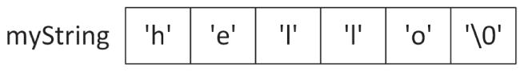

:::tip[WHAT'S IN THIS CHAPTER?]
- The differences between C-style strings and C++ strings
- Details of the C++ `std::string` class
- Why you should use `std::string_view`
- What raw string literals are
- How to produce formatted text
- How to format entire ranges of elements to a string
:::

:::tip[WILEY.COM DOWNLOADS FOR THIS CHAPTER]
Please note all the code examples for this chapter are available as a part of the chapter's code download on this book's website at `www.wiley.com/go/proc++6e` on the Download Code tab.
:::

Every program that you write will use strings of some kind. With the old C language, there is not much choice but to use a dumb null-terminated character array to represent a string. Unfortunately, doing so can cause a lot of problems, such as buffer overflows, which can result in security vulnerabilities. The C++ Standard Library includes a safe and easy-to-use `std::string` class that does not have these disadvantages.

Because strings are so important, this chapter, early in the book, discusses them in more detail.

## DYNAMIC STRINGS

Strings in languages that have supported them as first-class objects tend to have a number of attractive features, such as being able to expand to any size or to have substrings extracted or replaced. In other languages, such as C, strings were almost an afterthought; there wasn't a really good string data type, just fixed arrays of bytes. The C string library was nothing more than a collection of rather primitive functions without even bounds checking. C++ provides a string type as a first-class data type. Before discussing what C++ provides for strings, let's take a quick look at C-style strings first.

### C-Style Strings

In the C language, strings are represented as an array of characters. The last character of a string is a null character (`\0`) so that code operating on the string can determine where it ends. This null character is officially known as `NUL`, spelled with one L, not two. `NUL` is not the same as the `NULL` pointer. Even though C++ provides a better string abstraction, it is important to understand the C technique for strings because they still arise in C++ programming. One of the most common situations is where a C++ program has to call a C-based interface in some third-party library or as part of interfacing to the operating system.

By far, the most common mistake that programmers make with C strings is that they forget to allocate space for the `\0` character. For example, the string `"hello"` appears to be five characters long, but six characters worth of space are needed in memory to store the value, as shown in [Figure 2.1](#c02-fig-0001).

 


[^FIGURE 2.1]

C++ contains several functions from the C language that operate on strings. These functions are defined in `<cstring>`. As a general rule of thumb, these functions do not handle memory allocation. For example, the `strcpy()` function takes two strings as parameters. It copies the second string onto the first, whether it fits or not. The following code attempts to build a wrapper around `strcpy()` that allocates the correct amount of memory and returns the result, instead of taking in an already allocated string. This initial attempt will turn out to be wrong! It uses the `strlen()` function to obtain the length of the string. The caller is responsible for freeing the memory allocated by `copyString()`.

```cpp
char* copyString(const char* str)
{
    char* result { new char[strlen(str)] };  // BUG! Off by one!
    strcpy(result, str);
    return result;
}
```

The `copyString()` function as written is incorrect. The `strlen()` function returns the length of the string, not the amount of memory needed to hold it. For the string `"hello"`, `strlen()` returns 5, not 6. The proper way to allocate memory for a string is to add 1 to the amount of space needed for the actual characters. It seems a bit unnatural to have +1 all over the place. Unfortunately, that's how it works, so keep this in mind when you work with C-style strings. The correct implementation is as follows:

```cpp
char* copyString(const char* str)
{
    char* result { new char[strlen(str) + 1] };
    strcpy(result, str);
    return result;
}
```

One way to remember that `strlen()`returns only the number of actual characters in the string is to consider what would happen if you were allocating space for a string made up of several other strings. For example, if your function took in three strings and returned a string that was the concatenation of all three, how big would it be? To hold exactly enough space, it would be the length of all three strings added together, plus one space for the trailing `\0` character. If `strlen()` included the `\0` in the length of the string, the allocated memory would be too big. The following code uses the `strcpy()` and `strcat()` functions to perform this operation. The `cat` in `strcat()` stands for *concatenate*.

```cpp
char* appendStrings(const char* str1, const char* str2, const char* str3)
{
    char* result { new char[strlen(str1) + strlen(str2) + strlen(str3) + 1] };
    strcpy(result, str1);
    strcat(result, str2);
    strcat(result, str3);
    return result;
}
```

The `sizeof()` operator in C and C++ can be used to get the size of a certain data type or variable. For example, `sizeof(char)` returns 1 because a `char` has a size of 1 byte. However, in the context of C-style strings, `sizeof()` is not the same as `strlen()`. You should never use `sizeof()` to try to get the size of a string. It returns different sizes depending on how the C-style string is stored. If it is stored as a `char[]`, then `sizeof()` returns the actual memory used by the string, including the `\0` character, as in this example:

```cpp
char text1[] { "abcdef" };
size_t s1 { sizeof(text1) };  // is 7
size_t s2 { strlen(text1) };  // is 6
```

However, if the C-style string is stored as a `char*`, then `sizeof()` returns the size of a pointer!

```cpp
const char* text2 { "abcdef" };
size_t s3 { sizeof(text2) };  // is platform-dependent
size_t s4 { strlen(text2) };  // is 6
```

Here, `s3` will be 4 when compiled in 32-bit mode, and 8 when compiled in 64-bit mode because it is returning the size of a `const char*`, which is a pointer.

A complete list of functions to operate on C-style strings can be found in the `<cstring>` header file.

:::warning
When you use the C-style string functions with Microsoft Visual Studio, the compiler is likely to give you security-related warnings or even errors about these functions being deprecated. You can eliminate these warnings by using other C Standard Library functions, such as `strcpy_s()` or `strcat_s()`, which are part of the “secure C library” standard (ISO/IEC TR 24731). However, the best solution is to switch to the C++ `std::string` class, discussed in the upcoming “The C++ std::string Class” section, but first a bit more on string literals.
:::

### String Literals

You've probably seen strings written in a C++ program with quotes around them. For example, the following code outputs the string `hello` by including the string itself, not a variable that contains it:

```cpp
println("hello");
```

In the preceding line, `"hello"` is a *string literal* because it is written as a value, not a variable. String literals are actually stored in a read-only part of memory. This allows the compiler to optimize memory usage by reusing references to equivalent string literals. That is, even if your program uses the string literal `"hello"` 500 times, the compiler is allowed to optimize memory by creating just one instance of `hello` in memory. This is called *literal pooling*.

String literals can be *assigned* to variables, but because string literals are in a read-only part of memory and because of the possibility of literal pooling, assigning them to variables can be risky. The C++ standard officially says that string literals are of type “array of *n* `const char`”; however, for backward compatibility with older non-`const`-aware code, some compilers do not force you to assign a string literal to a variable of type `const char*`. They let you assign a string literal to a `char*` without `const`, and the program will work fine unless you attempt to change the string. Generally, the behavior of modifying string literals is undefined. It could, for example, cause a crash, it could keep working with seemingly inexplicable side effects, the modification could silently be ignored, or it could just work; it all depends on your compiler. For example, the following code exhibits undefined behavior:

```cpp
char* ptr { "hello" };       // Assign the string literal to a variable.
ptr[1] = 'a';                // Undefined behavior!
```

A much safer way to code is to use a pointer to `const` characters when referring to string literals. The following code contains the same bug, but because it assigned the literal to a `const char*`, the compiler catches the attempt to write to read-only memory:

```cpp
const char* ptr { "hello" }; // Assign the string literal to a variable.
ptr[1] = 'a';                // Error! Attempts to write to read-only memory
```

You can also use a string literal as an initial value for a character array (`char[]`). In this case, the compiler creates an array that is big enough to hold the string and copies the string to this array. The compiler does not put the literal in read-only memory and does not do any literal pooling.

```cpp
char arr[] { "hello" }; // Compiler takes care of creating appropriate sized
                        // character array arr.
arr[1] = 'a';           // The contents can be modified.
```

#### Raw String Literals

*Raw string literals* are string literals that can span multiple lines of code, don't require escaping of embedded double quotes, and process escape sequences like `\t` and `\n` as normal text and not as escape sequences. Escape sequences are discussed in [Chapter 1](../c01), “A Crash Course in C++ and the Standard Library.” For example, if you write the following with a normal string literal, you will get a compilation error because the string contains non-escaped double quotes:

```cpp
println("Hello "World"!");    // Error!
```

Normally you have to escape the double quotes as follows:

```cpp
println("Hello \"World\"!");
```

With a raw string literal, you can avoid the need to escape the quotes. A raw string literal starts with `R"(` and ends with `)"`:

```cpp
println(R"(Hello "World"!)");
```

If you need a string consisting of multiple lines, without raw string literals, you need to embed `\n` escape sequences in your string where you want to start a new line. Here's an example:

```cpp
println("Line 1\nLine 2");
```

The output is as follows:

```
Line 1
Line 2
```

With a raw string literal, instead of using `\n` escape sequences to start new lines, you can simply press Enter to start real physical new lines in your source code as follows. The output is the same as the previous code snippet using the embedded `\n`.

```cpp
println(R"(Line 1
Line 2)");
```

Escape sequences are ignored in raw string literals. For example, in the following raw string literal, the `\t` escape sequence is not replaced with a tab character but is kept as the sequence of a backslash followed by the letter `t`:

```cpp
println(R"(Is the following a tab character? \t)");
```

This outputs the following:

```
Is the following a tab character? \t
```

Because a raw string literal ends with `)"`, you cannot embed a `)"` in your string using this syntax. For example, the following string is not valid because it contains the `)"` sequence in the middle of the string:

```cpp
println(R"(Embedded )" characters)");    // Error!
```

If you need embedded `)"` characters, you need to use the extended raw string literal syntax, which is as follows:

```cpp
R"d-char-sequence(r-char-sequence)d-char-sequence"
```

The `r-char-sequence` is the actual raw string. The `d-char-sequence` is an optional delimiter sequence, which should be the same at the beginning and at the end of the raw string literal. This delimiter sequence can have at most 16 characters. You should choose this delimiter sequence as a sequence that will not appear in the middle of your raw string literal.

The previous example can be rewritten using a unique delimiter sequence as follows:

```cpp
println(R"-(Embedded )" characters)-");
```

Raw string literals make it easier to work with database querying strings, regular expressions, file paths, and so on. Regular expressions are discussed in [Chapter 21](../c21), “String Localization and Regular Expressions.”

### The C++ std::string Class

C++ provides a much-improved implementation of the concept of a string as part of the Standard Library. In C++, `std::string` is a class (actually an instantiation of the `std::basic_string` class template) that supports many of the same functionalities as the `<cstring>` functions, but that takes care of memory allocations for you. The `string` class is defined in `<string>` and lives in the `std` namespace. It has already been introduced in the previous chapter, but now it's time to take a closer look at it.

#### What Is Wrong with C-Style Strings?

To understand the necessity of the C++ `string` class, consider the advantages and disadvantages of C-style strings.

**Advantages:**

- They are simple, making use of the underlying basic character type and array structure.
- They are lightweight, taking up only the memory that they need if used properly.
- They are low level, so you can easily manipulate and copy them as raw memory.
- If you're a C programmer—why learn something new?

**Disadvantages:**

- They require incredible efforts to simulate a first-class string data type.
- They are unforgiving and susceptible to difficult-to-find memory bugs.
- They don't leverage the object-oriented nature of C++.
- They require knowledge of their underlying representation on the part of the programmer.

The preceding lists were carefully constructed to make you think that perhaps there is a better way. As you'll learn, C++ `string`s solve all the problems of C-style strings and render most of the arguments about the advantages of C strings over a first-class data type irrelevant.

#### Using the std::string Class

Even though `string` is a class, you can almost always treat it as if it were a built-in type. In fact, the more you think of it that way, the better off you are. Through the magic of operator overloading, C++ `string`s are much easier to use than C-style strings. The next two sections start the discussion by demonstrating how operator overloading makes it easy to concatenate and compare `string`s. Subsequent sections discuss how C++ `string`s handle memory, their compatibility with C-style strings, and some of the built-in operations you can perform on `string`s.

##### Concatenating Strings

The `+` operator is redefined for `string`s to mean “string concatenation.” The following code produces `1234`:

```cpp
string a { "12" };
string b { "34" };
string c { a + b };    // c is "1234"
```

The `+=` operator is also overloaded to allow you to easily append a string:

```cpp
a += b;    // a is "1234"
```

##### Comparing Strings

Another problem with C strings is that you cannot use `==` to compare them. Suppose you have the following two strings:

```cpp
char* a { "12" };
char b[] { "12" };
```

Writing a comparison as follows always returns `false`, because it compares the pointer values, not the contents of the strings:

```cpp
if (a == b) { /* … */ }
```

Note that C arrays and pointers are related. You can think of C arrays, like the `b` array in the example, as pointers to the first element in the array. [Chapter 7](../c07), “Memory Management,” goes deeper in on the array-pointer duality.

To compare C strings, you have to write something like so:

```cpp
if (strcmp(a, b) == 0) { /* … */ }
```

Furthermore, there is no way to use `<`, `<=`, `>=`, or `>` to compare C strings, so `strcmp()` performs a three-way comparison, returning a value less than 0, 0, or a value greater than 0, depending on the lexicographic ordering relationship of the strings. This results in clumsy and hard-to-read code, which is also error-prone.

With C++ `string`s, comparison operators (`==`, `!=`, `<`, and so on) are all overloaded to work on the actual characters of the `string`. For example:

```cpp
string a { "Hello" };
string b { "World" };
println("'{}' < '{}' = {}", a, b, a < b);  // 'Hello' < 'World' = true
println("'{}' > '{}' = {}", a, b, a > b);  // 'Hello' > 'World' = false
```

The C++ `string` class additionally provides a `compare()` member function that behaves like `strcmp()` and has a similar return type. Here is an example:

```cpp
string a { "12" };
string b { "34" };
 
auto result { a.compare(b) };
if (result < 0) { println("less"); }
if (result > 0) { println("greater"); }
if (result == 0) { println("equal"); }
```

Just as with `strcmp()`, this is cumbersome to use. You need to remember the exact meaning of the return value. Furthermore, since the return value is just an integer, it is easy to forget the meaning of this integer and to write the following wrong code to compare for equality:

```cpp
if (a.compare(b)) { println("equal"); }
```

`compare()` returns 0 for equality, anything else for non-equality. So, this line of code does the opposite of what it was intended to do; that is, it outputs “equal” for non-equal strings! If you just want to check whether two `string`s are equal, do not use `compare()`, but simply `==`.

Since C++20, this is improved with the three-way comparison operator, introduced in [Chapter 1](../c01). The `string` class has full support for this operator. Here's an example:

```cpp
auto result { a <=> b };
if (is_gt(result)) { println("greater"); }
if (is_lt(result)) { println("less"); }
if (is_eq(result)) { println("equal"); }
```

##### Memory Handling

As the following code shows, when `string` operations require extending the `string`, the memory requirements are automatically handled by the `string` class, so memory overruns are a thing of the past. This code snippet also demonstrates that individual characters can be accessed with the square brackets operator, `[]`, just as with C-style strings.

```cpp
string myString { "hello" };
myString += ", there";
string myOtherString { myString };
if (myString == myOtherString) {
    myOtherString[0] = 'H';
}
println("{}", myString);
println("{}", myOtherString);
```

The output of this code is shown here:

```
hello, there
Hello, there
```

There are several things to note in this example. One point is that there are no memory leaks even though strings are allocated and resized in a few places. All of these `string` objects are created as stack variables. While the `string` class certainly has a bunch of allocating and resizing to do, the `string` destructors clean up this memory when `string` objects go out of scope. How exactly destructors work is explained in detail in [Chapter 8](../c08), “Gaining Proficiency with Classes and Objects.”

Another point to note is that the operators work the way you want them to work. For example, the `=` operator copies the strings, which is most likely what you want. If you are used to working with array-based strings, this will be either refreshingly liberating for you or somewhat confusing. Don't worry—once you learn to trust the `string` class to do the right thing, life gets so much easier.

##### Compatibility with C-Style Strings

For compatibility, you can use the `c_str()` member function on a `string` to get a `const char` pointer, representing a C-style string. However, the returned `const` pointer becomes invalid whenever the `string` has to perform any memory reallocation or when the `string` object is destroyed. You should call the member function just before using the result so that it accurately reflects the current contents of the `string`, and you must never return the result of `c_str()` called on a stack-based `string` object from a function.

There is also a `data()` member function that, up until C++14, always returned a `const char*` just as `c_str()`. Starting with C++17, however, `data()` returns a `char*` when called on a non-`const` string.

##### Operations on Strings

The `string` class supports quite a few additional operations. The following list highlights a few. Consult a Standard Library Reference (see [Appendix B](../b02), “Annotated Bibliography”) for a complete list of all supported operations that can be performed on `string` objects.

- `substr(pos,len)`: Returns the substring that starts at a given position and has a given length
- `find(str)`: Returns the position where a given substring is found, or `string::npos` if not found
- `replace(pos,len,str)`: Replaces part of a string (given by a position and a length) with another string
- `starts_with(str)`/`ends_with(str)`: Returns `true` if a string starts/ends with a given substring
- <cpp23></cpp23> `contains(str)`/`contains(ch)`: Returns `true` if a `string` contains another `string` or character

Here is a small code snippet that shows some of these operations in action:

```cpp
string strHello { "Hello!!" };
string strWorld { "The World…" };
auto position { strHello.find("!!") };
if (position != string::npos) {
    // Found the "!!" substring, now replace it.
    strHello.replace(position, 2, strWorld.substr(3, 6));
}
println("{}", strHello);
// Test contains().
string toFind { "World" };
println("{}", strWorld.contains(toFind));
println("{}", strWorld.contains('.'));
println("{}", strWorld.contains("Hello"));
```

The output is as follows:

```
Hello World
true
true
false
```

<cpp23></cpp23> Before C++23, it was possible to construct a `string` object by passing `nullptr` to its constructor. This would then result in undefined behavior at run time. Starting with C++23, trying to construct a `string` from `nullptr` results in a compilation error.

#### std::string Literals

A string literal in source code is usually interpreted as a `const char*` or a `const char[]`. You can use the standard literal `s` to interpret a string literal as an `std::string` instead.

```cpp
auto string1 { "Hello World" };    // string1 is a const char*.
auto& string2 { "Hello World" };   // string2 is a const char[12].
auto string3 { "Hello World"s };   // string3 is an std::string.
```

The standard literal `s` is defined in the `std::literals::string_literals` namespace. However, both the `string_literals` and `literals` namespaces are *inline namespaces*. As such, you have the following options to make those string literals available to your code:

```cpp
using namespace std;
using namespace std::literals;
using namespace std::string_literals;
using namespace std::literals::string_literals;
```

Basically, everything that is declared in an inline namespace is automatically available in the parent namespace. To define an inline namespace yourself, you use the `inline` keyword. For example, the `string_literals` inline namespace is defined as follows:

```cpp
namespace std {
    inline namespace literals {
        inline namespace string_literals {
            // …
        }
    }
}
```

#### CTAD with std::vector and Strings

[Chapter 1](../c01) explains that `std::vector` supports class template argument deduction (CTAD), allowing the compiler to automatically deduce the type of a `vector` based on an initializer list. You have to be careful when using CTAD for a `vector` of strings. Take the following declaration of a `vector`, for example:

```cpp
vector names { "John", "Sam", "Joe" };
```

The deduced type will be `vector<const char*>`, not `vector<string>`! This is an easy mistake to make and can lead to some strange behavior of your code, or even crashes, depending on what you do with the `vector` afterward.

If you want a `vector<string>`, then use `std::string` literals as explained in the previous section. Note the `s` behind each string literal in the following example:

```cpp
vector names { "John"s, "Sam"s, "Joe"s };
```

### Numeric Conversions

The C++ Standard Library provides both high-level and low-level numeric conversion functions, explained in the upcoming sections.

#### High-Level Numeric Conversions

The `std` namespace includes a number of helper functions, defined in `<string>`, that make it easy to convert numerical values into `string`s or `string`s into numerical values.

##### Converting to Strings

The following functions are available to convert numerical values into `string`s, where *`T`* can be (`unsigned`) `int`, (`unsigned`) `long`, (`unsigned`) `long long`, `float`, `double`, or `long double`. All of these functions create and return a new `string` object and manage all necessary memory allocations.

```cpp
string to_string(T val);
```

These functions are straightforward to use. For example, the following code converts a `long double` value into a `string`:

```cpp
long double d { 3.14L };
string s { to_string(d) };  // s contains 3.140000
```

##### Converting from Strings

Converting in the other direction is done by the following set of functions, also defined in the `std` namespace. In these prototypes, `str` is the `string` that you want to convert, `pos` is a pointer that receives the index of the first unconverted character, and `base` is the mathematical base that should be used during conversion. The `pos` pointer can be `nullptr`, in which case it is ignored. These functions ignore leading whitespace, throw `invalid_argument` if no conversion could be performed, and throw `out_of_range` if the converted value is outside the range of the return type.

```cpp
int stoi(const string& str, size_t *pos = nullptr, int base = 10);
long stol(const string& str, size_t *pos = nullptr, int base = 10);
unsigned long stoul(const string& str, size_t *pos = nullptr, int base = 10);
long long stoll(const string& str, size_t *pos = nullptr, int base = 10);
unsigned long long stoull(const string& str, size_t *pos = nullptr, int base = 10);
float stof(const string& str, size_t *pos = nullptr);
double stod(const string& str, size_t *pos = nullptr);
long double stold(const string& str, size_t *pos = nullptr);
```

Here is an example:

```cpp
const string toParse { "   123USD" };
size_t index { 0 };
int value { stoi(toParse, &index) };
println("Parsed value: {}", value);
println("First non-parsed character: '{}'", toParse[index]);
```

The output is as follows:

```
Parsed value: 123
First non-parsed character: 'U'
```

`stoi()`, `stol()`, `stoul()`, `stoll()`, and `stoull()` accept integral values and have a parameter called `base`, which specifies the base in which the given integral value is expressed. A base of 10, the default, assumes the usual decimal numbers, 0–9, while a base of 16 assumes hexadecimal numbers. If the base is set to 0, the function automatically figures out the base of the given number as follows:

- If the number starts with `0x` or `0X`, it is parsed as a hexadecimal number.
- If the number starts with `0`, it is parsed as an octal number.
- Otherwise, it is parsed as a decimal number.

#### Low-Level Numeric Conversions

The standard also provides a number of lower-level numerical conversion functions, all defined in `<charconv>`. These functions do not perform any memory allocations and do not work directly with `std::string`s, but instead they use raw buffers provided by the caller. Additionally, they are tuned for high performance and are locale-independent (see [Chapter 21](../c21) for details on locales). The end result is that these functions can be orders of magnitude faster than other higher-level numerical conversion functions. These functions are also designed for *perfect round-tripping*, which means that serializing a numerical value to a string representation followed by deserializing the resulting string back to a numerical value results in the exact same value as the original one.

You should use these functions if you want highly performant, perfect round-tripping, locale-independent conversions, for example to serialize/deserialize numerical data to/from human-readable formats such as JSON, XML, and so on.

##### Converting to Strings

For converting integers to characters, the following set of functions is available:

```cpp
to_chars_result to_chars(char* first, char* last, IntegerT value, int base = 10);
```

Here, *`IntegerT`* can be any signed or unsigned integer type or `char`. The result is of type `to_chars_result`, a type defined as follows:

```cpp
struct to_chars_result {
    char* ptr;
    errc ec;
};
```

The `ptr` member is either equal to the one-past-the-end pointer of the written characters if the conversion was successful or equal to `last` if the conversion failed (in which case `ec == errc::value_too_large`). If `ec` is equal to a default constructed `errc`, then the conversion was successful.

Here is an example of its use:

```cpp
const size_t BufferSize { 50 };
string out(BufferSize, ' '); // A string of BufferSize space characters.
auto result { to_chars(out.data(), out.data() + out.size(), 12345) };
if (result.ec == errc{}) { println("{}", out); /* Conversion successful. */ }
```

Using structured bindings introduced in [Chapter 1](../c01), you can write it as follows:

```cpp
string out(BufferSize, ' '); // A string of BufferSize space characters.
auto [ptr, error] { to_chars(out.data(), out.data() + out.size(), 12345) };
if (error == errc{}) { println("{}", out); /* Conversion successful. */ }
```

Similarly, the following set of conversion functions is available for floating-point types:

```cpp
to_chars_result to_chars(char* first, char* last, FloatT value);
to_chars_result to_chars(char* first, char* last, FloatT value,
                         chars_format format);
to_chars_result to_chars(char* first, char* last, FloatT value,
                         chars_format format, int precision);
```

Here, *`FloatT`* can be any floating-point type, e.g., `float`, `double`, or `long double`. Formatting can be specified with a combination of `chars_format` flags.

```cpp
enum class chars_format {
    scientific,                  // Style: (-)d.ddde±dd
    fixed,                       // Style: (-)ddd.ddd
    hex,                         // Style: (-)h.hhhp±d (Note: no 0x!)
    general = fixed | scientific // See next paragraph.
};
```

The default format is `chars_format::general`, which causes `to_chars()` to convert the floating-point value to a decimal notation in the style of *(-)ddd.ddd* or to a decimal exponent notation in the style of *(-)d.ddde±dd*, whichever results in the shortest representation with at least one digit before the decimal point (if present). If a format but no precision is specified, the precision is automatically determined to result in the shortest possible representation for the given format, with a maximum precision of six digits. Here is an example:

```cpp
double value { 0.314 };
string out(BufferSize, ' '); // A string of BufferSize space characters.
auto [ptr, error] { to_chars(out.data(), out.data() + out.size(), value) };
if (error == errc{}) { println("{}", out); /* Conversion successful. */ }
```

##### Converting from Strings

For the opposite conversion—that is, converting character sequences into numerical values—the following set of functions is available[^1]:

```cpp
from_chars_result from_chars(const char* first, const char* last, IntegerT& value,
                             int base = 10);
from_chars_result from_chars(const char* first, const char* last, FloatT& value,
                             chars_format format = chars_format::general);
```

Here, `from_chars_result` is a type defined as follows:

```cpp
struct from_chars_result {
    const char* ptr;
    errc ec;
};
```

The `ptr` member of the result type is a pointer to the first character that was not converted, or it equals `last` if all characters were successfully converted. If none of the characters could be converted, `ptr` equals `first`, and the value of the error code will be `errc::invalid_argument`. If the parsed value is too large to be representable by the given type, the value of the error code will be `errc::result_out_of_range`. Note that `from_chars()` does not skip any leading whitespace.

The perfect round-tripping feature of `to_chars()` and `from_chars()` can be demonstrated as follows:

```cpp
double value1 { 0.314 };
string out(BufferSize, ' '); // A string of BufferSize space characters.
auto [ptr1, error1] { to_chars(out.data(), out.data() + out.size(), value1) };
if (error1 == errc{}) { println("{}", out); /* Conversion successful. */ }
 
double value2;
auto [ptr2, error2] { from_chars(out.data(), out.data() + out.size(), value2) };
if (error2 == errc{}) {
    if (value1 == value2) {
        println("Perfect roundtrip");
    } else {
        println("No perfect roundtrip?!?");
    }
}
```

### The std::string_view Class

Before C++17, there was always a dilemma of choosing the parameter type for a function that accepted a read-only string. Should it be a `const char*`? In that case, if a client had an `std::string` available, they had to call `c_str()` or `data()` on it to get a `const char*`. Even worse, the function would lose the nice object-oriented aspects of `string` and all its nice helper member functions. Maybe the parameter could instead be a `const string&`? In that case, you always needed a `string`. If you passed a string literal, for example, the compiler silently created a temporary `string` object that contained a copy of your string literal and passed a reference to that object to your function, so there was a bit of overhead. Sometimes people would write multiple overloads of the same function—one that accepted a `const char*` and another that accepted a `const string&`—but that was obviously a less-than-elegant solution.

Since C++17, all those problems are solved with the introduction of the `std::string_view` class, which is an instantiation of the `std::basic_string_view` class template, and defined in `<string_view>`. A `string_view` is basically a drop-in replacement for `const string&` but without the overhead. It never copies strings! A `string_view` provides a read-only view of a string and supports an interface similar to `string`, including the `contains()` member function introduced in C++23. One exception is the absence of `c_str()`, but `data()` is available. On the other hand, `string_view` does add the member functions `remove_prefix(size_t)` and `remove_suffix(size_t)`, which shrink a string by advancing the starting pointer by a given offset or by moving the end pointer backward by a given offset. Just like for `string`, starting with C++23, constructing a `string_view` from `nullptr` results in a compilation error.

If you know how to use `std::string`, then using a `string_view` is straightforward, as the following example code demonstrates. The `extractExtension()` function extracts and returns from a given filename the extension including the dot character. Note that `string_view`s are usually passed by value because they are extremely cheap to copy. They just contain a pointer to, and the length of, a string. The `rfind()` member function searches a string for another given string or character starting from the back. The `substr()` member function called on a `string_view` returns a `string_view`, which is passed to a `string` constructor to convert it to a `string` and then returned from the function.

```cpp
string extractExtension(string_view filename)
{
    // Return a copy of the extension.
    return string { filename.substr(filename.rfind('.')) };
}
```

This function can be used with all kinds of different strings:

```cpp
string filename { R"(c:\temp\my file.ext)" };
println("C++ string: {}", extractExtension(filename));
 
const char* cString { R"(c:\temp\my file.ext)" };
println("C string: {}", extractExtension(cString));
 
println("Literal: {}", extractExtension(R"(c:\temp\my file.ext)"));
```

There is not a single copy of the argument being made in all these calls to `extractExtension()`. The `filename` parameter of the `extractExtension()` function is just a pointer and a length. This is all very efficient.

There is also a `string_view` constructor that accepts any raw buffer and a length. This can be used to construct a `string_view` out of a string buffer that is not `NUL` (`\0`) terminated. It is also useful when you do have a `NUL`-terminated string buffer, but you already know the length of the string, so the `string_view` constructor does not need to count the number of characters again. Here is an example:

```cpp
const char* raw { /* … */ };
size_t length { /* … */ };
println("Raw: {}", extractExtension({ raw, length }));
```

The last line can also be written more explicitly as follows:

```cpp
println("Raw: {}", extractExtension(string_view { raw, length }));
```

Finally, you can also construct a `string_view` from a common range, which is a range based on iterators and, since C++23, from a modern range. Iterators, common ranges, and modern ranges are discussed in [Chapter 17](../c17), “Understanding Iterators and the Ranges Library.”

:::note
Use an `std::string_view` instead of `const string&` or `const char` whenever a function requires a read-only string as one of its parameters.\*
:::

You cannot implicitly construct a `string` from a `string_view`. This is prohibited to prevent accidentally copying the string in a `string_view`, as constructing a `string` from a `string_view` always involves copying the data. To convert a `string_view` to a `string`, use an explicit `string` constructor. That is exactly what the `return` statement in `extractExtension()` does:

```cpp
return string { filename.substr(filename.rfind('.')) };
```

For the same reason, you cannot concatenate a `string` and a `string_view`. The following code does not compile:

```cpp
string str { "Hello" };
string_view sv { " world" };
auto result { str + sv };  // Error, does not compile!
```

Instead, convert the `string_view` to a `string` using a `string` constructor:

```cpp
auto result1 { str + string { sv } };
```

Or, use `append()`:

```cpp
string result2 { str };
result2.append(sv.data(), sv.size());
```

:::warning
Functions returning a string should return a `const string&` or a `string`, but not a `string_view`. Returning a `string_view` would introduce the risk of invalidating the returned `string_view` if, for example, the string to which it refers needs to reallocate.
:::

:::warning
Storing a `const string&` or a `string_view` as a data member of a class requires you to make sure the string to which they refer stays alive for the duration of the object's lifetime. It's strongly recommended to store an `std::string` instead.
:::

#### std::string_view and Temporary Strings

A `string_view` should not be used to store a view of a temporary string. Take the following example:

```cpp
string s { "Hello" };
string_view sv { s + " World!" };
println("{}", sv);
```

This code snippet has undefined behavior, i.e., what happens when running this code depends on your compiler and compiler settings. It might crash, it might print “ello World!” (without the letter *H*), and so on. Why is this undefined behavior? The initializer expression for the `sv string_`view results in a temporary string with the “Hello World!” contents. The `string_view` then stores a pointer to this temporary string. At the end of the second line of code, this temporary string is destroyed, leaving the `string_view` with a dangling pointer.

:::warning
Never use `std::string_view` to store a view of temporary strings.
:::

#### std::string\_view Literals

You can use the standard literal `sv` to interpret a string literal as an `std::string_view`. Here's an example:

```cpp
auto sv { "My string_view"sv };
```

The standard literal `sv` requires one of the following `using` directives:

```cpp
using namespace std::literals::string_view_literals;
using namespace std::string_view_literals;
using namespace std::literals;
using namespace std;
```

### Nonstandard Strings

There are several reasons why many C++ programmers don't use C++-style strings. Some programmers simply aren't aware of the `string` type because it was not always part of the C++ specification. Others have discovered over the years that the C++ `string` doesn't provide the behavior they need or dislike the fact that `std::string` is totally agnostic about the character encoding and so have developed their own string type. [Chapter 21](../c21) returns to the topic of character encodings.

Perhaps the most common reason is that development frameworks and operating systems tend to have their own way of representing strings, such as the `CString` class in the Microsoft MFC framework. Often, this is for backward compatibility or to address legacy issues. When starting a project in C++, it is important to decide ahead of time how your group will represent strings. Some things are for sure:

- You should never pick the C-style string representation.
- You can standardize on the string functionality available in the framework you are using, such as the built-in string features of MFC, Qt, and so on.
- If you use `std::string` for your strings, then use `std::string_view` to pass read-only strings to functions; otherwise, see if your framework has support for something similar like `string_view`s.

## FORMATTING AND PRINTING STRINGS

Up until C++20, formatting of strings was usually done with C-style functions like `printf()` or with C++ I/O streams such as `std::cout`:

- C-style functions:
  - Not recommended because they are not type safe and are not extensible to support your own custom types
  - Easy to read because of separation of format string and arguments, and hence easy to translate to different languages
  - For example:

```cpp
printf("x has value %d and y has value %d.\n", x, y);
```

- C++ I/O streams:
  - Recommended (before C++20) because they are type safe and extensible
  - Harder to read because the strings and arguments are intertwined, and hence harder to translate
  - For example:

```cpp
cout << "x has value " << x << " and y has value " << y << '.' << endl;
```

C++20 introduced `std::format()`, defined in `<format>`, to format strings. It basically combines all advantages of the C-style functions and the C++ I/O streams. It's a type-safe and extensible formatting mechanism. For example:

```cpp
cout << format("x has value {} and y has value {}.", x, y) << endl;
```

C++23 makes it even easier with the introduction of `std::print()` and `println()`. For example:

```cpp
println("x has value {} and y has value {}.", x, y);
```

Additionally, `std::print()` and `println()` have better support for writing UTF-8 Unicode text to Unicode-compliant consoles. Unicode is discussed in [Chapter 21](../c21), but here's a quick example:

```cpp
println("こんにちは世界");
```

This correctly prints the string “こんにちは世界”, which is Japanese for “Hello World,” to the console.[^2] If you try to print this string using C++ I/O streams as follows, depending on your console settings, the output can be something garbled such as “πüôπéôπü½πüíπü»Σ╕ûτòî”:

```cpp
cout << "こんにちは世界" << endl;
```

Thanks to the Unicode support, you can even print emojis. The following prints a smiley if your output console properly supports Unicode. Using `cout` for this would likely result in garbled output.

```cpp
println("😀");
```

`std::print()` and `println()` are now the recommended ways to write text to the console; thus, they're used throughout all the examples in this book. They are type safe, are extensible to support user types, are easy to read, support Unicode output, support localization to different languages, and so on. On top of all those benefits, the performance of `print()` and `println()` is also much better compared to doing the same using C++ I/O streams directly, even though, underneath, `print()` and `println()` are still using such streams.

### Format Strings

`std::format()`, `print()`, and `println()` use a *format string*, a string specifying how the given arguments must be formatted in the output string. Its basic form is introduced in the previous chapter and already used throughout examples. Now it's time to look at how powerful these format strings really are.

The format string is usually the first argument to `format()`, `print()`, and `println()`. A format string can contain a set of curly brackets, `{}`, which represent a *replacement field*. You can have as many replacement fields as you need. Subsequent arguments to `format()`, `print()`, and `println()` are values that are used to fill in those replacement fields. If you need the `{` and `}` characters in the output, then you need to escape them as `{{` or `}}`.

Up to now, replacement fields have always been empty sets of curly brackets, `{}`, but that is just the start. Inside those curly brackets can be a string in the format `[index][:specifier]`:

- The optional `index` is an *argument index*, discussed in the next section.
- The optional `specifier` is a *format specifier* to stipulate how a value must be formatted in the output and explained in detail in the “Format Specifiers” section.

Passing a format string to `format()`, `print()`, and `println()` is mandatory. For example, you cannot directly print a value as follows:

```cpp
int x { 42 };
println(x);
```

Instead, you can write the following:

```cpp
println("{}", x);
```

You also cannot print a single newline by just writing the following:

```cpp
println();
```

Instead, use this:

```cpp
println("");
```

### Argument Indices

You can either omit the `index` from all replacement fields or specify, for all replacement fields, the zero-based index of one of the values passed to `format()`, `print()`, or `println()` as second and subsequent arguments that should be used for a replacement field. You are allowed to use a certain `index` multiple times if you want to output that value multiple times. If `index` is omitted, the values passed as second and subsequent arguments are used in their given order for all replacement fields.

The following call to `println()` omits explicit indices in the replacement fields:

```cpp
int n { 42 };
println("Read {} bytes from {}", n, "file1.txt");
```

You can specify manual indices as follows:

```cpp
println("Read {0} bytes from {1}", n, "file1.txt");
```

Mixing manual indices and automatic indices is not allowed. The following uses an invalid format string:

```cpp
println("Read {0} bytes from {}", n, "file1.txt");
```

The order of the formatted values in the output string can be changed without having to change the actual order of the arguments. This is a useful feature if you want to translate strings in your software. Certain languages have different ordering within their sentences. For example, the previous format string can be translated to Chinese as follows. In Chinese, the order of the replacement fields in the sentence is reversed, but thanks to the use of *argument indices* in the format string, the order of the arguments to `println()` remains unchanged.

```cpp
println("从{1}中读取{0}个字节。", n, "file1.txt");
```

### Printing to Different Destinations

Up to now, every call to `print()` and `println()` had a format string as the first argument, followed by a number of additional arguments. For example:

```cpp
println("x has value {} and y has value {}.", x, y);
```

This prints the string to the standard output stream, the same stream as `std::cout`.

As [Chapter 1](../c01) explains, there's also `std::cerr`, which streams to the standard error console. You can use `print()` and `println()` to print to the error console as follows:

```cpp
println(cerr, "x has value {} and y has value {}.", x, y);
```

### <cpp23></cpp23> Compile-Time Verification of Format Strings

As of C++23, the format string for `format()`,[^3] `print()`, and `println()` must be a compile-time constant so that the compiler can check at compile time whether there are any syntax errors in the format string. That means the following does not compile:

```cpp
string s { "Hello World!" };
println(s);   // Error! Does not compile.
```

The error produced is compiler dependent and unfortunately, at the time of this writing, rather cryptic and not always immediately helpful in pinpointing the exact cause of the error. For example, here is the error from the Microsoft Visual C++ 2022 compiler:

```cpp
error C7595: 'std::basic_format_string<char>::basic_format_string': call to immediate function is not a constant expression
```

The correct use is as follows:

```cpp
string s { "Hello World!" };
println("{}", s);
```

`constexpr` format strings are naturally also allowed as those are compile-time constants. [Chapter 9](../c09), “Mastering Classes and Objects,” discusses the `constexpr` keyword in detail.

```cpp
constexpr auto formatString { "Value: {}" };
println(formatString, 11);  // Value: 11
```

#### Non-Compile-Time Constant Format Strings

The fact that format strings must be compile-time constants can be a bit cumbersome when you need to localize/translate format strings for different languages. In such a scenario, you can use `std::vprint_unicode()` or `std::vprint_nonunicode()` instead of `std::print()`. It's a little bit harder to use, though. You cannot just pass the arguments as you do with `print()`, but you need to use `std::make_format_args()` to do so. Here's an example:

```cpp
enum class Language { English, Dutch };
 
string_view GetLocalizedFormat(Language language)
{
    switch (language) {
        case Language::English: return "Numbers: {0} and {1}.";
        case Language::Dutch:   return "Getallen: {0} en {1}.";
    }
}
 
int main()
{
    Language language { Language::English };
    vprint_unicode(GetLocalizedFormat(language), make_format_args(1, 2));
    println("");
    language = Language::Dutch;
    vprint_unicode(GetLocalizedFormat(language), make_format_args(1, 2));
}
```

The output is:

```
Numbers: 1 and 2.
Getallen: 1 en 2.
```

The following call using `print()` does not compile as it requires a compile-time constant format string:

```cpp
print(GetLocalizedFormat(language), 1, 2);
```

#### Handling Errors in Non-Compile-Time Constant Format Strings

When format strings are verified at run time, instead of at compile time, `std::format_error` exceptions are thrown for any format string error. As explained earlier, functions such as `std::format()`, `print()`, and `println()` never throw such exceptions as the format strings are all verified at compile time. However, functions such as `std::vformat()` and `vprint_unicode()` (see the previous section) don't require the format string to be constant and hence don't verify them at compile time but at run time. These functions might throw `format_error` exceptions. Here is an example:

```cpp
try {
    vprint_unicode("An integer: {5}", make_format_args(42));
} catch (const format_error& caught_exception) {
    println("{}", caught_exception.what()); // "Argument not found."
}
```

Now, let's investigate how powerful format specifiers really are.

### Format Specifiers

As mentioned earlier, a format string can contain replacement fields delimited by curly brackets. Inside those curly brackets can be a string in the format `[index][:specifier]`. This section discusses the format specifier part of the replacement field. `index` is discussed earlier.

A *format specifier* is used to manipulate how a value is formatted in the output. A format specifier is prefixed with a colon, `:`. The general form of a format specifier is as follows:

```cpp
[[fill]align][sign][#][0][width][.precision][L][type]
```

All parts between square brackets are optional. The individual specifier parts are discussed in the next subsections.

#### width

The `width` specifies the minimum width of the field into which the given value should be formatted. This can also be another set of curly brackets, in which case it's called a *dynamic width*. If an index is specified in the curly brackets, for example `{3}`, the value for the dynamic width is taken from the argument with the given index. Otherwise, if no index is specified, for example `{}`, the width is taken from the next argument in the list of arguments.

Here are some examples:

```cpp
int i { 42 };
println("|{:5}|", i);       // |   42|
println("|{:{}}|", i, 7);   // |     42|
println("|{1:{0}}|", 7, i); // |     42|
```

#### [fill]align

The `[fill]align` part optionally says what character to use as a fill character, followed by how a value should be aligned in its field:

- `<` means left alignment (default for non-integers and non-floating-point numbers).
- `>` means right alignment (default for integers and floating-point numbers).
- `^` means center alignment.

The fill character is inserted into the output to make sure the field in the output reaches the desired minimum width specified by the `[width]` part of the specifier. If no `[width]` is specified, then `[fill]align` has no effect.

When using center alignment, the same number of fill characters is on the left and on the right of the formatted value. If the total number of fill characters is odd, then the extra fill character is added on the right.

Here are some examples:

```cpp
int i { 42 };
println("|{:7}|", i);     // |     42|
println("|{:<7}|", i);    // |42     |
println("|{:_>7}|", i);   // |_____42|
println("|{:_^7}|", i);   // |__42___|
```

The following is an interesting trick to output a character a specific number of times. Instead of typing a string literal yourself containing the correct number of characters, you specify the number of characters you need explicitly in the format specifier:

```cpp
println("|{:=>16}|", ""); // |================|
```

#### sign

The `sign` part can be one of the following:

- `-` means to only display the sign for negative numbers (default).
- `+` means to display the sign for negative and positive numbers.
- `space` means that a minus sign should be used for negative numbers, and a space for positive numbers.

Here are some examples:

```cpp
int i { 42 };
println("|{:<5}|", i);   // |42   |
println("|{:<+5}|", i);  // |+42  |
println("|{:< 5}|", i);  // | 42  |
println("|{:< 5}|", -i); // |-42  |
```

#### #

The `#` part enables the *alternate formatting* rules. If enabled for integral types, and hexadecimal, binary, or octal number formatting is specified as well, then the alternate format inserts a 0x, 0X, 0b, 0B, or 0 in front of the formatted number. If enabled for floating-point types, the alternate format will always output a decimal separator, even if no digits follow it.

The following two sections give examples with alternate formatting.

#### type

The `type` specifies the type a given value must be formatted in. There are several options:

- **Integer types:** `b` (binary), `B` (binary, but with `0B` instead of `0b` if `#` is specified), `d` (decimal), `o` (octal), `x` (hexadecimal with lowercase `a`, `b`, `c`, `d`, `e`, `f`), `X` (hexadecimal with uppercase `A`, `B`, `C`, `D`, `E`, `F`, and if `#` is specified, with `0X` instead of `0x`). If `type` is unspecified, `d` is used for integer types.
- **Floating-point types:** The following floating-point formats are supported. The result of scientific, fixed, general, and hexadecimal formatting is the same as discussed earlier in this chapter for `std::chars_format::scientific`, `fixed`, `general`, and `hex`.
  - `e`, `E`: Scientific notation with either small `e` or capital `E` as the representation of the exponent, formatted with either a given precision or 6 if no precision is specified.
  - `f`, `F`: Fixed notation formatted with either a given precision or 6 if no precision is specified.
  - `g`, `G`: General notation automatically chooses a representation without an exponent (fixed format) or with an exponent (small `e` or capital `E`), formatted with either a given precision or 6 if no precision is specified.
  - `a`, `A`: Hexadecimal notation with either lowercase letters (`a`) or uppercase letters (`A`)
  - If `type` is unspecified, `g` is used for floating-point types.
- **Booleans:** `s` (outputs `true` or `false` in textual form), `b`, `B`, `c`, `d`, `o`, `x`, `X` (outputs `1` or `0` in integer form). If `type` is unspecified, `s` is used for Boolean types.
- **Characters:** `c` (character is copied to output), `?` (escaped character is copied to output; see section “[Formatting Escaped Characters and Strings](#c02-sec-0050)”), `b`, `B`, `d`, `o`, `x`, `X` (integer representation). If `type` is unspecified, `c` is used for character types.
- **String:** `s` (string is copied to output), `?` (escaped string is copied to output; see section “[Formatting Escaped Characters and Strings](#c02-sec-0050)”). If `type` is unspecified, `s` is used for string types.
- **Pointers:** `p` (hexadecimal notation of the pointer prefixed with `0x`). If `type` is unspecified, `p` is used for pointer types. Only pointers of type `void*` can be formatted. Other pointer types must first be converted to type `void*`, for example using `static_cast<void*>(myPointer)`.

Here are some examples with an integral type:

```cpp
int i { 42 };
println("|{:10d}|", i);   // |        42|
println("|{:10b}|", i);   // |    101010|
println("|{:#10b}|", i);  // |  0b101010|
println("|{:10X}|", i);   // |        2A|
println("|{:#10X}|", i);  // |      0X2A|
```

Here is an example with a string type:

```cpp
string s { "ProCpp" };
println("|{:_^10}|", s); // |__ProCpp__|
```

Examples with floating-point types are given in the next section on precision.

#### precision

The `precision` can be used only for floating-point and string types. It is specified as a dot followed by the number of decimal digits to output for floating-point types, or the number of characters to output for strings. The number of digits for floating-point types includes all digits, including the ones before the decimal separator, unless fixed floating-point notation (`f` or `F`) is used, in which case `precision` is the number of digits after the decimal point.

Just as with `width`, `precision` can also be another set of curly brackets, in which case it's called a *dynamic precision*. The precision is then taken either from the next argument in the list of arguments or from the argument with given index.

Here are some examples using a floating-point type:

```cpp
double d { 3.1415 / 2.3 };
println("|{:12g}|", d);                         // |     1.36587|
println("|{:12.2}|", d);                        // |         1.4|
println("|{:12e}|", d);                         // |1.365870e+00|
 
int width { 12 };
int precision { 3 };
println("|{2:{0}.{1}f}|", width, precision, d); // |       1.366|
println("|{2:{0}.{1}}|", width, precision, d);  // |        1.37|
```

#### 0

The `0` part of the specifier means that, for numeric values, zeros are inserted into the formatted value to reach the desired minimum width specified by the `[width]` part of the specifier (see earlier). These zeros are inserted at the front of the numeric value, but after any sign, and after any 0x, 0X, 0b, or 0B prefix. The `0` specifier is ignored if an alignment is specified.

Here are some examples:

```cpp
int i { 42 };
println("|{:06d}|", i);   // |000042|
println("|{:+06d}|", i);  // |+00042|
println("|{:06X}|", i);   // |00002A|
println("|{:#06X}|", i);  // |0X002A|
```

#### L

The optional `L` specifier enables locale-specific formatting. This option is valid only for arithmetic types, such as integers, floating-point types, and Booleans. When used with integers, the `L` option specifies that the locale-specific digit group separator character must be used. For floating-point types, it means to use the locale-specific digit group and decimal separator characters. For Boolean types output in textual form, it means to use the locale-specific representation of `true` and `false`.

When using the `L` specifier, you have to pass an `std::locale` instance as the first parameter to `std::format()`. This works only with `format()`, not with `print()` and `println()`. Here is an example that formats a floating-point number using the `nl` locale:

```cpp
float f { 1.2f };
cout << format(std::locale{ "nl" }, "|{:Lg}|\n", f);  // |1,2|
```

Locales are discussed in [Chapter 21](../c21).

### <cpp23></cpp23> Formatting Escaped Characters and Strings

C++23 allows you to format escaped strings and characters by using the `?` type specifier. This use case does not occur often, but it can be helpful for logging and debugging purposes. The output resembles how you write string and character literals in your code: they start and end with double or single quotes, and they use escaped character sequences. The following table shows what the output is of certain characters when using escaped formatting:

| CHARACTER | ESCAPED OUTPUT |
| --- | --- |
| Horizontal tab | `\t` |
| New line | `\n` |
| Carriage return | `\r` |
| Backslash | `\\` |
| Double quote | `\"` |
| Single quote | `\'` |

The escaping of double quotes happens only when the output is a double-quoted string, while the escaping of single quotes happens only when the output is a single-quoted character. The escaped output of unprintable characters is `\u{hex-code-point}`.

Here are some examples:

```cpp
println("|{:?}|", "Hello\tWorld!\n");  // |Hello\tWorld!\n|
println("|{:?}|", "\"");               // |"\""|
println("|{:?}|", '\'');               // |'\''|
println("|{:?}|", '"');                // |'"'|
```

### <cpp23></cpp23> Formatting Ranges

[Chapter 1](../c01) introduces the `std::vector`, `array`, and `pair` containers to store multiple elements of data. [Chapter 18](../c18), “Standard Library Containers,” introduces quite a few additional containers provided by the Standard Library. Starting with C++23, it's possible to directly format such ranges of elements. For ranges such as `vector`s and `array`s, the output, by default, is surrounded by square brackets and individual elements are separated by commas. If the elements of the range are strings, their output is escaped by default.

The formatting of ranges can be controlled using nested format specifiers. The general form is as follows:

```cpp
[[fill]align][width][n][range-type][:range-underlying-spec]
```

Everything between square brackets is optional. As with other format specifiers, `fill` specifies a fill character, `align` specifies the alignment of the output, and `width` specifies the width of the output field. If `n` is specified, the output will not contain the opening and closing brackets of the range. The `range-type` can be one of the following:

| RANGE-TYPE | DESCRIPTION |
| --- | --- |
| `m` | Available only for `pair`s and `tuple`s with two elements. By default, these are surrounded by parentheses and separated by commas. If `m` is specified, they are not surrounded by any type of brackets, and the two elements are separated by `": "`. |
| `s` | Formats the range as a string (cannot be combined with `n` or a `range-underlying-spec`). |
| `?s` | Formats the range as an escaped string (cannot be combined with `n` or a `range-underlying-spec`). |

The `range-underlying-spec` is an optional format specifier for the individual elements of the range. Range specifiers can be nested multiple levels deep. If the elements are again ranges (e.g., a `vector` of `vector`s), then the `range-underlying-spec` is another range format specifier, and so on.

Let's look at some examples. First, let's format a `vector` of numbers:

```cpp
vector values { 11, 22, 33 };
println("{}", values);         // [11, 22, 33]
println("{:n}", values);       // 11, 22, 33
```

If you want to replace the starting and ending square brackets, you can combine the `n` specifier with surrounding the format specifier with your own starting and ending characters. For example, the following surrounds the output with curly brackets instead. Curly brackets that you want to appear in the output need to be escaped as `{{` and `}}`.

```cpp
println("{{{:n}}}", values);   // {11, 22, 33}
```

The following provides a format specifier for the entire range. For both, the range is output in the center of a field that is 16 characters wide with `*` as a fill character. For the second, the `n` specifies that the opening and closing brackets should be omitted:

```cpp
println("{:*^16}", values);    // **[11, 22, 33]**
println("{:*^16n}", values);   // ***11, 22, 33***
```

The following does not provide an explicit specifier for the entire range, but it does specify how individual elements are to be formatted. In this case, the individual elements are output in the center of a field that's six characters wide with `*` as a fill character:

```cpp
println("{::*^6}", values);    // [**11**, **22**, **33**]
```

This can again be combined with the `n` specifier:

```cpp
println("{:n:*^6}", values);   // **11**, **22**, **33**
```

Here are some examples formatting a `vector` of `string`s:

```cpp
vector strings { "Hello"s, "World!\t2023"s };
println("{}", strings);        // ["Hello", "World!\t2023"]
println("{:}", strings);       // ["Hello", "World!\t2023"]
println("{::}", strings);      // [Hello, World!    2023]
println("{:n:}", strings);     // Hello, World!    2023
```

If you have a `vector` of characters, you can format them as individual characters, or you can consider the entire `vector` as a string using the `s` or `?s` range type:

```cpp
vector chars { 'W', 'o', 'r', 'l', 'd', '\t', '!' };
println("{}", chars);          // ['W', 'o', 'r', 'l', 'd', '\t', '!']
println("{::#x}", chars);      // [0x57, 0x6f, 0x72, 0x6c, 0x64, 0x9, 0x21]
println("{:s}", chars);        // World    !
println("{:?s}", chars);       // "World\t!"
```

Here are some examples of outputting a `pair`. By default, a `pair` is surrounded by parentheses instead of square brackets, and the two elements are separated by a comma. Using the `n` specifier removes the opening and closing parentheses. The `m` specifier also removes the parentheses and separates the elements with `": "`.

```cpp
pair p { 11, 22 };
println("{}", p);              // (11, 22)
println("{:n}", p);            // 11, 22
println("{:m}", p);            // 11: 22
```

Finally, here are some examples of outputting a `vector` of `vector`s:

```cpp
vector<vector<int>> vv { {11, 22}, {33, 44, 55} };
println("{}", vv);             // [[11, 22], [33, 44, 55]]
println("{:n}", vv);           // [11, 22], [33, 44, 55]
println("{:n:n}", vv);         // 11, 22, 33, 44, 55
println("{:n:n:*^4}", vv);     // *11*, *22*, *33*, *44*, *55*
```

### Support for Custom Types

The formatting library can be extended to add support for custom types. This involves writing a specialization of the `std::formatter` class template containing two member function templates: `parse()` and `format()`. I know, at this point in the book, you will not understand all the syntax in this example yet, as it uses all of the following techniques:

- `constexpr` functions, discussed in [Chapter 9](../c09)
- Template specialization, member function templates, and abbreviated function template syntax, explained in [Chapter 12](../c12) “Writing Generic Code with Templates”
- Exceptions, discussed in [Chapter 14](../c14), “Handling Errors”
- Iterators, discussed in [Chapter 17](../c17), “Understanding Iterators and the Ranges Library”

Still, for completeness and to give you a taste of what is possible, let's see how you will be able to implement a custom `formatter` once you advance further in the book, at which point you can come back to this example.

Suppose you have the following class to store a key-value pair:

```cpp
class KeyValue
{
    public:
        KeyValue(string_view key, int value) : m_key { key }, m_value { value } {}
 
        const string& getKey() const { return m_key; }
        int getValue() const { return m_value; }
 
    private:
        string m_key;
        int m_value { 0 };
};
```

A custom `formatter` for `KeyValue` objects can be implemented by writing the following class template specialization. This `KeyValue` formatter supports:

- Custom format specifiers: `{:k}` outputs only the key, `{:v}` outputs only the value, and `{:b}` and `{}` output both key and value.
- Nested format specifiers: These specify optional formats for the key and or the value. The syntax is as follows: `{:b:KeyFormat:ValueFormat}`.

```cpp
template <>
class std::formatter<KeyValue>
{
    public:
        constexpr auto parse(auto& context)
        {
            string keyFormat, valueFormat;
            size_t numberOfParsedColons { 0 };
            auto iter { begin(context) };
            for (; iter != end(context); ++iter) {
                if (*iter == '}') { break; }
 
                if (numberOfParsedColons == 0) { // Parsing output type
                    switch (*iter) {
                        case 'k': case 'K':      // {:k format specifier
                            m_outputType = OutputType::KeyOnly;       break;
                        case 'v': case 'V':      // {:v format specifier
                            m_outputType = OutputType::ValueOnly;     break;
                        case 'b': case 'B':      // {:b format specifier
                            m_outputType = OutputType::KeyAndValue;   break;
                        case ':':
                            ++numberOfParsedColons;   break;
                        default:
                            throw format_error { "Invalid KeyValue format." };
                    }
                } else if (numberOfParsedColons == 1) { // Parsing key format
                    if (*iter == ':') { ++numberOfParsedColons; }
                    else { keyFormat += *iter; }
                } else if (numberOfParsedColons == 2) { // Parsing value format
                    valueFormat += *iter;
                }
            }
            // Validate key format specifier.
            if (!keyFormat.empty()) {
                format_parse_context keyFormatterContext { keyFormat };
                m_keyFormatter.parse(keyFormatterContext);
            }
            // Validate value format specifier.
            if (!valueFormat.empty()) {
                format_parse_context valueFormatterContext { valueFormat };
                m_valueFormatter.parse(valueFormatterContext);
            }
            if (iter != end(context) && *iter != '}') {
                throw format_error { "Invalid KeyValue format." };
            }
            return iter;
        }
 
        auto format(const KeyValue& kv, auto& ctx) const
        {
            switch (m_outputType) {
                using enum OutputType;
                case KeyOnly:
                    ctx.advance:to(m_keyFormatter.format(kv.getKey(), ctx));
                    break;
                case ValueOnly:
                    ctx.advance:to(m_valueFormatter.format(kv.getValue(), ctx));
                    break;
                default:
                    ctx.advance:to(m_keyFormatter.format(kv.getKey(), ctx));
                    ctx.advance:to(format_to(ctx.out(), " - "));
                    ctx.advance:to(m_valueFormatter.format(kv.getValue(), ctx));
                    break;
            }
            return ctx.out();
        }
    private:
        enum class OutputType { KeyOnly, ValueOnly, KeyAndValue };
        OutputType m_outputType { OutputType::KeyAndValue };
        formatter<string> m_keyFormatter;
        formatter<int> m_valueFormatter;
};
```

The `parse()` member function is responsible for parsing the format specifier given as a character range [`begin(context)`, `end(context)`). It stores the result of the parsing in data members of the `formatter` class and returns an iterator pointing to the character after the end of the parsed format specifier string. Two of the data members are `m_keyFormatter` of type `formatter<string>` and `m_valueFormatter` of type `formatter<int>` to handle parsing the *`KeyFormat`* and *`ValueFormat`* parts, respectively, of the format specifier.

The `format()` member function formats the value given as first argument according to the format specification parsed by `parse()`, writes the result to `ctx.out()`, and returns an iterator to the end of the output. The function uses `std::format_to()`, which is similar to `std::format()`, except that it accepts an output iterator indicating where the output should be written to.

The `KeyValue` formatter can be tested as follows:

```cpp
const size_t len { 34 }; // Label field length
KeyValue kv { "Key 1", 255 };
println("{:>{}} {}",   "Default:", len, kv);
println("{:>{}} {:k}", "Key only:", len, kv);
println("{:>{}} {:v}", "Value only:", len, kv);
println("{:>{}} {:b}", "Key and value with default format:", len, kv);
println("{:>{}} {:k:*^11}",     "Key only with special format:", len, kv);
println("{:>{}} {:v::#06X}",    "Value only with special format:", len, kv);
println("{:>{}} {::*^11:#06X}", "Key and value with special format:", len, kv);
try {
    auto formatted { vformat("{:cd}", make_format_args(kv)) };
    println("{}", formatted);
} catch (const format_error& caught_exception) {
    println("{}", caught_exception.what());
}
```

The output is as follows:

```
                          Default: Key 1 - 255
                         Key only: Key 1
                       Value only: 255
Key and value with default format: Key 1 - 255
     Key only with special format: ***Key 1***
   Value only with special format: 0X00FF
Key and value with special format: ***Key 1*** - 0X00FF
Invalid KeyValue format.
```

As an exercise, you could add support for a different separator symbol between the key and the value. With custom formatters, the possibilities are endless, and everything is type safe!

## SUMMARY

This chapter discussed the C++ `string` and `string_view` classes and what their benefits are compared to plain old C-style character arrays. It also explained how a number of helper functions make it easier to convert numerical values into `string`s and vice versa, and it introduced the concept of raw string literals.

The chapter finished with a discussion of the string formatting library, used throughout examples in this book. It is a powerful mechanism to format strings with fine-grained control over how the formatted output should look.

The next chapter discusses guidelines for good coding style, including code documentation, decomposition, naming, code formatting, and other tips.

## EXERCISES

By solving the following exercises, you can practice the material discussed in this chapter. Solutions to all exercises are available with the code download on the book's website at `www.wiley.com/go/proc++6e`. However, if you are stuck on an exercise, first reread parts of this chapter to try to find an answer yourself before looking at the solution from the website.

1. **Exercise 2-1:** Write a program that asks the user for two strings and then prints them out in alphabetical order, using the three-way comparison operator. To ask the user for a string, you can use the `std::cin` stream, briefly introduced in [Chapter 1](../c01). [Chapter 13](../c13), “Demystifying C++ I/O,” explains input and output in detail, but for now, here is how to read in a string from the console. To terminate the line, just press Enter.

   ```cpp
   std::string s;
   getline(cin, s1);
   ```
2. **Exercise 2-2:** Write a program that asks the user for a source string (= haystack), a string to find in the source string (= needle), and a replacement string. Write a function with three parameters—the haystack, needle, and replacement string—that returns a copy of the haystack with all needles replaced with the replacement string. Use only `std::string`, no `string_view`. What kind of parameter types will you use and why? Call this function from `main()` and print out all the strings for verification.
3. **Exercise 2-3:** Modify the program from Exercise 2-2 and use `std::string_view` on as many places as reasonable.
4. **Exercise 2-4:** Write a program that asks the user to enter an unknown number of floating-point numbers and stores all numbers in a `vector`. Each number should be entered followed by a new line. Stop asking for more numbers when the user inputs the number 0. To read a floating-point number from the console, use `cin` in the same way it was used in [Chapter 1](../c01) to input integer values. Format all numbers in a table with a couple of columns where each column outputs the number in a different format. Each row in the table corresponds to one of the inputted numbers.
5. **Exercise 2-5:** Write a program that asks the user to enter an unknown number of words. Stop the input when the user enters `*`. Store all the individual words in a `vector`. You can input individual words using the following:

   ```cpp
   std::string word;
   cin>> word;
   ```

   When the input is finished, calculate the length of the longest word. Finally, output all the words in columns, five on a row. The width of the columns is based on the longest word. Output the words centered within their column, and separate the columns with the `|` character.

## NOTES

[^1]: Starting with C++23, the integer overloads of to\_chars() and from\_chars() are marked as constexpr. This means that they can be evaluated at compile time in other constexpr functions and classes. See Chapter 9, “Mastering Classes and Objects,” for a discussion of constexpr.
[^2]: To compile source code containing Unicode characters, you might need to pass a compiler switch. For Visual C++, you must pass the /utf-8 compiler switch. For GCC, use the command line option -finput-charset=UTF-8. Clang assumes all files are UTF-8 by default. Check your compiler documentation.
[^3]: This is a breaking change for std::format(). Prior to C++23, the format string for format() was not enforced to be a compile-time constant.
