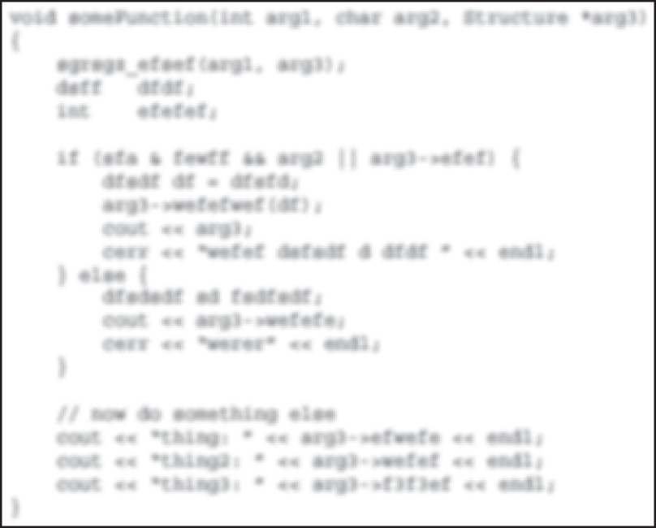
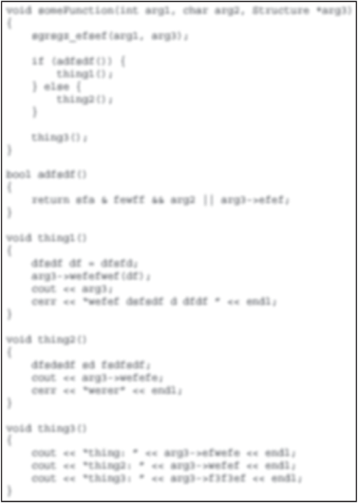

:::tip[WHAT'S IN THIS CHAPTER?]
- The importance of documenting your code and what kind of commenting styles you can use
- What decomposition means and how to use it
- What naming conventions are
- What code formatting rules are
:::

If you're going to spend several hours each day in front of a keyboard writing code, you should take some pride in all that work. Writing code that gets the job done is only part of a programmer's work. After all, anybody can learn the fundamentals of coding. It takes a true master to code with style.

This chapter explores the question of what makes stylistically good code. Along the way, you'll see several approaches to C++ style. As you will discover, simply changing the style of code can make it appear very different. For example, C++ code written by Windows programmers often has its own style, using Windows conventions. It almost looks like a completely different language than C++ code written by macOS programmers. Exposure to several different styles will help you avoid that sinking feeling you get when opening a C++ source file that barely resembles the C++ you thought you knew.

## THE IMPORTANCE OF LOOKING GOOD

Writing code that is stylistically “good” takes time. You probably don't need much time to whip together a quick-and-dirty program to parse an XML file. Writing the same program with functional decomposition, adequate comments, and a clean structure would take you more time. Is it really worth it?

### Thinking Ahead

How confident would you be in your code if a new programmer had to work with it a year from now? A friend of mine, faced with a growing mess of web application code, encouraged his team to think about a hypothetical intern who would be starting in a year. How would this poor intern ever get up to speed on the code base if there were no documentation and scary multiple-page functions? When you're writing code, imagine that somebody new or even you yourself will have to maintain it in the future. Will you even still remember how it works? What if you're not available to help? Well-written code avoids these problems because it is easy to read and understand.

### Elements of Good Style

It is difficult to enumerate the characteristics of code that make it “stylistically good.” Over time, you'll find styles that you like and notice useful techniques in code that others wrote. Perhaps more important, you'll encounter horrible code that teaches you what to avoid. However, good code shares several universal tenets that are explored in this chapter:

- Documentation
- Decomposition
- Naming
- Use of the language
- Formatting

## DOCUMENTING YOUR CODE

In the programming context, documentation usually refers to comments contained in the source files. Comments are your opportunity to tell the world what was going through your head when you wrote the accompanying code. They are a place to say anything that isn't obvious from looking at the code itself.

### Reasons to Write Comments

It may seem obvious that writing comments is a good idea, but have you ever stopped to think about why you need to comment your code? Sometimes programmers acknowledge the importance of commenting without fully understanding why comments are important. There are several reasons, all of which are explored in this chapter.

#### Commenting to Explain Usage

One reason to use comments is to explain how clients should interact with the code. Normally, a developer should be able to understand what a function does simply based on the name of the function, the type of the return value, and the name and type of its parameters. However, not everything can be expressed in code. Function pre- and postconditions[^1] and the exceptions a function can throw are things that you can only explain in a comment. In my opinion, it is OK to only add a comment if it really adds any useful information, such as pre- and postconditions and exceptions; otherwise, it's acceptable to omit the comment. Nevertheless, it's rare for a function to have no pre- or postconditions. Bottom line, it's up to the developer to decide whether a function needs a comment. Experienced programmers will have no problems deciding about this, but less experienced developers might not always make the right decision. That's why some companies have a rule stating that at least each publicly accessible function or member function in a module or header file should have a comment explaining what it does, what its arguments are, what values it returns, which pre- and postconditions need to be satisfied, and which exceptions it can throw.

A comment gives you the opportunity to state, in English, anything that you can't state in code. For example, there's really no way in C++ code to indicate that the `saveRecord`(`)` member function of a database object throws an exception if `openDatabase()` has not been called yet. A comment, however, can be the perfect place to note this restriction, as follows:

```cpp
// Throws:
//    DatabaseNotOpenedException if openDatabase() has not been called yet.
int saveRecord(Record& record);
```

The `saveRecord()` member function accepts a reference-to-non-`const Record` object. Users might wonder why it's not a reference-to-`const`, so this is something that needs to be explained in a comment:

```cpp
// Parameters:
//    record: If the given record doesn't yet have a database ID, then saveRecord()
//    modifies the record object to store the ID assigned by the database.
// Throws:
//    DatabaseNotOpenedException if openDatabase() has not been called yet.
int saveRecord(Record& record);
```

The C++ language forces you to specify the return type of a function, but it does not provide a way for you to say what the returned value actually represents. For example, the declaration of `saveRecord()` indicates that it returns an `int` (a bad design decision discussed further in this section), but a client reading that declaration wouldn't know what the `int` means. A comment explains the meaning of it:

```cpp
// Saves the given record to the database.
//
// Parameters:
//    record: If the given record doesn't yet have a database ID, then saveRecord()
//    modifies the record object to store the ID assigned by the database.
// Returns: int
//    An integer representing the ID of the saved record.
// Throws:
//    DatabaseNotOpenedException if openDatabase() has not been called yet.
int saveRecord(Record& record);
```

The previous comment documents everything about `saveRecord()` in a formal way, including a sentence that describes what the member function does. Some companies require such formal and thorough documentation; however, I don't recommend this style of commenting all the time. The first line, for example, is rather useless since the name of the function is self-explanatory. The description of the parameter is important as is the comment about the exception, so these definitely should stay. Documenting what exactly the return type represents for this version of `saveRecord()` is required since it returns a generic `int`. However, a much better design would be to return a `RecordID` instead of a plain `int`, which removes the need to add any comments for the return type. `RecordID` could be a simple class with a single `int` data member, but it conveys more information, and it allows you to add more data members in the future if need be. So, the following is a much better `saveRecord()`:

```cpp
// Parameters:
//    record: If the given record doesn't yet have a database ID, then saveRecord()
//    modifies the record object to store the ID assigned by the database.
// Throws:
//    DatabaseNotOpenedException if openDatabase() has not been called yet.
RecordID saveRecord(Record& record);
```

:::note
If your company’s coding guidelines don’t force you to write formal comments for functions, use common sense when writing them. Only state something in a comment that is not obvious based on the name of the function, the return type, and the name and type of its parameters.
:::

Sometimes, the parameters to and the return type from a function are generic and can be used to pass all kinds of information. In that case you need to clearly document exactly what type is being passed. For example, message handlers in Windows accept two parameters, `LPARAM` and `WPARAM`, and can return an `LRESULT`. All three can be used to pass almost anything you like, but you cannot change their type. By using type casting, they can, for example, be used to pass simple integers or pointers to some objects. Your documentation could look like this:

```cpp
// Parameters:
//    WPARAM wParam: (WPARAM)(int): An integer representing…
//    LPARAM lParam: (LPARAM)(string*): A string pointer representing…
// Returns: (LRESULT)(Record*)
//    nullptr in case of an error, otherwise a pointer to a Record object
//    representing…
LRESULT handleMessage(WPARAM wParam, LPARAM lParam);
```

Your public documentation should describe the behavior of your code, not the implementation. The behavior includes the inputs, outputs, error conditions and handling, intended uses, and performance guarantees. For example, public documentation describing a call to generate a single random number should specify that it takes no parameters, returns an integer in a previously specified range, and should list all the exceptions that might be thrown when something goes wrong. This public documentation should not explain the details of the linear congruence algorithm for actually generating the number. Providing too much implementation detail in comments targeted for users of your code is probably the single most common mistake in writing public comments.

#### Commenting to Explain Complicated Code

Good comments are also important inside the actual source code. In a simple program that processes input from the user and writes a result to the console, it is probably easy to read through and understand all of the code. In the professional world, however, you will often need to write code that is algorithmically complex or too esoteric to understand simply by inspection.

Consider the code that follows. It is well-written, but it may not be immediately apparent what it is doing. You might recognize the algorithm if you have seen it before, but a newcomer probably wouldn't understand the way the code works.

```cpp
void sort(int data[], std::size_t size)
{
    for (int i { 1 }; i < size; ++i) {
        int element { data[i] };
        int j { i };
        while (j> 0 && data[j - 1]> element) {
            data[j] = data[j - 1];
            j--;
        }
        data[j] = element;
    }
}
```

A better approach would be to include comments that describe the parameters to the function, the algorithm that is being used, and any (loop) invariants. Invariants are conditions that must be true during the execution of a piece of code, for example, a loop iteration. In the modified function that follows, a comment at the top explains the meaning of the two parameters, a thorough comment at the start of the function explains the algorithm at a high level, and inline comments explain specific lines that may be confusing:

```cpp
// Implements the "insertion sort" algorithm.
// data is an array containing the elements to be sorted.
// size contains the number of elements in the data array.
void sort(int data[], std::size_t size)
{
    // The insertion sort algorithm separates the array into two parts--the
    // sorted part and the unsorted part. Each element, starting at position
    // 1, is examined. Everything earlier in the array is in the sorted part,
    // so the algorithm shifts each element over until the correct position
    // is found to insert the current element. When the algorithm finishes
    // with the last element, the entire array is sorted.

    // Start at position 1 and examine each element.
    for (int i { 1 }; i < size; ++i) {
        // Loop invariant:
        //     All elements in the range 0 to i-1 (inclusive) are sorted.

        int element { data[i] };
        // j marks the position in the sorted part where element will be inserted.
        int j { i };
        // As long as the value in the slot before the current slot in the sorted
        // array is higher than element, shift values to the right to make room
        // for inserting element (hence the name, "insertion sort") in the correct
        // position.
        while (j> 0 && data[j - 1]> element) {
            // invariant: elements in the range j+1 to i are > element.
            data[j] = data[j - 1];
            // invariant: elements in the range j to i are > element.
            j--;
        }
        // At this point the current position in the sorted array
        // is *not* greater than the element, so this is its new position.
        data[j] = element;
    }
}
```

The new code is certainly more verbose, but a reader unfamiliar with sorting algorithms would be much more likely to understand it with the comments included.

#### Commenting to Convey Meta-information

WARNING All meta-information mentioned in this section is from practices from the past. Nowadays, such meta-information is highly discouraged, as the use of a version control system, as discussed in [*Chapter* 28](../c28)*, “Maximizing Software Engineering Methods,” is mandatory. Such a solution offers an annotated change history with revision dates, author names, and, if properly used, comments accompanying each modification, including references to change requests and bug reports. You should check in, or commit, each change request or bug fix separately with a descriptive comment. With such a system, you don't need to manually keep track of such meta-information directly in the source code files*.

In old legacy code bases, you might come across comments that were used to provide information at a higher level than the code itself. Such *meta-information* provided details about the creation of the code without addressing the specifics of its behavior, such as the original author of each function, the date a piece of code was written, the specific feature a function addresses, the bug number that corresponds to a line of code, a reminder to revisit a possible problem in the code later, a change-log, and more. Here is an example:

```cpp
// Date       | Change
//------------+--------------------------------------------------
// 2001-04-13 | REQ #005: <marcg> Do not normalize values.
// 2001-04-17 | REQ #006: <marcg> use nullptr instead of NULL.

// Author:  marcg
// Date:    110412
// Feature: PRD version 3, Feature 5.10
RecordID saveRecord(Record& record)
{
    if (!m_databaseOpen) { throw DatabaseNotOpenedException { }; }
    RecordID id { getDB()->saveRecord(record) };
    if (id != -1) {      // Added to address bug #142 – jsmith 110428
        record.setId(id);
    }
    // TODO: What if setId() throws an exception? – akshayr 110501
    return id;
}
```

However, it's worth repeating, such legacy meta-information has no place in new code.

#### Copyright Comment

Another type of meta-information is a copyright notice. Some companies require such a copyright notice at the beginning of every source file, even though, since the Berne Convention in 1886, it is not required to explicitly write a copyright statement to actually have copyright on your work.

### Commenting Styles

Every organization has a different approach to commenting code. In some environments, a particular style is mandated to give the code a common standard for documentation. Other times, the quantity and style of commenting are left up to the programmer. The following examples depict several approaches to commenting code.

#### Commenting Every Line

One way to avoid lack of documentation is to force yourself to over document by including a comment for every line. Commenting every line of code should ensure that there's a specific reason for everything you write. In reality, such heavy commenting on a large scale is unwieldy, messy, and tedious! For example, consider the following useless comments:

```cpp
int result;                   // Declare an integer to hold the result.
result = doodad.getResult();  // Get the doodad's result.
if (result % 2 ==  0) {       // If the result modulo 2 is 0 …
   logError();                // then log an error,
} else {                      // otherwise …
   logSuccess();              // log success.
}                             // End if/else.
return result;                // Return the result.
```

The comments in this code express each line as part of an easily readable English story. This is entirely useless if you assume that the reader has at least basic C++ skills. These comments don't add any additional information to code. Specifically, look at this line:

```cpp
if (result % 2 == 0) {        // If the result modulo 2 is 0 …
```

The comment is just an English translation of the code. It doesn't say *why* the programmer has used the modulo operator on the result with the value 2. The following would be a better comment:

```cpp
if (result % 2 == 0) {        // If the result is even …
```

The modified comment, while still fairly obvious to most programmers, gives additional information about the code. The modulo operator with 2 is used because the code needs to check whether the result is even.

Even better, if some expression does something that might not be immediately obvious to everyone, I recommend turning it into a function with a well-chosen name. This makes the code self-documenting, removing the need to write comments where the function is used, and results in a piece of reusable code. For example, you can define a function `isEven()` as follows:

```cpp
bool isEven(int value) { return value % 2 == 0; }
```

And then use it like this, without any comments:

```cpp
if (isEven(result)) {
```

Despite its tendency to be verbose and superfluous, heavy commenting can be useful in cases where the code would otherwise be difficult to comprehend. The following code also comments every line, but these comments are actually helpful:

```cpp
// Calculate the doodad. The start, end, and offset values come from the
// table on page 96 of the "Doodad API v1.6."
result = doodad.calculate(Start, End, Offset);
// To determine success or failure, we need to bitwise AND the result with
// the processor-specific mask (see "Doodad API v1.6," page 201).
result &= getProcessorMask();
// Set the user field value based on the "Marigold Formula."
// (see "Doodad API v1.6", page 136)
setUserField((result + MarigoldOffset) / MarigoldConstant + MarigoldConstant);
```

This code is taken out of context, but the comments give you a good idea of what each line does. Without them, the calculations involving `&` and the mysterious “Marigold Formula” would be difficult to decipher.

:::note
Commenting every line of code is usually not warranted, but if the code is complicated enough to require it, don’t just translate the code to English: explain what’s really going on.
:::

#### Prefix Comments

Your group may decide to begin all source files with a standard comment. This is an opportunity to document important information about the program and a specific file. Examples of information that could be at the top of every file include the following:

- Copyright information
- A brief description of the file/class
- Incomplete features\*
- Known bugs\*

\* These items are usually handled by your bug and feature tracking system (see [Chapter 30](../c30), “Becoming Adept at Testing”).

The following lists some examples of information that should never be included in such comments, as these are automatically handled by your version control system (see [Chapter 28](../c28)).

- The last-modified date
- The original author
- A change-log (as described earlier)
- The feature ID addressed by the file

Here is an example of a prefix comment:

```cpp
// Implements the basic functionality of a watermelon. All units are expressed
// in terms of seeds per cubic centimeter. Watermelon theory is based on the
// white paper "Algorithms for Watermelon Processing."
//
// The following code is (c) copyright 2023, FruitSoft, Inc. ALL RIGHTS RESERVED
```

#### Fixed-Format Comments

Writing comments in a standard format that can be parsed by external document builders is a popular programming practice. In the Java language, programmers can write comments in a standard format that allows a tool called JavaDoc to automatically create hyperlinked documentation for the project. For C++, a free tool called Doxygen (available at `doxygen.org`) parses comments to automatically build HTML documentation, class diagrams, UNIX man pages, and other useful documents. Doxygen even recognizes and parses JavaDoc-style comments in C++ programs. The code that follows shows JavaDoc-style comments that are recognized by Doxygen:

```cpp
/**
 * Implements the basic functionality of a watermelon
 * TODO: Implement updated algorithms!
 */
export class Watermelon
{
    public:
        /**
         * @param initialSeeds The starting number of seeds, must be > 5.
         * @throws invalid_argument if initialSeeds <= 5.
         */
        Watermelon(std::size_t initialSeeds);

        /**
         * Computes the seed ratio, using the Marigold algorithm.
         * @param slow Whether or not to use long (slow) calculations.
         * @return The marigold ratio.
         */
        double calculateSeedRatio(bool slow);
};
```

Doxygen recognizes the C++ syntax and special comment directives such as `@param`, `@return`, and `@throws` to generate customizable output. [Figure 3.1](#c03-fig-0001) shows an example of a Doxygen-generated HTML class reference.

Note that you should still avoid writing useless comments, even when you use a tool to automatically generate documentation. Take a look at the `Watermelon` constructor in the previous code. Its comment omits a description and only describes the parameter and the exceptions it throws. Adding a description, as in the following example, is redundant:

```cpp
        /**
         * The Watermelon constructor.
         * @param initialSeeds The starting number of seeds, must be > 5.
         * @throws invalid_argument if initialSeeds <= 5.
         */
        Watermelon(std::size_t initialSeeds);
```

 


[^FIGURE 3.1]

Automatically generated documentation as shown in [Figure 3.1](#c03-fig-0001) can be helpful during development because it allows developers to browse through a high-level description of classes and their relationships. Your group can easily customize a tool like Doxygen to work with the style of comments that you have adopted. Ideally, your group would set up a machine that builds documentation on a daily basis.

#### Ad Hoc Comments

Most of the time, you use comments on an as-needed basis. Here are some guidelines for comments that appear within the body of your code:

- Before adding a comment, first consider whether you can rework the code to make the comment redundant—for example, by renaming variables, functions, and classes; by reordering steps in the code; by introducing intermediate well-named variables; and so on.
- Imagine someone else is reading your code. If there are subtleties that are not immediately obvious, then you should document those.
- Don't put your initials in the code. Version control systems will track that kind of information automatically for you.
- If you are doing something with an API that isn't immediately obvious, include a reference to the documentation of that API where it is explained.
- Remember to update your comments when you update the code. Nothing is more confusing than code that is fully documented with incorrect comments.
- If you use comments to separate a function into sections, consider whether the function can be broken up into multiple, smaller functions.
- Avoid offensive or derogatory language. You never know who might look at your code someday.
- Liberal use of inside jokes is generally considered OK. Check with your manager.

#### Self-Documenting Code

Well-written code often doesn't need abundant commenting. The best code is written to be readable. If you find yourself adding a comment for every line, consider whether the code could be rewritten to better match what you are saying in the comments. For example, use descriptive names for your functions, parameters, variables, classes, and so on. Properly make use of `const`; that is, if a variable is not supposed to be modified, mark it as `const`. Reorder the steps in a function to make it clearer what it is doing. Introduce intermediate well-named variables to make an algorithm easier to understand. Remember that C++ is a language. Its main purpose is to tell the computer what to do, but the semantics of the language can also be used to explain its meaning to a reader.

Another way to write self-documenting code is to break up, or *decompose*, your code into smaller pieces. That is the topic of the next section.

:::note
Good code is naturally readable and only requires comments to provide useful additional information.
:::

## DECOMPOSITION

Decomposition is the practice of breaking up code into smaller pieces. There is nothing more daunting in the world of coding than opening up a file of source code to find 300-line functions and massive, nested blocks of code. Ideally, each function should accomplish a single task. Any subtasks of significant complexity should be decomposed into separate functions. For example, if somebody asks you what a function does and you answer, “First it does A, then it does B; then, if C, it does D; otherwise, it does E,” you should probably have separate helper functions for A, B, C, D, and E.

Decomposition is not an exact science. Some programmers will say that no function should be longer than a page of printed code. That may be a good rule of thumb, but you could certainly find a quarter-page of code that is desperately in need of decomposition. Another rule of thumb is that if you squint your eyes and look at the format of the code without reading the actual content, it shouldn't appear too dense in any one area. For example, [Figures 3.2](#c03-fig-0002) and [3.3](#c03-fig-0003) show code that has been purposely blurred so that you don't focus on the content. It should be obvious that the code in [Figure 3.3](#c03-fig-0003) has better decomposition than the code in [Figure 3.2](#c03-fig-0002).

 


[^FIGURE 3.2]

 


[^FIGURE 3.3]

### Decomposition through Refactoring

Sometimes, when you've had a few coffees and you're really in the programming zone, you start coding so fast that you end up with code that does exactly what it's supposed to do but is far from pretty. All programmers do this from time to time. Short periods of vigorous coding are sometimes the most productive times in the course of a project. Dense code also arises over the course of time as code is modified. As new requirements and bug fixes emerge, existing code is amended with small modifications. The computing term *cruft* refers to the gradual accumulation of small amounts of code that eventually turns a once-elegant piece of code into a mess of patches and special cases.

*Refactoring* is the act of restructuring your code. The book *Refactoring: Improving the Design of Existing Code*, 2nd edition, by Martin Fowler is one of the most influential books about refactoring (see the bibliography in [Appendix B](../b02), “Annotated Bibliography”). The following list contains some example techniques to refactor code:

- Techniques that allow for more abstraction:
  - **Encapsulate data member:** Make a data member private and give access to it with getter and setter member functions.
  - **Generalize type:** Create more general types to allow for more code sharing.
- Techniques for breaking code apart into more logical pieces:
  - **Extract member function:** Turn part of a larger member function into a new member function to make it easier to understand.
  - **Extract class:** Move part of the code from an existing class into a new class.
- Techniques for improving names and the location of code:
  - **Move member function or move data member:** Move to a more appropriate class or source file.
  - **Rename member function or rename data member:** Change the name to better reveal its purpose.
  - **Pull up:** In object-oriented programming, move to a base class.
  - **Push down:** In object-oriented programming, move to a derived class.

Whether your code starts its life as a dense block of unreadable cruft or it just evolves that way, refactoring is necessary to periodically purge the code of accumulated hacks. Through refactoring, you revisit existing code and rewrite it to make it more readable and maintainable. Refactoring is an opportunity to revisit the decomposition of code. If the purpose of the code has changed or if it was never decomposed in the first place, when you refactor the code, squint at it and determine whether it needs to be broken down into smaller parts.

When refactoring code, it is important to be able to rely on a testing framework that catches any defects that you might introduce. Unit tests, discussed in [Chapter 30](../c30), are particularly well suited for helping you catch mistakes during refactoring.

### Decomposition by Design

If you use modular decomposition and approach every module and function by considering what pieces of it you can put off until later, your programs will generally be less dense and more organized than if you implement every feature in its entirety as you code.

Of course, you should still design your program *before* jumping into the code.

### Decomposition in This Book

You will see decomposition in many of the examples in this book. In many cases, functions are referred to for which no implementation is shown because they are not relevant to the example and would take up too much space.

## NAMING

The C++ compiler has a few naming rules:

- Names can contain uppercase and lowercase letters, digits, and underscores.
- Letters are not limited to the English alphabet but can be letters from any language, such as Japanese, Arabic, and so on.
- Names cannot start with a number (for example, `9to5`).
- Names that contain a double underscore (such as `my__name`) are reserved for use by the Standard Library and shall not be used.
- Names that begin with an underscore followed by an uppercase letter (such as `_Name`) are always reserved for use by the Standard Library and shall not be used.
- Names in the global namespace that begin with an underscore (such as `_name`) are reserved and shall not be used.

Other than those rules, names exist only to help you and your fellow programmers work with the individual elements of your program. Given this purpose, it is surprising how often programmers use unspecific or inappropriate names.

### Choosing a Good Name

The best name for a variable, member function, function, parameter, class, namespace, and so on, accurately describes the purpose of the item. Names can also imply additional information, such as the type or specific usage. Of course, the real test is whether other programmers understand what you are trying to convey with a particular name.

There are no set-in-stone rules for naming other than the rules that work for your organization. However, there are some names that are rarely appropriate. The following table shows some names at both ends of the naming continuum:

| GOOD NAMES | BAD NAMES |
| --- | --- |
| `sourceName`, `destinationName`  Distinguishes two objects | `thing1`, `thing2`  Too general |
| `m_nameCounter`  Conveys data member status | `m_NC`  Too obscure, too brief |
| `calculateMarigoldOffset()`  Simple, accurate | `doAction()`  Too general, imprecise |
| `m_typeString`  Easy on the eyes | `typeSTR256`  A name only a computer could love |
| `g_settings`  Conveys global status | `m_IHateLarry`  Unacceptable inside joke |
| `errorMessage`  Descriptive name | `string`  Nondescriptive name |
| `sourceFile`, `destinationFile`  No abbreviations | `srcFile`, `dstFile`  Abbreviations |

### Naming Conventions

Selecting a name doesn't always require a lot of thought and creativity. In many cases, you'll want to use standard techniques for naming. The following are some of the types of data for which you can make use of standard names.

#### Counters

Early in your programming career, you probably saw code that used the variable `i` as a counter. It is customary to use `i` and `j` as counters and inner-loop counters, respectively. Be careful with nested loops, however. It's a common mistake to refer to the “`i`th” element when you really mean the “`j`th” element. When working with 2-D matrices, it's probably easier to use `row` and `column` as indices instead of `i` and `j`. Some programmers prefer using counters `outerLoopIndex` and `innerLoopIndex`, and some even frown upon using `i` and `j` as loop counters.

#### Prefixes

Many programmers begin their variable names with a letter that provides some information about the variable's type or usage. On the other hand, there are as many programmers, or even more, who disapprove of using any kind of prefix because this could make evolving code less maintainable in the future. For example, if a member variable is changed from `static` to non-`static`, you have to rename all the uses of that name. If you don't rename them, your names continue to convey semantics, but now they are the wrong semantics.

However, you often don't have a choice, and you need to follow the guidelines of your company. The following table shows some potential prefixes:

| PREFIX | EXAMPLE NAME | LITERAL PREFIX MEANING | USAGE |
| --- | --- | --- | --- |
| `m m_` | `mData`  `m_data` | “member” | Data member within a class |
| `s ms ms_` | `sLookupTable`  `msLookupTable`  `ms_lookupTable` | “static” | Static variable or data member |
| `k` | `kMaximumLength` | “konstant” (German for “constant”) | A constant value. Some programmers omit any prefix to indicate constants. |
| `bis` | `bCompleted isCompleted` | “Boolean” | Designates a Boolean value |

#### Hungarian Notation

Hungarian notation is a variable and data member-naming convention that is popular with Microsoft Windows programmers. The basic idea is that instead of using single-letter prefixes such as `m`, you should use more verbose prefixes to indicate additional information. The following line of code shows the use of Hungarian notation:

```cpp
char* pszName; // psz means "pointer to string, zero-terminated"
```

The term *Hungarian notation* arose from the fact that its inventor, Charles Simonyi, is Hungarian. Some also say that it accurately reflects the fact that programs using Hungarian notation end up looking as if they were written in a foreign language. For this latter reason, some programmers tend to dislike Hungarian notation. In this book, prefixes are used, but not Hungarian notation. Adequately named variables don't need much additional context information besides the prefix. For example, a data member named `m_name` says it all.

:::note
Good names convey information about their purpose without making the code unreadable.
:::

#### Getters and Setters

If your class contains a data member, such as `m_status`, it is customary to provide access to the member via a getter called `getStatus()` and, optionally, a setter called `setStatus()`. To give access to a Boolean data member, you typically use `is` as a prefix instead of `get`, for example `isRunning()`. The C++ language has no prescribed naming for these functions, but your organization will probably want to adopt this or a similar naming scheme.

#### Capitalization

There are many different ways of capitalizing names in your code. As with most elements of coding style, it is important that your group adopts a standardized approach and that all members adopt that approach. One way to get messy code is to have some programmers naming classes in all lowercase with underscores representing spaces (`priority_queue`) and others using capitals with each subsequent word capitalized (`PriorityQueue`). Variables and data members almost always start with a lowercase letter and use either underscores (`my_queue`) or capitals (`myQueue`) to indicate word breaks. Functions traditionally start with a capital letter in C++, but, as you've seen, in this book I have adopted the style of using a lowercase first letter for functions to distinguish them from class names.

#### Namespaced Constants

Imagine that you are writing a program with a graphical user interface. The program has several menus, including File, Edit, and Help. To represent the ID of each menu, you may decide to use a constant. A perfectly reasonable name for a constant referring to the Help menu ID is `Help`.

The name `Help` will work fine until you add a Help button to the main window. You also need a constant to refer to the ID of the button, but `Help` is already taken.

A possible solution for this is to put your constants in different namespaces, which are discussed in [Chapter 1](../c01), “A Crash Course in C++ and the Standard Library.” You create two namespaces: `Menu` and `Button`. Each namespace has a `Help` constant, and you use them as `Menu::Help` and `Button::Help`, although in this case, a more recommended solution is to use enumerations, also introduced in [Chapter 1](../c01).

## USING LANGUAGE FEATURES WITH STYLE

The C++ language lets you do all sorts of terribly unreadable things. Take a look at this wacky code:

```cpp
i++ + ++i;
```

This is unreadable, but more importantly, its behavior is undefined by the C++ standard. The problem is that `i++` uses the value of `i` but has a side effect of incrementing it. The standard does not say when this incrementing should be done, only that the side effect (increment) should be visible after the sequence point `;`. However, the compiler can do it at any time during the execution of that statement. It's impossible to know which value of `i` will be used for the `++i` part. Running this code with different compilers and platforms can result in different values.

Expressions such as the following

```cpp
a[i] = ++i;
```

are well-defined since C++17, which guarantees that the evaluation of all operations on the right-hand side of an assignment is finished before evaluating the left-hand side. So, in this case, first `i` is incremented and then used as index in `a[i]`. Even so, for clarity, it remains recommended to avoid such expressions.

With all the power that the C++ language offers, it is important to consider how the language features can be used toward stylistic good instead of evil.

### Use Constants

Bad code is often littered with “magic numbers.” In some function, the code might be using 2.71828 or 24 or 3600, and so on. Why? What do these values mean? People with a mathematical background might find it obvious that 2.71828 represents an approximation of the transcendental value *e*, but most people don't know this. The C++ language offers constants to give symbolic names to values that don't change, such as 2.71828, 24, 3600, and so on. Here are some examples:

```cpp
const double ApproximationForE { 2.71828182845904523536 };
const int HoursPerDay { 24 };
const int SecondsPerHour { 3'600 };
```

:::note
The Standard Library includes a collection of predefined mathematical constants, all defined in `<numbers>` in the `std::numbers` namespace. For example, it defines `std::numbers::e`, `pi`, `sqrt2`, `phi`, and many more.
:::

### Use References Instead of Pointers

In the past, C++ programmers often learned C first. In C, pointers were the only pass-by-reference mechanism, and they certainly worked just fine for many years. Pointers are still required in some cases, but in many situations you can switch to references. If you learned C first, you probably think that references don't really add any new functionality to the language. You might think that they merely introduce a new syntax for functionality that pointers could already provide.

There are several advantages to using references rather than pointers. First, references are safer than pointers because they don't deal directly with memory addresses and cannot be `nullptr`. Second, references are stylistically more pleasing than pointers because they use the same syntax as stack variables; i.e., they do not require you to explicitly take the address of them using `&` or to explicitly dereference them using `*`. They're also easy to use, so you should have no problem adopting references into your style palette. Unfortunately, some programmers think that if they see an `&` in a function call, they know the called function is going to change the object, and if they don't see the `&`, it must be pass-by-value. With references, they say they don't know if the function is going to change the object unless they look at the function prototype. This is a wrong way of thinking. Passing in a pointer does not automatically mean that the object will be modified, because the parameter might be `const T*`. Passing both a pointer and a reference can modify the object, or it may not, depending on whether the function parameter uses `const T*`, `T*`, `const T&`, or `T&`. So, you need to look at the function prototype anyway to know whether the function might change the object.

Another benefit of references is that they clarify ownership of memory. If you are writing a function and another programmer passes you a reference to an object, it is clear that you can read and possibly modify the object, but you have no easy way of freeing its memory. If you are passed a pointer, this might be less clear. Do you need to delete the object to clean up memory? Or will the caller do that? Though in modern C++, the meaning is clear: any raw pointer is non-owning, and handling ownership and ownership transfer is done using smart pointers, discussed in [Chapter 7](../c07), “Memory Management.”

### Use Custom Exceptions

C++ makes it easy to ignore exceptions. Nothing about the language syntax forces you to deal with exceptions, and you could in theory write error-tolerant programs with traditional mechanisms such as returning special values (for example, `-1`, `nullptr`, …) or setting error flags. When returning special values to signal errors, the `[[nodiscard]]` attribute, introduced in [Chapter 1](../c01), can be used to force the caller of your function to do something with the returned value.

However, exceptions provide a much richer mechanism for error handling, and custom exceptions allow you to tailor this mechanism to your needs. For example, a custom exception type for a web browser could include fields that specify the web page that contained the error, the network state when the error occurred, and additional context information.

[Chapter 14](../c14), “Handling Errors,” contains a wealth of information about exceptions in C++.

:::note
Language features exist to help the programmer. Understand and make use of features that contribute to good programming style.
:::

## FORMATTING

Many programming groups have been torn apart and friendships ruined over code-formatting arguments. In college, a friend of mine got into such a heated debate with a peer over the use of spaces in an `if` statement that people were stopping by to make sure that everything was OK.

If your organization has standards in place for code formatting, consider yourself lucky. You may not like the standards they have in place, but at least you won't have to argue about them.

If no standards are in place for code formatting, I recommend introducing them in your organization. Standardized coding guidelines make sure that all programmers on your team follow the same naming conventions, formatting rules, and so on, which makes the code more uniform and easier to understand.

There are automated tools available that can format your code according to certain rules right before committing the code to your version control system. Some IDEs have such tools built-in and can, for example, automatically format the code when saving a file.

If everybody on your team is just writing code their own way, try to be as tolerant as you can. As you'll see, some practices are just a matter of taste, while others actually make it difficult to work in teams.

### The Curly Brace Alignment Debate

Perhaps the most frequently debated point is where to put the curly braces that demark a block of code. There are several styles of curly brace use. In this book, the curly brace is put on the same line as the leading statement, except in the case of a class, function, or member function. This style is shown in the code that follows (and throughout this book):

```cpp
void someFunction()
{
    if (condition()) {
        println("condition was true");
    } else {
        println("condition was false");
    }
}
```

This style conserves vertical space while still showing blocks of code by their indentation. Some programmers would argue that preservation of vertical space isn't relevant in real-world coding. A more verbose style is shown here:

```cpp
void someFunction()
{
    if (condition())
    {
        println("condition was true");
    }
    else
    {
        println("condition was false");
    }
}
```

Some programmers are even liberal with the use of horizontal space, yielding code like this:

```cpp
void someFunction()
{
    if (condition())
        {
            println("condition was true");
        }
    else
        {
            println("condition was false");
        }
}
```

Another point of debate is whether to put braces around single statements, for example:

```cpp
void someFunction()
{
    if (condition())
        println("condition was true");
    else
        println("condition was false");
}
```

Obviously, I won't recommend any particular style because I don't want hate mail. Personally, I always use braces, even for single statements, as it protects against certain badly written C-style macros (see [Chapter 11](../c11), “Modules, Header Files, and Miscellaneous Topics”) and is safer against adding statements in the future.

:::note
When selecting a style for denoting blocks of code, the important consideration is how well you can see which block falls under which condition simply by looking at the code.
:::

### Coming to Blows over Spaces and Parentheses

The formatting of individual lines of code can also be a source of disagreement. Again, I won't advocate a particular approach, but you are likely to encounter a few of the styles shown here.

In this book, I use a space after any keyword, a space before and after any operator, a space after every comma in a parameter list or a call, and parentheses to clarify the order of operations, as follows:

```cpp
if (i == 2) {
    j = i + (k / m);
}
```

An alternative, shown next, treats `if` stylistically like a function, with no space between the keyword and the left parenthesis. Also, the parentheses used to clarify the order of operations inside of the `if` statement are omitted because they have no semantic relevance.

```cpp
if( i == 2 ) {
    j = i + k / m;
}
```

The difference is subtle, and the determination of which is better is left to the reader, yet I can't move on from the issue without pointing out that `if` is not a function.

### Spaces, Tabs, and Line Breaks

The use of spaces and tabs is not merely a stylistic preference. If your group does not agree on a convention for spaces and tabs, there are going to be major problems when programmers work jointly. The most obvious problem occurs when Alice uses four-space tabs to indent code and Bob uses five-space tabs; neither will be able to display code properly when working on the same file. An even worse problem arises when Bob reformats the code to use tabs at the same time that Alice edits the same code; many version control systems won't be able to merge in Alice's changes.

Most, but not all, editors have configurable settings for spaces and tabs. Some environments even adapt to the formatting of the code as it is read in or always save using spaces even if the Tab key is used for authoring. If you have a flexible environment, you have a better chance of being able to work with other people's code. Just remember that tabs and spaces are different because a tab can be any length and a space is always a space.

Finally, not all platforms represent a line break in the same way. Windows, for example, uses `\r\n` for line breaks, while Linux-based platforms typically use `\n`. If you use multiple platforms in your company, then you need to agree on which line break style to use. Here also, your IDE can most likely be configured to use the line break style you need, or automated tools can be used to automatically fix line breaks, for example, when committing your code to your version control system.

## STYLISTIC CHALLENGES

Many programmers begin a new project by pledging that this time they will do everything right. Any time a variable or parameter shouldn't be changed, it'll be marked `const`. All variables will have clear, concise, readable names. Every developer will put the left curly brace on the subsequent line and will adopt the standard text editor and its conventions for tabs and spaces.

For a number of reasons, it is difficult to sustain this level of stylistic consistency. In the case of `const`, sometimes programmers just aren't educated about how to use it. You will eventually come across old code or a library function that isn't `const`-savvy. For example, suppose you are writing a function accepting a `const` parameter, and you need to call a legacy function accepting a non-`const` parameter. If you cannot modify the legacy code to make it `const` aware, maybe because it's a third-party library, and you are absolutely certain that the legacy function will not modify its non-`const` argument, then a good programmer will use `const_cast()` (see [Chapter 1](../c01)) to temporarily suspend the `const` property of the parameter, but an inexperienced programmer will start to unwind the `const` property back from the calling function, once again ending up with a program that never uses `const`.

Other times, standardization of style comes up against programmers’ individual tastes and biases. Perhaps the culture of your team makes it impractical to enforce strict style guidelines. In such situations, you may have to decide which elements you really need to standardize (such as variable names and tabs) and which ones are safe to leave up to individuals (perhaps spacing and commenting style). You can even obtain or write scripts that will automatically correct style “bugs” or flag stylistic problems along with code errors. Some development environments, such as Microsoft Visual C++, support automatic formatting of code according to rules that you specify. This makes it trivial to write code that always follows the guidelines that have been configured.

## SUMMARY

The C++ language provides a number of stylistic tools without any formal guidelines on how to use them. Ultimately, any style convention is measured by how widely it is adopted and how much it benefits the readability of the code. When coding as part of a team, you should raise issues of style early in the process as part of the discussion of what language and tools to use.

The most important point about style is to appreciate that it is an important aspect of programming. Teach yourself to check over the style of your code before you make it available to others. Recognize good style in the code you interact with, and adopt the conventions that you and your organization find useful.

To conclude this chapter, keep the following in mind:

> *Always code as if the guy who ends up maintaining your code will be a violent psychopath who knows where you live. Code for readability.*
>
> *JOHN F. WOODS, SEP 24, 1991, COMP.LANG.c++*

This chapter concludes the first part of this book. The next part discusses software design on a high level.

## EXERCISES

By solving the following exercises, you can practice the material discussed in this chapter. Solutions to all exercises are available with the code download on the book's website at `www.wiley.com/go/proc++6e`. However, if you are stuck on an exercise, first reread parts of this chapter to try to find an answer yourself before looking at the solution from the website.

Code comments and coding style are subjective. The following exercises do not have a single perfect answer. The solutions from the website provide one of many possible correct answers to the exercises.

1. **Exercise 3-1:** [Chapter 1](../c01) discusses an example of an employee records system. That system has a database, and one of the member functions of the database is `displayCurrent()`. Here is the implementation of that member function with some comments:

   ```cpp
   void Database::displayCurrent() const     // The displayCurrent() member function
   {
       for (const auto& employee : m_employees) {  // For each employee…
           if (employee.isHired()) {               // If the employee is hired
               employee.display();                 // Then display that employee
           }
       }
   }
   ```

   Do you see anything wrong with these comments? Why? Can you come up with better comments?
2. **Exercise 3-2:** The employee records system from [Chapter 1](../c01) contains a `Database` class. The following is a snippet of that class with only three member functions. Add proper JavaDoc-style comments to this code snippet. Consult [Chapter 1](../c01) to brush up on what exactly these member functions do.

   ```cpp
   class Database
   {
       public:
           Employee& addEmployee(const std::string& firstName,
               const std::string& lastName);
           Employee& getEmployee(int employeeNumber);
           Employee& getEmployee(const std::string& firstName,
               const std::string& lastName);
       // Remainder omitted…
   };
   ```
3. **Exercise 3-3:** The following class has a number of naming issues. Can you spot them all and propose better names?

   ```cpp
   class xrayController
   {
       public:
           // Gets the active X-ray current in μA.
           double getCurrent() const;

           // Sets the current of the X-rays to the given current in μA.
           void setIt(double Val);

           // Sets the current to 0 μA.
           void 0Current();

           // Gets the X-ray source type.
           const std::string& getSourceType() const;

           // Sets the X-ray source type.
           void setSourceType(std::string_view _Type);

       private:
           double d; // The X-ray current in μA.
           std::string m_src__type; // The type of the X-ray source.
   };
   ```
4. **Exercise 3-4:** Given the following code snippet, reformat the snippet three times: first put curly braces on their own lines, then indent the curly braces themselves, and finally remove the curly braces for single-statement code blocks. This exercise allows you to get a feeling of different formatting styles and what the impact is on code readability.

   ```cpp
   Employee& Database::getEmployee(int employeeNumber)
   {
       for (auto& employee : m_employees) {
           if (employee.getEmployeeNumber() == employeeNumber) {
               return employee;
           }
       }
       throw logic_error { "No employee found." };
   }
   ```

## NOTE

[^1]: Preconditions are the conditions that client code must satisfy before calling a function. Postconditions are the conditions that must be satisfied by the function when it has finished executing.
