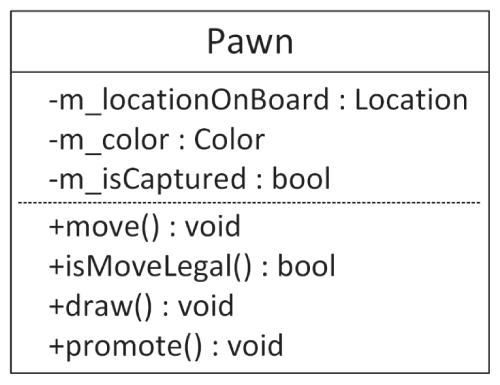
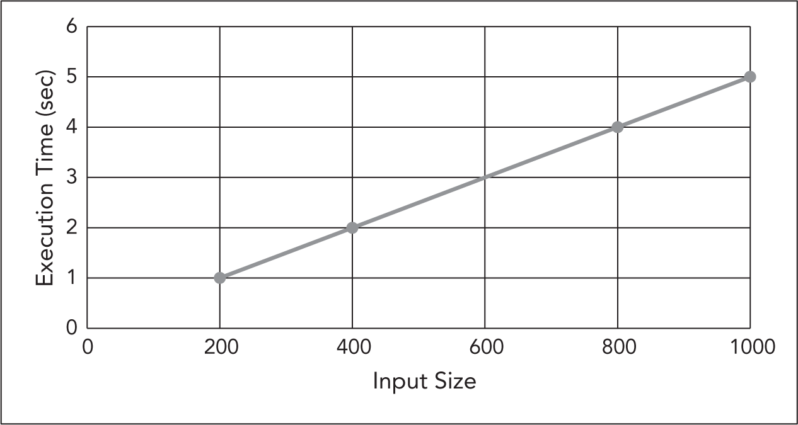
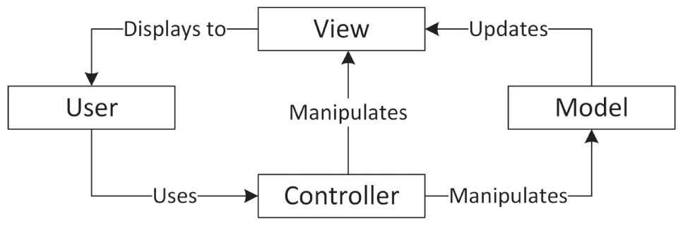
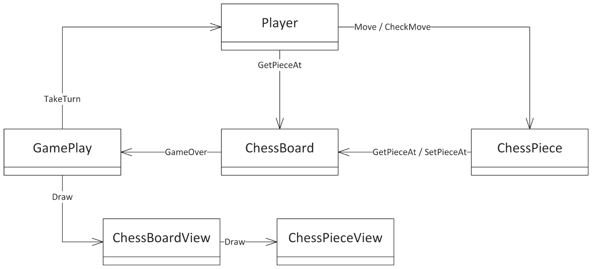
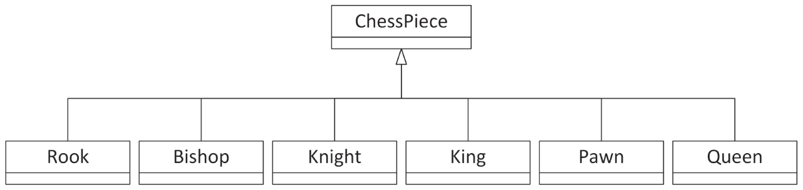
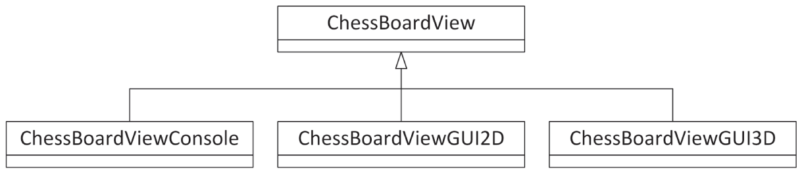

:::tip[WHAT'S IN THIS CHAPTER?]
- The definition of programming design
- The importance of programming design
- The aspects of design that are unique to C++
- The two fundamental themes for effective C++ design: abstraction and reuse
- The different types of code available for reuse
- The advantages and disadvantages of code reuse
- Guidelines for choosing a library to reuse
- Open-source libraries
- The C++ Standard Library
:::

Before writing a single line of code in your application, you should design your program. What data structures will you use? What classes will you write? This plan is especially important when you program in groups. Imagine sitting down to write a program with no idea what your co-worker, who is working on the same program, is planning! In this chapter, you'll learn how to use the *Professional C++* approach to C++ design.

Despite the importance of design, it is probably the most misunderstood and underused aspect of the software-engineering process. Too often, programmers jump into applications without a clear plan: they design as they code. This approach can lead to convoluted and overly complicated designs. It also makes development, debugging, and maintenance tasks more difficult. Although it seems counterintuitive, investing extra time at the beginning of a project to design it properly actually saves time over the life of the project.

## WHAT IS PROGRAMMING DESIGN?

The first step when starting a new program, or a new feature for an existing program, is to analyze the requirements. This involves having discussions with your *stakeholders*. A vital outcome of this analysis phase is a *functional requirements* document describing *what* exactly the new piece of code has to do, but it does not explain *how* it has to do it. Requirement analysis can also result in a *non-functional requirements* document describing how the final system should *be*, compared to what it should *do*. Examples of non-functional requirements are that the system needs to be secure, extensible, satisfy certain performance criteria, and so on.

Once all requirements have been collected, the design phase of the project can start. Your *program design*, or *software design*, is the specification of the architecture that you will implement to fulfill all functional and non-functional requirements of the program. Informally, the design is how you plan to write the program. You should generally write your design in the form of a design document. Although every company or project has its own variation of a desired design document format, most design documents share the same general layout, which includes two main parts:

- The gross subdivision of the program into subsystems, including interfaces and dependencies between the subsystems, data flow between the subsystems, input and output to and from each subsystem, and a general threading model
- The details of each subsystem, including subdivision into classes, class hierarchies, data structures, algorithms, specific threading models, and error-handling specifics

The design documents usually include diagrams and tables showing subsystem interactions and class hierarchies. The Unified Modeling Language (UML) is the industry standard for such diagrams and is used for diagrams in this and subsequent chapters. See [Appendix D](../b04), “Introduction to UML,” for a brief introduction to the UML syntax. With that being said, the exact format of the design document is less important than the process of thinking about your design.

:::note
The point of designing is to think about your program before you write it.
:::

You should generally try to make your design as good as possible before you begin coding. The design should provide a map of the program that any reasonable programmer could follow in order to implement the application. Of course, it is inevitable that the design will need to be modified once you begin coding and you encounter issues that you didn't think of earlier. Software-engineering processes have been designed to give you the flexibility to make these changes. Scrum, an agile software development methodology, is one example of such an iterative process whereby the application is developed in cycles, known as *sprints*. With each sprint, designs can be modified, and new requirements can be taken into account. [Chapter 28](../c28), “Maximizing Software Engineering Methods,” describes various software-engineering process models in more detail.

## THE IMPORTANCE OF PROGRAMMING DESIGN

It's tempting to skip the analysis and design steps, or to perform them only cursorily, to begin programming as soon as possible. There's nothing like seeing code compiling and running to give you the impression that you have made progress. It seems like a waste of time to formalize a design or to write down functional requirements when you already know, more or less, how you want to structure your program. Besides, writing a design document just isn't as much fun as coding. If you wanted to write papers all day, you wouldn't be a computer programmer! As a programmer myself, I understand this temptation to begin coding immediately and have certainly succumbed to it on occasion. However, it will most likely lead to problems on all but the simplest projects. No matter your experience as a programmer, your proficiency with commonly used design patterns, and how deeply you understand C++, the problem domain, and the requirements, designing (“thinking”) is part of your job description. Without this up-front design, it will not work.

If you are working in a team where each team member will work on a different part of the project, it is paramount that there is a design document for all team members to follow. Design documents also help newcomers to get up to speed with the designs of a project. If there are no design documents, anyone new joining the project won't know what the designs are supposed to be and will make changes to the code breaking some undocumented designs, which can then lead to problems later during the project.

Some companies have dedicated functional analysts to write the functional requirements and dedicated software architects to work out the software design. In those companies, developers can usually just focus on the programming aspects of the project. In other companies, the developers have to do the requirements gathering and the designs themselves. Some companies lie in between these two extremes; maybe they only have a software architect making the bigger architectural decisions, while developers do smaller designs themselves.

To help you understand the importance of programming design, imagine that you own a plot of land on which you want to build a house. When the builder shows up, you ask to see the blueprints. “What blueprints?” he responds. “I know what I'm doing. I don't need to plan every little detail ahead of time. Two-story house? No problem. I did a one-story house a few months ago—I'll just start with that model and work from there.”

Suppose that you suspend your disbelief and allow the builder to proceed. A few months later, you notice that the plumbing appears to run outside the house instead of inside the walls. When you query the builder about this anomaly, he says, “Oh. Well, I forgot to leave space in the walls for the plumbing. I was so excited about this new drywall technology that it just slipped my mind. But it works just as well outside, and functionality is the most important thing.” You're starting to have your doubts about his approach, but, against your better judgment, you allow him to continue.

When you take your first tour of the completed building, you notice that the kitchen lacks a sink. The builder excuses himself by saying, “We were already two-thirds done with the kitchen by the time we realized there wasn't space for the sink. Instead of starting over, we just added a separate sink room next door. It works, right?”

Do the builder's excuses sound familiar if you translate them to the software domain? Have you ever found yourself implementing an “ugly” solution to a problem like putting plumbing outside the house? For example, maybe you forgot to include locking in your queue data structure that is shared between multiple threads. By the time you realize the problem, you decide to just perform the locking manually on all places where the queue is used. Sure, it's ugly, but it works, you say. That is, until someone new joins the project who assumes that the locking is built into the data structure, fails to ensure mutual exclusion in her access to the shared data, and causes a race condition bug that takes three weeks to track down. A professional C++ programmer would never decide to perform the locking manually on each queue access but would instead directly incorporate the locking inside the queue class or make the queue class thread-safe in a lock-free manner.

Formalizing a design before you code helps you determine how everything fits together. Just as blueprints for a house show how the rooms relate to each other and work together to fulfill the requirements of the house, the design for a program shows how the subsystems of the program relate to each other and work together to fulfill the software requirements. Without a design plan, you are likely to miss connections between subsystems, possibilities for reuse or shared information, and the simplest ways to accomplish tasks. Without the “big picture” that the design gives, you might become so bogged down in individual implementation details that you lose track of the overarching architecture and goals. Furthermore, the design provides written documentation to which all members of the project can refer. If you use an iterative process like the agile Scrum methodology mentioned earlier, you need to make sure to keep the design documentation up-to-date during each cycle of the process, for as long as doing so adds value. One of the pillars of the agile methodology states to prefer “Working software over comprehensive documentation.” You should at least keep design documentation about how the bigger parts of a project work together up-to-date, while in my opinion, it's up to the team whether maintaining design documentation about smaller aspects of the project adds any value towards the future or not. If not, then make sure to either remove such documents or mark them as out-of-date.

If the preceding analogy still hasn't convinced you to design before you code, here is an example where jumping directly into coding fails to lead to an optimal design. Suppose that you want to write a chess program. Instead of designing the entire program before you begin coding, you decide to jump in with the easiest parts and move slowly to the more difficult parts. Following the object-oriented perspective introduced in [Chapter 1](../c01), “A Crash Course in C++ and the Standard Library,” and covered in more detail in [Chapter 5](../c05), “Designing with Classes,” you decide to model your chess pieces with classes. You figure the pawn is the simplest chess piece, so you opt to start there. After considering the features and behaviors of a pawn, you write a class with the properties and member functions shown in the UML class diagram in [Figure 4.1](#c04-fig-0001).

 


[^FIGURE 4.1]

In this design, the `m_color` attribute denotes whether the pawn is black or white. The `promote()` member function executes upon reaching the opposing side of the board.

Of course, you haven't actually made this class diagram. You've gone straight to the implementation phase. Happy with that class, you move on to the next easiest piece: the bishop. After considering its attributes and functionality, you write a class with the properties and member functions shown in the class diagram in [Figure 4.2](#c04-fig-0002).

 


[^FIGURE 4.2]

Again, you haven't generated a class diagram, because you jumped straight to the coding phase. However, at this point you begin to suspect that you might be doing something wrong. The bishop and the pawn look similar. In fact, their properties are identical, and they share many member functions. Although the implementation of the move member function might differ between the pawn and the bishop, both pieces need the ability to move. If you had designed your program before jumping into coding, you would have realized that the various pieces are actually quite similar and that you should find some way to write the common functionality only once. [Chapter 5](../c05) explains the object-oriented design techniques for doing that.

Furthermore, several aspects of the chess pieces depend on other subsystems of your program. For example, you cannot accurately represent the location on the board in a chess piece class itself without knowing how you will model the board. On the other hand, perhaps you will design your program so that the board manages pieces in a way that doesn't require them to know their own locations. As another example, how can you write a draw member function for a piece without first deciding your program's user interface? Will it be graphical or text-based? What will the board look like? The problem is that subsystems of a program do not exist in isolation—they interrelate with other subsystems. Most of the design work determines and defines these relationships.

## DESIGNING FOR C++

There are several aspects of the C++ language that you need to keep in mind when designing for C++:

- **C++ provides object-oriented capabilities.** This means your designs can include class hierarchies, class interfaces, and object interactions. Object-oriented design is quite different compared to procedural design as used in languages such as C and others. [Chapter 5](../c05) focuses on object-oriented design in C++.
- **C++ is a multi-paradigm programming language.** Besides object-oriented capabilities as described in the previous point, C++ supports other paradigms, such as procedural. Which paradigm to choose, object-oriented or procedural, is part of the design process.
- **C++ has numerous facilities for designing generic and reusable code.** Next to object-oriented and procedural capabilities, C++ supports other language facilities such as templates for generic programming. Design techniques for reusable code are discussed in more detail later in this chapter and further in [Chapter 6](../c06), “Designing for Reuse.”
- **C++ provides a large Standard Library.** This includes a string class, string formatting, I/O facilities, multithreading building blocks, many common data structures and algorithms, and much more. All of these facilitate coding in C++.
- **C++ readily accommodates many *design patterns*.** In other words, it supports common ways to solve problems.

Tackling a design can be overwhelming. I have spent entire days scribbling design ideas on paper, crossing them out, writing more ideas, crossing those out, and repeating the process. Sometimes this process is helpful, and, at the end of those days (or weeks), it leads to a clean, efficient design. Other times it is frustrating and leads nowhere, but it is not a waste of effort. You will most likely waste more time if you have to re-implement a design that turned out to be broken. It's important to remain aware of whether you are making real progress. If you find that you are stuck, you can take one of the following actions:

- **Ask for help.** Consult a co-worker, mentor, book, newsgroup, or web page.
- **Work on something else for a while.** Come back to this design choice later.
- **Make a decision and move on.** Even if it's not an ideal solution, decide on something and try to work with it. An incorrect choice will soon become apparent. However, it may turn out to be an acceptable solution. Perhaps there is no clean way to accomplish what you want to with this design. Sometimes you have to accept an “ugly” solution if it's the only realistic strategy to fulfill your requirements. Whatever you decide, make sure you document your decision so that you and others in the future know why you made it. This includes documenting designs that you have rejected and the rationale behind the rejection.

:::note
Keep in mind that good design is hard, and getting it right takes practice. Don't expect to become an expert overnight—and don't be surprised if you find it more difficult to master C++ design than C++ coding.
:::

## TWO RULES FOR YOUR OWN C++ DESIGNS

When you are designing your own C++ programs, there are two fundamental design rules to follow: *abstraction* and *reuse*. These guidelines are so important that they can be considered themes of this book. They come up repeatedly throughout the text and throughout effective C++ program designs in all domains.

### Abstraction

The principle of *abstraction* is easiest to understand through a real-world analogy. A television is a piece of technology found in most homes. You are probably familiar with its features: you can turn it on and off, change the channel, adjust the volume, and add external components such as speakers, DVRs, and Blu-ray players. However, can you explain how it works inside the black box? That is, do you know how it receives signals through a cable, translates them, and displays them on the screen? Most people certainly can't explain how a television works, yet are quite capable of using it. That is because the television clearly separates its internal *implementation* from its external *interface*. We interact with the television through its interface: the power button, channel changer, and volume control. We don't know, nor do we care, how the television works; we don't care whether it uses a cathode ray tube or some sort of alien technology to generate the image on our screen. It doesn't matter because it doesn't affect the interface.

#### Benefiting from Abstraction

The abstraction principle is similar in software. You can use code without knowing the underlying implementation. As a trivial example, your program can make a call to the `sqrt()` function declared in `<cmath>` without knowing what algorithm the function actually uses to calculate the square root. In fact, the underlying implementation of the square root calculation could change between releases of the library, and as long as the interface stays the same, your function call will still work.

The principle of abstraction extends to classes as well. As introduced in [Chapter 1](../c01), the `vector` class can be used as a dynamic array; you can add and remove as many elements as you want. For example:

```cpp
vector<int> myVector;
myVector.push_back(33);
myVector.push_back(44);
```

You use the documented interface of the `vector` class to add the elements 33 and 44 to `myVector`. However, you don't need to understand how the `vector` class manages its memory internally. You need to know only the public interface. The underlying implementation of `vector` is free to change, as long as the exposed behavior and interface remain the same.

#### Incorporating Abstraction in Your Design

You should design functions and classes so that you and other programmers can use them without knowing, or relying on, the underlying implementations. To see the difference between a design that exposes the implementation and one that hides it behind an interface, consider the chess program again. You might want to implement the chessboard with a two-dimensional array of pointers to `ChessPiece` objects. You could declare and use the board like this:

```cpp
ChessPiece* chessBoard[8][8]{};  // Zero-initialized array.
…
chessBoard[0][0] = new Rook{};
```

However, that approach utterly fails to use the concept of abstraction. Every programmer who uses the chessboard knows that it is implemented as a two-dimensional array. Changing that implementation to something else, such as a one-dimensional flattened `vector` of size 64, would be difficult, because you would need to change every use of the board in the entire program. Everyone using the chessboard also has to properly take care of memory management. There is no separation of interface from implementation.

A better approach is to model the chessboard as a class. You could then expose an interface that hides the underlying implementation details. Here is an example of the beginnings of a `ChessBoard` class:

```cpp
class ChessBoard
{
    public:
        void setPieceAt(std::size_t x, std::size_t y, ChessPiece* piece);
        ChessPiece* getPieceAt(std::size_t x, std::size_t y) const;
        bool isEmpty(std::size_t x, std::size_t y) const;
        // …
    private:
        // Private implementation details…
};
```

Note that this interface makes no commitment to any underlying implementation. The `ChessBoard` class could use a two-dimensional array, but the interface does not require it. Changing the implementation does not require changing the interface. Furthermore, the implementation can provide additional functionality, such as bounds checking. This is possible only by strictly adhering to the following rule.

:::warning
All class data members must be `private`. Provide `public` getters and setters if you want to offer controlled access to data members from outside the class.
:::

Making all data members `private` is often called *data hiding*. Why is this so important? By following this rule, you provide the highest level of abstraction for your class:

- You can change the underlying implementation without having to change the public interface.
- Allowing external code access to data members only through getters and setters allows you to implement extra steps whenever a value is retrieved or set. For example, you can implement sanity checks to make sure data members are never set to invalid values, you can send out an event whenever a data member changes, and so on.
- With a debugger, you can put breakpoints in getters and setters to make it easier to figure out what other piece of code is retrieving or setting a data member. Debuggers are discussed in [Chapter 31](../c31), “Conquering Debugging.”

Ideally, this example has convinced you that abstraction is an important technique in C++ programming. [Chapter 5](../c05) covers object-oriented design in more detail, while [Chapter 6](../c06) goes deeper in on the principles of abstraction. [Chapters 8](../c08), “Gaining Proficiency with Classes and Objects,” [9](../c09), “Mastering Classes and Objects,” and 10, “Discovering Inheritance Techniques,” provide all the details about writing your own classes.

### Reuse

The second fundamental rule of design in C++ is *reuse*. Again, it is helpful to examine a real-world analogy to understand this concept. Suppose that you give up your programming career in favor of working as a baker. On your first day of work, the head baker tells you to bake cookies. To fulfill his orders, you find the recipe for chocolate chip cookies, mix the ingredients, form cookies on the cookie sheet, and place the sheet in the oven. The head baker is pleased with the result.

Now, I'm going to point out something so obvious that it will surprise you: you didn't build your own oven in which to bake the cookies. Nor did you churn your own butter, mill your own flour, or form your own chocolate chips. I can hear you think, “That goes without saying.” That's true if you're a real cook, but what if you're a programmer writing a baking simulation game? In that case, you would think nothing of writing every component of the program, from the chocolate chips to the oven. Or, you could save yourself time by looking around for code to reuse. Perhaps a co-worker wrote a cooking simulation game and has some nice oven code lying around. Maybe it doesn't do everything you need, but you might be able to modify it and add the necessary functionality.

Something else you took for granted is that you followed a recipe for the cookies instead of making up your own. Again, that goes without saying. However, in C++ programming, it does not go without saying. Although there are standard ways of approaching problems that arise over and over in C++, many programmers persist in reinventing these strategies in each design.

The idea of using existing code is not new. You've been reusing code from the first day you printed something with `std::println()`. You didn't write the code to actually print your data to the screen. You used the existing `println()` implementation to do the work. Similarly, the employee database from [Chapter 1](../c01) reused the `std::vector` container from the C++ Standard Library to store a list of `Employee`s; you didn't write your own data structure to store the `Employee`s.

Unfortunately, not all programmers take advantage of available code, and often reinvent the wheel. Your designs should take into account existing code and reuse it when appropriate.

#### Writing Reusable Code

The design theme of reuse applies to code you write as well as to code that you use. You should design your programs so that you can reuse your classes, algorithms, and data structures. You and your co-workers should be able to use these components in both the current project and future projects. In general, you should avoid designing overly specific code that is applicable only to the case at hand.

One language technique for writing general-purpose code in C++ is using *templates*. Remember the chess example discussed earlier, but now consider that at some point you might need a `ChessBoard` class storing `ChessPiece`s, and a `CheckersBoard` class storing `CheckersPiece`s. You could of course write a `ChessBoard` class and a `CheckersBoard` class that are completely independent from each other, but in doing so you'll duplicate quite a bit of code. Such duplicated code can be avoided by writing a generic `GameBoard` class template instead that can then be used for any type of two-dimensional board game such as chess or checkers. You would only need to change the class declaration so that it takes the piece to store as a template parameter, called `PieceType`, instead of hard-coding it in the interface. The class template could look something as follows. If you've never seen this syntax before, don't worry! [Chapter 12](../c12), “Writing Generic Code with Templates,” explains the syntax in depth.

```cpp
template <typename PieceType>
class GameBoard
{
    public:
        void setPieceAt(std::size_t x, std::size_t y, PieceType* piece);
        PieceType* getPieceAt(std::size_t x, std::size_t y) const;
        bool isEmpty(std::size_t x, std::size_t y) const;
        // …
    private:
        // Private implementation details…
};
```

With this simple change in the interface, you now have a generic game board class that you can use for any two-dimensional board game. Although the code change is simple, it is important to make these decisions in the design phase, so that you are able to implement the code effectively and efficiently.

[Chapter 6](../c06) goes into more detail on how to design your code with reuse in mind.

#### Reusing Designs

Learning the C++ language and becoming a good C++ programmer are two very different things. If you sat down and read the C++ standard, memorizing every fact, you would know C++ as well as anybody else. However, until you gained some experience by looking at code and writing your own programs, you wouldn't necessarily be a good programmer. The reason is that the C++ syntax defines what the language can do in its raw form but does not say anything about how each feature should be used.

As the baker example illustrates, it would be ludicrous to reinvent recipes for every baked good that you make. However, programmers often make an equivalent mistake in their designs. Instead of using existing “recipes,” or *patterns*, for designing programs, they reinvent these techniques every time they design a program.

As they become more experienced in using the C++ language, C++ programmers develop their own individual ways of using the features of the language. The C++ community at large has also built some standard ways of leveraging the language, some formal and some informal. Throughout this book, I point out these reusable applications of the language, known as *design techniques* and *design patterns*. Additionally, [Chapters 32](../c32), “Incorporating Design Techniques and Frameworks,” and [33](../c33), “Applying Design Patterns,” focus almost exclusively on design techniques and patterns. Some will seem obvious to you because they are simply a formalization of the obvious solution. Others describe novel solutions to problems you've encountered in the past. Some present entirely new ways of thinking about your program organization.

For example, you might want to design your chess program so that you have a single `ErrorLogger` object that serializes all errors from different components to a log file. When you try to design your `ErrorLogger` class, you realize that you would like to have only a single instance of the `ErrorLogger` class in your program. But you also want several components in your program to be able to use this `ErrorLogger` instance; that is, these components all want to use the same `ErrorLogger` *service*. A standard pattern to implement such a service mechanism is the *strategy pattern* combined with *dependency injection*. With the strategy pattern you create an interface for each service. You can then have multiple implementations of that interface. For example, you could have several logger service implementations, one could log to a file, another could send log messages to a remote server over the Internet, and so on. Once you have defined such interfaces, you then use dependency injection to inject the interfaces a component needs into the component. Thus, a good design at this point would specify that you want to use the strategy pattern with dependency injection.

It is important for you to familiarize yourself with these patterns and techniques so that you can recognize when a particular design problem calls for one of these solutions. There are many more techniques and patterns applicable to C++ than those described in this book. Even though a nice selection is covered here, you may want to consult a book on design patterns for more and different patterns. See [Appendix B](../b02), “Annotated Bibliography,” for suggestions.

## REUSING EXISTING CODE

Experienced C++ programmers never start a project from scratch. They incorporate code from a wide variety of sources, such as the Standard Library, open-source libraries, proprietary code bases in their workplace, and their own code from previous projects. You should reuse code liberally in your projects. To make the most of this rule, this section first explains the different types of code that you can reuse, followed by the trade-offs between reusing existing code and writing it yourself. The final part of this section discusses a number of guidelines for choosing a library to reuse, once you have decided not to write the code yourself but to reuse existing code.

:::note
Reusing code does not mean copying and pasting existing code! In fact, it means quite the opposite: reusing code without duplicating it.
:::

### A Note on Terminology

Before analyzing the advantages and disadvantages of code reuse, it is helpful to specify the terminology involved and to categorize the types of reusable code. There are three categories of code available for reuse:

- Code you wrote yourself in the past
- Code written by a co-worker
- Code written by a third party outside your current organization or company

There are several ways that the code you reuse can be structured:

- **Stand-alone functions or classes.** When you reuse your own code or co-workers’ code, you will generally encounter this variety.
- **Libraries.** A *library* is a collection of code used to accomplish a specific task, such as parsing XML, or to handle a specific domain, such as cryptography. Other examples of functionality usually found in libraries include threads and synchronization support, networking, and graphics.
- **Frameworks.** A *framework* is a collection of code around which you design a program. For example, the Microsoft Foundation Classes (MFC) library provides a framework for creating graphical user interface applications for Microsoft Windows. Frameworks usually dictate the structure of your program.
- **Entire applications.** Your project might include multiple applications. Perhaps you need a web server front end to support your new e-commerce infrastructure. It is possible to bundle entire third-party applications, such as a web server, with your software. This approach takes code reuse to the extreme in that you reuse entire applications.

:::note
A program uses a library but fits into a framework. Libraries provide specific functionality, while frameworks are fundamental to your program design and structure.
:::

Another term that arises frequently is *application programming interface*, or *API*. An API is an interface to a library or body of code for a specific purpose. For example, programmers often refer to the sockets API, meaning the exposed interface to the sockets networking library, instead of the library itself.

:::note
Although people use the terms API and library interchangeably, they are not equivalent. The library refers to the implementation, while the API refers to the published interface to the library.
:::

For the sake of brevity, the rest of this chapter uses the term *library* to refer to any reusable code, whether it is really a library, framework, entire application, or random collection of functions from your co-worker.

### Deciding Whether to Reuse Code or Write It Yourself

The rule to reuse code is easy to understand in the abstract. However, it's somewhat vague when it comes to the details. How do you know when it's appropriate to reuse code and which code to reuse? There is always a trade-off, and the decision depends on the specific situation. However, there are some general advantages and disadvantages to reusing code.

#### Advantages to Reusing Code

Reusing code can provide tremendous advantages to you and to your project:

- You may not know how to or may not be able to justify the time to write the code you need. Would you really want to write code to handle formatted output? Of course not. That's why you use the standard C++ `std::format()` or `print()` functionality.
- Your designs will be simpler because you will not need to design those components of the application that you reuse.
- The code that you reuse usually requires no debugging. You can often assume that library code is bug-free because it has already been tested and used extensively.
- Libraries handle more error conditions than would your first attempt at the code. You might forget obscure errors or edge cases at the beginning of the project and would waste time fixing these problems later. Library code that you reuse has generally been tested extensively and used by many programmers before you, so you can assume that it handles most errors properly.
- Libraries are often tested on a wide range of platforms with different hardware, different operating systems and operating system versions, different graphic cards, and so on; much more than you could possibly have available to test yourself. Sometimes, libraries contain workarounds to make them work on specific platforms.
- Libraries generally are designed to be suspect of bad user inputs. Invalid requests, or requests not appropriate for the current state, usually result in suitable error notifications. For example, a request to seek a nonexistent record in a database, or to read a record from a database that is not open, would have well-specified behavior from a library.
- Reusing code written by domain experts is safer than writing your own code for that area. For example, you should not attempt to write your own security code unless you are a security expert. If you need security or cryptography in your programs, use a library. Many seemingly minor details in code of that nature could compromise the security of the entire program, and possibly the entire system, if you got them wrong.
- Library code is constantly improving. If you reuse the code, you receive the benefits of these improvements without doing the work yourself. In fact, if the library writers have properly separated the interface from the implementation, you can obtain these benefits by upgrading your library version without changing your interaction with the library. A good upgrade modifies the underlying implementation without changing the interface.

#### Disadvantages to Reusing Code

Unfortunately, there are also some disadvantages to reusing code:

- When you use libraries that you didn't write yourself, you must spend time understanding the interface and correct usage before you can jump in and use it. This extra time at the beginning of your project will slow down your initial design and coding, but the advantage is that it will save you significant time later because there is less code that needs to be maintained by you, and the final code will be simpler.
- When you write your own code, it does exactly what you want. Library code might not provide the exact functionality that you require.
- Even if the library code provides the exact functionality you need, it might not give you the performance that you desire. The performance might be bad in general, poor for your specific use case, or completely unspecified.
- Using library code introduces a Pandora's box of support issues. If you discover a bug in the library, what do you do? Often you don't have access to the source code, so you couldn't fix it even if you wanted to. If you have already invested significant time in learning the library interface and using the library, you probably don't want to give it up, but you might find it difficult to convince the library developers to fix the bug on your time schedule. Also, if you are using a third-party library, what do you do if the library authors drop support for the library before you stop supporting the product that depends on it? Think carefully about this before you decide to use a library for which you cannot get source code.
- In addition to support problems, libraries present licensing issues, which cover topics such as disclosure of your source code, redistribution fees (often called binary license fees), credit attribution, and development licenses. You should carefully inspect the licensing issues before using any library. For example, some open-source libraries require you to make your own code open-source.
- Reusing code requires a trust factor. You must trust whoever wrote the code by assuming that they did a good job. Some people like to have control over all aspects of their project, including every line of source code.
- Upgrading to a new version of the library can cause problems. The upgrade could introduce bugs, which could have fatal consequences in your product. A performance-related upgrade might optimize performance in certain cases but make it worse in your specific use case.
- Upgrading your compiler to a new version can cause problems when you are using binary-only libraries. You can only upgrade the compiler when the library vendor provides binaries compatible with your new version of the compiler.

#### Putting It Together to Make a Decision

Now that you are familiar with the terminology, advantages, and disadvantages of reusing code, you are better prepared to make the decision about whether to reuse code. Often, the decision is obvious. For example, if you want to write a graphical user interface (GUI) in C++ for Microsoft Windows, you should use a framework such as MFC or Qt. You probably don't know how to write the underlying code to create a GUI in Windows, and more importantly, you don't want to waste time to learn it. You will save person-years of effort by using a framework in this case.

However, other times the choice is less obvious. For example, if you are unfamiliar with a library and need only a simple data structure, it might not be worth the time to learn the library to reuse only one component that you could write in a few days.

Ultimately, you need to make a decision based on your own particular needs. It often comes down to a trade-off between the time it would take to write it yourself and the time required to find and learn how to use a library to solve the problem. Carefully consider how the advantages and disadvantages listed previously apply to your specific case, and decide which factors are most important to you. Finally, remember that you can always change your mind, which might even be relatively easy if you handled the abstraction correctly.

### Guidelines for Choosing a Library to Reuse

When you've decided to reuse libraries, frameworks, co-workers’ code, entire applications, or your own code, there are several guidelines you should keep in mind to pick the right code to reuse.

#### Understand the Capabilities and Limitations

Take the time to familiarize yourself with the code. It is important to understand both its capabilities and its limitations. Start with the documentation and the published interfaces or APIs. Ideally, that will be sufficient to understand how to use the code. However, if the library doesn't provide a clear separation between interface and implementation, you may need to explore the source code itself if it is provided. Also, talk to other programmers who have used the code and who might be able to explain its intricacies. You should begin by learning the basic functionality. If it's a library, what functions does it provide? If it's a framework, how does your code fit in? What classes should you derive from? What code do you need to write yourself? You should also consider specific issues depending on the type of code.

Here are some points to keep in mind when choosing a library:

- Is it safe to use the library in multithreaded programs?
- Does the library impose any specific compiler settings on code using it? If so, is that acceptable in your project?
- On what other libraries does the library depend?

Additionally, you might have to do some more detailed research for specific libraries:

- Which initialization and cleanup calls are needed?
- If you need to derive from a class, which constructor should you call on it? Which virtual member functions should you override?
- If a call returns memory pointers, who is responsible for freeing the memory: the caller or the library? If the library is responsible, when is the memory freed? It's highly recommended to find out whether you can use smart pointers (see [Chapter 7](../c07), “Memory Management”) to manage memory allocated by the library.
- What are all the return values (by value or reference) from a call?
- What are all the possible exceptions thrown?
- What error conditions do library calls check for, and what do they assume? How are errors handled? How is the client program notified about errors? Avoid using libraries that pop up message boxes, print messages on the standard output console, or terminate the program. The client program should decide how to inform users about an error, not the library.

#### Understand the Learning Cost

The *learning cost* is the amount of time it takes for a developer to learn how to use a library. This is not just an initial cost when starting to use the library, but a recurring cost over time. Whenever a new team member joins the project, she needs to learn how to use that library.

This cost can be substantial for certain libraries. As such, if you find the functionality you need in a well-known library, I recommend using that one over using some exotic, lesser-known library. For example, if the Standard Library provides the data structure or algorithm you need, use that one instead of using another library.

#### Understand the Performance

It is important to know the performance guarantees that the library or other code provides. Even if your particular program is not performance sensitive, you should make sure that the code you use doesn't have awful performance for your particular use.

##### Big-O Notation

Programmers generally discuss and document algorithm and library performance using *big-O notation*. This section explains the general concepts of algorithm complexity analysis and big-O notation without a lot of unnecessary mathematics. If you are already familiar with these concepts, you can skip this section.

Big-O notation specifies *relative*, rather than *absolute*, performance. For example, instead of saying that an algorithm runs in a specific amount of time, such as 300 milliseconds, big-O notation specifies how an algorithm performs as its input size increases. Examples of input sizes include the number of items to be sorted by a sorting algorithm, the number of elements in a hash table during a key lookup, and the size of a file to be copied between disks.

:::note
Big-O notation applies only to algorithms whose speed depends on their inputs. It does not apply to algorithms that take no input or whose running time is random. In practice, you will find that the running times of most algorithms of interest depend on their input, so this limitation is not significant.
:::

To be more formal, big-O notation specifies an algorithm's run time as a function of its input size, also known as the *complexity* of the algorithm. It's not as complicated as it sounds. For example, an algorithm could take twice as long to process twice as many elements. Thus, if it takes 1 second to process 200 elements, it will take 2 seconds to process 400 elements, and 4 seconds to process 800 elements. [Figure 4.3](#c04-fig-0003) shows this graphically. It is said that the complexity of such an algorithm is a linear function of its input size, because, graphically, it is represented by a straight line.

 


[^FIGURE 4.3]

Big-O notation summarizes the algorithm's linear performance like this: *O(n)*. The *O* just means that you're using big-O notation, while the *n* represents the input size. *O(n)* specifies that the algorithm speed is a direct linear function of the input size.

Of course, not all algorithms have performance that is linear with respect to their input size. The following table summarizes the common complexities, in order of their performance from best to worst:

| ALGORITHM COMPLEXITY | BIG-O NOTATION | EXPLANATION | EXAMPLE ALGORITHMS |
| --- | --- | --- | --- |
| Constant | *O*(1) | The running time is independent of the input size. | Accessing a single element in an array. |
| Logarithmic | *O*(log *n*) | The running time is a function of the logarithm base 2 of the input size. | Finding an element in a sorted list using binary search. |
| Linear | *O*(*n*) | The running time is directly proportional to the input size. | Finding an element in an unsorted list. |
| Linear Logarithmic | *O*(*n* log *n*) | The running time is a function of the linear times the logarithmic function of the input size. | Merge sort. |
| Quadratic | *O*(*n*2) | The running time is a function of the square of the input size. | A slower sorting algorithm like selection sort. |
| Exponential | O(2*n*) | The running time is an exponential function of the input size. | Optimized traveling salesman problem. |

There are two advantages to specifying performance as a function of the input size instead of in absolute numbers:

- It is platform independent. Specifying that a piece of code runs in 200 milliseconds on one computer says nothing about its speed on a second computer. It is also difficult to compare two different algorithms without running them on the same computer with the exact same load. On the other hand, performance specified as a function of the input size is applicable to any platform.
- Performance as a function of input size covers all possible inputs to the algorithm with one specification. The specific time in seconds that an algorithm takes to run covers only one specific input and says nothing about any other input.

##### Tips for Understanding Performance

Now that you are familiar with big-O notation, you are prepared to understand most performance documentation. The C++ Standard Library in particular describes its algorithm and data structure performance using big-O notation. However, big-O notation is sometimes insufficient or even misleading. Consider the following issues whenever you think about big-O performance specifications:

- If an algorithm takes twice as long to work on twice as much data, it doesn't say anything about how long it took in the first place! If the algorithm is written badly but scales well, it's still not something you want to use. For example, suppose the algorithm makes unnecessary disk accesses. That probably wouldn't affect the big-O time but would be very bad for overall performance.
- Along those lines, it's difficult to compare two algorithms with the same big-O running time. For example, if two different sorting algorithms both claim to be *O(n* log *n)*, it's hard to tell which is really faster without running your own tests.
- The big-O notation describes the time complexity of an algorithm asymptotically, as the input size grows to infinity. For small inputs, big-O time can be very misleading. An *O*(*n*2) algorithm might actually perform better than an *O*(log *n*) algorithm on small input sizes. Consider your likely input sizes before making a decision.

In addition to considering big-O characteristics, you should look at other facets of the algorithm performance. Here are some guidelines to keep in mind:

- You should consider how often you intend to use a particular piece of library code. Some people find the 90/10 rule helpful: 90 percent of the running time of most programs is spent in only 10 percent of the code (Hennessy and Patterson, *Computer Architecture: A Quantitative Approach, Fifth Edition*, 2011, Morgan Kaufmann). If the library code you intend to use falls in the oft-exercised 10 percent category of your code, you should make sure to analyze its performance characteristics carefully. On the other hand, if it falls into the oft-ignored 90 percent of the code, you should not spend much time analyzing its performance because it will not benefit the overall program performance very much. [Chapter 29](../c29), “Writing Efficient C++,” discusses profilers, tools to help you find performance bottlenecks in your code.
- Don't rely purely on the documentation. Always run performance tests to determine if library code provides acceptable performance characteristics for your specific use case.

#### Understand Platform Limitations

Before you start using library code, make sure that you understand on which platforms it runs. If you want to write a cross-platform application, make sure the libraries you choose are also cross-platform portable. That might sound obvious, but even libraries that claim to be cross-platform might contain subtle differences on different platforms.

Also, platforms include not only different operating systems but different versions of the same operating system. If you write an application that should run on the operating systems Solaris 8, 9, and 10, ensure that any libraries you use also support all those releases. You cannot assume either forward or backward compatibility across operating system versions. That is, just because a library runs on Solaris 9 doesn't mean that it will run on Solaris 10 and vice versa.

#### Understand Licensing

Using third-party libraries often introduces complicated licensing issues. You must sometimes pay license fees to third-party vendors for the use of their libraries. There may also be other licensing restrictions, including international export restrictions. Additionally, open-source libraries are sometimes distributed under licenses that require any code that links with them to be open-source as well. A number of licenses commonly used by open-source libraries are discussed later in this chapter.

:::warning
Make sure that you understand the license restrictions of any third-party libraries you use if you plan to distribute or sell the code you develop. When in doubt, consult a legal expert whose specialty is intellectual property.
:::

#### Understand Support and Know Where to Find Help

Before you use a library, make sure that you understand the process for submitting bugs and that you realize how long it will take for bugs to get fixed. If possible, determine how long the library will continue to be supported so that you can plan accordingly.

Interestingly, even using libraries from within your own organization can introduce support issues. You may find it just as difficult to convince a co-worker in another part of your company to fix a bug in their library as you would to convince a stranger in another company to do the same thing. In fact, you may even find it harder, because you're not a paying customer. Make sure that you understand the politics and organizational issues within your own organization before using internal libraries.

For reusing entire applications, the support issue might even become more complex. If customers encounter a problem with your bundled web server, should they contact you or the web server vendor? Make sure that you resolve this issue *before* you release the software.

Using libraries and frameworks can sometimes be daunting at first. Fortunately, there are many avenues of support available. First, consult the documentation that accompanies the library. If the library is widely used, such as the Standard Library or the MFC, you should be able to find a good book on the topic. In fact, for help with the Standard Library, you can consult [Chapters 16](../c16) to [25](../c25). If you have specific questions not addressed by books and product documentation, try searching the Web. Type your question in your favorite search engine to find web pages that discuss the library. For example, when you search for the phrase *introduction to C++ Standard Library*, you will find hundreds of websites about C++ and the Standard Library. Also, many websites contain their own private newsgroups or forums on specific topics for which you can register.

:::warning
A note of caution: don't believe everything you read on the Web! Web pages do not necessarily undergo the same review process as printed books and documentation, and may contain inaccuracies.
:::

#### Prototype

When you first sit down with a new library or framework, it is often a good idea to write a quick prototype. Trying the code is the best way to familiarize yourself with the library's capabilities. You should consider experimenting with the library even before you tackle your program design so that you are intimately familiar with the library's capabilities and limitations. This empirical testing will allow you to determine the performance characteristics of the library as well.

Even if your prototype application looks nothing like your final application, time spent prototyping is not a waste. Don't feel compelled to write a prototype of your actual application. Write a dummy program that just tests the library capabilities you want to use. The point is only to familiarize yourself with the library.

:::warning
Due to time constraints, programmers sometimes find their prototypes morphing into the final product. If you have hacked together a prototype that is insufficient as the basis for the final product, make sure that it doesn't get used that way.
:::

#### Open-Source Libraries

Open-source libraries are an increasingly popular class of reusable code. The general meaning of *open-source* is that the source code is available for anyone to look at. There are formal definitions and legal rules about including source code with all your distributions, but the important thing to remember about open-source software is that anyone (including you) can look at the source code. Note that open-source applies to more than just libraries. In fact, the most famous open-source product is probably the Android operating system. Linux is another open-source operating system. Google Chrome and Mozilla Firefox are two examples of famous open-source web browsers.

##### The Open-Source Movements

Unfortunately, there is some confusion in terminology in the open-source community. First, there are two competing names for the movement (some would say two separate, but similar, movements). Richard Stallman and the GNU project use the term *free software*. Note that the term *free* does not imply that the finished product must be available without cost. Developers are welcome to charge as much or as little as they want. Instead, the term *free* refers to the freedom for people to examine the source code, modify the source code, and redistribute the software. Think of the free in *free speech* rather than the free in *free beer*. You can read more about Richard Stallman and the GNU project at `www.gnu.org`.

The Open Source Initiative uses the term *open-source software* to describe software in which the source code must be available. As with free software, open-source software does not require the product or library to be available without cost. However, an important difference with free software is that open-source software is not required to give you the freedom to use, modify, and redistribute it. You can read more about the Open Source Initiative at `www.opensource.org`.

There are a lot of licensing options available for open-source projects. For example, a project could use one of the GNU Public License (GPL) versions. However, using a library under the GPL requires you to make your own product open-source under the GPL as well. On the other hand, an open-source project can use a license like Boost Software License, Berkeley Software Distribution (BSD) license, MIT License, Apache License, and so on, which allow using an open-source project in closed-source products. Some of these licenses have different versions. For example, there are actually four versions of the BSD license. Another option for an open-source project is to use one of the six flavors of the Creative Commons (CC) license.

Some licenses require you to include the library's license with your final product. Some licenses require attribution when using the library. Bottom line, all licenses come with subtleties that are important to understand if you want to use libraries in closed-source projects. The `opensource.org/licenses` website gives a thorough overview of approved open-source licenses.

Because the name “open-source” is less ambiguous than “free software,” this book uses “open-source” to refer to products and libraries with which the source code is available. The choice of name is not intended to imply endorsement of the open-source philosophy over the free software philosophy: it is only for ease of comprehension.

##### Finding and Using Open-Source Libraries

Regardless of the terminology, you can gain amazing benefits from using open-source software. The main benefit is functionality. There is a plethora of open-source C++ libraries available for varied tasks, from XML parsing and cross-platform error logging to deep learning and data mining using artificial neural networks.

Although open-source libraries are not required to provide free distribution and licensing, many open-source libraries are available without monetary cost. You will generally be able to save money in licensing fees by using open-source libraries.

Finally, you are often but not always free to modify open-source libraries to suit your exact needs.

Most open-source libraries are available on the Web. For example, searching for *open-source C++ library XML parsing* results in a list of links to XML libraries for C++. There are also a few open-source portals where you can start your search, including the following:

- `www.boost.org`
- `www.gnu.org`
- `github.com/open-source`
- `www.sourceforge.net`

##### Guidelines for Using Open-Source Code

Open-source libraries present several unique issues and require new strategies. First, open-source libraries are usually written by people in their “free” time. The source base is generally available for any programmer who wants to pitch in and contribute to development or bug fixing. As a good programming citizen, you should try to contribute to open-source projects if you find yourself reaping the benefits of open-source libraries. If you work for a company, you may find resistance to this idea from your management because it does not lead directly to revenue for your company. However, you might be able to convince management that indirect benefits, such as exposure of your company name and perceived support from your company for the open-source movement, should allow you to pursue this activity.

Second, because of the distributed nature of their development and lack of single ownership, open-source libraries often present support issues. If you desperately need a bug fixed in a library, it is often more efficient to make the fix yourself than to wait for someone else to do it. If you do fix bugs, make sure to put those fixes back into the public codebase for the library. Some licenses even require you to do so. Even if you don't fix any bugs, make sure to report problems that you find so that other programmers don't waste time encountering the same issues.

#### The C++ Standard Library

The most important library that you will use as a C++ programmer is the C++ Standard Library. As its name implies, this library is part of the C++ standard, so any standards-conforming compiler must include it. The Standard Library is not monolithic: it includes several disparate components, some of which you have been using already. You may even have assumed they were part of the core language. [Chapters 16](../c16) to [25](../c25) go into more detail about the Standard Library.

##### C Standard Library

Because C++ is mostly a superset of C, the C Standard Library is still available. Its functionality includes mathematical functions such as `abs()`, `sqrt()`, and `pow()`, and error-handling helpers such as `assert()` and `errno`. Additionally, the C Standard Library facilities for manipulating character arrays as strings, such as `strlen()` and `strcpy()`, and the C-style I/O functions, such as `printf()` and `scanf()`, are all available in C++. For details on the C libraries, consult a Standard Library Reference; see [Appendix B](../b02).

:::note
C++ provides better strings and I/O support than C. Even though the C-style strings and I/O routines are available in C++, you should avoid them in favor of C++ strings and formatting ([Chapter 2](../c02), “Working with Strings and String Views”) and I/O streams ([Chapter 13](../c13), “Demystifying C++ I/O”).
:::

##### Deciding Whether or Not to Use the Standard Library

The Standard Library was designed with functionality, performance, and orthogonality as its priorities. The benefits of using it are substantial. Imagine having to track down pointer errors in linked list or balanced binary tree implementations or to debug a sorting algorithm that isn't sorting properly. If you use the Standard Library correctly, you will rarely, if ever, need to perform that kind of coding or debugging yourself. Another benefit is that most C++ developers know how to work with the functionality provided by the Standard Library. Hence, when using the Standard Library in your projects, new team members will get up to speed faster compared to using third-party libraries that might have a substantial learning cost. [Chapters 16](../c16) to [25](../c25) provide in-depth information on the Standard Library functionality.

## DESIGNING A CHESS PROGRAM

This section introduces a systematic approach to designing a C++ program in the context of a simple chess game application. To provide a complete example, some of the steps refer to concepts covered in later chapters. You should read this example now to obtain an overview of the design process, but you might also consider rereading it after you have finished later chapters.

### Requirements

Before embarking on the design, it is important to possess clear requirements for the program's functionality and efficiency. Ideally, these requirements would be documented in the form of a requirements specification. The requirements for the chess program would contain the following types of specifications, although in more detail and greater number:

- The program shall support the standard rules of chess.
- The program shall support two human players. The program shall not provide an artificially intelligent computer player.
- The program shall provide a text-based interface:
  - The program shall render the game board and pieces in plain text.
  - Players shall express their moves by entering numbers representing locations on the chessboard.

The requirements ensure that you design your program so that it performs as its users expect.

### Design Steps

You should take a systematic approach to designing your program, working from the general to the specific. The following steps do not always apply to all programs, but they provide a general guideline. Your design should include diagrams and tables as appropriate. UML is an industry standard for making diagrams. You can refer to [Appendix D](../b04) for a brief introduction, but in short, UML defines a multitude of standard diagrams you can use for documenting software designs, for example, class diagrams, sequence diagrams, and so on. I recommend using UML or at least UML-like diagrams where applicable. However, I don't advocate strictly adhering to the UML syntax because having a clear, understandable diagram is more important than having a syntactically correct one.

#### Divide the Program into Subsystems

Your first step is to divide your program into its general functional subsystems and to specify the interfaces and interactions between the subsystems. At this point, you should not worry about specifics of data structures and algorithms, or even classes. You are only trying to obtain a general feel for the various parts of the program and their interactions. You can list the subsystems in a table that expresses the high-level behaviors or functionality of the subsystem, the interfaces exported from the subsystem to other subsystems, and the interfaces consumed, or used, by this subsystem from other subsystems.

The recommended design for this chess game is to have a clear separation between storing the data and displaying the data by using the *Model-View-Controller* (MVC) paradigm. This paradigm models the notion that many applications commonly deal with a set of data, one or more views on that data, and manipulation of the data. In MVC, a set of data is called the *model*, a *view* is a particular visualization of the model, and the *controller* is the piece of code that changes the model in response to some event. The three components of MVC interact in a feedback loop: actions are handled by the controller, which adjusts the model, resulting in a change to the view or views. The controller can also directly modify the view, for example UI elements. [Figure 4.4](#c04-fig-0004) visualizes this interaction. Using this paradigm, the different components are clearly separated, allowing you to modify one component without having to modify others. For example, without having to touch the underlying data model or logic, you can easily switch between having a text-based interface and a graphical user interface, or between an interface for running on a desktop PC and an interface for running on a phone.

 


[^FIGURE 4.4]

The following table shows how the possible subsystems for the chess game could look like:

| SUBSYSTEM NAME | INSTANCES | FUNCTIONALITY | INTERFACES EXPORTED | INTERFACES CONSUMED |
| --- | --- | --- | --- | --- |
| GamePlay | 1 | Starts game  Controls game flow  Controls drawing  Declares winner  Ends game | Game Over | Take Turn (on Player)  Draw (on ChessBoardView) |
| ChessBoard | 1 | Stores chess pieces  Checks for ties and checkmates | Get Piece At  Set Piece At | Game Over (on GamePlay) |
| ChessBoardView | 1 | Draws the associated ChessBoard | Draw | Draw (on ChessPieceView) |
| ChessPiece | 32 | Moves itself  Checks for legal moves | Move  Check Move | Get Piece At (on ChessBoard)  Set Piece At (on ChessBoard) |
| ChessPieceView | 32 | Draws the associated ChessPiece | Draw | None |
| Player | 2 | Interacts with the user by prompting the user for a move, and obtaining the user's move  Moves pieces | Take Turn | Get Piece At (on ChessBoard)  Move (on ChessPiece)  Check Move (on ChessPiece) |
| ErrorLogger | 1 | Writes error messages to a log file | Log Error | None |

As this table shows, the functional subsystems of this chess game include a GamePlay subsystem, a ChessBoard and ChessBoardView, 32 ChessPieces and ChessPieceViews, two Players, and one ErrorLogger. However, that is not the only reasonable approach. In software design, as in programming itself, there are often many different ways to accomplish the same goal. Not all solutions are equal; some are certainly better than others. However, there are often several equally valid solutions.

A good division into subsystems separates the program into its basic functional parts. For example, a Player is a subsystem distinct from the ChessBoard, ChessPieces, or GamePlay. It wouldn't make sense to lump the players into the GamePlay subsystem, because they are logically separate subsystems. Other choices might not be as obvious.

In this MVC design, the ChessBoard and ChessPiece subsystems are part of the Model. The ChessBoardView and ChessPieceView are part of the View, and the Player is part of the Controller.

Because it is often difficult to visualize subsystem relationships from tables, it is usually helpful to show the subsystems of a program in a diagram where lines represent calls from one subsystem to another. [Figure 4.5](#c04-fig-0005) shows the chess game subsystems visualized as a diagram loosely based on a UML communication diagram.

 


[^FIGURE 4.5]

#### Choose Threading Models

It's too early in the design phase to think about how to multithread specific loops in algorithms you will write. However, in this step, you choose the number of high-level threads in your program and specify their interactions. Examples of high-level threads are a UI thread, an audio-playing thread, a network communication thread, and so on.

In multithreaded designs, you should try to avoid shared data as much as possible because it will make your designs simpler and safer. If you cannot avoid shared data, you should specify locking requirements.

If you are unfamiliar with multithreaded programs or your platform does not support multithreading, then you should make your programs single-threaded. However, if your program has several distinct tasks, each of which could work in parallel, it might be a good candidate for multiple threads. For example, graphical user interface applications often have one thread performing the main application work and another thread waiting for the user to press buttons or select menu items. Multithreaded programming is covered in [Chapter 27](../c27), “Multithreaded Programming with C++.”

The chess program needs only one thread to control the game flow.


#### Specify Class Hierarchies for Each Subsystem

In this step, you determine the class hierarchies that you intend to write in your program. The chess program could use a class hierarchy to represent the chess pieces. This hierarchy could work as shown in [Figure 4.6](#c04-fig-0006). The generic `ChessPiece` class serves as the abstract base class. A similar hierarchy is required for the `ChessPieceView` classes.

 


[^FIGURE 4.6]

Another class hierarchy can be used for the `ChessBoardView` class to make it possible to have a text-based interface or a graphical user interface for the game. [Figure 4.7](#c04-fig-0007) shows an example hierarchy that allows the chessboard to be displayed as text on a console, or with a 2D or 3D graphical user interface. A similar hierarchy is required for the individual classes of the `ChessPieceView` hierarchy.

 


[^FIGURE 4.7]

[Chapter 5](../c05) explains the details of designing classes and class hierarchies.

#### Specify Classes, Data Structures, Algorithms, and Patterns for Each Subsystem

In this step, you consider a greater level of detail, and specify the particulars of each subsystem, including the specific classes that you'll write for each subsystem. It may well turn out that you model each subsystem itself as a class. This information can again be summarized in a table.

| SUBSYSTEM | CLASSES | DATA STRUCTURES | ALGORITHMS | PATTERNS |
| --- | --- | --- | --- | --- |
| GamePlay | `GamePlay` class | `GamePlay` object includes one `ChessBoard` object and two `Player` objects. | Gives each player a turn to play. | None |
| ChessBoard | `ChessBoard` class | `ChessBoard` object stores a two-dimensional 8x8 grid containing up to 32 `ChessPiece`s. | Checks for a win or tie after each move. | None |
| ChessBoardView | `ChessBoardView` abstract base class  Concrete derived classes `ChessBoardViewConsole`, `ChessBoardViewGUI2D`, and so on | Stores information on how to draw a chessboard. | Draws a chessboard. | Observer |
| ChessPiece | `ChessPiece` abstract base class  `Rook`, `Bishop`, `Knight`, `King`, `Pawn`, and `Queen` derived classes | Each piece stores its location on the chessboard. | Checks for a legal move by querying the chessboard for pieces at various locations. | None |
| ChessPieceView | `ChessPieceView` abstract base class  Derived classes `RookView`, `BishopView`, and so on, and concrete derived classes `RookViewConsole`, `RookViewGUI2D`, and so on | Stores information on how to draw a chess piece. | Draws a chess piece. | Observer |
| Player | `Player` abstract base class  Concrete derived classes `PlayerConsole`, `PlayerGUI2D`, and so on | None. | Prompts the user for a move, checks if the move is legal, and moves the piece. | Mediator |
| ErrorLogger | `ErrorLogger` class | A queue of messages to log. | Buffers messages and writes them to a log file. | Strategy using dependency injection |

Such a table already gives some information about the different classes in a software design, but it doesn't clearly describe the interactions between them. A *UML sequence diagram* can be used to model such interactions. [Figure 4.8](#c04-fig-0008) shows such a diagram visualizing the interactions of some of the classes from the previous table.

 


[^FIGURE 4.8]

The diagram in [Figure 4.8](#c04-fig-0008) shows only a single iteration, a single `TakeTurn` call from `GamePlay` to `Player`; hence, it's only a partial sequence diagram. After a `TakeTurn` call is finished, the `GamePlay` object should ask the `ChessBoardView` to draw itself, which in turn should ask different `ChessPieceView`s to draw themselves. Furthermore, you should extend the sequence diagram to visualize how a chess piece takes an opponent's piece and to include support for a castling move, a move involving a player's king and either of the player's rooks. Castling is the only move for which a player moves two pieces at the same time.

This section of the design document would normally present the actual interfaces for each class, but this example will forgo that level of detail.

Designing classes and choosing data structures, algorithms, and patterns can be tricky. You should always keep in mind the rules of abstraction and reuse discussed earlier in this chapter. For abstraction, the key is to consider the interface and the implementation separately. First, specify the interface from the perspective of the user. Decide *what* you want the component to do. Then decide *how* the component will do it by choosing data structures and algorithms. For reuse, familiarize yourself with standard data structures, algorithms, and patterns, and make sure you are aware of the Standard Library in C++, as well as any proprietary code available at your workplace.

#### Specify Error Handling for Each Subsystem

In this design step, you delineate the error handling in each subsystem. The error handling should include both system errors, such as network access failures, and user errors, such as invalid entries. You should specify whether each subsystem uses exceptions. You can again summarize this information in a table.

| SUBSYSTEM | HANDLING SYSTEM ERRORS | HANDLING USER ERRORS |
| --- | --- | --- |
| GamePlay | Logs an error with the `ErrorLogger`, shows a message to the user, and gracefully shuts down the program when an unexpected error occurs. | Not applicable (no direct user interface). |
| ChessBoard  ChessPiece | Logs an error with the `ErrorLogger` and throws an exception when an unexpected error occurs. | Not applicable (no direct user interface). |
| ChessBoardView  ChessPieceView | Logs an error with the `ErrorLogger` and throws an exception if something goes wrong during drawing. | Not applicable (no direct user interface). |
| Player | Logs an error with the `ErrorLogger` and throws an exception when an unexpected error occurs. | Sanity checks a user's move entry to ensure that it is not off the board; it then prompts the user for another entry. This subsystem checks each move's legality before moving the piece; if illegal, it prompts the user for another move. |
| ErrorLogger | Attempts to log an error; informs the user when an unexpected error occurs. | Not applicable (no direct user interface). |

The general rule for error handling is to handle everything. Think hard about all possible error conditions. If you forget one possibility, it will show up as a bug in your program! Don't treat anything as an “unexpected” error. Expect all possibilities: memory allocation failures, invalid user entries, disk failures, and network failures, to name a few. However, as the table for the chess game shows, you should handle user errors differently from internal errors. For example, a user entering an invalid move should not cause your chess program to terminate. [Chapter 14](../c14), “Handling Errors,” discusses error handling in more depth.

## SUMMARY

In this chapter, you learned about the professional C++ approach to design. I hope that it convinced you that software design is an important first step in any programming project. In fact, it is not just the first step, but designs need to be kept up-to-date with each incremental improvement of the code.

You learned about some of the aspects of C++ that make design difficult, including the multi-paradigm capabilities of the language supporting both object-oriented and procedural designs, its large feature set and Standard Library, and its facilities for writing generic code. With this information, you are better prepared to tackle C++ design.

This chapter introduced two design themes. The first theme, the concept of abstraction, or separating interface from implementation, permeates this book and should be a guideline for all your design work.

The second theme, the notion of reuse, both of code and designs, also arises frequently in real-world projects, and in this book. You learned that your C++ designs should include both reuse of code, in the form of libraries and frameworks, and reuse of ideas and designs, in the form of techniques and patterns. You should write your code to be as reusable as possible. Also remember about the trade-offs and about specific guidelines for reusing code, including understanding the capabilities and limitations, the performance, licensing and support models, the platform limitations, prototyping, and where to find help. You also learned about performance analysis and big-O notation. Now that you understand the importance of design and the basic design themes, you are ready for the rest of [Part II](../p02). [Chapter 5](../c05) describes strategies for using the object-oriented aspects of C++ in your design.

## EXERCISES

By solving the following exercises, you can practice the material discussed in this chapter. Solutions to all exercises are available with the code download on the book's website at `www.wiley.com/go/proc++6e`. However, if you are stuck on an exercise, first reread parts of this chapter to try to find an answer yourself before looking at the solution from the website.

1. **Exercise 4-1:** What are the two fundamental design rules to follow when making your own designs in C++?
2. **Exercise 4-2:** Suppose you have the following `Card` class. The class supports only the normal cards in a card deck and not joker cards.

   ```cpp
   class Card
   {
       public:
           enum class Number { Ace, Two, Three, Four, Five, Six, Seven, Eight,
               Nine, Ten, Jack, Queen, King };
           enum class Figure { Diamond, Heart, Spade, Club };
    
           Card() {}
           Card(Number number, Figure figure)
               : m_number { number }, m_figure { figure } {}
       private:
           Number m_number { Number::Ace };
           Figure m_figure { Figure::Diamond };
   };
   ```

   What do you think of the following use of the `Card` class to represent a deck of cards? Are there any improvements you can think of?

   ```cpp
   int main()
   {
       Card deck[52];
       // …
   }
   ```
3. **Exercise 4-3:** Suppose that you, together with a friend, came up with a nice idea for making a 3-D game for mobile devices. You have an Android device, while your friend has an Apple iPhone, and of course you want the game to be playable on both devices. Explain on a high level how you will handle those two different mobile platforms and how you will prepare for starting development of the game.
4. **Exercise 4-4:** Given the following big-O complexities: *O*(*n*), *O*(*n*2), *O*(log *n*), and *O*(1), can you order them according to increasing complexity? What are their names? Can you think of any complexities that are even worse than these?
