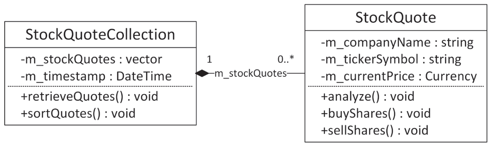
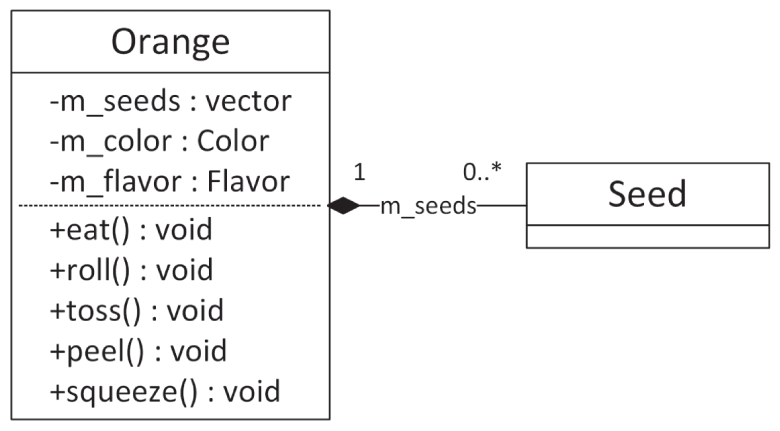
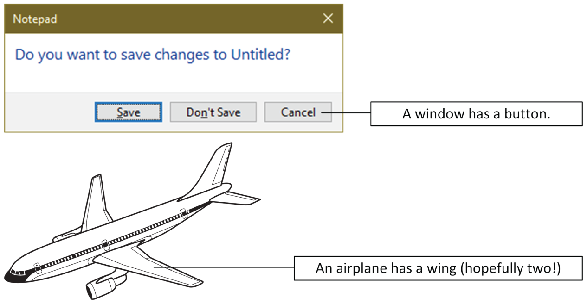
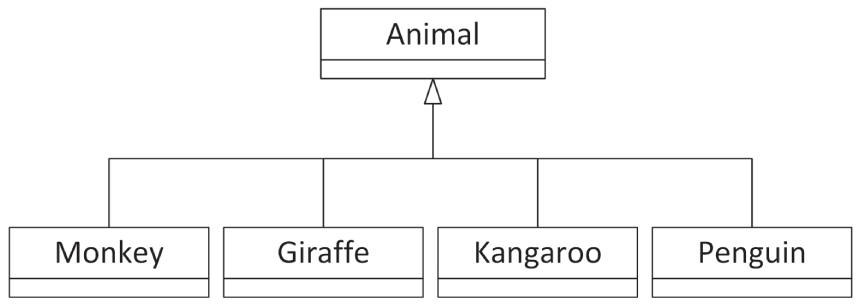
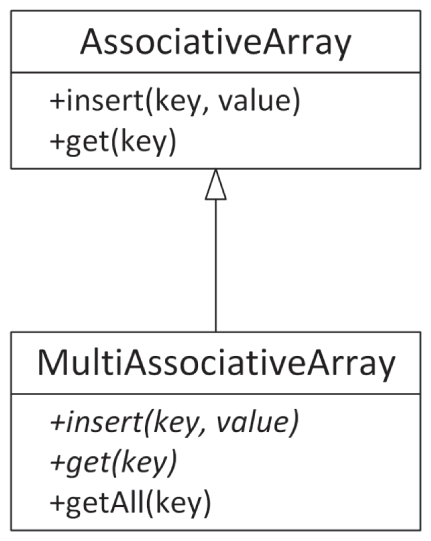
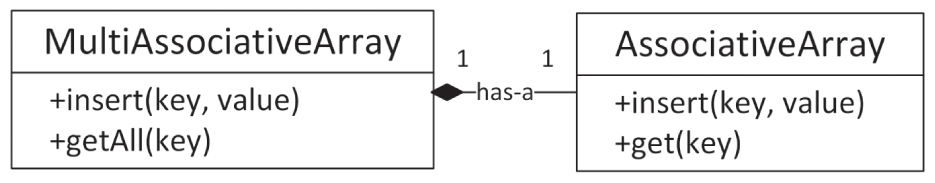
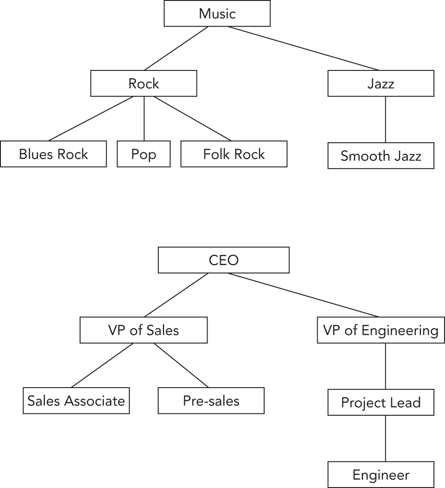
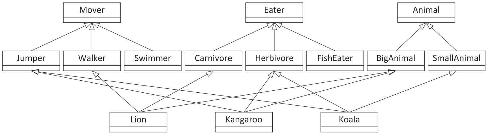
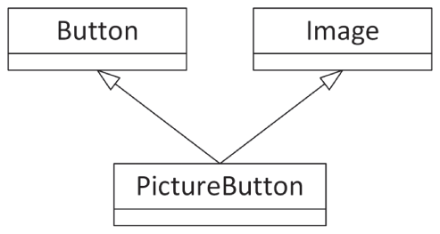
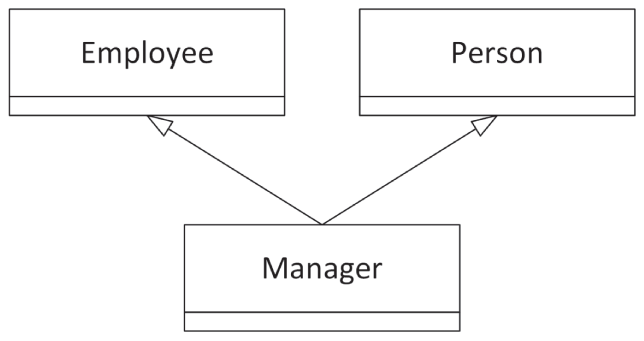

:::tip[WHAT'S IN THIS CHAPTER?]
- What object-oriented programming design is
- What classes, objects, properties, and behaviors are
- How you can define relationships between different classes
:::

Now that you have developed an appreciation for good software design from [Chapter 4](../c04), “Designing Professional C++ Programs,” it's time to pair the notion of classes with the concept of good design. The difference between programmers who use classes in their code and those who truly grasp object-oriented programming comes down to the way their classes relate to each other and to the overall design of the program.

This chapter begins with a brief description of procedural programming (C-style), followed by a detailed discussion of object-oriented programming (OOP). Even if you've been using classes for years, you will want to read this chapter for some new ideas regarding how to think about classes. I will discuss the different kinds of relationships between classes, including pitfalls programmers often succumb to when building an object-oriented program.

When thinking about procedural programming or object-oriented programming, the most important point to remember is that they just represent different ways of reasoning about what's going on in your program. Too often, programmers get bogged down in the syntax and jargon of OOP before they adequately understand what a class is and what objects are. This chapter is light on code and heavy on concepts and ideas. [Chapters 8](../c08), “Gaining Proficiency with Classes and Objects,” [9](../c09), “Mastering Classes and Objects,” and [10](../c10), “Discovering Inheritance Techniques,” go deeper in on C++ class syntax.

## AM I THINKING PROCEDURALLY?

A procedural language, such as C, divides code into small pieces, each of which (ideally) accomplishes a single task. Without procedures in C, all your code would be lumped together inside `main()`. Your code would be difficult to read, and your co-workers would be annoyed, to say the least.

The computer doesn't care if all your code is in `main()` or if it's split into bite-sized pieces with descriptive names and comments. Procedures are an abstraction that exists to help you, the programmer, as well as those who read and maintain your code. The concept is built around a fundamental question about your program—*What does this program do?* By answering that question in English, you are thinking procedurally. For example, you might begin designing a stock selection program by answering as follows: First, the program obtains stock quotes from the Internet. Then, it sorts this data by specific metrics. Next, it performs analysis on the sorted data. Finally, it outputs a list of buy and sell recommendations. When you start coding, you might directly turn this mental model into C functions: `retrieveQuotes()`, `sortQuotes()`, `analyzeQuotes()`, and `outputRecommendations()`.

:::note
Even though C refers to procedures as “functions,” C is not a functional language. The term functional is different from procedural and refers to languages like Lisp, which use an entirely different abstraction.
:::

The procedural approach tends to work well when your program follows a specific list of steps. However, in large, modern applications, there is rarely a linear sequence of events. Often a user is able to perform any command at any time. Procedural thinking also says nothing about data representation. In the previous example, there was no discussion of what a stock quote actually is.

If the procedural mode of thought sounds like the way you approach a program, don't worry. Once you realize that OOP is simply an alternative, more flexible way of thinking about software, it'll come naturally.

## THE OBJECT-ORIENTED PHILOSOPHY

Unlike the procedural approach, which is based on the question “What does this program do?” the object-oriented approach asks another question: “What real-world objects am I modeling?” OOP is based on the notion that you should divide your program not into tasks but into models of physical objects. While this seems abstract at first, it becomes clearer when you consider physical objects in terms of their *classes*, *components*, *properties*, and *behaviors*.

### Classes

A class helps distinguish an object from its definition. Consider the orange. There's a difference between talking about oranges in general as tasty fruit that grows on trees and talking about a specific orange, such as the one that's currently dripping juice on my keyboard.

When answering the question “What are oranges?” you are talking about the *class* of things known as oranges. All oranges are fruit. All oranges grow on trees. All oranges are some shade of orange. All oranges have some particular flavor. A class is simply the encapsulation of what defines a classification of objects.

When describing a specific orange, you are talking about an *object*. All objects belong to a particular class. Because the object on my desk is an orange, I know that it belongs to the orange class. Thus, I know that it is a fruit that grows on trees. I can further say that it is a medium shade of orange and ranks “mighty tasty” in flavor. An object is an *instance* of a class—a particular item with characteristics that distinguish it from other instances of the same class.

As a more concrete example, reconsider the stock selection application from earlier. In OOP, “stock quote” is a class because it defines the abstract notion of what makes up a quote. A specific quote, such as “current Microsoft stock quote,” would be an object because it is a particular instance of the class.

From a C background, think of classes and objects as analogous to types and variables. In fact, [Chapter 1](../c01), “A Crash Course in C++ and the Standard Library,” shows that the syntax for classes is similar to the syntax for C structs.

### Components

If you consider a complex real-world object, such as an airplane, it should be fairly easy to see that it is made up of smaller *components*. There's the fuselage, the controls, the landing gear, the engines, and numerous other parts. The ability to think of objects in terms of their smaller components is essential to OOP, just as the breaking up of complicated tasks into smaller procedures is fundamental to procedural programming.

A component is essentially the same thing as a class, just smaller and more specific. A good object-oriented program might have an `Airplane` class, but this class would be huge if it fully described an airplane. Instead, the `Airplane` class deals with many smaller, more manageable, components. Each of these components might have further subcomponents. For example, the landing gear is a component of an airplane, and the wheel is a component of the landing gear.

### Properties

*Properties* are what distinguish one object from another. Going back to the `Orange` class, recall that all oranges are defined as having some shade of orange and a particular flavor. These two characteristics are properties. All oranges have the same properties, just with different values. My orange has a “mighty tasty” flavor, but yours may have a “terribly unpleasant” flavor.

You can also think about properties on the class level. As recognized earlier, all oranges are fruit and grow on trees. These are properties of the fruit class, whereas the specific shade of orange is determined by the particular fruit object. Class properties are shared by all objects of a class, while object properties are present in all objects of the class, but with different values.

In the stock selection example, a stock quote has several object properties, including the name of the company, its ticker symbol, the current price, and other statistics.

Properties are the characteristics that describe an object. They answer the question, “What makes this object different?”

### Behaviors

*Behaviors* answer either of two questions: “What does this object do?” or “What can I do to this object?” In the case of an orange, it doesn't do a whole lot, but we can do things to it. One behavior is that it can be eaten. Like properties, you can think of behaviors on the class level or the object level. All oranges can pretty much be eaten in the same way. However, they might differ in some other behavior, such as being rolled down an incline, where the behavior of a perfectly round orange would differ from that of a more oblate one.

The stock selection example provides some more practical behaviors. If you recall, when thinking procedurally, I determined that my program needed to analyze stock quotes as one of its functions. Thinking in OOP, you might decide that a stock quote object can analyze itself. Analysis becomes a behavior of the stock quote object.

In object-oriented programming, the bulk of functional code is moved out of procedures and into classes. By building classes that have certain behaviors and defining how they interact, OOP offers a much richer mechanism for attaching code to the data on which it operates. Behaviors for classes are implemented in *class member functions*.

As [Chapter 4](../c04) explains, C++ is a multi-paradigm language supporting both object-oriented programming and procedural programming. Thus, C++ does not force you to put everything into classes, like languages such as Java do. In C++, you are free to use classes when OOP makes sense, but there is nothing wrong with combining it with procedural programming and keeping certain functionality in stand-alone functions. In fact, a lot of the functionality of the C++ Standard Library is provided as stand-alone functions, e.g., all its algorithms.

### Bringing It All Together

With these concepts, you could take another look at the stock selection program and redesign it in an object-oriented manner.

As discussed, “stock quote” would be a fine class to start with. To obtain the list of quotes, the program needs the notion of a group of stock quotes, which is often called a *collection*. So, a better design might be to have a class that represents a “collection of stock quotes,” which is made up of smaller components that represent a single “stock quote.”

Moving on to properties, the collection class would have at least one property—the actual list of quotes received. It might also have additional properties, such as the exact date and time of the most recent retrieval. As for behaviors, the “collection of stock quotes” would be able to talk to a server to get the quotes and provide a sorted list of quotes. These are the “retrieve quotes” and “sort quotes” behaviors.

The stock quote class would have the properties discussed earlier—name, symbol, current price, and so on. Also, it would have an analyze behavior. You might consider other behaviors, such as buying and selling the stock.

It is often useful to create diagrams showing the relationship between components. [Figure 5.1](#c05-fig-0001) uses the UML class diagram syntax, see [Appendix D](../b04), “Introduction to UML,” to indicate that a `StockQuoteCollection` contains zero or more (0..\*) `StockQuote` objects, and that a `StockQuote` object belongs to a single (1) `StockQuoteCollection`.

 


[^FIGURE 5.1]

Let's look at a second example. As described earlier, an orange has properties such as its color and flavor, as well as behaviors such as being eaten and rolled. You can come up with many more behaviors such as being tossed, peeled, or squeezed. Another property of an orange could be a collection of its seeds. [Figure 5.2](#c05-fig-0002) shows a possible UML class diagram for the `Orange` and `Seed` classes, including the relationship that an `Orange` contains zero or more (0..\*) `Seed`s and that a `Seed` belongs to a single (1) `Orange`.

 


[^FIGURE 5.2]

## LIVING IN A WORLD OF CLASSES

Programmers who transition from a procedural thought process to the object-oriented paradigm often experience an epiphany about the combination of properties and behaviors into classes. Some programmers find themselves revisiting the design of programs they're working on and rewriting certain pieces as classes. Others might be tempted to throw all the code away and restart the project as a fully object-oriented application.

There are two major approaches to developing software with classes. To some people, classes simply represent a nice encapsulation of data and functionality. These programmers sprinkle classes throughout their programs to make the code more readable and easier to maintain. Programmers taking this approach slice out isolated pieces of code and replace them with classes like a surgeon implanting a pacemaker. There is nothing inherently wrong with this approach. These people see classes as a tool that is beneficial in many situations. Certain parts of a program just “feel like a class,” like the stock quote. These are the parts that can be isolated and described in real-world terms.

Other programmers adopt the OOP paradigm fully and turn everything into a class. In their minds, some classes correspond to real-world things, such as an orange or a stock quote, while others encapsulate more abstract concepts, such as a sorter or an undo class.

The ideal approach is probably somewhere in between these extremes. Your first object-oriented program might really have been a traditional procedural program with a few classes sprinkled in. Or perhaps you went whole hog and made everything a class, from a class representing an `int` to a class representing the main application. Over time, you will find a happy medium.

### Over-Classification

There is often a fine line between designing a creative object-oriented system and annoying everybody else on your team by turning every little thing into a class. As Freud used to say, sometimes a variable is just a variable. Okay, that's a paraphrase of what he said.

Perhaps you're designing the next bestselling tic-tac-toe game. You're going all-out OOP on this one, so you sit down with a cup of coffee and a notepad to sketch out your classes and objects. In games like this, there's often a class that oversees game play and is able to detect the winner. To represent the game board, you might envision a `Grid` class that will keep track of the markers and their locations. In fact, a component of the grid could be the `Piece` class that represents an X or an O.

Wait, back up! This design proposes to have a class that represents an X or an O. That is perhaps class overkill. After all, can't a `char` represent an X or an O just as well? Better yet, why can't the `Grid` just use a two-dimensional array of an enumeration type? Does a `Piece` class just complicate the code? Take a look at the following table representing the proposed piece class:

| CLASS | ASSOCIATED COMPONENTS | PROPERTIES | BEHAVIORS |
| --- | --- | --- | --- |
| Piece | None | X or O | None |

The table is a bit sparse, strongly hinting that what we have here may be too granular to be a full-fledged class.

On the other hand, a forward-thinking programmer might argue that while `Piece` is a pretty meager class as it currently stands, making it into a class allows future expansion without any real penalty. Perhaps down the road, additional properties could be added such as the color of the `Piece` or whether the `Piece` was the most recently moved.

Another solution might be to think about the *state* of a grid square instead of using pieces. The state of a square can be Empty, X, or O. To make the design future-proof, you could design an abstract base class `State` with concrete derived classes `StateEmpty`, `StateX`, and `StateO`. With this design, extra properties can be added in the future to the base class or to the individual classes.

Obviously, there is no right answer. The important point is that these are issues that you should consider when designing your application. Remember that classes exist to help programmers manage their code. If classes are being used for no reason other than to make the code “more object-oriented,” something is wrong.

### Overly General Classes

Perhaps a worse annoyance than classes that shouldn't be classes is classes that are too general. All OOP students start with examples like “orange”—things that are classes, no question about it. In real-life coding, classes can get pretty abstract. Many OOP programs have an “application class,” despite that an application isn't really something you can envision in material form. Yet it may be useful to represent the application as a class because the application itself has certain properties and behaviors.

An overly general class is a class that doesn't represent a particular thing at all. The programmer may be attempting to make a class that is flexible or reusable, but ends up with one that is confusing. For example, imagine a program that organizes and displays media. It can catalog your photos, organize your digital music and movie collection, and serve as a personal journal. The overly general approach is to think of all these things as “media” objects and build a single class that can accommodate all of the supported formats. This single class might have a property called “data” that contains the raw bits of the image, song, movie, or journal entry, depending on the type of media. The class might have a behavior called “perform” that appropriately draws the image, plays the song, plays the movie, or brings up the journal entry for editing.

The clues that this single class is too general are in the names of the properties and behaviors. The word *data* has little meaning by itself—you have to use a general term here because this class has been overextended to three very different uses. Similarly, *perform* will do very different things for the different types of media. Clearly, this class is trying to do too much.

Nevertheless, when designing a program to organize media, there for sure will be a `Media` class in your application. This `Media` class will contain the common properties that all types of media have, such as a name, a preview, a link to the corresponding media file, and so on. What this `Media` class should not contain though is the details about handling specific media. It should not contain code to display an image, or to play a song or a movie. Instead, there should be other classes in your design such as a `Picture` class and a `Movie` class. Those specific classes then contain the actual media-specific functionality such as displaying a picture or playing a movie. Obviously, those media-specific classes are somehow related to the `Media` class, and that's exactly the topic of the next section on how to express relationships between classes.

## CLASS RELATIONSHIPS

As a programmer, you will certainly encounter cases where different classes have characteristics in common, or seem somehow related to each other. Object-oriented languages provide a number of mechanisms for dealing with such relationships between classes. The tricky part is to understand what the relationship actually is. There are two main types of class relationships—a *has-a* relationship and an *is-a* relationship.

### The Has-a Relationship

Classes engaged in a has-a relationship follow the pattern A has a B, or A contains a B. In this type of relationship, you can envision one class as part of another. Components, as defined earlier, generally represent a has-a relationship because they describe classes that are made up of other classes.

A real-world example of this might be the relationship between a zoo and a monkey. You could say that a zoo has a monkey or a zoo contains a monkey. A simulation of a zoo in code would have a zoo class, which has a monkey component.

Often, thinking about user interface scenarios is helpful in understanding class relationships. This is so because even though not all UIs are implemented in OOP (though these days, most are), the visual elements on the screen translate well into classes. One UI analogy for a has-a relationship is a window that contains a button. The button and the window are clearly two separate classes, but they are obviously related in some way. Because the button is inside the window, you say that the window has a button.

[Figure 5.3](#c05-fig-0003) shows a real-world and a user interface has-a relationship.

 


[^FIGURE 5.3]

There are two types of has-a relationships:

- **Aggregation:** With aggregation, the aggregated objects (components) can continue to live when the aggregator is destroyed. For example, suppose a zoo object contains a bunch of animal objects. When the zoo object is destroyed because it went bankrupt, the animal objects are (ideally) not destroyed; they are moved to another zoo.
- **Composition:** With composition, if an object composed of other objects is destroyed, those other objects are destroyed as well. For example, if a window object containing buttons is destroyed, those button objects are destroyed as well.

### The Is-a Relationship (Inheritance)

The is-a relationship is such a fundamental concept of object-oriented programming that it has many names, including *deriving*, *subclassing*, *extending*, and *inheriting*. Classes model the fact that the real world contains objects with properties and behaviors. Inheritance models the fact that these objects tend to be organized in hierarchies. These hierarchies indicate is-a relationships.

Fundamentally, inheritance follows the pattern A is a B or A is really quite a bit like B—it can get tricky. To stick with the simple case, revisit the zoo, but assume that there are other animals besides monkeys. That statement alone has already constructed the relationship—a monkey is an animal. Similarly, a giraffe is an animal, a kangaroo is an animal, and a penguin is an animal. So what? Well, the magic of inheritance comes when you realize that monkeys, giraffes, kangaroos, and penguins have certain things in common. These commonalities are characteristics of animals in general.

What this means for the programmer is that you can define an `Animal` class that encapsulates all of the properties (size, location, diet, and so on) and behaviors (move, eat, sleep) that pertain to every animal. The specific animals, such as monkeys, become derived classes of `Animal` because a monkey contains all the characteristics of an animal. Remember, a monkey is an animal plus some additional characteristics that make it distinct. [Figure 5.4](#c05-fig-0004) shows an inheritance diagram for animals. The arrows indicate the direction of the is-a relationship.

 


[^FIGURE 5.4]

Just as monkeys and giraffes are different types of animals, a user interface often has different types of buttons. A checkbox, for example, is a button. Assuming that a button is simply a UI element that can be clicked to perform an action, a `Checkbox` extends the `Button` class by adding state—whether the box is checked or unchecked.

When relating classes in an is-a relationship, one goal is to factor common functionality into the *base class*, the class that other classes extend. If you find that all of your derived classes have code that is similar or exactly the same, consider how you could move some or all of that code into the base class. That way, any changes that need to be made only happen in one place and future derived classes get the shared functionality “for free.”

:::note
Sometimes, it is clear whether a relationship represents a has-a or an is-a relationship. Other times, it is not so clear. If you can choose, has-a is preferred over is-a, as explained with an example later in this section.
:::

#### Inheritance Techniques

The preceding examples cover a few of the techniques used in inheritance without formalizing them. When deriving classes, there are several ways that the programmer can distinguish a class from its *parent class*, also called *base class* or *superclass*. A derived class may use one or more of these techniques, and they are recognized by completing the sentence, “A is a B that is ….”

##### Adding Functionality

A derived class can augment its parent by adding additional functionality. For example, a monkey is an animal that can swing from trees. In addition to having all of the member functions of `Animal`, the `Monkey` class also has a `swingFromTrees()` member function, which is specific to only the `Monkey` class.

##### Replacing Functionality

A derived class can replace or *override* a member function of its parent entirely. For example, most animals move by walking, so you might give the `Animal` class a `move()` member function that simulates walking. If that's the case, a kangaroo is an animal that moves by hopping instead of walking. All the other properties and member functions of the `Animal` base class still apply, but the `Kangaroo` derived class simply changes the way that the `move()` member function works. Of course, if you find yourself replacing all of the functionality of your base class, it may be an indication that inheriting was not the correct thing to do after all, unless the base class is an *abstract base class*. An abstract base class forces each of the derived classes to implement all member functions that do not have an implementation in the abstract base class. You cannot create instances of an abstract base class. Abstract base classes are discussed in [Chapter 10](../c10), “Discovering Inheritance Techniques.”

##### Adding Properties

A derived class can also add new properties to the ones that are inherited from the base class. For example, a penguin has all the properties of an animal but also has a beak size property.

##### Replacing Properties

C++ provides a way of overriding properties similar to the way you can override member functions. However, doing so is rarely appropriate, because it hides the property from the base class; that is, the base class can have a specific value for a property with a certain name, while the derived class can have another value for another property but with the same name. Hiding is explained in more detail in [Chapter 10](../c10). It's important not to get the notion of replacing a property confused with the notion of derived classes having different values for properties. For example, all animals have a diet property that indicates what they eat. Monkeys eat bananas and penguins eat fish, but neither of these is replacing the diet property—they simply differ in the value assigned to the property.

#### Polymorphism

*Polymorphism* is the notion that objects that adhere to a standard set of properties and member functions can be used interchangeably. A class definition is like a contract between objects and the code that interacts with them. By definition, any `Monkey` object must support the properties and member functions of the `Monkey` class.

This notion extends to base classes as well. Because all monkeys are animals, all `Monkey` objects support the properties and member functions of the `Animal` class as well.

Polymorphism is a beautiful part of object-oriented programming because it truly takes advantage of what inheritance offers. In a zoo simulation, you could programmatically loop through all of the animals in the zoo and have each animal move once. Because all animals are members of the `Animal` class, they all know how to move. Some of the animals have overridden the move member function, but that's the best part—your code simply tells each animal to move without knowing or caring what type of animal it is. Each one moves whichever way it knows how.

### The Fine Line Between Has-a and Is-a

In the real world, it's pretty easy to classify has-a and is-a relationships between objects. Nobody would claim that an orange has a fruit—an orange is a fruit. In code, things sometimes aren't so clear.

Consider a hypothetical class that represents an associative array, a data structure that efficiently maps a key to a value. For example, an insurance company could use an `AssociativeArray` class to map member IDs to names so that given an ID, it's easy to find the corresponding member name. The member ID is the *key*, and the member name is the *value*.

In a standard associative array implementation, a key is associated with a single value. If the ID 14534 maps to the member name “Kleper, Scott,” it cannot also map to the member name “Kleper, Marni.” In most implementations, if you tried to add a second value for a key that already has a value, the first value would go away. In other words, if the ID 14534 mapped to “Kleper, Scott” and you then assigned the ID 14534 to “Kleper, Marni,” then Scott would effectively be uninsured. This is demonstrated in the following sequence, which shows two calls to a hypothetical `insert()` member function and the resulting contents of the associative array:

```cpp
myArray.insert(14534, "Kleper, Scott");
```

| KEYS | VALUES |
| --- | --- |
| 14534 | “Kleper, Scott” [string] |

```cpp
myArray.insert(14534, "Kleper, Marni");
```

| KEYS | VALUES |
| --- | --- |
| 14534 | “Kleper, Marni” [string] |

```cpp

```

It's not difficult to imagine uses for a data structure that's like an associative array but allows multiple values for a given key. In the insurance example, a family might have several names that correspond to the same ID. Because such a data structure is similar to an associative array, it would be nice to leverage that functionality somehow. An associative array can have only a single value as a key, but that value can be anything. Instead of a string, the value could be a collection (such as a `vector`) containing the multiple values for the key. Every time you add a new member for an existing ID, you add the name to the collection. This would work as shown in the following sequence:

```cpp
Collection collection;                 // Make a new collection.
collection.insert("Kleper, Scott");    // Add a new element to the collection.
myArray.insert(14534, collection);     // Insert the collection into the array.
```

| KEYS | VALUES |
| --- | --- |
| 14534 | {“Kleper, Scott”} [Collection] |

```cpp
Collection collection { myArray.get(14534) };  // Retrieve the existing collection.
collection.insert("Kleper, Marni");         // Add a new element to the collection.
myArray.insert(14534, collection);  // Replace the collection with the updated one.
```

| KEYS | VALUES |
| --- | --- |
| 14534 | {“Kleper, Scott”, “Kleper, Marni”} [Collection] |

```cpp

```

Messing around with a collection instead of a string is tedious and requires a lot of repetitive code. It would be preferable to wrap up this multiple-value functionality in a separate class, perhaps called a `MultiAssociativeArray`. The `MultiAssociativeArray` class would work just like `AssociativeArray` except that behind the scenes, it would store each value as a collection of strings instead of a single string. Clearly, `MultiAssociativeArray` is somehow related to `AssociativeArray` because it is still using an associative array to store the data. What might be unclear is whether that constitutes an is-a or a has-a relationship.

To start with the is-a relationship, imagine that `MultiAssociativeArray` is a derived class of `AssociativeArray`. This will turn out to be a bad idea, but let's run with it as an example of a bad design. `MultiAssociativeArray` would have to override the member function that adds an entry into the array so that it would either create a collection and add the new element or retrieve the existing collection and add the new element to it. It would also have to override the member function that retrieves a value. There is a complication, though: the overridden `get()` member function should return a single value, not a collection. Which value should a `MultiAssociativeArray` return? One option is to return the first value associated with a given key. An additional `getAll()` member function could be added to retrieve all values associated with a key. This might seem like a reasonable design. Even though it overrides all the member functions of the base class, it still makes use of the base class's member functions from within the derived class. [Figure 5.5](#c05-fig-0005) shows this approach as a UML class diagram.

 


[^FIGURE 5.5]

Now consider it as a has-a relationship. `MultiAssociativeArray` is its own class, but it contains an `AssociativeArray` object. It probably has an interface similar to `AssociativeArray`, but it need not be the same. Behind the scenes, when a user adds something to the `MultiAssociativeArray`, it is really wrapped in a collection and put in an `AssociativeArray` object. This seems perfectly reasonable and is shown in [Figure 5.6](#c05-fig-0006).

 


[^FIGURE 5.6]

So, which solution is right? There seems to be no clear answer, but decades of experience have taught us that has-a is usually the better of the two alternatives. The main reason is to allow modifications to the exposed interface without worrying about maintaining associative array functionality. For example, in [Figure 5.6](#c05-fig-0006), the `get()` member function is changed to `getAll()`, making it clear that this gets all the values for a particular key in a `MultiAssociativeArray`. Additionally, with a has-a relationship, you don't have to worry about any associative array functionality bleeding through. For example, with an is-a relationship, if the associative array class supported a member function that would get the total number of values, it would report the number of collections unless `MultiAssociativeArray` knew to override it.

That said, one could try to make an argument that a `MultiAssociativeArray` actually is an `AssociativeArray` with some new functionality, and it should have been an is-a relationship. The point is that there is sometimes a fine line between the two relationships, and you will need to consider how the class is going to be used and whether what you are building just leverages some functionality from another class or really is that class with modified or new functionality.

The following table represents the arguments for and against taking either approach for the `MultiAssociativeArray` class:

|  | IS-A | HAS-A |
| --- | --- | --- |
| Reasons For | Fundamentally, it‘s the same abstraction with different characteristics.  It provides (almost) the same member functions as `AssociativeArray`. | `MultiAssociativeArray` can have whatever member functions are useful without needing to worry about what member functions `AssociativeArray` has.  The implementation could change to something other than an `AssociativeArray` without changing the exposed member functions. |
| Reasons Against | An associative array by definition has one value per key. To say `MultiAssociativeArray` is an associative array is blasphemy!  `MultiAssociativeArray` overrides both member functions of `AssociativeArray`, a strong sign that something about the design is wrong.  Unknown or inappropriate properties or member functions of `AssociativeArray` could “bleed through” to `MultiAssociativeArray`. | In a sense, `MultiAssociativeArray` reinvents the wheel by coming up with new member functions.  Some additional properties and member functions of `AssociativeArray` might have been useful. |

The reasons against using an is-a relationship in this case are very strong. Additionally, the *Liskov substitution principle* (LSP) can help you decide between an is-a and a has-a relationship. This principle states that you should be able to use a derived class instead of a base class without altering the behavior. Applied to this example, it states that this must be a has-a relationship, because you cannot just start using a `MultiAssociativeArray` where before you were using an `AssociativeArray`. If you would do so, the behavior would change. For example, the `insert()` member function of `AssociativeArray` removes an earlier value with the same key that is already in the array, while `MultiAssociativeArray` does not remove such values.

The two solutions explained in detail in this section are actually not the only two possible solutions. Other options could be for `AssociativeArray` to contain a `MultiAssociativeArray`, or both `AssociativeArray` and `MultiAssociativeArray` could inherit from a common base class, and so on. There are often a multitude of solutions that you can come up with for a certain design.

:::warning
If you do have a choice between the two types of relationships, I recommend, after years of experience, opting for a has-a relationship over an is-a relationship.
:::

Note that the `AssociativeArray` and `MultiAssociativeArray` are used here to demonstrate the difference between the is-a and has-a relationships. In your own code, it is recommended to use one of the standard associative array classes instead of writing your own. The C++ Standard Library provides `std::map`, which you should use instead of `AssociativeArray`, and `std::multimap`, which you should use instead of `MultiAssociativeArray`. Both of these standard classes are discussed in [Chapter 18](../c18), “Standard Library Containers.”

### The Not-a Relationship

As you consider what type of relationship classes have, you should consider whether they actually have a relationship at all. Don't let your zeal for object-oriented design turn into a lot of needless class/derived-class relationships.

One pitfall occurs when things are obviously related in the real world but have no actual relationship in code. Object-oriented hierarchies need to model *functional* relationships, not artificial ones. [Figure 5.7](#c05-fig-0007) shows relationships that are meaningful as ontologies or hierarchies but are unlikely to represent meaningful relationships in code.

 


[^FIGURE 5.7]

The best way to avoid needless inheritance is to sketch out your design first. For every class and derived class, write down what properties and member functions you're planning on putting into the class. You should rethink your design if you find that a class has no particular properties or member functions of its own, or if all of those properties and member functions are completely overridden by its derived classes, except when working with abstract base classes as mentioned earlier.

### Hierarchies

Just as a class `A` can be a base class of `B`, `B` can also be a base class of `C`. Object-oriented hierarchies can model multilevel relationships like this. A zoo simulation with more animals might be designed with every animal as a derived class of a common `Animal` class, as shown in [Figure 5.8](#c05-fig-0008).

 


[^FIGURE 5.8]

As you code each of these derived classes, you might find that a lot of them are similar. When this occurs, you should consider putting in a common parent. Realizing that `Lion` and `Panther` both move the same way and have the same diet might indicate a need for a possible `BigCat` class. You could further subdivide the `Animal` class to include `WaterAnimal` and `Marsupial`. [Figure 5.9](#c05-fig-0009) shows a more hierarchical design that leverages this commonality.

 


[^FIGURE 5.9]

A biologist looking at this hierarchy may be disappointed—a penguin isn't really in the same family as a dolphin. However, it underlines a good point—in code, you need to balance real-world relationships with shared-functionality relationships. Even though two things might be closely related in the real world, they might have a not-a relationship in code because they really don't share functionality. You could just as easily divide animals into mammals and fish, but that wouldn't factor any commonality to the base class.

Another important point is that there could be other ways of organizing the hierarchy. The preceding design is organized mostly by how the animals move. If it were instead organized by the animals’ diet or height, the hierarchy could be very different. In the end, what matters is how the classes will be used. The needs will dictate the design of the class hierarchy.

A good object-oriented hierarchy accomplishes the following:

- Organizes classes into meaningful functional relationships
- Supports code reuse by factoring common functionality to base classes
- Avoids having derived classes that override much of the parent's functionality, unless the parent is an abstract base class

### Multiple Inheritance

Every example so far has had a single inheritance chain. In other words, a given class has, at most, one immediate parent class. This does not have to be the case. Through multiple inheritance, a class can have more than one base class.

[Figure 5.10](#c05-fig-0010) shows a multiple inheritance design. There is still a base class called `Animal`, which is further divided by size. A separate hierarchy categorizes by diet, and a third takes care of movement. Each type of animal is then a derived class of all three of these classes, as shown by different lines.

 


[^FIGURE 5.10]

In a user interface context, imagine an image that the user can click. This class seems to be both a button and an image so the implementation might involve inheriting from both the `Image` class and the `Button` class, as shown in [Figure 5.11](#c05-fig-0011).

 


[^FIGURE 5.11]

Multiple inheritance can be useful in certain cases, but it also has a number of disadvantages that you should always keep in mind. Many programmers dislike multiple inheritance. C++ has explicit support for such relationships, though the Java language does away with them altogether, except for inheriting from multiple interfaces (abstract base classes). There are several reasons to which multiple inheritance critics point.

First, visualizing multiple inheritance is complicated. As you can see in [Figure 5.10](#c05-fig-0010), even a simple class diagram can become complicated when there are multiple hierarchies and crossing lines. Class hierarchies are supposed to make it easier for the programmer to understand the relationships between code. With multiple inheritance, a class could have several parents that are in no way related to each other. With so many classes contributing code to your object, can you really keep track of what's going on?

Second, multiple inheritance can destroy otherwise clean hierarchies. In the animal example, switching to a multiple inheritance approach means that the `Animal` base class is less meaningful because the code that describes animals is now separated into three separate hierarchies. While the design illustrated in [Figure 5.10](#c05-fig-0010) shows three clean hierarchies, it's not difficult to imagine how they could get messy. For example, what if you realize that all `Jumper`s not only move in the same way, but they also eat the same things? Because there are separate hierarchies, there is no way to join the concepts of movement and diet without adding yet another derived class.

Third, implementation of multiple inheritance is complicated. What if two of your base classes implement the same member function in different ways? Can you have two base classes that are themselves a derived class of a common base class? These possibilities complicate the implementation because structuring such intricate relationships in code is difficult both for the author and a reader.

The reason that other languages can leave out multiple inheritance is that it is usually avoidable. By rethinking your hierarchies, you can often avoid introducing multiple inheritance when you have control over the design of a project.

### Mixin Classes

Mixin classes represent another type of relationship between classes. In C++, one way to implement a mixin class is syntactically just like multiple inheritance, but the semantics are refreshingly different. A mixin class answers the question, “What *else* is this class able to do?” and the answer often ends with “-able.” Mixin classes are a way that you can add functionality to a class without committing to a full is-a relationship. You can think of it as a *shares-with* relationship.

Going back to the zoo example, you might want to introduce the notion that some animals are “pettable.” That is, there are some animals that visitors to the zoo can pet, presumably without being bitten or mauled. You might want all pettable animals to support the behavior “be pet.” Because pettable animals don't have anything else in common and you don't want to break the existing hierarchy you've designed, `Pettable` makes a great mixin class.

Mixin classes are used frequently in user interfaces. Instead of saying that a `PictureButton` class is both an `Image` and a `Button`, you might say that it's an `Image` that is `Clickable`. A folder icon on your desktop could be an `Image` that is `Draggable` and `Clickable`. Software developers tend to make up a lot of fun adjectives.

The difference between a mixin class and a base class has more to do with how you think about the class than any code difference. In general, mixin classes are easier to digest than multiple inheritance because they are very limited in scope. The `Pettable` mixin class just adds one behavior to any existing class. The `Clickable` mixin class might just add “mouse down” and “mouse up” behaviors. Additionally, mixin classes rarely have a large hierarchy so there's no cross-contamination of functionality. [Chapter 32](../c32), “Incorporating Design Techniques and Frameworks,” goes into more detail on mixin classes.

## SUMMARY

In this chapter, you've gained an appreciation for the design of object-oriented programs without a lot of code getting in the way. The concepts you've learned are applicable to almost any object-oriented language. Some of it may have been a review to you, or it may be a new way of formalizing a familiar concept. Perhaps you picked up some new approaches to old problems or new arguments in favor of the concepts you've been preaching to your team all along. Even if you've never used classes in your code, or have used them only sparingly, you now know more about how to design object-oriented programs than many experienced C++ programmers.

The relationships between classes are important to study, not just because well-linked classes contribute to code reuse and reduce clutter, but also because you will be working in a team. Classes that relate in meaningful ways are easier to read and maintain. You may decide to use the “Class Relationships” section as a reference when you design your programs.

The next chapter continues the design theme by explaining how to design your code with reuse in mind.

## EXERCISES

By solving the following exercises, you can practice the material discussed in this chapter. Solutions to all exercises are available with the code download on the book's website at `www.wiley.com/go/proc++6e`. However, if you are stuck on an exercise, first reread parts of this chapter to try to find an answer yourself before looking at the solution from the website.

For the exercises in this chapter, there is no single correct solution. As you have learned in the course of this chapter, a specific problem often has several design solutions with different trade-offs. The solutions accompanying these exercises explain one possible design, but that doesn't mean the solutions you came up with must match those.

1. **Exercise 5-1:** Suppose you want to write a car racing game. You will need some kind of model for the car itself. Assume for this exercise there is only one type of car. Each instance of that car needs to keep track of several properties, such as the current power output of its engine, the current fuel usage, the tire pressure, whether or not its driving lights are switched on, whether the windshield wipers are active, and so on. The game should allow players to configure their car with different engines, different tires, custom driving lights and windshield wipers, and so on. How would you model such a car and why?
2. **Exercise 5-2:** Continuing the racing game from Exercise 5-1, you of course want to include support for human-driven cars, but also cars driven by an artificial intelligence (AI). How would you model this in your game?
3. **Exercise 5-3:** Suppose part of a human resources (HR) application has the following three classes:
   - **`Employee`:** Keeping track of employee ID, salary, date when employee started working, and so on
   - **`Person`:** Keeping track of a name and address
   - **`Manager`:** Keeping track of which employees are in their team

     What do you think of the high-level class diagram in [Figure 5.12](#c05-fig-0012)? Are there any changes you would make to it? The diagram doesn't show any properties or behaviors of the different classes, as that's the topic of Exercise 5-4.

      


     [**FIGURE 5.12**](#R_c05-fig-0012)
4. **Exercise 5-4:** Start from the final class diagram for Exercise 5-3. Add a couple of behaviors and properties to the class diagram. Finally, model the fact that a manager manages a team of employees.
