:::tip[WHAT'S IN THIS CHAPTER?]
- Different ways to use and manage memory
- The often-perplexing relationship between arrays and pointers
- A low-level look at working with memory
- Common memory pitfalls
- Smart pointers and how to use them
:::

:::tip[WILEY.COM DOWNLOADS FOR THIS CHAPTER]
Please note that all the code examples for this chapter are available as part of this chapter's code download on the book's website at `www.wiley.com/go/proc++6e` on the Download Code tab.
:::

When you use modern constructs, such as `std::vector`, `std::string`, and so on, as is done starting from [Chapter 1](../c01), “A Crash Course in C++ and the Standard Library,” and throughout all the other chapters of this book, then C++ is a safe language. The language provides many roads, lines, and traffic lights, such as the C++ Core Guidelines (see [Appendix B](../b02), “Annotated Bibliography”), static code analyzers to analyze the correctness of code, and many more.

However, C++ does allow you to drive off-road. One example of driving off-road is manual memory management (allocation and deallocation). Such manual memory management is a particularly error-prone area of C++ programming. To write high-quality C++ programs, professional C++ programmers need to understand how memory works behind the scenes. This first chapter of [Part III](../p03) explores the ins and outs of memory management. You will learn about the pitfalls of dynamic memory and some techniques for avoiding and eliminating them.

This chapter discusses low-level memory handling because professional C++ programmers will encounter such code. However, in modern C++ code you should avoid low-level memory operations as much as possible. For example, instead of dynamically allocated C-style arrays, you should use Standard Library containers, such as `vector`, which handle all memory management automatically for you. Instead of raw pointers, you should use smart pointers, such as `unique_ptr` and `shared_ptr` both discussed later in this chapter, which automatically free the underlying resource, such as memory, when it's not needed anymore. Basically, the goal is to avoid having calls to memory allocation routines such as `new/new[]` and `delete/delete[]` in your code. Of course, it might not always be possible, and in existing code it will most likely not be the case, so as a professional C++ programmer, you still need to know how memory works behind the scenes.

:::warning
In modern C++ code you should avoid low-level memory operations as much as possible, avoid raw pointers when ownership is involved, and avoid using old C-style constructs and functions. Instead, use safe C++ alternatives, such as objects that automatically manage their memory, like the C++ `string` class, the `vector` container, smart pointers, and so on!
:::

## WORKING WITH DYNAMIC MEMORY

Memory is a low-level component of the computer that sometimes unfortunately rears its head even in a high-level programming language like C++. A solid understanding of how dynamic memory really works in C++ is essential to becoming a professional C++ programmer.

### How to Picture Memory

Understanding dynamic memory is much easier if you have a mental model for what objects look like in memory. In this book, a unit of memory is shown as a box with a label next to it. The label indicates a variable name that corresponds to the memory. The data inside the box displays the current value of the memory.

For example, [Figure 7.1](#c07-fig-0001) shows the state of memory after the following line of code is executed. The line should be in a function, so that `i` is a local variable:

```cpp
int i { 7 };
```

 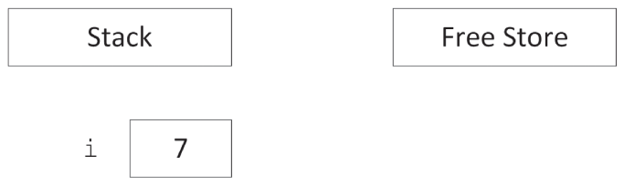


[^FIGURE 7.1]

`i` is called an *automatic variable* allocated on the stack. It is automatically deallocated when the program flow leaves the scope in which the variable is declared.

When you use the `new` keyword, memory is allocated on the free store. If not explicitly initialized, memory allocated by a call to `new` is uninitialized; i.e., it contains whatever random data is left at that location in memory. This uninitialized state is represented with a question mark in diagrams in this chapter. The following code creates a variable `ptr` on the stack initialized with `nullptr` and then allocates memory on the free store to which `ptr` points:

```cpp
int* ptr { nullptr };
ptr = new int;
```

This can also be written as a one-liner:

```cpp
int* ptr { new int };
```

[Figure 7.2](#c07-fig-0002) shows the state of memory after this code is executed. Notice that the variable `ptr` is still on the stack even though it points to memory on the free store. A pointer is just a variable and can live on either the stack or the free store, although this fact is easy to forget. Dynamic memory, however, is always allocated on the free store.

 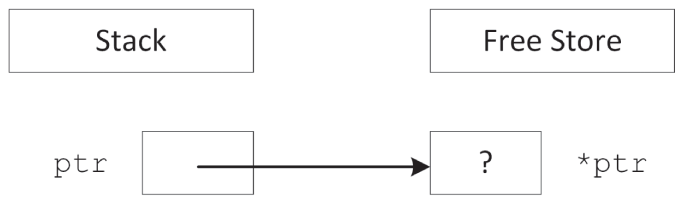


[^FIGURE 7.2]

:::warning
As mandated by the C++ Core Guidelines,[^1] every time you declare a pointer variable, you should immediately initialize it with either a proper pointer or `nullptr`. Don't leave it uninitialized!
:::

The next example shows that pointers can exist both on the stack and on the free store:

```cpp
int** handle { nullptr };
handle = new int*;
*handle = new int;
```

This code first declares a pointer to a pointer to an integer as the variable `handle`. It then dynamically allocates enough memory to hold a pointer to an integer, storing the pointer to that new memory in `handle`. Next, that memory (`*handle`) is assigned a pointer to another section of dynamic memory that is big enough to hold the integer. [Figure 7.3](#c07-fig-0003) shows the two levels of pointers with one pointer residing on the stack (`handle`) and the other residing on the free store (`*handle`).

 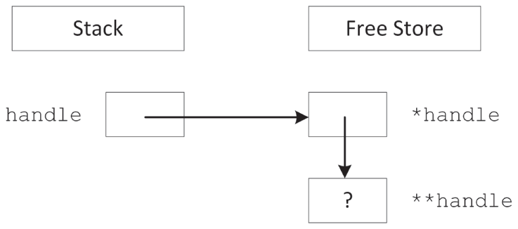


[^FIGURE 7.3]

### Allocation and Deallocation

To create space for a variable, you use the `new` keyword. To release that space for use by other parts of the program, you use the `delete` keyword.

#### Using new and delete

When you want to allocate a block of memory, you call `new` with the type of variable for which you need space. `new` returns a pointer to that memory, although it is up to you to store that pointer in a variable. If you ignore the return value of `new` or if the pointer variable goes out of scope, the memory becomes *orphaned* because you no longer have a way to access it. This is called a *memory leak*.

For example, the following code orphans enough memory to hold an `int`. [Figure 7.4](#c07-fig-0004) shows the state of memory after the code is executed. When there are blocks of data on the free store with no access, direct or indirect, from the stack, the memory is orphaned or leaked.

 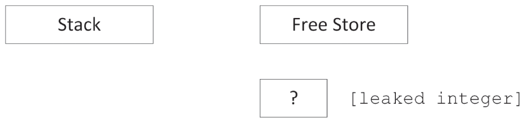


[^FIGURE 7.4]

```cpp
void leaky()
{
    new int;   // BUG! Orphans/leaks memory!
    println("I just leaked an int!");
}
```

Until they find a way to make computers with an infinite supply of fast memory, you will need to tell the compiler when the memory associated with an object can be released and reused for another purpose. To free memory on the free store, you use the `delete` keyword with a pointer to the memory, as shown here:

```cpp
int* ptr { new int };
delete ptr;
ptr = nullptr;
```

:::warning
As a rule of thumb, every line of code that allocates memory with `new`, and that uses a raw pointer instead of storing the pointer in a smart pointer, should correspond to another line of code that releases the same memory with `delete`.
:::

:::note
It is recommended to set a pointer to `nullptr` after having freed its memory. That way, you do not accidentally use a pointer to memory that has already been deallocated. It's also worth noting that you are allowed to call `delete` on a `nullptr` pointer; it simply will not do anything.
:::

#### What About My Good Friend malloc?

If you are a C programmer, you may be wondering what is wrong with the `malloc()` function. In C, `malloc()` is used to allocate a given number of bytes of memory. For the most part, using `malloc()` is simple and straightforward. The `malloc()` function still exists in C++, but you should avoid it. The main advantage of `new` over `malloc()` is that `new` doesn't just allocate memory, it constructs objects!

For example, consider the following two lines of code, which use a hypothetical class called `Foo`:

```cpp
Foo* myFoo { (Foo*)malloc(sizeof(Foo)) };
Foo* myOtherFoo { new Foo{} };
```

After executing these lines, both `myFoo` and `myOtherFoo` point to areas of memory on the free store that are big enough for a `Foo` object. Data members and member functions of `Foo` can be accessed using both pointers. The difference is that the `Foo` object pointed to by `myFoo` isn't a proper object because its constructor was never called. The `malloc()` function only sets aside a piece of memory of a certain size. It doesn't know about or care about objects. In contrast, the call to `new` allocates the appropriate size of memory and also calls an appropriate constructor to construct the object.

A similar difference exists between the `free()` function and the `delete` operator. With `free()`, the object's destructor is not called. With `delete`, the destructor is called and the object is properly cleaned up.

:::warning
Avoid the use of `malloc()` and `free``()` in C++.
:::

#### When Memory Allocation Fails

Many, if not most, programmers write code with the assumption that `new` will always be successful. The rationale is that if `new` fails, it means that memory is very low and life is very, very bad. It is often an unfathomable state to be in because it's unclear what your program could possibly do in this situation.

By default, an exception is thrown when `new` fails, for example if there is not enough memory available for the request. If this exception is not caught, the program will be terminated. In many programs, this behavior is acceptable. [Chapter 1](../c01) introduces exceptions, and [Chapter 14](../c14), “Handling Errors,” explains exceptions in more details and provides possible approaches to recover gracefully from an out-of-memory situation.

There is also an alternative version of `new`, which does not throw an exception. Instead, it returns `nullptr` if allocation fails, similar to the behavior of `malloc()` in C. The syntax for using this version is as follows:

```cpp
int* ptr { new(nothrow) int };
```

The syntax is a little strange: you really do write “nothrow” as if it's an argument to `new` (which it is).

Of course, you still have the same problem as the version that throws an exception—what do you do when the result is `nullptr`? The compiler doesn't require you to check the result, so the `nothrow` version of `new` is more likely to lead to other bugs than the version that throws an exception. For this reason, it's suggested that you use the standard version of `new`. If out-of-memory recovery is important to your program, the techniques covered in [Chapter 14](../c14) give you all the tools you need.

### Arrays

Arrays package multiple variables of the same type into a single variable with indices. Working with arrays quickly becomes natural to a novice programmer because it is easy to think about values in numbered slots. The in-memory representation of an array is not far off from this mental model.

#### Arrays of Primitive Types

When your program allocates memory for an array, it is allocating *contiguous* pieces of memory, where each piece is large enough to hold a single element of the array. For example, a local array of five `int`s can be declared on the stack as follows:

```cpp
int myArray[5];
```

The individual elements of such a primitive type array are uninitialized; that is, they contain whatever is at that location in memory. [Figure 7.5](#c07-fig-0005) shows the state of memory after the array is created. When creating arrays on the stack, the size must be a constant value known at compile time.

 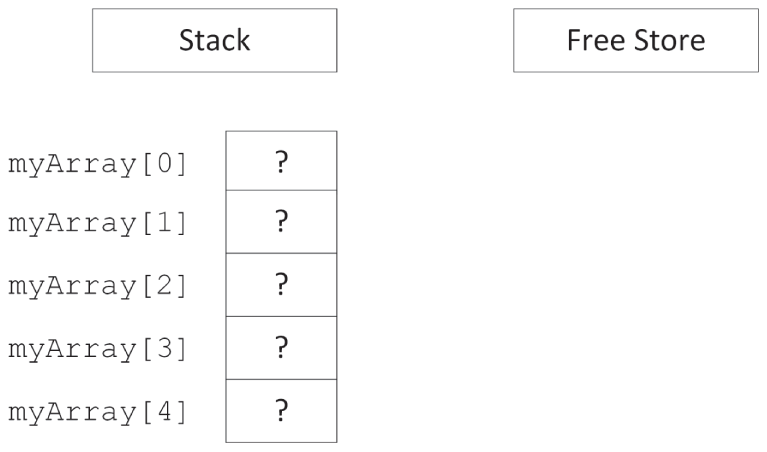


[^FIGURE 7.5]

:::note
Some compilers allow variable-sized arrays on the stack. This is not a standard feature of C++, so I recommend cautiously backing away when you see it.
:::

When creating an array on the stack, an initializer list can be used to provide initial elements:

```cpp
int myArray[5] { 1, 2, 3, 4, 5 };
```

If the initializer list contains less elements than the size of the array, the remaining elements of the array are zero-initialized (see [Chapter 1](../c01)), for example:

```cpp
int myArray[5] { 1, 2 }; // 1, 2, 0, 0, 0
```

To zero-initialize all elements, you can simply write:

```cpp
int myArray[5] { };      // 0, 0, 0, 0, 0
```

When using an initializer list, the compiler can deduce the number of elements automatically, removing the need to explicitly state the size of the array:

```cpp
int myArray[] { 1, 2, 3, 4, 5 };
```

Declaring arrays on the free store is no different, except that you use a pointer to refer to the location of the array. The following code allocates memory for an array of five uninitialized `int`s and stores a pointer to the memory in a variable called `myArrayPtr`:

```cpp
int* myArrayPtr { new int[5] };
```

As [Figure 7.6](#c07-fig-0006) illustrates, the free store-based array is similar to a stack-based array, but in a different location. The `myArrayPtr` variable points to the 0th element of the array.

As with the `new` operator, `new[]` accepts a `nothrow` argument to return `nullptr` instead of throwing an exception if allocation fails:

```cpp
int* myArrayPtr { new(nothrow) int[5] };
```

 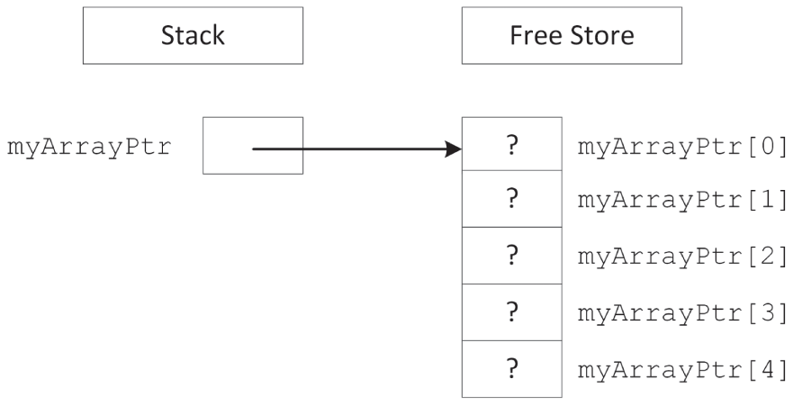


[^FIGURE 7.6]

Dynamically created arrays on the free store can also be initialized with an initializer list:

```cpp
int* myArrayPtr { new int[] { 1, 2, 3, 4, 5 } };
```

Each call to `new[]` should be paired with a call to `delete[]` to clean up the memory. Note the empty square brackets, `[]`, behind `delete[]`!

```cpp
delete [] myArrayPtr;
myArrayPtr = nullptr;
```

The advantage of putting an array on the free store is that you can define its size at run time. For example, the following code snippet receives a desired number of documents from a hypothetical function named `askUserForNumberOfDocuments()` and uses that result to create an array of `Document` objects.

```cpp
Document* createDocumentArray()
{
    size_t numberOfDocuments { askUserForNumberOfDocuments() };
    Document* documents { new Document[numberOfDocuments] };
    return documents;
}
```

Remember that each call to `new[]` should be paired with a call to `delete[]`, so in this example, it's important that the caller of `createDocumentArray()` uses `delete[]` to clean up the returned memory. Another problem is that C-style arrays don't know their size; thus, callers of `createDocumentArray()` have no idea how many elements there are in the returned array!

In the preceding function, `documents` is a dynamically allocated array. Do not get this confused with a *dynamic array*. The array itself is not dynamic because its size does not change once it is allocated. Dynamic memory lets you specify the size of an allocated block at run time, but it does not automatically adjust its size to accommodate the data.

:::note
There are data structures that do dynamically adjust their size and that do know their actual size, for example Standard Library containers. You should use such containers instead of C-style arrays because they are much safer to use.
:::

There is a function in C++ called `realloc()`, which is a holdover from the C language. Do not use it! In C, `realloc()` is used to effectively change the size of an array by allocating a new block of memory of the new size, copying all of the old data to the new location, and deleting the original block. This approach is extremely dangerous in C++ because user-defined objects will not respond well to bitwise copying.

:::warning
Never use `realloc()` in C++! It is not your friend.
:::

#### Arrays of Objects

Arrays of objects are no different than arrays of primitive/fundamental types, except for how their elements are initialized. When you use `new[N]` to allocate an array of *N* objects, enough space is allocated for *N* contiguous blocks where each block is large enough for a single object. For an array of objects, `new[]` automatically calls the zero-argument (= default) constructor for each of the objects, while an array of primitive types by default has uninitialized elements. In this way, allocating an array of objects using `new[]` returns a pointer to an array of fully constructed and initialized objects.

For example, consider the following class:

```cpp
class Simple
{
    public:
        Simple() { println("Simple constructor called!"); }
        ˜Simple() { println("Simple destructor called!"); }
};
```

If you allocate an array of four `Simple` objects, the `Simple` constructor is called four times.

```cpp
Simple* mySimpleArray { new Simple[4] };
```

[Figure 7.7](#c07-fig-0007) shows the memory diagram for this array. As you can see, it is no different than an array of basic types.

 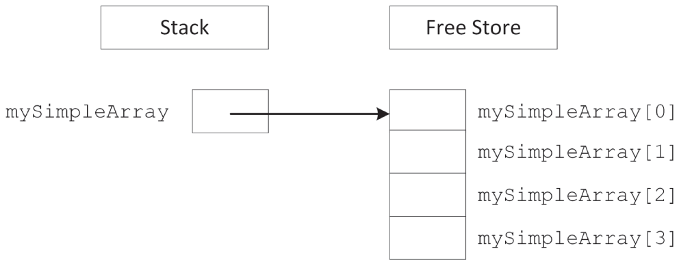


[^FIGURE 7.7]

#### Deleting Arrays

When you allocate memory with `new[]` (i.e., the array version of `new`), you must release it with `delete[]` (i.e., the array version of `delete`). This version automatically destructs the objects in the array in addition to releasing the memory associated with them.

```cpp
Simple* mySimpleArray { new Simple[4] };
// Use mySimpleArray…
delete [] mySimpleArray;
 
mySimpleArray = nullptr;
```

If you do not use the array version of `delete`, your program may behave in odd ways. With some compilers, only the destructor for the first element of the array will be called because the compiler only knows that you are deleting a pointer to an object, and all the other elements of the array will become orphaned objects. With other compilers, memory corruption may occur because `new` and `new[]` can use completely different memory allocation schemes.

:::warning
Always use `delete` on anything allocated with `new`, and always use `delete[]` on anything allocated with `new[]`.
:::

Of course, the destructors are called only if the elements of the array are objects. If you have an array of pointers, you still need to delete each object pointed to individually just as you allocated each object individually, as shown in the following code:

```cpp
const size_t size { 4 };
Simple** mySimplePtrArray { new Simple*[size] };
 
// Allocate an object for each pointer.
for (size_t i { 0 }; i < size; ++i) { mySimplePtrArray[i] = new Simple{}; }
 
// Use mySimplePtrArray…
 
// Delete each allocated object.
for (size_t i { 0 }; i < size; ++i) {
    delete mySimplePtrArray[i];
    mySimplePtrArray[i] = nullptr;
}
 
// Delete the array itself.
delete [] mySimplePtrArray;
mySimplePtrArray = nullptr;
```

:::warning
In modern C++ you should avoid using raw C-style pointers when ownership is involved. Instead of storing raw pointers in C-style arrays, you should store smart pointers in modern Standard Library containers, such as `std::vector`. Smart pointers, discussed later in this chapter, automatically deallocate the memory associated with them at the right time.
:::

#### Multidimensional Arrays

Multidimensional arrays extend the notion of indexed values to multiple indices. For example, a tic-tac-toe game might use a two-dimensional array to represent a three-by-three grid. The following example shows such an array declared on the stack, zero-initialized, and accessed with some test code:

```cpp
char board[3][3] {};
// Test code
board[0][0] = 'X';   // X puts marker in position (0,0).
board[2][1] = 'O';   // O puts marker in position (2,1).
```

You may be wondering whether the first subscript in a two-dimensional array is the x-coordinate or the y-coordinate. The truth is that it doesn't really matter, as long as you are consistent. A four-by-seven grid could be declared as `char board[4][7]` or `char board[7][4]`. For most applications, it is easiest to think of the first subscript as the x-axis and the second as the y-axis.

##### Multidimensional Stack Arrays

In memory, the three-by-three stack-based two-dimensional `board` array looks like [Figure 7.8](#c07-fig-0008). Because memory doesn't have two axes (addresses are merely sequential), the computer represents a two-dimensional array just like a one-dimensional array. The difference is in the size of the array and the method used to access it.

 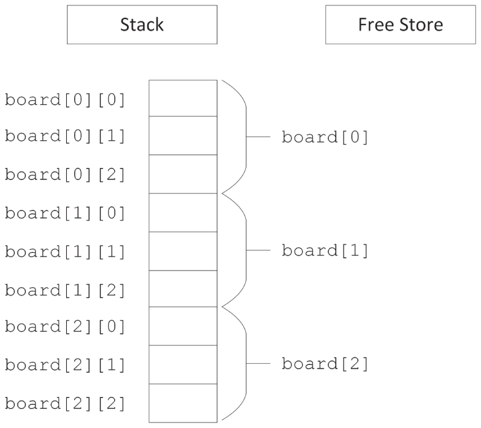


[^FIGURE 7.8]

The size of a multidimensional array is all of its dimensions multiplied together and then multiplied by the size of a single element in the array. In [Figure 7.8](#c07-fig-0008), the three-by-three board is 3 × 3 × 1 = 9 bytes, assuming that a character is 1 byte. For a four-by-seven board of characters, the array would be 4 × 7 × 1 = 28 bytes.

To access a value in a multidimensional array, the computer treats each subscript as if it were accessing another subarray within the multidimensional array. For example, in the three-by-three grid, the expression `board[0]` actually refers to the subarray highlighted in [Figure 7.9](#c07-fig-0009). When you add a second subscript, such as `board[0][2]`, the computer is able to access the correct element by looking up the second subscript within the subarray, as shown in [Figure 7.10](#c07-fig-0010).

These techniques are extended to *N*-dimensional arrays, though dimensions higher than three tend to be difficult to conceptualize and are rarely used.

 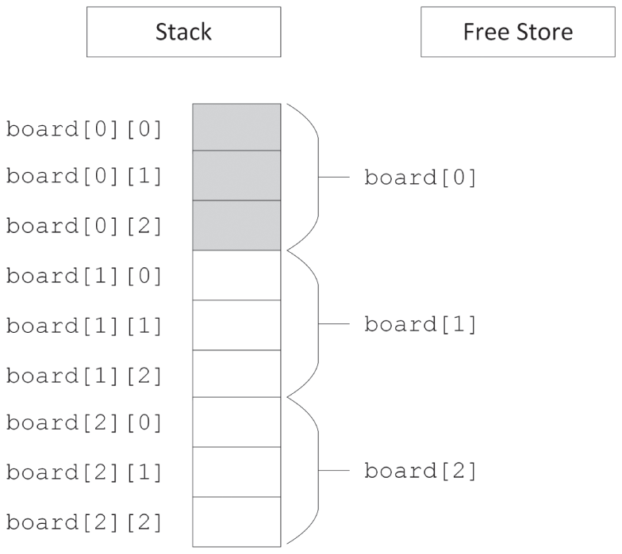


[^FIGURE 7.9]

 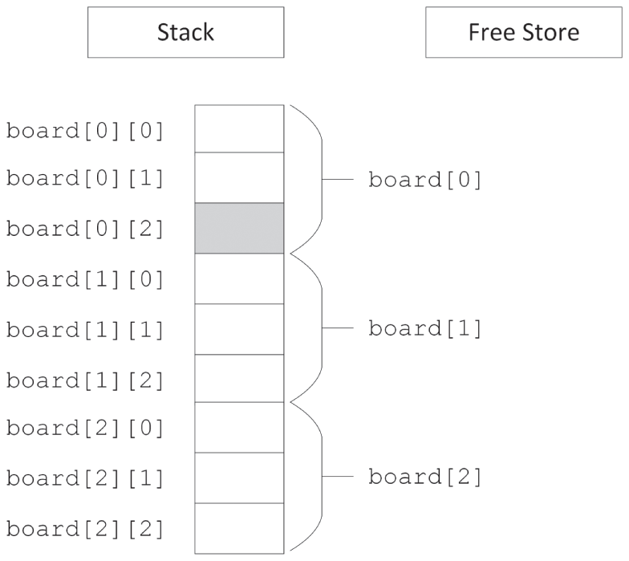


[^FIGURE 7.10]

##### Multidimensional Free Store Arrays

If you need to determine the dimensions of a multidimensional array at run time, you can use a free store-based array. Just as a single-dimensional dynamically allocated array is accessed through a pointer, a multidimensional dynamically allocated array is also accessed through a pointer. The only difference is that in a two-dimensional array, you need to start with a pointer-to-a-pointer; and in an *N*-dimensional array, you need *N* levels of pointers. At first, it might seem as if the correct way to declare and allocate a dynamically allocated multidimensional array is as follows:

```cpp
char** board { new char[i][j] }; // BUG! Doesn't compile
```

This code doesn't compile because multidimensional free store-based arrays don't work like stack-based arrays. Their memory layout isn't contiguous. Instead, you start by allocating a single contiguous array for the first subscript dimension of a free store-based array. Each element of that array is actually a pointer to another array that stores the elements for the second subscript dimension. [Figure 7.11](#c07-fig-0011) shows this layout for a two-by-two dynamically allocated board.

 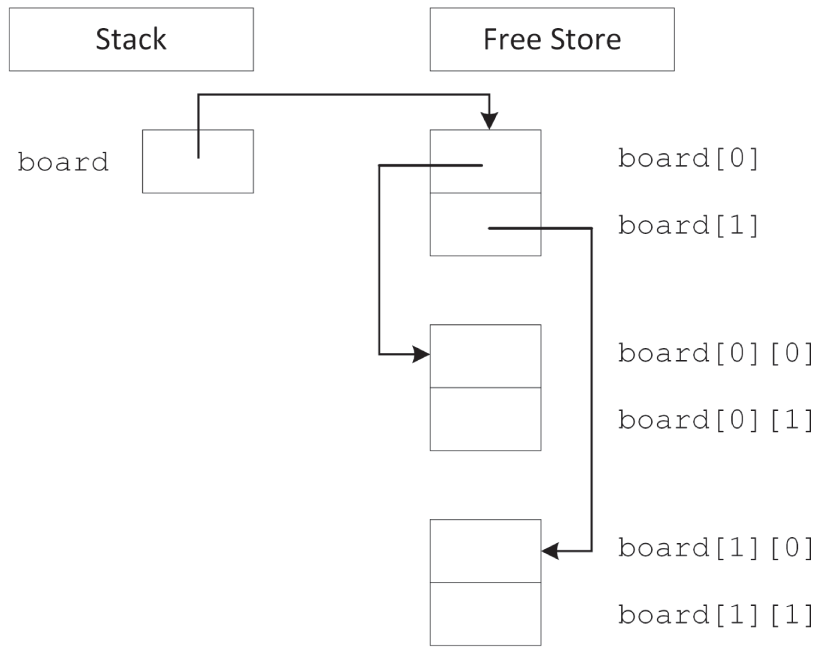


[^FIGURE 7.11]

Unfortunately, the compiler doesn't allocate memory for the subarrays on your behalf. You can allocate the first-dimension array just like a single-dimensional free store-based array, but the individual subarrays must be explicitly allocated. The following function properly allocates memory for a two-dimensional array:

```cpp
char** allocateCharacterBoard(size_t xDimension, size_t yDimension)
{
    char** myArray { new char*[xDimension] }; // Allocate first dimension
    for (size_t i { 0 }; i < xDimension; ++i) {
        myArray[i] = new char[yDimension];    // Allocate ith subarray
    }
    return myArray;
}
```

Similarly, when you want to release the memory associated with a multidimensional free store-based array, the array `delete[]` syntax will not clean up the subarrays on your behalf. Your code to release an array should mirror the code to allocate it, as in the following function:

```cpp
void releaseCharacterBoard(char**& myArray, size_t xDimension)
{
    for (size_t i { 0 }; i < xDimension; ++i) {
        delete [] myArray[i];    // Delete ith subarray
        myArray[i] = nullptr;
    }
    delete [] myArray;           // Delete first dimension
    myArray = nullptr;
}
```

:::note
This example of allocating a multidimensional array is not the most efficient solution. It first allocates memory for the first dimension, followed by allocating memory for each subarray. This results in memory blocks scattered around in memory, which will have a performance impact on algorithms working on such data structures. Algorithms run much faster if they can work with contiguous memory. A better solution is to allocate a single block of memory large enough to store `xDimension yDimension` elements, and to access an element at position (x,y) with a formula such as `x` ` yDimension +` `y`.
:::

Now that you know all the details to work with arrays, it is recommended to avoid these old C-style arrays as much as possible because they do not provide any memory safety. They are explained here because you will encounter them in legacy code. In new code, you should use the C++ Standard Library containers such as `std::array` and `vector`. For example, use `vector<T>` for a one-dimensional dynamic array. For a two-dimensional dynamic array, you could use `vector<vector<T>>`, and similar for higher dimensions. Of course, working directly with data structures such as `vector<vector<T>>` is still tedious, especially for constructing them, and they suffer from the same memory fragmentation problem as discussed in the previous note. So, if you do need *N*-dimensional dynamic arrays in your application, consider writing helper classes that provide an easier to use interface. For example, to work with two-dimensional data with equally long rows, you should consider writing (or reusing of course) a `Matrix<T>` or `Table<T>` class template that hides the memory allocation/deallocation and element access algorithms from the user. See [Chapter 12](../c12), “Writing Generic Code with Templates,” for details on writing class templates.

:::warning
Use C++ Standard Library containers such as `std::array`, `vector`, and so on, instead of C-style arrays!
:::

### Working with Pointers

Pointers get their bad reputation from the relative ease with which you can abuse them. Because a pointer is just a memory address, you could theoretically change that address manually, even doing something as scary as the following line of code:

```cpp
char* scaryPointer { (char*)7 };
```

This line builds a pointer to the memory address 7, which is likely to be random garbage or memory used elsewhere in the application. If you start to use areas of memory that weren't set aside on your behalf, for example with `new` or on the stack, eventually you will corrupt the memory associated with an object, or the memory involved with the management of the free store, and your program will malfunction. Such a malfunction can manifest itself in several ways. For example, it can reveal itself as invalid results because the data has been corrupted, or as hardware exceptions being triggered due to accessing non-existent memory, or attempting to write to protected memory. If you are lucky, you will get one of the serious errors that usually result in program termination by the operating system or the C++ runtime library; if you are unlucky, you will just get wrong results.

#### A Mental Model for Pointers

There are two ways to think about pointers. More mathematically minded readers might view pointers as addresses. This view makes pointer arithmetic, covered later in this chapter, a bit easier to understand. Pointers aren't mysterious pathways through memory; they are numbers that happen to correspond to a location in memory. [Figure 7.12](#c07-fig-0012) illustrates a two-by-two grid in the address-based view of the world.[^2]

 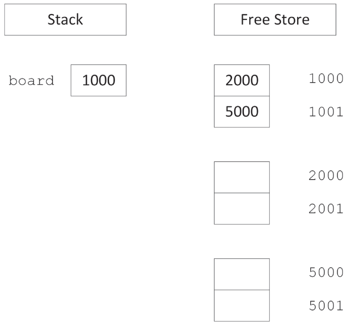


[^FIGURE 7.12]

Readers who are more comfortable with spatial representations might derive more benefit from the “arrow” view of pointers. A pointer is a level of indirection that says to the program, “Hey! Look over there.” With this view, multiple levels of pointers become individual steps on the path to the data. [Figure 7.11](#c07-fig-0011) shows a graphical view of pointers in memory.

When you *dereference* a pointer, by using the `*` operator, you are telling the program to look one level deeper in memory. In the address-based view, think of a dereference as a jump in memory to the address indicated by the pointer. With the graphical view, every dereference corresponds to following an arrow from its base to its head.

When you take the address of a location, using the `&` operator, you are adding a level of indirection in memory. In the address-based view, the program is noting the numerical address of the location, which can be stored as a pointer. In the graphical view, the `&` operator creates a new arrow whose head ends at the location designated by the expression. The base of the arrow can be stored as a pointer.

#### Casting with Pointers

Because pointers are just memory addresses (or arrows to somewhere), they are somewhat weakly typed. A pointer to an XML document is the same size as a pointer to an integer. The compiler lets you easily cast any pointer type to any other pointer type using a *C-style cast*:

```cpp
Document* documentPtr { getDocument() };
char* myCharPtr { (char*)documentPtr };
```

Of course, using the resulting pointer can result in catastrophic run-time errors. A *static cast* offers a bit more safety. The compiler refuses to perform a static cast on pointers to unrelated data types:

```cpp
Document* documentPtr { getDocument() };
char* myCharPtr { static_cast<char*>(documentPtr) };   // BUG! Won't compile
```

[Chapter 10](../c10), “Discovering Inheritance Techniques,” discusses the different styles of casts in detail.

## ARRAY-POINTER DUALITY

You have already seen some of the overlap between pointers and arrays. Free store-allocated arrays are referred to by a pointer to their first element. Stack-based arrays are referred to by using the array syntax (`[]`) with an otherwise normal variable declaration. As you are about to learn, however, the overlap doesn't end there. Pointers and arrays have a complicated relationship.

### Arrays Decay to Pointers

A free store-based array is not the only place where you can use a pointer to refer to an array. You can also use the pointer syntax to access elements of a stack-based array. The address of an array is really the address of the first element (index 0). The compiler knows that when you refer to an array in its entirety by its variable name, you are really referring to the address of the first element. In this way, the pointer works just like with a free store-based array. The following code creates a zero-initialized array on the stack, and uses a pointer to access it:

```cpp
int myIntArray[10] {};
 
int* myIntPtr { myIntArray };
 
// Access the array through the pointer.
myIntPtr[4] = 5;
```

The ability to refer to a stack-based array through a pointer is useful when passing arrays into functions. The following function accepts an array of integers as a pointer. Note that the caller needs to explicitly pass in the size of the array because the pointer implies nothing about size. That is another reason why you should use modern containers such as those provided by the Standard Library.

```cpp
void doubleInts(int* theArray, size_t size)
{
    for (size_t i { 0 }; i < size; ++i) { theArray[i] *= 2; }
}
```

The caller of this function can pass a stack-based or free store-based array. In the case of a free store-based array, the pointer already exists and is passed by value into the function. In the case of a stack-based array, the caller can pass the array variable, and the compiler automatically treats the array variable as a pointer to the array, or you can explicitly pass the address of the first element. All three forms are shown here:

```cpp
size_t arrSize { 4 };
int* freeStoreArray { new int[arrSize]{ 1, 5, 3, 4 } };
doubleInts(freeStoreArray, arrSize);
delete [] freeStoreArray;
freeStoreArray = nullptr;
 
int stackArray[] { 5, 7, 9, 11 };
arrSize = std::size(stackArray);    // Since C++17, requires <array>
//arrSize = sizeof(stackArray) / sizeof(stackArray[0]); // Pre-C++17, see Ch1
doubleInts(stackArray, arrSize);
 
doubleInts(&stackArray[0], arrSize);
```

The parameter-passing semantics of arrays is uncannily similar to that of pointers, because the compiler treats an array as a pointer when it is passed to a function. A function that takes an array as an argument and changes values inside the array is actually changing the original array, not a copy. Just like a pointer, passing an array effectively mimics pass-by-reference functionality because what you really pass to the function is the address of the original array, not a copy. The following implementation of `doubleInts()` changes the original array even though the parameter is an array, not a pointer:

```cpp
void doubleInts(int theArray[], size_t size)
{
    for (size_t i { 0 }; i < size; ++i) { theArray[i] *= 2; }
}
```

Any number between the square brackets after `theArray` in the function prototype is simply ignored. The following three versions are identical:

```cpp
void doubleInts(int* theArray, size_t size);
void doubleInts(int theArray[], size_t size);
void doubleInts(int theArray[2], size_t size);
```

You may be wondering why things work this way. Why doesn't the compiler just copy the array when array syntax is used in the function definition? This is done for efficiency—it takes time to copy the elements of an array, and they potentially take up a lot of memory. By always passing a pointer, the compiler doesn't need to include the code to copy the array.

There is a way to pass known-length stack-based arrays “by reference” to a function, although the syntax is non-obvious. This does not work for free store-based arrays. For example, the following `doubleIntsStack()` accepts only stack-based arrays of size 4:

```cpp
void doubleIntsStack(int (&theArray)[4]);
```

A function template, discussed in detail in [Chapter 12](../c12), can be used to let the compiler deduce the size of the stack-based array automatically:

```cpp
template <size_t N>
void doubleIntsStack(int (&theArray)[N])
{
    for (size_t i { 0 }; i < N; ++i) { theArray[i] *= 2; }
}
```

:::note
Instead of passing a C-style array directly to a function, it is recommended for the function to have a parameter of type `std::span`, discussed in [Chapter 18](../c18), “Standard Library Containers.” `span` wraps a pointer to an array and its size!
:::

### Not All Pointers Are Arrays!

Because the compiler lets you pass in an array where a pointer is expected, as in the `doubleInts()` function in the previous section, you may be led to believe that pointers and arrays are the same. In fact, there are subtle, but important, differences. Pointers and arrays share many properties and can sometimes be used interchangeably (as shown earlier), but they are not the same.

A pointer by itself is meaningless. It may point to random memory, a single object, or an array. You can always use array syntax with a pointer, but doing so is not always appropriate because pointers aren't always arrays. For example, consider the following line of code:

```cpp
int* ptr { new int };
```

The pointer `ptr` is a valid pointer, but it is not an array. You can access the pointed-to value using array syntax (`ptr[0]`), but doing so is stylistically questionable and provides no real benefit. In fact, using array syntax with non-array pointers is an invitation for bugs. The memory at `ptr[1]` could be anything!

:::warning
Arrays automatically decay to pointers, but not all pointers are arrays.
:::

## LOW-LEVEL MEMORY OPERATIONS

One of the great advantages of C++ over C is that you don't need to worry quite as much about memory. If you code using objects, you just need to make sure that each individual class properly manages its own memory. Through construction and destruction, the compiler helps you manage memory by telling you when to do it. Hiding the management of memory within classes makes a huge difference in usability, as demonstrated by the Standard Library classes. However, with some applications or with legacy code, you may encounter the need to work with memory at a lower level. Whether for legacy, efficiency, debugging, or curiosity, knowing some techniques for working with raw bytes can be helpful.

### Pointer Arithmetic

The C++ compiler uses the declared types of pointers to allow you to perform *pointer arithmetic*. If you declare a pointer to an `int` and increase it by 1, the pointer moves ahead in memory by the size of an `int`, not by a single byte. This type of operation is most useful with arrays, because they contain homogeneous data that is sequential in memory. For example, assume you declare an array of `int`s on the free store:

```cpp
int* myArray { new int[8] };
```

You are already familiar with the following syntax for setting the value at index 2:

```cpp
myArray[2] = 33;
```

With pointer arithmetic, you can equivalently use the following syntax, which obtains a pointer to the memory that is “2 `int`s ahead” of `myArray` and then dereferences it to set the value:

```cpp
*(myArray + 2) = 33;
```

As an alternative syntax for accessing individual elements, pointer arithmetic doesn't seem too appealing. Its real power lies in the fact that an expression like `myArray+2` is still a pointer to an `int` and thus can represent a smaller `int` array.

Let's look at an example using wide strings. Wide strings are discussed in [Chapter 21](../c21), “String Localization and Regular Expressions,” but the details are not important at this point. For now, it is enough to know that wide strings support Unicode characters to represent, for example, Japanese strings. The `wchar_t` type is a character type that can accommodate such Unicode characters, and it is usually bigger than a `char`; i.e., it's more than one byte. To tell the compiler that a string literal is a wide-string literal, prefix it with an `L`. For example, suppose you have the following wide string:

```cpp
const wchar_t* myString { L"Hello, World" };
```

Suppose further that you have a function that takes in a wide string and returns a new string that contains a capitalized version of the input:

```cpp
wchar_t* toCaps(const wchar_t* text);
```

You can capitalize `myString` by passing it into this function. However, if you only want to capitalize *part* of `myString`, you can use pointer arithmetic to refer to only a latter part of the string. The following code calls `toCaps()` on the `World` part of the wide string by just adding 7 to the pointer, even though `wchar_t` is usually more than 1 byte:

```cpp
toCaps(myString + 7);
```

Another useful application of pointer arithmetic involves subtraction. Subtracting one pointer from another of the same type gives you the number of elements of the pointed-to type between the two pointers, not the absolute number of bytes between them.

### Custom Memory Management

For 99 percent of the cases you will encounter (some might say 100 percent of the cases), the built-in memory allocation facilities in C++ are adequate. Behind the scenes, `new` and `delete` do all the work of handing out memory in properly sized chunks, maintaining a list of available areas of memory and releasing chunks of memory back to that list upon deletion.

When resource constraints are extremely tight, or under very special conditions, such as managing shared memory, implementing custom memory management may be a viable option. Don't worry—it's not as scary as it sounds. Basically, managing memory yourself means that classes allocate a large chunk of memory and dole out that memory in pieces as it is needed.

How is this approach any better? Managing your own memory can potentially reduce overhead. When you use `new` to allocate memory, the program also needs to set aside a small amount of space to record how much memory was allocated. That way, when you call `delete`, the proper amount of memory can be released. For most objects, the overhead is so much smaller than the memory allocated that it makes little difference. However, for small objects or programs with enormous numbers of objects, the overhead can have an impact.

When you manage memory yourself, you might know the size of each object a priori, so you might be able to avoid the overhead for each object. The difference can be enormous for large numbers of small objects. Performing custom memory management requires overloading the operators `new` and `delete`, a topic for [Chapter 15](../c15), “Overloading C++ Operators.”

### Garbage Collection

With environments that support *garbage collection*, the programmer rarely, if ever, explicitly frees memory associated with an object. Instead, objects to which there are no longer any references will be cleaned up automatically at some point by the runtime library.

Garbage collection is not built into the C++ language as it is in C# and Java. In modern C++, you use smart pointers to manage memory, while in legacy code you will see memory management at the object level through `new` and `delete`. Smart pointers such as `shared_ptr` (discussed later in this chapter) provide something very similar to garbage-collected memory; that is, when the last `shared_ptr` instance for a certain resource is destroyed, at that point in time the resource is destroyed as well. It is possible but not easy to implement true garbage collection in C++, but freeing yourself from the task of releasing memory would probably introduce new headaches.

One approach to garbage collection is called *mark and sweep*. With this approach, the garbage collector periodically examines every single pointer in your program and annotates the fact that the referenced memory is still in use. At the end of the cycle, any memory that hasn't been marked is deemed to be not in-use and is freed. Implementing such an algorithm in C++ is not trivial, and if done wrongly, it can be even more error-prone than using `delete`!

Attempts at safe and easy mechanisms for garbage collection have been made in C++, but even if a perfect implementation of garbage collection in C++ came along, it wouldn't necessarily be appropriate to use for all applications. Among the downsides of garbage collection are the following:

- When the garbage collector is actively running, the program might become unresponsive.
- With garbage collectors, you have non-deterministic destructors. Because an object is not destroyed until it is garbage-collected, the destructor is not executed immediately when the object leaves its scope. This means that cleaning up resources (such as closing a file, releasing a lock, and so on), which is done by the destructor, is not performed until some indeterminate time in the future.

Writing a garbage collection mechanism is very hard. You will undoubtedly do it wrong, it will be error prone, and more than likely it will be slow. So, if you do want to use garbage-collected memory in your application, I recommend you to research existing specialized garbage-collection libraries that you can reuse.

### Object Pools

Garbage collection is like buying plates for a picnic and leaving any used plates out in the yard where someone at some point will pick them up and throw them away. Surely, there must be a more ecological approach to memory management.

Object pools are the equivalent of recycling. You buy a reasonable number of plates, and after using a plate, you clean it so that it can be reused later. Object pools are ideal for situations where you need to use many objects of the same type over time, and creating each one incurs overhead.

[Chapter 29](../c29), “Writing Efficient C++,” contains further details on using object pools for performance efficiency.

## COMMON MEMORY PITFALLS

Handling dynamic memory using `new`/`delete`/`new[]`/`delete[]`, and low-level memory operations are prone to errors. It is difficult to pinpoint the exact situations that can lead to a memory-related bug. Every memory leak or bad pointer has its own nuances. There is no magic bullet for resolving memory issues. This section discusses several common categories of problems and some tools you can use to detect and resolve them.

### Underallocating Data Buffers and Out-of-Bounds Memory Access

Underallocation is a common problem with C-style strings, where it arises when the programmer fails to allocate an extra character for the trailing `'\0'` sentinel. Underallocation of strings also occurs when programmers assume a certain fixed maximum size. The basic built-in C-style string functions do not adhere to a fixed size—they will happily write off the end of the string into uncharted memory.

The following code demonstrates underallocation. It reads data off a network connection and puts it in a C-style string. This is done in a loop because the network connection receives only a small amount of data at a time. On each loop, `getMoreData()` is called, which returns a pointer to dynamically allocated memory. When `nullptr` is returned from `getMoreData()`, all of the data has been received. `strcat()` is a C function that concatenates the C-style string given as a second argument to the end of the C-style string given as a first argument. It expects the destination buffer to be big enough.

```cpp
char buffer[1024] { 0 };   // Allocate a whole bunch of memory.
while (true) {
    char* nextChunk { getMoreData() };
    if (nextChunk == nullptr) {
        break;
    } else {
        strcat(buffer, nextChunk); // BUG! No guarantees against buffer overrun!
        delete [] nextChunk;
    }
}
```

There are three ways to resolve the possible underallocation problem in this example. In decreasing order of preference, they are as follows:

1. Use C++-style strings, which handle the memory associated with concatenation on your behalf.
2. Instead of allocating a buffer as a global variable or on the stack, allocate it on the free store. When there is insufficient space left, allocate a new buffer large enough to hold at least the current contents plus the new chunk, copy the original buffer into the new buffer, append the new contents, and delete the original buffer.
3. Create a version of `getMoreData()` that takes a maximum count (including the `'\0'` character) and returns no more characters than that; then track the amount of space left, and the current position, in the buffer.

Underallocation of data buffers usually leads to out-of-bounds memory access. For example, if you are filling a memory buffer with data, you might start writing outside the allocated data buffer when you assume the buffer is bigger than it actually is. It is only a matter of time before an essential part of memory is overwritten and the program crashes. Consider what might happen if the memory associated with the objects in your program is suddenly overwritten. It's not pretty!

Out-of-bounds memory access also occurs when handling C-style strings that have somehow lost their `'\0'` termination character. For example, if an improperly terminated string is handed to the following function, it will fill the string with `'m'` characters and will happily continue to fill the contents of memory after the string with `'m'`s, overwriting memory outside the bounds of the string.

```cpp
void fillWithM(char* text)
{
    int i { 0 };
    while (text[i] != '\0') {
        text[i] = 'm';
        ++i;
    }
}
```

Bugs that result in writing to memory past the end of an array are often called *buffer overflow errors*. These bugs have been exploited by several high-profile malware programs such as viruses and worms. A devious hacker can take advantage of the ability to overwrite portions of memory to inject code into a running program.

:::warning
Avoid using old C-style strings and arrays that offer no protection whatsoever. Instead, use modern and safe constructs such as C++ `string`s and `vector`s that manage all their memory for you.
:::

### Memory Leaks

In modern C++, there are no memory leaks. All memory management is handled by higher-level classes, such as `std::vector`, `string`, and so on. Only when you drive off-road and perform manual memory allocation and deallocation can memory leaks crop up.

Finding and fixing such memory leaks can be frustrating. Your program finally works and appears to give the correct results. Then, you start to notice that your program gobbles up more and more memory as it runs. Your program has a memory leak.

Memory leaks occur when you allocate memory and neglect to release it. At first, this sounds like the result of careless programming that could easily be avoided. After all, if every `new` has a corresponding `delete` in every class you write, there should be no memory leaks, right? Actually, that's not always true. For example, in the following code, the `Simple` class is properly written to release any memory that it allocates. However, when `doSomething()` is called, the `outSimplePtr` pointer is changed to another `Simple` object without deleting the old one to demonstrate a memory leak. Once you lose a pointer to an object, it's nearly impossible to delete it.

```cpp
class Simple
{
    public:
        Simple() { m_intPtr = new int{}; }
        ˜Simple() { delete m_intPtr; }
        void setValue(int value) { *m_intPtr = value; }
    private:
        int* m_intPtr;
};
 
void doSomething(Simple*& outSimplePtr)
{
    outSimplePtr = new Simple{}; // BUG! Doesn't delete the original.
}
 
int main()
{
    Simple* simplePtr { new Simple{} }; // Allocate a Simple object.
    doSomething(simplePtr);
    delete simplePtr; // Only cleans up the second object.
}
```

:::warning
Keep in mind that this code is only for demonstration purposes! In production-quality code, both `m_intPtr` and `simplePtr` should not be raw pointers, but should be smart pointers discussed later in this chapter.
:::

In cases like the previous example, the memory leak probably arose from poor communication between programmers or poor documentation of the code. The caller of `doSomething()` may not have realized that the variable was passed by reference and thus had no reason to expect that the pointer would be reassigned. If they did notice that the parameter was a reference-to-non-`const` pointer, they may have suspected that something strange was happening, but there is no comment around `doSomething()` that explains this behavior.

#### Finding and Fixing Memory Leaks in Windows with Visual C++

Memory leaks are hard to track down because you can't easily look at memory and see what objects are not in use and where they were originally allocated. However, there are programs that can do this for you. Memory leak detection tools range from expensive professional software packages to free downloadable tools. If you work with Microsoft Visual C++, its debug library has built-in support for memory leak detection. This memory leak detection is not enabled by default, unless you create an MFC project. To enable it in other projects, you need to start by including the following three lines at the beginning of your code. These use the `#define` preprocessor macro, explained in [Chapter 11](../c11), “Modules, Header Files, and Miscellaneous Topics.” However, for now, just use the three lines verbatim as they are.

```cpp
#define _CRTDBG_MAP_ALLOC
#include <cstdlib>
#include <crtdbg.h>
```

These lines should be in the exact order as shown. Next, you need to redefine the `new` operator as follows. This uses a few other preprocessor macros, all explained in [Chapter 11](../c11). Again, just use them as is for now.

```cpp
#ifdef _DEBUG
    #ifndef DBG_NEW
        #define DBG_NEW new ( _NORMAL_BLOCK , __FILE__ , __LINE__ )
        #define new DBG_NEW
    #endif
#endif  // _DEBUG
```

The `#ifdef _DEBUG` statement makes sure that the redefinition of `new` is done only when compiling a debug version of your application. This is what you normally want. Release builds usually do not do any memory leak detection, because of the performance penalty.

The last thing you need to do is to add the following line as the first line in your `main()` function:

```cpp
_CrtSetDbgFlag(_CRTDBG_ALLOC_MEM_DF | _CRTDBG_LEAK_CHECK_DF);
```

This tells the Visual C++ CRT (C RunTime) library to write all detected memory leaks to the debug output console when the application exits. For the earlier leaky program, the debug console will contain lines similar to the following:

```cpp
Detected memory leaks!
Dumping objects ->
c:\leaky\leaky.cpp(15) : {147} normal block at 0x014FABF8, 4 bytes long.
 Data: <  > 00 00 00 00
c:\leaky\leaky.cpp(33) : {146} normal block at 0x014F5048, 4 bytes long.
 Data: <Pa> 50 61 20 01
Object dump complete.
```

sup Start?The output clearly shows in which file and on which line memory was allocated but never deallocated. The line number is between parentheses immediately behind the filename. The number between the curly braces is a counter for the memory allocations. For example, {147} means the 147th allocation in your program since it started. You can use the VC++ `_CrtSetBreakAlloc()` function to tell the VC++ debug runtime to break into the debugger when a certain allocation is performed. For example, you can add the following line to the beginning of your `main()` function to instruct the debugger to break on the 147th allocation:

```cpp
_CrtSetBreakAlloc(147);
```

In this leaky program, there are two leaks: the first `Simple` object that is never deleted (line 33) and the integer on the free store that it creates (line 15). In the Visual C++ debugger output window, you can simply double-click one of the memory leaks, and it will automatically jump to that line in your code.

Of course, programs like Microsoft Visual C++ (discussed in this section) and Valgrind (discussed in the next section) can't actually fix the leak for you—what fun would that be? These tools provide information that you can use to find the actual problem. Normally, that involves stepping through the code to find out where the pointer to an object was overwritten without the original object being released. Most debuggers provide “watch point” functionality that can break execution of the program when this occurs.

#### Finding and Fixing Memory Leaks in Linux with Valgrind

Valgrind is an example of a free open-source tool for Linux that, among other things, pinpoints the exact line in your code where a leaked object was allocated.

The following output, generated by running Valgrind on the earlier leaky program, pinpoints the exact locations where memory was allocated but never released. Valgrind finds the same two memory leaks—the first `Simple` object never deleted and the integer on the free store that it creates:

```cpp
==15606== ERROR SUMMARY: 0 errors from 0 contexts (suppressed: 0 from 0)
==15606== malloc/free: in use at exit: 8 bytes in 2 blocks.
==15606== malloc/free: 4 allocs, 2 frees, 16 bytes allocated.
==15606== For counts of detected errors, rerun with: -v
==15606== searching for pointers to 2 not-freed blocks.
==15606== checked 4455600 bytes.
==15606==
==15606== 4 bytes in 1 blocks are still reachable in loss record 1 of 2
==15606==    at 0x4002978F: __builtin_new (vg_replace:malloc.c:172)
==15606==    by 0x400297E6: operator new(unsigned) (vg_replace:malloc.c:185)
==15606==    by 0x804875B: Simple::Simple() (leaky.cpp:4)
==15606==    by 0x8048648: main (leaky.cpp:24)
==15606==
==15606==
==15606== 4 bytes in 1 blocks are definitely lost in loss record 2 of 2
==15606==    at 0x4002978F: __builtin_new (vg_replace:malloc.c:172)
==15606==    by 0x400297E6: operator new(unsigned) (vg_replace:malloc.c:185)
==15606==    by 0x8048633: main (leaky.cpp:20)
==15606==    by 0x4031FA46: __libc_start_main (in /lib/libc-2.3.2.so)
==15606==
==15606== LEAK SUMMARY:
==15606==    definitely lost: 4 bytes in 1 blocks.
==15606==    possibly lost:   0 bytes in 0 blocks.
==15606==    still reachable: 4 bytes in 1 blocks.
==15606==         suppressed: 0 bytes in 0 blocks.
```

:::warning
It is strongly recommended to use `std::vector`, `array`, `string`, smart pointers (discussed later in this chapter), and other modern C++ constructs to avoid memory leaks.
:::

### Double-Deletion and Invalid Pointers

Once you release memory associated with a pointer using `delete`, the memory is available for use by other parts of your program. Nothing stops you, however, from attempting to continue to use the pointer, which is now a *dangling pointer*. Double deletion is also a problem. If you use `delete` a second time on a pointer, the program could be releasing memory that has since been assigned to another object.

Double deletion and use of already released memory are both difficult problems to track down because the symptoms may not show up immediately. If two deletions occur within a relatively short amount of time, the program potentially could work indefinitely because the associated memory might not have been reused that quickly. Similarly, if a deleted object is used immediately after being deleted, most likely it will still be intact.

Of course, there is no guarantee that such behavior will work or continue to work. The memory allocator is under no obligation to preserve any object once it has been deleted. Even if it does work, it is extremely poor programming style to use objects that have been deleted.

To avoid double deletion and use of already released memory, you should set your pointers to `nullptr` after deallocating their memory.

Many memory leak-detection programs are also capable of detecting double deletion and use of released objects.

## SMART POINTERS

As the previous section demonstrated, memory management in C++ is a perennial source of errors and bugs. Many of these bugs arise from the use of dynamic memory allocation and pointers. When you extensively use dynamic memory allocation in your program and pass many pointers between objects, it's difficult to remember to call `delete` on each pointer exactly once and at the right time. The consequences of getting it wrong are severe: when you free dynamically allocated memory more than once or use a pointer to memory that was already free, you can cause memory corruption or a fatal run-time error; when you forget to free dynamically allocated memory, you cause memory leaks.

Smart pointers help you manage your dynamically allocated memory and are the recommended technique for avoiding memory leaks. Conceptually, a smart pointer can hold a dynamically allocated resource, such as memory. When a smart pointer goes out of scope or is reset, it can automatically free the resource it holds. Smart pointers can be used to manage dynamically allocated resources in the scope of a function, or as data members in classes. They can also be used to pass ownership of dynamically allocated resources through function arguments.

C++ provides several language features that make smart pointers attractive. First, you can write a type-safe smart pointer class for any pointer type using templates; see [Chapter 12](../c12). Second, you can provide an interface to the smart pointer objects using operator overloading (see [Chapter 15](../c15)) that allows code to use the smart pointer objects as if they were dumb raw pointers. Specifically, you can overload the `*`, –`>`, and `[]` operators such that client code can dereference a smart pointer object the same way it dereferences a normal pointer.

There are several types of smart pointers. The simplest type takes sole/unique ownership of a resource. Being the single owner of a resource, the smart pointer can automatically free the referenced resource when it goes out of scope or is reset. The Standard Library provides `std::unique_ptr`, which is a smart pointer with *unique ownership* semantics.

A slightly more advanced type of smart pointer allows for *shared ownership*; that is, several of these smart pointers can refer to the same resource. When such a smart pointer goes out of scope or is reset, it frees the referenced resource only if it's the last smart pointer referring to that resource. The Standard Library provides `std::shared_ptr` supporting shared ownership.

Both standard smart pointers, `unique_ptr` and `shared_ptr`, are defined in `<memory>` and are discussed in detail in the next sections.

:::note
Your default smart pointer should be `unique_ptr`. Use `shared_ptr` only when you really need to share the resource.
:::

:::warning
Never assign the result of a resource allocation to a raw pointer! Whatever resource allocation method you use, always immediately store the resource pointer in a smart pointer, either `unique_ptr` or `shared_ptr`, or use other RAII classes. RAII stands for Resource Acquisition Is Initialization. An RAII class takes ownership of a certain resource and handles its deallocation at the right time. It's a design technique discussed in [Chapter 32](../c32), “Incorporating Design Techniques and Frameworks.”
:::

### unique\_ptr

A `unique_ptr` has sole ownership of a resource. When the `unique_ptr` is destroyed or reset, the resource is automatically freed. One advantage is that memory and resources are always freed, even when `return` statements are executed or when exceptions are thrown. This, for example, simplifies coding when a function has multiple `return` statements, because you don't have to remember to free resources before each `return` statement.

As a rule of thumb, always store dynamically allocated resources having a single owner in instances of `unique_ptr`.

#### Creating unique_ptrs

Consider the following function that blatantly leaks memory by allocating a `Simple` object on the free store and neglecting to release it:

```cpp
void leaky()
{
    Simple* mySimplePtr { new Simple{} };  // BUG! Memory is never released!
    mySimplePtr->go();
}
```

Sometimes you might think that your code is properly deallocating dynamically allocated memory. Unfortunately, it most likely is *not correct* in all situations. Take the following function:

```cpp
void couldBeLeaky()
{
    Simple* mySimplePtr { new Simple{} };
    mySimplePtr->go();
    delete mySimplePtr;
}
```

This function dynamically allocates a `Simple` object, uses the object, and then properly calls `delete`. However, you can still have memory leaks in this example! If the `go()` member function throws an exception, the call to `delete` is never executed, causing a memory leak.

Instead, you should use a `unique_ptr`, created using the `std::make_unique()` helper function. `unique_ptr` is a generic smart pointer that can point to any kind of memory. That's why it is a class template, and `make_unique()` a function template. Both require a template parameter between angle brackets, < >, specifying the type of memory you want the `unique_ptr` to point to. Templates are discussed in detail in [Chapter 12](../c12), but those details are not important to understand how to use smart pointers.

The following function uses a `unique_ptr` instead of a raw pointer. The `Simple` object is not explicitly deleted; but when the `unique_ptr` instance goes out of scope (at the end of the function, or because an exception is thrown), it automatically deallocates the `Simple` object in its destructor.

```cpp
void notLeaky()
{
    auto mySimpleSmartPtr { make_unique<Simple>() };
    mySimpleSmartPtr->go();
}
```

This code uses `make_unique()`, in combination with the `auto` keyword, so that you only have to specify the type of the pointer, `Simple` in this case, once. This is the recommended way to create a `unique_ptr`. If the `Simple` constructor requires parameters, you pass them as arguments to `make_unique()`.

`make_unique()` uses value initialization. Primitive types, for example, are initialized to zero, and objects are default constructed. If you don't need this value initialization, for instance because you will overwrite the initial value anyway, then you can skip the value initialization and improve performance by using the `make_unique_for_overwrite()` function, which uses default initialization. For primitive types, this means they are not initialized at all and contain whatever is in memory at their location, while objects are still default constructed.

You can also create a `unique_ptr` by directly calling its constructor as follows. Note that `Simple` must now be mentioned twice:

```cpp
unique_ptr<Simple> mySimpleSmartPtr { new Simple{} };
```

As discussed earlier in this book, class template argument deduction (CTAD) can often be used to let the compiler deduce the template type arguments for class templates based on the arguments passed to a constructor of the class template. For example, it allows you to write `vector v{1,2}` instead of `vector<int> v{1,2}`. CTAD does not work with `unique_ptr`, so you cannot omit the template type argument.

Before C++17, you had to use `make_unique()` not only because it meant specifying the type only once, but also because of safety reasons! Consider the following call to a function called `foo()`:

```cpp
foo(unique_ptr<Simple> { new Simple{} }, unique_ptr<Bar> { new Bar { data() } });
```

If the constructor of `Simple` or `Bar`, or the `data()` function, throws an exception, depending on your compiler optimizations, it was possible that either a `Simple` or a `Bar` object would be leaked. With `make_unique()`, nothing would leak:

```cpp
foo(make_unique<Simple>(), make_unique<Bar>(data()))
```

Since C++17, both calls to `foo()` are safe, but I still recommend using `make_unique()` as it results in code that is easier to read.

:::note
Always use `make_unique()` to create a `unique_ptr`.
:::

#### Using unique\_ptrs

One of the greatest characteristics of the standard smart pointers is that they provide enormous benefit without requiring the user to learn a lot of new syntax. Smart pointers can still be dereferenced (using `*` or `->`) just like standard pointers. For example, in the earlier example, the `->` operator is used to call the `go()` member function:

```cpp
mySimpleSmartPtr->go();
```

Just as with standard pointers, you can also write this as follows:

```cpp
(*mySimpleSmartPtr).go();
```

The `get()` member function can be used to get direct access to the underlying pointer. This can be useful to pass the pointer to a function that requires a raw pointer. For example, suppose you have the following function:

```cpp
void processData(Simple* simple) { /* Use the simple pointer… */ }
```

Then you can call it as follows:

```cpp
processData(mySimpleSmartPtr.get());
```

You can free the underlying pointer of a `unique_ptr` and optionally change it to another pointer using `reset()`. Here's an example:

```cpp
mySimpleSmartPtr.reset();             // Free resource and set to nullptr
mySimpleSmartPtr.reset(new Simple{}); // Free resource and set to a new
                                      // Simple instance
```

You can disconnect the underlying pointer from a `unique_ptr` with `release()` which returns the underlying pointer to the resource and then sets the smart pointer to `nullptr`. Effectively, the smart pointer loses ownership of the resource, and as such, you become responsible for freeing the resource when you are done with it! Here's an example:

```cpp
Simple* simple { mySimpleSmartPtr.release() }; // Release ownership
// Use the simple pointer…
delete simple;
simple = nullptr;
```

Because a `unique_ptr` represents unique ownership, it cannot be *copied*! But, spoiler alert, it is possible to *move* one `unique_ptr` to another one using move semantics, as discussed in detail in [Chapter 9](../c09), “Mastering Classes and Objects.” As a sneak preview, the `std::move()` utility function can be used to explicitly move ownership of a `unique_ptr`, as in the following code snippet. Don't worry about the syntax for now; [Chapter 9](../c09) makes it all clear.

```cpp
class Foo
{
    public:
        Foo(unique_ptr<int> data) : m_data { move(data) } { }
    private:
        unique_ptr<int> m_data;
};
 
auto myIntSmartPtr { make_unique<int>(42) };
Foo f { move(myIntSmartPtr) };
```

#### unique_ptr and C-Style Arrays

A `unique_ptr` can store a dynamically allocated old C-style array. The following example creates a `unique_ptr` that holds a dynamically allocated C-style array of ten integers:

```cpp
auto myVariableSizedArray { make_unique<int[]>(10) };
```

The type of `myVariableSizedArray` is `unique_ptr<int[]>` and supports access to its elements using array notation. Here's an example:

```cpp
myVariableSizedArray[1] = 123;
```

Just as for the non-array case, `make_unique()` uses value initialization for all elements of an array, similarly as `std::vector` does. For primitive types, this means initialization to zero. The `make_unique_for_overwrite()` function can be used instead to create an array with default-initialized values, which means uninitialized for primitive types. Keep in mind, though, that uninitialized data should be avoided as much as possible, so use this judiciously.

Even though it is possible to use a `unique_ptr` to store a dynamically allocated C-style array, it's recommended to use a Standard Library container instead, such as `std::array` or `vector`.

#### Custom Deleters

By default, `unique_ptr` uses the standard `new` and `delete` operators to allocate and deallocate memory. You can change this behavior to use your own allocation and deallocation functions. This can come in handy when you are working with third-party C libraries. For example, suppose you have a C library that requires you to use `my_alloc()` for allocation and `my_free()` for deallocation:

```cpp
int* my_alloc(int value) { return new int { value }; }
void my_free(int* p) { delete p; }
```

To properly call `my_free()` on an allocated resource at the right time, you can use a `unique_ptr` with a customer deleter:

```cpp
unique_ptr<int, decltype(&my_free)> myIntSmartPtr { my_alloc(42), my_free };
```

This code allocates memory for an integer with `my_alloc()`, and the `unique_ptr` deallocates the memory by calling the my_f`ree()` function. This feature of `unique_ptr` is also useful to manage other resources instead of just memory. For example, it can be used to automatically close a file or network socket or anything when the `unique_ptr` goes out of scope.

Unfortunately, the syntax for a custom deleter with `unique_ptr` is a bit clumsy. You need to specify the type of your custom deleter as a template type argument, which should be the type of a pointer to a function accepting a single pointer as argument and returning `void`. In this example, `decltype(&my_free)` is used, which returns the type of a pointer to the function `my_free()`. Using a custom deleter with `shared_ptr` is easier. The following section on `shared_ptr` demonstrates how to use a `shared_ptr` to automatically close a file when it goes out of scope.

### shared_ptr

Sometimes, several objects or pieces of code need copies of the same pointer. A `unique_ptr` cannot be copied and hence cannot be used for such cases. Instead, `std::shared_ptr` is a smart pointer supporting shared ownership that can be copied. But, if there are multiple instances of `shared_ptr` referring to the same resource, how can they know when to actually free the resource? This is solved through reference counting, the topic of an upcoming section: “The Need for Reference Counting.” But first, let's look at how you can construct and use `shared_ptr`s.

#### Creating and Using shared_ptrs

You use `shared_ptr` in a similar way as `unique_ptr`. To create one, you use `make_shared()`, which is more efficient than creating a `shared_ptr` directly. Here's an example:

```cpp
auto mySimpleSmartPtr { make_shared<Simple>() };
```

:::warning
Always use `make_shared()` to create a `shared_ptr`.
:::

Just as with `unique_ptr`, class template argument deduction does not work for `shared_ptr`, so you have to specify the template type.

`make_shared()` uses value initialization, similar to `make_unique()`. If this is not desired, you can use `make_shared_for_overwrite()` for default initialization, analogous to `make_unique_for_overwrite()`.

A `shared_ptr` can be used to store a pointer to a dynamically allocated C-style array, just as you can do with a `unique_ptr`. You can use `make_shared()` for this, just as you can use `make_unique()`. However, even though it is now possible to store C-style arrays in a `shared_ptr`, I still recommend to use Standard Library containers instead of C-style arrays.

A `shared_ptr` also supports the `get()` and `reset()` member functions, just as a `unique_ptr`. The only difference is that when calling `reset()`, the underlying resource is freed only when the last `shared_ptr` is destroyed or reset. Note that `shared_ptr` does not support `release()`. You can use the `use_count()` member function to retrieve the number of `shared_ptr` instances that are sharing the same resource.

Just like `unique_ptr`, `shared_ptr` by default uses the standard `new` and `delete` operators to allocate and deallocate memory, or `new[]` and `delete[]` when storing a C-style array. You can change this behavior as follows:

```cpp
// Implementations of my_alloc() and my_free() as before.
shared_ptr<int> myIntSmartPtr { my_alloc(42), my_free };
```

As you can see, you don't have to specify the type of the custom deleter as a template type argument, so this makes it easier than a custom deleter with `unique_ptr`.

The following example uses a `shared_ptr` to store a file pointer. When the `shared_ptr` is destroyed (in this case when it goes out of scope), the file pointer is automatically closed with a call to `close()`. Note that C++ has proper object-oriented classes to work with files (see [Chapter 13](../c13), “Demystifying C++ I/O”). Those classes already automatically close their files. This example using the old C-style `fopen()` and `fclose()` functions is just to give a demonstration of what `shared_ptr`s can be used for besides pure memory. For example, it comes in handy if you have to use a C-style library, for which there is no C++ alternative, and that has similar functions to open and close resources. You could wrap them in `shared_ptr`s as in this example.

```cpp
void close(FILE* filePtr)
{
    if (filePtr == nullptr) { return; }
    fclose(filePtr);
    println("File closed.");
}
int main()
{
    FILE* f { fopen("data.txt", "w") };
    shared_ptr<FILE> filePtr { f, close };
    if (filePtr == nullptr) {
        println(cerr, "Error opening file.");
    } else {
        println("File opened.");
        // Use filePtr
    }
}
```

#### The Need for Reference Counting

As briefly mentioned earlier, when a smart pointer with shared ownership, such as `shared_ptr`, goes out of scope or is reset, it should only free the referenced resource if it's the last smart pointer referring to it. How is this accomplished? One solution, used by the `shared_ptr` Standard Library smart pointer, is *reference counting*.

As a general concept, *reference counting* is a technique for keeping track of the number of instances of a class or particular object in use. A reference-counting smart pointer is one that keeps track of how many smart pointers have been constructed to refer to a single real pointer, or single object. Every time such a reference-counted smart pointer is copied, a new instance is created pointing to the same resource, and the reference count is incremented. When such a smart pointer instance goes out of scope or is reset, the reference count is decremented. When the reference count drops to zero, there are no other owners of the resource anymore, so the smart pointer frees the resource.

Reference-counted smart pointers solve a lot of memory management issues, such as double deletion. For example, suppose you have the following two raw pointers pointing to the same memory. The `Simple` class is introduced earlier in this chapter and simply prints out messages when an instance is created and destroyed.

```cpp
Simple* mySimple1 { new Simple{} };
Simple* mySimple2 { mySimple1 };  // Make a copy of the pointer.
```

Deleting both raw pointers will result in a double deletion:

```cpp
delete mySimple2;
delete mySimple1;
```

Of course, you'll (ideally) never find code like this, but it can happen when there are several layers of function calls involved, where one function deletes the memory, while another function has already done so.

By using the `shared_ptr` reference-counted smart pointer, such double deletions are avoided:

```cpp
auto smartPtr1 { make_shared<Simple>() };
auto smartPtr2 { smartPtr1 };  // Make a copy of the pointer.
```

In this case, when both smart pointers go out of scope or are reset, only then is the `Simple` instance freed, exactly once.

All this works correctly only when there are no raw pointers involved! For example, suppose you allocate some memory using `new` and then create two `shared_ptr` instances referring to the same raw pointer:

```cpp
Simple* mySimple { new Simple{} };
shared_ptr<Simple> smartPtr1 { mySimple };
shared_ptr<Simple> smartPtr2 { mySimple };
```

Both these smart pointers will attempt to delete the same object when they are destroyed. Depending on your compiler, this piece of code might crash! If you do get output, it could be as follows:

```cpp
Simple constructor called!
Simple destructor called!
Simple destructor called!
```

Yikes! One call to the constructor and two calls to the destructor? You get the same problem with `unique_ptr`. You might be surprised that even the reference-counted `shared_ptr` class behaves this way. However, this is correct behavior. The only safe way to have multiple `shared_ptr` instances point to the same memory is to simply *copy* such `shared_ptr`s.

#### Casting a shared_ptr

Just as a raw pointer of a certain type can be cast to a pointer of a different type, a `shared_ptr` storing a certain type can be cast to a `shared_ptr` of another type. Of course, there are restrictions of what type can be cast to what type. Not all casts are valid. The functions that are available to cast `shared_ptr`s are `const_pointer_cast()`, `dynamic_pointer_cast()`, `static_pointer_cast()`, and `reinterpret_pointer_cast()`. These behave and work similar to the non-smart pointer casting functions `const_cast()`, `dynamic_cast()`, `static_cast()`, and `reinterpret_cast()`, which are discussed in detail with examples in [Chapter 10](../c10).

Note that these casts work only with `shared_ptr` and not with `unique_ptr`.

#### Aliasing

A `shared_ptr` supports *aliasing*. This allows a `shared_ptr` to share ownership over a pointer (*owned pointer*) with another `shared_ptr`, but pointing to a different object (*stored pointer*). It can, for example, be used to have a `shared_ptr` pointing to a member of an object while owning the object itself. Here's an example:

```cpp
class Foo
{
    public:
        Foo(int value) : m_data { value } { }
        int m_data;
};
 
auto foo { make_shared<Foo>(42) };
auto aliasing { shared_ptr<int> { foo, &foo->m_data } };
```

The `Foo` object is only destroyed when both `shared_ptr`s (`foo` and `aliasing`) are destroyed.

The owned pointer is used for reference counting, while the stored pointer is returned when you dereference the pointer or when you call `get()` on it.

:::warning
In modern C++ code, raw pointers are allowed only if there is no ownership involved! If there is ownership involved, use `unique_ptr` by default, and `shared_ptr` if ownership needs to be shared. Additionally, use `make_unique()` and `make_shared()` to create these smart pointers. By doing so, there should be almost no need to directly call the `new` operator, and there should never be a need to call `delete`.
:::

### weak_ptr

There is one more smart pointer class in C++ that is related to `shared_ptr`, called `weak_ptr`. A `weak_ptr` can contain a reference to a resource managed by a `shared_ptr`. The `weak_ptr` does not own the resource, so the `shared_ptr` is not prevented from deallocating the resource. A `weak_ptr` does not destroy the pointed-to resource when the `weak_ptr` is destroyed (for example when it goes out of scope); however, it can be used to determine whether the resource has been freed by the associated `shared_ptr` or not. The constructor of a `weak_ptr` requires a `shared_ptr` or another `weak_ptr` as argument. To get access to the pointer stored in a `weak_ptr`, you need to convert it to a `shared_ptr`. There are two ways to do this:

- Use the `lock()` member function on a `weak_ptr` instance, which returns a `shared_ptr`. The returned `shared_ptr` is `nullptr` if the `shared_ptr` associated with the `weak_ptr` has been deallocated in the meantime.
- Create a new `shared_ptr` instance and give a `weak_ptr` as argument to the `shared_ptr` constructor. This throws an `std::bad_weak_ptr` exception if the `shared_ptr` associated with the `weak_ptr` has been deallocated.

The following example demonstrates the use of `weak_ptr`:

```cpp
void useResource(weak_ptr<Simple>& weakSimple)
{
    auto resource { weakSimple.lock() };
    if (resource) { println("Resource still alive."); }
    else          { println("Resource has been freed!"); }
}
 
int main()
{
    auto sharedSimple { make_shared<Simple>() };
    weak_ptr<Simple> weakSimple { sharedSimple };
 
    // Try to use the weak_ptr.
    useResource(weakSimple);
 
    // Reset the shared_ptr.
    // Since there is only 1 shared_ptr to the Simple resource, this will
    // free the resource, even though there is still a weak_ptr alive.
    sharedSimple.reset();
 
    // Try to use the weak_ptr a second time.
    useResource(weakSimple);
}
```

The output of this code is as follows:

```cpp
Simple constructor called!
Resource still alive.
Simple destructor called!
Resource has been freed!
```

`weak_ptr` also supports C-style arrays, just as `shared_ptr`.

### Passing to Functions

A function accepting a pointer as one of its parameters should accept a smart pointer only if there is ownership transfer or ownership sharing involved. To share ownership of a `shared_ptr`, simply accept a `shared_ptr` by value as parameter. Similarly, to transfer ownership of a `unique_ptr`, simply accept a `unique_ptr` by value as parameter. The latter requires using move semantics, discussed in detail in [Chapter 9](../c09).

If neither ownership transfer nor ownership sharing is involved, then the function should simply have a reference-to-non-`const` or reference-to-`const` parameter referring to the underlying resource, or a raw pointer to it if `nullptr` is a valid value for the parameter. Having a parameter type such as `const shared_ptr<T>&` or `const unique_ptr<T>&` never makes much sense.

### Returning from Functions

The standard smart pointers, `shared_ptr`, `unique_ptr`, and `weak_ptr`, can easily and efficiently be returned from functions by value, thanks to mandatory and non-mandatory copy elision, discussed in [Chapter 1](../c01), and move semantics, discussed in [Chapter 9](../c09). Details of move semantics are not important at this time. What is important is that all this means it is efficient to return a smart pointer from a function. For example, you can write the following `create()` function and use it as demonstrated in `main()`:

```cpp
unique_ptr<Simple> create()
{
    auto ptr { make_unique<Simple>() };
    // Do something with ptr…
    return ptr;
}
 
int main()
{
    unique_ptr<Simple> mySmartPtr1 { create() };
    auto mySmartPtr2 { create() };
}
```

### enable\_shared\_from_this

Deriving a class from `std::enable_shared_from_this` allows a member function called on an object to safely return a `shared_ptr` or `weak_ptr` to itself. Without this base class, one way to return a valid `shared_ptr` or `weak_ptr` to `this` is by adding a `weak_ptr` as a member to the class, and to return copies of it or return `shared_ptr`s constructed from it. The `enable_shared_from_this` class adds the following two member functions to a class deriving from it:

- **`shared_from_this()`:** Returns a `shared_ptr` that shares ownership of the object
- **`weak_from_this()`:** Returns a `weak_ptr` that tracks ownership of the object

This is an advanced feature not discussed in detail, but the following code briefly demonstrates its use. Both `shared_from_this()` and `weak_from_this()` are `public` member functions. However, maybe you find the `from_this` part confusing in your `public` interface, so just as a demonstration, the following `Foo` class defines its own member function called `getPointer()`:

```cpp
class Foo : public enable_shared_from_this<Foo>
{
    public:
        shared_ptr<Foo> getPointer() {
            return shared_from_this();
        }
};
 
int main()
{
    auto ptr1 { make_shared<Foo>() };
    auto ptr2 { ptr1->getPointer() };
}
```

Note that you can use `shared_from_this()` on an object only if its pointer has already been stored in a `shared_ptr`; otherwise, a `bad_weak_ptr` exception is thrown. In the example, `make_shared()` is used in `main()` to create a `shared_ptr` called `ptr1`, which contains an instance of `Foo`. After this `shared_ptr` creation, it is allowed to call `shared_from_this()` on that `Foo` instance. On the other hand, it is always allowed to call `weak_from_this()`, but it might return an empty `weak_ptr` if it is called on an object for which its pointer has not been stored in a `shared_ptr` yet.

The following would be a completely wrong implementation of the `getPointer()` member function:

```cpp
class Foo
{
    public:
        shared_ptr<Foo> getPointer() {
            return shared_ptr<Foo>(this);
        }
};
```

If you use the same code for `main()` as shown earlier, this implementation of `Foo` causes a double deletion. You have two completely independent `shared_ptr`s (`ptr1` and `ptr2`) pointing to the same object, which will both try to delete the object when they go out of scope.

### <cpp23></cpp23> Interoperability of Smart Pointers with C-Style Functions

Often, C-style functions use the return type to indicate whether a function executed correctly or whether there was any error. Since the return type is already used for reporting errors, additional output parameters are used to return other data from the function. For example:

```cpp
using errorcode = int;
errorcode my_alloc(int value, int** data) { *data = new int { value }; return 0; }
errorcode my_free(int* data) { delete data; return 0; }
```

With this C-style API, the `my_alloc()` function returns an `errorcode` and returns the allocated data in the output parameter called `data`. Before C++23, you could not directly use a smart pointer, such as `unique_ptr`, with `my_alloc()`. Instead, you could do something like this:

```cpp
unique_ptr<int, decltype(&my_free)> myIntSmartPtr(nullptr, my_free);
int* data { nullptr };
my_alloc(42, &data);
myIntSmartPtr.reset(data);
```

That's rather involved for something relatively easy. C++23 introduces the `std::out_ptr()` and `inout_ptr()` functions to help with this, both defined in `<memory>`. Using these, the code snippet can be written more elegantly as follows:

```cpp
unique_ptr<int, decltype(&my_free)> myIntSmartPtr(nullptr, my_free);
my_alloc(42, inout_ptr(myIntSmartPtr));
```

If you're sure that the pointer passed to `inout_ptr()` is `nullptr`, then you can use `out_ptr` instead.

### The Old and Removed auto_ptr

The old, pre-C++11 Standard Library included a basic implementation of a smart pointer, called `auto_ptr`. Unfortunately, `auto_ptr` has some serious shortcomings. One of these shortcomings is that it does not work correctly when used inside Standard Library containers such as `vector`s. C++11 officially deprecated `auto_ptr`, and since C++17, it has been removed entirely from the Standard Library. It is replaced with `unique_ptr` and `shared_ptr`. `auto_ptr` is mentioned here to make sure you know about it and to make sure you never use it.

:::warning
Never use the old `auto_ptr` smart pointer! Instead, use `unique_ptr` by default or `shared_ptr` if you need shared ownership.
:::

## SUMMARY

In this chapter, you learned the ins and outs of dynamic memory. Aside from memory-checking tools and careful coding, there are two key takeaways to avoid dynamic memory-related problems.

First, you need to understand how pointers work under the hood. After reading about two different mental models for pointers, you should now know how the compiler doles out memory.

Second, you should avoid raw pointers when ownership is involved, and avoid using old C-style constructs and functions. Instead, use safe C++ alternatives, such as objects that automatically manage their memory, like the C++ `string` class, the `vector` container, smart pointers, and so on.

## EXERCISES

By solving the following exercises, you can practice the material discussed in this chapter. Solutions to all exercises are available with the code download on the book's website at `www.wiley.com/go/proc++6e`. However, if you are stuck on an exercise, first reread parts of this chapter to try to find an answer yourself before looking at the solution from the website.

1. **Exercise 7-1:** Analyze the following code snippet. Can you list any problems you find with it? You don't need to fix the problems in this exercise; that will be for Exercise 7-2.

   ```cpp
   const size_t numberOfElements { 10 };
   int* values { new int[numberOfElements] };
   // Set values to their index value.
   for (int index { 0 }; index < numberOfElements; ++index) {
       values[index] = index;
   }
   // Set last value to 99.
   values[10] = 99;
   // Print all values.
   for (int index { 0 }; index <= numberOfElements; ++index) {
       print("{} ", values[index]);
   }
   ```
2. **Exercise 7-2:** Rewrite the code snippet from Exercise 7-1 to use modern and safe C++ constructs.
3. **Exercise 7-3:** Write a basic class to store a 3-D point with x, y, and z coordinates. Include a constructor accepting x, y, and z arguments. Write a function that accepts a 3-D point and prints out its coordinates using `std::print()`. In your `main()` function, dynamically allocate an instance of your class and subsequently call your function.
4. **Exercise 7-4:** Earlier in this chapter, the following function is shown in the context of out-of-bounds memory access. Can you modernize this function using safe C++ alternatives? Test your solution in your `main()` function.

   ```cpp
   void fillWithM(char* text)
   {
       int i { 0 };
       while (text[i] != '\0') {
           text[i] = 'm';
           ++i;
       }
   }
   ```

## NOTES

[^1]: Guideline ES.20 of the C++ Core Guidelines, see Appendix B, states “Always initialize an object.”
[^2]: The addresses in Figure 7.12 are just for illustrative purpose. Addresses on a real system are highly dependent on the hardware and operating system.
