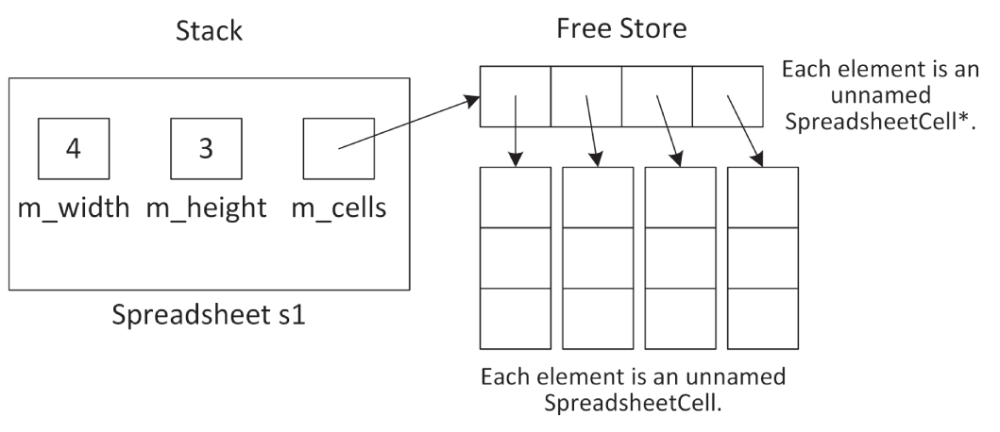
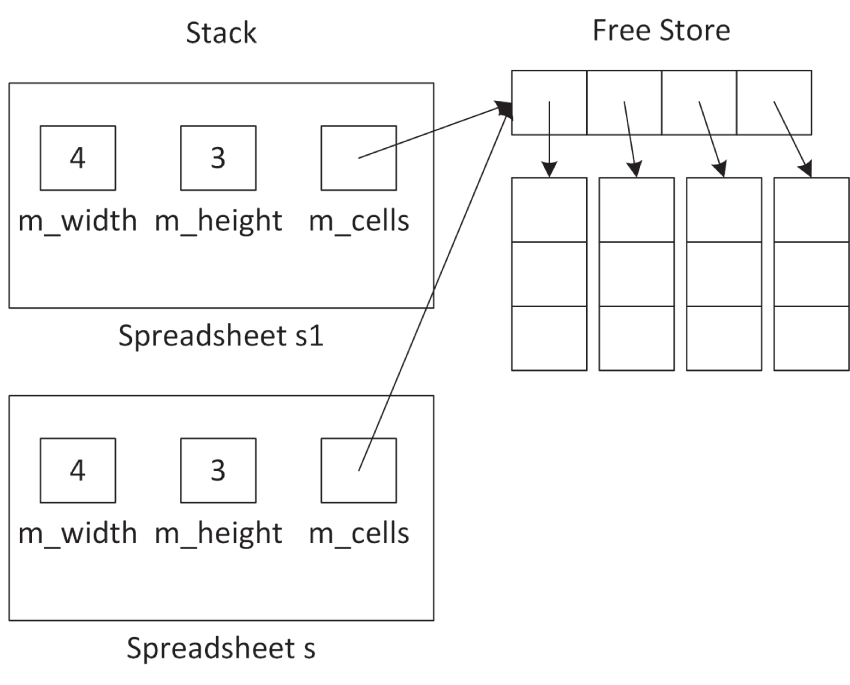
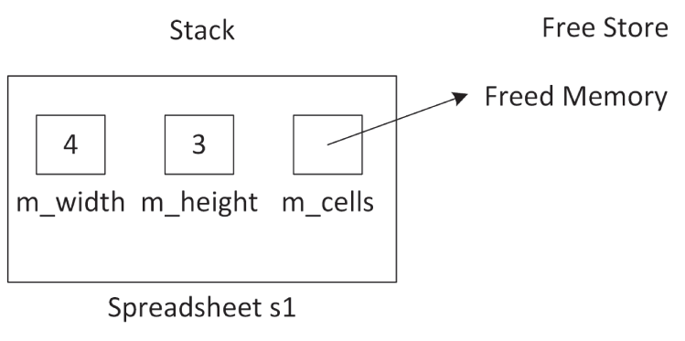
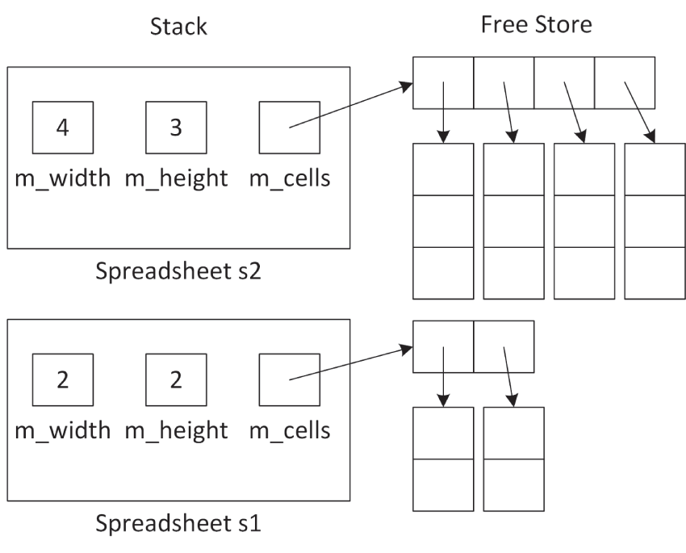
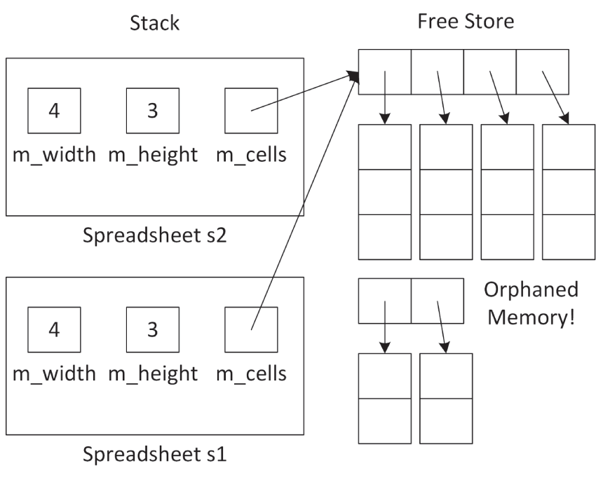

:::tip[WHAT'S IN THIS CHAPTER?]
- How to make classes friends of other classes
- How to use dynamic memory allocation in objects
- What the copy-and-swap idiom is
- What rvalues and rvalue references are
- How move semantics can improve performance
- What the rule of zero means
- How to use the `constexpr` and `consteval` keywords to perform computations at compile time
- The different kinds of data members you can have (`static`, `const`, `constexpr`, reference)
- The different kinds of member functions you can implement (`static`, `const`, `inline`)
- The details of member function overloading
- How to work with default arguments
- How to use nested classes
- What operator overloading is
- How to write separate interface and implementation classes
:::

:::tip[WILEY.COM DOWNLOADS FOR THIS CHAPTER]
Please note that all the code examples for this chapter are available as part of this chapter's code download on the book's website at `www.wiley.com/go/proc++6e` on the Download Code tab.
:::

[Chapter 8](../c08), “Gaining Proficiency with Classes and Objects,” started the discussion on classes and objects. Now it's time to master their subtleties so you can use them to their full potential. By reading this chapter, you will learn how to manipulate and exploit some of the most powerful aspects of the C++ language to write safe, effective, and useful classes.

Many of the concepts in this chapter arise in advanced C++ programming, especially in the C++ Standard Library. Let's start the discussion with the concept of friends in the C++ world.

## FRIENDS

C++ allows classes to declare that other classes, member functions of other classes, or non-member functions are *friends*, and can access `protected` and `private` data members and member functions. For example, suppose you have two classes called `Foo` and `Bar`. You can specify that the `Bar` class is a friend of `Foo` as follows:

```cpp
class Foo
{
    friend class Bar;
    // …
};
```

Now all the member functions of `Bar` can access the `private` and `protected` data members and member functions of `Foo`.

If you only want to make a specific member function of `Bar` a friend, you can do that as well. Suppose the `Bar` class has a member function `processFoo(const Foo&)`. The following syntax is used to make this member function a friend of `Foo`:

```cpp
class Foo
{
    friend void Bar::processFoo(const Foo&);
    // …
};
```

Stand-alone functions can also be friends of classes. You might, for example, want to write a function that prints all data of a `Foo` object to the console. You might want this function to be outside the `Foo` class because printing is not core functionality of `Foo`, but the function should be able to access the internal data members of the object to print them all. Here is the `Foo` class definition with `printFoo()` as a friend:

```cpp
class Foo
{
    friend void printFoo(const Foo&);
    // …
};
```

The `friend` declaration in the class serves as the function's prototype. There's no need to write the prototype elsewhere (although it's harmless to do so).

Here is the function definition:

```cpp
void printFoo(const Foo& foo)
{
    // Print all data of foo to the console, including
    // private and protected data members.
}
```

You write this function outside the class definition just like any other function, except that you can directly access `private` and `protected` members of `Foo`. You don't repeat the `friend` keyword in the function definition.

Note that a class needs to know which other classes, member functions, or functions want to be its friends; a class, member function, or function cannot declare itself to be a friend of some other class to gain access to non-`public` members of that class.

`friend` classes and functions are easy to abuse; they allow you to violate the principle of encapsulation by exposing internals of your class to other classes or functions. Thus, you should use them only in limited circumstances. Some use cases are shown throughout this chapter.

## DYNAMIC MEMORY ALLOCATION IN OBJECTS

Sometimes you don't know how much memory you will need before your program actually runs. As you read in [Chapter 7](../c07), “Memory Management,” the solution is to dynamically allocate as much space as you need during program execution. Classes are no exception. Sometimes you don't know how much memory an object will need when you write the class. In that case, the object should dynamically allocate memory. Dynamically allocated memory in objects provides several challenges, including freeing the memory, handling object copying, and handling object assignment.

### The Spreadsheet Class

[Chapter 8](../c08) introduces the `SpreadsheetCell` class. This chapter moves on to write the `Spreadsheet` class. As with the `SpreadsheetCell` class, the `Spreadsheet` class evolves throughout this chapter. Thus, the various attempts do not always illustrate the best way to do every aspect of class writing.

To start, a `Spreadsheet` is simply a two-dimensional array of `SpreadsheetCell`s, with member functions to set and retrieve cells at specific locations in the `Spreadsheet`. Although most spreadsheet applications use letters in one direction and numbers in the other to refer to cells, this `Spreadsheet` uses numbers in both directions.

The first line of the `Spreadsheet.cppm` module interface file defines the name of the module:

```cpp
export module spreadsheet;
```

The `Spreadsheet` class needs access to the `SpreadsheetCell` class, so it needs to import the `spreadsheet_cell` module. Additionally, to make the `SpreadsheetCell` class visible to users of the `spreadsheet` module, the `spreadsheet_cell` module is imported and exported with the following funny-looking syntax:

```cpp
export import spreadsheet_cell;
```

The `Spreadsheet` class uses the `std::size_t` type, which is defined in the C header called `<cstddef>`. You can get access to it with the following import:

```cpp
import std;
```

Finally, here is a first attempt at a definition of the `Spreadsheet` class:

```cpp
export class Spreadsheet
{
    public:
        Spreadsheet(std::size_t width, std::size_t height);
        void setCellAt(std::size_t x, std::size_t y, const SpreadsheetCell& cell);
        SpreadsheetCell& getCellAt(std::size_t x, std::size_t y);
    private:
        bool inRange(std::size_t value, std::size_t upper) const;
        std::size_t m_width { 0 };
        std::size_t m_height { 0 };
        SpreadsheetCell** m_cells { nullptr };
};
```

:::note
The `Spreadsheet` class uses normal pointers for the `m_cells` array. This is done throughout this chapter to show the consequences and to explain how to handle resources, such as dynamic memory, in classes. In production code, you should use one of the standard C++ containers, like `std::vector`, which greatly simplifies the implementation of `Spreadsheet`, but then you wouldn't learn how to correctly handle dynamic memory using raw pointers. In modern C++, you should never use raw pointers with ownership semantics, but you might come across them in existing code, in which case you need to know how to work with them.
:::

Note that the `Spreadsheet` class does not contain a standard two-dimensional array of `SpreadsheetCell`s. Instead, it contains a `SpreadsheetCell**` data member, which is a pointer to a pointer representing an array of arrays. This is because each `Spreadsheet` object might have different dimensions, so the constructor of the class must dynamically allocate the two-dimensional array based on the client-specified height and width.

To dynamically allocate a two-dimensional array, you need to write the following code. Note that in C++, unlike in Java, it's not possible to simply write `new SpreadsheetCell[m_width][m_height]`.

```cpp
Spreadsheet::Spreadsheet(size_t width, size_t height)
    : m_width { width }, m_height { height }
{
    m_cells = new SpreadsheetCell*[m_width];
    for (size_t i { 0 }; i < m_width; ++i) {
        m_cells[i] = new SpreadsheetCell[m_height];
    }
}
```

[Figure 9.1](#c09-fig-0001) shows the resulting memory layout for a `Spreadsheet` called `s1` on the stack with width 4 and height 3.

The implementations of the `inRange()` and the set and retrieval member functions are straightforward:

```cpp
bool Spreadsheet::inRange(size_t value, size_t upper) const
{
    return value < upper;
}
 
void Spreadsheet::setCellAt(size_t x, size_t y, const SpreadsheetCell& cell)
{
    if (!inRange(x, m_width)) {
        throw out_of_range {
            format("x ({}) must be less than width ({}).", x, m_width) };
    }
    if (!inRange(y, m_height)) {
        throw out_of_range {
            format("y ({}) must be less than height ({}).", y, m_height) };
    }
    m_cells[x][y] = cell;
}
 
SpreadsheetCell& Spreadsheet::getCellAt(size_t x, size_t y)
{
    if (!inRange(x, m_width)) {
        throw out_of_range {
            format("x ({}) must be less than width ({}).", x, m_width) };
    }
    if (!inRange(y, m_height)) {
        throw out_of_range {
            format("y ({}) must be less than height ({}).", y, m_height) };
    }
    return m_cells[x][y];
}
```

 


[^FIGURE 9.1]

`setCellAt()` and `getCellAt()` both use a helper function called `inRange()` to check that `x` and `y` represent valid coordinates in the spreadsheet. Attempting to access an array element at an out-of-range index will cause the program to malfunction. This example uses exceptions, which are introduced in [Chapter 1](../c01), “A Crash Course in C++ and the Standard Library,” and described in detail in [Chapter 14](../c14), “Handling Errors.”

If you look at the `setCellAt()` and `getCellAt()` implementations, you see there is some clear code duplication. [Chapter 6](../c06), “Designing for Reuse,” explains that code duplication should be avoided at all costs. So, let's follow that guideline. Instead of a helper function called `inRange()`, let's define the following `verifyCoordinate()` member function:

```cpp
void verifyCoordinate(std::size_t x, std::size_t y) const;
```

The implementation checks the given coordinate and throws an exception if the coordinate is invalid:

```cpp
void Spreadsheet::verifyCoordinate(size_t x, size_t y) const
{
    if (x>= m_width) {
        throw out_of_range {
            format("x ({}) must be less than width ({}).", x, m_width) };
    }
    if (y>= m_height) {
        throw out_of_range {
            format("y ({}) must be less than height ({}).", y, m_height) };
    }
}
```

The `setCellAt()` and `getCellAt()` implementations can now be simplified:

```cpp
void Spreadsheet::setCellAt(size_t x, size_t y, const SpreadsheetCell& cell)
{
    verifyCoordinate(x, y);
    m_cells[x][y] = cell;
}
 
SpreadsheetCell& Spreadsheet::getCellAt(size_t x, size_t y)
{
    verifyCoordinate(x, y);
    return m_cells[x][y];
}
```

### Freeing Memory with Destructors

Whenever you are finished with dynamically allocated memory, you should free it. If you dynamically allocate memory in an object, the place to free that memory is in the *destructor*. The compiler guarantees that the destructor is called when the object is destroyed. The following is the destructor added to the `Spreadsheet` class definition:

```cpp
export class Spreadsheet
{
    public:
        Spreadsheet(std::size_t width, std::size_t height);
        ~Spreadsheet();
        // Code omitted for brevity
};
```

The destructor has the same name as the name of the class (and of the constructors), preceded by a tilde (`~`). The destructor takes no arguments, and there can be only one of them. Destructors should never throw any exceptions for reasons explained in detail in [Chapter 14](../c14).

Here is the implementation of the `Spreadsheet` class destructor:

```cpp
Spreadsheet::˜Spreadsheet()
{
    for (size_t i { 0 }; i < m_width; ++i) {
        delete[] m_cells[i];
    }
    delete[] m_cells;
    m_cells = nullptr;
}
```

This destructor frees the memory that was allocated in the constructor. However, no rule requires you to free memory in the destructor. You can write whatever code you want in the destructor, but it is generally a good idea to use it only for freeing memory or disposing of other resources.

### Handling Copying and Assignment

Recall from [Chapter 8](../c08) that if you don't write a copy constructor and a copy assignment operator yourself, C++ writes them for you. These compiler-generated member functions recursively call the copy constructor or copy assignment operator on object data members. However, for primitives, such as `int`, `double`, and pointers, they provide *shallow* or *bitwise* copying or assignment: they just copy or assign the data members from the source object directly to the destination object. That presents problems when you dynamically allocate memory in your object. For example, the following code copies the spreadsheet `s1` to initialize `s` when `s1` is passed to the `printSpreadsheet()` function:

```cpp
import spreadsheet;
 
void printSpreadsheet(Spreadsheet s) { /* Code omitted for brevity. */ }
 
int main()
{
    Spreadsheet s1 { 4, 3 };
    printSpreadsheet(s1);
}
```

The `Spreadsheet` contains one pointer variable: `m_cells`. A shallow copy of a Spreadsheet gives the destination object a copy of the `m_cells` pointer, but not a copy of the underlying data. Thus, you end up with a situation where both `s` and `s1` have a pointer to the same data, as shown in [Figure 9.2](#c09-fig-0002).

 


[^FIGURE 9.2]

If `s` changes something to which `m_cells` points, that change shows up in `s1` as well. Even worse, when the `printSpreadsheet()` function exits, `s`'s destructor is called, which frees the memory pointed to by `m_cells`. That leaves the situation where `m_cells` in `s1` no longer points to valid memory, as shown in [Figure 9.3](#c09-fig-0003). This is called a *dangling pointer*.

 


[^FIGURE 9.3]

Unbelievably, the problem is even worse with assignment. Suppose that you have the following code:

```cpp
Spreadsheet s1 { 2, 2 }, s2 { 4, 3 };
s1 = s2;
```

After the first line, when both the `s1` and `s2 Spreadsheet` objects are constructed, you have the memory layout shown in [Figure 9.4](#c09-fig-0004).

 


[^FIGURE 9.4]

After the assignment statement, you have the layout shown in [Figure 9.5](#c09-fig-0005).

Now, not only do the `m_cells` pointers in `s1` and `s2` point to the same memory, but you have also *orphaned* the memory to which `m_cells` in `s1` previously pointed to. This is called a *memory leak*.

It should be clear by now that copy constructors and copy assignment operators must do a *deep copy*; that is, they must not just copy pointer data members, but must copy the actual data to which such pointers point to.

As you can see, relying on C++'s default copy constructor and default copy assignment operator is not always a good idea.

:::warning
Whenever you have dynamically allocated resources in a class, you should write your own copy constructor and copy assignment operator to provide a deep copy of the memory.
:::

 


[^FIGURE 9.5]

#### The Spreadsheet Copy Constructor

Here is a declaration for a copy constructor in the `Spreadsheet` class:

```cpp
export class Spreadsheet
{
    public:
        Spreadsheet(const Spreadsheet& src);
        // Code omitted for brevity
};
```

The definition is as follows:

```cpp
Spreadsheet::Spreadsheet(const Spreadsheet& src)
    : Spreadsheet { src.m_width, src.m_height }
{
    for (size_t i { 0 }; i < m_width; ++i) {
        for (size_t j { 0 }; j < m_height; ++j) {
            m_cells[i][j] = src.m_cells[i][j];
        }
    }
}
```

Note the use of a delegating constructor. The ctor-initializer of this copy constructor delegates first to the non-copy constructor to allocate the proper amount of memory. The body of the copy constructor then copies the actual values. Together, this process implements a deep copy of the `m_cells` dynamically-allocated two-dimensional array.

There is no need to delete any existing `m_cells` because this is a copy constructor, and therefore there is no existing `m_cells` yet in `this` object.

#### The Spreadsheet Assignment Operator

The following shows the `Spreadsheet` class definition with an assignment operator:

```cpp
export class Spreadsheet
{
    public:
        Spreadsheet& operator=(const Spreadsheet& rhs);
        // Code omitted for brevity
};
```

A naïve implementation could be as follows:

```cpp
Spreadsheet& Spreadsheet::operator=(const Spreadsheet& rhs)
{
    // Check for self-assignment
    if (this == &rhs) {
        return *this;
    }
 
    // Free the old memory
    for (size_t i { 0 }; i < m_width; ++i) {
        delete[] m_cells[i];
    }
    delete[] m_cells;
    m_cells = nullptr;
 
    // Allocate new memory
    m_width = rhs.m_width;
    m_height = rhs.m_height;
 
    m_cells = new SpreadsheetCell*[m_width];
    for (size_t i { 0 }; i < m_width; ++i) {
        m_cells[i] = new SpreadsheetCell[m_height];
    }
 
    // Copy the data
    for (size_t i { 0 }; i < m_width; ++i) {
        for (size_t j { 0 }; j < m_height; ++j) {
            m_cells[i][j] = rhs.m_cells[i][j];
        }
    }
 
    return *this;
}
```

The code first checks for self-assignment, then frees the current memory of the `this` object, allocates new memory, and finally copies the individual elements. There is a lot going on in this function, and a lot can go wrong! It is possible that the `this` object gets into an invalid state.

For example, suppose that the memory is successfully freed, that `m_width` and `m_height` are properly set, but that an exception is thrown in the loop that is allocating the memory. When that happens, execution of the remainder of the function is skipped, and the function is exited. Now the `Spreadsheet` instance is corrupt; its `m_width` and `m_height` data members state a certain size, but the `m_cells` data member does not point to the right amount of memory. Basically, this code is not exception-safe!

What we need is an all-or-nothing mechanism; either everything succeeds or the `this` object remains untouched. To implement such an exception-safe assignment operator, the *copy-and-swap* idiom is used. For this, a `swap()` member function is added to the `Spreadsheet` class. Additionally, it's recommended to provide a non-member `swap()` function so that it can also be used by various Standard Library algorithms. Here is the definition of the `Spreadsheet` class with an assignment operator, and the `swap()` member function and non-member function:

```cpp
export class Spreadsheet
{
    public:
        Spreadsheet& operator=(const Spreadsheet& rhs);
        void swap(Spreadsheet& other) noexcept;
        // Code omitted for brevity
};
export void swap(Spreadsheet& first, Spreadsheet& second) noexcept;
```

A requirement for implementing the exception-safe copy-and-swap idiom is that `swap()` never throws any exceptions, so it is marked as `noexcept`.

:::note
A function can be marked with the `noexcept` keyword to specify that it won't throw any exceptions. The `noexcept` specifier must appear after any `const` keyword. Here's an example:
:::

The implementation of the `swap()` member function swaps each data member using the `std::swap()` utility function provided by the Standard Library in `<utility>`, which efficiently swaps two values:

```cpp
void Spreadsheet::swap(Spreadsheet& other) noexcept
{
    std::swap(m_width, other.m_width);
    std::swap(m_height, other.m_height);
    std::swap(m_cells, other.m_cells);
}
```

The non-member `swap()` function simply forwards to the `swap()` member function:

```cpp
void swap(Spreadsheet& first, Spreadsheet& second) noexcept
{
    first.swap(second);
}
```

Now that we have an exception-safe `swap()`, it can be used to implement the assignment operator:

```cpp
Spreadsheet& Spreadsheet::operator=(const Spreadsheet& rhs)
{
    Spreadsheet temp { rhs }; // Do all the work in a temporary instance
    swap(temp);               // Commit the work with only non-throwing operations
    return *this;
}
```

The implementation uses the copy-and-swap idiom. First, a *copy* of the right-hand side is made, called `temp`. Then the current object is swapped with this copy. This pattern is the recommended way of implementing assignment operators because it guarantees *strong exception safety*, meaning that if any exception occurs, then the state of the current `Spreadsheet` object remains unchanged. The idiom is implemented in three phases:

- The first phase makes a temporary copy. This does not modify the state of the current `Spreadsheet` object, and so there is no problem if an exception is thrown during this phase.
- The second phase uses the `swap()` function to swap the created temporary copy with the current object. The `swap()` function shall never throw exceptions.
- The third phase is the destruction of the temporary object, which now contains the original object (because of the swap), to clean up any memory.

When you do not use the copy-and-swap idiom for implementing an assignment operator, then for efficiency and sometimes also for correctness, the first line of code in an assignment operator usually checks for self-assignment. Here's an example:

```cpp
Spreadsheet& Spreadsheet::operator=(const Spreadsheet& rhs)
{
    // Check for self-assignment
    if (this == &rhs) { return *this; }
    // …
    return *this;
}
```

With the copy-and-swap idiom, such a self-assignment test is not needed.

:::warning
When implementing an assignment operator, use the copy-and-swap idiom to avoid code duplication and to guarantee strong exception safety.
:::

:::note
The copy-and-swap idiom can be used for more than just assignment operators. It can be used for any operation that takes multiple steps and that you want to turn into an all-or-nothing operation: first, make a copy; then, do all the modifications on the copy; and finally, if there are no errors, perform a non-throwing swap operation.
:::

#### Disallowing Assignment and Pass-by-Value

Sometimes when you dynamically allocate memory in your class, it's easiest just to prevent anyone from copying or assigning to your objects. You can do this by explicitly deleting your `operator=` and copy constructor. That way, if anyone tries to pass the object by value, return it from a function, or assign to it, the compiler will complain. Here is a `Spreadsheet` class definition that prevents assignment and pass-by-value:

```cpp
export class Spreadsheet
{
    public:
        Spreadsheet(std::size_t width, std::size_t height);
        Spreadsheet(const Spreadsheet& src) = delete;
        ˜Spreadsheet();
        Spreadsheet& operator=(const Spreadsheet& rhs) = delete;
        // Code omitted for brevity
};
```

You don't provide implementations for deleted member functions. The linker will never look for them because the compiler won't allow code to call them. When you now write code to copy or assign to a `Spreadsheet` object, the compiler will complain with a message like this:

```cpp
'Spreadsheet &Spreadsheet::operator =(const Spreadsheet &)': attempting to reference a deleted function
```

### Handling Moving with Move Semantics

*Move semantics* for classes requires a *move constructor* and a *move assignment operator*. These can be used by the compiler when the source object is a temporary object that will be destroyed after the operation is finished or, as you will see, explicitly when using `std::move()`. Moving *moves ownership* of memory and other resources from one object to another object. It basically does a *shallow* copy of data members *combined with* switching ownership of allocated memory and other resources to prevent dangling pointers or resources and to prevent memory leaks.

Both the move constructor and the move assignment operator move the data members from a source object to a new object, leaving the source object in some valid but otherwise indeterminate state. Often, data members of the source object are reset to “null” values, but this is not a strict requirement. I do recommend, however, that you make sure your source objects are in a clearly defined empty state after a move operation. To be safe, never use any objects that have been moved from, as this could trigger undefined behavior. Some notable exceptions from the Standard Library are `std::unique_ptr` and `shared_ptr`. The Standard Library explicitly states that these smart pointers must reset their internal pointer to `nullptr` when moving from them, which makes it safe to reuse such smart pointers after a move operation.

Before you can implement move semantics, you need to learn about rvalues and rvalue references.

#### Rvalue References

In C++, an *lvalue* is something of which you can take an address, for example, a named variable. The name comes from the fact that lvalues can appear on the left-hand side of an assignment. An *rvalue*, on the other hand, is anything that is not an lvalue, such as a literal, or a temporary object or value.[^1] Typically, an rvalue is on the right-hand side of an assignment operator. For example, take the following statement:

```cpp
int a { 4 * 2 };
```

In this statement, `a` is an lvalue, it has a name, and you can take the address of it with `&a`. The result of the expression `4*2`, on the other hand, is an rvalue. It is a temporary value that is destroyed when the statement finishes execution. In this example, a copy of this temporary value is stored in the variable with name `a`.

If a function returns something by value, the result of calling that function is an rvalue, a temporary. If the function returns a reference-to-non-`const`, then the result of calling the function is an lvalue, as you will be able to use the result on the left-hand side of an assignment.

An *rvalue reference* is a reference to an rvalue. In particular, it is a concept that is applied when the rvalue is a temporary object or an object that is explicitly moved using `std::move()`, explained later in this section. The purpose of an rvalue reference is to make it possible for a particular function overload to be chosen when an rvalue is involved. This allows certain operations that normally involve copying large values to instead copy pointers to those values.

A function can specify an rvalue reference parameter by using `&&` as part of the parameter specification, for example, `type&& name`. Normally, a temporary object will be seen as a `const type&`, but when there is a function overload that uses an rvalue reference, a temporary object can be resolved to that overload. The following example demonstrates this. The code first defines two `handleMessage()` functions, one accepting an lvalue reference and one accepting an rvalue reference:

```cpp
void handleMessage(string& message) // lvalue reference parameter
{
    println("handleMessage with lvalue reference: {}", message);
}
 
void handleMessage(string&& message) // rvalue reference parameter
{
    println("handleMessage with rvalue reference: {}", message);
}
```

You can call `handleMessage()` with a named variable as an argument:

```cpp
string a { "Hello " };
handleMessage(a);             // Calls handleMessage(string& value)
```

Because `a` is a named variable, the `handleMessage()` function accepting an lvalue reference is called. Any changes `handleMessage()` does through its reference parameter will change the value of `a`.

You can also call `handleMessage()` with an expression as an argument:

```cpp
string b { "World" };
handleMessage(a + b);         // Calls handleMessage(string&& value)
```

The `handleMessage()` function accepting an lvalue reference cannot be used, because the expression `a + b` results in a temporary, which is not an lvalue. In this case, the rvalue reference overload is called. Because the argument is a temporary, any changes `handleMessage()` does through its reference parameter will be lost after the call returns.

A literal can also be used as argument to `handleMessage()`. This also triggers a call to the rvalue reference overload because a literal cannot be an lvalue (though a literal can be passed as argument to a reference-to-`const` parameter):

```cpp
handleMessage("Hello World"); // Calls handleMessage(string&& value)
```

If you remove the `handleMessage()` function accepting an lvalue reference, calling `handleMessage()` with a named variable like `handleMessage(b)` will result in a compilation error because an rvalue reference parameter (`string&&`) will never be bound to an lvalue (`b`). You can force the compiler to call the rvalue reference overload of `handleMessage()` by using `std::move()`. The only thing `move()` does is cast an lvalue to an rvalue reference; that is, it does not do any actual moving. However, by returning an rvalue reference, it allows the compiler to find an overload of `handleMessage()` accepting an rvalue reference, which can then perform the moving. Here is an example of using `move()`:

```cpp
handleMessage(std::move(b));  // Calls handleMessage(string&& value)
```

As I said before, but it's worth repeating, *a named variable is an lvalue*. So, inside the `handleMessage(string&& message)` function, the `message` rvalue reference parameter itself is an lvalue because it has a name! If you want to forward this rvalue reference parameter to another function as an rvalue, then you need to use `std::move()` to cast the lvalue to an rvalue reference. For example, suppose you add the following function with an rvalue reference parameter:

```cpp
void helper(string&& message) { }
```

Calling it as follows does not compile:

```cpp
void handleMessage(string&& message) { helper(message); }
```

The `helper()` function needs an rvalue reference, while `handleMessage()` passes `message`, which has a name, so it's an lvalue, causing a compilation error. Here is the correct way using `std::move()`:

```cpp
void handleMessage(string&& message) { helper(std::move(message)); }
```

:::warning
A named rvalue reference, such as an rvalue reference parameter, itself is an lvalue because it has a name!
:::

Rvalue references are not limited to parameters of functions. You can declare a variable of an rvalue reference type and assign to it, although this usage is uncommon. Consider the following code, which is illegal in C++:

```cpp
int& i { 2 };       // Invalid: reference to a constant
int a { 2 }, b { 3 };
int& j { a + b };   // Invalid: reference to a temporary
```

Using rvalue references, the following is perfectly legal:

```cpp
int&& i { 2 };
int a { 2 }, b { 3 };
int&& j { a + b };
```

However, such stand-alone rvalue references are rarely used in this way.

:::note
If a temporary is assigned to an rvalue reference, the lifetime of the temporary is extended for as long as the rvalue reference is in scope.
:::

#### <cpp23></cpp23> Decay Copy

If you have an object `x`, writing “`auto y{x}`” creates a copy of `x` and gives it a name `y`; thus, it is an lvalue.

C++23 introduces the `auto(x)` or `auto{x}` syntax to create a copy of an object `x` as an rvalue, not an lvalue.

As an example, assume you have only the rvalue reference `handleMessage(string&&)` function from the previous section, not the lvalue reference overload. You know that the following won't work in that case:

```cpp
string value { "Hello " };
handleMessage(value);  // Error
```

You could use `std::move()`, as in:

```cpp
handleMessage(std::move(value));
```

But, after this operation, you should not use the `value` object any longer, as it might have been moved.

Using C++23 decay-copy syntax, you can write:

```cpp
handleMessage(auto { value });
```

This makes a temporary copy of object `value` as an rvalue and passes that rvalue to `handleMessage()`. If `handleMessage()` moves from the copy, the original object, `value`, is retained and not impacted

#### Implementing Move Semantics

Move semantics is implemented using rvalue references. To add move semantics to a class, you need to implement a *move constructor* and a *move assignment operator*. Move constructors and move assignment operators should be marked with the `noexcept` specifier to tell the compiler that they don't throw any exceptions. This is particularly important for compatibility with the Standard Library, as fully compliant implementations of, for example, the Standard Library containers will only move stored objects if, having move semantics implemented, they also guarantee not to throw. This is done to be able to provide strong exception safety.

The following is the `Spreadsheet` class definition with a move constructor and move assignment operator. Two helper member functions are introduced as well: `cleanup()`, which is used from the destructor and the move assignment operator, and `moveFrom()`, which moves the data members from a source to a destination and then resets the source object.

```cpp
export class Spreadsheet
{
    public:
        Spreadsheet(Spreadsheet&& src) noexcept; // Move constructor
        Spreadsheet& operator=(Spreadsheet&& rhs) noexcept; // Move assignment
        // Remaining code omitted for brevity
    private:
        void cleanup() noexcept;
        void moveFrom(Spreadsheet& src) noexcept;
        // Remaining code omitted for brevity
};
```

The implementations are as follows:

```cpp
void Spreadsheet::cleanup() noexcept
{
    for (size_t i { 0 }; i < m_width; ++i) {
        delete[] m_cells[i];
    }
    delete[] m_cells;
    m_cells = nullptr;
    m_width = m_height = 0;
}
 
void Spreadsheet::moveFrom(Spreadsheet& src) noexcept
{
    // Shallow copy of data
    m_width = src.m_width;
    m_height = src.m_height;
    m_cells = src.m_cells;
 
    // Reset the source object, because ownership has been moved!
    src.m_width = 0;
    src.m_height = 0;
    src.m_cells = nullptr;
}
 
// Move constructor
Spreadsheet::Spreadsheet(Spreadsheet&& src) noexcept
{
    moveFrom(src);
}
 
// Move assignment operator
Spreadsheet& Spreadsheet::operator=(Spreadsheet&& rhs) noexcept
{
    // Check for self-assignment
    if (this == &rhs) {
        return *this;
    }
 
    // Free the old memory and move ownership
    cleanup();
    moveFrom(rhs);
    return *this;
}
```

Both the move constructor and the move assignment operator are moving ownership of the memory for `m_cells` from a source object to a new object. They reset the `m_cells` pointer of the source object to a null pointer and set `m_width` and `m_height` of the source object to zero to prevent the source object's destructor from deallocating any memory because the new object is now the owner of it.

Obviously, move semantics is useful only when you know that the source object is not needed anymore.

Note that this implementation includes a self-assignment test in the move assignment operator. Depending on your class and depending on how you are moving one instance of your class to another instance, this self-assignment test might not always be necessary. However, you should always include it, just as the C++ Core Guidelines recommend,[^2] to make sure that code as follows never causes a crash at run time:

```cpp
sheet1 = std::move(sheet1);
```

Move constructors and move assignment operators can be explicitly deleted or defaulted, just like copy constructors and copy assignment operators, as explained in [Chapter 8](../c08).

The compiler automatically generates a default move constructor for a class if and only if the class has no user-declared copy constructor, copy assignment operator, move assignment operator, or destructor. A default move assignment operator is generated for a class if and only if the class has no user-declared copy constructor, move constructor, copy assignment operator, or destructor.

:::warning
When you declare one or more of the special member functions (destructor, copy constructor, move constructor, copy assignment operator, and move assignment operator), then it’s recommended to declare all of them. This is called the rule of five. You either provide explicit implementations for them or explicitly default (`=default`) or delete (`=delete`) them.
:::

##### Using std::exchange

You can use `std::exchange()`, defined in `<utility>`, to replace a value with a new value and return the old value, as in this example:

```cpp
int a { 11 };
int b { 22 };
println("Before exchange(): a = {}, b = {}", a, b);
int returnedValue { exchange(a, b) };
println("After exchange():  a = {}, b = {}", a, b);
println("exchange() returned: {}", returnedValue);
```

The output is as follows:

```cpp
Before exchange(): a = 11, b = 22
After exchange():  a = 22, b = 22
exchange() returned: 11
```

The `exchange()` function is useful in implementing move assignment operators. A move assignment operator needs to move the data from a source object to a destination object, after which the data in the source object is usually nullified. In the previous section, this is done as follows:

```cpp
void Spreadsheet::moveFrom(Spreadsheet& src) noexcept
{
    // Shallow copy of data
    m_width = src.m_width;
    m_height = src.m_height;
    m_cells = src.m_cells;
 
    // Reset the source object, because ownership has been moved!
    src.m_width = 0;
    src.m_height = 0;
    src.m_cells = nullptr;
}
```

This member function copies the `m_width`, `m_height`, and `m_cells` data members from the source object and then sets them to either `0` or `nullptr`, because ownership has been moved. With `exchange()` this can be written more compactly as follows:

```cpp
void Spreadsheet::moveFrom(Spreadsheet& src) noexcept
{
    m_width = exchange(src.m_width, 0);
    m_height = exchange(src.m_height, 0);
    m_cells = exchange(src.m_cells, nullptr);
}
```

##### Moving Object Data Members

The `moveFrom()` member function uses direct assignments of the three data members because they are primitive types. If your object contains other objects as data members, then you should move these objects using `std::move()`. Suppose the `Spreadsheet` class has an `std::string` data member called `m_name`. The `moveFrom()` member function should then be implemented as follows:

```cpp
void Spreadsheet::moveFrom(Spreadsheet& src) noexcept
{
    // Move object data members
    m_name = std::move(src.m_name);
 
    // Move primitives:
    m_width = exchange(src.m_width, 0);
    m_height = exchange(src.m_height, 0);
    m_cells = exchange(src.m_cells, nullptr);
}
```

##### Move Constructor and Move Assignment Operator in Terms of Swap

The previous implementation of the move constructor and the move assignment operator both use the `moveFrom()` helper function, which moves all data members by performing shallow copies. With this implementation, if you add a new data member to the `Spreadsheet` class, you have to modify both the `swap()` function and the `moveFrom()` function. If you forget to update one of them, you introduce a bug. To avoid such bugs, you can write the move constructor and the move assignment operator in terms of the `swap()` function.

First, the `cleanup()` and `moveFrom()` helper functions can be removed. The code from the `cleanup()` function is moved to the destructor. The move constructor and move assignment operator can then be implemented as follows:

```cpp
Spreadsheet::Spreadsheet(Spreadsheet&& src) noexcept
{
    swap(src);
}
 
Spreadsheet& Spreadsheet::operator=(Spreadsheet&& rhs) noexcept
{
    auto moved { std::move(rhs) }; // Move rhs into moved (noexcept)
    swap(moved); // Commit the work with only non-throwing operations
    return *this;
}
```

The move constructor simply swaps the default constructed `*this` with the given source object. The move assignment operator uses the *move-and-swap* idiom, which is similar to the copy-and-swap idiom discussed before.

:::note
Implementing a move constructor and move assignment operator in terms of `swap()` requires less code. It is also less likely bugs are introduced when data members are added, because you only have to update your `swap()` implementation to include those new data members.
:::

The `Spreadsheet` move assignment operator could also be implemented as follows:

```cpp
Spreadsheet& Spreadsheet::operator=(Spreadsheet&& rhs) noexcept
{
    swap(rhs);
    return *this;
}
```

However, doing so does not guarantee that the contents of `this` is immediately cleaned up. Instead, the contents of `this` escapes through `rhs` to the caller of the move assignment operator and thus might stay alive longer than expected.

#### Testing the Spreadsheet Move Operations

The `Spreadsheet` move constructor and move assignment operator can be tested with the following code:

```cpp
Spreadsheet createObject()
{
    return Spreadsheet { 3, 2 };
}
 
int main()
{
    vector<Spreadsheet> vec;
    for (size_t i { 0 }; i < 2; ++i) {
        println("Iteration {}", i);
        vec.push_back(Spreadsheet { 100, 100 });
        println("");
    }
 
    Spreadsheet s { 2, 3 };
    s = createObject();
 
    println("");
 
    Spreadsheet s2 { 5, 6 };
    s2 = s;
}
```

[Chapter 1](../c01) introduces the `vector`. A `vector` grows dynamically in size to accommodate new objects. This is done by allocating a bigger chunk of memory and then copying or moving the objects from the old `vector` to the new and bigger `vector`. If the compiler finds a `noexcept` move constructor, the objects are moved instead of copied. Because they are moved, there is no need for any deep copying, making it much more efficient.

After adding print statements to all constructors and assignment operators of the `Spreadsheet` class, the output of the preceding test program can be as follows. The numbers to the right of each line are not part of the actual output but added in this text to make it easier to refer to specific lines in the discussion that follows. This output and the following discussion are based on the version of the `Spreadsheet` class using the move-and-swap idiom to implement its move operations, and on the Microsoft Visual C++ 2022 compiler for a release build of the code. The C++ standard does not specify the initial capacity of a `vector` nor its growth strategy, so the output can be different on different compilers.

```cpp
Iteration 0
Normal constructor         (1)
Move constructor           (2)
 
Iteration 1
Normal constructor         (3)
Move constructor           (4)
Move constructor           (5)
 
Normal constructor         (6)
Normal constructor         (7)
Move assignment operator   (8)
Move constructor           (9)   
 
Normal constructor        (10)
Copy assignment operator  (11)
Normal constructor        (12)
Copy constructor          (13)
```

On the first iteration of the loop, the `vector` is still empty. Take the following line of code from the loop:

```cpp
vec.push_back(Spreadsheet { 100, 100 });
```

With this line, a new `Spreadsheet` object is created, invoking the normal constructor (1). The `vector` resizes itself to make space for the new object being pushed in. The created `Spreadsheet` object is then moved into the `vector`, invoking the move constructor (2).

On the second iteration of the loop, a second `Spreadsheet` object is created with the normal constructor (3). At this point, the `vector` can hold one element, so it's again resized to make space for a second object. Because the `vector` is resized, the previously added elements need to be moved from the old `vector` to the new and bigger `vector`. This triggers a call to the move constructor for each previously added element. There is one element in the `vector`, so the move constructor is called one time (4). Finally, the new `Spreadsheet` object is moved into the `vector` with its move constructor (5).

Next, a `Spreadsheet` object `s` is created using the normal constructor (6). The `createObject()` function creates a temporary `Spreadsheet` object with its normal constructor (7), which is then returned from the function and assigned to the variable `s`. Because the temporary object returned from `createObject()` ceases to exist after the assignment, the compiler invokes the move assignment operator (8) instead of the copy assignment operator. The move assignment operator uses the move-and-swap idiom, so it delegates work to the move constructor (9).

Another `Spreadsheet` object is created, `s2`, using the normal constructor (10). The assignment `s2 = s` invokes the copy assignment operator (11) because the right-hand side object is not a temporary object, but a named object. This copy assignment operator uses the copy-and-swap idiom, which creates a temporary copy, triggering a call to the copy constructor, which first delegates to the normal constructor (12 and 13).

If the `Spreadsheet` class did not implement move semantics, all the calls to the move constructor and move assignment operator would be replaced with calls to the copy constructor and copy assignment operator. In the previous example, the `Spreadsheet` objects in the loop have 10,000 (100 × 100) elements. The implementations of the `Spreadsheet` move constructor and move assignment operator don't require any memory allocation, while the copy constructor and copy assignment operator require 101 allocations each. So, using move semantics can increase performance a lot in certain situations.

#### Implementing a Swap Function with Move Semantics

As another example where move semantics increases performance, take a `swap()` function that swaps two `Object`s. The following `swapCopy()` implementation does not use move semantics:

```cpp
void swapCopy(Object& a, Object& b)
{
    Object temp { a };
    a = b;
    b = temp;
}
```

First, `a` is copied to `temp`, then `b` is copied to `a`, and finally `temp` is copied to `b`. This implementation will hurt performance if `Object` is expensive to copy. With move semantics, the implementation can avoid all copying:

```cpp
void swapMove(Object& a, Object& b)
{
    Object temp { std::move(a) };
    a = std::move(b);
    b = std::move(temp);
}
```

This is how `std::swap()` from the Standard Library is implemented.

#### Using std::move() in Return Statements

As [Chapter 1](../c01) states, since C++17, a compiler is not allowed to perform any copying or moving of objects for statements of the form `return object;` where `object` is a nameless temporary. This is called *mandatory elision of copy/move operations* and means that there's no performance penalty at all by returning `object` by value. If `object` is a local variable that is not a function parameter, *non-mandatory elision of copy/move operations* is allowed, an optimization also known as *named return value optimization* (NRVO). This optimization is not guaranteed by the standard. Some compilers perform this optimization only for release builds but not for debug builds. With mandatory and non-mandatory elision, compilers can avoid any copying of objects that are returned from functions. This results in *zero-copy pass-by-value* semantics.

:::warning
Note that for NRVO, even though the copy/move constructors won't be called, they still need to be accessible; otherwise, the program is ill-formed according to the standard.
:::

Now, what happens when using `std::move()` to return an object? Consider you write the following:

```cpp
return std::move(object);
```

With this code, compilers cannot apply mandatory nor non-mandatory (NRVO) elision of copy/move operations anymore, as that works only for statements of the form `return object;`. Since copy/move elision cannot be applied anymore, the next option for the compiler is to use move semantics if the object supports it, and if not, fall back to copy semantics.

Compared to NRVO, falling back to move semantics has a small performance impact, but falling back to copy semantics can have a big performance impact! So, keep the following warning in mind:

:::warning
When returning a local variable or nameless temporary from a function, simply write `return object;` and do not use `std::move()`.
:::

Note that if you want to return a data member of a class from one of its member functions, then you need to use `std::move()` if you want to move it out instead of returning a copy.

Additionally, be careful with expressions such as the following:

```cpp
return condition ? obj1 : obj2;
```

This is not of the form `return object;`, so the compiler cannot apply copy/move elision. Even worse, an expression of the form `condition ? obj1 : obj2` is an lvalue, so the compiler uses a copy constructor instead to return one of the objects. To at least trigger move semantics, you can rewrite the `return` statement as follows:

```cpp
return condition ? std::move(obj1) : std::move(obj2);
```

or

```cpp
return std::move(condition ? obj1 : obj2);
```

However, it's clearer to rewrite the `return` statement as follows for which a compiler can automatically use move semantics without explicitly using `std::move()`:

```cpp
if (condition) {
    return obj1;
} else {
    return obj2;
}
```

#### Optimal Way to Pass Arguments to Functions

Up to now, the advice has been to use reference-to-`const` parameters for non-primitive function parameters to avoid unnecessary expensive copying of an argument passed to a function. However, with rvalues in the mix, things change slightly. Imagine a function that anyways copies an argument passed as one of its parameters. This situation often pops up with class member functions. Here is a simple example:

```cpp
class DataHolder
{
    public:
        void setData(const vector<int>& data) { m_data = data; }
    private:
        vector<int> m_data;
};
```

`setData()` makes a copy of the data passed in. Now that you are fluent with rvalues and rvalue references, you might want to add an overload to optimize `setData()` to avoid any copying in case of rvalues. Here's an example:

```cpp
class DataHolder
{
    public:
        void setData(const vector<int>& data) { m_data = data; }
        void setData(vector<int>&& data) { m_data = move(data); }
    private:
        vector<int> m_data;
};
```

When `setData()` is called with a temporary, no copies are made; the data is moved instead.

The code in the following code snippet triggers a call to the reference-to-`const` overload of `setData()`, and hence a copy of the data is made:

```cpp
DataHolder wrapper;
vector myData { 11, 22, 33 };
wrapper.setData(myData);
```

On the other hand, the following code snippet calls `setData()` with a temporary, which triggers a call to the rvalue reference overload of `setData()`. The data is subsequently moved instead of copied.

```cpp
wrapper.setData({ 22, 33, 44 });
```

Unfortunately, this way to optimize `setData()` for both lvalues and rvalues requires an implementation of two overloads. Luckily, there is a better way that involves a single member function using pass-by-value. Yes, pass-by-value! Up to now, it has been advised to always pass objects using reference-to-`const` parameters to avoid any unnecessary copying, but now we advise to use pass-by-value. Let's clarify. For parameters that are not copied, passing by reference-to-`const` is still the way to go. The pass-by-value advice *is suitable only* for parameters that the function would copy anyway. In that case, by using pass-by-value semantics, the code is optimal for both lvalues and rvalues. If an lvalue is passed in, it's copied exactly one time, just as with a reference-to-`const` parameter. And, if an rvalue is passed in, no copy is made, just as with an rvalue reference parameter. Let's look at some code:

```cpp
class DataHolder
{
    public:
        void setData(vector<int> data) { m_data = move(data); }
    private:
        vector<int> m_data;
};
```

If an lvalue is passed to `setData()`, it is copied into the `data` parameter and subsequently moved to `m_data`. If an rvalue is passed to `setData()`, it is moved into the `data` parameter, and moved again to `m_data`.

:::note
Prefer pass-by-value for parameters that a function inherently would copy, but only if the parameter is of a type that supports move semantics and only if you don't need polymorphic behavior on the parameter. Otherwise, use reference-to-`const` parameters. Passing polymorphic types by value can result in slicing. This is explained in [Chapter 10](../c10), “Discovering Inheritance Techniques.”
:::

### Rule of Zero

Earlier in this chapter, the rule of five was introduced. It states that once you declare one of the five special member functions (destructor, copy constructor, move constructor, copy assignment operator, and move assignment operator), then you should declare all of them by either implementing, defaulting, or deleting them. The reason is that there are complicated rules that compilers follow to decide whether to automatically provide a compiler-generated version of those special member functions. By declaring all of them yourself, you don't leave anything for the compiler to decide, making your intent much clearer.

All the discussions so far have been to explain how to write those five special member functions. However, in modern C++, you should adopt the *rule of zero*.

The rule of zero states that you should design your classes in such a way that they do not require any of those five special member functions. How do you do that? You can do that for non-polymorphic types in which you avoid using old-style dynamically allocated memory or other resources. Instead, use modern constructs such as Standard Library containers and smart pointers. For example, you can use a `vector<vector<SpreadsheetCell>>` instead of the `SpreadsheetCell**` data member in the `Spreadsheet` class. Or even better, use a `vector<SpreadsheetCell>` storing a linearized representation of a spreadsheet. The `vector` handles memory automatically, so there is no need for any of those five special member functions.

:::warning
In modern C++, adopt the rule of zero!
:::

The rule of five should be limited to custom resource acquisition is initialization (RAII) classes. An RAII class takes ownership of a resource and handles its deallocation at the right time. It's a design technique used, for example, by `vector` and `unique_ptr` and discussed further in [Chapter 32](../c32), “Incorporating Design Techniques and Frameworks.” Additionally, [Chapter 10](../c10) explains that polymorphic types require you to follow the rule of five as well.

## MORE ABOUT MEMBER FUNCTIONS

C++ provides myriad choices for member functions. This section explains all the tricky details.

### static Member Functions

Member functions, like data members, sometimes apply to the class as a whole, not to each object. You can write `static` member functions as well as data members. As an example, consider the `SpreadsheetCell` class from [Chapter 8](../c08). It has two helper member functions: `stringToDouble()` and `doubleToString()`. These member functions don't access information about specific objects, so they could be `static`. Here is the class definition with these member functions `static`:

```cpp
export class SpreadsheetCell
{
    // Omitted for brevity
    private:
        static std::string doubleToString(double value);
        static double stringToDouble(std::string_view value);
        // Omitted for brevity
};
```

The implementations of these two member functions are identical to the previous implementations. You don't repeat the `static` keyword in front of the member function definitions. Note that `static` member functions are not called on a specific object, so they do not have a `this` pointer and are not executing for a specific object with access to its non-`static` members. In fact, a `static` member function is just like a regular function. The only difference is that it can access `private static` and `protected static` members of the class. Additionally, it can also access `private` and `protected` non-`static` members on objects of the same type, if those objects are made available to the `static` member function, for example, by passing in a reference or pointer to such an object as a parameter.

You call a `static` member function just like a regular member function from within any member function of the class. Thus, the implementation of all the member functions in `SpreadsheetCell` can stay the same.

Outside of the class, you need to qualify the `static` member function name with the class name using the scope resolution operator. Access control applies as usual. For example, if you have a class `Foo` with a `public static` member function called `bar()`, then you can call `bar()` from anywhere in the code as follows:

```cpp
Foo::bar();
```

:::note
The example defining `doubleToString()` and `stringToDouble()` as `private static` member functions is just to demonstrate how you define and use `static` member functions. For this specific case, neither member function accesses any data from specific `SpreadsheetCell` instances. Thus, you can also define these helper functions outside of the `SpreadsheetCell` class in an unnamed namespace (see [Chapter 11](../c11), “Modules, Header Files, and Miscellaneous Topics”) in the `spreadsheet_cell` module implementation file. See the downloadable source code for such an implementation.
:::

### const Member Functions

A `const` object is an object whose value cannot be changed. If you have a `const`, reference to `const`, or pointer to a `const` object, the compiler does not let you call any member functions on that object unless those member functions guarantee that they won't change any data members. The way you guarantee that a member function won't change data members is to mark the member function itself with the `const` keyword. This is already done throughout [Chapter 8](../c08) during the development of the `SpreadsheetCell` class. As a reminder, here is part of the `SpreadsheetCell` class with the member functions that don't change any data members marked as `const`:

```cpp
export class SpreadsheetCell
{
    public:
        double getValue() const;
        std::string getString() const;
        // Omitted for brevity
};
```

The `const` specification is part of the member function prototype and must accompany its definition as well:

```cpp
double SpreadsheetCell::getValue() const
{
    return m_value;
}
 
string SpreadsheetCell::getString() const
{
    return doubleToString(m_value);
}
```

Marking a member function as `const` signs a contract with client code guaranteeing that you will not change the internal values of the object from within that member function. If you try to declare a member function `const` that actually modifies a data member, the compiler will complain. `const` member functions work by making it appear inside the member function that you have a reference-to-`const` to each data member. Thus, if you try to change a data member, the compiler will flag an error.

You cannot declare a `static` member function `const`, because it is redundant. Static member functions do not work on a specific instance of the class, so it would be impossible for them to change internal values.

You can call `const` and non-`const` member functions on a non-`const` object. However, you can only call `const` member functions on a `const` object. Here are some examples:

```cpp
SpreadsheetCell myCell { 5 };
println("{}", myCell.getValue());       // OK
myCell.setString("6");                  // OK
 
const SpreadsheetCell& myCellConstRef { myCell };
println("{}", myCellConstRef.getValue()); // OK
myCellConstRef.setString("6");             // Compilation Error!
```

You should get into the habit of declaring `const` all member functions that don't modify the object so that you can use references to `const` objects in your program.

Note that `const` objects can still be destroyed, and their destructor can be called. Nevertheless, destructors are not allowed to be declared `const`.

#### mutable Data Members

Sometimes you write a member function that is “logically” `const` but happens to change a data member of the object. This modification has no effect on any user-visible data, but is technically a change, so the compiler won't let you declare the member function `const`. For example, suppose that you want to profile your spreadsheet application to obtain information about how often data is being read. A crude way to do this would be to add a counter to the `SpreadsheetCell` class that counts each call to `getValue()` or `getString()`. Unfortunately, that makes those member functions non-`const` in the compiler's eyes, which is not what you intended. The solution is to make your new counter variable `mutable`, which tells the compiler that it's OK to change it in a `const` member function. Here is the new `SpreadsheetCell` class definition:

```cpp
export class SpreadsheetCell
{
    // Omitted for brevity
    private:
        double m_value { 0 };
        mutable unsigned m_numAccesses { 0 };
};
```

Here are the definitions for `getValue()` and `getString()`:

```cpp
double SpreadsheetCell::getValue() const
{
    ++m_numAccesses;
    return m_value;
}
 
string SpreadsheetCell::getString() const
{
    ++m_numAccesses;
    return doubleToString(m_value);
}
```

### Member Function Overloading

You've already noticed that you can write multiple constructors in a class, all of which have the same name. These constructors differ only in the number and/or types of their parameters. You can do the same thing for any member function or function in C++. Specifically, you can *overload* a function or member function name by using it for multiple functions, as long as the number and/or types of the parameters differ. For example, in the `SpreadsheetCell` class you can rename both `setString()` and `setValue()` to `set()`. The class definition now looks like this:

```cpp
export class SpreadsheetCell
{
    public:
        void set(double value);
        void set(std::string_view value);
        // Omitted for brevity
};
```

The implementations of the `set()` member functions stay the same. When you write code to call `set()`, the compiler determines which instance to call based on the argument you pass: if you pass a `string_view`, the compiler calls the `string_view` instance; if you pass a `double`, the compiler calls the `double` instance. This is called *overload resolution*.

You might be tempted to do the same thing for `getValue()` and `getString()`: rename each of them to `get()`. However, that does not work. C++ does not allow you to overload a member function name based only on the return type because in many cases it would be impossible for the compiler to determine which instance of the member function to call. For example, if the return value of the member function is not captured anywhere, the compiler has no way to tell which instance of the member function you are trying to call.

#### Overloading Based on const

You can overload a member function based on `const`. That is, you can write two member functions with the same name and same parameters, one of which is declared `const` and one of which is not. The compiler calls the `const` member function if you have a `const` object and calls the non-`const` overload if you have a non-`const` object. Writing these two overloaded member functions could introduce code duplication, because, often, the implementations of the `const` and non-`const` overloads are identical. As you know, code duplication should be avoided as much as possible, even if it's just a few lines of code. Doing so follows the DRY (Don't Repeat Yourself) principle discussed in [Chapter 6](../c06) and makes future maintenance of the code easier. For example, imagine that in a few months or years you need to make a small change to duplicated code. When doing so, you need to remember to make the same change to all the places where the code has been duplicated.

The next sections provide two solutions to avoid code duplication when writing such overloaded member functions.

##### Scott Meyers’ const_cast Pattern

To prevent code duplication, you can use the Scott Meyers's `const_cast()` pattern. For example, the `Spreadsheet` class has a member function called `getCellAt()` returning a reference-to-non-`const` to a `SpreadsheetCell`. You can add a `const` overload that returns a reference-to-`const` to a `SpreadsheetCell` as follows:

```cpp
export class Spreadsheet
{
    public:
        SpreadsheetCell& getCellAt(std::size_t x, std::size_t y);
        const SpreadsheetCell& getCellAt(std::size_t x, std::size_t y) const;
        // Code omitted for brevity.
};
```

Scott Meyers’ `const_cast()` pattern implements the `const` overload as you normally would and implements the non-`const` overload by forwarding the call to the `const` overload with the appropriate casts, as follows:

```cpp
const SpreadsheetCell& Spreadsheet::getCellAt(size_t x, size_t y) const
{
    verifyCoordinate(x, y);
    return m_cells[x][y];
}
 
SpreadsheetCell& Spreadsheet::getCellAt(size_t x, size_t y)
{
    return const_cast<SpreadsheetCell&>(as_const(*this).getCellAt(x, y));
}
```

The pattern first casts `*this` (a `Spreadsheet&`) to a `const Spreadsheet&` using `std::as_const()` (defined in `<utility>`). Next, you call the `const` overload of `getCellAt()`, which returns a `const SpreadsheetCell&`. You then cast this to a non-`const SpreadsheetCell&` with a `const_cast()`.

With these two `getCellAt()` overloads, you can now call `getCellAt()` on `const` and non-`const Spreadsheet` objects:

```cpp
Spreadsheet sheet1 { 5, 6 };
SpreadsheetCell& cell1 { sheet1.getCellAt(1, 1) };
 
const Spreadsheet sheet2 { 5, 6 };
const SpreadsheetCell& cell2 { sheet2.getCellAt(1, 1) };
```

##### Private Helper Member Function

Another option to avoid code duplication when implementing both `const` and non-`const` overloads is to have a `private const` helper member function with a non-`const` return type. The `const` and non-`const` overloaded member functions then both call this helper function. For example, for the `getCellAt()` overloads from the previous section, a `getCellAtHelper()` can be added as follows:

```cpp
export class Spreadsheet
{
    public:
        SpreadsheetCell& getCellAt(std::size_t x, std::size_t y);
        const SpreadsheetCell& getCellAt(std::size_t x, std::size_t y) const;
        // Code omitted for brevity.
    private:
        SpreadsheetCell& getCellAtHelper(std::size_t x, std::size_t y) const;
};
```

And here are the implementations:

```cpp
SpreadsheetCell& Spreadsheet::getCellAt(size_t x, size_t y)
{
    return getCellAtHelper(x, y);
}
 
const SpreadsheetCell& Spreadsheet::getCellAt(size_t x, size_t y) const
{
    return getCellAtHelper(x, y);
}
 
SpreadsheetCell& Spreadsheet::getCellAtHelper(size_t x, size_t y) const
{
    verifyCoordinate(x, y);
    return m_cells[x][y];
}
```

#### Explicitly Deleting Overloads

Overloaded member functions can be explicitly deleted, which enables you to forbid calling a member function with particular arguments. For example, the `SpreadsheetCell` class has a member function `setValue(double)` that can be called as follows:

```cpp
SpreadsheetCell cell;
cell.setValue(1.23);
cell.setValue(123);
```

For the third line, the compiler converts the integer value (123) to a `double` and then calls `setValue(double)`. If, for some reason, you do not want `setValue()` to be called with integers, you can explicitly delete an integer overload of `setValue()`:

```cpp
export class SpreadsheetCell
{
    public:
        void setValue(double value);
        void setValue(int) = delete;
};
```

With this change, an attempt to call `setValue()` with an integer will be flagged as an error by the compiler.

#### Ref-Qualified Member Functions

Ordinary class member functions can be called on both non-temporary and temporary instances of a class. Suppose you have the following class that simply remembers the `string` passed as argument to the constructor:

```cpp
class TextHolder
{
    public:
        explicit TextHolder(string text) : m_text { move(text) } {}
        const string& getText() const { return m_text; }
    private:
        string m_text;
};
```

Of course, there is no doubt that you can call the `getText()` member function on non-temporary instances of `TextHolder`. Here's an example:

```cpp
TextHolder textHolder { "Hello world!" };
println("{}", textHolder.getText());
```

However, `getText()` can also be called on temporary instances:

```cpp
println("{}", TextHolder{ "Hello world!" }.getText());
```

It is possible to explicitly specify on what kind of instances a certain member function can be called, be it temporary or non-temporary instances. This is done by adding a *ref-qualifier* to the member function. If a member function can only be called on non-temporary instances, a `&` qualifier is added after the member function header. Similarly, if a member function can only be called on temporary instances, a `&&` qualifier is added.

The following modified `TextHolder` class implements the `&` qualified `getText()` by returning a reference-to-`const` to `m_text`. The `&&` qualified `getText()`, on the other hand, returns an rvalue reference to `m_text` so that `m_text` can be moved out of a `TextHolder`. This can be more efficient if you, for example, want to retrieve the text from a temporary `TextHolder` instance.

```cpp
class TextHolder
{
    public:
        explicit TextHolder(string text) : m_text { move(text) } {}
        const string& getText() const & { return m_text; }
        string&& getText() && { return move(m_text); }
    private:
        string m_text;
};
```

Suppose you have the following invocations:

```cpp
TextHolder textHolder { "Hello world!" };
println("{}", textHolder.getText());
println("{}", TextHolder{ "Hello world!" }.getText());
```

Then the first call to `getText()` calls the `&` qualified overload, while the second invocation calls the `&&` qualified overload.

A second example of using ref-qualifiers is to prevent a user from assigning a value to a temporary instance of a class. For instance, you can add an assignment operator to `TextHolder`:

```cpp
class TextHolder
{
    public:
        TextHolder& operator=(const string& rhs) { m_text = rhs; return *this; }
    // Remainder of the class definition omitted for brevity
};
```

Once such an assignment operator is added to `TextHolder`, assigning a new value to a temporary instance of `TextHolder`, as shown in the next code snippet, does not make much sense, as the object will cease to exist soon:

```cpp
TextHolder makeTextHolder() { return TextHolder { "Hello World!" }; }
 
int main()
{
    makeTextHolder() = "Pointless!"; // Pointless, object is a temporary.
}
```

Such pointless operations can be prevented by ref-qualifying the assignment operator to only work on lvalues:

```cpp
TextHolder& operator=(const string& rhs) & { m_text = rhs; return *this; }
```

With this assignment operator, the earlier "Pointless!" statement in `main()` fails to compile. You can now only assign values to lvalues:

```cpp
auto text { makeTextHolder() };
text = "Ok";
```

##### <cpp23></cpp23> Ref-Qualification Using Explicit Object Parameters

As [Chapter 8](../c08) explains, C++23 introduces the concept of explicit object parameters. This allows you to rewrite the ref-qualified member functions from the previous `TextHolder` class using a slightly different syntax:

```cpp
class TextHolder
{
    public:
        const string& getText(this const TextHolder& self) { return self.m_text; }
        string&& getText(this TextHolder&& self) { return move(self.m_text); }
 
        TextHolder& operator=(this TextHolder& self, const string& rhs)
        {
            self.m_text = rhs;
            return self;
        }
    // Remainder of the class definition omitted for brevity
};
```

This is certainly more verbose than the syntax used in the previous section, but it makes the ref-qualification more obvious. In the previous section, there's just an `&` or `&&` at the end of the member function signature, but this is easily overlooked, e.g., when a colleague reviews your code.

### Inline Member Functions

C++ gives you the ability to recommend to the compiler that a call to a function should not be implemented in the generated code as a call to a separate block of code. Instead, the compiler should insert the function's body directly into the code where the function is called. This process is called *inlining*, and functions that want this behavior are called *inline functions*.

You can specify an inline member function by placing the `inline` keyword in front of its name in the member function definition. For example, you might want to make the accessor member functions of the `SpreadsheetCell` class `inline`, in which case you would define them like this:

```cpp
inline double SpreadsheetCell::getValue() const
{
    ++m_numAccesses;
    return m_value;
}
 
inline std::string SpreadsheetCell::getString() const
{
    ++m_numAccesses;
    return doubleToString(m_value);
}
```

This gives a hint to the compiler to replace calls to `getValue()` and `getString()` with the actual member function's body instead of generating code to make a function call. Note that the `inline` keyword is just a hint for the compiler. The compiler can ignore it if it thinks it would hurt performance.

There is one caveat: definitions of `inline` functions should be available in every source file in which they are called. That makes sense if you think about it: how can the compiler substitute the function's body if it can't see the function definition? Thus, if you write `inline` member functions, you should place the definitions of such member functions in the same file as the definition of the class to which the member functions belong.

:::note
Advanced C++ compilers do not require you to put definitions of `inline` member functions in the same file as the class definition. For example, Microsoft Visual C++ supports Link-Time Code Generation (LTCG), which automatically inlines small function bodies, even if they are not declared as `inline` and even if they are not defined in the same file as the class definition. GCC and Clang have similar features.
:::

Outside of C++ modules, if the definition of a member function is placed directly in the class definition, that member function implicitly is marked as inline, even without using the `inline` keyword. With classes exported from modules, this is not the case. If you want such member functions to be inline, you need to mark them with the `inline` keyword. Here's an example:

```cpp
export class SpreadsheetCell
{
    public:
        inline double getValue() const { ++m_numAccesses; return m_value; }
 
        inline std::string getString() const
        {
            ++m_numAccesses;
            return doubleToString(m_value);
        }
        // Omitted for brevity
};
```

:::note
If you single-step with a debugger on a function call that is inlined, some advanced C++ debuggers will jump to the actual source code of the inline function, giving you the illusion of a function call while in reality, the code is inlined.
:::

Many C++ programmers discover the `inline` function syntax and employ it without understanding the ramifications. Marking a function as `inline` only gives a hint to the compiler. Compilers will only inline the simplest functions. If you define an `inline` function that the compiler doesn't want to inline, it will silently ignore the hint. Modern compilers will take metrics such as code bloat into account before deciding to inline a function, and they will not inline anything that is not cost-effective.

### Default Arguments

A feature similar to function overloading in C++ is *default arguments*. You can specify defaults for function parameters in the prototype. If the user provides arguments for those parameters, the default values are ignored. If the user omits those arguments, the default values are used. There is a limitation, though: you can only provide defaults for a continuous list of parameters starting from the *rightmost parameter*. Otherwise, the compiler will not be able to match missing arguments to default arguments. Default arguments can be used in functions, member functions, and constructors. For example, you can assign default values for the width and height in the `Spreadsheet` constructor as follows:

```cpp
export class Spreadsheet
{
    public:
        explicit Spreadsheet(std::size_t width = 100, std::size_t height = 100);
        // Omitted for brevity
};
```

The implementation of the `Spreadsheet` constructor stays the same. Note that you specify the default arguments only in the function declaration, but not in the definition.

Now you can call the `Spreadsheet` constructor with zero, one, or two arguments even though there is only one non-copy constructor:

```cpp
Spreadsheet s1;
Spreadsheet s2 { 5 };
Spreadsheet s3 { 5, 6 };
```

A constructor with defaults for all its parameters can function as a default constructor. That is, you can construct an object of that class without specifying any arguments. If you try to declare both a default constructor and a multi-argument constructor with defaults for all its parameters, the compiler will complain because it won't know which constructor to call if you don't specify any arguments.

:::note
Anything you can do with default arguments, you can do with function overloading. You could write three different constructors, each of which takes a different number of arguments. However, default arguments allow you to write just one constructor that can take three different number of arguments. You should use the mechanism with which you are most comfortable.
:::

## CONSTEXPR AND CONSTEVAL

In modern C++, it's possible to easily perform computations at compile time instead of at run time. This improves the run-time performance of your code. Two important keywords are used to accomplish this: `constexpr` and `consteval`.

### The constexpr Keyword

C++ always had the notion of *constant expressions*, which are expressions evaluated at compile time. In some circumstances, constant expressions are a requirement. For example, when defining an array, the size of the array needs to be a constant expression. Because of this restriction, the following piece of code is not valid in C++:

```cpp
const int getArraySize() { return 32; }
 
int main()
{
    int myArray[getArraySize()];    // ERROR: Invalid in C++
    println("Size of array = {}", size(myArray));
}
```

Using the `constexpr` keyword, `getArraySize()` can be redefined to allow it to be called from within a constant expression:

```cpp
constexpr int getArraySize() { return 32; }
 
int main()
{
    int myArray[getArraySize()];    // OK
    println("Size of array = {}", size(myArray));
}
```

You can even do something like this:

```cpp
int myArray[getArraySize() + 1];    // OK
```

Constant expressions can only use `constexpr` entities and integer, Boolean, character, and enumeration constants.

Declaring a function as `constexpr` imposes restrictions on what the function can do because the compiler has to be able to evaluate the function at compile time. For example, a `constexpr` function is not allowed to have any side effects, nor can it let any exceptions escape the function. Throwing exceptions and catching them in `try` blocks inside the function is allowed. A `constexpr` function is allowed to unconditionally call other `constexpr` functions. It is also allowed to call non-`constexpr` functions, but only if those calls are triggered during evaluation at run time, and not during constant evaluation. For example:

```cpp
void log(string_view message) { print("{}", message); }
 
constexpr int computeSomething(bool someFlag)
{
    if (someFlag) {
        log("someFlag is true");
        return 42;
    }
    else { return 84; }
}
```

The `computeSomething()` function is `constexpr` and includes a call to `log()`, which is non-`constexpr`, but that call is executed only when `someFlag` is `true`. As long as `computeSomething()` is called with `someFlag` set to `false`, it can be called within a constant expression, for example:

```cpp
constexpr auto value1 { computeSomething(false) };
```

Calling the function with `someFlag` set to `true` cannot be done in a constant expression. The following does not compile:

```cpp
constexpr auto value2 { computeSomething(true) };
```

The following works fine, as the evaluation now happens at run time instead of at compile time:

```cpp
const auto value3 { computeSomething(true) };
```

<cpp23></cpp23> C++23 relaxes the restrictions for `constexpr` functions a bit: `goto` statements, labels (besides `case` labels), and `static` and `static constexpr` variables are now allowed in `constexpr` functions, but were not allowed before.

### The consteval Keyword

The `constexpr` keyword specifies that a function *could* be executed at compile time, but it *does not guarantee* compile-time execution. Take the following `constexpr` function:

```cpp
constexpr double inchToMm(double inch) { return inch * 25.4; }
```

If called as follows, the function is evaluated at compile time as desired:

```cpp
constexpr double const_inch { 6.0 };
constexpr double mm1 { inchToMm(const_inch) };    // at compile time
```

However, if called as follows, the function is not evaluated at compile time, but at run time!

```cpp
double dynamic_inch { 8.0 };
double mm2 { inchToMm(dynamic_inch) };  // at run time
```

If you really want the guarantee that a function is always evaluated at compile time, you need to use the `consteval` keyword to turn a function into an *immediate function*. The `inchToMm()` function can be changed as follows:

```cpp
consteval double inchToMm(double inch) { return inch * 25.4; }
```

Now, the call to `inchToMm()` in the definition of `mm1` earlier still compiles fine and results in compile-time evaluation. However, the call in the definition of `mm2` now results in a compilation error because it cannot be evaluated at compile time.

<cpp23></cpp23> An immediate function can be called only during constant evaluation. For example, suppose you have the following immediate function:

```cpp
consteval int f(int i) { return i; }
```

This immediate function can be called from a `constexpr` function, but only when the `constexpr` function is being executed during constant evaluation. For example, the following function uses an `if consteval` statement to check if constant evaluation is happening in which case it can call `f()`. In the `else` branch, `f()` cannot be called.

```cpp
constexpr int g(int i)
{
    if consteval { return f(i); }
    else         { return 42; }
}
```

### constexpr and consteval Classes

By defining a `constexpr` or `consteval` constructor, you can create constant-expression variables of user-defined types. Just as `constexpr` functions, `constexpr` classes may or may not be evaluated at compile time, while `consteval` classes are guaranteed to be evaluated at compile time.

The following `Matrix` class defines a `constexpr` constructor. It also defines a `constexpr getSize()` member function that is performing some calculation.

```cpp
class Matrix
{
    public:
        Matrix() = default; // Implicitly constexpr
 
        constexpr explicit Matrix(unsigned rows, unsigned columns)
            : m_rows { rows }, m_columns { columns } { }
 
        constexpr unsigned getSize() const { return m_rows * m_columns; }
    private:
        unsigned m_rows { 0 }, m_columns { 0 };
};
```

Using this class to declare `constexpr` objects is straightforward:

```cpp
constexpr Matrix matrix { 8, 2 };
constexpr Matrix matrixDefault;
```

Such a `constexpr` object can now be used, e.g., to create an array big enough to store the matrix in linear form:

```cpp
int linearizedMatrix[matrix.getSize()];    // OK
```

Compiler-generated (either implicitly or explicitly using `=default`) member functions, such as default constructors, destructors, assignment operators, and so on, are automatically `constexpr` unless the class contains data members where those member functions are not `constexpr`.

The definition of `constexpr` and `consteval` member functions must be available for the compiler so they can be evaluated at compile time. This means that if the class is defined in a module, such member functions must be defined in the module interface file, not in a module implementation file.

:::note
Several classes from the Standard Library are `constexpr` and so can be used within other `constexpr` functions and classes. Examples are `std::vector` ([Chapter 1](../c01)), `optional` ([Chapter 1](../c01)), `string` ([Chapter 2](../c02), “Working with Strings and String Views”), `unique_ptr` ([Chapter 7](../c07), since C++23), `bitset` ([Chapter 18](../c18), “Standard Library Containers”), and `variant` ([Chapter 24](../c24), “Additional Vocabulary Types”).
:::

## DIFFERENT KINDS OF DATA MEMBERS

C++ gives you many choices for data members. In addition to declaring simple data members in your classes, you can create `static` data members that all objects of the class share, `const` members, reference members, reference-to-`const` members, and more. This section explains the intricacies of these different kinds of data members.

### static Data Members

Sometimes giving each object of a class a copy of a variable is overkill or won't work. The data member might be specific to the class, but not appropriate for each object to have its own copy. For example, you might want to give each spreadsheet a unique numerical identifier. You would need a counter that starts at 0 from which each new object could obtain its ID. This spreadsheet counter really belongs to the `Spreadsheet` class, but it doesn't make sense for each `Spreadsheet` object to have a copy of it, because you would have to keep all the counters synchronized somehow. C++ provides a solution with *static data members*. A `static` data member is a data member associated with a class instead of an object. You can think of `static` data members as global variables specific to a class. Here is the `Spreadsheet` class definition, including the new `static` counter data member:

```cpp
export class Spreadsheet
{
    // Omitted for brevity
    private:
        static std::size_t ms_counter;
};
```

In addition to listing `static` class members in the class definition, you will have to allocate space for them in a source file, usually the source file in which you place your class member function definitions. You can initialize them at the same time, but note that unlike normal variables and data members, they are initialized to 0 by default. Static pointers are initialized to `nullptr`. Here is the code to allocate space for, and zero-initialize, `ms_counter`:

```cpp
size_t Spreadsheet::ms_counter;
```

Static data members are zero-initialized by default, but if you want, you can explicitly initialize them to 0 as follows:

```cpp
size_t Spreadsheet::ms_counter { 0 };
```

This code appears outside of any function or member function bodies. It's almost like declaring a global variable, except that the `Spreadsheet::` scope resolution specifies that it's part of the `Spreadsheet` class.

Just as for normal data members, access control specifiers apply to `static` data members as well. You could make the `ms_counter` data member `public`, but, as you already know, it's not recommended to have `public` data members (`const static` data members discussed in an upcoming section are an exception). You should grant access to data members through `public` getters and setters. If you want to grant access to `static` data members, you can provide `public static` get/set member functions.

#### Inline Variables

You can declare your static data members as *inline*. The benefit of this is that you do not have to allocate space for them in a source file. Here's an example:

```cpp
export class Spreadsheet
{
    // Omitted for brevity
    private:
        static inline std::size_t ms_counter { 0 };
};
```

Note the `inline` keyword. With this class definition, the following line can be removed from the source file:

```cpp
size_t Spreadsheet::ms_counter;
```

#### Accessing static Data Members from within Class Member Functions

You can use `static` data members as if they were regular data members from within class member functions. For example, you might want to create an `m_id` data member for the `Spreadsheet` class and initialize it from `ms_counter` in the `Spreadsheet` constructor. Here is the `Spreadsheet` class definition with an `m_id` member:

```cpp
export class Spreadsheet
{
    public:
        // Omitted for brevity
        std::size_t getId() const;
    private:
        // Omitted for brevity
        static inline std::size_t ms_counter { 0 };
        std::size_t m_id { 0 };
};
```

Here is an implementation of the `Spreadsheet` constructor that assigns the initial ID:

```cpp
Spreadsheet::Spreadsheet(size_t width, size_t height)
    : m_id { ms_counter++ }, m_width { width }, m_height { height }
{
    // Omitted for brevity
}
```

As you can see, the constructor can access `ms_counter` as if it were a normal member. The copy constructor should also assign a new ID. This is handled automatically because the `Spreadsheet` copy constructor delegates to the non-copy constructor, which creates the new ID.

For this example, assume that once an ID is assigned to an object, it never changes. So, you should not copy the ID in the copy assignment operator. Thus, it's recommended to make `m_id` a `const` data member:

```cpp
export class Spreadsheet
{
    private:
        // Omitted for brevity
        const std::size_t m_id { 0 };
};
```

Since `const` data members cannot be changed once created, it's, for example, not possible to initialize them inside the body of a constructor. Such data members must be initialized either directly inside the class definition or in the ctor-initializer of a constructor. This also means you cannot assign new values to such data members in an assignment operator. This is not a problem for `m_id`, because once a `Spreadsheet` has an ID, it'll never change. However, depending on your use case, if this makes your class unassignable, the assignment operator is typically explicitly deleted.

### constexpr static Data Members

Data members in your class can be declared `const` or `constexpr`, meaning they can't be changed after they are created and initialized. You should use `static constexpr` (or `constexpr static`) data members in place of global constants when the constants apply only to the class, also called *class constants*. `static constexpr` data members of integral types and enumerations can be defined and initialized inside the class definition even without making them inline variables. For example, you might want to specify a maximum height and width for spreadsheets. If the user tries to construct a spreadsheet with a greater height or width than the maximum, the maximum is used instead. You can make the maximum height and width `static constexpr` members of the `Spreadsheet` class:

```cpp
export class Spreadsheet
{
    public:
        // Omitted for brevity
        static constexpr std::size_t MaxHeight { 100 };
        static constexpr std::size_t MaxWidth { 100 };
};
```

You can use these new constants in your constructor as follows:

```cpp
Spreadsheet::Spreadsheet(size_t width, size_t height)
    : m_id { ms_counter++ }
    , m_width { std::min(width, MaxWidth) } // std::min() defined in <algorithm>
    , m_height { std::min(height, MaxHeight) }
{
    // Omitted for brevity
}
```

:::note
Instead of automatically clamping the width and height to their maximum, you could also decide to throw an exception when the width or height exceed their maximum. However, the destructor will not be called when you throw an exception from a constructor, so you need to be careful with this. This is further explained in [Chapter 14](../c14), which discusses error handling in detail.
:::

Such constants can also be used as default values for parameters. Remember that you can only give default values for a continuous set of parameters starting with the rightmost parameter. Here is an example:

```cpp
export class Spreadsheet
{
    public:
        explicit Spreadsheet(
            std::size_t width = MaxWidth, std::size_t height = MaxHeight);
        // Omitted for brevity
};
```

#### Accessing static Data Members from Outside Class Member Functions

As mentioned earlier, access control specifiers apply to `static` data members: `MaxWidth` and `MaxHeight` are `public`, so they can be accessed from outside class member functions by specifying that the variable is part of the `Spreadsheet` class using the `::` scope resolution operator. For example:

```cpp
println("Maximum height is: {}", Spreadsheet::MaxHeight);
```

### Reference Data Members

`Spreadsheet`s and `SpreadsheetCell`s are great, but they don't make a useful application by themselves. You need code to control the entire spreadsheet program, which you could package into a `SpreadsheetApplication` class. Suppose further that we want each `Spreadsheet` to store a reference to the application object. The exact definition of the `SpreadsheetApplication` class is not important at this moment, so the following code simply defines it as an empty class. The `Spreadsheet` class is modified to include a new reference data member called `m_theApp`:

```cpp
export class SpreadsheetApplication { };
 
export class Spreadsheet
{
    public:
        Spreadsheet(std::size_t width, std::size_t height,
            SpreadsheetApplication& theApp);
        // Code omitted for brevity.
    private:
        // Code omitted for brevity.
        SpreadsheetApplication& m_theApp;
};
```

This definition adds a `SpreadsheetApplication` reference as a data member. It's recommended to use a reference in this case instead of a pointer because a `Spreadsheet` should always refer to a `SpreadsheetApplication`. This would not be guaranteed with a pointer.

Note that storing a reference to the application is done only to demonstrate the use of references as data members. It's not recommended to couple the `Spreadsheet` and `SpreadsheetApplication` classes together in this way, but instead to use a paradigm such as Model-View-Controller (MVC), introduced in [Chapter 4](../c04), “Designing Professional C++ Programs.”

The application reference is given to each `Spreadsheet` in its constructor. A reference cannot exist without referring to something, so `m_theApp` must be given a value in the ctor-initializer of the constructor.

```cpp
Spreadsheet::Spreadsheet(size_t width, size_t height,
    SpreadsheetApplication& theApp)
    : m_id { ms_counter++ }
    , m_width { std::min(width, MaxWidth) }
    , m_height { std::min(height, MaxHeight) }
    , m_theApp { theApp }
{
    // Code omitted for brevity.
}
```

You must also initialize the reference member in the copy constructor. This is handled automatically because the `Spreadsheet` copy constructor delegates to the non-copy constructor, which initializes the reference data member.

Remember that after you have initialized a reference, you cannot change the object to which it refers. It's not possible to assign to references in the assignment operator. Depending on your use case, this might mean that an assignment operator cannot be provided for your class with reference data members. If that's the case, the assignment operator is typically marked as deleted.

Finally, a reference data member can also be marked as `const`. For example, you might decide that `Spreadsheet`s should only have a reference-to-`const` to the application object. You can simply change the class definition to declare `m_theApp` as a reference-to-`const`:

```cpp
export class Spreadsheet
{
    public:
        Spreadsheet(std::size_t width, std::size_t height,
            const SpreadsheetApplication& theApp);
        // Code omitted for brevity.
    private:
        // Code omitted for brevity.
        const SpreadsheetApplication& m_theApp;
};
```

## NESTED CLASSES

Class definitions can contain more than just member functions and data members. They can also contain nested classes and `struct`s, type aliases, and enumerations. Anything declared inside a class is in the scope of that class. If it is `public`, you can access it outside the class by scoping it with the *`ClassName::`* scope resolution syntax.

You can provide a class definition inside another class definition. For example, you might decide that the `SpreadsheetCell` class is really part of the `Spreadsheet` class. And since it becomes part of the `Spreadsheet` class, you might as well rename it to `Cell`. You could define both of them like this:

```cpp
export class Spreadsheet
{
    public:
        class Cell
        {
            public:
                Cell() = default;
                Cell(double initialValue);
                // Remainder omitted for brevity
        };
 
        Spreadsheet(std::size_t width, std::size_t height,
            const SpreadsheetApplication& theApp);
        // Remainder of Spreadsheet declarations omitted for brevity
};
```

Now, the `Cell` class is defined inside the `Spreadsheet` class, so anywhere you refer to a `Cell` outside of the `Spreadsheet` class, you must qualify the name with the `Spreadsheet::` scope. This applies even to the member function definitions. For example, the `double` constructor of `Cell` now looks like this:

```cpp
Spreadsheet::Cell::Cell(double initialValue)
    : m_value { initialValue }
{
}
```

You must even use the syntax for return types (but not parameters) of member functions in the `Spreadsheet` class itself:

```cpp
const Spreadsheet::Cell& Spreadsheet::getCellAt(size_t x, size_t y) const
{
    verifyCoordinate(x, y);
    return m_cells[x][y];
}
```

Fully defining the nested `Cell` class directly inside the `Spreadsheet` class makes the definition of the `Spreadsheet` class a bit bloated. You can alleviate this by only including a forward declaration for `Cell` in the `Spreadsheet` class and then defining the `Cell` class separately, as follows:

```cpp
export class Spreadsheet
{
    public:
        class Cell;
 
        Spreadsheet(std::size_t width, std::size_t height,
            const SpreadsheetApplication& theApp);
        // Remainder of Spreadsheet declarations omitted for brevity
};
class Spreadsheet::Cell
{
    public:
        Cell() = default;
        Cell(double initialValue);
        // Omitted for brevity
};
```

Normal access control applies to nested class definitions. If you declare a `private` or `protected` nested class, you can only use it from inside the outer class. A nested class has access to all `protected` and `private` members of the outer class. The outer class on the other hand can only access `public` members of the nested class.

## ENUMERATIONS INSIDE CLASSES

Enumerations can also be data members of a class. For example, you can add support for cell coloring to the `SpreadsheetCell` class as follows:

```cpp
export class SpreadsheetCell
{
    public:
        // Omitted for brevity
        enum class Color { Red = 1, Green, Blue, Yellow };
        void setColor(Color color);
        Color getColor() const;
    private:
        // Omitted for brevity
        Color m_color { Color::Red };
};
```

The implementations of the `setColor()` and `getColor()` member functions are straightforward:

```cpp
void SpreadsheetCell::setColor(Color color) { m_color = color; }
SpreadsheetCell::Color SpreadsheetCell::getColor() const { return m_color; }
```

The new member functions can be used as follows:

```cpp
SpreadsheetCell myCell { 5 };
myCell.setColor(SpreadsheetCell::Color::Blue);
auto color { myCell.getColor() };
```

## OPERATOR OVERLOADING

You often want to perform operations on objects, such as adding them, comparing them, or streaming them to or from files. For example, spreadsheets are useful only when you can perform arithmetic actions on them, such as summing an entire row of cells. All this can be accomplished by overloading operators.

Many people find the syntax of operator overloading tricky and confusing, at least at first. The irony is that it's supposed to make things simpler. As you will discover in this section, that doesn't mean simpler for the person writing the class, but simpler for the person using the class. The point is to make your new classes as similar as possible to built-in types such as `int` and `double`: it's easier to add objects using `+` than to remember whether the member function name you should call is `add()` or `sum()`.

:::note
Provide operator overloading as a service to clients of your class.
:::

At this point, you might be wondering exactly which operators you can overload. The answer is almost all of them—even some you've never heard of. This chapter just scratches the surface: the assignment operator is explained earlier in this chapter, while this section introduces the basic arithmetic operators, the shorthand arithmetic operators, and the comparison operators. Overloading the stream insertion and extraction operators is also useful. In addition, there are some tricky, but interesting, things you can do with operator overloading that you might not anticipate at first. The Standard Library uses operator overloading extensively. [Chapter 15](../c15) explains how and when to overload the rest of the operators. [Chapters 16](../c16) to [24](../c24) cover the Standard Library.

### Example: Implementing Addition for SpreadsheetCells

In true object-oriented fashion, `SpreadsheetCell` objects should be able to add themselves to other `SpreadsheetCell` objects. Adding one cell to another cell produces a third cell with the result. It doesn't change either of the original cells. The meaning of addition for `SpreadsheetCell`s is the addition of the values of the cells.

#### First Attempt: The add Member Function

You can declare and define an `add()` member function for your `SpreadsheetCell` class like this:

```cpp
export class SpreadsheetCell
{
    public:
         SpreadsheetCell add(const SpreadsheetCell& cell) const;
        // Omitted for brevity
};
```

This member function adds two cells together, returning a new third cell whose value is the sum of the first two. It is declared `const` and takes a reference to a `const SpreadsheetCell` because `add()` does not change either of the source cells. Here is the implementation:

```cpp
SpreadsheetCell SpreadsheetCell::add(const SpreadsheetCell& cell) const
{
    return SpreadsheetCell { getValue() + cell.getValue() };
}
```

You can use the `add()` member function like this:

```cpp
SpreadsheetCell myCell { 4 }, anotherCell { 5 };
SpreadsheetCell aThirdCell { myCell.add(anotherCell) };
auto aFourthCell { aThirdCell.add(anotherCell) };
```

That works, but it's a bit clumsy. We can do better.

#### Second Attempt: Overloaded operator+ as a Member Function

It would be convenient to be able to add two cells with the plus sign the way that you add two `int`s or two `double`s—something like this:

```cpp
SpreadsheetCell myCell { 4 }, anotherCell { 5 };
SpreadsheetCell aThirdCell { myCell + anotherCell };
auto aFourthCell { aThirdCell + anotherCell };
```

C++ allows you to write your own version of the plus sign, called the *addition operator*, to work correctly for your classes. To do that, you write a member function with the name `operator+` that looks like this:

```cpp
export class SpreadsheetCell
{
    public:
         SpreadsheetCell operator+(const SpreadsheetCell& cell) const;
        // Omitted for brevity
};
```

:::note
You are allowed to insert spaces between `operator` and the plus sign. For example, instead of writing `operator+`, you can write `operator +`. This book adopts the style without spaces.
:::

The definition of the overloaded `operator+` member function is identical to the implementation of the `add()` member function:

```cpp
SpreadsheetCell SpreadsheetCell::operator+(const SpreadsheetCell& cell) const
{
    return SpreadsheetCell { getValue() + cell.getValue() };
}
```

Now you can add two cells together using the plus operator as shown earlier.

This syntax takes a bit of getting used to. Try not to worry too much about the strange member function name `operator+`—it's just a name like `foo` or `add`. To understand the rest of the syntax, it helps to understand what's really going on. When your C++ compiler parses a program and encounters an operator, such as `+`, `-`, `=`, or `<<`, it tries to find a function or member function with the name `operator+`, `operator-`, `operator=`, or `operator<<`, respectively, that takes the appropriate parameters. For example, when the compiler sees the following line, it tries to find a member function in the `SpreadsheetCell` class named `operator+` that accepts another `SpreadsheetCell` as argument (or, as discussed later in this chapter, a global function named `operator+` that accepts two `SpreadsheetCell` arguments):

```cpp
SpreadsheetCell aThirdCell { myCell + anotherCell };
```

If the `SpreadsheetCell` class contains such an `operator+` member function, then the previous line is translated to this:

```cpp
SpreadsheetCell aThirdCell { myCell.operator+(anotherCell) };
```

Note that there's no requirement that `operator+` takes as a parameter an object of the same type as the class for which it's written. You could write an `operator+` for `SpreadsheetCell`s that takes a `Spreadsheet` to add to the `SpreadsheetCell`. That wouldn't make sense to the programmer, but the compiler would allow it. The next section gives an example of an `operator+` for `SpreadsheetCell`s accepting a `double` value.

Note also that you can give `operator+` any return type you want. However, you should follow the principle of least astonishment; that is, the return type of your `operator+` should generally be what users would expect.

##### Implicit Conversions

Surprisingly, once you've written the `operator+` shown earlier, not only can you add two cells together, but you can also add a cell to a `string_view`, a `double`, or an `int`! Here are some examples:

```cpp
SpreadsheetCell myCell { 4 }, aThirdCell;
string str { "hello" };
aThirdCell = myCell + string_view{ str };
aThirdCell = myCell + 5.6;
aThirdCell = myCell + 4;
```

The reason this code works is that the compiler does more to try to find an appropriate `operator+` than just look for one with the exact types specified. The compiler also tries to find an appropriate conversion for the types so that an `operator+` can be found. The `SpreadsheetCell` class has converting constructors (discussed in [Chapter 8](../c08)) to convert a `double` or a `string_view` into a `SpreadsheetCell`. In the preceding example, when the compiler sees a `SpreadsheetCell` trying to add itself to a `double`, it finds the `SpreadsheetCell` constructor that takes a `double` and constructs a temporary `SpreadsheetCell` object to pass to `operator+`. Similarly, when the compiler sees the line trying to add a `SpreadsheetCell` to a `string_view`, it calls the `string_view SpreadsheetCell` constructor to create a temporary `SpreadsheetCell` to pass to `operator+`.

Keep in mind, though, that the use of an implicit converting constructor might be inefficient, because temporary objects must be created. In this example, to avoid implicit construction for adding a `double`, you could write a second `operator+` as follows:

```cpp
SpreadsheetCell SpreadsheetCell::operator+(double rhs) const
{
    return SpreadsheetCell { getValue() + rhs };
}
```

#### Third Attempt: Global operator+

Implicit conversions allow you to use an `operator+` member function to add your `SpreadsheetCell` objects to `int`s and `double`s. However, the operator is not commutative, as shown in the following code:

```cpp
aThirdCell = myCell + 5.6; // Works fine.
aThirdCell = myCell + 4;   // Works fine.
aThirdCell = 5.6 + myCell; // FAILS TO COMPILE!
aThirdCell = 4 + myCell;   // FAILS TO COMPILE!
```

The implicit conversion works fine when the `SpreadsheetCell` object is on the left of the operator, but it doesn't work when it's on the right. Addition is supposed to be commutative, so something is wrong here. The problem is that the `operator+` member function must be called on a `SpreadsheetCell` object, and that object must be on the left-hand side of the `operator+`. That's just the way the C++ language is defined. So, there's no way you can get this code to work with an `operator+` member function.

However, you can get it to work if you replace the in-class `operator+` member function with a global `operator+` function that is not tied to any particular object. The function looks like this:

```cpp
SpreadsheetCell operator+(const SpreadsheetCell& lhs,
    const SpreadsheetCell& rhs)
{
    return SpreadsheetCell { lhs.getValue() + rhs.getValue() };
}
```

You need to declare this operator in the module interface file and export it:

```cpp
export class SpreadsheetCell { /* Omitted for brevity */ };
 
export SpreadsheetCell operator+(const SpreadsheetCell& lhs,
    const SpreadsheetCell& rhs);
```

Now all four of the earlier additions work as you expect.

```cpp
aThirdCell = myCell + 5.6; // Works fine.
aThirdCell = myCell + 4;   // Works fine.
aThirdCell = 5.6 + myCell; // Works fine.
aThirdCell = 4 + myCell;   // Works fine.
```

You might be wondering what happens if you write the following code:

```cpp
aThirdCell = 4.5 + 5.5;
```

It compiles and runs, but it's not calling the `operator+` you wrote. It does normal `double` addition of 4.5 and 5.5, which results in the following intermediate statement:

```cpp
aThirdCell = 10;
```

To make this assignment work, there should be a `SpreadsheetCell` object on the right-hand side. The compiler will discover a non-explicit user-defined constructor that takes a `double`, will use this constructor to implicitly convert the `double` value into a temporary `SpreadsheetCell` object, and will then call the assignment operator.

### Overloading Arithmetic Operators

Now that you understand how to write `operator+`, the rest of the basic arithmetic operators are straightforward. Here are the declarations of `+`, `-`, `*`, and `/`, where you have to replace *<op>* with `+`, `-`, `*`, and `/`, resulting in four functions. You can also overload `%`, but it doesn't make sense for the `double` values stored in `SpreadsheetCell`s.

```cpp
export class SpreadsheetCell { /* Omitted for brevity */ };
 
export SpreadsheetCell operator<op>(const SpreadsheetCell& lhs,
    const SpreadsheetCell& rhs);
```

The implementations of `operator-` and `operator*` are similar to the implementation of `operator+`, so these are not shown. For `operator/`, the only tricky aspect is remembering to check for division by zero. This implementation throws an exception if division by zero is detected:

```cpp
SpreadsheetCell operator/(const SpreadsheetCell& lhs,
    const SpreadsheetCell& rhs)
{
    if (rhs.getValue() == 0) {
        throw invalid_argument { "Divide by zero." };
    }
    return SpreadsheetCell { lhs.getValue() / rhs.getValue() };
}
```

C++ does not require you to actually implement multiplication in `operator*`, division in `operator/`, and so on. You could implement multiplication in `operator/`, division in `operator+`, and so forth. However, that would be extremely confusing, and there is no good reason to do so. Whenever possible, stick to the commonly used operator meanings in your implementations.

:::note
In C++, you cannot change the precedence of operators. For example, `` and `/` are always evaluated before `+` and `-`. The only thing user-defined operators can do is specify the implementation once the precedence of operations has been determined. C++ also does not allow you to invent new operator symbols or to change the number of arguments for operators. Operator overloading is discussed in more detail in [Chapter 15](../c15), “Overloading C++ Operators.”\*
:::

#### Overloading the Arithmetic Shorthand Operators

In addition to the basic arithmetic operators, C++ provides shorthand operators such as `+=` and `-=`. You might assume that writing `operator+` for your class also provides `operator+=`. No such luck. You have to overload the shorthand arithmetic operators explicitly. These operators differ from the basic arithmetic operators in that they change the object on the left-hand side of the operator instead of creating a new object. A second, subtler difference is that, like the assignment operator, they generate a result that is a reference to the modified object.

The arithmetic shorthand operators always require an object of your class on the left-hand side, so you should write them as member functions, not as global functions. Here are the declarations for the `SpreadsheetCell` class:

```cpp
export class SpreadsheetCell
{
    public:
        SpreadsheetCell& operator+=(const SpreadsheetCell& rhs);
        SpreadsheetCell& operator-=(const SpreadsheetCell& rhs);
        SpreadsheetCell& operator*=(const SpreadsheetCell& rhs);
        SpreadsheetCell& operator/=(const SpreadsheetCell& rhs);
        // Omitted for brevity
};
```

Here is the implementation for `operator+=`. The others are similar.

```cpp
SpreadsheetCell& SpreadsheetCell::operator+=(const SpreadsheetCell& rhs)
{
    set(getValue() + rhs.getValue());
    return *this;
}
```

The shorthand arithmetic operators are combinations of the basic arithmetic and assignment operators. With the previous definitions, you can now write code like this:

```cpp
SpreadsheetCell myCell { 4 }, aThirdCell { 2 };
aThirdCell -= myCell;
aThirdCell += 5.4;
```

You cannot, however, write code like this (which is a good thing!):

```cpp
5.4 += aThirdCell;
```

:::note
When you have both a normal and a shorthand version of a certain operator, it's recommended to implement the normal one in terms of the shorthand version to avoid code duplication.
:::

Here's an example:

```cpp
SpreadsheetCell operator+(const SpreadsheetCell& lhs, const SpreadsheetCell& rhs)
{
    auto result { lhs };  // Local copy
    result += rhs;        // Forward to +=()
    return result;
}
```

### Overloading Comparison Operators

The comparison operators, `>`, `<`, `<=`, `>=`, `==`, and `!=`, are another useful set of operators to define for your classes. The C++20 standard has brought quite a few changes for these operators and has added the three-way comparison operator, also known as the spaceship operator, `<=>`, introduced in [Chapter 1](../c01). To make you appreciate more what has changed since C++20, let's first start by looking at what you had to do before C++20 and what you still need to do as long as your compiler does not support the three-way comparison operator yet.

#### Overloading Comparison Operators Before C++20

Like the basic arithmetic operators, the six pre-C++20 comparison operators should be global functions so that you can use implicit conversion on both the left- and the right-hand side argument of the operator. The comparison operators all return a `bool`. Of course, you can change the return type, but that's not recommended.

Here are the declarations, where you have to replace *<op>* with `==`, `<`, `>`, `!=`, `<=`, and `>=`, resulting in six functions:

```cpp
class SpreadsheetCell { /* Omitted for brevity */ };
 
bool operator<op>(const SpreadsheetCell& lhs, const SpreadsheetCell& rhs);
```

Here is the definition of `operator==.` The others are similar.

```cpp
bool operator==(const SpreadsheetCell& lhs, const SpreadsheetCell& rhs)
{
    return (lhs.getValue() == rhs.getValue());
}
```

:::note
These overloaded comparison operators are comparing `double` values. Most of the time, performing equality or inequality tests on floating-point values is not a good idea. You should use an epsilon test, but that falls outside the scope of this book.
:::

In classes with more data members, it might be painful to compare each data member. However, once you've implemented `==` and <, you can write the rest of the comparison operators in terms of those two. For example, here is a definition of `operator>=` that uses `operator<`:

```cpp
bool operator>=(const SpreadsheetCell& lhs, const SpreadsheetCell& rhs)
{
    return !(lhs < rhs);
}
```

You can use these operators to compare `SpreadsheetCell`s to other `SpreadsheetCell`s, and also to `double`s and `int`s:

```cpp
if (myCell> aThirdCell || myCell < 10) {
    cout << myCell.getValue() << endl;
}
```

As you can see, you need to write six separate functions to support the six comparison operators, and that's only to compare two `SpreadsheetCell`s with each other. With the current six implemented comparison functions, it's possible to compare a `SpreadsheetCell` with a `double` because a `double` argument is implicitly converted to a `SpreadsheetCell`. As discussed earlier, such implicit conversions might be inefficient, because temporary objects must be created. Just as with `operator+` earlier, you can avoid this by implementing explicit functions to compare with `double`s. For each operator *<op>*, you would then need the following three overloads:

```cpp
bool operator<op>(const SpreadsheetCell& lhs, const SpreadsheetCell& rhs);
bool operator<op>(double lhs, const SpreadsheetCell& rhs);
bool operator<op>(const SpreadsheetCell& lhs, double rhs);
```

If you want to support all comparison operators, that's a lot of repetitive code to write!

#### Overloading Comparison Operators Since C++20

Let's now switch gears and see what C++20 and later versions bring to the table. Starting with C++20, adding support for comparison operators to your classes is simplified a lot. First, it is now actually recommended to implement `operator==` as a member function of the class instead of a global function. Note also that it's a good idea to add the `[[nodiscard]]` attribute so the result of the operator cannot be ignored. Here's an example:

```cpp
[[nodiscard]] bool operator==(const SpreadsheetCell& rhs) const;
```

Since C++20, this single `operator==` overload makes the following comparisons work:

```cpp
if (myCell == 10) { println("myCell == 10"); }
if (10 == myCell) { println("10 == myCell"); }
```

An expression such as `10 == myCell` is now rewritten by the compiler as `myCell == 10` for which the `operator==` member function can be called. Additionally, by implementing `operator==`, the compiler automatically adds support for `!=` as well; expressions using `!=` are rewritten to use `==`.

Next, to implement support for the full suite of comparison operators, you just need to implement one additional overloaded operator, `operator<=>`. Once your class has an overload for `operator==` and `<=>`, the compiler automatically provides support for all six comparison operators! For the `SpreadsheetCell` class, `operator<=>` looks as follows:

```cpp
[[nodiscard]] std::partial_ordering operator<=>(const SpreadsheetCell& rhs) const;
```

:::note
A compiler will not rewrite `==` or `!=` comparisons in terms of `<=>`. This is done to avoid performance issues, as an explicit implementation of `operator==` is typically more efficient than using `<=>`. For example, take `std::string`. Its implementation of `operator==` and `!=` can first check the lengths of both `string`s to compare. If the lengths are different, `operator==` and `!=` can immediately return `false`, respectively `true`, without having to check individual characters. However, `operator<=>` always has to compare individual characters until it finds two characters that don't match.
:::

The value stored in a `SpreadsheetCell` is a `double`. Remember from [Chapter 1](../c01) that floating-point types only have a partial order, so that's why the overload returns `std::partial_ordering`. The implementation is straightforward:

```cpp
partial_ordering SpreadsheetCell::operator<=>(const SpreadsheetCell& rhs) const
{
    return getValue() <=> rhs.getValue();
}
```

By implementing `operator<=>`, the compiler automatically provides support for `>`, `<`, `<=`, and `>=`, by rewriting expressions using those operators to use <=> instead. For example, an expression such as `myCell < aThirdCell` is automatically rewritten to something equivalent to `std::is_lt(myCell <=> aThirdCell)`, where `is_lt()` is a named comparison function; see [Chapter 1](../c01).

So, by just implementing `operator==` and `operator<=>`, the `SpreadsheetCell` class supports the full set of comparison operators:

```cpp
if (myCell < aThirdCell) { println("myCell < aThirdCell"); }
if (aThirdCell < myCell) { println("aThirdCell < myCell"); }
 
if (myCell <= aThirdCell) { println("myCell <= aThirdCell"); }
if (aThirdCell <= myCell) { println("aThirdCell <= myCell"); }
 
if (myCell> aThirdCell) { println("myCell> aThirdCell"); }
if (aThirdCell> myCell) { println("aThirdCell> myCell"); }
 
if (myCell>= aThirdCell) { println("myCell>= aThirdCell"); }
if (aThirdCell>= myCell) { println("aThirdCell>= myCell"); }
 
if (myCell == aThirdCell) { println("myCell == aThirdCell"); }
if (aThirdCell == myCell) { println("aThirdCell == myCell"); }
 
if (myCell != aThirdCell) { println("myCell != aThirdCell"); }
if (aThirdCell != myCell) { println("aThirdCell != myCell"); }
```

Since the `SpreadsheetCell class` supports implicit conversion from `double` to a `SpreadsheetCell`, comparisons such as the following are supported as well:

```cpp
if (myCell < 10) { println("myCell < 10"); }
if (10 < myCell) { println("10 < myCell"); }
if (10 != myCell) { println("10 != myCell"); }
```

As with comparing two `SpreadsheetCell` objects, the compiler rewrites such expressions in terms of `operator==` and `<=>`, and optionally swaps the order of the arguments. For example, `10 < myCell` is rewritten first to something equivalent to `is_lt(10 <=> myCell)`, which won't work because we only have an overload for `<=>` as a member, meaning that the left-hand side argument must be a `SpreadsheetCell`. Noticing this, the compiler then tries to rewrite the expression to something equivalent to `is_gt(myCell <=> 10)`, which works out fine.

As before, if you want to avoid the slight performance impact of implicit conversions, you can provide specific overloads for `double`s. And since C++20, this is not even a lot of work. You only need to provide the following two additional overloaded operators as member functions:

```cpp
[[nodiscard]] bool operator==(double rhs) const;
[[nodiscard]] std::partial_ordering operator<=>(double rhs) const;
```

These are implemented as follows:

```cpp
bool SpreadsheetCell::operator==(double rhs) const
{
    return getValue() == rhs;
}
partial_ordering SpreadsheetCell::operator<=>(double rhs) const
{
    return getValue() <=> rhs;
}
```

#### Compiler-Generated Comparison Operators

Looking at the implementation of `operator==` and `<=>` for `SpreadsheetCell`, they simply compare all data members. In such a case, you can reduce the number of lines of code needed even further, as C++20 (and later) can write those for you. Just as, for example, a copy constructor can be explicitly defaulted, `operator==` and `<=>` can also be defaulted in which case the compiler writes them for you and implements them by comparing each data member in turn in the order they are declared in the class definition, also known as a *member-wise lexicographical comparison*.

Additionally, if you just explicitly default `operator<=>`, the compiler automatically includes a defaulted `operator==` as well. So, for the `SpreadsheetCell` version without the explicit `operator==` and `<=>` for `double`s (I'll come back to this later in this section), you can simply write the following *single line* of code to add full support for all six comparison operators to compare two `SpreadsheetCell`s:

```cpp
[[nodiscard]] std::partial_ordering operator<=>(
    const SpreadsheetCell&) const = default;
```

Furthermore, you can use `auto` as the return type for `operator<=>`, in which case the compiler deduces the return type based on the return types of the `<=>` operator for the data members:

```cpp
[[nodiscard]] auto operator<=>(const SpreadsheetCell&) const = default;
```

If not all data members of the class have an accessible `operator==`, then a defaulted `operator==` for the class is implicitly deleted.

If the class has data members that do not support `operator<=>`, a defaulted `operator<=>` falls back to using `operator<` and `==` for those data members. In that case, return type deduction won't work and you need to explicitly specify the return type to be either `strong_ordering`, `partial_ordering`, or `weak_ordering`. If the data members don't even have an accessible `operator<` and `==`, then the defaulted `operator<=>` is implicitly deleted.

To summarize, for the compiler to be able to write a defaulted <=> operator, all data members of the class need to either support `operator<=>`, in which case the return type can be `auto`, or `operator<` and `==`, in which case the return type cannot be `auto`. Since `SpreadsheetCell` has a single `double` as data member, the compiler deduces the return type to be `partial_ordering`.

In the beginning of this section, I mentioned that this single explicitly defaulted `operator<=>` works for the `SpreadsheetCell` version without the explicit `operator==` and `<=>` for `double`s. If you do add those explicit `double` versions, you are adding a user-declared `operator==(double)`. Because of this, the compiler will no longer automatically generate an `operator==(const SpreadsheetCell&)`, so you have to explicitly default one yourself as follows:

```cpp
export class SpreadsheetCell
{
    public:
        // Omitted for brevity
        [[nodiscard]] auto operator<=>(const SpreadsheetCell&) const = default;
        [[nodiscard]] bool operator==(const SpreadsheetCell&) const = default;
 
        [[nodiscard]] bool operator==(double rhs) const;
        [[nodiscard]] std::partial_ordering operator<=>(double rhs) const;
        // Omitted for brevity
};
```

If you can explicitly default `operator<=>` for your class, I recommend doing so instead of implementing it yourself. By letting the compiler write it for you, it will stay up-to-date with newly added or modified data members. If you implement the operator yourself, then whenever you add data members or change existing data members, you need to remember to update your implementation of `operator<=>`. The same holds for `operator==` in case it's not automatically generated by the compiler.

It is only possible to explicitly default `operator==` and `<=>` when they have as parameter a reference-to-`const` to the class type for which the operators are defined. For example, the following does not work:

```cpp
[[nodiscard]] auto operator<=>(double) const = default;  // Does not work!
```

:::note
To add support for all six comparison operators to a class in C++20 or later:
:::

## BUILDING STABLE INTERFACES

Now that you understand all the syntax of writing classes in C++, it helps to revisit the design principles from [Chapter 5](../c05), “Designing with Classes,” and [Chapter 6](../c06), “Designing for Reuse.” Classes are the main unit of abstraction in C++. You should apply the principles of abstraction to your classes to separate the interface from the implementation as much as possible. Specifically, you should make all data members `private` and optionally provide getter and setter member functions. This is how the `SpreadsheetCell` class is implemented: `m_value` is `private`, while the `public set()` member function sets the value, and the `public getValue()` and `getString()` retrieve the value.

### Using Interface and Implementation Classes

Even with the preceding measures and the best design principles, the C++ language is fundamentally unfriendly to the principle of abstraction. The syntax requires you to combine your `public` interfaces and `private` (or `protected`) data members and member functions together in one class definition, thereby exposing some of the internal implementation details of the class to its clients. The downside of this is that if you have to add new non-`public` member functions or data members to your class, all the clients of the class have to be recompiled. This can become a burden in bigger projects.

The good news is that you can make your interfaces a lot cleaner and hide all implementation details, resulting in stable interfaces. The bad news is that it takes a bit of coding. The basic principle is to define two classes for every class you want to write: the *interface class* and the *implementation class*. The implementation class is identical to the class you would have written if you were not taking this approach. The interface class presents `public` member functions identical to those of the implementation class, but it has only one data member: a pointer to an implementation class object. This is called the *pimpl idiom*, *private implementation idiom*, or *bridge pattern*. The interface class member function implementations simply call the equivalent member functions on the implementation class object. The result of this is that no matter how the implementation changes, it has no impact on the `public` interface class. This reduces the need for recompilation. None of the clients that use the interface class need to be recompiled if the implementation (and only the implementation) changes. Note that this idiom works only if the single data member is a pointer to the implementation class. If it were a by-value data member, clients would have to recompile when the definition of the implementation class changes.

To use this approach with the `Spreadsheet` class, define the following public interface class, called `Spreadsheet`. The important parts are highlighted.

```cpp
export module spreadsheet;
 
export import spreadsheet_cell;
import std;
 
export class Spreadsheet
{
    public:
        explicit Spreadsheet(
            std::size_t width = MaxWidth, std::size_t height = MaxHeight);
        Spreadsheet(const Spreadsheet& src);
        Spreadsheet(Spreadsheet&&) noexcept;
        ˜Spreadsheet();
 
        Spreadsheet& operator=(const Spreadsheet& rhs);
        Spreadsheet& operator=(Spreadsheet&&) noexcept;
 
        void setCellAt(std::size_t x, std::size_t y, const SpreadsheetCell& cell);
        SpreadsheetCell& getCellAt(std::size_t x, std::size_t y);
        const SpreadsheetCell& getCellAt(std::size_t x, std::size_t y) const;
 
        std::size_t getId() const;
 
        static constexpr std::size_t MaxHeight { 100 };
        static constexpr std::size_t MaxWidth { 100 };
 
        void swap(Spreadsheet& other) noexcept;
 
    private:
        class Impl;
        std::unique_ptr<Impl> m_impl;
};
export void swap(Spreadsheet& first, Spreadsheet& second) noexcept;
```

The implementation class, `Impl`, is a `private` nested class, because no one else besides the `Spreadsheet` class needs to know about this implementation class. The `Spreadsheet` class now contains only one data member: a pointer to an `Impl` instance. The `public` member functions are identical to the old `Spreadsheet`.

The nested `Spreadsheet::Impl` class is defined in a `spreadsheet` module implementation file. It should be hidden from clients, so the `Impl` class is not exported. The `Spreadsheet.cpp` module implementation file starts as follows:

```cpp
module spreadsheet;
import std;
using namespace std;
 
// Spreadsheet::Impl class definition.
class Spreadsheet::Impl
{
    public:
        Impl(size_t width, size_t height);
        // Remainder omitted for brevity.
};
```

This `Impl` class has almost the same interface as the original `Spreadsheet` class. You can find the full definition in the downloadable source code archive. For the member function implementations, you need to remember that `Impl` is a nested class; hence, you need to specify the scope as `Spreadsheet::Impl`. So, for the constructor, it becomes `Spreadsheet::Impl::Impl(…)`:

```cpp
// Spreadsheet::Impl member function definitions.
Spreadsheet::Impl::Impl(size_t width, size_t height)
    : m_id { ms_counter++ }
    , m_width { min(width, Spreadsheet::MaxWidth) }
    , m_height { min(height, Spreadsheet::MaxHeight) }
{
    m_cells = new SpreadsheetCell*[m_width];
    for (size_t i { 0 }; i < m_width; ++i) {
        m_cells[i] = new SpreadsheetCell[m_height];
    }
}
// Other member function definitions omitted for brevity.
```

Now that the `Spreadsheet` class has a `unique_ptr` to an `Impl` instance, the `Spreadsheet` class needs to have a user-declared destructor. Since we don't need to do anything in this destructor, it can be defaulted in the implementation file as follows:

```cpp
Spreadsheet::˜Spreadsheet() = default;
```

In fact, it must be defaulted in the implementation file and not directly in the class definition. The reason is that the `Impl` class is only forward declared in the `Spreadsheet` class definition; that is, the compiler knows there will be a `Spreadsheet::Impl` class somewhere, but at this time it does not know the definition yet. As such, you cannot default the destructor in the class definition, because then the compiler would try to use the destructor of the as of yet undefined `Impl` class. The same is true when defaulting other member functions in this case, such as the move constructor and move assignment operator.

The implementations of the `Spreadsheet` member functions, such as `setCellAt()` and `getCellAt()`, just pass the request on to the underlying `Impl` object:

```cpp
void Spreadsheet::setCellAt(size_t x, size_t y, const SpreadsheetCell& cell)
{
    m_impl->setCellAt(x, y, cell);
}
 
const SpreadsheetCell& Spreadsheet::getCellAt(size_t x, size_t y) const
{
    return m_impl->getCellAt(x, y);
}
 
SpreadsheetCell& Spreadsheet::getCellAt(size_t x, size_t y)
{
    return m_impl->getCellAt(x, y);
}
```

The constructors for the `Spreadsheet` must construct a new `Impl` to do its work:

```cpp
Spreadsheet::Spreadsheet(size_t width, size_t height)
{
    : m_impl { make_unique<Impl>(width, height) }
}}
 
Spreadsheet::Spreadsheet(const Spreadsheet& src)
    : m_impl { make_unique<Impl>(*src.m_impl) }
{
}
```

The copy constructor looks a bit strange because it needs to copy the underlying `Impl` from the source `Spreadsheet`. The copy constructor takes a reference to an `Impl`, not a pointer, so you must dereference the `m_impl` pointer to get to the object itself.

The `Spreadsheet` assignment operator must similarly pass on the assignment to the underlying `Impl`:

```cpp
Spreadsheet& Spreadsheet::operator=(const Spreadsheet& rhs)
{
    *m_impl = *rhs.m_impl;
    return *this;
}
```

The first line in the assignment operator looks a little odd. The `Spreadsheet` assignment operator needs to forward the call to the `Impl` assignment operator, which runs only when you copy direct objects. By dereferencing the `m_impl` pointers, you force direct object assignment, which causes the assignment operator of `Impl` to be called.

The `swap()` member function simply swaps the single data member:

```cpp
void Spreadsheet::swap(Spreadsheet& other) noexcept
{
    std::swap(m_impl, other.m_impl);
}
```

This technique to truly separate the interface from the implementation is powerful. Although it is a bit clumsy at first, once you get used to it, you will find it natural to work with. However, it's not common practice in most workplace environments, so you might find some resistance to trying it from your coworkers. The most compelling argument in favor of it is not the aesthetic one of splitting out the interface, but the speedup in build time if the implementation of the class changes. When a class is not using the pimpl idiom, a change to its implementation details might trigger a long rebuild. For example, adding a new data member to a class definition triggers a rebuild of all other source files that use this class definition. With the pimpl idiom, you can modify the implementation class definition as much as you like, and as long as the public interface class remains untouched, it won't trigger a long rebuild.

:::note
With stable interface classes, build times can be reduced.
:::

An alternative to separating the implementation from the interface is to use an abstract interface—that is, an interface with only pure virtual member functions—and then have an implementation class that implements that interface. That's a topic for the next chapter.

## SUMMARY

This chapter, along with [Chapter 8](../c08), provided all the tools you need to write solid, well-designed classes, and to use objects effectively.

You discovered that dynamic memory allocation in objects presents new challenges: you need to implement a destructor, copy constructor, copy assignment operator, move constructor, and move assignment operator, which properly copy, move, and free your memory. You learned how to prevent pass-by-value and assignment by explicitly deleting the copy constructor and assignment operator. You discovered the copy-and-swap idiom to implement copy assignment operators and the move-and-swap idiom to implement move assignment operators, as well as learned about the rule of zero.

You read more about different kinds of data members, including `static`, `const`, reference-to-`const`, and `mutable` members. You also learned about `static`, `inline`, and `const` member functions, member function overloading, and default arguments. This chapter also described nested class definitions, and `friend` classes, functions, and member functions.

You encountered operator overloading and learned how to overload the arithmetic and comparison operators, both as global functions and as class member functions. You also discovered how the three-way comparison operator makes adding comparison support to your classes so much easier.

Finally, you learned how to take abstraction to the extreme by providing separate interface and implementation classes.

Now that you're fluent in the language of object-oriented programming, it's time to tackle inheritance, which is covered next in [Chapter 10](../c10), “Discovering Inheritance Techniques.”

## EXERCISES

By solving the following exercises, you can practice the material discussed in this chapter. Solutions to all exercises are available with the code download on the book's website at `www.wiley.com/go/proc++6e`. However, if you are stuck on an exercise, first reread parts of this chapter to try to find an answer yourself before looking at the solution from the website.

1. **Exercise 9-1:** Take your implementation of the `Person` class from Exercise 8-3 and adapt it to pass strings in the most optimal way you can think of. Additionally, add a move constructor and move assignment operator to it. In both member functions, write a message to the console so you can track when they get called. Implement any additional member functions you need for implementing the move member functions and for improving the implementation of other member functions from Exercise 8-3 to avoid code duplication. Modify `main()` to test your member functions.
2. **Exercise 9-2:** Take the Person class from Exercise 8-4. Just as for Exercise 9-1, make changes to pass strings in the most optimal way. Then add full support for all six comparison operators to compare two Person objects. Try to implement this support in the least amount of code. Test your implementation by performing all kinds of comparisons in `main()`. How are `Person`s ordered? Is the ordering happening based on the first name, based on the last name, or based on a combination?
3. **Exercise 9-3:** Before C++20, adding support for all six comparison operators required a bit more lines of code. Start from the `Person` class from Exercise 9-2, remove the `operator<=>`, and add the necessary code to add all comparison operators to compare two `Person` objects without using `<=>`. Perform the same set of tests as you've implemented for Exercise 9-2.
4. **Exercise 9-4:** In this exercise, you'll practice writing stable interfaces. Take your `Person` class from Exercise 8-4 and split it into a stable public interface class and a separate implementation class.
5. **Exercise 9-5:** Start from your solution for Exercise 9-2, and optimize the `getFirstName()`, `getLastName()`, and `getInitials()` member functions for when these are called on rvalues.

## NOTES

[^1]: Technically, the C++ standard defines three more categories (xvalues, prvalues, and glvalues), but those details are not important for the current discussion.
[^2]: Guideline C.65 of the C++ Core Guidelines (see Appendix B, “Annotated Bibliography”) states, “Make move assignment safe for self-assignment.”
