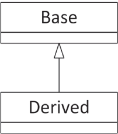
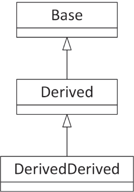
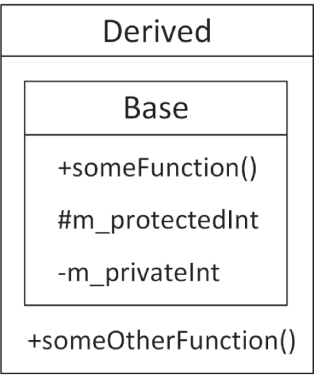
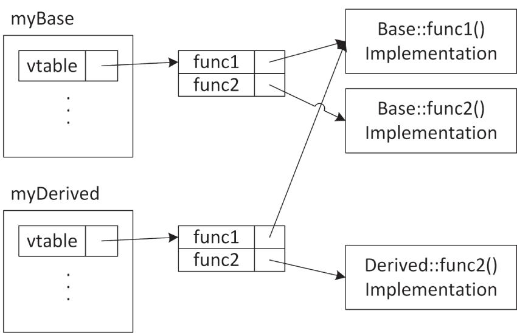
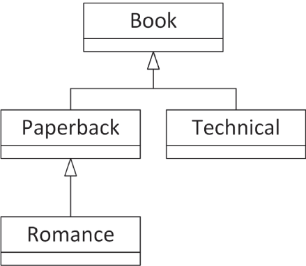
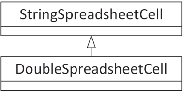
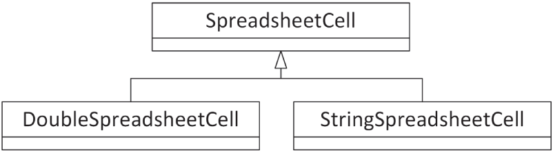
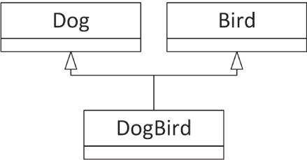
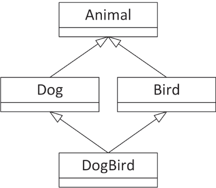
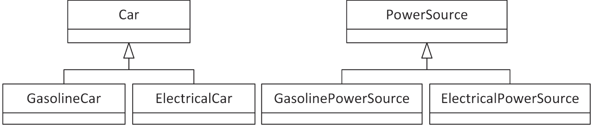

:::tip[WHAT'S IN THIS CHAPTER?]
- How to extend a class through inheritance
- How to employ inheritance to reuse code
- How to build interactions between base classes and derived classes
- How to use inheritance to achieve polymorphism
- How to work with multiple inheritance
- How to deal with unusual problems in inheritance
- How to cast one type to another type
:::

:::tip[WILEY.COM DOWNLOADS FOR THIS CHAPTER]
Please note that all the code examples for this chapter are available as part of this chapter's code download on the book's website at `www.wiley.com/go/proc++6e` on the Download Code tab.
:::

Without inheritance, classes would simply be data structures with associated behaviors. That alone would be a powerful improvement over procedural languages, but inheritance adds an entirely new dimension. Through inheritance, you can build new classes based on existing ones. In this way, your classes become reusable and extensible components. This chapter teaches you the different ways to leverage the power of inheritance. You will learn about the specific syntax of inheritance as well as sophisticated techniques for making the most of inheritance.

The portion of this chapter relating to polymorphism draws heavily on the spreadsheet example discussed in [Chapter 8](../c08), “Gaining Proficiency with Classes and Objects,” and [Chapter 9](../c09), “Mastering Classes and Objects.” This chapter also refers to the object-oriented methodologies described in [Chapter 5](../c05), “Designing with Classes.” If you have not read that chapter and are unfamiliar with the theories behind inheritance, you should review [Chapter 5](../c05) before continuing.

## BUILDING CLASSES WITH INHERITANCE

In [Chapter 5](../c05), you learned that an *is-a* relationship recognizes the pattern that real-world objects tend to exist in hierarchies. In programming, that pattern becomes relevant when you need to write a class that builds on, or slightly changes, another class. One way to accomplish this aim is to copy code from one class and paste it into the other. By changing the relevant parts or amending the code, you can achieve the goal of creating a new class that is slightly different from the original. This approach, however, leaves an OOP programmer feeling sullen and highly annoyed for the following reasons:

- A bug fix to the original class will not be reflected in the new class because the two classes contain completely separate code.
- The compiler does not know about any relationship between the two classes, so they are not polymorphic (see [Chapter 5](../c05))—they are not just different variations on the same thing.
- This approach does not build a true is-a relationship. The new class is similar to the original because it has similar code, not because it really *is* the same type of object.
- The original code might not be obtainable. It may exist only in a precompiled binary format, so copying and pasting the code might be impossible.

Not surprisingly, C++ provides built-in support for defining a true is-a relationship. The characteristics of C++ is-a relationships are described in the following section.

### Extending Classes

When you write a class definition in C++, you can tell the compiler that your class is *inheriting from, deriving from*, or *extending* an existing class. By doing so, your class automatically contains the data members and member functions of the original class, which is called the *parent class*, *base class*, or *superclass*. Extending an existing class gives your class (which is now called a *child class*, *derived class*, or *subclass*) the ability to describe only the ways in which it is different from the parent class.

To extend a class in C++, you specify the class you are extending when you write the class definition. To show the syntax for inheritance, two classes are used, `Base` and `Derived`. Don't worry—more interesting examples are coming later. To begin, consider the following definition for the `Base` class:

```cpp
class Base
{
    public:
        void someFunction() {}
    protected:
        int m_protectedInt { 0 };
    private:
        int m_privateInt { 0 };
};
```

If you want to build a new class, called `Derived`, which inherits from `Base`, you use the following syntax:

```cpp
class Derived : public Base
{
    public:
        void someOtherFunction() {}
};
```

`Derived` is a full-fledged class that just happens to share the characteristics of the `Base` class. Don't worry about the word `public` for now—its meaning is explained later in this chapter. [Figure 10.1](#c10-fig-0001) shows the simple relationship between `Derived` and `Base`. You can declare objects of type `Derived` just like any other object. You could even define a third class that inherits from `Derived`, forming a chain of classes, as shown in [Figure 10.2](#c10-fig-0002).

 


[^FIGURE 10.1]

 


[^FIGURE 10.2]

`Derived` doesn't have to be the only derived class of `Base`. Additional classes can also inherit from `Base`, effectively becoming *siblings* to `Derived`, as shown in [Figure 10.3](#c10-fig-0003).

 


[^FIGURE 10.3]

Internally, a derived class contains an instance of the base class as a *subobject*. Graphically this can be represented as in [Figure 10.4](#c10-fig-0004).

 


[^FIGURE 10.4]

#### A Client's View of Inheritance

To a client, or another part of your code, an object of type `Derived` is also an object of type `Base` because `Derived` inherits from `Base`. This means that all the `public` member functions and data members of `Base` *and* all the `public` member functions and data members of `Derived` are available.

Code that uses the derived class does not need to know which class in your inheritance chain has defined a member function in order to call it. For example, the following code calls two member functions of a `Derived` object, even though one of the member functions is defined by the `Base` class:

```cpp
Derived myDerived;
myDerived.someFunction();
myDerived.someOtherFunction();
```

It is important to understand that inheritance works in only one direction. The `Derived` class has a clearly defined relationship to the `Base` class, but the `Base` class, as written, doesn't know anything about the `Derived` class. That means objects of type `Base` do not have access to member functions and data members of `Derived` because `Base` is *not* a `Derived`.

The following code does not compile because the `Base` class does not contain a `public` member function called `someOtherFunction()`:

```cpp
Base myBase;
myBase.someOtherFunction();  // Error! Base doesn't have a someOtherFunction().
```

:::note
From the perspective of code using an object, the object belongs to its defined class as well as to any base classes.
:::

A pointer or reference to a class type can refer to an object of the declared class type or any of its derived classes. This tricky subject is explained in detail later in this chapter. The concept to understand now is that a pointer to `Base` can actually be pointing to a `Derived` object. The same is true for a reference. The client can still access only the member functions and data members that exist in `Base`, but through this mechanism, any code that operates on a `Base` can also operate on a `Derived`.

For example, the following code compiles and works just fine, even though it initially appears that there is a type mismatch:

```cpp
Base* base { new Derived {} }; // Create Derived, store in Base pointer.
```

However, you cannot call member functions from the `Derived` class through the `Base` pointer. The following does not work:

```cpp
base->someOtherFunction();
```

This is flagged as an error by the compiler because, although the object is of type `Derived` and therefore does have `someOtherFunction()` defined, the compiler can only think of it as type `Base`, which does not have `someOtherFunction()` defined.

#### A Derived Class's View of Inheritance

To the derived class, nothing much has changed in terms of how it is written or how it behaves. You can still define member functions and data members on a derived class just as you would on a regular class. The previous definition of `Derived` declares a member function called `someOtherFunction()`. Thus, the `Derived` class augments the `Base` class by adding an additional member function.

A derived class can access `public` and `protected` member functions and data members declared in its base class as though they were its own, because technically they are. For example, the implementation of `someOtherFunction()` on `Derived` could make use of the data member `m_protectedInt`, which is declared as part of `Base`. The following code shows this. Accessing a base class member is no different than if the member were declared as part of the derived class.

```cpp
void Derived::someOtherFunction()
{
    println("I can access base class data member m_protectedInt.");
    println("Its value is {}", m_protectedInt);
}
```

If a class declares members as `protected`, derived classes have access to them. If they are declared as `private`, derived classes do not have access. The following implementation of `someOtherFunction()` does not compile because the derived class attempts to access a `private` data member from the base class:

```cpp
void Derived::someOtherFunction()
{
    println("I can access base class data member m_protectedInt.");
    println("Its value is {}", m_protectedInt);
    println("The value of m_privateInt is {}", m_privateInt); // Error!
}
```

The `private` access specifier gives you control over how a potential derived class could interact with your class.

[Chapter 4](../c04), “Designing Professional C++ Programs,” gives the following rule: all data members should be `private`; provide `public` getters and setters if you want to provide access to data members from outside the class. This rule can now be extended to include the `protected` access specifier.

:::warning
All data members should be `private`. Provide `public` getters and setters if you want to provide access to data members from outside the class and provide `protected` getters and setters if you want only derived classes to access them.
:::

The reason to make data members `private` by default is that this provides the highest level of encapsulation. This means that you can change how you represent your data while keeping the `public` and `protected` interfaces unchanged. Additionally, without giving direct access to data members, you can easily add checks on the input data in your `public` and `protected` setters. Member functions should also be `private` by default. Only make those member functions `public` that are designed to be public and make member functions `protected` if you want only derived classes to have access to them.

:::note
From the perspective of a derived class, all `public` and `protected` data members and member functions from the base class are available for use.
:::

The following table summarizes the meaning of all three access specifiers:

| ACCESS SPECIFIER | MEANING | WHEN TO USE |
| --- | --- | --- |
| `public` | Any code can call a `public` member function or access a `public` data member of an object. | Behaviors (member functions) that you want clients to use.  Access member functions (getters and setters) for `private` and `protected` data members. |
| `protected` | Any member function of the class can call `protected` member functions and access `protected` data members. Member functions of derived classes can access `protected` members of a base class. | “Helper” member functions that you do not want clients to use. |
| `private` | Only member functions of the class can call `private` member functions and access `private` data members. Member functions in derived classes cannot access `private` members of a base class. | Everything should be `private` by default, especially data members. You can provide `protected` getters and setters if you only want to allow derived classes to access them, and provide `public` getters and setters if you want clients to access them. |

#### Preventing Inheritance

C++ allows you to mark a class as `final`, which means trying to inherit from it will result in a compilation error. A class can be marked as `final` with the `final` keyword right behind the name of the class. For example, if a class tries to inherit from the following `Foo` class, the compiler will produce an error:

```cpp
class Foo final { };
```

### Overriding Member Functions

The main reasons to inherit from a class are to add or replace functionality. The definition of `Derived` adds functionality to its parent class by providing an additional member function, `someOtherFunction()`. The other member function, `someFunction()`, is inherited from `Base` and behaves in the derived class exactly as it does in the base class. In many cases, you will want to modify the behavior of a class by replacing, or *overriding*, a member function.

#### The virtual Keyword

Simply defining a member function from a base class in a derived class does not properly override that member function. To correctly override a member function, we need a new C++ keyword called `virtual`. Only member functions that are declared as `virtual` in the base class can be overridden properly by derived classes. The keyword goes at the beginning of a member function declaration as shown in the modified version of `Base` that follows:

```cpp
class Base
{
    public:
        virtual void someFunction();
        // Remainder omitted for brevity.
};
```

The same holds for the `Derived` class. Its member functions should also be marked `virtual` if you want to override them in further derived classes:

```cpp
class Derived : public Base
{
    public:
        virtual void someOtherFunction();
};
```

The `virtual` keyword is not repeated in front of the member function definition, e.g.:

```cpp
void Base::someFunction()
{
    println("This is Base's version of someFunction().");
}
```

:::warning
Attempting to override a non-`virtual` member function from a base class hides the base class definition, and it will be used only in the context of the derived class.
:::

#### Syntax for Overriding a Member Function

To override a member function, you redeclare it in the derived class definition exactly as it was declared in the base class, but you add the `override` keyword and remove the `virtual` keyword. For example, if you want to provide a new definition for `someFunction()` in the `Derived` class, you must first add it to the class definition for `Derived`, as follows:

```cpp
class Derived : public Base
{
    public:
        void someFunction() override; // Overrides Base's someFunction()
        virtual void someOtherFunction();
};
```

The new definition of `someFunction()` is specified along with the rest of `Derived`'s member functions. Just as with the `virtual` keyword, you do not repeat the `override` keyword in the member function definition:

```cpp
void Derived::someFunction()
{
    println("This is Derived's version of someFunction().");
}
```

If you want, you are allowed to add the `virtual` keyword in front of overridden member functions, but it's redundant. Here's an example:

```cpp
class Derived : public Base
{
    public:
        virtual void someFunction() override;  // Overrides Base's someFunction()
};
```

Once a member function or destructor is marked as `virtual`, it is `virtual` for all derived classes even if the `virtual` keyword is removed from derived classes.

#### A Client's View of Overridden Member Functions

With the preceding changes, other code still calls `someFunction()` the same way it did before. Just as before, the member function could be called on an object of class `Base` or an object of class `Derived`. Now, however, the behavior of `someFunction()` varies based on the class of the object.

For example, the following code works just as it did before, calling `Base`'s version of `someFunction()`:

```cpp
Base myBase;
myBase.someFunction();  // Calls Base's version of someFunction().
```

The output of this code is as follows:

```cpp
This is Base's version of someFunction().
```

If the code declares an object of class `Derived`, the other version is automatically called:

```cpp
Derived myDerived;
myDerived.someFunction();   // Calls Derived's version of someFunction()
```

The output this time is as follows:

```cpp
This is Derived's version of someFunction().
```

Everything else about objects of class `Derived` remains the same. Other member functions that might have been inherited from `Base` still have the definition provided by `Base` unless they are explicitly overridden in `Derived`.

As you learned earlier, a pointer or reference can refer to an object of a class or any of its derived classes. The object itself “knows” the class of which it is actually a member, so the appropriate member function is called as long as it was declared `virtual`. For example, if you have a `Base` reference that refers to an object that is really a `Derived`, calling `someFunction()` actually calls the derived class's version, as shown next. This aspect of overriding does *not* work properly if you omit the `virtual` keyword in the base class.

```cpp
Derived myDerived;
Base& ref { myDerived };
ref.someFunction();   // Calls Derived's version of someFunction()
```

Remember that even though a `Base` reference or pointer knows that it is referring to a `Derived` instance, you cannot access `Derived` class members that are not defined in `Base`. The following code does not compile because a `Base` reference does not have a member function called `someOtherFunction()`:

```cpp
Derived myDerived;
Base& ref { myDerived };
myDerived.someOtherFunction();  // This is fine.
ref.someOtherFunction();        // Error
```

This derived class knowledge characteristic is *not* true for nonpointer or nonreference objects. You can cast or assign a `Derived` to a `Base` because a `Derived` is a `Base`. However, the object loses any knowledge of the `Derived` class at that point.

```cpp
Derived myDerived;
Base assignedObject { myDerived };  // Assigns a Derived to a Base.
assignedObject.someFunction();      // Calls Base's version of someFunction()
```

One way to remember this seemingly strange behavior is to imagine what the objects look like in memory. Picture a `Base` object as a box taking up a certain amount of memory. A `Derived` object is a box that is slightly bigger because it has everything a `Base` has plus a bit more. Whether you have a `Derived` or `Base` reference or pointer to a `Derived`, the box doesn't change—you just have a new way of accessing it. However, when you cast a `Derived` into a `Base`, you are throwing out all the “uniqueness” of the `Derived` class to fit it into a smaller box.

:::note
Derived classes retain all their data members and member functions when referred to by base class pointers or references. They lose their uniqueness when cast to a base class object. The loss of the derived class's data members and member functions is called slicing.
:::

#### The override Keyword

The use of the `override` keyword is optional, but highly recommended. Without the keyword, it is possible to accidentally create a new (`virtual`) member function in a derived class instead of overriding a member function from the base class, effectively hiding the member function from the base class. Take the following `Base` and `Derived` classes where `Derived` is properly overriding `someFunction()`, but is not using the `override` keyword:

```cpp
class Base
{
    public:
        virtual void someFunction(double d);
};
 
class Derived : public Base
{
    public:
        virtual void someFunction(double d);
};
```

You can call `someFunction()` through a reference as follows:

```cpp
Derived myDerived;
Base& ref { myDerived };
ref.someFunction(1.1);  // Calls Derived's version of someFunction()
```

This correctly calls the overridden `someFunction()` from the `Derived` class. Now, suppose you accidentally use an integer parameter instead of a `double` while overriding `someFunction()`, as follows:

```cpp
class Derived : public Base
{
    public:
        virtual void someFunction(int i);
};
```

This code does *not* override `someFunction()` from `Base`, but instead creates a new `virtual` member function. If you try to call `someFunction()` through a `Base` reference as in the following code, `someFunction()` of `Base` is called instead of the one from `Derived`!

```cpp
Derived myDerived;
Base& ref { myDerived };
ref.someFunction(1.1);  // Calls Base's version of someFunction()
```

This type of problem can happen when you start to modify the `Base` class but forget to update all derived classes. For example, maybe your first version of the `Base` class has a member function called `someFunction()` accepting an integer. You then write the `Derived` class overriding this `someFunction()` accepting an integer. Later you decide that `someFunction()` in `Base` needs a `double` instead of an integer, so you update `someFunction()` in the `Base` class. It could happen that at that time, you forget to update overrides of `someFunction()` in derived classes to also accept a `double` instead of an integer. By forgetting this, you are now actually creating a new `virtual` member function instead of properly overriding the base member function.

You can prevent this situation by using the `override` keyword as follows:

```cpp
class Derived : public Base
{
    public:
        void someFunction(int i) override;
};
```

This definition of `Derived` generates a compilation error, because with the `override` keyword you are saying that `someFunction()` is supposed to be overriding a member function from a base class, but the `Base` class has no `someFunction()` accepting an integer, only one accepting a `double`.

The problem of accidentally creating a new member function instead of properly overriding one can also happen when you rename a member function in the base class and forget to rename the overriding member functions in derived classes.

:::warning
Always use the `override` keyword on member functions that are meant to be overriding member functions from a base class.
:::

#### The Truth about virtual

By now you know that if a member function is not `virtual`, trying to override it in a derived class will hide the base class's version of that member function. This section explores how `virtual` member functions are implemented by the compiler and what their performance impact is, as well as discussing the importance of `virtual` destructors.

##### How virtual Is Implemented

To understand how member function hiding is avoided, you need to know a bit more about what the `virtual` keyword actually does. When a class is compiled in C++, a binary object is created that contains all member functions for the class. In the non-`virtual` case, the code to transfer control to the appropriate member function is hard-coded directly where the member function is called based on the compile-time type. This is called *static binding*, also known as *early binding*.

If the member function is declared `virtual`, the correct implementation is called through the use of a special area of memory called the *vtable*, or “*virtual table*.” Each class that has one or more virtual member functions has a vtable, and every object of such a class contains a pointer to said vtable. This vtable contains pointers to the implementations of the `virtual` member functions. In this way, when a member function is called on a pointer or reference to an object, its vtable pointer is followed, and the appropriate version of the member function is executed based on the actual type of the object at run time. This is called *dynamic binding*, also known as *late binding*. It's important to remember that this dynamic binding works only when using pointers or references to objects. If you call a `virtual` member function directly on an object, then that call will use static binding resolved at compile time.

To better understand how vtables make overriding of member functions possible, take the following `Base` and `Derived` classes as an example:

```cpp
class Base
{
    public:
        virtual void func1();
        virtual void func2();
        void nonVirtualFunc();
};
 
class Derived : public Base
{
    public:
        void func2() override;
        void nonVirtualFunc();
};
```

For this example, assume that you have the following two instances:

```cpp
Base myBase;
Derived myDerived;
```

[Figure 10.5](#c10-fig-0005) shows a high-level view of the vtables of both instances. The `myBase` object contains a pointer to its vtable. This vtable has two entries, one for `func1()` and one for `func2()`. Those entries point to the implementations of `Base::func1()` and `Base::func2()`.

 


[^FIGURE 10.5]

`myDerived` also contains a pointer to its vtable, which also has two entries, one for `func1()` and one for `func2()`. Its `func1()` entry points to `Base::func1()` because `Derived` does not override `func1()`. On the other hand, its `func2()` entry points to `Derived::func2()`.

Note that both vtables do not contain any entry for the `nonVirtualFunc()` member function because that member function is not `virtual`.

##### The Justification for virtual

In some languages, such as Java, all member functions are automatically `virtual` so they can be overridden properly. In C++ that's not the case. The argument against making everything `virtual` in C++, and the reason that the keyword was created in the first place, has to do with the overhead of the vtable. To call a `virtual` member function, the program needs to perform an extra operation by dereferencing the pointer to the appropriate code to execute. This is a miniscule performance hit in most cases, but the designers of C++ thought that it was better, at least at the time, to let the programmer decide if the performance hit was necessary. If the member function was never going to be overridden, there was no need to make it `virtual` and take the performance hit. However, with today's CPUs, the performance hit is measured in fractions of a nanosecond, and this will keep getting smaller with future CPUs. In most applications, you will not have a measurable performance difference between using `virtual` member functions and avoiding them.

Still, in certain specific use cases, the performance overhead might be too costly, and you may need to have an option to avoid the hit. For example, suppose you have a `Point` class that has a `virtual` member function. If you have another data structure that stores millions or even billions of `Point`s, calling a virtual member function on each point creates significant overhead. In that case, it's probably wise to avoid any `virtual` member functions in your `Point` class.

There is also a tiny hit to memory usage for each object. In addition to the implementation of the member function, each object also needs a pointer for its vtable, which takes up a tiny amount of space. This is not an issue in the majority of cases. However, sometimes it does matter. Take again the `Point` class and the container storing billions of `Point`s. In that case, the additional required memory becomes significant.

##### The Need for virtual Destructors

Destructors should almost always be `virtual`. Making your destructors non-`virtual` can easily result in situations in which memory is not freed by object destruction. Only for a class that is marked as `final` could you make its destructor non-`virtual`.

For example, if a derived class uses memory that is dynamically allocated in the constructor and deleted in the destructor, it will never be freed if the destructor is never called. Similarly, if your derived class has members that are automatically deleted when an instance of the class is destroyed, such as `std::unique_ptr`s, then those members will not get deleted either if the destructor is never called.

As the following code shows, it is easy to “trick” the compiler into skipping the call to the destructor if it is non-`virtual`:

```cpp
class Base
{
    public:
        Base() = default;
        ˜Base() {}
};
 
class Derived : public Base
{
    public:
        Derived()
        {
            m_string = new char[30];
            println("m_string allocated");
        }
 
        ˜Derived()
        {
            delete[] m_string;
            println("m_string deallocated");
        }
    private:
        char* m_string;
};
 
int main()
{
    Base* ptr { new Derived {} };   // m_string is allocated here.
    delete ptr; // ˜Base is called, but not ˜Derived because the destructor
                // is not virtual!
}
```

As you can see from the following output, the destructor of the `Derived` object is never called, that is, the “m_string deallocated” message is never displayed:

```cpp
m_string allocated
```

Technically, the behavior of the `delete` call in the preceding code is undefined by the standard. A C++ compiler could do whatever it wants in such undefined situations. However, most compilers simply call the destructor of the base class, and not the destructor of the derived class.

The fix is to mark the destructor in the base class as `virtual`. If you don't need to do any extra work in that destructor but want to make it `virtual`, you can explicitly default it. Here's an example:

```cpp
class Base
{
    public:
        Base() = default;
        virtual ˜Base() = default;
};
```

With this change, the output is as expected:

```cpp
m_string allocated
m_string deallocated
```

Note that since C++11, the generation of a copy constructor and copy assignment operator is deprecated if the class has a user-declared destructor. Basically, once you have a user-declared destructor, the rule of five kicks in. This means you need to declare a copy constructor, copy assignment operator, move constructor, and move assignment operator, possibly by explicitly defaulting them. This is not done in the examples in this chapter in the interest of keeping them concise and to the point.

:::warning
Unless you have a specific reason not to, or the class is marked as `final`, destructors should be marked as `virtual`. Constructors cannot and need not be `virtual` because you always specify the exact class being constructed when creating an object.
:::

Earlier in this chapter it was advised to use the `override` keyword on member functions that are meant to override base class member functions. It's also possible to use the `override` keyword on a destructor. This makes sure that the compiler will trigger an error if the destructor in the base class is not `virtual`. You can combine `virtual`, `override`, and `default`. Here's an example:

```cpp
class Derived : public Base
{
    public:
        virtual ˜Derived() override = default;
};
```

#### Preventing Overriding

Besides marking an entire class as `final`, C++ also allows you to mark individual member functions as `final`. Such member functions cannot be overridden in a further derived class. For example, overriding `someFunction()` from the following `Derived` class in `DerivedDerived` results in a compilation error:

```cpp
class Base
{
    public:
        virtual ˜Base() = default;
        virtual void someFunction();
};
class Derived : public Base
{
    public:
        void someFunction() override final;
};
class DerivedDerived : public Derived
{
    public:
        void someFunction() override;  // Compilation error.
};
```

## INHERITANCE FOR REUSE

Now that you are familiar with the basic syntax for inheritance, it's time to explore one of the main reasons that inheritance is an important feature of the C++ language. Inheritance is a vehicle that allows you to leverage existing code. This section presents an example of inheritance for the purpose of code reuse.

### The WeatherPrediction Class

Imagine that you are given the task of writing a program to issue simple weather predictions, working with both Fahrenheit and Celsius. Weather predictions may be a little bit out of your area of expertise as a programmer, so you obtain a third-party class library that was written to make weather predictions based on the current temperature and the current distance between Jupiter and Mars (hey, it's plausible). This third-party package is distributed as a compiled library to protect the intellectual property of the prediction algorithms, but you do get to see the class definition. The `weather_prediction` module interface file looks as follows:

```cpp
export module weather_prediction;
import std;
// Predicts the weather using proven new-age techniques given the current
// temperature and the distance from Jupiter to Mars. If these values are
// not provided, a guess is still given but it's only 99% accurate.
export class WeatherPrediction
{
    public:
        // Virtual destructor
        virtual ˜WeatherPrediction();
        // Sets the current temperature in Fahrenheit
        virtual void setCurrentTempFahrenheit(int temp);
        // Sets the current distance between Jupiter and Mars
        virtual void setPositionOfJupiter(int distanceFromMars);
        // Gets the prediction for tomorrow's temperature
        virtual int getTomorrowTempFahrenheit() const;
        // Gets the probability of rain tomorrow. 1 means
        // definite rain. 0 means no chance of rain.
        virtual double getChanceOfRain() const;
        // Displays the result to the user in this format:
        // Result: x.xx chance. Temp. xx
        virtual void showResult() const;
        // Returns a string representation of the temperature
        virtual std::string getTemperature() const;
    private:
        int m_currentTempFahrenheit { 0 };
        int m_distanceFromMars { 0 };
};
```

Note that this class marks all member functions as `virtual`, because the class presumes that they might get overridden in derived classes.

This class solves most of the problems for your program. However, as is usually the case, it's not *exactly* right for your needs. First, all the temperatures are given in Fahrenheit. Your program needs to operate in Celsius as well. Also, the `showResult()` member function might not display the result in a way you require.

### Adding Functionality in a Derived Class

When you learned about inheritance in [Chapter 5](../c05), adding functionality was the first technique described. Fundamentally, your program needs something just like the `WeatherPrediction` class but with a few extra bells and whistles. Sounds like a good case for inheritance to reuse code. To begin, define a new class, `MyWeatherPrediction`, that inherits from `WeatherPrediction`:

```cpp
import weather_prediction;
 
export class MyWeatherPrediction : public WeatherPrediction
{
};
```

The preceding class definition compiles just fine. The `MyWeatherPrediction` class can already be used in place of `WeatherPrediction`. It provides the same functionality, but nothing new yet. For the first modification, you might want to add knowledge of the Celsius scale to the class. There is a bit of a quandary here because you don't know what the class is doing internally. If all of the internal calculations are made using Fahrenheit, how do you add support for Celsius? One way is to use the derived class to act as a go-between, interfacing between the user, who can use either scale, and the base class, which only understands Fahrenheit.

The first step in supporting Celsius is to add new member functions that allow clients to set the current temperature in Celsius instead of Fahrenheit and to get tomorrow's prediction in Celsius instead of Fahrenheit. You also need private helper functions that convert between Celsius and Fahrenheit in both directions. These functions can be `static` because they are the same for all instances of the class.

```cpp
export class MyWeatherPrediction : public WeatherPrediction
{
    public:
        virtual void setCurrentTempCelsius(int temp);
        virtual int getTomorrowTempCelsius() const;
    private:
        static int convertCelsiusToFahrenheit(int celsius);
        static int convertFahrenheitToCelsius(int fahrenheit);
};
```

The new member functions follow the same naming convention as the parent class. Remember that from the point of view of other code, a `MyWeatherPrediction` object has all of the functionality defined in both `MyWeatherPrediction` and `WeatherPrediction`. Adopting the parent class's naming convention presents a consistent interface.

The implementation of the Celsius/Fahrenheit conversion functions is left as an exercise for the reader—and a fun one at that! The other two member functions are more interesting. To set the current temperature in Celsius, you need to convert the temperature first and then present it to the parent class in units that it understands:

```cpp
void MyWeatherPrediction::setCurrentTempCelsius(int temp)
{
    int fahrenheitTemp { convertCelsiusToFahrenheit(temp) };
    setCurrentTempFahrenheit(fahrenheitTemp);
}
```

As you can see, once the temperature is converted, the member function calls the existing functionality from the base class. Similarly, the implementation of `getTomorrowTempCelsius()` uses the parent's existing functionality to get the temperature in Fahrenheit, but converts the result before returning it:

```cpp
int MyWeatherPrediction::getTomorrowTempCelsius() const
{
    int fahrenheitTemp { getTomorrowTempFahrenheit() };
    return convertFahrenheitToCelsius(fahrenheitTemp);
}
```

The two new member functions effectively reuse the parent class because they “wrap” the existing functionality in a way that provides a new interface for using it.

You can also add new functionality completely unrelated to existing functionality of the parent class. For example, you could add a member function that retrieves alternative forecasts from the Internet or a member function that suggests an activity based on the predicted weather.

### Replacing Functionality in a Derived Class

The other major technique for inheritance is replacing existing functionality. The `showResult()` member function in the `WeatherPrediction` class is in dire need of a facelift. `MyWeatherPrediction` can override this member function to replace the behavior with its own implementation.

The new class definition for `MyWeatherPrediction` is as follows:

```cpp
export class MyWeatherPrediction : public WeatherPrediction
{
    public:
        virtual void setCurrentTempCelsius(int temp);
        virtual int getTomorrowTempCelsius() const;
        void showResult() const override;
    private:
        static int convertCelsiusToFahrenheit(int celsius);
        static int convertFahrenheitToCelsius(int fahrenheit);
};
```

Here is a new, user-friendlier implementation of the overridden `showResult()` member function:

```cpp
void MyWeatherPrediction::showResult() const
{
    println("Tomorrow will be {} degrees Celsius ({} degrees Fahrenheit)",
        getTomorrowTempCelsius(), getTomorrowTempFahrenheit());
    println("Chance of rain is {}%", getChanceOfRain() * 100);
    if (getChanceOfRain()> 0.5) { println("Bring an umbrella!"); }
}
```

To clients using this class, it's as if the old version of `showResult()` never existed. As long as the object is a `MyWeatherPrediction` object, the new version is called. As a result of these changes, `MyWeatherPrediction` has emerged as a new class with new functionality tailored to a more specific purpose. Yet, it did not require much code because it leveraged its base class's existing functionality.

## RESPECT YOUR PARENTS

When you write a derived class, you need to be aware of the interaction between parent classes and child classes. Issues such as order of creation, constructor chaining, and casting are all potential sources of bugs.

### Parent Constructors

Objects don't spring to life all at once; they must be constructed along with their parents and any objects that are contained within them. C++ defines the creation order as follows:

1. If the class has a base class, the default constructor of the base class is executed, unless there is a call to a base class constructor in the ctor-initializer, in which case that constructor is called instead of the default constructor.
2. Non-`static` data members of the class are constructed in the order in which they are declared.
3. The body of the class's constructor is executed.

These rules can apply recursively. If the class has a grandparent, the grandparent is initialized before the parent, and so on. The following code shows this creation order. The proper execution of this code outputs `123`.

```cpp
class Something
{
    public:
        Something() { print("2"); }
};
 
class Base
{
    public:
        Base() { print("1"); }
};
 
class Derived : public Base
{
    public:
        Derived() { print("3"); }
    private:
        Something m_dataMember;
};
 
int main()
{
    Derived myDerived;
}
```

When the `myDerived` object is created, the constructor for `Base` is called first, outputting the string `"1"`. Next, `m_dataMember` is initialized, calling the `Something` constructor, which outputs the string `"2"`. Finally, the `Derived` constructor is called, which outputs `"3"`.

Note that the `Base` constructor is called automatically. C++ automatically calls the default constructor for the parent class if one exists. If no default constructor exists in the parent class or if one does exist but you want to use an alternate parent constructor, you can *chain* the constructor just as when initializing data members in the ctor-initializer. For example, the following code shows a version of `Base` that lacks a default constructor. The associated version of `Derived` must explicitly tell the compiler how to call the `Base` constructor or the code will not compile.

```cpp
class Base
{
    public:
        explicit Base(int i) {}
};
 
class Derived : public Base
{
    public:
        Derived() : Base { 7 } { /* Other Derived's initialization … */ }
};
```

The `Derived` constructor passes a fixed value (7) to the `Base` constructor. Of course, `Derived` could also pass a variable:

```cpp
Derived::Derived(int i) : Base { i } { /* Other Derived's initialization … */ }
```

Passing constructor arguments from the derived class to the base class is perfectly fine and quite normal. Passing data members, however, will not work. The code will compile, but remember that data members are not initialized until *after* the base class is constructed. If you pass a data member as an argument to the parent constructor, it will be uninitialized.

### Parent Destructors

Because destructors cannot take arguments, the language can always automatically call the destructor for parent classes. The order of destruction is conveniently the reverse of the order of construction:

1. The body of the class's destructor is called.
2. Any data members of the class are destroyed in the reverse order of their construction.
3. The parent class, if any, is destructed.

Again, these rules apply recursively. The lowest member of the chain is always destructed first. The following code adds destructors to the earlier example. The destructors are all declared `virtual`! If executed, this code outputs `"123321"`.

```cpp
class Something
{
    public:
        Something() { print("2"); }
        virtual ˜Something() { print("2"); }
};
 
class Base
{
    public:
        Base() { print("1"); }
        virtual ˜Base() { print("1"); }
};
 
class Derived : public Base
{
    public:
        Derived() { print("3"); }
        virtual ˜Derived() override { print("3"); }
    private:
        Something m_dataMember;
};
```

If the preceding destructors were not declared `virtual`, the code would seem to work fine. However, if code ever called `delete` on a `Base` pointer that was really pointing to a `Derived` instance, the destruction chain would begin in the wrong place. For example, if you remove the `virtual` and `override` keywords from all destructors in the previous code, then a problem arises when a `Derived` object is accessed as a pointer to a `Base` and deleted, as shown here:

```cpp
Base* ptr { new Derived{} };
delete ptr;
```

The output of this code is a shockingly terse `"1231"`. When the `ptr` variable is deleted, only the `Base` destructor is called because the destructor was not declared `virtual`. As a result, the `Derived` destructor is not called, and the destructors for its data members are not called!

Technically, you could fix the preceding problem by marking only the `Base` destructor `virtual`. The “virtualness” automatically applies to any derived classes. However, I advocate explicitly making all destructors `virtual` so that you never have to worry about it.

:::warning
Always make your destructors `virtual`! The compiler-generated default destructor is not `virtual`, so you should define (or explicitly default) a `virtual` destructor, at least for your non-`final` base classes.
:::

### virtual Member Function Calls within Constructors and Destructor

`virtual` member functions behave differently in constructors and destructors. If your derived class has overridden a `virtual` member function from a base class, calling that member function from a base class constructor or destructor calls the base class implementation of that `virtual` member function and not your overridden version in the derived class! In other words, calls to `virtual` member functions from within a constructor or destructor are resolved statically at compile time.

The reason for this behavior of constructors has to do with the order of initialization when constructing an instance of a derived class. When creating such an instance, the constructor of any base class is called first, before the derived class instance is fully initialized. Hence, it would be dangerous to already call overridden `virtual` member functions from the not-yet-fully initialized derived class. A similar reasoning holds for destructors due to the order of destruction when destroying an object.

If you really need polymorphic behavior in your constructors, although this is not recommended, you can define an `initialize() virtual` member function in your base class, which derived classes can override. Clients creating an instance of your class will have to call this `initialize()` member function after construction has finished.

Similarly, if you need polymorphic behavior in your destructor, again, not recommended, you can define a `shutdown() virtual` member function that clients then need to call before the object is destroyed.

### Referring to Parent Names

When you override a member function in a derived class, you are effectively replacing the original as far as other code is concerned. However, that parent version of the member function still exists, and you may want to make use of it. For example, an overridden member function would like to keep doing what the base class implementation does, plus something else. Take a look at the `getTemperature()` member function in the `WeatherPrediction` class that returns a `string` representation of the current temperature:

```cpp
export class WeatherPrediction
{
    public:
        virtual std::string getTemperature() const;
        // Remainder omitted for brevity.
};
```

You can override this member function in the `MyWeatherPrediction` class as follows:

```cpp
export class MyWeatherPrediction : public WeatherPrediction
{
    public:
        std::string getTemperature() const override;
        // Remainder omitted for brevity.
};
```

Suppose the derived class wants to add °F to the string by first calling the base class's `getTemperature()` member function and then adding °F to it. You might write this as follows:

```cpp
string MyWeatherPrediction::getTemperature() const
{
    // Note: \u00B0 is the ISO/IEC 10646 representation of the degree symbol.
    return getTemperature() + "\u00B0F";  // BUG
}
```

However, this does not work because, under the rules of name resolution for C++, it first resolves against the local scope, then resolves against the class scope, and as a result ends up calling `MyWeatherPrediction::getTemperature()`. This causes an infinite recursion until you run out of stack space (some compilers detect this error and report it at compile time).

To make this work, you need to use the scope resolution operator as follows:

```cpp
string MyWeatherPrediction::getTemperature() const
{
    // Note: \u00B0 is the ISO/IEC 10646 representation of the degree symbol.
    return WeatherPrediction::getTemperature() + "\u00B0F";
}
```

:::note
Microsoft Visual C++ supports the non-standard `\__super` keyword (with two underscores). This allows you to write the following:
:::

Calling the parent version of the current member function is a commonly used pattern in C++. If you have a chain of derived classes, each might want to perform the operation already defined by the base class but add their own additional functionality as well.

Let's look at another example. Imagine a class hierarchy of book types, as shown in [Figure 10.6](#c10-fig-0006).

 


[^FIGURE 10.6]

Because each lower class in the hierarchy further specifies the type of book, a member function that gets the description of a book really needs to take all levels of the hierarchy into consideration. This can be accomplished by chaining to the parent member function. The following code illustrates this pattern:

```cpp
class Book
{
    public:
        virtual ˜Book() = default;
        virtual string getDescription() const { return "Book"; }
        virtual int getHeight() const { return 120; }
};
 
class Paperback : public Book
{
    public:
        string getDescription() const override {
            return "Paperback " + Book::getDescription();
        }
};
 
class Romance : public Paperback
{
    public:
        string getDescription() const override {
            return "Romance " + Paperback::getDescription();
        }
        int getHeight() const override { return Paperback::getHeight() / 2; }
};
 
class Technical : public Book
{
    public:
        string getDescription() const override {
            return "Technical " + Book::getDescription();
        }
};
 
int main()
{
    Romance novel;
    Book book;
    println("{}", novel.getDescription()); // Outputs "Romance Paperback Book"
    println("{}", book.getDescription());  // Outputs "Book"
    println("{}", novel.getHeight());      // Outputs "60"
    println("{}", book.getHeight());       // Outputs "120"
}
```

The `Book` base class has two `virtual` member functions: `getDescription()` and `getHeight()`. All derived classes override `getDescription()`, but only the `Romance` class overrides `getHeight()` by calling `getHeight()` on its parent class (`Paperback`) and dividing the result by two. `Paperback` does not override `getHeight()`, but C++ walks up the class hierarchy to find a class that implements `getHeight()`. In this example, `Paperback::getHeight()` resolves to `Book::getHeight()`.

### Casting Up and Down

As you have already seen, an object can be cast or assigned to its parent class. Here's an example:

```cpp
Derived myDerived;
Base myBase { myDerived };  // Slicing!
```

Slicing occurs in situations like this because the end result is a `Base` object, and `Base` objects lack the additional functionality defined in the `Derived` class. However, slicing does *not* occur if a derived class is assigned to a pointer or reference to its base class:

```cpp
Base& myBase { myDerived }; // No slicing!
```

This is generally the correct way to refer to a derived class in terms of its base class, also called *upcasting*. This is why it's always a good idea for functions to take references to classes instead of directly using objects of those classes. By using references, derived classes can be passed in without slicing.

:::warning
When upcasting, use a pointer or reference to the base class to avoid slicing.
:::

Casting from a base class to one of its derived classes, also called *downcasting*, is often frowned upon by professional C++ programmers because there is no guarantee that the object really belongs to that derived class and because downcasting is a sign of bad design. For example, consider the following code:

```cpp
void presumptuous(Base* base)
{
    Derived* myDerived { static_cast<Derived*>(base) };
    // Proceed to access Derived member functions on myDerived.
}
```

If the author of `presumptuous()` also writes the code that calls `presumptuous()`, everything will probably be OK, albeit still ugly, because the author knows that the function expects the argument to be of type `Derived*`. However, if other programmers call `presumptuous()`, they might pass in a `Base*`. There are no compile-time checks that can be done to enforce the type of the argument, and the function blindly assumes that `base` is actually a pointer to a `Derived` object.

Downcasting is sometimes necessary, and you can use it effectively in controlled circumstances. However, if you are going to downcast, you should use a `dynamic_cast()`, which uses the object's built-in knowledge of its type to refuse a cast that doesn't make sense. This built-in knowledge typically resides in the vtable, which means that `dynamic_cast()` works only for objects with a vtable, that is, objects with at least one `virtual` member. If a `dynamic_cast()` fails on a pointer, the result will be `nullptr` instead of pointing to nonsensical data. If a `dynamic_cast()` fails on an object reference, an `std::bad_cast` exception will be thrown. The last section of this chapter discusses the different options for casting in more detail.

The previous example could have been written as follows:

```cpp
void lessPresumptuous(Base* base)
{
    Derived* myDerived { dynamic_cast<Derived*>(base) };
    if (myDerived != nullptr) {
        // Proceed to access Derived member functions on myDerived.
    }
}
```

However, keep in mind that the use of downcasting is often a sign of a bad design. You should rethink and modify your design so that downcasting can be avoided. For example, the `lessPresumptuous()` function only really works with `Derived` objects, so instead of accepting a `Base` pointer, it should simply accept a `Derived` pointer. This eliminates the need for any downcasting. If the function should work with different derived classes, all inheriting from `Base`, then look for a solution that uses polymorphism, which is discussed next.

:::warning
Use downcasting only when really necessary, and be sure to use `dynamic_cast()`.
:::

## INHERITANCE FOR POLYMORPHISM

Now that you understand the relationship between a derived class and its parent, you can use inheritance in its most powerful scenario—polymorphism. [Chapter 5](../c05) discusses how polymorphism allows you to use objects with a common parent class interchangeably and to use objects in place of their parents.

### Return of the Spreadsheet

[Chapters 8](../c08) and [9](../c09) use a spreadsheet program as an example of an application that lends itself to an object-oriented design. A `SpreadsheetCell` represents a single element of data. Up to now, that element always stored a single `double` value. A simplified class definition for `SpreadsheetCell` follows. Note that a cell can be set either as a `double` or as a `string_view`, but it is always stored as a `double`. The current value of the cell, however, is always returned as a `string` for this example.

```cpp
class SpreadsheetCell
{
    public:
        virtual void set(double value);
        virtual void set(std::string_view value);
        virtual std::string getString() const;
     private:
        static std::string doubleToString(double value);
        static double stringToDouble(std::string_view value);
        double m_value;
};
```

In a real spreadsheet application, cells can store different things. A cell could store a `double`, but it might just as well store a piece of text. There could also be a need for additional types of cells, such as a formula cell or a date cell. How can you support this?

### Designing the Polymorphic Spreadsheet Cell

The `SpreadsheetCell` class is screaming out for a hierarchical makeover. A reasonable approach would be to narrow the scope of the `SpreadsheetCell` to cover only `string`s, perhaps renaming it to `StringSpreadsheetCell` in the process. To handle `double`s, a second class, `DoubleSpreadsheetCell`, would inherit from the `StringSpreadsheetCell` and provide functionality specific to its own format. [Figure 10.7](#c10-fig-0007) illustrates such a design. This approach models inheritance for reuse because the `DoubleSpreadsheetCell` would be deriving from `StringSpreadsheetCell` only to make use of some of its built-in functionality.

 


[^FIGURE 10.7]

If you were to implement the design shown in [Figure 10.7](#c10-fig-0007), you might discover that the derived class would override most, if not all, of the functionality of the base class. Because `double`s are treated differently from `string`s in almost all cases, the relationship may not be quite as it was originally understood. Yet, there clearly is a relationship between a cell containing `string`s and a cell containing `double`s. Rather than using the model in [Figure 10.7](#c10-fig-0007), which implies that somehow a `DoubleSpreadsheetCell` “is-a” `StringSpreadsheetCell`, a better design would make these classes peers with a common parent, `SpreadsheetCell`. [Figure 10.8](#c10-fig-0008) shows such a design.

 


[^FIGURE 10.8]

The design in [Figure 10.8](#c10-fig-0008) shows a polymorphic approach to the `SpreadsheetCell` hierarchy. Because `DoubleSpreadsheetCell` and `StringSpreadsheetCell` both inherit from a common parent, `SpreadsheetCell`, they are interchangeable in the view of other code. In practical terms, that means the following:

- Both derived classes support the same interface (set of member functions) defined by the base class.
- Code that makes use of `SpreadsheetCell` objects can call any member function in the interface without even knowing whether the cell is a `DoubleSpreadsheetCell` or a `StringSpreadsheetCell`.
- Through the magic of `virtual` member functions, the appropriate instance of every member function in the interface is called depending on the class of the object.
- Other data structures, such as the `Spreadsheet` class described in [Chapter 9](../c09), can contain a collection of multityped cells by referring to the base type.

### The SpreadsheetCell Base Class

Because all spreadsheet cells are deriving from the `SpreadsheetCell` base class, it is probably a good idea to write that class first. When designing a base class, you need to consider how the derived classes relate to each other. From this information, you can derive the commonality that will go inside the parent class. For example, `string` cells and `double` cells are similar in that they both contain a single piece of data. Because the data is coming from the user and will be displayed back to the user, the value is set as a `string` and retrieved as a `string`. These behaviors are the shared functionality that will make up the base class.

#### A First Attempt

The `SpreadsheetCell` base class is responsible for defining the behaviors that all `SpreadsheetCell`-derived classes will support. In this example, all cells need to be able to set their value as a string. All cells also need to be able to return their current value as a string. The base class definition declares these member functions, as well as an explicitly defaulted `virtual` destructor, but note that it has no data members. The definition is in a `spreadsheet_cell` module.

```cpp
export module spreadsheet_cell;
import std;
 
export class SpreadsheetCell
{
    public:
        virtual ˜SpreadsheetCell() = default;
        virtual void set(std::string_view value);
        virtual std::string getString() const;
};
```

When you start writing the `.cpp` file for this class, you quickly run into a problem. Considering that the base class of the spreadsheet cell contains neither a `double` nor a `string` data member, how can you implement it? More generally, how do you write a base class that declares the behaviors that are supported by derived classes without actually defining the implementation of those behaviors?

One possible approach is to implement “do nothing” functionality for those behaviors. For example, calling the `set()` member function on the `SpreadsheetCell` base class will have no effect because the base class has nothing to set. This approach still doesn't feel right, however. Ideally, there should never be an object that is an instance of the base class. Calling `set()` should always have an effect because it should always be called on either a `DoubleSpreadsheetCell` or a `StringSpreadsheetCell`. A good solution enforces this constraint.

#### Pure virtual Member Functions and Abstract Base Classes

*Pure virtual member functions* are member functions that are explicitly undefined in the class definition. By making a member function pure virtual, you are telling the compiler that no definition for the member function exists in the current class. A class with at least one pure virtual member function is said to be an *abstract class* because no other code will be able to instantiate it. The compiler enforces the fact that if a class contains one or more pure virtual member functions, it can never be used to construct an object of that type.

There is a special syntax for designating a pure virtual member function. The member function declaration is followed by `=0`. No implementation needs to be written.

```cpp
export class SpreadsheetCell
{
    public:
        virtual ˜SpreadsheetCell() = default;
        virtual void set(std::string_view value) = 0;
        virtual std::string getString() const = 0;
};
```

Now that the base class is an abstract class, it is impossible to create a `SpreadsheetCell` object. The following code does not compile and returns an error such as “‘SpreadsheetCell': cannot instantiate abstract class”:

```cpp
SpreadsheetCell cell; // Error! Attempts creating abstract class instance.
```

However, once the `StringSpreadsheetCell` class has been implemented, the following code will compile fine because it instantiates a derived class of the abstract base class:

```cpp
unique_ptr<SpreadsheetCell> cell { new StringSpreadsheetCell {} };
```

:::note
An abstract class provides a way to prevent other code from instantiating an object directly, as opposed to one of its derived classes.
:::

Note that there is nothing to implement for the `SpreadsheetCell` class. All member functions are pure virtual, and the destructor is explicitly defaulted.

### The Individual Derived Classes

Writing the `StringSpreadsheetCell` and `DoubleSpreadsheetCell` classes is just a matter of implementing the functionality that is *defined* in the parent. Because you want clients to be able to instantiate and work with `string` cells and `double` cells, the cells can't be abstract—they *must* implement all of the pure virtual member functions inherited from their parent. If a derived class does not implement all pure virtual member functions from the base class, then the derived class is abstract as well, and clients will not be able to instantiate objects of the derived class.

#### StringSpreadsheetCell Class Definition

The `StringSpreadsheetCell` class is defined in its own module called `string_spreadsheet_cell`. The first step in writing the class definition of `StringSpreadsheetCell` is to inherit from `SpreadsheetCell`. For this, the `spreadsheet_cell` module needs to be imported.

Next, the inherited pure virtual member functions are overridden, this time without being set to zero.

Finally, the string cell adds a private data member, `m_value`, which stores the actual cell data. This data member is an `std::optional`, introduced in [Chapter 1](../c01), “A Crash Course in C++ and the Standard Library.” By using an `optional`, it is possible to distinguish whether a value for a cell has never been set or whether it was set to the empty string.

```cpp
export module string_spreadsheet_cell;
export import spreadsheet_cell;
import std;
 
export class StringSpreadsheetCell : public SpreadsheetCell
{
    public:
        void set(std::string_view value) override;
        std::string getString() const override;
    private:
        std::optional<std::string> m_value;
};
```

#### StringSpreadsheetCell Implementation

The `set()` member function is straightforward because the internal representation is already a string. The `getString()` member function has to keep into account that `m_value` is of type `optional` and that it might not have a value. When `m_value` doesn't have a value, `getString()` should return a default string, the empty string for this example. This is made easy with the `value_or()` member function of `optional`. By using `m_value.value_or("")`, the real value is returned if `m_value` contains an actual value; otherwise, the empty string is returned.

```cpp
void set(std::string_view value) override { m_value = value; }
std::string getString() const override { return m_value.value_or(""); }
```

#### DoubleSpreadsheetCell Class Definition and Implementation

The `double` version follows a similar pattern, but with different logic. In addition to the `set()` member function from the base class that takes a `string_view`, it also provides a new `set()` member function that allows a client to set the value with a `double` argument. Additionally, it provides a new `getValue()` member function to retrieve the value as a `double`. Two new `private static` member functions are used to convert between a `string` and a `double`, and vice versa. As in `StringSpreadsheetCell`, it has a data member called `m_value`, this time of type `optional<double>`.

```cpp
export module double_spreadsheet_cell;
export import spreadsheet_cell;
import std;
 
export class DoubleSpreadsheetCell : public SpreadsheetCell
{
    public:
        virtual void set(double value);
        virtual double getValue() const;
 
        void set(std::string_view value) override;
        std::string getString() const override;
    private:
        static std::string doubleToString(double value);
        static double stringToDouble(std::string_view value);
        std::optional<double> m_value;
};
```

The `set()` member function that takes a `double` is straightforward, as is the implementation of `getValue()`. The `string_view` overload uses the `private static` member function `stringToDouble()`. The `getString()` member function returns the stored `double` value as a `string`, or returns an empty string if no value has been stored. It uses the `has_value()` member function of `std::optional` to query whether the `optional` has a value. If it has a value, the `value()` member function is used to retrieve it.

```cpp
virtual void set(double value) { m_value = value; }
virtual double getValue() const { return m_value.value_or(0); }
 
void set(std::string_view value) override { m_value = stringToDouble(value); }
std::string getString() const override
{
    return (m_value.has_value() ? doubleToString(m_value.value()) : "");
}
```

You may already see one major advantage of implementing spreadsheet cells in a hierarchy—the code is much simpler. Each class can be self-centered and deal only with its own functionality.

Note that the implementations of `doubleToString()` and `stringToDouble()` are omitted because they are the same as in [Chapter 8](../c08).

### Leveraging Polymorphism

Now that the `SpreadsheetCell` hierarchy is polymorphic, client code can take advantage of the many benefits that polymorphism has to offer. The following test program explores many of these features.

To demonstrate polymorphism, the test program declares a `vector` of three `SpreadsheetCell` pointers. Remember that because `SpreadsheetCell` is an abstract class, you can't create objects of that type. However, you can still have a pointer or reference to a `SpreadsheetCell` because it would actually be pointing to one of the derived classes. This `vector`, because it is a `vector` of the parent type `SpreadsheetCell`, allows you to store a heterogeneous mixture of the two derived classes. This means that elements of the `vector` could be either a `StringSpreadsheetCell` or a `DoubleSpreadsheetCell`.

```cpp
vector<unique_ptr<SpreadsheetCell>> cellArray;
```

The first two elements of the `vector` are set to point to a new `StringSpreadsheetCell`, while the third is a new `DoubleSpreadsheetCell`.

```cpp
cellArray.push_back(make_unique<StringSpreadsheetCell>());
cellArray.push_back(make_unique<StringSpreadsheetCell>());
cellArray.push_back(make_unique<DoubleSpreadsheetCell>());
```

Now that the `vector` contains multityped data, any of the member functions declared by the base class can be applied to the objects in the `vector`. The code just uses `SpreadsheetCell` pointers—the compiler has no idea at compile time what types the objects actually are. However, because the objects are inheriting from `SpreadsheetCell`, they must support the member functions of `SpreadsheetCell`.

```cpp
cellArray[0]->set("hello");
cellArray[1]->set("10");
cellArray[2]->set("18");
```

When the `getString()` member function is called, each object properly returns a `string` representation of their value. The important, and somewhat amazing, thing to realize is that the different objects do this in different ways. A `StringSpreadsheetCell` returns its stored value, or an empty string. A `DoubleSpreadsheetCell` first performs a conversion if it contains a value; otherwise, it returns an empty string. As the programmer, you don't need to know how the object does it—you just need to know that because the object is a `SpreadsheetCell`, it *can* perform this behavior.

```cpp
println("Vector: [{},{},{}]", cellArray[0]->getString(),
                              cellArray[1]->getString(),
                              cellArray[2]->getString());
```

### Future Considerations

The new implementation of the `SpreadsheetCell` hierarchy is certainly an improvement from an object-oriented design point of view. Yet, it would probably not suffice as an actual class hierarchy for a real-world spreadsheet program for several reasons.

First, despite the improved design, one feature is still missing: the ability to convert from one cell type to another. By dividing them into two classes, the cell objects become more loosely integrated. To provide the ability to convert from a `DoubleSpreadsheetCell` to a `StringSpreadsheetCell`, you could add a *converting constructor*, also known as a *typed constructor*. It has a similar appearance as a copy constructor, but instead of a reference to an object of the same class, it takes a reference to an object of a sibling class. Note also that you now have to declare a default constructor, which can be explicitly defaulted, because the compiler stops generating one as soon as you declare any constructor yourself.

```cpp
export class StringSpreadsheetCell : public SpreadsheetCell
{
    public:
        StringSpreadsheetCell() = default;
        StringSpreadsheetCell(const DoubleSpreadsheetCell& cell)
            : m_value { cell.getString() }
        { }
        // Remainder omitted for brevity.
};
```

With a converting constructor, you can easily create a `StringSpreadsheetCell` given a `DoubleSpreadsheetCell`. Don't confuse this with casting pointers or references, however. Casting from one sibling pointer or reference to another does not work, unless you overload the cast operator as described in [Chapter 15](../c15), “Overloading C++ Operators.”

:::warning
You can always cast up the hierarchy, and you can sometimes cast down the hierarchy. Casting across the hierarchy is possible by changing the behavior of the cast operator or by using `reinterpret_cast()`, neither of which is recommended.
:::

Second, the question of how to implement overloaded operators for cells is an interesting one, and there are several possible approaches.

One approach is to implement a version of each operator for every combination of cells. With only two derived classes, this is manageable. There would be an `operator+` function to add two `double` cells, to add two `string` cells, and to add a `double` cell to a `string` cell. For each combination, you decide what the result is. For example, the result of adding two `double` cells could be the result of mathematically adding both values together. The result of adding two `string` cells could be a `string` representing the concatenation of both `string`s, and so on.

Another approach is to decide on a common representation. The earlier implementation already standardizes on a `string` as a common representation of sorts. A single `operator+` could cover all the cases by taking advantage of this common representation.

Yet another approach is a hybrid one. One `operator+` can be provided that adds two `DoubleSpreadsheetCell`s resulting in a `DoubleSpreadsheetCell`. This operator can be implemented in the `double_spreadsheet_cell` module as follows:

```cpp
export DoubleSpreadsheetCell operator+(const DoubleSpreadsheetCell& lhs,
                                       const DoubleSpreadsheetCell& rhs)
{
    DoubleSpreadsheetCell newCell;
    newCell.set(lhs.getValue() + rhs.getValue());
    return newCell;
}
```

This operator can be tested as follows:

```cpp
DoubleSpreadsheetCell doubleCell;    doubleCell.set(8.4);
DoubleSpreadsheetCell result { doubleCell + doubleCell }; 
println("{}", result.getString());  // Prints 16.800000
```

A second `operator+` can be provided for use when at least one of the two operands is a `StringSpreadsheetCell`. You could decide that the result of this operator should always be a `string` cell. Such an operator can be added to the `string_spreadsheet_cell` module and can be implemented as follows:

```cpp
export StringSpreadsheetCell operator+(const StringSpreadsheetCell& lhs,
                                       const StringSpreadsheetCell& rhs)
{
    StringSpreadsheetCell newCell;
    newCell.set(lhs.getString() + rhs.getString());
    return newCell;
}
```

As long as the compiler has a way to turn a particular cell into a `StringSpreadsheetCell`, the operator will work. Given the previous example of having a `StringSpreadsheetCell` constructor that takes a `DoubleSpreadsheetCell` as an argument, the compiler will automatically perform the conversion if it is the only way to get the `operator+` to work. That means the following code adding a `double` cell to a `string` cell works, even though there are only two `operator+` implementations provided: one adding two `double` cells and one adding two `string` cells.

```cpp
DoubleSpreadsheetCell doubleCell;    doubleCell.set(8.4);
StringSpreadsheetCell stringCell;    stringCell.set("Hello ");
StringSpreadsheetCell result { stringCell + doubleCell };
println("{}", result.getString());  // Prints Hello 8.400000
```

If you are feeling a little unsure about polymorphism, start with the code for this example and try things out. It is a great starting point for experimental code that simply exercises various aspects of polymorphism.

### Providing Implementations for Pure virtual Member Functions

Technically, it is possible to provide an implementation for a pure `virtual` member function. This implementation cannot be in the class definition itself but must be provided outside. The class remains abstract though, and any derived classes are still required to provide an implementation of the pure `virtual` member function. Since the class remains abstract, no instances of it can be created. Still, its implementation of the pure `virtual` member function can be called, for example, from a derived class. The following code snippet demonstrates this:

```cpp
class Base
{
public:
    virtual void doSomething() = 0; // Pure virtual member function.
};
 
// An out-of-class implementation of a pure virtual member function.
void Base::doSomething() { println("Base::doSomething()"); }
 
class Derived : public Base
{
public:
    void doSomething() override
    {
        // Call pure virtual member function implementation from base class.
        Base::doSomething();
        println("Derived::doSomething()");
    }
};
 
int main()
{
    Derived derived;
    Base& base { derived };
    base.doSomething();
}
```

The output is as expected:

```cpp
Base::doSomething()
Derived::doSomething()
```

## MULTIPLE INHERITANCE

As you read in [Chapter 5](../c05), multiple inheritance is often perceived as a complicated and unnecessary part of object-oriented programming. I'll leave the decision of whether it is useful up to you and your co-workers. This section explains the mechanics of multiple inheritance in C++.

### Inheriting from Multiple Classes

Defining a class to have multiple parent classes is simple from a syntactic point of view. All you need to do is list the base classes individually when declaring the class name.

```cpp
class Baz : public Foo, public Bar { /* Etc. */ };
```

By listing multiple parents, a `Baz` object has the following characteristics:

- A `Baz` object supports the `public` member functions and contains the data members of both `Foo` and `Bar`.
- The member functions of the `Baz` class have access to `protected` data and member functions in both `Foo` and `Bar`.
- A `Baz` object can be upcast to either a `Foo` or a `Bar`.
- Creating a new `Baz` object automatically calls the `Foo` and `Bar` default constructors, in the order in which the classes are listed in the class definition.
- Deleting a `Baz` object automatically calls the destructors for the `Foo` and `Bar` classes, in the reverse order that the classes are listed in the class definition.

The following example shows a class, `DogBird`, that has two parent classes—a `Dog` class and a `Bird` class, as shown in [Figure 10.9](#c10-fig-0009). The fact that a dog-bird is a ridiculous example should not be viewed as a statement that multiple inheritance itself is ridiculous. Honestly, I leave that judgment up to you.

 


[^FIGURE 10.9]

```cpp
class Dog
{
    public:
        virtual void bark() { println("Woof!"); }
};
 
class Bird
{
    public:
        virtual void chirp() { println("Chirp!"); }
};
 
class DogBird : public Dog, public Bird
{
};
```

Using objects of classes with multiple parents is no different from using objects without multiple parents. In fact, the client code doesn't even have to know that the class has two parents. All that really matters are the properties and behaviors supported by the class. In this case, a `DogBird` object supports all of the `public` member functions of `Dog` and `Bird`.

```cpp
DogBird myConfusedAnimal;
myConfusedAnimal.bark();
myConfusedAnimal.chirp();
```

The output of this program is as follows:

```cpp
Woof!
Chirp!
```

### Naming Collisions and Ambiguous Base Classes

It's not difficult to construct a scenario where multiple inheritance would seem to break down. The following examples show some of the edge cases that must be considered.

#### Name Ambiguity

What if the `Dog` class and the `Bird` class both had a member function called `eat()`? Because `Dog` and `Bird` are not related in any way, one version of the member function does not override the other—they both continue to exist in the `DogBird`-derived class.

As long as client code never attempts to call the `eat()` member function, that is not a problem. The `DogBird` class compiles correctly despite having two versions of `eat()`. However, if client code attempts to call the `eat()` member function on a `DogBird`, the compiler gives an error indicating that the call to `eat()` is ambiguous. The compiler does not know which version to call. The following code provokes this ambiguity error:

```cpp
class Dog
{
    public:
        virtual void bark() { println("Woof!"); }
        virtual void eat() { println("The dog ate."); }
};
 
class Bird
{
    public:
        virtual void chirp() { println("Chirp!"); }
        virtual void eat() { println("The bird ate."); }
};
 
class DogBird : public Dog, public Bird
{
};
 
int main()
{
    DogBird myConfusedAnimal;
    myConfusedAnimal.eat();   // Error! Ambiguous call to member function eat()
}
```

If you comment out the last line from `main()` calling `eat()`, the code compiles fine.

The solution to the ambiguity is either to explicitly upcast the object using a `dynamic_cast()`, essentially hiding the undesired version of the member function from the compiler, or to use a *disambiguation syntax*. For example, the following code shows two ways to invoke the `Dog` version of `eat()`:

```cpp
dynamic_cast<Dog&>(myConfusedAnimal).eat(); // Calls Dog::eat()
myConfusedAnimal.Dog::eat();                // Calls Dog::eat()
```

Member functions of the derived class itself can also explicitly disambiguate between different member functions of the same name by using the same syntax used to access parent member functions, that is, the `::` scope resolution operator. For example, the `DogBird` class could prevent ambiguity errors in other code by defining its own `eat()` member function. Inside this member function, it would determine which parent version to call.

```cpp
class DogBird : public Dog, public Bird
{
    public:
        void eat() override
        {
            Dog::eat();          // Explicitly call Dog's version of eat()
        }
};
```

Yet another way to prevent the ambiguity error is to use a `using` declaration to explicitly state which version of `eat()` should be inherited in `DogBird`. Here's an example:

```cpp
class DogBird : public Dog, public Bird
{
    public:
        using Dog::eat;  // Explicitly inherit Dog's version of eat()
};
```

#### Ambiguous Base Classes

Another way to provoke ambiguity is to inherit from the same class twice. This can happen if multiple parents themselves have a common parent. For example, perhaps both `Bird` and `Dog` are inheriting from an `Animal` class, as shown in [Figure 10.10](#c10-fig-0010).

 


[^FIGURE 10.10]

This type of class hierarchy is permitted in C++, though name ambiguity can still occur. For example, if the `Animal` class has a `public` member function called `sleep()`, that member function cannot be called on a `DogBird` object because the compiler does not know whether to call the version inherited by `Dog` or by `Bird`.

The best way to use these “diamond-shaped” class hierarchies is to make the topmost class an abstract base class with all member functions declared as pure virtual. Because the class only declares member functions without providing definitions, there are no member functions in the base class to call, and thus there are no ambiguities at that level.

The following example implements a diamond-shaped class hierarchy in which the `Animal` abstract base class has a pure virtual `eat()` member function that must be defined by each derived class. The `DogBird` class still needs to be explicit about which parent's `eat()` member function it uses, but any ambiguity is caused by `Dog` and `Bird` having the same member function, not because they inherit from the same class.

```cpp
class Animal
{
    public:
        virtual void eat() = 0;
};
 
class Dog : public Animal
{
    public:
        virtual void bark() { println("Woof!"); }
        void eat() override { println("The dog ate."); }
};
 
class Bird : public Animal
{
    public:
        virtual void chirp() { println("Chirp!"); }
        void eat() override { println("The bird ate."); }
};
 
class DogBird : public Dog, public Bird
{
    public:
        using Dog::eat;
};
```

A more refined mechanism for dealing with the top class in a diamond-shaped hierarchy, virtual base classes, is explained later in this chapter.

#### Uses for Multiple Inheritance

At this point, you're probably wondering why programmers would want to tackle multiple inheritance in their code. The most straightforward use case for multiple inheritance is to define a class of objects that is-a something and also is-a something else. As was said in [Chapter 5](../c05), any real-world objects you find that follow this pattern are unlikely to translate well into code.

One of the most compelling and simple uses of multiple inheritance is for the implementation of mixin classes. Mixin classes are introduced in [Chapter 5](../c05) and are discussed in more detail in [Chapter 32](../c32), “Incorporating Design Techniques and Frameworks.”

Another reason that people sometimes use multiple inheritance is to model a component-based class. [Chapter 5](../c05) gives the example of an airplane simulator. The `Airplane` class has an engine, fuselage, controls, and other components. While the typical implementation of an `Airplane` class would make each of these components a separate data member, you could use multiple inheritance. The airplane class would inherit from engine, fuselage, and controls, in effect getting the behaviors and properties of all of its components. I recommend that you stay away from this type of code because it confuses a clear has-a relationship with inheritance, which should be used for is-a relationships. The recommended solution is to have an `Airplane` class that contains data members of type `Engine`, `Fuselage`, and `Controls`.

## INTERESTING AND OBSCURE INHERITANCE ISSUES

Extending a class opens up a variety of issues. What characteristics of the class can and cannot be changed? What is non-public inheritance? What are virtual base classes? These questions, and more, are answered in the following sections.

### Changing the Overridden Member Function's Return Type

For the most part, the reason you override a member function is to change its implementation. Sometimes, however, you may want to change other characteristics of the member function, such as its return type.

A good rule of thumb is to override a member function with the exact member function declaration, or *member function prototype*, that the base class uses. The implementation can change, but the prototype stays the same.

That does not have to be the case, however. In C++, an overriding member function can change the return type as long as the return type of the member function in the base class is a pointer or reference to a class, and the return type in the derived class is a pointer or reference to a descendant, i.e., more specialized class. Such types are called *covariant return types*. This feature sometimes comes in handy when the base class and derived class work with objects in a *parallel hierarchy*—that is, another group of classes that is tangential, but related, to the first class hierarchy.

For example, consider a basic car simulator. You might have two hierarchies of classes that model different real-world objects but are obviously related. The first is the `Car` hierarchy. The base class, `Car`, has derived classes `GasolineCar` and `ElectricalCar`. Similarly, there is another hierarchy of classes with a base class called `PowerSource` and derived classes `GasolinePowerSource` and `ElectricalPowerSource`. [Figure 10.11](#c10-fig-0011) shows the two class hierarchies.

 


[^FIGURE 10.11]

Let's assume a power source can print its own type and that a gasoline power source has a member function `fillTank()`, while an electrical power source has a member function `chargeBatteries()`:

```cpp
class PowerSource
{
    public:
        virtual void printType() = 0;
};
 
class GasolinePowerSource : public PowerSource
{
    public:
        void printType() override { println("GasolinePowerSource"); }
        virtual void fillTank() { println("Gasoline tank filled up."); }
};
 
class ElectricalPowerSource : public PowerSource
{
    public:
        void printType() override { println("ElectricalPowerSource"); }
        virtual void chargeBatteries() { println("Batteries charged."); }
};
```

Now assume that `Car` has a `virtual` member function called `getFilledUpPowerSource()` that returns a reference to the “filled-up” power source of a specific car:

```cpp
class Car
{
    public:
        virtual PowerSource& getFilledUpPowerSource() = 0;
};
```

This is a pure `virtual`, abstract member function, as it only makes sense to provide an actual implementation in concrete derived classes. Since a `GasolinePowerSource` is a `PowerSource`, the `GasolineCar` class can implement this member function as follows:

```cpp
class GasolineCar : public Car
{
    public:
        PowerSource& getFilledUpPowerSource() override
        {
            m_engine.fillTank();
            return m_engine;
        }
    private:
        GasolinePowerSource m_engine;
};
```

`ElectricalCar` can implement it as follows:

```cpp
class ElectricalCar : public Car
{
    public:
        PowerSource& getFilledUpPowerSource() override
        {
            m_engine.chargeBatteries();
            return m_engine;
        }
    private:
        ElectricalPowerSource m_engine;
};
```

These classes can be tested as follows:

```cpp
GasolineCar gc;
gc.getFilledUpPowerSource().printType();
println("");
ElectricalCar ev;
ev.getFilledUpPowerSource().printType();
```

The output is:

```cpp
Gasoline tank filled up.
GasolinePowerSource
 
Batteries charged.
ElectricalPowerSource
```

This implementation is fine. However, because you know that the `getFilledUpPowerSource()` member function for `GasolineCar` always returns a `GasolinePowerSource`, and for `ElectricalCar` always an `ElectricalPowerSource`, you can indicate this fact to potential users of these classes by changing the return type, as shown here:

```cpp
class GasolineCar : public Car
{
    public:
        GasolinePowerSource& getFilledUpPowerSource() override
        { /* omitted for brevity */ }
};
 
class ElectricalCar : public Car
{
    public:
        ElectricalPowerSource& getFilledUpPowerSource() override
        { /* omitted for brevity */ }
};
```

A good way to figure out whether you can change the return type of an overridden member function is to consider whether existing code would still work; this is called the *Liskov substitution principle* (LSP). In the preceding example, changing the return type was fine because any code that assumed that the `getFilledUpPowerSource()` member function would always return a `PowerSource` would still compile and work correctly. Because an `ElectricalPowerSource` and a `GasolinePowerSource` are both `PowerSource`s, any member functions that were called on the result of `getFilledUpPowerSource()` returning a `PowerSource` could still be called on the result of `getFilledUpPowerSource()` returning an `ElectricalPowerSource` or a `GasolinePowerSource`.

You could not, for example, change the return type to something completely unrelated, such as `int&`. The following code does not compile:

```cpp
class ElectricalCar : public Car
{
    public:
        int& getFilledUpPowerSource() override // Error!
        { /* omitted for brevity */ }
};
```

This generates a compilation error, something like this:

```cpp
'ElectricalCar::getFilledUpPowerSource': overriding virtual function return type differs and is not covariant from 'Car::getFilledUpPowerSource'
```

This example is using references to `PowerSource`s and not smart pointers. Changing the return type does not work when using, for example, `shared_ptr` as return type. Suppose `Car::getFilledUpPowerSource()` returns a `shared_ptr<PowerSource>`. In that case, you cannot change the return type for `ElectricalCar::getFilledUpPowerSource()` to `shared_ptr<ElectricalPowerSource>`. The reason is that `shared_ptr` is a class template. Two instantiations of the `shared_ptr` class template are created, `shared_ptr<PowerSource>` and `shared_ptr<ElectricalPowerSource>`. Both these instantiations are completely different types and are in no way related to each other. You cannot change the return type of an overridden member function to return a completely different type.

### Adding Overloads of virtual Base Class Member Functions to Derived Classes

It is possible to add new overloads of `virtual` base class member functions to derived classes. That is, you can add an overload of a `virtual` member function in the derived class with a new prototype but continue to inherit the base class version. This technique uses a `using` declaration to explicitly include the base class definition of the member function within the derived class. Here is an example:

```cpp
class Base
{
    public:
        virtual void someFunction();
};
 
class Derived : public Base
{
    public:
        using Base::someFunction;         // Explicitly inherits the Base version.
        virtual void someFunction(int i); // Adds a new overload of someFunction().
        virtual void someOtherFunction();
};
```

:::note
It is rare to find a member function in a derived class with the same name as a member function in the base class but using a different parameter list.
:::

### Inherited Constructors

In the previous section, you saw the use of a `using` declaration to explicitly include the base class definition of a member function within a derived class. This works for normal class member functions, but also for constructors, allowing you to inherit constructors from base classes. Take a look at the following definitions for the `Base` and `Derived` classes:

```cpp
class Base
{
    public:
        virtual ˜Base() = default;
        Base() = default;
        explicit Base(int i) {}
};
 
class Derived : public Base
{
    public:
        explicit Derived(int i) : Base(i) {}
};
```

The only thing the `Derived` constructor is doing is passing its parameter to a `Base` constructor.

You can construct a `Base` object only with the provided `Base` constructors, either the default constructor or the constructor accepting an `int`. On the other hand, constructing a `Derived` object can happen only with the provided `Derived` constructor, which requires a single integer as argument. You cannot construct `Derived` objects using the default constructor from the `Base` class. Here is an example:

```cpp
Base base { 1 };          // OK, calls integer Base ctor.
Derived derived1 { 2 };   // OK, calls integer Derived ctor.
Derived derived2;         // Error, Derived does not have a default ctor.
```

As the `Derived` constructor is just passing its parameter to a `Base` constructor and isn't doing anything else, you can simply inherit the `Base` constructors explicitly with a `using` declaration in the `Derived` class as follows:

```cpp
class Derived : public Base
{
    public:
        using Base::Base;
};
```

The `using` declaration inherits all constructors from `Base`, so now you can construct `Derived` objects in the following ways:

```cpp
Derived derived1 { 2 };   // OK, calls inherited integer Base ctor.
Derived derived2;         // OK, calls inherited default Base ctor.
```

The inherited constructors in a derived class have the same access specifier (`public`, `protected`, or `private`) as the constructors in the base class. Inherited constructors that are explicitly deleted with `=delete` in the base class are deleted in the derived class as well.

#### Hiding of Inherited Constructors

The `Derived` class can define a constructor with the same parameter list as one of the inherited constructors in the `Base` class. In this case, the constructor of the `Derived` class takes precedence over the inherited constructor. In the following example, the `Derived` class inherits all constructors, from the `Base` class with the `using` declaration. However, because the `Derived` class defines its own constructor with a single parameter of type `float`, the inherited constructor from the `Base` class with a single parameter of type `float` is hidden.

```cpp
class Base
{
    public:
        virtual ˜Base() = default;
        Base() = default;
        explicit Base(std::string_view str) {}
        explicit Base(float f) {}
};
 
class Derived : public Base
{
    public:
        using Base::Base;
        explicit Derived(float f) {}    // Hides inherited float Base ctor.
};
```

With this definition, objects of `Derived` can be created as follows:

```cpp
Derived derived1 { "Hello" };   // OK, calls inherited string_view Base ctor.
Derived derived2 { 1.23f };     // OK, calls float Derived ctor.
Derived derived3;               // OK, calls inherited default Base ctor.
```

A few restrictions apply to inheriting constructors from a base class with a `using` declaration.

- When you inherit a constructor from a base class, you inherit all of them. It is not possible to inherit only a subset of the constructors of a base class.
- When you inherit constructors, they are inherited with the same access specification as they have in the base class, irrespective of which access specification the `using` declaration is under.

#### Inherited Constructors and Multiple Inheritance

Another restriction with inheriting constructors is related to multiple inheritance. It's not possible to inherit constructors from one of the base classes if another base class has a constructor with the same parameter list, because this leads to ambiguity. To resolve this, the `Derived` class needs to explicitly define the conflicting constructors. For example, the following `Derived` class tries to inherit all constructors from both `Base1` and `Base2`, which results in an ambiguity for the `float`-based constructors.

```cpp
class Base1
{
    public:
        virtual ˜Base1() = default;
        Base1() = default;
        explicit Base1(float f) {}
};
 
class Base2
{
    public:
        virtual ˜Base2() = default;
        Base2() = default;
        explicit Base2(std::string_view str) {}
        explicit Base2(float f) {}
};
 
class Derived : public Base1, public Base2
{
    public:
        using Base1::Base1;
        using Base2::Base2;
        explicit Derived(char c) {}
};
 
int main()
{
    Derived d { 1.2f };  // Error, ambiguity.
}
```

The first `using` declaration in `Derived` inherits all constructors from `Base1`. This means that `Derived` gets the following constructor:

```cpp
Derived(float f);   // Inherited from Base1.
```

The second `using` declaration in `Derived` tries to inherit all constructors from `Base2`. However, this means that `Derived` gets a second `Derived(float)` constructor. The problem is solved by explicitly declaring conflicting constructors in the `Derived` class as follows:

```cpp
class Derived : public Base1, public Base2
{
    public:
        using Base1::Base1;
        using Base2::Base2;
        explicit Derived(char c) {}
        explicit Derived(float f) {}
};
```

The `Derived` class now explicitly declares a constructor with a single parameter of type `float`, solving the ambiguity. If you want, this explicitly declared constructor in the `Derived` class accepting a `float` argument can still forward the call to both the `Base1` and `Base2` constructors in its ctor-initializer as follows:

```cpp
Derived::Derived(float f) : Base1 { f }, Base2 { f } {}
```

#### Initialization of Data Members

When using inherited constructors, make sure that all data members are properly initialized. For example, take the following new definitions for `Base` and `Derived`. These definitions do not properly initialize the `m_int` data member in all cases, and, as you know, uninitialized data members are not recommended.

```cpp
class Base
{
    public:
        virtual ˜Base() = default;
        explicit Base(std::string_view str) : m_str { str } {}
    private:
        std::string m_str;
};
 
class Derived : public Base
{
    public:
        using Base::Base;
        explicit Derived(int i) : Base { "" }, m_int { i } {}
    private:
        int m_int;
};
```

You can create a `Derived` object as follows:

```cpp
Derived s1 { 2 };
```

This calls the `Derived(int)` constructor, which initializes the `m_int` data member of the `Derived` class and calls the `Base` constructor with an empty string to initialize the `m_str` data member.

Because the `Base` constructor is inherited in the `Derived` class, you can also construct a `Derived` object as follows:

```cpp
Derived s2 { "Hello World" };
```

This calls the inherited `Base` constructor in the `Derived` class. However, this inherited `Base` constructor only initializes `m_str` of the `Base` class and does not initialize `m_int` of the `Derived` class, leaving it in an uninitialized state. This is not recommended!

The solution in this case is to use in-class member initializers, which are discussed in [Chapter 8](../c08). The following code uses an in-class member initializer to initialize `m_int` to 0. Of course, the `Derived(int)` constructor can still change this and initialize `m_int` to the constructor parameter `i`.

```cpp
class Derived : public Base
{
    public:
        using Base::Base;
        explicit Derived(int i) : Base { "" }, m_int { i } {}
    private:
        int m_int { 0 };
};
```

### Special Cases in Overriding Member Functions

Several special cases require attention when overriding a member function. This section outlines the cases that you are likely to encounter.

#### The Base Class Member Function Is static

In C++, you cannot override a `static` member function. For the most part, that's all you need to know. There are, however, a few corollaries that you need to understand.

First of all, a member function cannot be both `static` and `virtual`. This is the first clue that attempting to override a `static` member function will not do what you intend it to do. If you have a `static` member function in your derived class with the same name as a `static` member function in your base class, you actually have two separate member functions.

The following code shows two classes that both happen to have `static` member functions called `beStatic()`. These two member functions are in no way related.

```cpp
class BaseStatic
{
    public:
        static void beStatic() { println("BaseStatic being static."); }
};
 
class DerivedStatic : public BaseStatic
{
    public:
        static void beStatic() { println("DerivedStatic keepin' it static."); }
};
```

Because a `static` member function belongs to its class, calling the identically named member functions on the two different classes calls their respective member functions.

```cpp
BaseStatic::beStatic();
DerivedStatic::beStatic();
```

This outputs the following:

```cpp
BaseStatic being static.
DerivedStatic keepin' it static.
```

Everything makes perfect sense as long as the member functions are accessed by their class names. The behavior is less clear when objects are involved. In C++, you can call a `static` member function using an object, but because the member function is `static`, it has no `this` pointer and no access to the object itself, so it is equivalent to calling it by its class name. Referring to the previous example classes, you can write code as follows, but the results may be surprising.

```cpp
DerivedStatic myDerivedStatic;
BaseStatic& ref { myDerivedStatic };
myDerivedStatic.beStatic();
ref.beStatic();
```

The first call to `beStatic()` obviously calls the `DerivedStatic` version because it is explicitly called on an object declared as a `DerivedStatic`. The second call might not work as you expect. The object is a `BaseStatic` reference, but it refers to a `DerivedStatic` object. In this case, `BaseStatic`'s version of `beStatic()` is called. The reason is that C++ doesn't care what the object actually is when calling a `static` member function. It only cares about the compile-time type. In this case, the type is a reference to a `BaseStatic`.

The output of the previous example is as follows:

```cpp
DerivedStatic keepin' it static.
BaseStatic being static.
```

:::note
`static` member functions are scoped by the name of the class in which they are defined, but they are not member functions that apply to a specific object. When you call a `static` member function, the version determined by normal name resolution is called. When the member function is called syntactically by using an object, the object is not actually involved in the call, except to determine the type at compile time.
:::

#### The Base Class Member Function Is Overloaded

When you override a member function by specifying a name and a set of parameters, the compiler implicitly hides all other instances of the same name in the base class. The idea is that if you have overridden one member function with a given name, you might have intended to override all the member functions with that name, but simply forgot, and therefore this should be treated as an error. It makes sense if you think about it—why would you want to change some overloads of a member function and not others? Consider the following `Derived` class, which overrides a member function without overriding its associated overloaded siblings:

```cpp
class Base
{
    public:
        virtual ˜Base() = default;
        virtual void overload() { println("Base's overload()"); }
        virtual void overload(int i) { println("Base's overload(int i)"); }
};
 
class Derived : public Base
{
    public:
        void overload() override { println("Derived's overload()"); }
};
```

If you attempt to call the version of `overload()` that takes an `int` parameter on a `Derived` object, your code will not compile because it was not explicitly overridden.

```cpp
Derived myDerived;
myDerived.overload(2); // Error! No matching member function for overload(int).
```

It is possible, however, to access this version of the member function from a `Derived` object. All you need is a pointer or a reference to a `Base` object.

```cpp
Derived myDerived;
Base& ref { myDerived };
ref.overload(7);
```

The hiding of unimplemented overloaded member functions is only skin deep in C++. Objects that are explicitly declared as instances of the derived class do not make the member functions available, but a simple cast to the base class brings them right back.

A `using` declaration can be employed to save you the trouble of overriding all the overloads when you really only want to change one. In the following code, the `Derived` class definition uses one version of `overload()` from `Base` and explicitly overrides the other:

```cpp
class Derived : public Base
{
    public:
        using Base::overload;
        void overload() override { println("Derived's overload()"); }
};
```

The `using` declaration has certain risks. Suppose a third `overload()` member function is added to `Base`, which should have been overridden in `Derived`. This will now not be detected as an error, because with the `using` declaration, the designer of the `Derived` class has explicitly said, “I am willing to accept all other overloads of this member function from the parent class.”

:::warning
To avoid obscure bugs when overriding a member function from a base class, override all overloads of that member function as well.
:::

#### The Base Class Member Function Is private

There's absolutely nothing wrong with overriding a `private` member function. Remember that the access specifier for a member function determines who is able to *call* the member function. Just because a derived class can't call its parent's `private` member functions doesn't mean it can't override them. In fact, the *template member function pattern* is a common pattern in C++ that is implemented by overriding `private` member functions. It allows derived classes to define their own “uniqueness” that is referenced in the base class. Note that, for example, Java and C# only allow overriding `public` and `protected` member functions, not `private` member functions.

For example, the following class is part of a car simulator that estimates the number of miles the car can travel based on its gas mileage and the amount of fuel left. The `getMilesLeft()` member function is the *template member function*. Usually, template member functions are not `virtual`. They typically define some algorithmic skeleton in a base class, calling `virtual` member functions to query for information. A derived class can then override these `virtual` member functions to change aspects of the algorithm without having to modify the algorithm in the base class itself.

```cpp
export class MilesEstimator
{
    public:
        virtual ˜MilesEstimator() = default;
        int getMilesLeft() const { return getMilesPerGallon() * getGallonsLeft(); }
        virtual void setGallonsLeft(int gallons) { m_gallonsLeft = gallons; }
        virtual int getGallonsLeft() const { return m_gallonsLeft; }
    private:
        int m_gallonsLeft { 0 };
        virtual int getMilesPerGallon() const { return 20; }
};
```

The `getMilesLeft()` member function performs a calculation based on the results of two of its own member functions: `getGallonsLeft()` which is `public`, and `getMilesPerGallon()` which is `private`. The following code uses the `MilesEstimator` to calculate how many miles can be traveled with two gallons of gas:

```cpp
MilesEstimator myMilesEstimator;
myMilesEstimator.setGallonsLeft(2);
println("Normal estimator can go {} more miles.",
    myMilesEstimator.getMilesLeft());
```

The output of this code is as follows:

```cpp
Normal estimator can go 40 more miles.
```

To make the simulator more interesting, you may want to introduce different types of vehicles, perhaps a more efficient car. The existing `MilesEstimator` assumes that all cars get 20 miles per gallon, but this value is returned from a separate member function specifically so that a derived class can override it. Such a derived class is shown here:

```cpp
export class EfficientCarMilesEstimator : public MilesEstimator
{
    private:
        int getMilesPerGallon() const override { return 35; }
};
```

By overriding this one `private` member function, the new class completely changes the behavior of existing, unmodified, `public` member functions in the base class. The `getMilesLeft()` member function in the base class automatically calls the overridden version of the `private getMilesPerGallon()` member function. An example using the new class is shown here:

```cpp
EfficientCarMilesEstimator myEstimator;
myEstimator.setGallonsLeft(2);
println("Efficient estimator can go {} more miles.",
        myEstimator.getMilesLeft());
```

This time, the output reflects the overridden functionality:

```cpp
Efficient estimator can go 70 more miles.
```

:::note
Overriding `private` and `protected` member functions is a good way to change certain features of a class without a major overhaul.
:::

#### The Base Class Member Function Has Default Arguments

An overridden member function in a derived class can have different default arguments than in the base class. The arguments that are used depend on the declared type of the variable, not the underlying object. The following is a simple example of a derived class that provides a different default argument in an overridden member function:

```cpp
class Base
{
    public:
        virtual ˜Base() = default;
        virtual void go(int i = 2) { println("Base's go with i={}", i); }
};
 
class Derived : public Base
{
    public:
        void go(int i = 7) override { println("Derived's go with i={}", i); }
};
```

If `go()` is called on a `Derived` object, `Derived`'s version of `go()` is executed with the default argument of 7. If `go()` is called on a `Base` object, `Base`'s version of `go()` is called with the default argument of 2. However (and this is the weird part), if `go()` is called on a `Base` pointer or `Base` reference that really points to a `Derived` object, `Derived`'s version of `go()` is called but with `Base`'s default argument of 2. This behavior is shown in the following example:

```cpp
Base myBase;
Derived myDerived;
Base& myBaseReferenceToDerived { myDerived };
myBase.go();
myDerived.go();
myBaseReferenceToDerived.go();
```

The output of this code is as follows:

```cpp
Base's go with i=2
Derived's go with i=7
Derived's go with i=2
```

The reason for this behavior is that C++ uses the compile-time type of the expression to bind default arguments, not the run-time type. Default arguments are not “inherited” in C++. If the `Derived` class in this example failed to provide a default argument for `go()` as its parent did, it would not be possible to call `go()` on a `Derived` object without passing an argument to it.

:::note
When overriding a member function that has a default argument, you should provide a default argument as well, and it should probably be the same value. It is recommended to use a named constant for default values so that the same named constant can be used in derived classes.
:::

#### The Base Class Member Function Has a Different Access Specification

There are two ways you may want to change the access specification of a member function: you could try to make it more restrictive or less restrictive. Neither case makes much sense in C++, but there are a few legitimate reasons for attempting to do so.

To enforce tighter restrictions on a member function (or on a data member for that matter), there are two approaches you can take. One way is to change the access specifier for the entire base class. This approach is described later in this chapter. The other approach is simply to redefine the access in the derived class, as illustrated in the `Shy` class that follows:

```cpp
class Gregarious
{
    public:
        virtual void talk() { println("Gregarious says hi!"); }
};
 
class Shy : public Gregarious
{
    protected:
        void talk() override { println("Shy reluctantly says hello."); }
};
```

The `protected` version of `talk()` in `Shy` properly overrides the `Gregarious::talk()` member function. Any client code that attempts to call `talk()` on a `Shy` object gets a compilation error:

```cpp
Shy myShy;
myShy.talk();  // Error! Attempt to access protected member function.
```

However, the member function is not fully protected. One only has to obtain a `Gregarious` reference or pointer to access the member function that you thought was protected:

```cpp
Shy myShy;
Gregarious& ref { myShy };
ref.talk();
```

The output of this code is as follows:

```cpp
Shy reluctantly says hello.
```

This proves that making the member function `protected` in the derived class did override the member function (because the derived class version is correctly called), but it also proves that the `protected` access can't be fully enforced if the base class makes it `public`.

:::note
There is no reasonable way (or good reason) to restrict access to a `public` base class member function.
:::

:::note
The previous example redefined the member function in the derived class because it wants to display a different message. If you don't want to change the implementation but instead only want to change the access specification of a member function, the preferred way is to simply add a `using` declaration in the derived class definition with the desired access specification.
:::

It is much easier (and makes more sense) to lessen access restrictions in derived classes. The simplest way is to provide a `public` member function in the derived class that calls a `protected` member function from the base class, as shown here:

```cpp
class Secret
{
    protected:
        virtual void dontTell() { println("I'll never tell."); }
};
 
class Blabber : public Secret
{
    public:
        virtual void tell() { dontTell(); }
};
```

A client calling the `public tell()` member function of a `Blabber` object effectively accesses the `protected` member function of the `Secret` class. Of course, this doesn't *really* change the access specification of `dontTell()`; it just provides a `public` way of accessing it.

You can also override `dontTell()` explicitly in `Blabber` and give it new behavior with `public` access. This makes a lot more sense than reducing the access specification because it is entirely clear what happens with a reference or pointer to the base class. For example, suppose that `Blabber` actually makes the `dontTell()` member function `public`:

```cpp
class Blabber : public Secret
{
    public:
        void dontTell() override { println("I'll tell all!"); }
};
```

Now you can call `dontTell()` on a `Blabber` object:

```cpp
myBlabber.dontTell(); // Outputs "I'll tell all!"
```

If you don't want to change the implementation of the overridden member function but only change the access specification, then you can use a `using` declaration. Here's an example:

```cpp
class Blabber : public Secret
{
    public:
        using Secret::dontTell;
};
```

This also allows you to call `dontTell()` on a `Blabber` object, but this time the output will be “I'll never tell”:

```cpp
myBlabber.dontTell(); // Outputs "I'll never tell."
```

In both previous cases, however, the `protected` member function in the base class stays `protected` because any attempts to call `Secret`'s `dontTell()` member function through a `Secret` pointer or reference will not compile:

```cpp
Blabber myBlabber;
Secret& ref { myBlabber };
Secret* ptr { &myBlabber };
ref.dontTell();  // Error! Attempt to access protected member function.
ptr->dontTell(); // Error! Attempt to access protected member function.
```

:::note
The only useful way to change a member function's access specification is by providing a less restrictive accessor to a `protected` member function.
:::

### Copy Constructors and Assignment Operators in Derived Classes

[Chapter 9](../c09) explains that providing a copy constructor and assignment operator is a must when you have dynamically allocated memory in a class. When defining a derived class, you need to be careful about copy constructors and `operator=`.

If your derived class does not have any special data (pointers, usually) that require a nondefault copy constructor or `operator=`, you don't need to have one, regardless of whether the base class has one. If your derived class omits the copy constructor or `operator=`, a default copy constructor or `operator=` will be provided for the data members specified in the derived class, and the base class copy constructor or `operator=` will be used for the data members specified in the base class.

On the other hand, if you *do* specify a copy constructor in the derived class, you need to explicitly call the parent copy constructor, as shown in the following code. If you do not do this, the default constructor (not the copy constructor!) will be used for the parent portion of the object.

```cpp
class Base
{
    public:
        virtual ˜Base() = default;
        Base() = default;
        Base(const Base& src) { }
};
 
class Derived : public Base
{
    public:
        Derived() = default;
        Derived(const Derived& src) : Base { src } { }
};
```

Similarly, if the derived class overrides `operator=`, it is almost always necessary to call the parent's version of `operator=` as well. The only case where you wouldn't do this would be if there was some bizarre reason why you only wanted part of the object assigned when an assignment took place. The following code shows how to call the parent's assignment operator from the derived class:

```cpp
Derived& Derived::operator=(const Derived& rhs)
{
    if (&rhs == this) { return *this; }
    Base::operator=(rhs); // Calls parent's operator=.
    // Do necessary assignments for derived class.
    return *this;
}
```

:::warning
If your derived class does not specify its own copy constructor or `operator=`, the base class functionality continues to work. However, if the derived class does provide its own copy constructor or `operator=`, it needs to explicitly call the base class versions.
:::

:::note
When you need copy functionality in an inheritance hierarchy, a common idiom employed by professional C++ developers is to implement a polymorphic `clone()` member function, because relying on the standard copy constructor and copy assignment operators is not sufficient. The polymorphic `clone()` idiom is discussed in [Chapter 12](../c12), “Writing Generic Code with Templates.”
:::

### Run-Time Type Facilities

Relative to other object-oriented languages, C++ is very compile-time oriented. As you learned earlier, overriding member functions works because of a level of indirection between a member function and its implementation, not because the object has built-in knowledge of its own class.

There are, however, features in C++ that provide a run-time view of an object. These features are commonly grouped together under a feature set called *run-time type information* (RTTI). RTTI provides a number of useful features for working with information about an object's class membership. One such feature is `dynamic_cast()`, which allows you to safely convert between types within an object-oriented hierarchy; this was discussed earlier in this chapter. Using `dynamic_cast()` on a class without a vtable, that is, without any `virtual` member functions, causes a compilation error.

A second RTTI feature is the `typeid` operator, which lets you query for types at run time. The result of applying the operator is a reference to an `std::type_info` object, defined in `<typeinfo>`. The `type_info` class has a member function called `name()` returning the compiler-dependent name of the type. The `typeid` operator behaves as follows:

- `typeid(type)`: Results in a reference to a `type_info` object representing the given type.
- `typeid(expression)`
  - If evaluating `expression` results in a polymorphic type, then `expression` is evaluated and the result of the `typeid` operator is a reference to a `type_info` object representing the dynamic type of the evaluated `expression`.
  - Otherwise, `expression` is not evaluated, and the result is a reference to a `type_info` object representing the static type.

For the most part, you shouldn't ever need to use `typeid` because any code that is conditionally executed based on the type of the object would be better handled with, for example, `virtual` member functions.

The following code uses `typeid` to print a message based on the type of the object:

```cpp
class Animal { public: virtual ˜Animal() = default; };
class Dog : public Animal {};
class Bird : public Animal {};
 
void speak(const Animal& animal)
{
    if (typeid(animal) == typeid(Dog)) {
        println("Woof!");
    } else if (typeid(animal) == typeid(Bird)) {
        println("Chirp!");
    }
}
```

Whenever you see code like this, you should immediately consider reimplementing the functionality as a `virtual` member function. In this case, a better implementation would be to declare a `virtual` member function called `speak()` in the `Animal` base class. `Dog` would override the member function to print `"Woof!"`, and `Bird` would override it to print `"Chirp!"`. This approach better fits object-oriented programming, where functionality related to objects is given to those objects.

:::warning
The `typeid` operator works correctly only if the class has at least one `virtual` member function, that is, when the class has a vtable. Additionally, the `typeid` operator strips reference and `const` qualifiers from its argument.
:::

One possible use case of the `typeid` operator is for logging and debugging purposes. The following code makes use of `typeid` for logging. The `logObject()` function takes a “loggable” object as a parameter. The design is such that any object that can be logged inherits from the `Loggable` class and supports a member function called `getLogMessage()`.

```cpp
class Loggable
{
    public:
        virtual ˜Loggable() = default;
        virtual string getLogMessage() const = 0;
};
 
class Foo : public Loggable
{
    public:
        string getLogMessage() const override { return "Hello logger."; }
};
 
void logObject(const Loggable& loggableObject)
{
    print("{}: ", typeid(loggableObject).name());
    println("{}", loggableObject.getLogMessage());
}
```

`logObject()` first prints the name of the object's class to the console, followed by its log message. This way, when you read the log later, you can see which object was responsible for every written line. Here is the output generated by Microsoft Visual C++ 2022 when `logObject()` is called with an instance of `Foo`:

```cpp
class Foo: Hello logger.
```

As you can see, the name returned by the `typeid` operator is “class Foo”. However, this name depends on your compiler. For example, if you compile and run the same code with GCC, the output is as follows:

```cpp
3Foo: Hello logger.
```

:::note
If you are using `typeid` for purposes other than logging and debugging, consider changing your design, for example, by using `virtual` member functions.
:::

### Non-public Inheritance

In all previous examples, parent classes were always listed using the `public` keyword. You may be wondering if a parent can be `private` or `protected`. In fact, it can, though neither is as common as `public`. If you don't specify any access specifier for the parent, then it is `private` inheritance for a `class`, and `public` inheritance for a `struct`.

Declaring the relationship with the parent to be `protected` means that all `public` member functions and data members from the base class become `protected` in the context of the derived class. Similarly, specifying `private` inheritance means that all `public` and `protected` member functions and data members of the base class become `private` in the derived class.

There are a handful of reasons why you might want to uniformly degrade the access level of the parent in this way, but most reasons imply flaws in the design of the hierarchy. Some programmers abuse this language feature, often in combination with multiple inheritance, to implement “components” of a class. Instead of making an `Airplane` class that contains an engine data member and a fuselage data member, they make an `Airplane` class that is a `protected` engine and a `protected` fuselage. In this way, the `Airplane` doesn't look like an engine or a fuselage to client code (because everything is `protected`), but it is able to use all of that functionality internally.

:::note
Non-`public` inheritance is rare, and I recommend using it cautiously, if for no other reason than that most programmers are not familiar with it.
:::

### Virtual Base Classes

Earlier in this chapter, you learned about ambiguous base classes, a situation that arises when multiple parents each have a parent in common, as shown again in [Figure 10.12](#c10-fig-0012). The solution recommended earlier was to make sure that the shared parent doesn't have any functionality of its own. That way, its member functions can never be called, and there is no ambiguity problem.

 


[^FIGURE 10.12]

C++ has another mechanism, called *virtual base classes*, for addressing this problem if you do want the shared parent to have its own functionality. If the shared parent is marked as a virtual base class, there will not be any ambiguity. The following code adds a `sleep()` member function, including an implementation, to the `Animal` base class, and modifies the `Dog` and `Bird` classes to inherit from `Animal` as a virtual base class. Without using a virtual base class, a call to `sleep()` on a `DogBird` object would be ambiguous and would generate a compiler error because `DogBird` would have two subobjects of class `Animal`, one coming from `Dog` and one coming from `Bird`. However, when `Animal` is inherited virtually, `DogBird` has only one subobject of class `Animal`, so there will be no ambiguity with calling `sleep()`.

```cpp
class Animal
{
    public:
        virtual void eat() = 0;
        virtual void sleep() { println("zzzzz…."); }
};
 
class Dog : public virtual Animal
{
    public:
        virtual void bark() { println("Woof!"); }
        void eat() override { println("The dog ate."); }
};
 
class Bird : public virtual Animal
{
    public:
        virtual void chirp() { println("Chirp!"); }
        void eat() override { println("The bird ate."); }
};
 
class DogBird : public Dog, public Bird
{
    public:
        void eat() override { Dog::eat(); }
};
 
int main()
{
    DogBird myConfusedAnimal;
    myConfusedAnimal.sleep();  // Not ambiguous because of virtual base class.
}
```

Be careful with constructors in such class hierarchies. For example, the following code adds some data members to the different classes, adds constructors to initialize those data members, and, for reasons explained after the code snippet, adds a `protected` default constructor to `Animal`.

```cpp
class Animal
{
    public:
        explicit Animal(double weight) : m_weight { weight } {}
        virtual double getWeight() const { return m_weight; }
    protected:
        Animal() = default;
    private:
        double m_weight { 0.0 };
};
 
class Dog : public virtual Animal
{
    public:
        explicit Dog(double weight, string name)
            : Animal { weight }, m_name { move(name) } {}
    private:
        string m_name;
};
 
class Bird : public virtual Animal
{
    public:
        explicit Bird(double weight, bool canFly)
            : Animal { weight }, m_canFly { canFly } {}
    private:
        bool m_canFly { false };
};
 
class DogBird : public Dog, public Bird
{
    public:
        explicit DogBird(double weight, string name, bool canFly)
            : Dog { weight, move(name) }, Bird { weight, canFly } {}
};
 
int main()
{
    DogBird dogBird { 22.33, "Bella", true };
    println("Weight: {}", dogBird.getWeight());
}
```

When you run this code, the output is unexpected:

```cpp
Weight: 0
```

It seems that the given weight of 22.33 when constructing the `DogBird` in `main()` is lost. Why? This code is using a virtual `Animal` base class; hence, a `DogBird` instance has only one `Animal` subobject. The `DogBird` constructor calls the constructors of both `Dog` and `Bird`, which both forward to their `Animal` base class constructor. This would mean that `Animal` is constructed twice. This is not allowed. In such cases, the compiler disables the call to the `Animal` constructor in the `Dog` and `Bird` constructors when it's being called from a derived class's constructor and, instead, calls a default constructor of the `Animal` base class, thus the need for the `protected` default constructor in `Animal`. All this means that the most derived class itself is responsible for calling a constructor of the shared base class. A correct implementation is as follows:

```cpp
class Animal { /* Same as before. */ };
 
class Dog : public virtual Animal
{
    public:
        explicit Dog(double weight, string name)
            : Animal { weight }, m_name { move(name) } {}
    protected:
        explicit Dog(string name) : m_name { move(name) } {}
    private:
        string m_name;
};
 
class Bird : public virtual Animal
{
    public:
        explicit Bird(double weight, bool canFly)
            : Animal { weight }, m_canFly { canFly } {}
    protected:
        explicit Bird(bool canFly) : m_canFly { canFly } {}
    private:
        bool m_canFly { false };
};
 
class DogBird : public Dog, public Bird
{
    public:
        explicit DogBird(double weight, string name, bool canFly)
            : Animal { weight }, Dog { move(name) }, Bird { canFly } {}
};
```

In this implementation, `protected` single-argument constructors are added to `Dog` and `Bird`. They are `protected` as they should be used only by derived classes. Client code is allowed to construct `Dog`s and `Bird`s only using the two-argument constructors.

After these changes, the output is correct:

```cpp
Weight: 22.33
```

:::note
Virtual base classes are a great way to avoid ambiguity in class hierarchies. The only drawback is that many C++ programmers are unfamiliar with the concept.
:::

## CASTS

The basic types in C++ are reviewed in [Chapter 1](../c01), while [Chapters 8](../c08) through [10](../c10) show how to write your own types with classes. This section explores some of the trickier aspects of casting one type to another type.

C++ provides five specific casts: `const_cast()`, `static_cast()`, `reinterpret_cast()`, `dynamic_cast()`, and `std::bit_cast()`. The first one is discussed in [Chapter 1](../c01). [Chapter 1](../c01) also introduces `static_cast()` for casting between certain primitive types, but there is more to say about it in the context of inheritance. Now that you are fluent in writing your own classes and understand class inheritance, it's time to take a closer look at these casts.

Note that the old C-style casts such as `(int)myFloat` still work in C++ and are still used extensively in existing code bases. C-style casts cover all C++ casts except `bit_cast()` and thus are more error-prone because it's not always obvious what you are trying to achieve, and you might end up with unexpected results. I strongly recommend you only use the C++ style casts in new code because they are safer and stand out better syntactically and visually in your code.

### static_cast()

You can use `static_cast()` to perform explicit conversions that are supported directly by the language. For example, if you write an arithmetic expression in which you need to convert an `int` to a `double` to avoid integer division, use a `static_cast()`. In this example, it's enough to only use `static_cast()` with `i`, because that makes one of the two operands a `double`, making sure C++ performs floating-point division.

```cpp
int i { 3 };
int j { 4 };
double result { static_cast<double>(i) / j };
```

You can also use `static_cast()` to perform explicit conversions that are allowed because of user-defined constructors or conversion routines. For example, if class `A` has a constructor that takes an object of class `B`, you can convert a `B` object to an `A` object using a `static_cast()`. In most situations where you want this behavior, however, the compiler performs the conversion automatically.

Another use for `static_cast()` is to perform downcasts in an inheritance hierarchy, as in this example:

```cpp
class Base
{
    public:
        virtual ˜Base() = default;
};
 
class Derived : public Base
{
    public:
        virtual ˜Derived() = default;
};
 
int main()
{
    Base* b { nullptr };
    Derived* d { new Derived {} };
    b = d; // Don't need a cast to go up the inheritance hierarchy.
    d = static_cast<Derived*>(b); // Need a cast to go down the hierarchy.
 
    Base base;
    Derived derived;
    Base& br { derived };
    Derived& dr { static_cast<Derived&>(br) };
}
```

These casts work with both pointers and references. They do not work with objects themselves.

Note that casts using `static_cast()` do not perform run-time type checking. They allow you to convert any `Base` pointer to a `Derived` pointer, or `Base` reference to a `Derived` reference, even if the `Base` really isn't a `Derived` at run time. For example, the following code compiles and executes, but using the pointer `d` can result in potentially catastrophic failure, including memory overwrites outside the bounds of the object.

```cpp
Base* b { new Base {} };
Derived* d { static_cast<Derived*>(b) };
```

To perform such casts safely with run-time type checking, use `dynamic_cast()`, which is explained a bit later in this chapter.

`static_cast()` is not all-powerful. You can't `static_cast()` pointers of one type to pointers of another unrelated type. You can't directly `static_cast()` objects of one type to objects of another type if there is no converting constructor available. You can't `static_cast()` a `const` type to a non-`const` type. You can't `static_cast()` pointers to `int`s. Basically, you can only do things that make sense according to the type rules of C++.

### reinterpret_cast()

`reinterpret_cast()` is a bit more powerful, and concomitantly less safe, than `static_cast()`. You can use it to perform some casts that are not technically allowed by the C++ type rules but that might make sense to the programmer in some circumstances. For example, you can use `reinterpret_cast()` to cast a reference to one type to a reference to another type, even if the types are unrelated. Similarly, you can use it to cast a pointer type to any other pointer type, even if they are unrelated by an inheritance hierarchy. However, casting a pointer to a `void*` can be done implicitly, without an explicit cast. To cast a `void*` back to a correctly typed pointer, a `static_cast()` is enough. A `void*` pointer is just a pointer to some location in memory. No type information is associated with a `void*` pointer. Here are some examples:

```cpp
class X {};
class Y {};
 
int main()
{
    X x;
    Y y;
    X* xp { &x };
    Y* yp { &y };
    // Need reinterpret_cast for pointer conversion from unrelated classes
    // static_cast doesn't work.
    xp = reinterpret_cast<X*>(yp);
    // No cast required for conversion from pointer to void*
    void* p { xp };
    // static_cast is enough for pointer conversion from void*
    xp = static_cast<X*>(p);
    // Need reinterpret_cast for reference conversion from unrelated classes
    // static_cast doesn't work.
    X& xr { x };
    Y& yr { reinterpret_cast<Y&>(x) };
}
```

`reinterpret_cast()` is not all-powerful; it comes with quite a few restrictions on what can be cast to what. These restrictions are not further discussed in this text, as I recommend that you use these kinds of casts judiciously.

In general, you should be careful with `reinterpret_cast()` because it allows you to do conversions without performing any type checking.

:::warning
You can also use `reinterpret_cast()` to cast pointers to integral types and back. However, you can only cast a pointer to an integral type that is large enough to hold it. For example, trying to use `reinterpret_cast()` to cast a 64-bit pointer to a 32-bit integer results in a compilation error.
:::

### dynamic\_cast()

`dynamic_cast()` provides a run-time check on casts within an inheritance hierarchy. You can use it to cast pointers or references. `dynamic_cast()` checks the run-time type information of the underlying object at run time. If the cast doesn't make sense, `dynamic_cast()` returns a null pointer (for the pointer version) or throws an `std::bad_cast` exception (for the reference version).

For example, suppose you have the following class hierarchy:

```cpp
class Base
{
    public:
        virtual ˜Base() = default;
};
 
class Derived : public Base
{
    public:
        virtual ˜Derived() = default;
};
```

The following example shows a correct use of `dynamic_cast()`:

```cpp
Base* b;
Derived* d { new Derived {} };
b = d;
d = dynamic_cast<Derived*>(b);
```

The following `dynamic_cast()` on a reference will cause an exception to be thrown:

```cpp
Base base;
Derived derived;
Base& br { base };
try {
    Derived& dr { dynamic_cast<Derived&>(br) };
} catch (const bad_cast&) {
    println("Bad cast!");
}
```

Note that you can perform the same casts down the inheritance hierarchy with a `static_cast()` or `reinterpret_cast()`. The difference with `dynamic_cast()` is that it performs run-time (dynamic) type checking, while `static_cast()` and `reinterpret_cast()` perform the cast even if they are erroneous.

Remember, the run-time type information is stored in the vtable of an object. Therefore, to use `dynamic_cast()`, your classes must have at least one `virtual` member function. If your classes don't have a vtable, trying to use `dynamic_cast()` will result in a compilation error. Microsoft Visual C++, for example, gives the following error:

```cpp
error C2683: 'dynamic_cast' : 'Base' is not a polymorphic type.
```

### std::bit_cast()

`std::bit_cast()` is defined in `<bit>`. It's the only cast that's part of the Standard Library; the other casts are part of the C++ language itself. `bit_cast()` resembles `reinterpret_cast()`, but it creates a new object of a given target type and copies the bits from a source object to this new object. It effectively interprets the bits of the source object as if they are the bits of the target object. `bit_cast()` requires that the size of the source and target objects are the same and that both are *trivially copyable*.

:::note
A trivially copyable type is a type of which the underlying bytes making up the object can be copied into an array of, for example, `char`. If the data of that array is then copied back into the object, the object keeps its original value.
:::

Here is an example:

```cpp
float asFloat { 1.23f };
auto asUint { bit_cast<unsigned int>(asFloat) };
if (bit_cast<float>(asUint) == asFloat) { println("Roundtrip success."); }
```

A use case for `bit_cast()` is with binary I/O of trivially copyable types. For example, you can write the individual bytes of such types to a file. When you read the file back into memory, you can use `bit_cast()` to correctly interpret the bytes read from the file.

### Summary of Casts

The following table summarizes the casts you should use for different situations.

| SITUATION | CAST |
| --- | --- |
| Remove `const-`ness | `const_cast()` |
| Explicit cast supported by the language (for example, `int` to `double`, `int` to `bool`) | `static_cast()` |
| Explicit cast supported by user-defined constructors or conversions | `static_cast()` |
| Object of one class to object of another (unrelated) class | `bit_cast()` |
| Pointer-to-object of one class to pointer-to-object of another class in the same inheritance hierarchy | `dynamic_cast()` recommended, or `static_cast()` |
| Reference-to-object of one class to reference-to-object of another class in the same inheritance hierarchy | `dynamic_cast()` recommended, or `static_cast()` |
| Pointer-to-type to unrelated pointer-to-type | `reinterpret_cast()` |
| Reference-to-type to unrelated reference-to-type | `reinterpret_cast()` |
| Pointer-to-function to pointer-to-function | `reinterpret_cast()` |

## SUMMARY

This chapter covered numerous details about inheritance. You learned about its many applications, including code reuse and polymorphism. You also learned about its many abuses, including poorly designed multiple-inheritance schemes. Along the way, you uncovered some cases that require special attention.

Inheritance is a powerful language feature that takes some time to get used to. After you have worked with the examples in this chapter and experimented on your own, I hope that inheritance will become your tool of choice for object-oriented design.

## EXERCISES

By solving the following exercises, you can practice the material discussed in this chapter. Solutions to all exercises are available with the code download on the book's website at `www.wiley.com/go/proc++6e`. However, if you are stuck on an exercise, first reread parts of this chapter to try to find an answer yourself before looking at the solution from the website.

1. **Exercise 10-1:** Take the `Person` class from Exercise 9-2 and add a derived class called `Employee`. You can omit the overload of `operator<=>` from Exercise 9-2. The `Employee` class adds one data member, an employee ID. Provide an appropriate constructor. From `Employee`, derive two more classes called `Manager` and `Director`.

   Put all your classes, including the `Person` class, in a namespace called `HR`. Note that you can export everything in a namespace from a module as follows:

   ```cpp
   export namespace HR { /* … */ }
   ```
2. **Exercise 10-2:** Continuing with your solution from Exercise 10-1, add a `toString()` member function to the `Person` class returning a string representation of a person. Override this member function in the `Employee`, `Manager`, and `Director` classes to build up a complete string representation by delegating part of their work to parent classes.
3. **Exercise 10-3:** Practice polymorphic behavior of the classes in your `Person` hierarchy from Exercise 10-2. Define a `vector` to store a mix of persons, employees, managers, and directors, and fill it with some test data. Finally, use a single range-based `for` loop to call `toString()` on all of the elements in the `vector`.
4. **Exercise 10-4:** In real companies, employees can get promoted to manager or director positions, and managers can get promoted to director. Do you see a way you can add support for this to your class hierarchy of Exercise 10-3?
