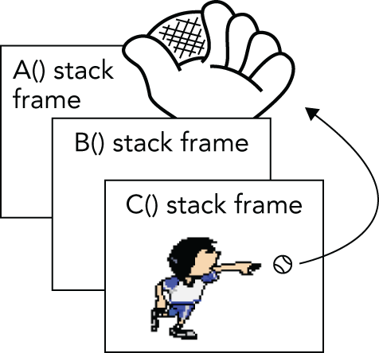
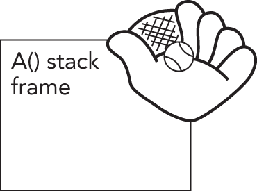

:::tip[WHAT'S IN THIS CHAPTER?]
- How to handle errors in C++, including pros and cons of exceptions
- The syntax of exceptions
- Exception class hierarchies and handling exceptions polymorphically
- How to rethrow caught exceptions
- Stack unwinding and cleanup
- How to embed, inside a custom exception, the exact source code location where an exception occurred
- How to embed the entire stack trace, also known as call stack, in a custom exception
- Common error-handling situations
:::

:::tip[WILEY.COM DOWNLOADS FOR THIS CHAPTER]
Please note that all the code examples for this chapter are available as part of this chapter's code download on the book's website at `www.wiley.com/go/proc++6e` on the Download Code tab.
:::

Inevitably, your C++ programs will encounter errors during execution. The program might be unable to open a file, the network connection might go down, or the user might enter an incorrect value, to name a few possibilities. The C++ language provides a feature called *exceptions* to handle these *exceptional* but not *unexpected* situations.

Most code examples in this book so far have generally ignored error conditions for brevity. This chapter rectifies that simplification by teaching you how to incorporate error handling into your programs from their beginnings. It focuses on C++ exceptions, including the details of their syntax, and describes how to employ them effectively to create well-designed error-handling programs.

The chapter also discusses how you can write your own exception classes. This includes discussing how to automatically embed both, the exact location in your source code where an exception occurred, as well as the full stack trace at the moment the exception was raised. Both of these help tremendously in diagnosing any errors.

## ERRORS AND EXCEPTIONS

No program exists in isolation; they all depend on external facilities such as interfaces with the operating system, networks and file systems, external code such as third-party libraries, and user input. Each of these areas can introduce situations that require you to respond to problems your program may encounter. These potential problems can be referred to with the general term *exceptional situations*. Even perfectly written programs encounter errors and exceptional situations. Thus, anyone who writes professional computer programs must include error-handling capabilities. Some languages, such as C, do not include many specific language facilities for error handling. Programmers using these languages generally rely on return values from functions and other ad hoc approaches. Other languages, such as Java, enforce the use of a language feature called *exceptions* as an error-handling mechanism. C++ lies between these extremes. It provides language support for exceptions but does not require their use. However, you can't ignore exceptions entirely in C++ because a few basic facilities, such as memory allocation routines, use them by default, and several classes from the Standard Library use exceptions as well.

### What Are Exceptions, Anyway?

*Exceptions* are a mechanism for a piece of code to notify another piece of code of an “exceptional” situation or error condition without progressing through the normal code paths. The code that encounters the error *throws* the exception, and the code that handles the exception *catches* it. Exceptions do not follow the fundamental rule of step-by-step execution to which you are accustomed. When a piece of code throws an exception, the program control immediately stops executing code step-by-step and transitions to the exception handler, which could be anywhere from the next line in the same function to several function calls up the stack. If you like sports analogies, you can think of the code that throws an exception as an outfielder throwing a baseball back to the infield, where the nearest infielder (closest exception handler) catches it. [Figure 14.1](#c14-fig-0001) shows a hypothetical stack of three function calls. Function `A()` has the exception handler. It calls function `B()`, which calls function `C()`, which throws the exception.

 


[^FIGURE 14.1]

[Figure 14.2](#c14-fig-0002) shows the handler catching the exception. The stack frames for `C()` and `B()` have been removed, leaving only `A()`.

 


[^FIGURE 14.2]

Most modern programming languages, such as C# and Java, have support for exceptions, so it's no surprise that C++ has full-fledged support for them as well. However, if you are coming from C, then exceptions are something new; but once you get used to them, you probably don't want to go back.

### Why Exceptions in C++ Are a Good Thing

As mentioned earlier, run-time errors in programs are inevitable. Despite that fact, error handling in most C and C++ programs is messy and ad hoc. The de facto C error-handling standard, which was carried over into many C++ programs, uses integer function return codes, and the `errno` macro to signify errors. Each thread has its own `errno` value. `errno` acts as a thread-local integer variable that functions can use to communicate errors back to calling functions.

Unfortunately, the integer return codes and `errno` are used inconsistently. Some functions might choose to return 0 for success and -1 for an error. If they return -1, they also set `errno` to an error code. Other functions return 0 for success and nonzero for an error, with the actual return value specifying the error code. These functions do not use `errno`. Still others return 0 for failure instead of for success, presumably because 0 always evaluates to `false` in C and C++.

These inconsistencies can cause problems because programmers encountering a new function often assume that its return codes are the same as other similar functions. That is not always true. For example, on the Solaris 11 operating system, there are two different libraries of synchronization objects: the Portable Operating System Interface (POSIX) version and the Solaris version. The function to initialize a semaphore in the POSIX version is called `sem_init()`, and the function to initialize a semaphore in the Solaris version is called `sema_init()`. As if that weren't confusing enough, the two functions handle error codes differently! `sem_init()` returns -1 and sets `errno` on error, while `sema_init()` returns the error code directly as a positive integer and does not set `errno`.

Another problem is that the return type of functions in C++ can be of only one type, so if you need to return both an error and a value, you must find an alternative mechanism. One solution is to return an `std::pair` or `tuple`, an object that you can use to store two or more types. The `pair` class is introduced in [Chapter 1](../c01), “A Crash Course in C++ and the Standard Library,” while `tuple` is discussed in the upcoming chapters that cover the Standard Library. Starting with C++23, you can return an `std::expected` from a function, which can contain either the result of the function or an error if something went wrong. [Chapter 24](../c24), “Additional Vocabulary Types,” discusses `expected` in detail. Another choice is to define your own struct or class that contains several values and return an instance of that struct or class from your function. Yet another option is to return the value or error through a reference parameter or to make the error code one possible value of the return type, such as a `nullptr` pointer. In all these solutions, the caller is responsible for explicitly checking for any errors returned from the function, and if it doesn't handle the error itself, it should propagate the error to its caller. Unfortunately, this often results in the loss of critical details about the error.

C programmers may be familiar with a mechanism known as `setjmp()/longjmp()`. This mechanism cannot be used correctly in C++, because it bypasses scoped destructors on the stack. You should avoid it at all costs, even in C programs; therefore, this book does not explain the details of how to use it.

Exceptions provide an easier, more consistent, and safer mechanism for error handling. There are several specific advantages of exceptions over the ad hoc approaches in C and C++:

- When return codes are used as an error reporting mechanism, you might forget to check the return code and properly handle it either locally or by propagating it upward. The `[[nodiscard]]` attribute, introduced in [Chapter 1](../c01), offers a possible solution to prevent return codes from being ignored, but it's not foolproof either. Exceptions cannot be forgotten or ignored: if your program fails to catch an exception, it terminates.
- When integer return codes are used, they generally do not contain sufficient information. You can use exceptions to pass as much information as you want from the code that finds the error to the code that handles it. Exceptions can also be used to communicate information other than errors, though many developers, including myself, consider that an abuse of the exception mechanism.
- Exception handling can skip levels of the call stack. That is, a function can handle an error that occurred several function calls down the stack, without error-handling code in the intermediate functions. Return codes require each level of the call stack to clean up explicitly after the previous level and to explicitly propagate the error code.

In some compilers in the past, exception handling added a tiny amount of overhead to any function that had an exception handler. For most modern compilers there is a trade-off in that there is almost no, or even zero, overhead in the non-throwing case, and only some slight overhead when you actually throw something. This trade-off is not a bad thing. Exceptions should not be used for controlling the standard execution flow of a program, such as returning a value from a function. Exceptions should be used only to handle exceptional events that are generally not encountered in normal program use, for example, a failure while reading from a file on disk. All this means that using exceptions actually results in faster code for the non-error case compared to an implementation using error return codes.

Exception handling is not enforced in C++. In Java, for example, it is enforced. A Java function that does not specify a list of exceptions that it can possibly throw is not allowed to throw any exceptions. In C++, it is just the opposite: a function can throw any exception it wants, unless it specifies that it will not throw any exceptions using the `noexcept` keyword, which is discussed later in this chapter!

### Recommendation

I recommend exceptions as a useful mechanism for error handling. I feel that the structure and error-handling formalization that exceptions provide outweigh the less desirable aspects. Thus, the remainder of this chapter focuses on exceptions. Also, many popular libraries, such as the Standard Library and Boost, use exceptions, so you need to be prepared to handle them.

## EXCEPTION MECHANICS

Exceptional situations arise frequently in file input and output. The following is a function to open a file, read a list of integers from the file, and return the integers in an `std::vector` data structure. The lack of error handling should jump out at you:

```cpp
vector<int> readIntegerFile(const string& filename)
{
    ifstream inputStream { filename };
    // Read the integers one-by-one and add them to a vector.
    vector<int> integers;
    int temp;
    while (inputStream >> temp) {
        integers.push_back(temp);
    }
    return integers;
}
```

The following line keeps reading values from the `ifstream` until the end of the file is reached or until an error occurs:

```cpp
while (inputStream>> temp) {
```

If the `>>` operator encounters an error, it sets the fail bit of the `ifstream` object. In that case, the `bool()` conversion operator returns `false`, and the `while` loop terminates. Streams are discussed in more detail in [Chapter 13](../c13), “Demystifying C++ I/O.”

You might use `readIntegerFile()` like this:

```cpp
const string filename { "IntegerFile.txt" };
vector<int> myInts { readIntegerFile(filename) };
println("{} ", myInts);
```

The rest of this section shows how to add error handling with exceptions, but first, we need to delve a bit deeper into how you throw and catch exceptions.

### Throwing and Catching Exceptions

Using exceptions consists of providing two parts in your program: a `try/catch` construct to handle an exception, and a `throw` statement that throws an exception. Both must be present in some form to make exceptions work. However, in many cases, the `throw` happens deep inside some library (including the C++ runtime), and the programmer never sees it, but still has to react to it using a `try/catch` construct.

The `try/catch` construct looks like this:

```cpp
try {
    // … code which may result in an exception being thrown
} catch (exception-type1 exception-name) {
    // … code which responds to the exception of type 1
} catch (exception-type2 exception-name) {
    // … code which responds to the exception of type 2
}
// … remaining code
```

The code that may result in an exception being thrown might contain a `throw` directly. It might also be calling a function that either directly throws an exception or calls—by some unknown number of layers of calls—a function that throws an exception.

If no exception is thrown, no code from any `catch` block is executed, and the “remaining code” that follows will follow the last statement executed in the `try` block.

If an exception is thrown, any code following the `throw` or following the call that resulted in the `throw` is not executed; instead, control immediately goes to the right `catch` block, depending on the type of the exception that is thrown.

If the `catch` block does not do a control transfer—for example, by returning from the function, throwing a new exception, or rethrowing the caught exception—then the “remaining code” is executed after the last statement of that `catch` block.

The simplest example to demonstrate exception handling is avoiding division-by-zero. The following example throws an exception of type `std::invalid_argument`, defined in `<stdexcept>`:

```cpp
double safeDivide(double num, double den)
{
    if (den == 0) { throw invalid_argument { "Divide by zero" }; }
    return num / den;
}
 
int main()
{
    try {
        println("{}", safeDivide(5, 2));
        println("{}", safeDivide(10, 0));
        println("{}", safeDivide(3, 3));
    } catch (const invalid_argument& e) {
        println("Caught exception: {}", e.what());
    }
}
```

The output is as follows:

```
2.5
Caught exception: Divide by zero
```

`throw` is a keyword in C++ and is the only way to throw an exception. In the code snippet we throw a new instance of `invalid_argument`. It is one of the standard exceptions provided by the C++ Standard Library. All Standard Library exceptions form a hierarchy, which is discussed later in this chapter. Each class in the hierarchy supports a `what()` member function that returns a `const char*` string describing the exception. This is the string you provide in the constructor of the exception.

:::note
Even though the return type of `what()` is `const char`, exceptions can support Unicode strings if you encode them using UTF-8. See [Chapter 21](../c21), “String Localization and Regular Expressions,” for details on Unicode strings.\*
:::

Let's go back to the `readIntegerFile()` function. The most likely problem to occur is for the file open to fail. That's a perfect situation for throwing an exception. The following code throws an exception of type `std::exception`, defined in `<exception>`, if the file fails to open:

```cpp
vector<int> readIntegerFile(const string& filename)
{
    ifstream inputStream { filename };
    if (inputStream.fail()) {
        // We failed to open the file: throw an exception.
        throw exception {};
    }
 
    // Read the integers one-by-one and add them to a vector.
    vector<int> integers;
    int temp;
    while (inputStream >> temp) {
        integers.push_back(temp);
    }
    return integers;
}
```

:::note
Always document the possible exceptions a function can throw in its code documentation, because users of the function need to know which exceptions might get thrown so they can properly handle them.
:::

If the function fails to open the file and executes the `throw exception{};` statement, the rest of the function is skipped, and control transitions to the nearest exception handler.

Throwing exceptions in your code is most useful when you also write code that handles them. Exception handling is a way to “try” a block of code, with another block of code designated to react to any problems that might occur. In the following `main()` function, the `catch` statement reacts to any exception of type `exception` that was thrown within the `try` block by printing an error message. If a `try` block finishes without throwing an exception, the `catch` blocks are skipped. You can think of `try`/`catch` blocks as glorified `if` statements: *if* an exception is thrown in the `try` block, *then* execute a `catch` block, *else* skip all `catch` blocks.

```cpp
int main()
{
    const string filename { "IntegerFile.txt" };
    vector<int> myInts;
    try {
        myInts = readIntegerFile(filename);
    } catch (const exception& e) {
        println(cerr, "Unable to open file {}", filename);
        return 1;
    }
    println("{} ", myInts);
}
```

:::note
Although by default streams do not throw exceptions, you can tell the streams to throw exceptions for error conditions by calling their `exceptions()` member function. However, most compilers give useless information in the stream exceptions they throw. For such compilers, it might be better to deal with the stream state directly instead of using exceptions. This book does not use stream exceptions.
:::

### Exception Types

You can throw an exception of any type. The earlier example throws an object of type `std::exception`, but exceptions do not need to be objects. You could throw a simple `int` like this:

```cpp
vector<int> readIntegerFile(const string& filename)
{
    ifstream inputStream { filename };
    if (inputStream.fail()) {
        // We failed to open the file: throw an exception.
        throw 5;
    }
    // Omitted for brevity
}
```

You would then need to change the `catch` statement as follows:

```cpp
try {
    myInts = readIntegerFile(filename);
} catch (int e) {
    println(cerr, "Unable to open file {} (Error Code {})", filename, e);
    return 1;
}
```

Alternatively, you could throw a `const char*` C-style string. This technique is sometimes useful because the string can contain information about the exception:

```cpp
vector<int> readIntegerFile(const string& filename)
{
    ifstream inputStream { filename };
    if (inputStream.fail()) {
        // We failed to open the file: throw an exception.
        throw "Unable to open file";
    }
    // Omitted for brevity
}
```

When you catch the `const char*` exception, you can print the result as follows:

```cpp
try {
    myInts = readIntegerFile(filename);
} catch (const char* e) {
    println(cerr, "{}", e);
    return 1;
}
```

Despite the previous examples, keep the following in mind:

# NOTE

*You should generally throw objects rather than other data types as exceptions for two reasons:*

- *Objects convey information by their class name.*
- *Objects can store all kinds of information, including strings that describe the exception.*

The C++ Standard Library defines a number of predefined exception classes structured in a class hierarchy, discussed later in this chapter. Additionally, you can write your own exception classes and fit them in the standard hierarchy, as you'll also learn later in this chapter.

### Catching Exception Objects as Reference-to-const

In the earlier example in which `readIntegerFile()` throws an object of type `exception`, the `catch` handler looks like this:

```cpp
} catch (const exception& e) {
```

However, there is no requirement to catch objects as reference-to-`const`. You could catch the object by value like this:

```cpp
} catch (exception e) {
```

Alternatively, you could catch the object as reference-to-non-`const`:

```cpp
} catch (exception& e) {
```

Also, as you saw in the `const char*` example earlier, you can catch pointers to exceptions, as long as pointers to exceptions are thrown.

Still, I recommend sticking with the following advice:

:::note
Always throw objects as exceptions, and always catch exception objects as reference-to-`const`! This avoids object slicing (see [Chapter 10](../c10), “Discovering Inheritance Techniques”), which could happen when you catch exception objects by value. Capturing by reference-to-non-`const` is not recommended either, as caught exceptions are normally never modified.
:::

### Throwing and Catching Multiple Exceptions

Failure to open the file is not the only problem `readIntegerFile()` could encounter. Reading the data from the file can cause an error if it is formatted incorrectly. Here is an implementation of `readIntegerFile()` that throws an exception if it cannot either open the file or read the data correctly. This time, it uses a `runtime_error`, derived from `exception` and which allows you to specify a descriptive string in its constructor. The `runtime_error` exception class is defined in `<stdexcept>`.

```cpp
vector<int> readIntegerFile(const string& filename)
{
    ifstream inputStream { filename };
    if (inputStream.fail()) {       // We failed to open the file: throw an exception.
        throw runtime_error { "Unable to open the file." };
    }
 
    // Read the integers one-by-one and add them to a vector.
    vector<int> integers;
    int temp;
    while (inputStream >> temp) {
        integers.push_back(temp);
    }
 
    if (!inputStream.eof()) {
        // We did not reach the end-of-file.
        // This means that some error occurred while reading the file.
        // Throw an exception.
        throw runtime_error { "Error reading the file." };
    }
 
    return integers;
}
```

Your code in `main()` does not need to change much because it already catches an exception of type `exception`, from which `runtime_error` derives. However, that exception could now be thrown in two different situations, so we use the `what()` member function to get a proper description of the caught exception:

```cpp
try {
    myInts = readIntegerFile(filename);
} catch (const exception& e) {
    println(cerr, "{}", e.what());
    return 1;
}
```

Alternatively, you could throw two different types of exceptions from `readIntegerFile()`. Here is an implementation of `readIntegerFile()` that throws an exception object of class `invalid_argument` if the file cannot be opened, and an object of class `runtime_error` if the integers cannot be read. Both `invalid_argument` and `runtime_error` are classes defined in `<stdexcept>` as part of the C++ Standard Library.

```cpp
vector<int> readIntegerFile(const string& filename)
{
    ifstream inputStream { filename };
    if (inputStream.fail()) {
        // We failed to open the file: throw an exception.
        throw invalid_argument { "Unable to open the file." };
    }
 
    // Read the integers one-by-one and add them to a vector.
    vector<int> integers;
    int temp;
    while (inputStream >> temp) {
        integers.push_back(temp);
    }
 
    if (!inputStream.eof()) {
        // We did not reach the end-of-file.
        // This means that some error occurred while reading the file.
        // Throw an exception.
        throw runtime_error { "Error reading the file." };
    }
 
    return integers;
}
```

There are no public default constructors for `invalid_argument` and `runtime_error`, only `string` constructors, so you always must pass a string as argument.

Now, `main()` can catch both `invalid_argument` and `runtime_error` exceptions with two `catch` statements:

```cpp
try {
    myInts = readIntegerFile(filename);
} catch (const invalid_argument& e) {
    println(cerr, "{}", e.what());
    return 1;
} catch (const runtime_error& e) {
    println(cerr, "{}", e.what());
    return 2;
}
```

If an exception is thrown inside the `try` block, the compiler matches the type of the exception to the proper `catch` handler. So, if `readIntegerFile()` is unable to open the file and throws an `invalid_argument` object, it is caught by the first `catch` statement. If `readIntegerFile()` is unable to read the file properly and throws a `runtime_error`, then the second `catch` statement catches the exception.

#### Matching and const

The `const`-ness specified in the type of the exception you want to catch makes no difference for matching purposes. That is, this line matches any exception of type `runtime_error`:

```cpp
} catch (const runtime_error& e) {
```

The following line also matches any exception of type `runtime_error`:

```cpp
} catch (runtime_error& e) {
```

Still, it's advised to always catch exception objects as reference-to-`const`.

#### Matching Any Exception

You can write a `catch`-all block that matches any possible exception with the special syntax shown in the following example:

```cpp
try {
    myInts = readIntegerFile(filename);
} catch (…) {
    println(cerr, "Error reading or opening file {}", filename);
    return 1;
}
```

The three dots are not a typo. They are a wildcard that matches any exception type. The downside of using a `catch`-all block is that you don't get any details of the caught exception. When you are calling poorly documented code, this technique could be useful to ensure that you catch all possible exceptions. But even then, what would you possibly be able to do to recover from an unknown exception?

One useful use case of a `catch`-all block is to log that an exception was thrown and then rethrow the exception. The following example shows how you can write `catch` handlers that explicitly handle `invalid_argument` and `runtime_error` exceptions, as well as how to include a `catch`-all handler for all other exceptions. In any `catch` block, you can rethrow the currently caught exception using just the `throw` keyword without any arguments. There is more to say about rethrowing exceptions, but that has to wait until later in this chapter.

```cpp
try {
    // Code that can throw exceptions.
} catch (const invalid_argument& e) {
    // Handle invalid_argument exception.
} catch (const runtime_error& e) {
    // Handle runtime_error exception.
} catch (…) {
    // Handle all other exceptions.
    // Log that an exception occurred…
    throw; // Rethrow the caught exception.
}
```

In situations where you have complete information about the set of thrown exceptions, a `catch`-all block is not recommended because it handles every exception type identically. It's better to match exception types explicitly and take appropriate, targeted actions.

### Uncaught Exceptions

If your program throws an exception that is not caught anywhere, the program terminates. Basically, there is a `try/catch` construct around the call to your `main()` function, which catches all unhandled exceptions and behaves like the following pseudocode:

```cpp
try {
    main(argc, argv);
} catch (…) {
    // Issue error message and terminate program.
}
// Normal termination code.
```

However, this behavior is usually not what you want. The point of exceptions is to give your program a chance to handle and correct undesirable or unexpected situations.

:::warning
You should catch and handle all exceptions thrown in your programs, as far as possible.
:::

It is also possible to change the behavior of your program if there is an uncaught exception. When the program encounters an uncaught exception, it calls the built-in `terminate()` function, which calls `abort()` from `<cstdlib>` to kill the program. You can set your own `terminate_handler` by calling `set_terminate()` with a pointer to a function that takes no arguments and returns no value. `terminate()`, `set_terminate()`, and `terminate_handler` are all declared in `<exception>`. The following pseudocode shows a high-level overview of how it works:

```cpp
try {
    main(argc, argv);
} catch (…) {
    if (terminate_handler != nullptr) {
        terminate_handler();
    } else {
        terminate();
    }
}
// Normal termination code.
```

Before you get too excited about this feature, you should know that your callback function must still terminate the program using either `abort()` or `_Exit()`. It can't just ignore the error. Both `abort()` and _`Exit()` are defined in `<cstdlib>` and terminate the application without cleaning up resources. For example, destructors of objects won't get called. The `_Exit()` function accepts an integer argument that is returned to the operating system and can be used to determine how a process exited. A value of `0` or `EXIT_SUCCESS` means the program exited without any error; otherwise, the program terminated abnormally. The `abort()` function does not accept any arguments. Additionally, there is an `exit()` function that also accepts an integer that is returned to the operating system and that does clean up resources by calling destructors, but it's not recommended to call `exit()` from a `terminate_handler`.

A `terminate_handler` can be used to print a helpful error message before exiting. Here is an example of a `main()` function that doesn't catch the exceptions thrown by `readIntegerFile()`. Instead, it sets the `terminate_handler` to a custom callback. This callback prints an error message and terminates the process by calling `_Exit()`. Note the use of the `[[noreturn]]` attribute, introduced in [Chapter 1](../c01).

```cpp
[[noreturn]] void myTerminate()
{
    println(cerr, "Uncaught exception!");
    _Exit(1);
}
 
int main()
{
    set_terminate(myTerminate);
 
    const string filename { "IntegerFile.txt" };
    vector<int> myInts { readIntegerFile(filename) };
    println("{} ", myInts);
}
```

Although not shown in this example, `set_terminate()` returns the old `terminate_handler` when it sets the new one. The `terminate_handler` applies program-wide, so it's considered good style to restore the old `terminate_handler` when you have completed the code that needed the new `terminate_handler`. In this case, the entire program needs the new `terminate_handler`, so there's no point in restoring it.

While it's important to know about `set_terminate()`, it's not an effective exception-handling approach. It's recommended to catch and handle each exception individually to provide more precise error handling.

:::note
In professionally written software, a `terminate_handler` is usually set up to create a crash dump before terminating the process. A crash dump usually contains information such as the call stack and local variables at the time the uncaught exception was thrown. Such a crash dump can then be loaded into a debugger and allows you to figure out what the uncaught exception was and what caused it. However, writing crash dumps is platform dependent and therefore not further discussed in this book.
:::

### noexcept Specifier

By default, a function is allowed to throw any exception it likes. However, it is possible to mark a function with the `noexcept` specifier, a C++ keyword, to state that it will not throw any exceptions. For example, the following function is marked as `noexcept`, so it is not allowed to throw any exceptions:

```cpp
void printValues(const vector<int>& values) noexcept;
```

:::note
A function marked with `noexcept` must not throw any exceptions.
:::

When a function marked as `noexcept` throws an exception anyway, C++ calls `terminate()` to terminate the application.

When you override a `virtual` member function in a derived class, you are allowed to mark the overridden member function as `noexcept`, even if the version in the base class is not `noexcept`. The opposite is not allowed.

### noexcept(expression) Specifier

The `noexcept(expression)` specifier marks a function as `noexcept` if and only if the given expression returns `true`. In other words, `noexcept` equals `noexcept(true)`, and `noexcept(false)` is the opposite of `noexcept(true)`; that is, a member function marked with `noexcept(false)` can throw any exception it wants, which is the default.

### noexcept(expression) Operator

The `noexcept(expression)` operator returns `true` if the given expression is `noexcept`. This evaluation happens at compile time.

Here's an example:

```cpp
void f1() noexcept {}
void f2() noexcept(false) {}
void f3() noexcept(noexcept(f1())) {}
void f4() noexcept(noexcept(f2())) {}
 
int main()
{
    println("{} {} {} {}", noexcept(f1()),
                           noexcept(f2()),
                           noexcept(f3()),
                           noexcept(f4()));
}
```

The output of this code snippet is `true false true false`:

- `noexcept(f1())` is `true` because `f1()` is explicitly marked with a `noexcept` specifier.
- `noexcept(f2())` is `false` because `f2()` is explicitly marked as such using a `noexcept(expression)` specifier.
- `noexcept(f3())` is `true` because `f3()` is marked as `noexcept` but only if `f1()` is `noexcept` which it is.
- `noexcept(f4())` is `false` because `f4()` is marked as `noexcept` but only if `f2()` is `noexcept` which it isn't.

### Throw Lists

Older versions of C++ allowed you to specify the exceptions a function intended to throw. This specification was called the *throw list* or the *exception specification*.

:::warning
C++11 has deprecated, and C++17 has removed support for exception specifications, apart from `noexcept` and `throw()`. The latter was equivalent to `noexcept`. Since C++20, support for `throw()` has been removed as well.
:::

Because C++17 has officially removed support for exception specifications, this book does not further discuss them.

## EXCEPTIONS AND POLYMORPHISM

As described earlier, you can actually throw any type of exception. However, classes are the most useful types of exceptions. In fact, exception classes are usually written in a hierarchy so that you can employ polymorphism when you catch the exceptions.

### The Standard Exception Hierarchy

You've already seen several exceptions from the C++ standard exception hierarchy: `exception`, `runtime_error`, and `invalid_argument`. [Figure 14.3](#c14-fig-0003) shows the full hierarchy. For completeness, all standard exceptions are shown, including those thrown by parts of the Standard Library that are discussed in later chapters.

 


[^FIGURE 14.3]

All of the exceptions thrown by the C++ Standard Library are objects of classes in this hierarchy. Each class in the hierarchy supports a `what()` member function that returns a `const char*` string describing the exception. You can use this string in an error message.

Some of the exception classes require you to set in the constructor the string that is returned by `what()`. That's why you have to specify a string in the constructors for `runtime_error` and `invalid_argument`. This has already been done in examples throughout this chapter. Here is another version of `readIntegerFile()` that includes the filename in the error message:

```cpp
vector<int> readIntegerFile(const string& filename)
{
    ifstream inputStream { filename };
    if (inputStream.fail()) {
        // We failed to open the file: throw an exception.
        const string error { format("Unable to open file {}.", filename) };
        throw invalid_argument { error };
    }
 
    // Read the integers one-by-one and add them to a vector.
    vector<int> integers;
    int temp;
    while (inputStream >> temp) {
        integers.push_back(temp);
    }
 
    if (!inputStream.eof()) {
        // We did not reach the end-of-file.
        // This means that some error occurred while reading the file.
        // Throw an exception.
        const string error { format("Unable to read file {}.", filename) };
        throw runtime_error { error };
    }
 
    return integers;
}
```

### Catching Exceptions in a Class Hierarchy

A feature of exception hierarchies is that you can catch exceptions polymorphically. For example, if you look at the following two `catch` statements, you can see that they are identical except for the exception class that they handle:

```cpp
try {
    myInts = readIntegerFile(filename);
} catch (const invalid_argument& e) {
    println(cerr, "{}", e.what());
    return 1;
} catch (const runtime_error& e) {
    println(cerr, "{}", e.what());
    return 1;
}
```

Conveniently, `invalid_argument` and `runtime_error` are both derived classes of `exception`, so you can replace the two `catch` statements with a single `catch` statement for `exception`:

```cpp
try {
    myInts = readIntegerFile(filename);
} catch (const exception& e) {
    println(cerr, "{}", e.what());
    return 1;
}
```

The `catch` statement for an `exception` reference matches any derived classes of `exception`, including both `invalid_argument` and `runtime_error`. Note that the higher in the exception hierarchy you catch exceptions, the less specific your error handling can be. You should generally catch exceptions at as specific a level as possible.

:::warning
When you catch exceptions polymorphically, make sure to catch them by reference! If you catch exceptions by value, you can encounter slicing, in which case you lose information from the object. See [Chapter 10](../c10) for details on slicing.
:::

When more than one `catch` clause is used, the `catch` clauses are matched in syntactic order as they appear in your code; the first one that matches wins. If one `catch` is more inclusive than a later one, it will match first, and the more restrictive one, which comes later, will never be executed. Therefore, you should place your `catch` clauses from most restrictive to least restrictive in order. For example, suppose that you want to catch `invalid_argument` from `readIntegerFile()` explicitly, but you also want to leave the generic `exception` handler for any other exceptions. The correct way to do so is like this:

```cpp
try {
    myInts = readIntegerFile(filename);
} catch (const invalid_argument& e) { // List the derived class first.
    // Take some special action for invalid filenames.
} catch (const exception& e) { // Now list exception.
    println(cerr, "{}", e.what());
    return 1;
}
```

The first `catch` statement catches `invalid_argument` exceptions, and the second catches any other exceptions of type `exception`. However, if you reverse the order of the `catch` statements, you don't get the same result:

```cpp
try {
    myInts = readIntegerFile(filename);
} catch (const exception& e) { // BUG: catching base class first!
    println(cerr, "{}", e.what());
    return 1;
} catch (const invalid_argument& e) {
    // Take some special action for invalid filenames.
}
```

With this order, any exception of a class that derives from `exception` is caught by the first `catch` statement; the second `catch` will never be reached. Some compilers issue a warning in this case, but you shouldn't count on it.

### Writing Your Own Exception Classes

There are two advantages to writing your own exception classes:

- The number of exceptions in the C++ Standard Library is limited. Instead of using an exception class with a generic name, such as `runtime_error`, you can create classes with names that are more meaningful for the particular errors in your program.
- You can add your own information to these exceptions. Most exceptions in the standard hierarchy allow you to set only an error string. You might want to pass different information in the exception.

It's recommended that all the exception classes that you write inherit directly or indirectly from the standard `exception` class. If everyone on your project follows that rule, you know that every exception in the program will be derived from `exception` (assuming that you aren't using third-party libraries that break this rule). This guideline makes exception handling via polymorphism significantly easier.

Let's look at an example. `invalid_argument` and `runtime_error` don't do a good job at capturing the file opening and reading errors in `readIntegerFile()`. You can define your own error hierarchy for file errors, starting with a generic `FileError` class:

```cpp
class FileError : public exception
{
    public:
        explicit FileError(string filename) : m_filename { move(filename) } {}
        const char* what() const noexcept override { return m_message.c_str(); }
        virtual const string& getFilename() const noexcept { return m_filename; }
    protected:
        virtual void setMessage(string message) { m_message = move(message); }
    private:
        string m_filename;
        string m_message;
};
```

As a good programming citizen, you make `FileError` a part of the standard exception hierarchy. It seems appropriate to integrate it as a child of `exception`. When you derive from `exception`, you can override the `what()` member function, which has the prototype shown and which must return a `const char*` string that is valid until the object is destroyed. In the case of `FileError`, this string comes from the `m_message` data member. Derived classes of `FileError` can set the message using the `protected setMessage()` member function. The generic `FileError` class also contains a filename and a public accessor for that filename.

The first exceptional situation in `readIntegerFile()` occurs when the file cannot be opened. Thus, you might want to write a `FileOpenError` exception derived from `FileError`:

```cpp
class FileOpenError : public FileError
{
    public:
        explicit FileOpenError(string filename) : FileError { move(filename) }
        {
            setMessage(format("Unable to open {}.", getFilename()));
        }
};
```

The `FileOpenError` exception calls `setMessage()` to change the `m_message` string to represent the file-opening error. Note that in the body of the constructor, `getFilename()` is used to get the filename. The `filename` parameter cannot be used for this as the ctor-initializer has moved `filename` in the call to the `FileError` constructor. As you know, after a move operation, you shouldn't use an object any longer.

The second exceptional situation in `readIntegerFile()` occurs if the file cannot be read properly. It might be useful for this exception to include the line number where the error occurred, as well as the filename in the error message string returned from `what()`. Here is a `FileReadError` exception derived from `FileError`:

```cpp
class FileReadError : public FileError
{
    public:
        explicit FileReadError(string filename, size_t lineNumber)
            : FileError { move(filename) }, m_lineNumber { lineNumber }
        {
            setMessage(format("Error reading {}, line {}.",
                getFilename(), lineNumber));
        }
 
        virtual size_t getLineNumber() const noexcept { return m_lineNumber; }
    private:
        size_t m_lineNumber { 0 };
};
```

Of course, to set the line number properly, `readIntegerFile()` needs to be modified to track the number of lines read instead of just reading integers directly. Here is a new `readIntegerFile()` function that uses the new exceptions:

```cpp
vector<int> readIntegerFile(const string& filename)
{
    ifstream inputStream { filename };
    if (inputStream.fail()) {
        // We failed to open the file: throw an exception.
        throw FileOpenError { filename };
    }
 
    vector<int> integers;
    size_t lineNumber { 0 };
    while (!inputStream.eof()) {
        // Read one line from the file.
        string line;
        getline(inputStream, line);
        ++lineNumber;
 
        // Create a string stream out of the line.
        istringstream lineStream { line };
 
        // Read the integers one-by-one and add them to the vector.
        int temp;
        while (lineStream >> temp) {
            integers.push_back(temp);
        }
 
        if (!lineStream.eof()) {
            // We did not reach the end of the string stream.
            // This means that some error occurred while reading this line.
            // Throw an exception.
            throw FileReadError { filename, lineNumber };
        }
    }
 
    return integers;
}
```

Now, code that calls `readIntegerFile()` can use polymorphism to catch exceptions of type `FileError` like this:

```cpp
try {
    myInts = readIntegerFile(filename);
} catch (const FileError& e) {
    println(cerr, "{}", e.what());
    return 1;
}
```

There is one caveat when writing classes whose objects will be used as exceptions. When a piece of code throws an exception, the object or value thrown is moved or copied, using either the move constructor or the copy constructor. Thus, if you write a class whose objects will be thrown as exceptions, you must make sure those objects are copyable and/or moveable. This means that if you have dynamically allocated memory in your exception class, your class must have a destructor, but also a copy constructor and copy assignment operator and/or a move constructor and move assignment operator, see [Chapter 9](../c09), “Mastering Classes and Objects.”

:::warning
Objects thrown as exceptions are always moved or copied at least once.
:::

It is possible for exceptions to be copied more than once, but only if you catch the exception by value instead of by reference.

:::note
Catch exception objects by reference (preferably reference-to-`const`) to avoid unnecessary copying.
:::

### Nested Exceptions

It could happen that during handling of a first exception, a second exceptional situation is triggered that requires a second exception to be thrown. Unfortunately, when you throw the second exception, all information about the first exception that you are currently trying to handle will be lost. The solution provided by C++ for this problem is called *nested exceptions*, which allow you to nest a caught exception in the context of a new exception. This can also be useful if you call a function in a third-party library that throws an exception of a certain type, `A`, but you only want exceptions of another type, `B`, in your code. In such a case, you catch all exceptions from the library and nest them in an exception of type `B`.

You use `std::throw_with_nested()` to throw an exception with another exception nested inside it. A catch handler for this new exception can use a `dynamic_cast()` to get access to the `std::nested_exception` representing the first exception. The upcoming example demonstrates this. It first defines a `MyException` class, which derives from `exception` and accepts a string in its constructor:

```cpp
class MyException : public exception
{
    public:
        explicit MyException(string message) : m_message { move(message) } {}
        const char* what() const noexcept override { return m_message.c_str(); }
    private:
        string m_message;
};
```

The following `doSomething()` function throws a `runtime_error` that is immediately caught in a catch handler. The catch handler writes a message and then uses the `throw_with_nested()` function to throw a second exception that has the first one nested inside it. Note that nesting the exception happens automatically:

```cpp
void doSomething()
{
    try {
        throw runtime_error { "A runtime_error exception" };
    } catch (const runtime_error& e) {
        println("doSomething() caught a runtime_error"); 
        println("doSomething() throwing MyException"); 
        throw_with_nested(
            MyException { "MyException with nested runtime_error" });
    }
}
```

`throw_with_nested()` works by throwing an unnamed new compiler-generated type that derives from both `nested_exception` and, in this example, from `MyException`. Hence, it's another example of useful multiple inheritance in C++. The default constructor of the `nested_exception` base class automatically captures the exception currently being handled by calling `std::current_exception()` and stores it in an `std::exception_ptr`. An `exception_ptr` is a pointer-like type capable of storing either a null pointer or a pointer to an exception object that was thrown and captured with `current_exception()`. Instances of `exception_ptr` can be passed to functions (usually by value) and across different threads.

Finally, the following code snippet demonstrates how to handle an exception with a nested exception. The code calls `doSomething()` and has one catch handler for exceptions of type `MyException`. When it catches such an exception, it writes a message and then uses a `dynamic_cast()` to get access to the nested exception. If there is no nested exception inside, the result will be a null pointer. If there is a nested exception inside, the `rethrow_nested()` member function on the `nested_exception` is called. This causes the nested exception to be rethrown, which you can then catch in another `try/catch` block.

```cpp
try {
    doSomething();
} catch (const MyException& e) {
    println("main() caught MyException: {}", e.what()); 
 
    const auto* nested { dynamic_cast<const nested_exception*>(&e) };
    if (nested) {
        try {
            nested->rethrow_nested();
        } catch (const runtime_error& e) {
            // Handle nested exception.
            println("  Nested exception: {}", e.what());
        }
    }
}
```

The output is as follows:

```cpp
doSomething() caught a runtime_error
doSomething() throwing MyException
main() caught MyException: MyException with nested runtime_error
  Nested exception: A runtime_error exception
```

This code uses a `dynamic_cast()` to check for a nested exception. Because you always have to perform such a `dynamic_cast()` if you want to check for a nested exception, the standard provides a helper function called `std::rethrow_if_nested()` that does it for you. This helper function can be used as follows:

```cpp
try {
    doSomething();
} catch (const MyException& e) {
    println("main() caught MyException: {}", e.what()); 
    try {
        rethrow_if_nested(e);
    } catch (const runtime_error& e) {
        // Handle nested exception.
        println("  Nested exception: {}", e.what());
    }
}
```

`throw_with_nested()`, `nested_exception`, `rethrow_if_nested()`, `current_exception()`, and `exception_ptr` are all defined in `<exception>`.

## RETHROWING EXCEPTIONS

The `throw` keyword can also be used to rethrow the current exception without copying it, as in the following example:

```cpp
void g() { throw invalid_argument { "Some exception" }; }
 
void f()
{
    try {
        g();
    } catch (const invalid_argument& e) {
        println("caught in f(): {}", e.what());
        throw;  // rethrow
    }
}
 
int main()
{
    try {
        f();
    } catch (const invalid_argument& e) {
        println("caught in main(): {}", e.what());
    }
}
```

This example produces the following output:

```cpp
caught in f(): Some exception
caught in main(): Some exception
```

You might think you could rethrow a caught exception `e` with `throw e;`. However, that's wrong, because it can cause slicing of your exception object. For example, suppose `f()` is modified to catch `std::exception`s, and `main()` is modified to catch both `exception` and `invalid_argument` exceptions:

```cpp
void g() { throw invalid_argument { "Some exception" }; }
 
void f()
{
    try {
        g();
    } catch (const exception& e) {
        println("caught in f(): {}", e.what());
        throw;  // rethrow
    }
}
 
int main()
{
    try {
        f();
    } catch (const invalid_argument& e) {
        println("invalid_argument caught in main(): {}", e.what());
    } catch (const exception& e) {
        println("exception caught in main(): {}", e.what());
    }
}
```

Remember that `invalid_argument` derives from `exception`, hence it must be caught first. The output of this code is as you would expect, shown here:

```cpp
caught in f(): Some exception
invalid_argument caught in main(): Some exception
```

Now, try replacing the `throw;` statement in `f()` with `throw e;`. The output then becomes as follows:

```cpp
caught in f(): Some exception
exception caught in main(): Some exception
```

`main()` seems to be catching an `exception` object, instead of an `invalid_argument` object. That's because the `throw e;` statement causes slicing, reducing the `invalid_argument` to an `exception`.

:::warning
Always use `throw;` to rethrow an exception. Never do something like `throw e;` to rethrow a caught exception `e`!
:::

## STACK UNWINDING AND CLEANUP

When a piece of code throws an exception, it searches for a catch handler on the stack. This catch handler could be zero or more function calls up the stack of execution. When one is found, the stack is stripped back to the stack level that defines the catch handler by unwinding all intermediate stack frames. *Stack unwinding* means that the destructors for all locally scoped variables are called, and all code remaining in each function past the current point of execution is skipped.

During stack unwinding, pointer variables are obviously not freed, and other cleanup is not performed either. This behavior can present problems. For example, the following code causes a memory leak:

```cpp
void funcOne();
void funcTwo();
 
int main()
{
    try {
        funcOne();
    } catch (const exception& e) {
        println(cerr, "Exception caught!");
        return 1;
    }
}
 
void funcOne()
{
    string str1;
    string* str2 { new string {} };
    funcTwo();
    delete str2;
}
 
void funcTwo()
{
    ifstream fileStream;
    fileStream.open("filename");
    throw exception {};
    fileStream.close();
}
```

When `funcTwo()` throws an exception, the closest exception handler is in `main()`. Control then jumps immediately from this line in `funcTwo()`,

```cpp
throw exception {};
```

to this line in `main()`:

```cpp
println(cerr, "Exception caught!");
```

In `funcTwo()`, control remains at the line that threw the exception, so this subsequent line never gets a chance to run:

```cpp
fileStream.close();
```

However, luckily for you, the `ifstream` destructor is called because `fileStream` is a local variable on the stack. The `ifstream` destructor closes the file for you, so there is no resource leak here. If you had dynamically allocated `fileStream`, it would not be destroyed, and the file would not be closed.

In `funcOne()`, control is at the call to `funcTwo()`, so this subsequent line never gets a chance to run:

```cpp
delete str2;
```

In this case, there really is a memory leak. Stack unwinding does not automatically call `delete` on `str2` for you. On the other hand, `str1` is destroyed properly because it is a local variable on the stack. Stack unwinding destroys all local variables correctly.

:::warning
Careless exception handling can lead to memory and resource leaks.
:::

This is one reason why you should never mix older C models of allocation (even if you are calling `new` so it looks like C++) with modern programming methodologies like exceptions. In C++, this situation should be handled by using stack-based allocations or, if that is not possible, by one of the techniques discussed in the upcoming two sections.

### Use Smart Pointers

If stack-based allocation is not possible, then use smart pointers. They allow you to write code that automatically prevents memory or resource leaks during exception handling. Whenever a smart pointer object is destroyed, it frees the underlying resource. Here is a modified `funcOne()` implementation using a `unique_ptr` smart pointer, defined in `<memory>`, and introduced in [Chapter 7](../c07), “Memory Management”:

```cpp
void funcOne()
{
    string str1;
    auto str2 { make_unique<string>("hello") };
    funcTwo();
}
```

The `str2` pointer will automatically be deleted when you return from `funcOne()` or when an exception is thrown.

Of course, you should only allocate something dynamically if you have a good reason to do so. For example, in `funcOne()`, there is no good reason to make `str2` a dynamically allocated string. It should just be a stack-based `string` variable. It's merely shown here as an artificial example of the consequences of throwing exceptions.

:::note
With smart pointers, or other resource acquisition is initialization (RAII) objects, you never have to remember to free the underlying resource: the destructor of the RAII object does it for you, whether you leave the function normally or via an exception. It's a design technique discussed in [Chapter 32](../c32), “Incorporating Design Techniques and Frameworks.”
:::

### Catch, Cleanup, and Rethrow

Another technique for avoiding memory and resource leaks is for each function to catch any possible exceptions, perform necessary cleanup work, and rethrow the exception for the function higher up the stack to handle. Here is a revised `funcOne()` with this technique:

```cpp
void funcOne()
{
    string str1;
    string* str2 { new string {} };
    try {
        funcTwo();
    } catch (…) {
        delete str2;
        throw; // Rethrow the exception.
    }
    delete str2;
}
```

This function wraps the call to `funcTwo()` with an exception handler that performs the cleanup (calls `delete` on `str2`) and then rethrows the exception. The keyword `throw` by itself rethrows whatever exception was caught most recently. Note that the catch statement uses the `…` syntax to catch all exceptions.

This method works fine but is messy and error prone. In particular, note that there are now two identical lines that call `delete` on `str2`: one while handling the exception and one when the function exits normally.

:::warning
The preferred solution is to use stack-based allocation, or, if not possible, to use smart pointers or other RAII classes instead of the catch, cleanup, and rethrow technique.
:::

## SOURCE LOCATION

Before C++20, you could use the following preprocessor macros to get information about a location in your source code:

| MACRO | DESCRIPTION |
| --- | --- |
| \_\_FILE\_\_ | Replaced with the current source code filename |
| \_\_LINE\__ | Replaced with the current line number in the source code |

Additionally, every function has a locally defined `static` character array called `__func__` containing the name of the function.

Since C++20, a proper object-oriented replacement for `__func__` and these C-style preprocessor macros is available in the form of an `std::source:location` class, defined in `<source:location>`. An instance of `source:location` has the following public accessors:

| ACCESSOR | DESCRIPTION |
| --- | --- |
| file\_name() | Contains the current source code filename |
| function_name() | Contains the current function name, if the current position is inside a function |
| line() | Contains the current line number in the source code |
| column() | Contains the current column number in the source code |

A `static` member function `current()` is provided that creates a `source:location` instance based on the location in the source code where the member function is called.

### Source Location for Logging

The `source:location` class is useful for logging purposes. Previously, logging often involved writing C-style macros to automatically gather the current file name, function name, and line number, so they could be included in the log output. Now, with `source:location`, you can write a pure C++ function to perform your logging and to automatically collect the location data you require. A nice trick to do this is defining a `logMessage()` function as follows. This time, the code is prefixed with line numbers to better explain what is happening.

```cpp
 5. void logMessage(string_view message,
 6.     const source:location& location = source:location::current())
 7. {
 8.     println("{}({}): {}: {}", location.file_name(),
 9.         location.line(), location.function_name(), message);
10. }
11.
12. void foo()
13. {
14.     logMessage("Starting execution of foo().");
15. }
16.
17. int main()
18. {
19.     foo();
20. }
```

The second parameter of `logMessage()` is a `source:location` with the result of the `static` member function `current()` as default value. The trick here is that the call to `current()` does not happen on line 6, but actually at the location where `logMessage()` is called, which is line 14, and that's exactly the location you are interested in.

When executing this program with Microsoft Visual C++, the output is as follows:

```cpp
./01_Logging.cpp(14): void __cdecl foo(void): Starting execution of foo().
```

Line 14 indeed corresponds to the line calling `logMessage()`. The exact name of the function, `void __cdecl foo(void)` in this case, is compiler dependent.

### Automatically Embed a Source Location in Custom Exceptions

Another interesting use case for `source:location` is in your own exception classes to automatically store the location where an exception was thrown. Here's an example:

```cpp
class MyException : public exception
{
    public:
        explicit MyException(string message,
            source:location location = source:location::current())
            : m_message { move(message) }
            , m_location { move(location) }
        { }
 
        const char* what() const noexcept override { return m_message.c_str(); }
        virtual const source:location& where() const noexcept{ return m_location; }
    private:
        string m_message;
        source:location m_location;
};
 
void doSomething()
{
    throw MyException { "Throwing MyException." };
}
 
int main()
{
    try {
        doSomething();
    } catch (const MyException& e) {
        const auto& location { e.where() };
        println(cerr, "Caught: '{}' at line {} in {}.",
            e.what(), location.line(), location.function_name());
    }
}
```

The output with Microsoft Visual C++ is similar to the following:

```cpp
Caught: 'Throwing MyException.' at line 26 in void __cdecl doSomething(void).
```

## <cpp23></cpp23> STACK TRACE

Whenever a function `A()` calls another function `B()`, the arguments to be passed to `B()` are recorded and information about where to return to when the function is finished is recorded as well. The execution of `B()` can again call another function `C()` and so on. All this information is recorded in *frames* on a *stack trace*, also known as a *call stack*. For each function call, a new frame is added to the stack trace. When the execution of the function is finished, its frame is removed from the stack trace. At any given moment in the execution of your program, the stack trace tells you exactly through which function calls you arrived in the currently executing function. Information like this is vital for finding and fixing bugs in your program. [Chapter 31](../c31), “Conquering Debugging,” discusses debugging in detail. This section discusses the functionality provided by the Standard Library to work with stack traces, as well as how this can be very useful in combination with custom exceptions. Everything discussed in this section is new since C++23.

### The Stack Trace Library

The stack trace library is defined in `<stacktrace>`. You can retrieve a stack trace at any moment in time using the `static` member function `std::stacktrace::current()`. You can pass an integer to `current()` if you want to skip a certain number of top frames. An example of this is given in the next section. Once you have a stack trace, you can easily print it to the console using `print()` or `println()`. You can also convert a stack trace to a string using `std::to_string()`. Here is an example, with the stack trace–related statements highlighted:

```cpp
void handleStackTrace(const stacktrace& trace)
{
    println("  Stack trace information:");
    println("    There are {} frames in the stack trace.", trace.size());
    println("    Here are all the frames:");
    println("---------------------------------------------------------");
    println("{}", trace);
    // If the above statement doesn't work yet, you can use the following:
    //println("{}", to_string(trace));
    println("---------------------------------------------------------");
}
 
void C()
{
    println("Entered C().");
    handleStackTrace(stacktrace::current());
}
 
void B() { println("Entered B().");   C(); }
void A() { println("Entered A().");   B(); }
 
int main()
{
    A();
}
```

Compiled with Microsoft Visual C++ and running on Windows, the output resembles the following. Long pathnames have been trimmed to prevent wrapping of lines. The `01_stacktrace.cpp` file is our code. The `exe_common.inl` and `exe_main.cpp` files belong to the Visual C++ runtime. The final two frames, `kernel32` and `ntdll`, are part of the Windows kernel. Function names are highlighted for readability.

```cpp
Entered A().
Entered B().
Entered C().
  Stack trace information:
    There are 10 frames in the stack trace.
    Here are all the frames:
---------------------------------------------------------
0> D:\…\01_stacktrace.cpp(20): TestApp!C+0x77
1> D:\…\01_stacktrace.cpp(27): TestApp!B+0x61
2> D:\…\01_stacktrace.cpp(33): TestApp!A+0x61
3> D:\…\01_stacktrace.cpp(38): TestApp!main+0x20
4> D:\…\exe_common.inl(79): TestApp!invoke_main+0x39
5> D:\…\exe_common.inl(288): TestApp!__scrt_common_main_seh+0x12E
6> D:\…\exe_common.inl(331): TestApp!__scrt_common_main+0xE
7> D:\…\exe_main.cpp(17): TestApp!mainCRTStartup+0xE
8> KERNEL32!BaseThreadInitThunk+0x1D
9> ntdll!RtlUserThreadStart+0x28
---------------------------------------------------------
```

You can iterate over the individual frames of a stack trace and query for information of each frame. A frame is represented by the `std::stacktrace:entry` class, which supports the following member functions:

- **`description()`**: Returns the description of the frame
- **`source:file()` and `source:line()`**: The name of the source file and the line number within it that contains the statement represented by the frame

For example, the following implementation of `handleStackTrace()` doesn't just print the entire stack trace all at once but iterates over the individual frames and prints out only the description of each.

```cpp
void handleStackTrace(const stacktrace& trace)
{
    println("  Stack trace information:");
    println("    There are {} frames in the stack trace.", trace.size());
    println("    Here are the descriptions of all the frames:");
    for (unsigned index { 0 }; auto&& frame : trace) {
        println("      {} -> {}", index++, frame.description());
    }
}
```

The output now is as follows:

```cpp
Entered A().
Entered B().
Entered C().
  Stack trace information:
    There are 10 frames in the stack trace.
    Here are the descriptions of all the frames:
      0 -> TestApp!C+0x77
      1 -> TestApp!B+0x61
      2 -> TestApp!A+0x61
      3 -> TestApp!main+0x20
      4 -> TestApp!invoke_main+0x39
      … <snip> …
```

### Automatically Embed a Stack Trace in Custom Exceptions

We can extend the `MyException` class from an earlier section on `source:location` to include a stack trace in addition to the source location.

```cpp
class MyException : public exception
{
    public:
        explicit MyException(string message,
            source:location location = source:location::current())
            : m_message { move(message) }
            , m_location { move(location) }
            , m_stackTrace { stacktrace::current(1) } // 1 means skip top frame.
        { }
 
        const char* what() const noexcept override { return m_message.c_str(); }
        virtual const source:location& where() const noexcept{ return m_location; }
        virtual const stacktrace& how() const noexcept { return m_stackTrace; }
    private:
        string m_message;
        source:location m_location;
        stacktrace m_stackTrace;
};
```

Note that the constructor passes `1` to `stacktrace::current()` to skip the top frame of the stack trace. This top frame would be the constructor of `MyException`, which we are not interested in. We're interested only in the stack trace leading up to the construction of this `MyException` instance. This new exception class can be tested as follows:

```cpp
void doSomething()
{
    throw MyException { "Throwing MyException." };
}
 
int main()
{
    try {
        doSomething();
    } catch (const MyException& e) {
        // Print exception description + location where exception was raised.
        const auto& location { e.where() };
        println(cerr, "Caught: '{}' at line {} in {}.",
            e.what(), location.line(), location.function_name());
 
        // Print the stack trace at the point where the exception was raised.
        println(cerr, "  Stack trace:");
        for (unsigned index { 0 }; auto&& frame : e.how()) {
            const string& fileName { frame.source:file() };
            println(cerr, "    {}> {}, {}({})", index++, frame.description(),
                (fileName.empty() ? "n/a" : fileName), frame.source:line());
        }
    }
}
```

When compiling with Microsoft Visual C++ and running on Windows, the output resembles the following. Only the top two relevant entries of the stack trace are shown. The stack entries that are inside the Visual C++ runtime or inside Windows itself are omitted for brevity.

```cpp
Caught: 'Throwing MyException.' at line 30 in void __cdecl doSomething(void).
  Stack trace:
    0 > TestApp!doSomething+0xD2, D:\…\03_CustomExceptionWithStackTrace.cpp(30)
    1 > TestApp!main+0x4D, D:\…\03_CustomExceptionWithStackTrace.cpp(36)
    … <snip> ...
```

:::note
If you are using custom exceptions, embed a stack trace in them for easier debugging of errors.
:::

## COMMON ERROR-HANDLING ISSUES

Whether or not you use exceptions in your programs is up to you and your colleagues. However, you are strongly encouraged to formalize an error-handling plan for your programs, regardless of your use of exceptions. If you use exceptions, it is generally easier to come up with a unified error-handling scheme, but it is not impossible without exceptions. The most important aspect of a good plan is uniformity of error handling throughout all the modules of the program. Make sure that every programmer on the project understands and follows the error-handling rules.

This section discusses the most common error-handling issues in the context of exceptions, but the issues are also relevant to programs that do not use exceptions.

### Memory Allocation Errors

Despite that all the examples so far in this book have ignored the possibility, memory allocation can fail. On current 64-bit platforms, this will almost never happen, but on mobile or legacy systems, memory allocation can fail. On such systems, you must account for memory allocation failures. C++ provides several different ways to handle memory errors.

The default behaviors of `new` and `new[]` are to throw an exception of type `bad_alloc`, defined in `<new>`, if they cannot allocate memory. Your code could catch these exceptions and handle them appropriately.

It's not realistic to wrap all your calls to `new` and `new[]` with a `try/catch`, but at least you should do so when you are trying to allocate a big block of memory. The following example demonstrates how to catch memory allocation exceptions:

```cpp
int* ptr { nullptr };
size_t integerCount { numeric_limits<size_t>::max() };
println("Trying to allocate memory for {} integers.", integerCount);
try {
    ptr = new int[integerCount];
} catch (const bad_alloc& e) {
    auto location { source:location::current() };
    println(cerr, "{}({}): Unable to allocate memory: {}",
        location.file_name(), location.line(), e.what());
    // Handle memory allocation failure.
    return;
}
// Proceed with function that assumes memory has been allocated.
```

Note that this code uses `source:location` to include the name of the file and the current line number in the error message. This makes debugging easier.

You could, of course, bulk handle many possible new failures with a single `try`/`catch` block at a higher point in the program, if that works for your program.

Another point to consider is that logging an error might try to allocate memory. If `new` fails, there might not be enough memory left even to log the error message.

#### Non-throwing new

If you don't like exceptions, you can revert to the old C model in which memory allocation routines return a null pointer if they cannot allocate memory. C++ provides *nothrow* overloads of `new` and `new[]`, which return `nullptr` instead of throwing an exception if they fail to allocate memory. This is done by using the syntax `new(nothrow)` instead of `new`, as shown in the following example:

```cpp
int* ptr { new(nothrow) int[integerCount] };
if (ptr == nullptr) {
    auto location { source:location::current() };
    println(cerr, "{}({}): Unable to allocate memory!",
        location.file_name(), location.line());
    // Handle memory allocation failure.
    return;
}
// Proceed with function that assumes memory has been allocated.
```

:::note
I do not recommend using non-throwing `new`, but the default behavior, which uses exceptions. An exception thrown when allocation fails cannot be ignored, while it's easy to forget checking for `nullptr` when using non-throwing `new`.
:::

#### Customizing Memory Allocation Failure Behavior

C++ allows you to specify a *new handler* callback function. By default, there is no new handler, so `new` and `new[]` just throw `bad_alloc` exceptions. However, if there is a new handler, the memory allocation routine calls the new handler upon memory allocation failure instead of throwing an exception. If the new handler returns, the memory allocation routine attempts to allocate memory again, calling the new handler again if it fails. This cycle could become an infinite loop unless your new handler changes the situation with one of three alternatives. Practically speaking, some of the options are better than others.

- **Make more memory available.** One trick to expose space is to allocate a large chunk of memory at program start-up and then to free it in the new handler. A practical example is when you hit an allocation error and you need to save the user state so no work gets lost. The key is to allocate a block of memory at program start-up large enough to allow a complete document save operation. When the new handler is triggered, you free this block, save the document, restart the application, and let it reload the saved document.
- **Throw an exception.** The C++ standard mandates that if you throw an exception from your new handler, it must be a `bad_alloc` exception or an exception derived from `bad_alloc`. Here are some examples:
  - **Write and throw a** `document_recovery_alloc`**exception, deriving from** `bad_alloc`**.** This exception can be caught somewhere in your application to trigger the document save operation and restart of the application.
  - **Write and throw a** `please_terminate_me`**exception, deriving from** `bad_alloc`. In your top-level function—for example, `main()`—you catch this exception and handle it by returning from the top-level function. It's recommended to terminate a program by returning from the top-level function, instead of by calling a function such as `exit()`.
- **Set a different new handler.** Theoretically, you could have a series of new handlers, each of which tries to create memory and sets a different new handler if it fails. However, such a scenario is usually more complicated than useful.

If you don't do one of these things in your new handler, any memory allocation failure will cause an infinite loop.

If there are some memory allocations that can fail but you don't want your new handler to be called, you can simply set the new handler back to its default of `nullptr` temporarily before calling `new` in such cases.

You set the new handler with a call to `set_new_handler()`, declared in `<new>`. Here is an example of a new handler that logs an error message and throws an exception:

```cpp
class please_terminate_me : public bad_alloc { };
 
void myNewHandler()
{
    println(cerr, "Unable to allocate memory.");
    throw please_terminate_me {};
}
```

The new handler must take no arguments and return no value. This new handler throws a `please_terminate_me` exception, as suggested in the preceding list. You can activate this new handler like this:

```cpp
int main()
{
    try {
        // Set the new new_handler and save the old one.
        new_handler oldHandler { set_new_handler(myNewHandler) };
 
        // Generate allocation error.
        size_t numInts { numeric_limits<size_t>::max() };
        int* ptr { new int[numInts] };
 
        // Reset the old new_handler.
        set_new_handler(oldHandler);
    } catch (const please_terminate_me&) {
        auto location { source:location::current() };
        println(cerr, "{}({}): Terminating program.",
            location.file_name(), location.line());
        return 1;
    }
}
```

`new_handler` is a type alias for the type of function pointer that `set_new_handler()` takes.

### Errors in Constructors

Before C++ programmers discover exceptions, they are often stymied by error handling and constructors. What if a constructor fails to construct the object properly? Constructors don't have a return value, so the standard pre-exception error-handling mechanism doesn't work. Without exceptions, the best you can do is to set a flag in the object specifying that it is not constructed properly. You can provide a member function, with a name like `checkConstructionStatus()`, which returns the value of that flag, and hope that clients remember to call this member function on the object after constructing it.

Exceptions provide a much better solution. You can throw an exception from a constructor, even though you can't return a value[^1]. With exceptions, you can easily tell clients whether construction of an object succeeded. However, there is one major problem: if an exception leaves a constructor, the destructor for that object will never be called! Thus, you must be careful to clean up any resources and free any allocated memory in constructors before allowing exceptions to leave the constructor.

This section describes a `Matrix` class template as an example in which the constructor correctly handles exceptions. Note that this example is using a raw pointer called `m_matrix` to demonstrate the problems. In production-quality code, you should avoid using raw pointers, for example, by using a Standard Library container! The definition of the `Matrix` class template looks like this:

```cpp
export template <typename T>
class Matrix final
{
    public:
        explicit Matrix(std::size_t width, std::size_t height);
        ˜Matrix();
        // Copy/move ctors and copy/move assignment operators deleted (omitted).
    private:
        void cleanup();
 
        std::size_t m_width { 0 };
        std::size_t m_height { 0 };
        T** m_matrix { nullptr };
};
```

The implementation of the `Matrix` class is as follows. The first call to `new` is not protected with a `try/catch` block. It doesn't matter if the first `new` throws an exception because the constructor hasn't allocated anything else yet that needs freeing. If any of the subsequent `new` calls throw an exception, though, the constructor must clean up all of the memory already allocated. The constructor doesn't know what exceptions the `T` constructors themselves might throw, so it catches all exceptions via `…` and then nests the caught exception inside a `bad_alloc` exception. The array allocated with the first call to `new` is zero-initialized using the `{}` syntax; that is, each element will be `nullptr`. This makes the `cleanup()` member function easier, because it is allowed to call `delete` on a `nullptr`.

```cpp
template <typename T>
Matrix<T>::Matrix(std::size_t width, std::size_t height)
{
    m_matrix = new T*[width] {};    // Array is zero-initialized!
 
    // Don't initialize the m_width and m_height members in the ctor-
    // initializer. These should only be initialized when the above
    // m_matrix allocation succeeds!
    m_width = width;
    m_height = height;
 
    try {
        for (std::size_t i { 0 }; i < width; ++i) {
            m_matrix[i] = new T[height];
        }
    } catch (…) {
        std::println(std::cerr, "Exception caught in constructor, cleaning up…");
        cleanup();
        // Nest any caught exception inside a bad_alloc exception.
        std::throw_with_nested(std::bad_alloc {});
    }
}
 
template <typename T>
Matrix<T>::˜Matrix()
{
    cleanup();
}
 
template <typename T>
void Matrix<T>::cleanup()
{
    for (std::size_t i { 0 }; i < m_width; ++i) {
        delete[] m_matrix[i];
    }
    delete[] m_matrix;
    m_matrix = nullptr;
    m_width = m_height = 0;
}
```

:::warning
Remember, if an exception leaves a constructor, the destructor for that object will never be called!
:::

The `Matrix` class template can be tested as follows. Catching the bad_alloc exception in main() is omitted for brevity.

```cpp
class Element
{
    // Kept to a bare minimum, but in practice, this Element class
    // could throw exceptions in its constructor.
    private:
        int m_value;
};
 
int main()
{
    Matrix<Element> m { 10, 10 };
}
```

You might be wondering what happens when you add inheritance into the mix. Base class constructors run before derived class constructors. If a derived class constructor throws an exception, C++ will execute the destructor of the fully constructed base classes.

:::note
C++ guarantees that it will run the destructor for all fully constructed “subobjects.” Therefore, any constructor that completes without an exception will cause the corresponding destructor to be run.
:::

### Function-Try-Blocks for Constructors

The exception mechanism, as discussed up to now in this chapter, is perfect for handling exceptions within functions. But how should you handle exceptions thrown from inside a ctor-initializer of a constructor? This section explains a feature called *function-try-blocks*, which are capable of catching those exceptions. Function-try-blocks work for normal functions as well as for constructors. This section focuses on the use with constructors. Most C++ programmers, even experienced C++ programmers, don't know of the existence of this feature, even though it was introduced a long time ago.

The following piece of pseudo-code shows the basic syntax for a function-try-block for a constructor:

```cpp
MyClass::MyClass()
try
    : <ctor-initializer>
{
    /* … constructor body … */
}
catch (const exception& e)
{
    /* … */
}
```

As you can see, the `try` keyword should be right before the start of the ctor-initializer. The `catch` statements should be after the closing brace for the constructor, actually putting them outside the constructor body. There are a number of restrictions and guidelines that you should keep in mind when using function-try-blocks with constructors:

- The `catch` statements catch any exception thrown either directly or indirectly by the ctor-initializer or by the constructor body.
- The `catch` statements have to rethrow the current exception or throw a new exception. If a `catch` statement doesn't do this, the runtime automatically rethrows the current exception.
- The `catch` statements can access arguments passed to the constructor.
- When a `catch` statement catches an exception in a function-try-block, all fully constructed base classes and members of the object are destroyed before execution of the `catch` statement starts.
- Inside `catch` statements you should not access data members that are objects because these are destroyed prior to executing the `catch` statements (see the previous bullet). However, if your object contains non-class data members—for example, raw pointers—you can access them if they have been initialized before the exception was thrown. If you have such raw, also called *naked*, resources, you have to take care of them by freeing them in the `catch` statements, as the upcoming example demonstrates.
- The catch statements in a function-try-block for a constructor cannot use the return keyword.

Based on this list of limitations, function-try-blocks for constructors are useful only in a limited number of situations:

- To convert an exception thrown by the ctor-initializer to another exception
- To log a message to a log file
- To free raw resources that have been allocated in the ctor-initializer prior to the exception being thrown

The following example demonstrates how to use function-try-blocks. The code defines a class called `SubObject`. It has only one constructor, which throws an exception of type `runtime_error`:

```cpp
class SubObject
{
    public:
        explicit SubObject(int i) {
            throw runtime_error { "Exception by SubObject ctor" }; }
};
```

Next, the `MyClass` class has a data member of type `int*` and another one of type `SubObject`:

```cpp
class MyClass
{
    public:
        MyClass();
    private:
        int* m_data { nullptr };
        SubObject m_subObject;
};
```

The `SubObject` class does not have a default constructor. This means you need to initialize `m_subObject` in the `MyClass` ctor-initializer. The constructor of `MyClass` uses a function-try-block to catch exceptions thrown in its ctor-initializer as follows:

```cpp
MyClass::MyClass()
try
    : m_data { new int[42]{ 1, 2, 3 } }, m_subObject { 42 }
{
    /* … constructor body … */
}
catch (const exception& e)
{
    // Cleanup memory.
    delete[] m_data;
    m_data = nullptr;
    println(cerr, "function-try-block caught: '{}'", e.what());
}
```

Remember that `catch` statements in a function-try-block for a constructor have to either rethrow the current exception or throw a new exception. The preceding `catch` statement does not throw anything, so the C++ runtime automatically rethrows the current exception. The following is a simple function that uses `MyClass`:

```cpp
int main()
{
    try {
        MyClass m;
    } catch (const exception& e) {
        println(cerr, "main() caught: '{}'", e.what());
    }
}
```

The output is as follows:

```cpp
function-try-block caught: 'Exception by SubObject ctor'
main() caught: 'Exception by SubObject ctor'
```

Note that the code in this example is error prone and not recommended. A proper solution for this example's case is to make the `m_data` member a container, such as `std::vector`, or a smart pointer, such as `unique_ptr`, and to remove the function-try-block.

Function-try-blocks are not limited to constructors. They can be used with ordinary functions as well. However, for normal functions, there is no useful reason to use function-try-blocks because they can just as easily be converted to a simple `try/catch` block inside the function body. One notable difference when using a function-try-block on a normal function compared to a constructor is that rethrowing the current exception or throwing a new exception in the `catch` statements is not required, and the C++ runtime will not automatically rethrow the exception. Using the return keyword in such catch statements is allowed.

:::warning
Avoid using function-try-blocks!
:::

### Errors in Destructors

You should handle all error conditions that arise in destructors in the destructors themselves. You should not let any exceptions be thrown from destructors, for a couple of reasons:

1. What action would clients take? Clients don't call destructors explicitly; destructors are called automatically for them. If you throw an exception from a destructor, what is a client supposed to do? There is no reasonable action the client can take, so there is no reason to burden that code with exception handling.
2. The destructor is your one chance to free memory and resources used in the object. If you waste your chance by exiting the function early due to an exception, you will never be able to go back and free the memory or resources.
3. Destructors are implicitly marked as `noexcept`, unless they are explicitly marked with `noexcept(false)` or the class has any subobjects with a `noexcept(false)` destructor. If you throw an exception from a `noexcept` destructor, the C++ runtime calls `std::terminate()` to terminate the application.
4. Destructors can run during the process of stack unwinding while there is another exception being handled. If you throw an exception from the destructor in the middle of stack unwinding, the C++ runtime calls `std::terminate()` to terminate the application. For the brave and curious, C++ does provide the ability to determine, in a destructor, whether you are executing as a result of a normal function exit or delete call or because of stack unwinding. The function `uncaught_exceptions()`, declared in `<exception>`, returns the number of uncaught exceptions, that is, exceptions that have been thrown but that have not reached a matching `catch` yet. If the result of `uncaught_exceptions()` is greater than zero, then you are in the middle of stack unwinding. However, correct use of this function is complicated, messy, and should be avoided. Note that before C++17, the function was called `uncaught_exception()` (singular) and returned a `bool` that was `true` if you were in the middle of stack unwinding. This singular version is deprecated since C++17 and removed since C++20.

:::warning
Be careful not to let any exceptions escape from a destructor.
:::

## EXCEPTION SAFETY GUARANTEES

Now that you are fluent in working with exceptions, it's time to discuss *exception safety guarantees*. There are several levels of guarantees you can provide for code you write so that users of your code know what can be expected when an exception is thrown. The following exception safety guarantees can be specified for a function:

- **Nothrow (or nofail) exception guarantee:** The function never throws any exceptions.
- **Strong exception guarantee:** If an exception is thrown, all involved objects are rolled back to the state they were in before the function was called. An example of code providing this guarantee is the copy-and-swap idiom introduced in [Chapter 9](../c09).
- **Basic exception guarantee:** If an exception is thrown, all involved objects remain in a valid state, and no resources are leaked. However, the objects could be in another state than they were before the function was called.
- **No guarantee:** When an exception is thrown, the application can be in any invalid state, resources might be leaked, memory might be corrupted, and so on.

:::note
If a function can throw exceptions, then it should provide, at the very least, a basic exception guarantee.
:::

## SUMMARY

This chapter described the issues related to error handling in C++ programs and emphasized that you must design and code your programs with an error-handling plan. By reading this chapter, you learned the details of C++ exceptions syntax and behavior. You learned how to write custom exception classes that automatically embed the location where an exception was raised and the full stack trace at that moment. The chapter also covered some of the areas in which error handling plays a large role, including I/O streaming, memory allocation, constructors, and destructors. The chapter finished with the different kinds of exception safety guarantees a function can provide.

## EXERCISES

By solving the following exercises, you can practice the material discussed in this chapter. Solutions to all exercises are available with the code download on the book's website at `www.wiley.com/go/proc++6e`. However, if you are stuck on an exercise, first reread parts of this chapter to try to find an answer yourself before looking at the solution from the website.

1. **Exercise 14-1:** Without compiling and executing, find and correct the errors in the following code:

   ```cpp
   // Throws a logic_error exception if the number of elements
   // in the given dataset is not even.
   void verifyDataSize(const vector<int>& data)
   {
       if (data.size() % 2 != 0)
           throw logic_error { "Number of data points must be even." };
   }
    
   // Throws a logic_error exception if the number of elements
   // in the given dataset is not even.
   // Throws a domain_error exception if one of the datapoints is negative.
   void processData(const vector<int>& data)
   {
       // Verify the size of the given dataset.
       try {
           verifyDataSize(data);
       } catch (const logic_error& caughtException) {
           // Write message on standard output.
           println(cerr, "Invalid number of data points in dataset. Aborting.");
           // And rethrow the exception.
           throw caughtException;
       }
       // Verify for negative datapoints.
       for (auto& value : data) {
           if (value < 0)
               throw domain_error { "Negative datapoints not allowed." };
       }
       // Process data …
   }
    
   int main()
   {
       try {
           vector data { 1, 2, 3, -5, 6, 9 };
           processData(data);
       } catch (const logic_error& caughtException) {
           println(cerr, "logic_error: {}", caughtException.what());
       } catch (const domain_error& caughtException) {
           println(cerr, "domain_error: {}", caughtException.what());
       }
   }
   ```
2. **Exercise 14-2:** Take the code from the bidirectional I/O example from [Chapter 13](../c13). You can find this in the `Ch13\22_Bidirectional` folder in the downloadable source code archive. The example implements a `changeNumberForID()` function. Retrofit the code to use exceptions on all places you deem appropriate. Once your code is using exceptions, do you see a possible change you can make to the `changeNumberForID()` function header?
3. **Exercise 14-3:** Add proper error handling using exceptions to your person database solution of Exercise 13-3.
4. **Exercise 14-4:** Take a look at the code in [Chapter 9](../c09) for the `Spreadsheet` example that includes support for move semantics using `swap()`. You can find the entire code in the downloadable source code archive in the folder `Ch09\07_SpreadsheetMoveSemantics–WithSwap`. Add proper error handling to the code, including handling of memory allocation failures. Add a maximum width and height to the class and include the proper verification checks. Write your own exception class, `InvalidCoordinate`, which stores both an invalid coordinate and the range of allowed coordinates. Use it in the `verifyCoordinate()` member function. Write a couple of tests in `main()` to test various error conditions.

## NOTE

[^1]: There is one caveat, do not throw exceptions from constructors of global objects. Such exceptions cannot be caught because these objects are constructed before main() even starts executing.
