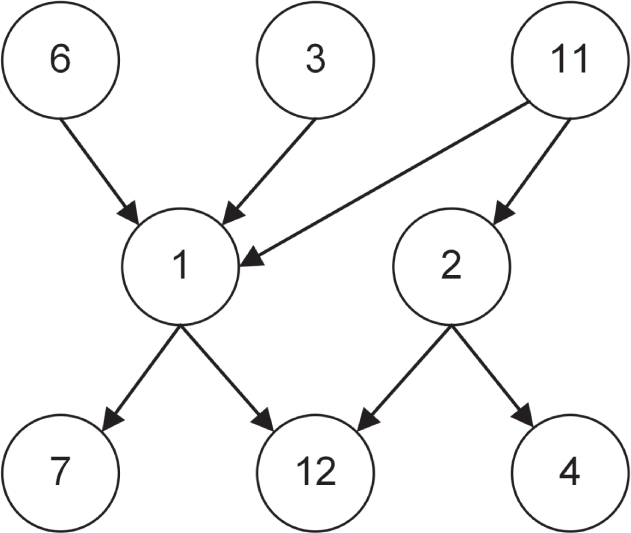
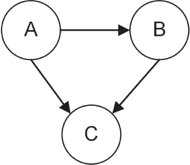

:::tip[WHAT'S IN THIS CHAPTER?]
- What allocators are
- How to write Standard Library–compliant custom algorithms, containers, and iterators
:::

:::tip[WILEY.COM DOWNLOADS FOR THIS CHAPTER]
Please note that all the code examples for this chapter are available as part of this chapter's code download on the book's website at `www.wiley.com/go/proc++6e` on the Download Code tab.
:::

[Chapters 16](../c16), “Overview of the C++ Standard Library,” [18](../c18), “Standard Library Containers,” and [20](../c20), “Mastering Standard Library Algorithms,” show that the Standard Library contains a powerful general-purpose collection of containers and algorithms. The information covered so far should be sufficient for most applications. However, those chapters show only the functionality of the library that is available out of the box. The Standard Library can be customized and extended however you like. For example, you can write your own Standard Library–compliant containers, algorithms, and iterators, compatible with existing Standard Library functionality. You can even specify your own memory allocation schemes for containers to use. This chapter provides a taste of these advanced features, primarily through the development of a `find_all`(`)` algorithm and a `directed_graph` container.

:::note
Customizing and extending the Standard Library is rarely necessary. If you're happy with the existing Standard Library containers and algorithms, you can skip this chapter. However, if you really want to understand the Standard Library, not just use it, give this chapter a chance. You should be comfortable with the operator-overloading material from [Chapter 15](../c15), “Overloading C++ Operators,” and because this chapter uses templates extensively, you should also be comfortable with the template material from [Chapter 12](../c12), “Writing Generic Code with Templates,” before continuing.
:::

## ALLOCATORS

Every Standard Library container takes an `Allocator` type as a template type parameter, for which the default usually suffices. For example, the `vector` template definition looks like this:

```cpp
template <class T, class Allocator = allocator<T>> class vector;
```

The container constructors then allow you to pass in an object of type `Allocator`. This permits you to customize the way the containers allocate memory. Every memory allocation performed by a container is made with a call to the `allocate`(`)` member function of the `Allocator` object. Conversely, every deallocation is performed with a call to the `deallocate()` member function of the `Allocator` object. When a Standard Library container takes an `Allocator` parameter, that parameter always defaults to `std::allocator<T>` if not provided. The `allocate()` and `deallocate()` member functions of `std::allocator<T>` are simple wrappers around `new` and `delete`.

Keep in mind that `allocate()` simply allocates a big-enough block of uninitialized memory and does not call any object constructor. Similarly, `deallocate()` simply frees the memory block and does not call any destructor. Once a memory block has been allocated, a placement `new` operator (see [Chapter 15](../c15)) can be used to construct an object in place. The following code snippet shows a contrived example. [Chapter 29](../c29), “Writing Efficient C++,” shows a more realistic use of an allocator for the implementation of an object pool.

```cpp
class MyClass {};
int main()
{
    // Create an allocator to use.
    std::allocator<MyClass> alloc;
    // Allocate an uninitialized memory block for 1 instance of MyClass.
    auto* memory { alloc.allocate(1) };
    // Use placement new operator to construct a MyClass in place.
    ::new (memory) MyClass{};
    // Destroy MyClass instance.
    std::destroy_at(memory);
    // Deallocate memory block.
    alloc.deallocate(memory, 1);
    memory = nullptr;
```

```cpp
}
```

If you want containers in your program to use a custom memory allocation and deallocation scheme, you can write your own `Allocator` class. There are several reasons for using custom allocators. For example, if the underlying allocator has unacceptable performance, there are alternatives. When OS-specific capabilities, such as shared memory segments, must be allocated, using custom allocators allows the use of Standard Library containers in those shared memory segments. The use of custom allocators is complex, and there are many potential problems if you are not careful, so this should not be approached lightly.

Any class that provides `allocate()`, `deallocate()`, and several other required member functions and type aliases can be used in place of the default `allocator` class.

Additionally, the Standard Library has the concept of *polymorphic memory allocators*. Basically, the problem with the allocator for a container being specified as a template type parameter is that two containers that are similar but have different allocator types are completely different types. For example, `vector<int, A1>` and `vector<int, A2>` are different and so cannot, e.g., be assigned to one another.

The polymorphic memory allocators, defined in `<memory_resource>` in the `std::pmr` namespace, help to solve this problem. The class `std::pmr::polymorphic_allocator` is a proper `Allocator` class because it satisfies all the allocator requirements, such as having `allocate()` and `deallocate()` member functions. The allocation behavior of a `polymorphic_allocator` depends on the `memory_resource` it's given during construction, and not on any template type parameters. As such, different `polymorphic_allocator`s can behave in completely different ways when allocating and deallocating memory, even though they all have the same type, that is, `polymorphic_allocator`. The standard provides some built-in memory resources that you can use to initialize a polymorphic memory allocator: `synchronized_pool_resource`, `unsynchronized_pool_resource`, and `monotonic_buffer_resource`. The Standard Library also provides template type aliases such as `std::pmr::vector<T>` for `std::vector<T, std::pmr::polymorphic_allocator<T>>`. An `std::pmr::vector<T>` is still a different type from `std::vector<T>` and cannot be assigned from `std::vector<T>`. But an `std::pmr::vector<T>` affiliated with one memory resource is the same type as, and can be assigned from, a second `std::pmr::vector<T>` object affiliated with a different memory resource.

However, in my experience, both custom allocators and polymorphic memory allocators are rather advanced and rarely used features in day-to-day coding. I've never used them myself, so a detailed discussion falls outside the scope of this book. For more information, consult one of the books listed in [Appendix B](../b02), “Annotated Bibliography,” that specifically covers the C++ Standard Library.

## EXTENDING THE STANDARD LIBRARY

The Standard Library includes many useful containers, algorithms, and iterators that you can use in your applications. It is impossible, however, for any library to include all possible utilities that all potential clients might need. Thus, the best libraries are extensible: they allow clients to adapt and add to the basic capabilities to obtain exactly the functionality they require. The Standard Library is inherently extensible because of its fundamental structure of separating data from the algorithms that operate on them. You can write your own containers that can work with the Standard Library algorithms by providing iterators that conform to the Standard Library guidelines. Similarly, you can write your own algorithms that work with iterators from the standard containers. Keep in mind, though, that you are not allowed to put your own containers and algorithms in the `std` namespace.

:::note
This book usually uses the convention to name functions and member functions without any underscores and where each word of the name is capitalized, except for the first word, for example: `getIndex()`. However, this chapter talks about extending the Standard Library, hence it uses the naming conventions used by the Standard Library. This means function and member function names are all lowercase with underscores separating the words, for example `get_index()`. Class names are also using the Standard Library naming conventions.
:::

### Why Extend the Standard Library?

If you sit down to write an algorithm or container in C++, you can either make it adhere to the Standard Library conventions or not. For simple containers and algorithms, it might not be worth the extra effort to follow the Standard Library requirements. However, for substantial code that you plan to reuse, the effort pays off. First, the code will be easier for other C++ programmers to understand, because you follow well-established interface guidelines. Second, you will be able to use your container or algorithm with the other parts of the Standard Library (algorithms or containers) without needing to provide special hacks or adapters. Finally, it will force you to employ the necessary rigor required to develop solid code.

### Writing a Standard Library Algorithm

[Chapters 16](../c16) and [20](../c20) describe a useful set of algorithms that is part of the Standard Library, but you will inevitably encounter situations in your programs for which you need new algorithms. When that happens, it is usually not difficult to write your own algorithm that works with Standard Library iterators just like the standard algorithms.

#### find\_all

Suppose you want to find all elements, including their position, matching a predicate in a given range. The `find()` and `find_if()` algorithms are the most likely candidates, but each returns an iterator referring to only one element. You can use `copy_if()` to find all elements matching a given predicate, but it fills the output with copies of the found elements, so you lose their position. If you want to avoid copies, you can use `copy_if()` with a `back_insert_iterator` (see [Chapter 17](../c17), “Understanding Iterators and the Ranges Library”) into a `vector<reference:wrapper<T>>`, but this does not give you the position of the found elements either. In fact, there is no standard algorithm to get iterators to all the elements matching a predicate. However, you can write your own version of this functionality called `find_all()`.

In this first section, we'll look at an implementation of `find_all()` following the model of legacy unconstrained algorithms. Once that implementation is working, we'll see how it can be extended and adapted to follow the model of modern constrained algorithms by adding support for projections and more.

The first task is to define the function prototype. You can follow the model established by `copy_if()`, that is, a function template with three template type parameters: the input iterator type, the output iterator type, and the predicate type. The parameters of the function are start and end iterators of the input sequence, a start iterator of the output sequence, and a predicate object. As with `copy_if()`, the algorithm returns an iterator into the output sequence that is one-past-the-last element stored in the output sequence. Of course, in modern C++ code, it's recommended to add proper constraints to template type parameters, so let's follow that advice. Here is the prototype:

```cpp
template <forward_iterator ForwardIterator,
          output_iterator<ForwardIterator> OutputIterator,
          indirect_unary_predicate<ForwardIterator> Predicate>
OutputIterator find_all(ForwardIterator first, ForwardIterator last,
                        OutputIterator dest, Predicate pred);
```

The `forward_iterator` concept specifies that an iterator must be dereferenceable and incrementable, among others. The `output_iterator<ForwardIterator>` concept requires that an iterator is an output iterator that accepts values of type `ForwardIterator`. The `indirect_unary_predicate` concept is a predefined set of requirements that algorithms can use to specify the requirements for unary predicate arguments. It's “indirect” because the requirements are applied to the type that its template type parameter, `ForwardIterator` in this case, refers to, and not to `ForwardIterator` itself.

Another design choice would be to omit the output iterator and return an iterator into the input sequence that iterates over all the matching elements in the input sequence. This would require you to write your own iterator class, which is discussed later in this chapter.

The next task is to write the implementation. The `find_all()` algorithm iterates over all elements in the input sequence, uses `invoke()` to call the predicate on each element, and stores iterators of matching elements in the output sequence. Here is the implementation:

```cpp
template <forward_iterator ForwardIterator,
          output_iterator<ForwardIterator> OutputIterator,
          indirect_unary_predicate<ForwardIterator> Predicate>
OutputIterator find_all(ForwardIterator first, ForwardIterator last,
                        OutputIterator dest, Predicate pred) 
{
    while (first != last) {
        if (invoke(pred, *first)) { 
            *dest = first;
            ++dest;
        }
        ++first;
    }
    return dest;
}
```

Similar to `copy_if()`, the algorithm only overwrites existing elements in the output sequence, so make sure the output sequence is large enough to hold the result, or use an iterator adapter such as `back_insert_iterator`, as demonstrated in the following code. After finding all matching elements, the code counts the number of elements found, which is the number of iterators in `matches`. Then, it iterates through the result, printing each element.

```cpp
vector<int> vec { 5, 4, 5, 4, 10, 6, 5, 8, 10 }; 
vector<vector<int>::iterator> matches;
 
find_all(begin(vec), end(vec), back_inserter(matches),
    [](int i){ return i == 10; });
 
println("Found {} matching elements: ", matches.size());
for (const auto& it : matches) {
    println("{} at position {}", *it, distance(begin(vec), it));
}
```

The output is as follows:

```cpp
Found 2 matching elements:
10 at position 4
10 at position 8
```

#### Modernized find_all

As [Chapter 17](../c17) explains, most constrained algorithms accept a projection parameter. The `find_all()` algorithm can be modernized to support such a projection parameter. Additionally, constrained algorithms usually don't have a begin and end iterator of the same type. Instead, the begin iterator is as usual, but the end marker can be of a different type and is then called a *sentinel*. Here is the updated algorithm:

```cpp
template <forward_iterator ForwardIterator,
    sentinel_for<ForwardIterator> Sentinel,
    output_iterator<ForwardIterator> OutputIterator,
    typename Projection = std::identity,
    indirect_unary_predicate<projected<ForwardIterator, Projection>> Predicate>
OutputIterator find_all(ForwardIterator first, Sentinel last,
                        OutputIterator dest, Predicate pred, Projection proj = {})
{
    while (first != last) {
        if (invoke(pred, invoke(proj, *first))) {
            *dest = first;
            ++dest;
        }
        ++first;
    }
    return dest;
}
```

The `sentinel_for` constraint ensures that the expression `first != last` is valid. The `Projection` template type parameter is new and has a default value, the `identity` operation. The template type argument for `indirect_unary_predicate` changed slightly to `projected<ForwardIterator,Projection>`, which represents the type of applying the `Projection` function to a dereferenced `ForwardIterator`.

The modernized `find_all()` can be tested as follows:

```cpp
find_all(begin(vec), end(vec), back_inserter(matches),
    [](int i) { return i == 10; },
    [](int i) { return i * 2; });
```

This invocation of `find_all()` is similar to the one from the previous section, except that it now includes a projection. For each element, the algorithm first transforms it using this projection function, and then passes it to the given predicate. In this case, each element is first doubled, and then checked whether the transformed element is equal to 10. Thus, the output now is as follows. Compare this with the output from the previous section.

```cpp
Found 3 matching elements:
5 at position 0
5 at position 2
5 at position 6
```

### Writing a Standard Library Container

The C++ Standard Library contains a list of requirements that any container must fulfill to qualify as a Standard Library container. Additionally, if you want your container to be sequential (like a `vector`), ordered associative (like a `map`), or unordered associative (like an `unordered_map`), it must conform to supplementary requirements.

My suggestion when writing a custom container is to write the basic container first, following the general Standard Library rules such as making it a class template, but without worrying too much yet about the specific details of Standard Library conformity. After developing the basic implementation, add iterator support so that it can work with the Standard Library framework. Next, add member functions and type aliases to fulfill all basic container requirements, and finally, fulfill any additional container requirements. This chapter takes that approach to develop a *directed graph* data structure, also called a *digraph*.

#### A Basic Directed Graph

Certain C++ Standard Library containers might possibly use a graph in their implementation, but the standard does not make any graph-like data structures available to the user. So, implementing your own graph sounds like a perfect example of writing your own Standard Library–compliant container.

Before starting with writing any code, let's first take a look at what kind of data structure a directed graph is and how to represent its data in memory. [Figure 25.1](#c25-fig-0001) shows a visual representation of a directed graph example. Basically, a directed graph consists of a set of *nodes*, also called *vertices*, which are connected by *edges*. Additionally, every edge has a direction, indicated by the arrows, which is why it's called a *directed* graph.

 


[^FIGURE 25.1]

There are multiple ways to store such a data structure in memory, such as edge lists, adjacency matrices, and adjacency lists. This implementation uses *adjacency lists*. Nodes are stored in a `vector` with each node having an adjacency list listing its neighboring nodes. Let's look at an example. Suppose you have the directed graph from [Figure 25.2](#c25-fig-0002).

 


[^FIGURE 25.2]

Representing this graph with adjacency lists results in the following data structure:

| NODE | ADJACENCY LIST |
| --- | --- |
| A | B, C |
| B | C |
| C |  |

This can be stored as a `vector` where each element in the `vector` represents one row of the table; that is, each `vector` element represents a single node and its corresponding adjacency list. Let's start with a basic implementation without worrying too much about Standard Library compliance. This first section implements a simple, but fully functional, `directed_graph<T>` where `T` is the type of value to be stored in a single node. All values stored in a `directed_graph` must be unique. This might not be the best or most performant implementation of a directed graph, but that's not the point of this chapter. The point is to walk through the process of making a data structure following the Standard Library philosophy.

##### The graph_node Class Template

The `directed_graph` implementation uses the concept of nodes, so the first piece of code to implement is a data structure representing a single node of a graph. A node has a value and a list of adjacent nodes, stored as a `set` of indices to those adjacent nodes. Using a `set` makes sure that no duplicate adjacent indices are stored in the list. The class has a constructor to construct a new `graph_node` for a given value and has a `value()` member function to retrieve the value of the node. Only a `const` overload of `value()` is provided, as values should never change. The definition is in a `directed_graph:node` partition file called `graph_node.cppm`, inside a namespace called `details`, and is not exported from the module, as users of `directed_graph`s should not directly use `graph_node`s themselves. Here is the interface of `graph_node`. Note the use of the `[[nodiscard]]` attribute, introduced in [Chapter 1](../c01), “A Crash Course in C++ and the Standard Library”:

```cpp
export module directed_graph:node;
…
namespace details
{
    template <typename T>
    class graph_node
    {
        public:
            // Constructs a graph_node for the given value.
            explicit graph_node(directed_graph<T>* graph, T t)
                : m_graph { graph }, m_data(std::move(t)) { }
 
            // Returns a reference to the stored value.
            [[nodiscard]] const T& value() const noexcept { return m_data; }
 
            // Type alias for the container type used to store the adjacency list.
            using adjacency_list_type = std::set<std::size_t>;
 
            // Returns a reference to the adjacency list.
            [[nodiscard]] auto& get_adjacent_nodes_indices() {
                return m_adjacentNodeIndices; }
            [[nodiscard]] const auto& get_adjacent_nodes_indices() const {
                return m_adjacentNodeIndices; }
        private:
            // A pointer to the graph this node is in.
            directed_graph<T>* m_graph;
 
            T m_data;
            adjacency_list_type m_adjacentNodeIndices;
    };
}
```

In this definition, no constraints are placed on the template type parameter `T`. The reason is that, just as `vector`, the element requirements depend on what operations are actually performed on the container.

The initialization of `m_data` in the constructor initializer uses `m_data(std::move(t))`. Using the uniform initialization syntax, `m_data{std::move(t)}`, might not compile because `T` is a user-defined type.

Now that we have our `graph_node` implementation, let's look at the `directed_graph` class itself.

##### The directed_graph Interface

A `directed_graph` supports three basic operations: insertion, deletion, and lookup; additionally, it is swappable. It is defined in a `directed_graph` module. Here is the `public` portion of the `directed_graph` class template:

```cpp
export module directed_graph;
…
export template <typename T>
class directed_graph
{
    public:
        // For insert to be successful, the value shall not be in the graph yet.
        // Returns true if a new node with given value has been added to
        // the graph, and false if there was already a node with the given value.
        bool insert(T node_value);
 
        // Returns true if the given node value was erased, false otherwise.
        bool erase(const T& node_value);
 
        // Returns true if the edge was successfully created, false otherwise.
        bool insert_edge(const T& from_node_value, const T& to_node_value);
 
        // Returns true if the given edge was erased, false otherwise.
        bool erase_edge(const T& from_node_value, const T& to_node_value);
 
        // Removes all nodes from the graph.
        void clear() noexcept;
 
        // Returns a reference to the value in the node with given index
        // without bounds checking.
        const T& operator[](std::size_t index) const;
 
        // Two directed graphs are equal if their sets of nodes are equal (where
        // nodes with the same T value are considered equal) and the same number
        // of edges between each corresponding pair of nodes.
        // The order in which the nodes and edges have been added does not
        // affect equality.
        bool operator==(const directed_graph& rhs) const;
 
        // Swaps all nodes between this graph and the given graph.
        void swap(directed_graph& other_graph) noexcept;
 
        // Returns the number of nodes in the graph.
        [[nodiscard]] std::size_t size() const noexcept;
 
        // Returns a set with the values of the adjacent nodes of a given node.
        // If the given node does not exist, an empty set is returned.
        [[nodiscard]] std::set<T> get_adjacent_nodes_values(
            const T& node_value) const;
    private:
        // Implementation details not shown yet.
};
```

The element type is a template type parameter, similar to the Standard Library `vector` container's. This interface looks straightforward. Note that this interface does not define any user-defined copy and move constructors, copy and move assignment operators, or destructor; i.e., the class follows the Rule of Zero as discussed in [Chapter 9](../c09), “Mastering Classes and Objects.”

Let's now look at concrete implementations of the `public` member functions.

##### The Implementation

After you finalize the `directed_graph` interface, you need to choose the implementation model. As discussed earlier, this implementation stores a directed graph as a list of nodes where each node contains its value and its set of adjacent node indices. Since the adjacent node lists contain indices to other nodes, nodes should be accessible based on their indices. Thus, a `vector` is the most appropriate container for storing the nodes. Each node is represented as a `graph_node` instance. Thus, the final structure is a `vector` of `graph_node`s. Here are the first `private` members of the `directed_graph` class:

```cpp
private:
    using node_container_type = std::vector<details::graph_node<T>>;
    node_container_type m_nodes;
```

##### Searching Nodes

Insert and delete operations on a graph require code to find an element with a given node value. Thus, it is helpful to have a `private` helper member function that performs this task. Both a `const` and a non-`const` overload are provided:

```cpp
// Helper member function to return an iterator to the given node, or the
// end iterator if the given node is not in the graph.
typename node_container_type::iterator find_node(const T& node_value);
typename node_container_type::const_iterator find_node(const T& node_value) const;
```

The implementation of the non-`const` overload of `find_node()` is as follows. The `const` overload has the same implementation.

```cpp
template <typename T>
typename directed_graph<T>::node_container_type::iterator
    directed_graph<T>::find_node(const T& node_value)
{
    return std::find_if(std::begin(m_nodes), std::end(m_nodes),
        [&](const auto& node) { return node.value() == node_value; });
}
```

The body of the member function is not too complicated. It uses the `find_if()` algorithm from the Standard Library, discussed in [Chapter 20](../c20), to search all the nodes in the graph for a node with a value equal to the `node_value` parameter. If such a node is found in the graph, an iterator to that node is returned; otherwise, an end iterator is returned.

The syntax in the function header of this member function is somewhat confusing, particularly the use of the `typename` keyword. You must use the `typename` keyword whenever you are using a type that is dependent on a template parameter. Specifically, the type `node_container_type::iterator`, which is `vector<details::graph_node<T>>::iterator`, is dependent on the `T` template type parameter.

##### Inserting Nodes

`insert()` must first check whether a node with a given value already exists in the graph. If it doesn't exist yet, a new node can be created for the given value. The `public` interface provides an `insert()` member function accepting a `T` by value. This is optimal in this case and follows the recommendation explained in the section “[Optimal Way to Pass Arguments to Functions](c09.xhtml#c09-sec-0033)” in [Chapter 9](../c09). The call to `emplace:back()` constructs a new `graph_node` by passing a pointer to the `directed_graph` and the node's value to the `graph_node` constructor:

```cpp
template <typename T>
bool directed_graph<T>::insert(T node_value)
{
    auto iter { find_node(node_value) };
    if (iter != std::end(m_nodes)) {
        // Value is already in the graph, return false.
        return false;
    }
    m_nodes.emplace:back(this, std::move(node_value));
    // Value successfully added to the graph, return true.
    return true;
}
```

##### Inserting Edges

Once nodes have been added to the graph, edges between those nodes can be constructed to build up a directed graph. For this, an `insert_edge()` member function is provided that requires two parameters: the value of the node from which the edge should start, and the value of the node to which the edge should point. The first thing the member function does is to search the graph for the from and to nodes. If either one of them is not found in the graph, `false` is returned. If both are found, then the code calculates the index of the node containing `to_node_value` by calling `get_index_of_node()`, a `private` helper function, and finally adds this index to the adjacency list of the node containing `from_node_value`. The `insert_edge()` member function returns `true` if and only if the graph changed as a result of the call. Remember from [Chapter 18](../c18) that `insert()` on a `set` returns a `pair<iterator,bool>`, where the Boolean represents whether the insert was successful, which is why `.second` is used on the result of `insert()` in the `return` statement.

```cpp
template <typename T>
bool directed_graph<T>::insert_edge(const T& from_node_value,
    const T& to_node_value)
{
    const auto from { find_node(from_node_value) };
    const auto to { find_node(to_node_value) };
    if (from == std::end(m_nodes) || to == std::end(m_nodes)) {
        return false;
    }
    const std::size_t to_index { get_index_of_node(to) };
    return from->get_adjacent_nodes_indices().insert(to_index).second;
}
```

The `get_index_of_node()` helper member function is implemented as follows:

```cpp
template <typename T>
std::size_t directed_graph<T>::get_index_of_node(
    typename node_container_type::const_iterator node) const noexcept
{
    return node - std::cbegin(m_nodes);
}
```

##### Deleting Nodes

`erase()` follows the same pattern as `insert()`: it first attempts to find the given node by calling `find_node()`. If the node exists, it erases it from the graph. Otherwise, it does nothing. Removing an existing node from the graph is a two-step procedure:

1. Remove the index of the to-be-deleted node from all adjacency lists of all other nodes.
2. Remove the actual node from the list of nodes.

For the first step, a helper member function `remove_node_index()` is added to `graph_node,` which removes a given node index from the adjacency list of a node and updates the remaining indices to account for the shift in indices. The implementation follows. One tricky part is that the adjacency list is a `set`, and a `set` does not allow modifications to its values. Instead, the second step in the implementation converts the `set` into a `vector`, uses the `for_each()` algorithm to update all indices that require updating, and finally clears the `set` and inserts the updated indices. Again, this might not be the most performant implementation, but, as mentioned earlier, that's not the point of this discussion.

```cpp
template <typename T>
void graph_node<T>::remove_node_index(std::size_t node_index)
{
    // First, remove references to the to-be-deleted node.
    m_adjacentNodeIndices.erase(node_index);
 
    // Second, modify all adjacency indices to account for the removal of a node.
    // std::set doesn't let us modify its elements in place,
    // so we rebuild the set from scratch.
    std::vector<std::size_t> indices(std::begin(m_adjacentNodeIndices),
        std::end(m_adjacentNodeIndices));
    std::for_each(std::begin(indices), std::end(indices),
        [node_index](std::size_t& index) {
            if (index > node_index) { --index; }
        });
    m_adjacentNodeIndices.clear();
    m_adjacentNodeIndices.insert(std::begin(indices), std::end(indices));
}
```

Next, a `remove_all_links_to()` helper member function is added to `directed_graph`. This member function updates remaining adjacent node indices in all nodes to account for the removal of a node from the graph. First, it calculates `node_index`, the index of the given node in the `vector` of nodes. Then, it iterates over all nodes and removes `node_index` from the adjacency list of each node.

```cpp
template <typename T>
void directed_graph<T>::remove_all_links_to(
    typename node_container_type::const_iterator node_iter)
{
    const std::size_t node_index { get_index_of_node(node_iter) };
    for (auto&& node : m_nodes) { node.remove_node_index(node_index); }
}
```

With this helper member function, the implementation of the actual `erase()` member function becomes easy:

```cpp
template <typename T>
bool directed_graph<T>::erase(const T& node_value)
{
    auto iter { find_node(node_value) };
    if (iter == std::end(m_nodes)) {
 return false;
 }
    remove_all_links_to(iter);
    m_nodes.erase(iter);
    return true;
}
```

##### Deleting Edges

The procedure to remove edges is quite similar to adding them. If either the from or to node is not found, nothing is done; otherwise, the index of the node with value `to_node_value` is removed from the adjacency list of the node with value `from_node_value`:

```cpp
template <typename T>
bool directed_graph<T>::erase_edge(const T& from_node_value,
    const T& to_node_value)
{
    const auto from { find_node(from_node_value) };
    const auto to { find_node(to_node_value) };
    if (from == std::end(m_nodes) || to == std::end(m_nodes)) {
        return false; // nothing to erase
    }
    const std::size_t to_index { get_index_of_node(to) };
    from->get_adjacent_nodes_indices().erase(to_index);
    return true;
}
```

##### Removing All Elements

`clear()` simply clears the entire graph:

```cpp
template <typename T>
void directed_graph<T>::clear() noexcept
{
    m_nodes.clear();
}
```

##### Swapping Graphs

Since `directed_graph` has only one data member, a `vector` container, swapping two `directed_graph`s just means swapping their single data member:

```cpp
template <typename T>
void directed_graph<T>::swap(directed_graph& other_graph) noexcept
{
    m_nodes.swap(other_graph.m_nodes);
}
```

The following stand-alone exported `swap()` function is also provided, which simply forwards to the `public swap()` member function:

```cpp
export template <typename T>
void swap(directed_graph<T>& first, directed_graph<T>& second) noexcept
{
    first.swap(second);
}
```

##### Accessing Nodes

The `public` interface of `directed_graph` supports accessing nodes based on their index with `operator[]`. Its implementation is straightforward. Just as with `vector`, the operator does not perform any bounds checking on the requested index:

```cpp
template <typename T>
const T& directed_graph<T>::operator[](std::size_t index) const
{
    return m_nodes[index].value();
}
```

##### Comparing Graphs

Two `directed_graph`s are equal if and only if they contain the same set of nodes and the same set of edges between all the nodes. A slight complication arises from the fact that the two `directed_graph`s could have been created by adding nodes to them in different order; as such, the implementation cannot just compare the `m_nodes` data member but instead needs to do a bit more work.

The code first checks the size of both `directed_graph`s. If the size is different, both graphs cannot be the same. If they have the same size, the code iterates over all the nodes of one of the graphs. For each node, it tries to find the same node in the other graph. If it doesn't find such a node, the graphs are not equal. If it does find such a node, the adjacent node indices are converted to adjacent node values using a `get_adjacent_nodes_values()` helper member function, and those values are then compared for equality.

```cpp
template <typename T>
bool directed_graph<T>::operator==(const directed_graph& rhs) const
{
    if (m_nodes.size() != rhs.m_nodes.size()) { return false; }
 
    for (auto&& node : m_nodes) {
        const auto rhsNodeIter {   rhs.find_node(node.value()) };
        if (rhsNodeIter == std::end(rhs.m_nodes)) { return false; }
 
        const auto adjacent_values_lhs { get_adjacent_nodes_values(
            node.get_adjacent_nodes_indices()) };
        const auto adjacent_values_rhs { rhs.get_adjacent_nodes_values(
            rhsNodeIter->get_adjacent_nodes_indices()) };
        if (adjacent_values_lhs != adjacent_values_rhs) { return false; }
    }
    return true;
}
 
template <typename T>
std::set<T> directed_graph<T>::get_adjacent_nodes_values(
    const typename details::graph_node<T>::adjacency_list_type& indices) const
{
    std::set<T> values;
    for (auto&& index : indices) { values.insert(m_nodes[index].value()); }
    return values;
}
```

##### Getting Adjacent Nodes

The `public` interface provides a `get_adjacent_nodes_values()` member function accepting a `node_value` of type reference-to-`const T` as parameter. It returns a `set` containing the values of the nodes adjacent to the given node. If the given node does not exist, an empty `set` is returned. The implementation uses the `get_adjacent_nodes_values()` overload accepting a list of indices as implemented in the previous section:

```cpp
template <typename T>
std::set<T> directed_graph<T>::get_adjacent_nodes_values(const T& node_value) const
{
    auto iter { find_node(node_value) };
    if (iter == std::end(m_nodes)) { return {}; }
    return get_adjacent_nodes_values(iter->get_adjacent_nodes_indices());
}
```

##### Querying the Graph Size

Finally, the `size()` member function returns the number of nodes in the graph:

```cpp
template <typename T>
std::size_t directed_graph<T>::size() const noexcept
{
    return m_nodes.size();
}
```

##### Printing Graphs

Graphs can be printed in a standard format called *DOT*, a *graph description language*. There are tools available that understand DOT-formatted graphs and that can convert them into graphical representations. To make it easier to test the `directed_graph` code, the following `to_dot()` conversion function can be used. An example of its use is given in the next section.

```cpp
// Returns a given graph in DOT format.
export template <typename T>
std::string to_dot(const directed_graph<T>& graph, std::string_view graph_name)
{
    std::ostringstream output;
    std::println(output, "digraph {} {{", graph_name);
    for (std::size_t index { 0 }; index < graph.size(); ++index) {
        const auto& node_value { graph[index] };
        const auto adjacent_values { graph.get_adjacent_nodes_values(node_value) };
        if (adjacent_values.empty()) {
            std::println(output, "{}", node_value);
        } else {
            for (auto&& neighbor : adjacent_values) {
                std::println(output, "{} -> {}", node_value, neighbor);
            }
        }
    }
    std::println(output, "}}");
    return std::move(output).str();
}
```

##### Using the Basic Directed Graph

We have now completed the full implementation of a basic directed graph class. It's high time to give this class a test drive. Here is a small program demonstrating the basic `directed_graph` class template:

```cpp
directed_graph<int> graph;
// Insert some nodes and edges.
graph.insert(11);
graph.insert(22);
graph.insert(33);
graph.insert(44);
graph.insert(55);
graph.insert_edge(11, 33);
graph.insert_edge(22, 33);
graph.insert_edge(22, 44);
graph.insert_edge(22, 55);
graph.insert_edge(33, 44);
graph.insert_edge(44, 55);
println("{}", to_dot(graph, "Graph1"));
 
// Remove an edge and a node.
graph.erase_edge(22, 44);
graph.erase(44);
println("{}", to_dot(graph, "Graph1"));
 
// Print the size of the graph.
println("Size: {}", graph.size());
```

The output is as follows:

```cpp
digraph Graph1 {
11 -> 33
22 -> 33
22 -> 44
22 -> 55
33 -> 44
44 -> 55
55
}
digraph Graph1 {
11 -> 33
22 -> 33
22 -> 55
33
55
}
Size: 4
```

#### Making directed_graph a Standard Library Container

The basic `directed_graph` implemented in the previous sections follows the spirit, but not the letter, of the Standard Library. For most purposes, the preceding implementation is good enough. However, if you want to use the Standard Library algorithms on your `directed_graph`, you must do a bit more work. The C++ standard specifies member functions and type aliases that a class template must provide to qualify as a Standard Library container.

##### Required Type Aliases

The C++ standard requires that every Standard Library container provide the following `public` type aliases:

| TYPE NAME | DESCRIPTION |
| --- | --- |
| value\_type | The element type stored in the container |
| reference | A reference to the element type stored in the container |
| const\_reference | A reference-to-const to the element type stored in the container |
| iterator | The type for iterating over elements of the container |
| const_iterator | A version of iterator for iterating over `const` elements of the container |
| size\_type | A type that can represent the number of elements in the container; this is usually just size_t (from `<cstddef>`) |
| difference:type | A type that can represent the difference of two iterators for the container; this is usually just `ptrdiff_t` (from `<cstddef>`) |

Here are the definitions for the `directed_graph` class template of all these type aliases except `iterator` and `const_iterator`. Writing iterators is covered in detail later in this chapter.

```cpp
export template <typename T>
class directed_graph
{
    public:
        using value_type = T;
        using reference = value_type&;
        using const_reference = const value_type&;
        using size_type = std::size_t;
        using difference:type = std::ptrdiff_t;
        // Remainder of class definition omitted for brevity.
};
```

With these type aliases, some member functions can be slightly modified. For example, here is the earlier definition for `operator[]`:

```cpp
const T& operator[](std::size_t index) const;
```

With the new type aliases, this can be written as follows:

```cpp
const_reference operator[](size_type index) const;
```

##### Required Member Functions

In addition to the obligatory type aliases, every container must provide the following member functions:

| MEMBER FUNCTION | DESCRIPTION | WORST-CASE COMPLEXITY |
| --- | --- | --- |
| Default constructor | Constructs an empty container | Constant |
| Copy constructor | Performs a deep copy of the container | Linear |
| Move constructor | Performs a move constructing operation | Constant |
| Copy assignment operator | Performs a deep copy of the container | Linear |
| Move assignment operator | Performs a move assignment operation | Constant |
| Destructor | Destroys any elements left in the container and frees their heap-allocated memory, if any | Linear |
| ```cpp iterator begin(); const_iterator  begin() const; ``` | Returns an iterator or const iterator referring to the first element in the container | Constant |
| ```cpp iterator end(); const_iterator  end() const; ``` | Returns an iterator or const iterator referring to one-past-the-last element in the container | Constant |
| ```cpp const_iterator  cbegin() const; ``` | Same as begin() const | Constant |
| ```cpp const_iterator  cend() const; ``` | Same as end() const | Constant |
| ```cpp operator== ``` | Comparison operator that compares two containers | Linear |
| ```cpp void swap(Container&)  noexcept; ``` | Swaps the contents of the container passed to the member function with the object on which the member function is called | Constant |
| ```cpp size_type size() const; ``` | Returns the number of elements in the container | Constant |
| ```cpp size_type max_size() const; ``` | Returns the maximum number of elements the container can hold | Constant |
| ```cpp bool empty() const; ``` | Returns whether the container has any elements | Constant |

As discussed earlier, the `directed_graph` implementation follows the rule of zero (see [Chapter 9](../c09)); that is, it does not need an explicit copy/move constructor, copy/move assignment operator, or destructor.

The following code snippet shows the declarations of the `size()`, `max_size()`, and `empty()` member functions. The iterator-related member functions, `begin()`, `end()`, `cbegin()`, and `cend()`, are covered in the next section on writing iterators.

```cpp
export template <typename T>
class directed_graph
{
    public:
        [[nodiscard]] size_type size() const noexcept;
        [[nodiscard]] size_type max_size() const noexcept;
        [[nodiscard]] bool empty() const noexcept;
        // Other member functions omitted for brevity.
};
```

The implementations of these three member functions are easy because they can simply forward to the similarly named member functions of the `m_nodes` container. Note that `size_type` is one of the type aliases defined in the class template. Because it is a member of the class template, such a return type in the implementation must be fully qualified with `typename directed_graph<T>`.

```cpp
template <typename T>
typename directed_graph<T>::size_type directed_graph<T>::size() const noexcept
{
    return m_nodes.size();
}
 
template <typename T>
typename directed_graph<T>::size_type directed_graph<T>::max_size() const noexcept
{
    return m_nodes.max_size();
}
 
template <typename T>
bool directed_graph<T>::empty() const noexcept
{
    return m_nodes.empty();
}
```

The current implementation of `directed_graph` has `operator[]` to get access to a node based on its index. This operator, just as with `operator[]` for `vector`, does not perform any bounds checking. Passing an out-of-bounds index could make your application crash. As for `vector`, `directed_graph` can be augmented with an `at()` member function that does bounds checking and that throws an `std::out_of_range` exception if the passed index is out of bounds. Here is the definition:

```cpp
const_reference at(size_type index) const;
```

The implementation just forwards to the `m_nodes vector`:

```cpp
template <typename T>
typename directed_graph<T>::const_reference
    directed_graph<T>::at(size_type index) const
{
    return m_nodes.at(index).value();
}
```

##### Writing an Iterator

The most important container requirement is iterator support. To work with the generic algorithms, every container must provide an iterator type for accessing the elements in the container. Your iterator should generally provide overloaded `operator++`, `*`, `->`, and `==`, plus some other operations depending on its specific behavior. As long as your iterator provides the basic iteration operations, everything should be fine.

The first decision to make about your iterator is what kind it will be: forward, bidirectional, random access, or contiguous. Bidirectional iterator support seems like a good choice for a `directed_graph` iterator. That means you must additionally provide `operator--`. Another option would be to implement random-access iterators for `directed_graph`, which involves adding the operators `+`, `-`, `+=`, `-=`, `<`, `>`, `<=`, `>=`, and `[]`. This could be a good exercise to practice writing iterators. Consult [Chapter 17](../c17) for more details on the requirements for random-access iterators.

The second decision is how to order the elements of your container. The `directed_graph` is unsorted, so iterating in a sorted order would not be efficient. The important thing about a Standard Library-compliant container is that iterating over its elements from `begin()` to `end()` will hit every element once; just because it is ***a*** sequence, doesn't mean that it is a ***specific*** sequence. Thus, the `directed_graph` iterator can just step through the nodes in the order in which they were added to the graph. This is the same as how iteration for `std::unordered_set` works.

The third decision is how to represent your iterator internally. The representation is usually quite dependent on the internal implementation of the container. The first purpose of an iterator is to refer to a single element in the container. In the case of a `directed_graph`, all nodes are stored in the `m_nodes` vector, so perhaps a `directed_graph` iterator can be a wrapper around a `vector` iterator referring to the element in question.

Once you've chosen your implementation, you must decide on a consistent representation for the end iterator. Recall that the end iterator should really be the “past-the-end” marker: the iterator that's reached by applying `++` to an iterator referring to the final element in the container. A `directed_graph` iterator can use as its end iterator the end iterator of the `m_nodes vector`.

Finally, a container needs to provide both `iterator` and `const_iterator` type aliases. This implementation defines both these type aliases in terms of a `const_directed_graph_iterator_impl` class template. The reason is that values cannot be changed once in the graph. This follows the same principle as `std::set`.

If you do need separate `iterator` and `const_iterator` types for your own data structure, keep in mind that an `iterator` must be convertible to a `const_iterator`.

##### The const\_directed\_graph\_iterator_impl Class Template

Given the decisions made in the previous section, it's time to define the `const_directed_graph_iterator_impl` class template. The first thing to note is that each `const_directed_graph_iterator_impl` object is an iterator for a specific instantiation of `directed_graph`. To provide this one-to-one mapping, the `const_directed_graph_iterator_impl` must also be a class template with the directed graph type as a template type parameter called `DirectedGraph`.

The main question is how to conform to the bidirectional iterator requirements. Recall that anything that behaves like an iterator is an iterator. Your iterator is not required to derive from another class to qualify as a bidirectional iterator. However, if you want your iterator to be usable by the generic algorithms, you must specify its traits. [Chapter 17](../c17) explains that `iterator_traits` is a class template that defines, for each iterator type, five type aliases: `value_type`, `difference:type`, `iterator_category`, `pointer`, and `reference`. The default implementation of the `iterator_traits` class template just grabs the five type aliases out of the iterator itself. Thus, you can simply define those type aliases directly for your iterator. The `const_directed_graph_iterator_impl` is a bidirectional iterator, so you specify `bidirectional_iterator_tag` as the iterator category. Other legal iterator categories are `input_iterator_tag`, `output_iterator_tag`, `forward_iterator_tag`, `random_access_iterator_tag`, and `contiguous_iterator_tag`. A contiguous iterator is a random-access iterator for which adjacent elements are also adjacent in memory. For the `const_directed_graph_iterator_impl`, the element type (`value_type`) is `typename DirectedGraph::value_type`.

:::note
In the past, it was recommended to derive custom iterators from the `std::iterator` class template, defined in `<iterator>`. This class template has been deprecated and should not be used anymore.
:::

Here is the `const_directed_graph_iterator_impl` class template definition:

```cpp
template <typename DirectedGraph>
class const_directed_graph_iterator_impl
{
    public:
        using value_type = typename DirectedGraph::value_type;
        using difference:type = std::ptrdiff_t;
        using iterator_category = std::bidirectional_iterator_tag;
        using pointer = const value_type*;
        using reference = const value_type&;
        using node_container_iterator =
            typename DirectedGraph::node_container_type::const_iterator;
 
        // Bidirectional iterators must supply a default constructor.
        const_directed_graph_iterator_impl() = default;
 
        explicit const_directed_graph_iterator_impl(node_container_iterator it);
 
        reference operator*() const;
 
        // Return type must be something to which -> can be applied.
        // So, return a pointer.
        pointer operator->() const;
 
        const_directed_graph_iterator_impl& operator++();
        const_directed_graph_iterator_impl operator++(int);
 
        const_directed_graph_iterator_impl& operator--();
        const_directed_graph_iterator_impl operator--(int);
 
        // Defaulted operator==.
        bool operator==(const const_directed_graph_iterator_impl&) const = default;
 
    private:
        friend class directed_graph<value_type>;
 
        node_container_iterator m_nodeIterator;
};
```

Consult [Chapter 15](../c15) for details on operator overloading if the definitions and implementations (shown in the next section) of the overloaded operators confuse you. The `const_directed_graph_iterator_impl` implementation does not need copy/move constructors and copy/move assignment operators, as the default behavior is what we want. The class also does not need an explicit destructor, as there's nothing to clean up. Hence, this class also follows the rule of zero.

##### The const\_directed\_graph\_iterator_impl Member Function Implementations

The `const_directed_graph_iterator_impl` constructor initializes the data member:

```cpp
template <typename DirectedGraph>
const_directed_graph_iterator_impl<DirectedGraph>::
    const_directed_graph_iterator_impl(node_container_iterator it)
        : m_nodeIterator { it } { }
```

The default constructor is defaulted so that clients can declare `const_directed_graph_iterator_impl` variables without initializing them. An iterator constructed with the default constructor does not need to refer to any value, and attempting any operations on it is allowed to have undefined results.

The implementations of the dereferencing operators are concise but can look tricky. [Chapter 15](../c15) explains that `operator*` and `->` are asymmetric:

- `operator*` returns a reference to the actual underlying value, which in this case is the element to which the iterator refers.
- `operator->` must return something to which the arrow operator can be applied again, and thus returns a pointer to the element. The compiler then applies `->` to the pointer, which results in accessing a field or member function of the element.

```cpp
// Return a reference to the actual element.
template <typename DirectedGraph>
typename const_directed_graph_iterator_impl<DirectedGraph>::reference
    const_directed_graph_iterator_impl<DirectedGraph>::operator*() const
{
    return m_nodeIterator->value();
}
 
// Return a pointer to the actual element, so the compiler can
// apply -> to it to access the actual desired field.
template <typename DirectedGraph>
typename const_directed_graph_iterator_impl<DirectedGraph>::pointer
    const_directed_graph_iterator_impl<DirectedGraph>::operator->() const
{
    return &m_nodeIterator->value();
}
```

The increment operators are implemented as follows. The decrement operators are not shown as they are implemented analogously.

```cpp
template <typename DirectedGraph>
const_directed_graph_iterator_impl<DirectedGraph>&
    const_directed_graph_iterator_impl<DirectedGraph>::operator++()
{
    ++m_nodeIterator;
    return *this;
}
 
template <typename DirectedGraph>
const_directed_graph_iterator_impl<DirectedGraph>
    const_directed_graph_iterator_impl<DirectedGraph>::operator++(int)
{
    auto oldIt { *this };
    ++*this;
    return oldIt;
}
```

Iterators are not required to be any safer than raw pointers, so error-checking for things like incrementing an iterator already at the end is not required.

The `node_container_iterator` type alias of `const_directed_graph_iterator_impl` uses the private `node_container_type` type alias of `directed_graph`. Thus, the `directed_graph` class template must declare `const_directed_graph_iterator_impl` to be a `friend`:

```cpp
export template <typename T>
class directed_graph
{
    // Other member functions omitted for brevity.
    private:
        friend class const_directed_graph_iterator_impl<directed_graph>;
};
```

##### Iterator Type Aliases and Access Member Functions

The final piece involved in providing iterator support for `directed_graph` is to supply the necessary type aliases in the `directed_graph` class template, and to write the `begin()`, `end()`, `cbegin()`, and `cend()` member functions. The type aliases and member function prototypes look like this:

```cpp
export template <typename T>
class directed_graph
{
    public:
        // Other type aliases omitted for brevity.
        using iterator = const_directed_graph_iterator_impl<directed_graph>;
        using const_iterator = const_directed_graph_iterator_impl<directed_graph>;
 
        // Iterator member functions.
        iterator begin() noexcept;
        iterator end() noexcept;
        const_iterator begin() const noexcept;
        const_iterator end() const noexcept;
        const_iterator cbegin() const noexcept;
        const_iterator cend() const noexcept;
        // Remainder of class definition omitted for brevity.
};
```

Both `iterator` and `const_iterator` are type aliases for `const_directed_graph_iterator_impl`, which means users cannot modify the values to which `directed_graph` iterators refer. Node values in a `directed_graph` must be unique. Allowing the user to modify the value of a node through an iterator would allow the possibility of introducing duplicate values. This follows the same principle as `std::set`, in which you also cannot modify elements.

As `iterator` and `const_iterator` are both type aliases for `const_directed_graph_iterator_impl`, the non-`const begin()` and `end()` member functions returning `iterator` are not strictly necessary; the `const` overloads are enough. However, the Standard Library requirements state that a container must supply non-`const begin()` and `end()` overloads.

The `directed_graph` class template stores all its nodes in a simple `vector`. As such, `begin()` and `end()` can simply forward their work to the identically named member functions on `vector` and wrap those results in a `const_directed_graph_iterator_impl`:

```cpp
template <typename T>
typename directed_graph<T>::iterator
    directed_graph<T>::begin() noexcept { return iterator{ std::begin(m_nodes) }; }
 
template <typename T>
typename directed_graph<T>::iterator
    directed_graph<T>::end() noexcept { return iterator { std::end(m_nodes) }; }
 
template <typename T>
typename directed_graph<T>::const_iterator
    directed_graph<T>::begin() const noexcept
{ return const_iterator { std::begin(m_nodes) }; }
 
template <typename T>
typename directed_graph<T>::const_iterator
    directed_graph<T>::end() const noexcept
{ return const_iterator { std::end(m_nodes) }; }
```

The `cbegin()` and `cend()` member functions forward the request to the `const` overloads of `begin()` and `end()`:

```cpp
template <typename T>
typename directed_graph<T>::const_iterator
    directed_graph<T>::cbegin() const noexcept { return begin(); }
 
template <typename T>
typename directed_graph<T>::const_iterator
    directed_graph<T>::cend() const noexcept { return end(); }
```

##### Modifying Other Member Functions to Use Iterators

Now that `directed_graph` supports iterators, other member functions can be slightly modified to work with iterators so that they follow the Standard Library guidelines. Let's look at the `insert()` member function first. In the earlier basic implementation, it is defined as follows:

```cpp
// For an insert to be successful, the value shall not be in the graph yet.
// Returns true if a new node with given value has been added to
// the graph, and false if there was already a node with the given value.
bool insert(T node_value);
```

To follow more closely the spirit of the Standard Library, this can be modified to return an `std::pair<iterator, bool>` where the Boolean is `true` if the element was added to the graph, and `false` if the element was already in the graph. The iterator of the `pair` refers to the newly added element or the element that was already in the graph.

```cpp
std::pair<iterator, bool> insert(T node_value);
```

The implementation is as follows. The changes compared to the version returning a simple `bool` are highlighted.

```cpp
template <typename T>
std::pair<typename directed_graph<T>::iterator, bool>
    directed_graph<T>::insert(T node_value)
{
    auto iter { find_node(node_value) };
    if (iter != std::end(m_nodes)) {
        // Value is already in the graph.
        return { iterator { iter }, false };
    }
    m_nodes.emplace:back(this, std::move(node_value));
    // Value successfully added to the graph.
    return { iterator { std::prev(std::end(m_nodes)) }, true };
}
```

Additionally, an overload of `insert()` is provided that accepts an iterator hint. This hint is useless for a `directed_graph`, but it is provided for symmetry with other Standard Library containers, such as `std::vector`. The hint is ignored, and it merely calls the overload of `insert()` without the hint.

```cpp
template <typename T>
typename directed_graph<T>::iterator
    directed_graph<T>::insert(const_iterator hint, T node_value)
{
    // Ignore the hint, just forward to another insert().
    return insert(std::move(node_value)).first;
}
```

A last overload of `insert()` accepts an iterator range. This overload is a member function template so that it can take an iterator range from any container, not just other `directed_graph`s. The actual implementation uses an `insert_iterator`, described [Chapter 17](../c17).

```cpp
template <typename T>
template <std::input_iterator Iter>
void directed_graph<T>::insert(Iter first, Iter last)
{
    // Copy each element in the range by using an insert_iterator adapter.
    // Give end() as a dummy position -- insert ignores it anyway.
    std::copy(first, last, std::insert_iterator { *this, end() });
}
```

The `erase()` member functions should be modified to work with iterators. The earlier definition has a node value as parameter and returns a `bool`:

```cpp
// Returns true if the given node value was erased, false otherwise.
bool erase(const T& node_value);
```

To follow Standard Library principles, `directed_graph` is modified to provide two `erase()` member functions: one erasing a node to which an iterator refers and another one erasing a range of nodes given as an iterator range. Both return an iterator to the node after the last deleted node:

```cpp
// Returns an iterator to the element after the last deleted element.
iterator erase(const_iterator pos);
iterator erase(const_iterator first, const_iterator last);
```

Here are the implementations:

```cpp
template <typename T>
typename directed_graph<T>::iterator
    directed_graph<T>::erase(const_iterator pos)
{
    if (pos.m_nodeIterator == std::end(m_nodes)) {
        return end();
    }
    remove_all_links_to(pos.m_nodeIterator);
    return iterator { m_nodes.erase(pos.m_nodeIterator) };
}
 
template <typename T>
typename directed_graph<T>::iterator
    directed_graph<T>::erase(const_iterator first, const_iterator last)
{
    for (auto iter { first }; iter != last; ++iter) {
        remove_all_links_to(iter.m_nodeIterator);
    }
    return iterator { m_nodes.erase(first.m_nodeIterator, last.m_nodeIterator) };
}
```

Finally, the following public `find()` member function can be implemented returning an iterator. The implementation is left as an exercise at the end of this chapter.

```cpp
const_iterator find(const T& node_value) const;
```

##### Using the directed_graph Iterators

Now that `directed_graph` supports iterators, you can iterate over its elements just as you would with any other Standard Library container, and you can pass the iterators to member functions and functions. Here are some examples:

```cpp
directed_graph<int> graph;
// Populate the graph, omitted (see downloadable source code archive) …
 
// Try to insert a duplicate, and use structured bindings for the result.
auto [iter22, inserted] { graph.insert(22) };
if (!inserted) { println("Duplicate element."); }
 
// Print nodes using a for loop and iterators.
for (auto iter { graph.cbegin() }; iter != graph.cend(); ++iter) {
    print("{} ", *iter);
}
println("");
 
// Print nodes using a for loop and iterators retrieved with the non-member
// functions cbegin() and cend().
for (auto iter { cbegin(graph) }; iter != cend(graph); ++iter) {
    print("{} ", *iter);
}
println("");
 
// Print nodes using a range-based for loop.
for (auto& node : graph) { print("{} ", node); }
println("");
 
// Search a node using the find() Standard Library algorithm.
auto result { find(begin(graph), end(graph), 22) };
if (result != end(graph)) {
 println("Node 22 found.");
} else {
 println("Node 22 NOT found.");
}
 
// Count all nodes with values > 22.
auto count { count_if(begin(graph), end(graph),
    [](const auto& node) { return node > 22; }) };
println("{} nodes > 22", count);
 
// Use the iterator-based erase() member function in combination with find().
graph.erase(find(begin(graph), end(graph), 44));
```

This code snippet also shows that, thanks to the support for iterators, Standard Library algorithms can be used with a `directed_graph`. However, since `directed_graph` supports only `const` iterators, only non-modifying Standard Library algorithms are supported, just as with `std::set`. For example, the following code snippet using the remove-erase idiom does not compile:

```cpp
graph.erase(remove_if(begin(graph), end(graph),
    [](const auto& node) { return node > 22; }), end(graph));
```

##### Adding Support for Reverse Iterators

If your container supplies bidirectional iterators, it is considered *reversible*. Reversible containers should have two additional type aliases:

| TYPE NAME | DESCRIPTION |
| --- | --- |
| reverse\_iterator | The type for iterating over elements of the container in reverse order |
| const\_reverse\_iterator | A version of reverse_iterator for iterating over `const` elements of the container in reverse order |

Additionally, the container should provide `rbegin()` and `rend()`, which are symmetric with `begin()` and `end()`; and it should provide `crbegin()` and `crend()`, which are symmetric with `cbegin()` and `cend()`.

The `directed_graph` iterators are bidirectional, which means they should support reverse iteration. The following code snippet highlights the necessary changes. The two new type aliases use the `std::reverse_iterator` adapter provided by the Standard Library and described in [Chapter 17](../c17) to convert the `directed_graph` iterators to behave as reverse iterators.

```cpp
export template <typename T>
class directed_graph
{
    public:
        // Other type aliases omitted for brevity.
        using reverse_iterator = std::reverse_iterator<iterator>;
        using const_reverse_iterator = std::reverse_iterator<const_iterator>;
 
        // Reverse iterator member functions.
        reverse_iterator rbegin() noexcept;
        reverse_iterator rend() noexcept;
        const_reverse_iterator rbegin() const noexcept;
        const_reverse_iterator rend() const noexcept;
        const_reverse_iterator crbegin() const noexcept;
        const_reverse_iterator crend() const noexcept;
        // Remainder of class definition omitted for brevity.
};
```

The implementations of the reverse iterator member functions are as follows.

```cpp
template <typename T>
typename directed_graph<T>::reverse_iterator
    directed_graph<T>::rbegin() noexcept { return reverse_iterator { end() }; }
 
template <typename T>
typename directed_graph<T>::reverse_iterator
    directed_graph<T>::rend() noexcept { return reverse_iterator { begin() }; }
 
template <typename T>
typename directed_graph<T>::const_reverse_iterator
    directed_graph<T>::rbegin() const noexcept
{ return const_reverse_iterator { end() }; }
 
template <typename T>
typename directed_graph<T>::const_reverse_iterator
    directed_graph<T>::rend() const noexcept
{ return const_reverse_iterator { begin() }; }
 
template <typename T>
typename directed_graph<T>::const_reverse_iterator
    directed_graph<T>::crbegin() const noexcept { return rbegin(); }
 
template <typename T>
typename directed_graph<T>::const_reverse_iterator
    directed_graph<T>::crend() const noexcept { return rend(); }
```

The following code snippet shows how to print all the nodes of a graph in reverse order:

```cpp
for (auto iter { graph.rbegin() }; iter != graph.rend(); ++iter) {
    print("{} ", *iter);
}
```

##### Iterating over Adjacent Nodes

A `directed_graph` keeps a `vector` of nodes, where each node contains the node's value and a list of adjacent nodes. Let's improve the `directed_graph` interface to support iteration over the adjacent nodes of a given node without copying those nodes into another container as it is done in the earlier implementation of `get_adjacent_nodes_values()`. The first thing to add is a `const_adjacent_nodes_iterator_impl` class template following the same principles as `const_directed_graph_iterator_impl` so the code is not shown. Consult the downloadable source code archive to see the full code.

The next step is to augment the `directed_graph` interface with a new type alias, a helper structure to represent adjacent nodes as a range, and a member function to get access to the adjacent nodes of a given node value. The `nodes_adjacent_to()` member function returns an empty `optional` when the given node value cannot be found.

```cpp
export template <typename T>
class directed_graph
{
    public:
        // Other type aliases omitted for brevity.
        using const_adjacent_nodes_iterator =
            const_adjacent_nodes_iterator_impl<directed_graph>;
 
        // Helper structure to represent a range of adjacent nodes.
        struct nodes_adjacent_to_result
        {
            const_adjacent_nodes_iterator m_begin;
            const_adjacent_nodes_iterator m_end;
            const_adjacent_nodes_iterator begin() const noexcept{ return m_begin; }
            const_adjacent_nodes_iterator end() const noexcept { return m_end; }
        };
 
        // Returns a range with the adjacent nodes for the given node value.
        std::optional<nodes_adjacent_to_result> nodes_adjacent_to(
            const T& node_value) const noexcept;
        // Remainder of class definition omitted for brevity.
};
```

Here is the implementation of the `nodes_adjacent_to()` member function:

```cpp
template <typename T>
std::optional<typename directed_graph<T>::nodes_adjacent_to_result>
    directed_graph<T>::nodes_adjacent_to(const T& node_value) const noexcept
{
    auto iter { find_node(node_value) };
    if (iter == std::end(m_nodes)) { return {}; }
    return nodes_adjacent_to_result {
        const_adjacent_nodes_iterator {
            std::cbegin(iter->get_adjacent_nodes_indices()), this },
        const_adjacent_nodes_iterator {
            std::cend(iter->get_adjacent_nodes_indices()), this }
    };
}
```

With `nodes_adjacent_to()`, accessing all adjacent nodes of a given node becomes trivial. Here is an example to print all adjacent nodes of the node with value 22.

```cpp
print("Adjacency list for node 22: ");
auto nodesAdjacentTo22 { graph.nodes_adjacent_to(22) };
if (!nodesAdjacentTo22.has_value()) {
    println("Value 22 not found.");
} else {
    for (const auto& node : *nodesAdjacentTo22) { print("{} ", node); }
}
```

##### Printing Graphs

Now that `directed_graph` supports `nodes_adjacent_to()`, the `to_dot()` helper function template to print a graph can be simplified:

```cpp
export template <typename T>
std::string to_dot(const directed_graph<T>& graph, std::string_view graph_name)
{
    std::ostringstream output;
    std::println(output, "digraph {} {{", graph_name);
    for (auto&& node : graph) {
        auto adjacent_nodes { graph.nodes_adjacent_to(node) };
        if (adjacent_nodes->begin() == adjacent_nodes->end()) {
            std::println(output, "{}", node);
        } else {
            for (const auto& adjacent_node : *adjacent_nodes) {
                std::println(output, "{} -> {}", node, adjacent_node);
            }
        }
    }
    std::println(output, "}}");
    return std::move(output).str();
}
```

#### Additional Standard Library–Like Functionality

A few more Standard Library–like features can be added to the `directed_graph` class template. First, let's add `assign()` member functions like `vector` has. The `assign()` member function accepting an iterator range is again a member function template, just like the iterator-based `insert()` discussed earlier in this chapter:

```cpp
template <std::input_iterator Iter>
void assign(Iter first, Iter last);
 
void assign(std::initializer_list<T> il);
```

These allow you to assign all elements of a given iterator range or an `initializer_list`, discussed in [Chapter 1](../c01), to a directed graph. Assignment means that the current graph is cleared, and new nodes are inserted. Despite the syntax, the implementations are easy:

```cpp
template <typename T>
template <std::input_iterator Iter>
void directed_graph<T>::assign(Iter first, Iter last)
{
    clear();
    for (auto iter { first }; iter != last; ++iter) { insert(*iter); }
}
 
template <typename T>
void directed_graph<T>::assign(std::initializer_list<T> il)
{
    assign(std::begin(il), std::end(il));
}
```

An `initializer_list` overload of `insert()` is provided as well:

```cpp
template <typename T>
void directed_graph<T>::insert(std::initializer_list<T> il)
{
    insert(std::begin(il), std::end(il));
}
```

With this overload of `insert()`, nodes can be added as follows:

```cpp
graph.insert({ 66, 77, 88 });
```

Next, an `initializer_list` constructor and assignment operator can be added. As this is the first explicit `directed_graph` constructor and assignment operator, the default, copy, and move constructors, and the copy and move assignment operators need to be explicitly defaulted as well.

```cpp
// Default, copy, and move constructors.
directed_graph() = default;
directed_graph(const directed_graph&) = default;
directed_graph(directed_graph&&) noexcept = default;
 
// initializer_list constructor.
directed_graph(std::initializer_list<T> il);
 
// Copy and move assignment operators.
directed_graph& operator=(const directed_graph&) = default;
directed_graph& operator=(directed_graph&&) noexcept = default;
 
// initializer_list assignment operator.
directed_graph& operator=(std::initializer_list<T> il);
```

Here are the implementations of the `initializer_list` constructor and assignment operator:

```cpp
template <typename T>
directed_graph<T>::directed_graph(std::initializer_list<T> il)
{
    assign(std::begin(il), std::end(il));
}
 
template <typename T>
directed_graph<T>& directed_graph<T>::operator=(
    std::initializer_list<T> il)
{
    // Use a copy-and-swap-like algorithm to guarantee strong exception safety.
    // Do all the work in a temporary instance.
    directed_graph new_graph { il };
    swap(new_graph); // Commit the work with only non-throwing operations.
    return *this;
}
```

With these in place, a `directed_graph` can be constructed using uniform initialization, as follows:

```cpp
directed_graph<int> graph { 11, 22, 33 };
```

instead of the following:

```cpp
directed_graph<int> graph;
graph.insert(11);
graph.insert(22);
graph.insert(33);
```

And you can assign to a graph as follows:

```cpp
graph = { 66, 77, 88 };
```

Thanks to the `initializer_list` constructor and class template argument deduction (CTAD), you can even drop the element type when constructing a `directed_graph`, just as with `vector`:

```cpp
directed_graph graph { 11, 22, 33 };
```

A constructor accepting an iterator range of elements can be added as well. This is again a member function template, similar to `assign()` accepting an iterator range. The implementation simply forwards the work to `assign()`:

```cpp
template <typename T>
template <std::input_iterator Iter>
directed_graph<T>::directed_graph(Iter first, Iter last)
{
    assign(first, last);
}
```

C++23 adds an `insert_range()` member function to most Standard Library containers, which can be added to `directed_graph` as well. This implementation uses the `std::ranges::input_range` concept to constrain the `Range` template type parameter.

```cpp
template <typename T>
template <std::ranges::input_range Range>
void directed_graph<T>::insert_range(Range&& range)
{
    insert(std::ranges::begin(range), std::ranges::end(range));
}
```

With `insert_range()` you can easily insert elements from any range, for example, from a `vector`:

```cpp
vector moreNodes { 66, 77 };
graph.insert_range(moreNodes);
```

Finally, an extra overload of `erase()` accepting a node value can be added. Similar to `std::set`, it returns the number of nodes erased, which is always 0 or 1 for `directed_graph`.

```cpp
template <typename T>
typename directed_graph<T>::size_type directed_graph<T>::erase(
    const T& node_value)
{
    const auto iter { find_node(node_value) };
    if (iter != std::end(m_nodes)) {
        remove_all_links_to(iter);
        m_nodes.erase(iter);
        return 1;
    }
    return 0;
}
```

#### Further Improvements

There are several improvements that can be made to the `directed_graph` class template. Here are a few:

- The current implementation does not check for cycles in the graph. Such a check could be added to make the graph a *directed acyclic graph*.
- Instead of supporting bidirectional iterators, support for random-access iterators could be implemented.
- The Standard Library associative containers support node-related functionality, see [Chapter 18](../c18). The `directed_graph` class template could be improved to include a `node_type` type alias and member functions such as `extract()`.
- A more complicated improvement might be to add support for custom allocators, just as all Standard Library containers have. This would require using Standard Library functionality from `std::allocator_traits<A>`, such as `construct()`, `destroy()`, `propagate_on_container_move_assignment`, `propagate_on_container_copy_assignment`, `propagate_on_container_swap`, and more.

#### Other Container Types

The `directed_graph` class template is basically a sequential container, but due to the nature of graphs, it does implement certain functionality from associative containers, such as the return types of the `insert()` member functions.

You could also write a pure sequential container, unordered associative container, or ordered associative container. In that case, you would need to follow a specific set of requirements mandated by the Standard Library. Instead of listing them here, it's easier to point out that the `deque` container follows the prescribed sequential container requirements almost exactly. The only difference is that it provides an extra `resize()` member function (not required by the standard). An example of an ordered associative container is `map`, on which you can model your own ordered associative containers. And `unordered_map` is an example of an unordered associative container.

## SUMMARY

This chapter introduced you to the concept of allocators that allow you to customize how memory is allocated and deallocated for containers. It also showed you how to write your own algorithms that can work with data from Standard Library containers. Finally, the major part of this chapter showed almost the complete development of a Standard Library–compliant `directed_graph` container. Thanks to its iterator support, `directed_graph` is compatible with Standard Library algorithms.

In the process of reading this chapter, you ideally gained an appreciation for the steps involved in developing algorithms and containers. Even if you never write another Standard Library algorithm or container, you understand better the Standard Library's mentality and capabilities, and you can put it to better use.

This chapter concludes the tour of the C++ Standard Library. Even with all the details given in this book, some features are still omitted. If this material excited you, and you would like more information, consult some of the resources in [Appendix B](../b02). Don't feel compelled to use all the features discussed in these chapters. Forcing them into your programs without a true need will just complicate your code. However, I encourage you to consider incorporating aspects of the Standard Library into your programs where they make sense. Start with the containers, maybe throw in an algorithm or two, and before you know it, you'll be a convert!

## EXERCISES

By solving the following exercises, you can practice the material discussed in this chapter. Solutions to all exercises are available with the code download on the book's website at `www.wiley.com/go/proc++6e`. However, if you are stuck on an exercise, first reread parts of this chapter to try to find an answer yourself before looking at the solution from the website.

1. **Exercise 25-1:** Write an algorithm called `transform_if()`, similar to the Standard Library's `transform()`, discussed in [Chapter 20](../c20). The difference is that `transform_if()` should accept an extra predicate and that it only transforms elements for which the predicate returns `true`. Other elements are left untouched. To test your algorithm, create an `array` of integers, and then use `transform_if()` to copy the integers into a `vector` while multiplying all odd values by 2.
2. **Exercise 25-2:** Write an algorithm called `generate_fibonacci()`, which fills a given range with a Fibonacci series of numbers.[^1] The Fibonacci series starts with 0 and 1, and any subsequent value is the sum of the two previous values, so: 0, 1, 1, 2, 3, 5, 8, 13, 21, 34, 55, 89, and so on. Your implementation is not allowed to contain any manually written loops or be implemented using a recursive algorithm. Instead, you should use the Standard Library's `generate()` algorithm to do most of the work.
3. **Exercise 25-3:** Implement a `find(const T&)` member function for the `directed_graph` class template.
4. **Exercise 25-4:** All associative containers have a `contains()` member function that returns `true` if a given element is in the container and `false` otherwise. As this could be useful for a `directed_graph` as well, add an implementation of `contains()` to `directed_graph`.

## NOTE

[^1]: The ratio of two successive Fibonacci numbers converges to the golden ratio, 1.618034 … The Fibonacci numbers and the golden ratio often occur in nature, such as branching in trees, flowering of artichokes, flower petals, shells, and many more. The golden ratio is artistically attractive for humans, and hence is often used by architects to design rooms, for the arrangements of plants in gardens, and more.
