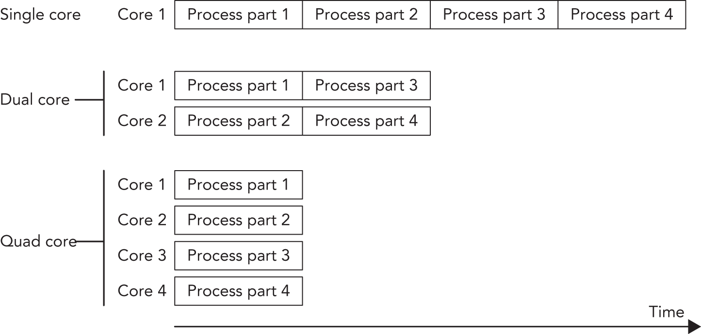
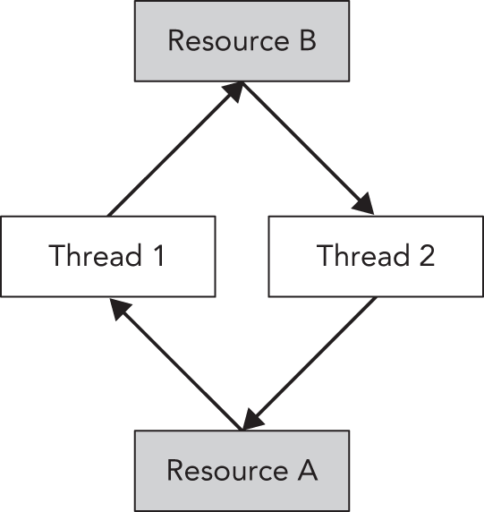
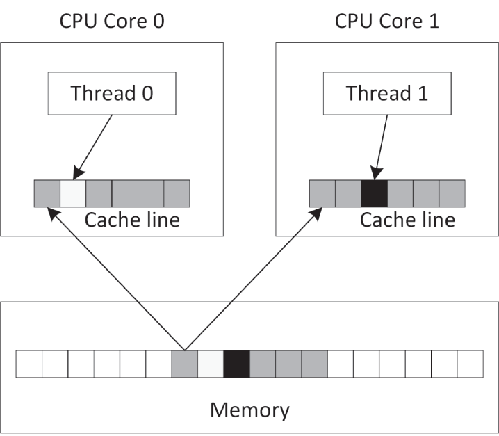
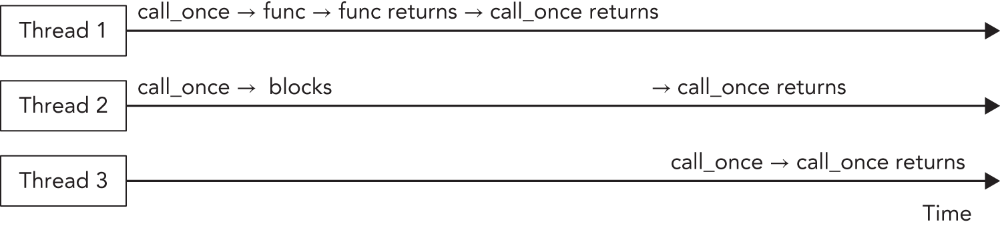

:::tip[WHAT'S IN THIS CHAPTER?]
- What multithreaded programming is
- How to launch multiple threads
- How to (sort of) cancel threads
- How to retrieve results from threads
- What deadlocks and race conditions are, and how to use mutual exclusion to prevent them
- How to use atomic types and atomic operations
- What condition variables are
- How to use semaphores, latches, and barriers
- How to use futures and promises for inter-thread communication
- What thread pools are
- What resumable functions, or coroutines, are
:::

:::tip[WILEY.COM DOWNLOADS FOR THIS CHAPTER]
Please note that all the code examples for this chapter are available as part of this chapter's code download on the book's website at `www.wiley.com/go/proc++6e` on the Download Code tab.
:::

Multithreaded programming is important on computer systems with multiple processor units. It allows you to write a program to use all those processor units in parallel. There are multiple ways for a system to have multiple processor units. The system can have multiple discrete processor chips, each one an independent central processing unit (CPU). Or, the system can have a single discrete processor chip that internally consists of multiple independent CPUs, also called *cores*. These kinds of processors are called *multicore processors*. A system can also have a combination of both. Systems with multiple processor units have existed for a long time; however, they were rarely used in consumer systems. Today, all CPU vendors are selling multicore processors, which are being used in everything from servers to consumer computers to smartphones. Because of this proliferation of multicore processors, it is important to know how to write multithreaded applications. A professional C++ programmer needs to know how to write correct multithreaded code to take full advantage of all the available processor units. Writing multithreaded applications used to rely on platform- and operating system–specific APIs. This made it difficult to write platform-independent multithreaded code. C++11 addressed this problem by including a standard threading library.

Multithreaded programming is a complicated subject. This chapter introduces multithreaded programming using the standard threading library, but it cannot go into all of the details due to space constraints. Entire books have been written about developing multithreaded programs. If you are interested in more details, consult one of the references in the multithreading section of [Appendix B](../b02), “Annotated Bibliography.”

There are also third-party C++ libraries that try to make multithreaded programming more platform independent, such as `pthreads` and the `boost::thread` library. However, because these libraries are not part of the C++ standard, they are not discussed in this book.

## INTRODUCTION

There are three major styles of executing multiple tasks:

- **Sequential execution:** Each task is executed one after the other.
- **Concurrent execution:** Multiple tasks can be executing seemingly at the same time, but this can be because the operating system is giving a task a tiny amount of time, known as a *time slice*, to do some work, then giving another task a time slice to do its work, and so on. This task switching keeps ongoing until tasks are finished.
- **Parallel execution:** Multiple tasks are truly executing at the same time for example, on multiple processor units.

Multithreaded programming allows you to execute multiple tasks concurrently (perhaps even in parallel). As a result, you can take advantage of the multiple processor units inside virtually all systems today. Two decades ago, the processor market was racing for the highest frequency, which is perfect for single-threaded applications. Around 2005, this race stopped due to a combination of power and heat management problems. Since then, the processor market is racing toward the most cores on a single processor chip. Quad- and octa-core processors are common, but processors with up to 128 and more cores are available.

Similarly, if you look at the processors on graphics cards, called graphical processing units (GPUs), you'll see that they are massively parallel processors. Today, high-end graphics cards have more than 16,000 cores, a number that keeps increasing rapidly! These graphics cards are used not only for gaming, but also to perform computationally intensive tasks, such as artificial intelligence, machine learning, image and video manipulation, protein folding (useful for discovering new drugs), processing signals as part of the Search for Extraterrestrial Intelligence (SETI) project, and so on.

C++98/03 did not have support for multithreaded programming, and you had to resort to third-party libraries or to the multithreading APIs of your target operating system. Since C++11 introduced a standard multithreading library, it became easier to write cross-platform multithreaded applications. However, the current C++ standard targets only CPUs and not GPUs. This might change in the future.

There are two reasons to start writing multithreaded code. First, if you have a computational problem and you manage to separate it into small pieces that can be run in parallel independently from each other, you can expect a huge performance boost when running it on multiple processor units. Second, you can modularize computations along orthogonal axes. For example, you can do long computations in a worker thread instead of blocking the UI thread, so the user interface remains responsive while a long computation occurs in the background.

[Figure 27.1](#c27-fig-0001) shows a situation that is perfectly suited for running in parallel. An example could be the processing of pixels of an image by an algorithm that does not require information about neighboring pixels. The algorithm could split the image into four parts. On a single-core processor, each part would be processed sequentially; on a dual-core processor, two parts would be processed in parallel; and on a quad-core processor, four parts would be processed in parallel, resulting in an almost linear scaling of the performance with the number of cores.

 


[^FIGURE 27.1]

Of course, it's not always possible to split the problem into parts that can be executed independently of each other in parallel. However, it can often be made parallel, at least partially, resulting in a performance increase. A difficult part of multithreaded programming is making your algorithm parallel, which is highly dependent on the type of the algorithm. Other difficulties are race conditions, deadlocks, tearing, and false sharing. These are discussed in the following sections. Options for making code thread-safe include:

- **Immutable data:** Constant data is inherently safe to be accessed by multiple threads.
- **Atomic operations:** These are low-level types that automatically provide thread-safe operations.
- **Mutual exclusion and other synchronization mechanisms:** These are used to coordinate access to shared data from multiple threads.
- **Thread-local storage:** Variables that are marked as `thread_local` are local to a thread; other threads don't have access to them (at least not by default), so they are generally thread-safe.

All these topics are touched upon in this chapter.

:::note
To prevent multithreading problems, try to design your programs so that multiple threads need not read and write to shared memory. Or, use a synchronization mechanism (as described in the section “[Mutual Exclusion](#c27-sec-0031)”) or atomic operations (as described in the section “[Atomic Operations Library](#c27-sec-0024)”).
:::

### Race Conditions

*Race conditions* can occur when multiple threads want to access any kind of shared resources. Race conditions in the context of memory shared by multiple threads are called *data races*. A data race can occur when multiple threads access the same variable, and at least one of those threads writes to it. For example, suppose you have a shared variable and one thread increments this value while another thread decrements it. Incrementing and decrementing the value means that the current value needs to be retrieved from memory, incremented or decremented, and stored back in memory. Most processors have `INC` and `DEC` instructions to do these operations. On modern x86 processors, these instructions are not atomic, meaning that other instructions can be executed in the middle of the operation, which might cause the code to retrieve a wrong value.

The following table shows the result when the increment is finished before the decrement starts and assumes that the initial value is 1:

| THREAD 1 (INCREMENT) | THREAD 2 (DECREMENT) |
| --- | --- |
| load value (value = 1) |  |
| increment value (value = 2) |  |
| store value (value = 2) |  |
|  | load value (value = 2) |
|  | decrement value (value = 1) |
|  | store value (value = 1) |

The final value stored in memory is 1. When the decrement thread is finished before the increment thread starts, the final value is also 1, as shown in the following table:

| THREAD 1 (INCREMENT) | THREAD 2 (DECREMENT) |
| --- | --- |
|  | load value (value = 1) |
|  | decrement value (value = 0) |
|  | store value (value = 0) |
| load value (value = 0) |  |
| increment value (value = 1) |  |
| store value (value = 1) |  |

However, when the instructions are interleaved, the result is different, as shown in the following table:

| THREAD 1 (INCREMENT) | THREAD 2 (DECREMENT) |
| --- | --- |
| load value (value = 1) |  |
| increment value (value = 2) |  |
|  | load value (value = 1) |
|  | decrement value (value = 0) |
| store value (value = 2) |  |
|  | store value (value = 0) |

The final result in this case is 0. In other words, the effect of the increment operation is lost. This is a data race.

### Tearing

*Tearing* is a specific case or consequence of a data race. There are two kinds of tearing: *torn read* and *torn write*. If a thread has written part of your data to memory, while another part hasn't been written yet, any other thread reading that data at that exact moment sees inconsistent data: a torn read. If two threads are writing to the data at the same time, one thread might have written part of the data, while another thread might have written another part of the data. The final result will be inconsistent: a torn write.

### Deadlocks

If you opt to solve a race condition by using a synchronization mechanism, such as mutual exclusion, you might run into another common problem with multithreaded programming: *deadlocks*. Two threads are deadlocked if they are both waiting for the other thread to do something. This can be extended to more than two threads. For example, if two threads want to acquire access to a shared resource, they need to ask for permission to access this resource. If one of the threads currently holds the permission to access the resource, but is blocked indefinitely for some other reason, then the other thread will block indefinitely as well when trying to acquire permission for the same resource. One mechanism to acquire permission for a shared resource is called a mutual exclusion object, or mutex for short, discussed in detail later in this chapter. For example, suppose you have two threads and two resources protected with two mutexes, A and B. Both threads acquire permission for both resources, but they acquire the permission in different order. The following table shows this situation in pseudo-code:

| THREAD 1 | THREAD 2 |
| --- | --- |
| Acquire A  Acquire B  // … computeRelease BRelease A | Acquire B  Acquire A  // … compute  Release A  Release B |

Now, imagine that the code in the two threads is executed in the following order:

- **Thread 1:** Acquire A (succeeds)
- **Thread 2:** Acquire B (succeeds)
- **Thread 1:** Acquire B (waits/blocks, because B is held by thread 2)
- **Thread 2:** Acquire A (waits/blocks, because A is held by thread 1)

Both threads are now waiting indefinitely in a deadlock situation. [Figure 27.2](#c27-fig-0002) shows a graphical representation of the deadlock. Thread 1 has acquired permission for resource A and is waiting to acquire permission for resource B. Thread 2 has acquired permission for resource B and is waiting to acquire permission for resource A. In this graphical representation, you see a cycle that depicts the deadlock. Both threads will wait indefinitely.

 


[^FIGURE 27.2]

It's best to always acquire permissions in the same order to avoid these kinds of deadlocks. You could also include mechanisms in your program to break these deadlocks. One possible solution is to try for a certain time to acquire permission for a resource. If the permission cannot be obtained within a certain time interval, the thread can stop waiting and possibly release other permissions it is currently holding. The thread can then sleep for a little bit and try again later to acquire all the resources it needs. This mechanism gives other threads the opportunity to acquire necessary permissions and continue their execution. Whether this mechanism works or not depends heavily on your specific deadlock case.

The previous paragraph describes workarounds to avoid deadlocks. These exact workarounds are implemented in the Standard Library by `std::lock`(), described later in the section “[Mutual Exclusion](#c27-sec-0031).” This function obtains permission for several resources with one call, without the risk of deadlocks. You should use `std::lock()` instead of reinventing the same workarounds. However, it's even better not to get into such a situation in the first place by avoiding having to take multiple locks at once. Ideally, try to avoid patterns that require locking at all.

### False Sharing

Most caches work with *cache lines*. For modern CPUs, cache lines are usually 64 bytes. If something needs to be written to a cache line, the entire line needs to be locked. This can bring a serious performance penalty for multithreaded code if your data structure is not properly designed. For example, if two threads are using two different pieces of data, but that data shares a cache line, then when one thread writes something, the other thread is blocked because the entire cache line is locked. [Figure 27.3](#c27-fig-0003) graphically shows the situation where two threads clearly write to two different blocks of memory while sharing a cache line.

 


[^FIGURE 27.3]

You can optimize your data structures by using explicit memory alignments to make sure data that is worked on by multiple threads does not share any cache lines. To do this in a portable manner, a constant called `hardware_destructive_interference:size`, defined in `<new>`, can be used, which returns you the minimum recommended offset between two concurrently accessed objects to avoid cache line sharing. You can use that value in combination with the `alignas` keyword to properly align your data.

## THREADS

The C++ threading library, defined in `<thread>`, makes it easy to launch new threads. You can specify what needs to be executed in the new thread in several ways. You can let the new thread execute a global function, the `operator()` of a function object, a lambda expression, or even a member function of an instance of some class. The following sections give small examples of all these techniques.

### Thread with Function Pointer

Functions such as `CreateThread()`, `_beginthread()`, and so on, on Windows, and `pthread_create()` with the `pthreads` library, require that the thread function has only one parameter. On the other hand, a function that you want to use with the standard C++ `std::thread` class can have as many parameters as you want.

Suppose you have a `counter()` function accepting two integers: the first representing an ID and the second representing the number of iterations that the function should loop. The body of the function is a single loop that loops the given number of iterations. On each iteration, a message is printed to standard output.

```cpp
void counter(int id, int numIterations)
{
    for (int i { 0 }; i < numIterations; ++i) {
        println("Counter {} has value {}", id, i);
    }
}
```

You can launch multiple threads executing this function using `std::thread`. You can create a thread `t1`, executing `counter()` with arguments 1 and 6 as follows:

```cpp
thread t1 { counter, 1, 6 };
```

The constructor of the `thread` class is a variadic template, which means that it accepts any number of arguments. Variadic templates are discussed in detail in [Chapter 26](../c26), “Advanced Templates.” The first argument is a callable object (such as a function pointer—in this example, a pointer to the function `counter()`) to execute in the new thread. Any subsequent arguments are passed to this callable when execution of the thread starts.

A `thread` object is said to be *joinable* if it represents or represented an active thread in the system. Even when the thread has finished executing, a `thread` object remains in the joinable state. A default-constructed `thread` object is *unjoinable*. Before a joinable `thread` object is destroyed, you need to make sure to call either `join()` or `detach()` on it. A call to `join()` is a blocking call: it waits until the thread has finished its work. A call to `detach()` detaches a `thread` object from its underlying OS thread, in which case the OS thread keeps running independently. Both member functions cause the thread to become unjoinable. If a `thread` object that is still joinable is destroyed, the destructor calls `std::terminate()`, which abruptly terminates all threads and the application itself. The reason for this behavior is that destroying a thread without joining it is almost certainly a bug, and terminating the program is the best available way for the library to indicate the problem.

The following code launches two threads executing the `counter()` function. After launching the threads, 
`join()` is called on both threads.

```cpp
thread t1 { counter, 1, 6 };
thread t2 { counter, 2, 4 };
t1.join();
t2.join();
```

A possible output of this example looks as follows:

```cpp
Counter 2 has value 0
Counter 1 has value 0
Counter 1 has value 1
Counter 1 has value 2
Counter 1 has value 3
Counter 1 has value 4
Counter 1 has value 5
Counter 2 has value 1
Counter 2 has value 2
Counter 2 has value 3
```

The output on your system will be different, and it will most likely be different every time you run it. This is because two threads are executing the `counter()` function at the same time, so the output depends on the number of processing cores in your machine and on the thread scheduling of the operating system.

Calling `print()` or `println()` from different threads is thread-safe and doesn't cause any data races. However, if you change the single `println()` statement in `counter()` to the following:

```cpp
print("Counter {} has value {}", id, i);
println("");
```

Or:

```cpp
cout << format("Counter {} has value {}", id, i) << endl;
```

Or:

```cpp
cout << format("Counter {} has value {}", id, i);
cout << endl;
```

Then, even though there are still no data races, output from different threads can be interleaved! This means that the output can be mixed together as follows:

```cpp
Counter 1 has value 0Counter 2 has value 0
 
Counter 2 has value 1
Counter 2 has value 2Counter 1 has value 1
…
```

This can be fixed using synchronization mechanisms, which are discussed later in this chapter.

:::note
Thread function arguments are always copied into some internal storage for the thread. Use `std::ref()` or `std::cref()` from `<functional>` to pass them by reference.
:::

### Thread with Function Object

Instead of using function pointers, you can also use a function object to execute in a thread. With the function pointer technique of the previous section, the only way to pass information to the thread is by passing arguments to the function. With function objects, you can add data members to your function object class, which you can initialize and use however you want. The following example first defines a class called `Counter`, which has two data members: an ID and the number of iterations for the loop. Both variables are initialized with the constructor. To make the `Counter` class a function object, you need to implement `operator()`, as discussed in [Chapter 19](../c19), “Function Pointers, Function Objects, and Lambda Expressions.” The implementation of `operator()` is the same as the `counter()` function from the previous section. Here is the code:

```cpp
class Counter
{
    public:
        explicit Counter(int id, int numIterations)
            : m_id { id }, m_numIterations { numIterations } { }
 
        void operator()() const
        {
            for (int i { 0 }; i < m_numIterations; ++i) {
                println("Counter {} has value {}", m_id, i);
            }
        }
    private:
        int m_id { 0 };
        int m_numIterations { 0 };
};
```

Two techniques for initializing threads with a function object are demonstrated in the following code snippet. The first technique uses the uniform initialization syntax. You create an instance of `Counter` with its constructor arguments and give it to the `thread` constructor between curly braces. The second technique defines a named instance of `Counter` and gives this named instance to the constructor of the `thread` class.

```cpp
// Using uniform initialization syntax.
thread t1 { Counter { 1, 20 } };
 
// Using named variable.
Counter c { 2, 12 };
thread t2 { c };
 
// Wait for threads to finish.
t1.join();
t2.join();
```

:::note
Function objects are always copied into some internal storage for the thread. If you want to execute `operator()` on a specific instance of your function object instead of on a copy, you should use one of the `std::ref()` or `std::cref()` helper functions from `<functional>` to pass your instance by reference, for example:
:::

### Thread with Lambda

Lambda expressions fit nicely with the standard C++ threading library. Here is an example that launches a thread to execute a given lambda expression:

```cpp
int id { 1 };
int numIterations { 5 };
thread t1 { [id, numIterations] {
    for (int i { 0 }; i < numIterations; ++i) {
        println("Counter {} has value {}", id, i);
    }
} };
t1.join();
```

### Thread with Member Function Pointer

You can specify a member function of a class to be executed in a thread. The following example defines a basic `Request` class with a `process()` member function. The `main()` function creates an instance of the `Request` class and launches a new thread, which executes the `process()` member function of the `Request` instance `req`.

```cpp
class Request
{
    public:
        explicit Request(int id) : m_id { id } { }
        void process() { println("Processing request {}", m_id); }
    private:
        int m_id { 0 };
};
 
int main()
{
    Request req { 100 };
    thread t { &Request::process, &req };
    t.join();
}
```

With this technique, you are executing a member function on a specific object in a separate thread. If other threads are accessing the same object, you need to make sure this happens in a thread-safe way to avoid data races. Mutual exclusion, discussed later in this chapter, can be used as a synchronization mechanism to make it thread-safe.

### Thread-Local Storage

The C++ standard supports *thread-local storage*. With a keyword called `thread_local`, you can mark any variable as thread-local, which means that each thread will have its own unique copy of the variable, and it will last for the entire duration of the thread. For each thread, the variable is initialized exactly once. For example, the following code defines two global variables, `k` and `n`. Every thread shares one—and only one—copy of `k`, while each thread has its own unique copy of `n`.

```cpp
int k;
thread_local int n;
```

The following code snippet verifies this. `threadFunction()` prints the current values for `k` and `n`, and then increments them both. The `main()` function launches a first thread, waits for it to finish, and then launches a second thread.

```cpp
void threadFunction(int id)
{
    println("Thread {}: k={}, n={}", id, k, n);
    ++n;
    ++k;
}
 
int main()
{
    thread t1 { threadFunction, 1 }; t1.join();
    thread t2 { threadFunction, 2 }; t2.join();
}
```

From the following output, it's clear that there is only a single instance of `k` shared across all threads, while each thread has its own copy of `n`.

```cpp
Thread 1: k=0, n=0
Thread 2: k=1, n=0
```

The previous paragraphs show how `thread_local` works for global variables. It also works for `static` data members of classes and `static` local variables of functions. Inside a function, and only inside a function, declaring a variable as `thread_local` implies `static`, but it's recommended to be explicit about this. Here are some examples:

```cpp
static thread_local int x1;     // OK, internal linkage (See Chapter 11)
thread_local int x2;            // OK, external linkage (See Chapter 11)
 
class Foo
{
    static thread_local int x3; // OK
    thread_local int x4;        // Error!
};
 
void f()
{
    static thread_local int x5; // OK
    thread_local int x6;        // OK, implicitly static!
}
```

### Canceling Threads

The C++ standard does not include any mechanism for canceling a running `thread` from another thread. One (partial) solution is to use the `jthread` class, discussed in the next section. If that's not an option, then the best way to achieve this is to provide some communication mechanism that the two threads agree upon. The simplest mechanism is to have a shared variable, which the target thread checks periodically to determine if it should terminate. Other threads can set this shared variable to indirectly instruct the thread to shut down. You have to be careful here, because this shared variable is being accessed by multiple threads, of which at least one is writing to the shared variable. To make this thread safe, it's recommended to use atomic variables or condition variables, both discussed later in this chapter.

### Automatically Joining Threads

As discussed earlier, if a `thread` instance is destroyed that is still joinable, the C++ runtime calls `std::terminate()` to terminate the application. `<thread>` also defines `std::jthread`, which is virtually identical to `thread`, except:

- It automatically joins in its destructor.
- It supports cooperative cancellation.

#### Cooperative Cancellation

The cancellation support of `jthread` is called *cooperative cancellation* because a thread that supports cancellation needs to periodically check if it needs to cancel itself. Before an example can be given, two important classes need to be introduced, both defined in `<stop_token>`:

- **`std::stop_token`:** Supports actively checking for a cancellation request. A cancellable thread needs to periodically call `stop_requested()` on a `stop_token` to find out if it needs to stop its work. A `stop_token` can be used with a `condition_variable_any` so a thread can wake up when it needs to stop.
- **`std::stop_source`:** Used to request a thread to cancel its execution. This is done by calling the `request_stop()` member function on a `stop_source`. If a `stop_source` is used to request a cancellation, that stop request is visible to all associated `stop_source`s and `stop_token`s. The `stop_requested()` member function can be used to check whether a stop has already been requested.

If you have a `jthread` instance, you can get access to its `stop_token` and `stop_source` by using the `get_stop_token()` and `get_stop_source()` member functions. Additionally, the callable passed to a constructor of `jthread` can have a `stop_token` as its first parameter.

Let's look at an example. The following code defines a `threadFunction()` callable that accepts a `stop_token` as its first parameter. Because this is cooperative cancellation, the body of this thread function uses that `stop_token` to check whether it needs to cancel itself. This code uses `std::this_thread::sleep_for()` to introduce a small delay in each loop. The argument to `sleep_for()` is an `std::chrono::duration`; see [Chapter 22](../c22), “Date and Time Utilities.”

```cpp
void threadFunction(stop_token token, int id)
{
    while (!token.stop_requested()) {
        println("Thread {} doing some work.", id);
        this_thread::sleep_for(500ms);
    }
    println("Stop requested for thread {}.", id);
}
```

The following `main()` function creates two `jthread` instances to execute `threadFunction()`, sleeps for two seconds, writes a message that it's ending, and asks both threads to stop:

```cpp
int main()
{
    jthread job1 { threadFunction, 1 };
    jthread job2 { threadFunction, 2 };
 
    this_thread::sleep_for(2s);
    println("main() is ending.");
 
    job1.request_stop();
    job2.request_stop();
}
```

The following is a possible output of this program:

```cpp
Thread 2 doing some work.
Thread 1 doing some work.
Thread 2 doing some work.
Thread 1 doing some work.
Thread 2 doing some work.
Thread 1 doing some work.
Thread 2 doing some work.
Thread 1 doing some work.
main() is ending.
Stop requested for thread 2.
Stop requested for thread 1.
```

The destructor of `jthread` automatically requests its thread to stop executing before joining it, so the previous `main()` function can be simplified slightly by omitting the two calls to `request_stop()`.

### Retrieving Results from Threads

As you saw in the previous examples, launching a new thread is pretty easy. However, in most cases you are probably interested in results produced by the thread. For example, if your thread performs some mathematical calculations, you really would like to get the results out of the thread once the thread is finished. One way is to pass a pointer or reference to a result variable to the thread in which the thread stores the results. Another technique is to store the results inside class data members of a function object, which you can retrieve later once the thread has finished executing. This works only if you use `std::ref()` to pass your function object by reference to the `jthread` constructor. Here is an example:

```cpp
class Calculator
{
    public:
        explicit Calculator(int a, int b) : m_a { a }, m_b { b } {}
        void operator()() { result = m_a * m_b; }
        int getResult() const { return result; }
    private:
        int m_a { 0 };
        int m_b { 0 };
        int result { 0 };
};
int main()
{
    Calculator calculator { 21, 2 };
    jthread job { ref(calculator) };
    job.join();
    println("21*2 = {}", calculator.getResult());
}
```

This correctly outputs:

```cpp
21*2 = 42
```

If you don't use `ref()` and initialize `job` as follows, then the output will be `21*2 = 0`:

```cpp
jthread job { calculator };
```

However, there is another easier mechanism to obtain a result from threads: *futures*. Futures also make it easier to handle errors that occur inside your threads. They are discussed later in this chapter.

### Copying and Rethrowing Exceptions

The whole exception mechanism in C++ works perfectly fine, as long as it stays within one single thread. Every thread can throw its own exceptions, but they need to be caught within their own thread. If a thread throws an exception and it is not caught inside the thread, the C++ runtime calls `std::terminate()`, which terminates the whole application. Exceptions thrown in one thread cannot be caught in another thread. This introduces quite a few problems when you would like to use exception handling in combination with multithreaded programming.

Without the standard threading library, it's difficult if not impossible to gracefully handle exceptions across threads. The standard threading library solves this issue with the following exception-related functions. These functions work not only with `std::exception`s, but also with other kinds of exceptions, `int`s, `string`s, custom exceptions, and so on:

- `exception_ptr current_exception() noexcept;`

  Intended to be called from inside a catch block. Returns an `exception_ptr` object that refers to the exception currently being handled, or a copy of the currently handled exception. A null `exception_ptr` object is returned if no exception is being handled. This referenced exception object is reference counted, similar to `std::shared_ptr`, and remains valid for as long as there is an object of type `exception_ptr` that is referencing it.
- `[[noreturn]] void rethrow_exception(exception_ptr p);`

  Rethrows the exception referenced by the `exception_ptr` parameter (which must not be null). Rethrowing the referenced exception does not have to be done in the same thread that generated the referenced exception in the first place, which makes this feature perfectly suited for handling exceptions across different threads. The `[[noreturn]]` attribute makes it clear that this function never returns normally.
- `template<class E> exception_ptr make_exception_ptr(E e) noexcept;`

  Creates an `exception_ptr` object that refers to a copy of the given exception object. This is basically a shorthand notation for the following code:

```cpp
try { throw e; }
catch(…) { return current_exception(); }
```

Let's see how handling exceptions across different threads can be implemented using these functions. The following code defines a function that does some work and throws an exception. This function will ultimately be running in a separate thread.

```cpp
void doSomeWork()
{
    for (int i { 0 }; i < 5; ++i) { println("{}", i); }
    println("Thread throwing a runtime_error exception…");
    throw runtime_error { "Exception from thread" };
}
```

The following `threadFunc()` function wraps the call to the preceding function in a `try/catch` block, catching all exceptions that `doSomeWork()` might throw. A single argument is supplied to `threadFunc()`, which is of type `exception_ptr&`. Once an exception is caught, the function `current_exception()` is used to get a reference to the exception being handled, which is then assigned to the `exception_ptr` parameter. After that, the thread exits normally.

```cpp
void threadFunc(exception_ptr& err)
{
    try {
        doSomeWork();
    } catch (…) {
        println("Thread caught exception, returning exception…");
        err = current_exception();
    }
}
```

The following `doWorkInThread()` function is called from within the main thread. Its responsibility is to create a new thread and start executing `threadFunc()` in it. A reference to an object of type `exception_ptr` is given as an argument to `threadFunc()`. Once the thread is created, the `doWorkInThread()` function waits for the thread to finish by using the `join()` member function, after which the error object is examined. Because `exception_ptr` is of type `NullablePointer`, you can easily check it using an `if` statement. If it's a non-null value, the exception is rethrown in the current thread, which is the main thread in this example. Because you are rethrowing the exception in the main thread, the exception has been transferred from one thread to another thread.

```cpp
void doWorkInThread()
{
    exception_ptr error;
    // Launch thread.
    jthread t { threadFunc, ref(error) };
    // Wait for thread to finish.
    t.join();
    // See if thread has thrown any exception.
    if (error) {
        println("Main thread received exception, rethrowing it…");
        rethrow_exception(error);
    } else {
        println("Main thread did not receive any exception.");
    }
}
```

The `main()` function is pretty straightforward. It calls `doWorkInThread()` and wraps the call in a `try/catch` block to catch exceptions thrown by the thread spawned by `doWorkInThread()`.

```cpp
int main()
{
    try {
        doWorkInThread();
    } catch (const exception& e) {
        println("Main function caught: '{}'", e.what());
    }
}
```

The output is as follows:

```cpp
0
1
2
3
4
Thread throwing a runtime_error exception…
Thread caught exception, returning exception…
Main thread received exception, rethrowing it…
Main function caught: 'Exception from thread'
```

To keep the examples in this chapter compact and to the point, their `main()` functions usually use `join()`, either explicitly or implicitly with `jthread`, to block the main thread and to wait until threads have finished. Of course, in real-world applications you do not want to block your main thread. For example, in a GUI application, blocking your main thread means that the UI becomes unresponsive. In that case, you can use a messaging paradigm to communicate between threads. For example, the earlier `threadFunc()` function could send a message to the UI thread with as argument a copy of the result of `current_exception()`.

## ATOMIC OPERATIONS LIBRARY

*Atomic types* allow *atomic access*, which means that concurrent reading and writing without additional synchronization is allowed. Without atomic operations, incrementing a variable is not thread-safe because the compiler first loads the value from memory into a register, increments it, and then stores the result back in memory. Another thread might touch the same memory during this increment operation, which is a data race. For example, the following code is not thread-safe and contains a data race. This type of data race is discussed in the beginning of this chapter.

```cpp
int counter { 0 };   // Global variable
…
++counter;           // Executed in multiple threads
```

You can use the `std::atomic` class template, defined in `<atomic>`, to make this thread-safe without explicitly using any synchronization mechanism. Here is the same code using an atomic integer:

```cpp
atomic<int> counter { 0 } ;  // Global variable
…
++counter;                   // Executed in multiple threads
```

`<atomic>` also defines named integral atomic types for all primitive types. The following table lists just a few:

| NAMED ATOMIC TYPE | EQUIVALENT STD::ATOMIC TYPE |
| --- | --- |
| atomic\_bool | atomic<bool> |
| atomic\_char | atomic<char> |
| atomic\_uchar | atomic<unsigned char> |
| atomic\_int | atomic<int> |
| atomic\_uint | atomic<unsigned int> |
| atomic\_long | atomic<long> |
| atomic\_ulong | atomic<unsigned long> |
| atomic\_llong | atomic<long long> |
| atomic\_ullong | atomic<unsigned long long> |
| atomic\_wchar\_t | atomic<wchar\_t> |
| atomic_flag | (none) |

You can use atomic types without explicitly using any synchronization mechanism. However, underneath, operations on atomics of a certain type might use a synchronization mechanism such as a mutex. This might happen, for example, when the hardware you are targeting lacks the necessary instructions to perform an operation atomically. You can use the `is_lock_free()` member function on an atomic type to query whether it supports lock-free operations, that is, whether all of its operations run without any explicit synchronization mechanism underneath. There is also a `static` constant called `atomic<T>::is_always_lock_free`, which is `true` if the `atomic<T>` is always lock free, and `false` otherwise.

The `std::atomic` class template can be used with all kinds of types, not only integral types. For example, you can create an `atomic<double>`, or an `atomic<MyType>`, but only if `MyType` is trivially copyable. Depending on the size of the specified type, underneath these might require explicit synchronization mechanisms. In the following example, both `Foo` and `Bar` are trivially copyable, that is, `std::is_trivially_copyable_v` is `true` for both. However, due to the size of `Foo`, `atomic<Foo>` is not lock-free, while `atomic<Bar>` is.

```cpp
struct Foo { int m_array[123]; };
struct Bar { int m_int; };
 
int main()
{
    atomic<Foo> f;
    println("{} {}", is_trivially_copyable_v<Foo>, f.is_lock_free()); // true false
 
    atomic<Bar> b;
    println("{} {}", is_trivially_copyable_v<Bar>, b.is_lock_free()); // true true
}
```

When accessing a piece of data from multiple threads, atomics also solve issues with memory ordering, compiler optimizations, and so on. Basically, it's virtually never safe to read and write to the same piece of data from multiple threads without using atomics or explicit synchronization mechanisms!

:::note
Memory ordering is the order in which memory is accessed. In the absence of any atomics and other synchronization mechanisms, compilers and hardware are allowed to reorder memory accesses as long as this does not affect the outcome. This is known as the as-if rule, but can cause problems in multithreaded environments.
:::

`atomic_flag` is an atomic Boolean, always lock-free, guaranteed by the C++ standard. It differs from `atomic<bool>` in that it does not provide an assignment operator; instead, it provides named member functions `clear()`, `test()`, and `test_and_set()`. An example of using `atomic_flag` is given in the mutual exclusion section for the implementation of a spinlock later in this chapter.

### Atomic Operations

The C++ standard defines a number of special operations on `atomic<T>`. This section describes a few of those operations. For a full list, consult a Standard Library Reference (see [Appendix B](../b02)).

Our first example of an atomic operation is the following:

```cpp
bool atomic<T>::compare_exchange_strong(T& expected, T desired);
```

The logic implemented atomically by this operation is as follows, in pseudo-code:

```cpp
if (*this == expected) {
    *this = desired;
    return true;
} else {
    expected = *this;
    return false;
}
```

Although this logic might seem fairly strange on first sight, this operation is a key building block for doing any complicated operation on atomics. Here is an example that atomically multiplies an `atomic<int>` with a given number:

```cpp
void atomicallyMultiply(atomic<int>& a, int n)
{
    int expected { a.load() };
    int desired { n * expected };
    while (!a.compare_exchange_strong(expected, desired)) {
        desired = n * expected;
    }
}
 
int main()
{
    atomic<int> value { 10 };
    println("Value = {}", value.load());
    atomicallyMultiply(value, 3);
    println("Result = {}", value.load());
}
```

A second example is `atomic<T>::fetch_add()`. It fetches the current value of the atomic type, adds the given increment to the atomic value, and returns the original non-incremented value. Here is an example:

```cpp
atomic<int> value { 10 };
println("Value = {}", value.load());
int fetched { value.fetch_add(4) };
println("Fetched = {}", fetched);
println("Value = {}", value.load());
```

If no other threads are touching the contents of the `fetched` and `value` variables, the output is as follows:

```cpp
Value = 10
Fetched = 10
Value = 14
```

Atomic integral types support the following atomic operations: `fetch_add()`, `fetch_sub()`, `fetch_and()`, `fetch_or()`, `fetch_xor()`, `++`, `--`, `+=`, `-=`, `&=`, `^=`, and `|=`. Atomic pointer types support `fetch_add()`, `fetch_sub()`, `++`, `--`, `+=`, and `-=`. Atomic floating-point types support `fetch_add()` and `fetch_sub()`.

Most of the atomic operations can accept an extra parameter specifying the memory ordering that you would like. Here is an example:

```cpp
T atomic<T>::fetch_add(T value, memory_order = memory_order_seq_cst);
```

You can change the default `memory_order`. The C++ standard provides `memory_order_relaxed`, `memory_order_consume`, `memory_order_acquire`, `memory_order_release`, `memory_order_acq_rel`, and `memory_order_seq_cst`, all of which are defined in the `std` namespace. However, you will rarely want to use them instead of the default, unless you're an expert in this domain. While another memory order may perform better than the default according to some metrics, if you use them in a slightly incorrect way, you will again introduce data races or other difficult-to-debug threading-related problems. If you do want to know more about memory orderings, consult one of the multithreading references in [Appendix B](../b02).

### Atomic Smart Pointers

`atomic<std::shared_ptr<T>>` is supported. The control block of a `shared_ptr`, which stores the reference count, among other things, has always been thread-safe, which guarantees that the pointed-to object is deleted exactly once. However, anything else from a `shared_ptr` is not thread-safe. Using the same `shared_ptr` instance concurrently from multiple threads causes data races if non-`const` member functions are called on that `shared_ptr` instance, such as calling `reset()`, assignment, `swap()`, and so on. On the other hand, when using the same `atomic<shared_ptr<T>>` instance from multiple threads, even calling non-`const shared_ptr` member functions is thread-safe. Note that calling non-`const` member functions on the object pointed to by the `shared_ptr` is still not thread-safe and requires manual synchronization.

### Atomic References

`std::atomic_ref` is basically the same as `std::atomic`, even with the same interface, but it works with references, while `atomic` always makes a copy of the value it is provided with. An `atomic_ref` instance itself should have a shorter lifetime than the object it references. An `atomic_ref` is copyable, and you can create as many `atomic_ref` instances as you want referring to the same object. Loads and stores done through instances of `atomic_ref` will be atomic and do not race with each other. Loads and stores done concurrently without going through `atomic_ref` can still race with those atomic accesses. The `atomic_ref<T>` class template can be used with any trivially copyable type `T`, just as `std::atomic` can. Additionally, the Standard Library provides the following:

- Partial specializations for pointer types, supporting `fetch_add()` and `fetch_sub()`
- Full specializations for integral types, supporting `fetch_add()`, `fetch_sub()`, `fetch_and()`, `fetch_or()`, and `fetch_xor()`
- Full specializations for floating-point types, supporting `fetch_add()` and `fetch_sub()`

The following section gives an example of how to use an `atomic_ref`.

### Using Atomic Types

This section explains in more detail why you should use atomic types. Suppose you have the following function called `increment()` that increments an integer reference parameter in a loop.

```cpp
void increment(int& counter)
{
    for (int i { 0 }; i < 100; ++i) {
        ++counter;
        this_thread::sleep_for(1ms);
    }
}
```

Now, you would like to run several threads in parallel, all executing this `increment()` function on a shared `counter` variable. By implementing this naively without atomic types or without any kind of thread synchronization, you introduce data races. The following code launches 10 `increment()` threads, after which it waits for all threads to finish by calling `join()` on each thread, and then prints the result:

```cpp
int main()
{
    int counter { 0 };
    vector<jthread> threads;
    for (int i { 0 }; i < 10; ++i) {
        threads.emplace:back(increment, ref(counter));
    }
 
    for (auto& t : threads) { t.join(); }
    println("Result = {}", counter);
}
```

Because `increment()` increments its `counter` parameter 100 times, and 10 threads are launched, each of which executes `increment()` on the same shared `counter`, you might expect the final result to be 1,000. If you execute this program several times, you might get the following output but with different values:

```cpp
Result = 982
Result = 977
Result = 984
```

This code is clearly showing a data race: `counter` is written concurrently from multiple threads without any synchronization. In this example, you can use an atomic type to fix the code. The following code highlights the required changes:

```cpp
void increment(atomic<int>& counter)
{
    for (int i { 0 }; i < 100; ++i) {
        ++counter;
        this_thread::sleep_for(1ms);
    }
}
 
int main()
{
    atomic<int> counter { 0 };
    vector<jthread> threads;
    for (int i { 0 }; i < 10; ++i) {
        threads.emplace:back(increment, ref(counter));
    }
    for (auto& t : threads) { t.join(); } 
    println("Result = {}", counter);
}
```

The only modification is changing the type of the shared `counter` to `std::atomic<int>` instead of `int`. When you run this modified version, you always get 1,000 as the result:

```cpp
Result = 1000
Result = 1000
Result = 1000
```

Without explicitly adding any synchronization mechanism to the code, it is now thread safe and data race free because the `++counter` operation on an atomic type loads, increments, and stores the value in one atomic transaction, which cannot be interrupted.

With `atomic_ref`, you can solve the data race as follows:

```cpp
void increment(int& counter)
{
    atomic_ref<int> atomicCounter { counter };
    for (int i { 0 }; i < 100; ++i) {
        ++atomicCounter;
        this_thread::sleep_for(1ms);
    }
}
 
int main()
{
    int counter { 0 };
    vector<jthread> threads;
    for (int i { 0 }; i < 10; ++i) {
        threads.emplace:back(increment, ref(counter));
    }
    for (auto& t : threads) { t.join(); } 
    println("Result = {}", counter);
}
```

However, there is a new problem with both of these modified implementations: a performance problem. You should try to minimize the amount of synchronization, either atomic or explicit synchronization, because it lowers performance. For this simple example, the best and recommended solution is to let `increment()` calculate its result in a local variable and only after the loop add it to the `counter` reference. Even then, it is still required to use an `atomic` or `atomic_ref` type, because you are still writing to `counter` from multiple threads.

```cpp
void increment(atomic<int>& counter)
{
    int result { 0 };
    for (int i { 0 }; i < 100; ++i) {
        ++result;
        this_thread::sleep_for(1ms);
    }
    counter += result;
}
```

### Waiting on Atomic Variables

The following wait-related member functions are available for `std::atomic` and `atomic_ref` to efficiently wait until an atomic variable is modified:

| MEMBER FUNCTION | DESCRIPTION |
| --- | --- |
| wait(oldValue) | Blocks the thread until another thread calls notify_one() or `notify_all()`, and the value of the atomic variable has changed, that is, is not equal to `oldValue` anymore. If the current value is already unequal to `oldValue`, then the function doesn't block at all. |
| notify\_one() | Wakes up one thread that is blocking on a wait() call. |
| notify_all() | Wakes up all threads blocking on a wait() call. |

Here is an example:

```cpp
atomic<int> value { 0 };
 
jthread job { [&value] {
    println("Thread starts waiting.");
    value.wait(0);
    println("Thread wakes up, value = {}", value.load());
} };
 
this_thread::sleep_for(2s);
 
println("Main thread is going to change value to 1.");
value = 1;
value.notify_all();
```

The output is as follows:

```cpp
Thread starts waiting.
Main thread is going to change value to 1.
Thread wakes up, value = 1
```

## MUTUAL EXCLUSION

If you are writing multithreaded applications, you have to be sensitive to the sequencing of operations. If your threads read and write shared data, this can be a problem. There are many ways to avoid this problem, such as never actually sharing data between threads. However, if you can't avoid sharing data, you must provide for synchronization so that only one thread at a time can change the data.

Scalars such as Booleans and integers can often be synchronized properly with atomic operations, as described earlier; however, when your data is more complex and you need to use that data from multiple threads, you can provide explicit synchronization.

The Standard Library has support for mutual exclusion in the form of *mutex* and *lock* classes. These can be used to implement synchronization between threads and are discussed in the following sections.

### Mutex Classes

Mutex stands for *mut*ual *ex*clusion. The basic mechanism of using a mutex is as follows:

- A thread that wants to access (read or write) memory shared with other threads tries to lock the mutex object. If another thread is currently holding this lock, the new thread that wants to gain access blocks until the lock is released or until a timeout interval expires.
- Once the thread has obtained the lock, it is free to use the shared memory. Of course, this assumes that all threads that want to use the shared data participate in the mutex-locking scheme.
- After the thread is finished reading/writing to the shared memory, it releases its lock to give some other thread an opportunity to obtain a lock on the mutex. If two or more threads are waiting on the lock, there are no guarantees as to which thread will be granted the lock and thus allowed to proceed.

The C++ Standard Library provides *non-timed* and *timed mutex* classes, both in a *recursive* and *non-recursive* flavor. Before we discuss all these options, let's first have a look at a concept called a *spinlock*.

#### Spinlock

A spinlock is a synchronization mechanism where a thread uses a busy loop (spinning) to try to acquire a lock, performs its work, and releases the lock. While spinning, the thread remains active but is not doing any useful work. A mutex, on the other hand, might block the thread if the lock cannot be acquired immediately. Blocking a thread is an expensive operation that is avoided with a spinlock. Spinlocks can be useful in situations where you know the lock is going to be held for only a short time. Spinlocks can be implemented entirely in your own code. As the following code snippet demonstrates, a spinlock can be implemented using a single atomic type: `atomic_flag`. The spinlock-related code is highlighted.

```cpp
static constexpr unsigned NumberOfThreads { 50 };
static constexpr unsigned LoopsPerThread { 100 };
 
void dowork(unsigned threadNumber, vector<unsigned>& data, <b>atomic_flag& spinlock)</b>
{
    for (unsigned i { 0 }; i < LoopsPerThread; ++i) {
        while (spinlock.test_and_set()) { } // Spins until lock is acquired.
        // Safe to handle shared data…
        data.push_back(threadNumber);
        spinlock.clear();                   // Releases the acquired lock.
    }
}
 
int main()
{
    vector<unsigned> data;
<?b Start?>    atomic_flag dataSpinlock;<?b End?>
    vector<jthread> threads;
    for (unsigned i { 0 }; i < NumberOfThreads; ++i) {
        threads.emplace:back(dowork, i, ref(data), <?b Start?>ref(dataSpinlock))<?b End?>;
    }
    for (auto& t : threads) { t.join(); }
    println("data contains {} elements, expected {}.", data.size(),
        NumberOfThreads * LoopsPerThread);
}
```

In this code, each thread tries to acquire a lock by repeatedly calling `test_and_set()` on an `atomic_flag` until it succeeds. This is the busy loop.

:::warning
As spinlocks use a busy waiting loop, they should be an option only when you know for sure that threads will lock the spinlock only for brief moments of time.
:::

Let's now look at which mutex classes the Standard Library provides.

#### Non-timed Mutex Classes

The Standard Library has three non-timed mutex classes: `std::mutex`, `recursive_mutex`, and `shared_mutex`. The first two classes are defined in `<mutex>`, and the last one in `<shared_mutex>`. Each mutex supports the following member functions:

- **`lock():`** The calling thread tries to obtain the lock and blocks until the lock has been acquired. It blocks indefinitely. If there is a desire to limit the amount of time the thread blocks, you should use a timed mutex, discussed in the next section.
- **`try_lock():`** The calling thread tries to obtain the lock. If the lock is currently held by another thread, the call returns immediately. If the lock has been obtained, `try_lock()` returns `true`; otherwise, it returns `false`.
- **`unlock():`** The calling thread releases the lock it currently holds, making it available for another thread.

`std::mutex` is a standard mutual exclusion class with exclusive ownership semantics. There can be only one thread owning the mutex. If another thread wants to obtain ownership of this mutex, it either blocks when using `lock()` or fails when using `try_lock()`. A thread already having ownership of a `mutex` is not allowed to call `lock()` or `try_lock()` again on that mutex. This might lead to a deadlock!

`std::recursive_mutex` behaves almost identically to `mutex`, except that a thread already having ownership of a recursive mutex is allowed to call `lock()` or `try_lock()` again on the same recursive mutex. The calling thread should call the `unlock()` member function as many times as it obtained a lock on the recursive mutex.

The `shared_mutex` class supports the concept of *shared lock ownership*, also known as *readers-writer lock*. A thread can get either *exclusive ownership* or *shared ownership* of the lock. Exclusive ownership, also known as a *write lock*, can be acquired only when there are no other threads having exclusive or shared ownership. Shared ownership, also known as a *read lock*, can be acquired if there is no other thread having exclusive ownership, even if other threads have already acquired their own shared ownership. The `shared_mutex` class supports `lock()`, `try_lock()`, and `unlock()`. These member functions acquire and release exclusive locks. Additionally, they have the following shared ownership-related member functions: `lock_shared()`, `try_lock_shared()`, and `unlock_shared()`. These work similarly to the other set of member functions but try to acquire or release shared ownership.

A thread already having a lock on a `shared_mutex` is not allowed to try to acquire a second lock on that mutex. This might lead to a deadlock!

Before examples on how to use these mutex classes can be given, a couple of other topics need to be discussed first. Hence, examples are discussed in the section “[Examples Using Mutexes](#c27-sec-0046)” later in this chapter.

:::warning
Do not manually call the previously discussed lock and unlock member functions on any of the mutex classes discussed in this section and the next one. Mutex locks are resources, and, like all resources, they should almost exclusively be acquired using the Resource Acquisition Is Initialization (RAII) paradigm; see [Chapter 32](../c32), “Incorporating Design Techniques and Frameworks.” The C++ Standard Library provides a number of RAII lock classes, which are discussed in the “Locks” section later in this chapter. Using them is critical to avoid deadlocks. They automatically unlock a mutex when a lock object goes out of scope, so you don't need to remember to manually call `unlock()` at the right time.
:::

#### Timed Mutex Classes

When calling `lock()` on any of the previously discussed mutex classes, the call blocks until the lock can be obtained. On the other hand, calling `try_lock()` on those mutex classes tries to acquire a lock but returns immediately if not successful. There are also *timed mutex classes* that can try to obtain a lock but give up after a certain amount of time.

The Standard Library provides three timed mutex classes: `std::timed_mutex`, `recursive_timed_mutex`, and `shared_timed_mutex`. The first two classes are defined in `<mutex>`, and the last one in `<shared_mutex>`. They all support the `lock()`, `try_lock()`, and `unlock()` member functions; and `shared_timed_mutex` also supports `lock_shared()`, `try_lock_shared()`, and `unlock_shared()`. All these behave the same as described in the previous section. Additionally, they support the following member functions:

- **`try_lock_for(rel_time):`** The calling thread tries to obtain the lock for a certain relative time. If the lock could not be obtained after the given timeout, the call fails and returns `false`. If the lock could be obtained within the timeout, the call succeeds and returns `true`. The timeout is specified as an `std::chrono::duration`; see [Chapter 22](../c22).
- **`try_lock_until(abs_time):`** The calling thread tries to obtain the lock until the system time equals or exceeds the specified absolute time. If the lock could be obtained before this time, the call returns `true`. If the system time passes the given absolute time, the function stops trying to obtain the lock and returns `false`. The absolute time is specified as an `std::chrono::time_point`; see [Chapter 22](../c22).

A `shared_timed_mutex` also supports `try_lock_shared_for()` and `try_lock_shared_until()`.

A thread already having ownership of a `timed_mutex` or a `shared_timed_mutex` is not allowed to acquire the lock a second time on that mutex. This might lead to a deadlock!

A `recursive_timed_mutex` allows a thread to acquire a lock multiple times, just as with `recursive_mutex`.

### Locks

A *lock* class is an RAII class that makes it easier to correctly obtain and release a lock on a mutex; the destructor of the lock class automatically releases the associated mutex. The C++ standard defines four types of locks: `std::lock_guard`, `unique_lock`, `shared_lock`, and `scoped_lock`.

#### lock_guard

`lock_guard`, defined in `<mutex>`, is a simple lock with two constructors:

- `explicit lock_guard(mutex_type& m);`

  Constructor accepting a reference to a mutex. Tries to obtain a lock on the mutex and blocks until the lock is obtained.
- `lock_guard(mutex_type& m, adopt_lock_t);`

  Constructor accepting a reference to a mutex and a second argument equal to `std::adopt_lock`, which is a global constant of the tag type `std::adopt_lock_t`, which is provided by the Standard Library for exactly this purpose. The lock assumes that the calling thread has already called `lock()` on the referenced mutex. The `lock_guard` “adopts” the mutex and automatically releases the mutex when the `lock_guard` is destroyed.

#### unique_lock

`std::unique_lock`, defined in `<mutex>`, is a more sophisticated lock that allows you to defer lock acquisition until later in the execution, long after the declaration. You can use the `owns_lock()` member function or the `unique_lock`'s `bool` conversion operator to see if the lock has been acquired. An example of using this conversion operator is given later in this chapter in the section “Using Timed Locks.” `unique_lock` has several constructors:

- `explicit unique_lock(mutex_type& m);`

  Accepts a reference to a mutex. Tries to obtain a lock on the mutex and blocks until the lock is obtained.
- `unique_lock(mutex_type& m, defer_lock_t) noexcept;`

  Accepts a reference to a mutex and an instance of `std::defer_lock_t`, for example `std::defer_lock`. The `unique_lock` stores the reference to the mutex, but does not immediately try to obtain a lock. A lock can be obtained later.
- `unique_lock(mutex_type& m, try_to_lock_t);`

  Accepts a reference to a mutex and an instance of `std::try_to_lock_t`, for example `std::try_to_lock`. The lock tries to obtain a lock to the referenced mutex, but if it fails, it does not block, in which case, a lock can be obtained later.
- `unique_lock(mutex_type& m, adopt_lock_t);`

  Accepts a reference to a mutex and an instance of `std::adopt_lock_t`, for example `std::adopt_lock`. The lock assumes that the calling thread has already called `lock()` on the referenced mutex. The lock “adopts” the mutex and automatically releases the mutex when the lock is destroyed.
- `unique_lock(mutex_type& m, const chrono::time_point<Clock, Duration>& abs_time);`

  Accepts a reference to a mutex and an absolute time. Tries to obtain a lock until the system time passes the given absolute time.
- `unique_lock(mutex_type& m, const chrono::duration<Rep, Period>& rel_time);`

  Accepts a reference to a mutex and a relative time. Tries to get a lock on the mutex with the given relative timeout.

The `unique_lock` class also has the member functions `lock()`, `try_lock()`, `try_lock_for()`, `try_lock_until()`, and `unlock()`, which behave as explained in the section “[Timed Mutex Classes](#c27-sec-0037),” earlier in this chapter.

#### shared_lock

The `shared_lock` class, defined in `<shared_mutex>`, has the same type of constructors and the same member functions as `unique_lock`. The difference is that `shared_lock` calls the shared ownership-related member functions on the underlying shared mutex. Thus, the member functions of `shared_lock` are called `lock()`, `try_lock()`, and so on, but on the underlying shared mutex they call `lock_shared()`, `try_lock_shared()`, and so on. This is done to give `shared_lock` the same interface as `unique_lock`, so it can be used as a drop-in replacement for `unique_lock`, but acquires a shared lock instead of an exclusive lock.

#### Acquiring Multiple Locks at Once

C++ has two generic lock functions that you can use to obtain locks on multiple mutex objects at once without the risk of creating deadlocks. Both functions are defined in the `std` namespace, and both are variadic function templates, as discussed in [Chapter 26](../c26).

The first function, `lock()`, locks all the given mutex objects in an unspecified order without the risk of deadlocks. If one of the mutex lock calls throws an exception, `unlock()` is called on all locks that have already been obtained. Its prototype is as follows:

```cpp
template <class L1, class L2, class… Ln> void lock(L1&, L2&, Ln&…);
```

`try_lock()` has a similar prototype, but it tries to obtain a lock on all the given mutex objects by calling `try_lock()` on each of them in sequence. It returns -1 if all calls to `try_lock()` succeed. If any `try_lock()` fails, `unlock()` is called on all locks that have already been obtained, and the return value is the zero-based index of the mutex argument on which `try_lock()` failed.

The following example demonstrates how to use the generic `lock()` function. The `process()` function first creates two locks, one for each mutex, and gives an instance of `std::defer_lock_t` as a second argument to tell `unique_lock` not to acquire the lock during construction. The call to `std::lock()` then acquires both locks without the risk of deadlocks.

```cpp
mutex mut1;
mutex mut2;
 
void process()
{
    unique_lock lock1 { mut1, defer_lock };
    unique_lock lock2 { mut2, defer_lock };
    lock(lock1, lock2);
    // Locks acquired.
} // Locks automatically released.
```

#### scoped_lock

`std::scoped_lock`, defined in `<mutex>`, is similar to `lock_guard`, except that it accepts a variable number of mutexes. This greatly simplifies acquiring multiple locks. For instance, the example with the `process()` function from the previous section can be written using a `scoped_lock` as follows:

```cpp
mutex m1;
mutex m2;
 
void process()
{
    scoped_lock locks { m1, m2 }; // Uses class template argument deduction, CTAD.
    // Locks acquired.
} // Locks automatically released.
```

:::note
`scoped_lock` simplifies acquiring multiple locks, because you don't need to worry about acquiring them in the right order.
:::

`scoped_lock` is a variadic class template capable of locking an arbitrary number of mutexes. Suppose that you have an `std::array` with `mutex`es and a need to acquire a lock on all those mutexes at once. To make this easy, you can write a helper variadic function template in combination with using `std::index_sequence` and `make_index_sequence`, both of which are introduced in [Chapter 26](../c26). Here's an example:

```cpp
// Helper function to create the actual scoped_lock instance.
template <size_t N, size_t… Is>
auto make_scoped_lock(array<mutex, N>& mutexes, index_sequence<Is…>)
{
    return scoped_lock { mutexes[Is]… };
}
 
// Helper function to make it easy to use.
template <size_t N>
auto make_scoped_lock(array<mutex, N>& mutexes)
{
    return make_scoped_lock(mutexes, make_index_sequence<N>{});
}
 
int main()
{
    array<std::mutex, 4> mutexes;
    auto lockAll { make_scoped_lock(mutexes) };
}
```

### std::call_once

You can use `std::call_once()` in combination with `std::once:flag` to make sure a certain function or member function is called exactly one time, no matter how many threads try to call `call_once()` with the same `once:flag`. Only one `call_once()` invocation actually calls the given function. If the given function does not throw any exceptions, then this invocation is called the *effective* `call_once()` invocation. If the given function does throw an exception, the exception is propagated back to the caller, and another caller is selected to execute the function. The effective invocation on a specific `once:flag` instance finishes before all other `call_once()` invocations on the same `once:flag`. Other threads calling `call_once()` on the same `once:flag` block until the effective call is finished. [Figure 27.4](#c27-fig-0004) illustrates this with three threads. Thread 1 performs the effective `call_once()` invocation, thread 2 blocks until the effective invocation is finished, and thread 3 doesn't block because the effective invocation from thread 1 has already finished.

 


[^FIGURE 27.4]

The following example demonstrates the use of `call_once()`. The example launches three threads running `processingFunction()` that use some shared resources. These shared resources are initialized by calling `initializeSharedResources()` once. To accomplish this, each thread calls `call_once()` with a global `once:flag`. The result is that only one thread effectively executes `initializeSharedResources()`, and exactly one time. While this `call_once()` call is in progress, other threads block until `initializeSharedResources()` returns.

```cpp
once:flag g_onceFlag;
 
void initializeSharedResources()
{
    // … Initialize shared resources to be used by multiple threads.
    println("Shared resources initialized.");
}
 
void processingFunction()
{
    // Make sure the shared resources are initialized.
    call_once(g_onceFlag, initializeSharedResources);
 
    // … Do some work, including using the shared resources
    println("Processing");
}
 
int main()
{
    // Launch 3 threads.
    vector<jthread> threads { 3 };
    for (auto& t : threads) {
        t = jthread { processingFunction };
    }
    // No need to manually call join(), as we are using jthread.
}
```

The output of this code is as follows:

```cpp
Shared resources initialized.
Processing
Processing
Processing
```

Of course, in this example, you could call `initializeSharedResources()` once in the beginning of the `main()` function before the threads are launched; however, that wouldn't demonstrate the use of `call_once()`.

### Examples Using Mutexes

The following sections give a couple of examples on how to use mutexes to synchronize multiple threads.

#### Thread-Safe Writing to Streams

Earlier in this chapter, in the “Threads” section, there is an example with a class called `Counter`. That example mentions that C++ streams, such as `cout`, are data-race-free by default, but that the output from multiple threads can be interleaved. Here are two solutions to solve this interleaving issue:

- Use a *synchronized stream*.
- Use a mutex to make sure that only one thread at a time is reading/writing to the stream object.

##### Synchronized Streams

`<syncstream>` defines `std::basic_osyncstream` with predefined type aliases `osyncstream` and `wosyncstream` for `char` and `wchar_t` streams, respectively. The `O` in these class names stands for output. These classes guarantee that all output done through them will appear in the final output stream the moment the synchronized stream is destroyed. It guarantees that the output cannot be interleaved by other output from other threads, as long as those threads are also using their own `osyncstream` objects. As far as thread-safety is concerned, the relationship between `osyncstream` and `ostream` is exactly analogous to the relationship between `atomic_ref<int>` and `int`.

The function call operator of the earlier `Counter` class can be implemented as follows using an `osyncstream` to prevent interleaved output:

```cpp
class Counter
{
    public:
        explicit Counter(int id, int numIterations)
            : m_id { id }, m_numIterations { numIterations } { }
 
        void operator()() const
        {
            for (int i { 0 }; i < m_numIterations; ++i) {
                osyncstream syncedCout { cout };
                syncedCout << format("Counter {} has value {}", m_id, i);
                syncedCout << endl;
                // Upon destruction, syncedCout atomically flushes
                // its contents into cout.
            }
        }
    private:
        int m_id { 0 };
        int m_numIterations { 0 };
};
```

##### Using Mutexes

If you cannot use a synchronized stream, you can use a `mutex` as demonstrated in the following code snippet to synchronize all accesses to `cout` in the `Counter` class. For this, a `static mutex` data member is added. It should be `static`, because all instances of the class should use the same `mutex` instance. `lock_guard` is used to obtain a lock on the `mutex` before writing to `cout`.

```cpp
class Counter
{
    public:
        explicit Counter(int id, int numIterations)
            : m_id { id }, m_numIterations { numIterations } { }
 
        void operator()() const
        {
            for (int i { 0 }; i < m_numIterations; ++i) {
                lock_guard lock { ms_mutex };
                cout << format("Counter {} has value {}", m_id, i) << endl;
            }
        }
    private:
        int m_id { 0 };
        int m_numIterations { 0 };
        inline static mutex ms_mutex;
};
```

This code creates a `lock_guard` instance on each iteration of the `for` loop. It is recommended to limit the time a lock is held as much as possible; otherwise, you are blocking other threads for too long. For example, if the `lock_guard` instance was created once right before the `for` loop, then you would basically lose all multithreading in this code because one thread would hold a lock for the entire duration of its `for` loop, and all other threads would wait for this lock to be released.

:::warning
Try to hold locks as short as possible. This means you should avoid using slow operations while holding a lock, such as printing messages to the console, reading data from files, accessing databases, performing long calculations, doing explicit sleeps, and so on.
:::

##### Using Timed Mutexes

The following example demonstrates how to use a timed mutex. It is the same `Counter` class as before, but this time it uses a `timed_mutex` in combination with a `unique_lock`. A relative time of 200 milliseconds is given to the `unique_lock` constructor, causing it to try to obtain a lock for 200 milliseconds. If the lock cannot be obtained within this timeout interval, the constructor returns. Afterward, you can check whether the lock has been acquired. You can do this with an `if` statement on the `lock` variable, because `unique_lock` defines a `bool` conversion operator. The timeout is specified using the chrono library, discussed in [Chapter 22](../c22).

```cpp
class Counter
{
    public:
        explicit Counter(int id, int numIterations)
            : m_id { id }, m_numIterations { numIterations } { }
 
        void operator()() const
        {
            for (int i { 0 }; i < m_numIterations; ++i) {
                unique_lock lock { ms_timedMutex, 200ms };
                if (lock) {
                    cout << format("Counter {} has value {}", m_id, i) << endl;
                } else {
                    // Lock not acquired in 200ms, skip output.
                }
            }
        }
    private:
        int m_id { 0 };
        int m_numIterations { 0 };
        inline static timed_mutex ms_timedMutex;
};
```

#### Double-Checked Locking

The *double-checked locking pattern* is actually an anti-pattern, which you should avoid! It is shown here because you might come across it in existing code bases. The idea of the double-checked locking pattern is to try to avoid the use of mutexes. It's a half-baked attempt at trying to write more efficient code than using a mutex. It can really go wrong when you try to make it faster than demonstrated in the upcoming example, for instance, by using relaxed atomics (not further discussed), using a regular `bool` instead of an `atomic<bool>`, and so on. The pattern becomes sensitive to data races, and it is hard to get right. The irony is that using `call_once()` will usually be faster, and using a magic static (if applicable) will be even faster.

:::note
Function-local `static` variables are called magic statics or thread-safe statics. C++ guarantees that such local `static` variables are initialized in a thread-safe fashion, so you don't need any manual thread synchronization. An example of using a magic static is given in [Chapter 33](../c33), “Applying Design Patterns,” with the discussion of the singleton pattern.
:::

:::warning
Avoid the double-checked locking pattern! Instead, use other mechanisms such as simple locks, atomic variables, `call_once()`, magic statics, and so on.
:::

Double-checked locking could, for example, be used to make sure that resources are initialized exactly once. The following example shows how you can implement this. It is called the double-checked locking pattern because it is checking the value of the `g_initialized` variable twice, once before acquiring the lock and once right after acquiring the lock. The first `g_initialized` check is used to prevent acquiring a lock when it is not needed. The second check is required to make sure that no other thread performed the initialization between the first `g_initialized` check and acquiring the lock.

```cpp
void initializeSharedResources()
{
    // … Initialize shared resources to be used by multiple threads.
    println("Shared resources initialized.");
}
 
atomic<bool> g_initialized { false };
mutex g_mutex;
 
void processingFunction()
{
    if (!g_initialized) {
        unique_lock lock { g_mutex };
        if (!g_initialized) {
            initializeSharedResources();
            g_initialized = true;
        }
    }
    print("1");
}
 
int main()
{
    vector<jthread> threads;
    for (int i { 0 }; i < 5; ++i) {
        threads.emplace:back(processingFunction);
    }
}
```

The output clearly shows that only one thread initializes the shared resources:

```cpp
Shared resources initialized.
11111
```

:::note
For this example, it's recommended to use `call_once()` as demonstrated earlier in this chapter, instead of double-checked locking!
:::

## CONDITION VARIABLES

Condition variables allow a thread to block until a certain condition is set by another thread or until the system time reaches a specified time. These variables allow for explicit inter-thread communication. If you are familiar with multithreaded programming using the Win32 API, you can compare condition variables with *event objects* in Windows.

`<condition_variable>` provides two condition variables:

- `std::condition_variable`**:** A condition variable that can wait only on a `unique_lock<mutex>`, which, according to the C++ standard, allows for maximum efficiency on certain platforms.
- `std::condition_variable_any`**:** A condition variable that can wait on any kind of object, including custom lock types.

A `condition_variable` supports the following member functions:

- `notify_one();`

  Wakes up one of the threads waiting on a condition variable. This is similar to an auto-reset event in Windows.
- `notify_all();`

  Wakes up all threads waiting on a condition variable.
- `wait(unique_lock<mutex>& lk);`

  The thread calling `wait()` should already have acquired a lock on `lk`. The effect of calling `wait()` is that it atomically calls `lk.unlock()` and blocks the thread, waiting for a notification. When the thread is unblocked by a `notify_one()` or `notify_all()` call in another thread, the function calls `lk.lock()` again, possibly blocking until the lock has been acquired, and then returns.
- `wait_for(unique_lock<mutex>& lk, const chrono::duration<Rep, Period>& rel_time);`

  Similar to `wait()`, except that the thread is unblocked by a `notify_one()` call, a `notify_all()` call, or when the given timeout has expired.
- `wait_until(unique_lock<mutex>& lk, const chrono::time_point<Clock, Duration>& abs_time);`

  Similar to `wait()`, except that the thread is unblocked by a `notify_one()` call, a `notify_all()` call, or when the system time passes the given absolute time.

There are also overloads of `wait()`, `wait_for()`, and `wait_until()` that accept an extra predicate parameter. For instance, the overload of `wait()` accepting an extra predicate is equivalent to the following:

```cpp
while (!predicate())
    wait(lk);
```

The `condition_variable_any` class supports the same member functions as `condition_variable`, except that it accepts any kind of lock class instead of only a `unique_lock<mutex>`. The used lock class must have a `lock()` and `unlock()` member function.

### Spurious Wake-Ups

Threads waiting on a condition variable can wake up when another thread calls `notify_one()` or `notify_all()`, or after a relative timeout, or when the system time reaches a certain time. However, they can also wake up *spuriously*. This means that a thread can wake up even if no other thread has called any notify member function and no timeouts have been reached yet. Thus, when a thread waits on a condition variable and wakes up, it needs to check why it woke up. One way to check for this is by using one of the versions of `wait()` accepting a predicate, as demonstrated in the following section.

### Using Condition Variables

As an example, condition variables can be used for background threads processing items from a queue. You can define a queue in which you insert items to be processed. A background thread waits until there are items in the queue. When an item is inserted into the queue, the thread wakes up, processes the item, and goes back to sleep, waiting for the next item. Suppose you have the following queue:

```cpp
queue<string> m_queue;
```

To make sure that only one thread is modifying this queue at any given time, we add a mutex:

```cpp
mutex m_mutex;
```

To be able to notify a background thread when an item is added, we also add a condition variable:

```cpp
condition_variable m_condVar;
```

A thread that wants to add an item to the queue first acquires a lock on the mutex, then adds the item to the queue, and notifies the background thread. Calling `notify_one()` or `notify_all()` can be done whether you currently have the lock or not; both work.

```cpp
// Lock mutex and add entry to the queue.
lock_guard lock { m_mutex };
m_queue.push(entry);
// Notify condition variable to wake up thread.
m_condVar.notify_all();
```

The background thread waits for notifications in an infinite loop, as follows. Note the use of `wait()` accepting a predicate to correctly handle spurious wake-ups. The predicate checks if there really is something in the queue. When the call to `wait()` returns, you are sure there is something in the queue.

```cpp
unique_lock lock { m_mutex };
while (true) {
    // Wait for a notification.
    m_condVar.wait(lock, [this]{ return !m_queue.empty(); });
    // Whenever we reach this line, the mutex is locked and the queue is non-empty.
    // Process queue item…
    m_queue.pop();
}
```

The “Example: Multithreaded Logger Class” section toward the end of this chapter, provides a complete example on how to use condition variables to send notifications to other threads.

The C++ standard also defines a helper function called `std::notify_all_at_thread_exit(cond, lk)` where `cond` is a condition variable and `lk` is a `unique_lock<mutex>` instance. A thread calling this function should already have acquired the lock `lk`. When the thread exits, it automatically executes the following:

```cpp
lk.unlock();
cond.notify_all();
```

:::note
The lock `lk` stays locked until the thread exits. So, you need to make sure that this does not cause any deadlocks in your code, for example, due to wrong lock ordering.
:::

## LATCHES

A *latch* is a single-use thread coordination point. A number of threads block at a latch point. Once a given number of threads reach the latch point, all threads are unblocked and allowed to continue execution. Basically, it's a counter that's counting down as each thread arrives at the latch point. Once the counter hits zero, the latch remains “open” indefinitely, all blocking threads are unblocked, and any threads subsequently arriving at the latch point are immediately allowed to continue.

A latch is implemented by `std::latch`, defined in `<latch>`. The constructor accepts the required number of threads that need to reach the latch point. A thread arriving at the latch point can call `arrive_and_wait()`, which decrements the latch counter and blocks until the latch is signaled. Threads can also block on a latch point without decrementing the counter by calling `wait()`. The `try_wait()` member function can be used to check if the counter has reached zero. Finally, if needed, the counter can also be decremented without blocking by calling `count_down()`.

A first example demonstrates a use case for a latch point where data is processed in parallel. The following code snippet launches a number of worker threads, each doing some of the work. Once a worker thread is finished with its work, it calls `count_down()` on the latch to signal that its work is done. The main thread calls `wait()` on the latch to wait until the latch counter reaches zero, signaling that all worker threads have finished.

```cpp
// Launch a number of threads to do some work.
constexpr unsigned numberOfWorkerThreads { 10 };
latch latch { numberOfWorkerThreads };
vector<jthread> threads;
for (unsigned i { 0 }; i < numberOfWorkerThreads; ++i) {
    threads.emplace:back([&latch, i] {
        // Do some work…
        print("{} ", i);
        this_thread::sleep_for(1s);
        print("{} ", i);
        // When work is done, decrease the latch counter.
        latch.count_down();
    });
}
// Wait for all worker threads to finish.
latch.wait();
println("\nAll worker threads are finished.");
```

A second example demonstrates another use case for a latch point in which some data needs to be loaded into memory (I/O bound) that is subsequently processed in parallel in multiple threads. Suppose further that the threads need to perform some CPU-bound initialization when starting up and before they can start processing data. By launching the threads first and letting them do their CPU-bound initialization, and loading the data (I/O bound) in parallel, performance is increased. The code initializes a `latch` object with counter 1 and launches 10 threads that all do some initialization and then block on the `latch` until the latch counter reaches zero. After starting the 10 threads, the code loads some data, for example from disk, that is, an I/O-bound step. Once all data has been loaded, the latch counter is decremented to 0 which unblocks all 10 waiting threads.

```cpp
latch startLatch { 1 };
vector<jthread> threads;
for (int i { 0 }; i < 10; ++i) {
    threads.emplace:back([&startLatch] {
        // Do some initialization… (CPU bound)
 
        // Wait until the latch counter reaches zero.
        startLatch.wait();
 
        // Process data…
    });
}
 
// Load data… (I/O bound)
 
// Once all data has been loaded, decrement the latch counter
// which then reaches zero and unblocks all waiting threads.
startLatch.count_down();
```

## BARRIERS

A *barrier* is a reusable thread coordination mechanism consisting of a sequence of phases. A number of threads block at the barrier point. Each time a given number of threads reach the barrier, a phase completion callback is executed, all blocking threads are unblocked, the thread counter is reset, and the next phase starts. During each phase, the number of expected threads for the next phase can be adjusted. Barriers are great to perform synchronization between loops. For example, suppose you have a number of threads running concurrently and performing some calculations in a loop. Suppose further that once those calculations are finished, you need to do something with the results before the threads can start a new iteration of their loop. For such a scenario, barriers are perfect. When a thread is done with its work, it blocks at the barrier. When they all arrive at the barrier, the phase completion callback processes the results of the threads and then unblocks all the threads to start their next iteration.

A barrier is implemented by the class template `std::barrier`, defined in `<barrier>`. The most important member function of a `barrier` is `arrive_and_wait()`, which decrements the counter and then blocks the thread until the current phase is finished. Consult a Standard Library reference for a full description of other available member functions.

The following code snippet demonstrates the use of a barrier. It's a simulation of a production environment using robots. For each iteration, all robots need to do some work. When a robot is finished, it waits until all the other robots are finished. Once all robots are done, the next iteration is prepared, and the robots are instructed to start again. The barrier-specific operations are highlighted.

```cpp
constexpr unsigned numberOfRobots { 2 };
constexpr unsigned numberOfIterations { 3 };
unsigned iterationCount { 1 };
vector<jthread> robots;
 
auto completionCallback { [&] () noexcept {
    if (iterationCount == numberOfIterations) {
        println("Finished {} iterations, stopping robots.", numberOfIterations);
        for (auto& robot : robots) { robot.request_stop(); }
    } else {
        ++iterationCount;
        println("All robots finished. Preparing iteration {}.", iterationCount);
        this_thread::sleep_for(1s);
        println("Iteration {} ready to start. Waking up robots.", iterationCount);
    }
} };
 
barrier robotSynchronization { numberOfRobots, completionCallback };
 
auto robotThreadFunction { [&](stop_token token, string_view name) {
    println("   Thread for robot {} started.", name);
    while (!token.stop_requested()) {
        this_thread::sleep_for(1s);
        println("   {} finished.", name);
        robotSynchronization.arrive_and_wait();
    }
    println("   {} shutting down.", name);
} };
 
println("Preparing first iteration. Creating {} robot threads.", numberOfRobots);
 
for (unsigned i { 0 }; i < numberOfRobots; ++i) {
    robots.emplace:back(robotThreadFunction, format("Robot_{}", i));
}
 
for (auto& robot : robots) { robot.join(); }
println("Done with all work.");
```

The output is as follows:

```cpp
Preparing first iteration. Creating 2 robot threads.
   Thread for robot Robot_0 started.
   Thread for robot Robot_1 started.
   Robot_1 finished.
   Robot_0 finished.
All robots finished. Preparing iteration 2.
Iteration 2 ready to start. Waking up robots.
   Robot_1 finished.
   Robot_0 finished.
All robots finished. Preparing iteration 3.
Iteration 3 ready to start. Waking up robots.
   Robot_1 finished.
   Robot_0 finished.
Finished 3 iterations, stopping robots.
   Robot_0 shutting down.
   Robot_1 shutting down.
Done with all work.
```

In one of the exercises at the end of this chapter, you will improve this robot simulation so that the main thread starts all the robot threads, waits for all the robots to have started, prepares the first iteration, and instructs all waiting robots to start working.

## SEMAPHORES

*Semaphores* are lightweight synchronization primitives that can be used as building blocks for other synchronization mechanisms such as mutexes, latches, and barriers. Basically, a semaphore consists of a counter representing a number of *slots*. The counter is initialized in the constructor. If you acquire a slot, the counter is decremented, while releasing a slot increments the counter. There are two semaphore classes defined in `<semaphore>`: `std::counting_semaphore` and `binary_semaphore`. The former models a non-negative resource count. The latter has only one slot; hence, the slot is either free or not free, perfectly suitable as building block for a mutex. Both provide the following member functions:

| MEMBER FUNCTION | DESCRIPTION |
| --- | --- |
| acquire() | Decrements the counter. When the counter is zero, blocks until it is able to decrement the counter, and then does so. |
| try_acquire() | Tries to decrement the counter but does not block if the counter is already zero. Returns true if the counter could be decremented, `false` otherwise. |
| try\_acquire\_for() | Same as try\_acquire() but tries for a given duration. |
| try\_acquire\_until() | Same as try_acquire() but tries until the system time reaches a given time. |
| release() | Increments the counter by a given number and unblocks threads that are blocking in their acquire() call. |

A counting semaphore allows you to control exactly how many threads you want to allow to run concurrently. For example, the following code snippet allows a maximum of four threads to run in parallel. From the output, you clearly see that only four threads manage to acquire the semaphore concurrently.

```cpp
counting_semaphore semaphore { 4 };
vector<jthread> threads;
for (int i { 0 }; i < 10; ++i) {
    threads.emplace:back([&semaphore] {
        semaphore.acquire();
        // … Slot acquired … (at most 4 threads concurrently)
        print("{}", i);
        this_thread::sleep_for(5s);
        semaphore.release();
    });
}
```

Another use case for semaphores is to implement a notification mechanism for threads, instead of condition variables. For example, you could initialize the counter of a semaphore to 0 in its constructor. Any thread that calls `acquire()` will block until some other thread calls `release()` on the semaphore.

## FUTURES

As discussed earlier in this chapter, using `std::thread` to launch a thread that calculates a single result does not make it easy to get the computed result back once the thread has finished executing. Another problem with `std::thread` is in how it handles errors like exceptions. If a thread throws an exception and this exception is not caught by the thread itself, the C++ runtime calls `std::terminate()`, which usually terminates the entire application.

A *future* can be used to more easily get the result out of a thread and to transport exceptions from one thread to another thread, which can then handle the exception however it wants.

A *promise* is something in which a thread stores its result. A future is used to get access to the result stored in a promise. That is, a promise is the input side for a result, a future is the output side. Once a function, running in the same thread or in another thread, has calculated the value that it wants to return, it puts this value in a promise. This value can then be retrieved through a future. A promise/future pair is an inter-thread one-shot communication channel for a result.

C++ provides a standard future, called `std::future`. You can retrieve the result from an `std::future` as follows. `T` is the type of the calculated result.

```cpp
future<T> myFuture { … };   // Is discussed later.
T result { myFuture.get() };
```

The call to `get()` retrieves the result and stores it in the variable `result`. If calculating the result is not finished yet, the call to `get()` blocks until the value becomes available. You can call `get()` only once on a future. The behavior of calling it a second time is undefined by the standard.

If you want to avoid blocking, you can first ask the `future` if there is a result available:

```cpp
if (myFuture.wait_for(0)) {  // Value is available.
    T result { myFuture.get() };
} else {                     // Value is not yet available.
    …
}
```

### std::promise and std::future

C++ provides the `std::promise` class as one way to implement the concept of a promise. You can call `set_value()` on a `promise` to store a result, or you can call `set_exception()` on it to store an exception in the `promise`. You can call `set_value()` or `set_exception()` only once on a specific `promise`. If you call it multiple times, an `std::future_error` exception will be thrown.

Alternatively, you can use `set_value_at_thread_exit()` or `set_exception_at_thread_exit()` to set a value or an exception in a `promise`. Using these, the value or the exception is stored in the `promise` at the time the thread exits and after all thread-local storage variables have been destroyed.

A thread A that launches another thread B to calculate something can create a `promise` and pass it to the launched thread. A `promise` cannot be copied, but it can be moved into a thread! Thread B uses that `promise` to store the result. Before moving the `promise` into thread B, thread A calls `get_future()` on the created `promise` to be able to get access to the result once B has finished. Here is a simple example:

```cpp
void doWork(promise<int> thePromise)
{
    // … Do some work …
    // And ultimately store the result in the promise.
    thePromise.set_value(42);
}
 
int main()
{
    // Create a promise to pass to the thread.
    promise<int> myPromise;
    // Get the future of the promise.
    auto theFuture { myPromise.get_future() };
    // Create a thread and move the promise into it.
    jthread theThread { doWork, move(myPromise) };
 
    // Do some more work…
 
    // Get the result.
    int result { theFuture.get() };
    println("Result: {}", result);
}
```

:::note
This code is just for demonstration purposes. It starts the calculation in a new thread and then calls `get()` on the `future`, which blocks until the result is calculated. This sounds like an expensive function call. In real-world applications, you can use `future`s by periodically checking if there is a result available or not (using `wait_for()` as discussed earlier) or by using a synchronization mechanism such as a condition variable. When the result is not yet available, you can do something else in the meantime, instead of blocking.
:::

### std::packaged\_task

A `std::packaged_task` makes it easier to work with promises than explicitly using `std::promise`, as in the previous section. The following code demonstrates this. It creates a `packaged_task` to execute `calculateSum()`. The `future` is retrieved from the `packaged_task` by calling `get_future()`. A thread is launched, and the `packaged_task` is moved into it. A `packaged_task`, like a `std::promise`, is move-only. After the thread is launched, `get()` is called on the retrieved future to get the result. This blocks until the result is available.

`calculateSum()` does not store anything explicitly in any kind of promise. A `packaged_task` automatically creates a promise, and automatically stores the result of the callable—`calculateSum()` in this case—in the promise, no matter whether that result is a value or a thrown exception.

```cpp
int calculateSum(int a, int b) { return a + b; }
 
int main()
{
    // Create a packaged task to run calculateSum.
    packaged_task task { calculateSum };
    // Get the future for the result of the packaged task.
    auto theFuture { task.get_future() };
    // Create a thread, move the packaged task into it, and
    // execute the packaged task with the given arguments.
    jthread theThread { move(task), 39, 3 };
 
    // Do some more work…
 
    // Get the result.
    int result { theFuture.get() };
    println("Result: {}", result);
}
```

### std::async

If you want to give the C++ runtime more control over whether or not a thread is created to calculate something, you can use `std::async()`. It accepts a callable to be executed and returns a `future` that you can use to retrieve the result. There are two ways in which `async()` can run a callable:

- By running it on a separate thread asynchronously
- By running it on the calling thread synchronously at the time you call `get()` on the returned `future`

If you call `async()` without additional arguments, the runtime automatically chooses one of the two mechanisms depending on factors such as the number of CPU cores in your system and the amount of concurrency already taking place. You can influence the runtime's behavior by specifying a policy argument:

- `launch::async`**:** Forces the runtime to execute the callable asynchronously on a different thread.
- `launch::deferred`**:** Forces the runtime to execute the callable synchronously on the calling thread when `get()` is called.
- `launch::async | launch::deferred`**:** Lets the runtime choose (= default behavior).

The following example demonstrates the use of `async()`:

```cpp
int calculateSum(int a, int b) { return a + b; }
 
int main()
{
    auto myFuture { async(calculateSum, 39, 3) };
    //auto myFuture { async(launch::async, calculateSum, 39, 3) };
    //auto myFuture { async(launch::deferred, calculateSum, 39, 3) };
 
    // Do some more work…
 
    // Get the result.
    int result { myFuture.get() };
    println("Result: {}", result);
}
```

As you can see from this code snippet, `std::async()` is one of the easiest techniques to perform some calculations either asynchronously (on a different thread) or synchronously (on the same thread) and retrieve the result afterward.

:::warning
A `future` returned by a call to `async()` blocks in its destructor until the result is available. (This is not true of ordinary `future`s; only the kind returned from `async()`.) This means that if you call `async()` without capturing the returned `future`, the `async()` call effectively becomes a blocking call! For example, the following line synchronously calls `calculateSum()`:
:::

### Exception Handling

A big advantage of using futures is that they can transport exceptions between threads. Calling `get()` on a `future` either returns the calculated result or rethrows any exception that has been stored in the promise linked to the `future`. When you use `packaged_task` or `async()`, any exception thrown from the launched callable is automatically stored in the promise. If you use `std::promise` directly as your promise, you can call `set_exception()` to store an exception in it. Here is an example using `async()`:

```cpp
int calculate()
{
    throw runtime_error { "Exception thrown from calculate()." };
}
 
int main()
{
    // Use the launch::async policy to force asynchronous execution.
    auto myFuture { async(launch::async, calculate) };
 
    // Do some more work…
 
    // Get the result.
    try {
        int result { myFuture.get() };
        println("Result: {}", result);
    } catch (const exception& ex) {
        println("Caught exception: {}", ex.what());
    }
}
```

### std::shared_future

`std::future<T>` only requires `T` to be move-constructible. When you call `get()` on a `future<T>`, the result is moved out of the `future` and returned to you. This means you can call `get()` only once on a `future<T>`.

If you want to be able to call `get()` multiple times, even from multiple threads, then you need to use an `std::shared_future<T>`. A `shared_future` can be created by using `std::future::share()` or by passing a `future` to the `shared_future` constructor. A `future` is not copyable, so you have to move it into the `shared_future` constructor.

`shared_future` can be used to wake up multiple threads at once. For example, the following piece of code defines two lambda expressions to be executed asynchronously on different threads. The first thing each lambda expression does is set a value to their respective `promise` to signal that they have started. Then they both call `get()` on `signalFuture`, which blocks until a parameter is made available through the `future`, after which they continue their execution. Each lambda expression captures their respective `promise` by reference and captures `signalFuture` by value, so both lambda expressions have a copy of `signalFuture`. The main thread uses `async()` to execute both lambda expressions asynchronously on different threads, waits until both threads have started, and then sets the parameter in the `signalPromise`, which wakes up both threads.

```cpp
promise<void> thread1Started, thread2Started;
 
promise<int> signalPromise;
auto signalFuture { signalPromise.get_future().share() };
//shared_future<int> signalFuture { signalPromise.get_future() };
 
auto function1 { [&thread1Started, signalFuture] {
    thread1Started.set_value();
    // Wait until parameter is set.
    int parameter { signalFuture.get() };
    // …
} };
 
auto function2 { [&thread2Started, signalFuture] {
    thread2Started.set_value();
    // Wait until parameter is set.
    int parameter { signalFuture.get() };
    // …
} };
 
// Run both lambda expressions asynchronously.
// Remember to capture the future returned by async()!
auto result1 { async(launch::async, function1) };
auto result2 { async(launch::async, function2) };
 
// Wait until both threads have started.
thread1Started.get_future().wait();
thread2Started.get_future().wait();
 
// Both threads are now waiting for the parameter.
// Set the parameter to wake up both of them.
signalPromise.set_value(42);
```

## EXAMPLE: MULTITHREADED LOGGER CLASS

This section demonstrates how to use threads, mutexes, locks, and condition variables to write a multithreaded `Logger` class. The class allows log messages to be added to a queue from different threads. The `Logger` class itself processes this queue in a background thread that serially writes the log messages to a file. The class is designed in two iterations to show you some examples of problems you will encounter when writing multithreaded code.

The C++ standard does not have a thread-safe queue, so it is obvious that you must protect access to the queue with some synchronization mechanism to prevent multiple threads from reading/writing to the queue at the same time. This example uses a mutex and a condition variable to provide the synchronization. Based on that, you might define the `Logger` class as follows:

:::warning
This `Logger` class uses `std::thread` instead of `jthread` to demonstrate 1) the catastrophic results when using `thread` improperly and 2) how easy it is to use `thread` wrongly.
:::

```cpp
export class Logger
{
    public:
        // Starts a background thread writing log entries to a file.
        Logger();
        // Prevent copy construction and assignment.
        Logger(const Logger&) = delete;
        Logger& operator=(const Logger&) = delete;
        // Add log entry to the queue.
        void log(std::string entry);
    private:
        // The function running in the background thread.
        void processEntries();
        // Helper member function to process a queue of entries.
        void processEntriesHelper(std::queue<std::string>& queue,
            std::ofstream& ofs) const;
        // Mutex and condition variable to protect access to the queue.
        std::mutex m_mutex;
        std::condition_variable m_condVar;
        std::queue<std::string> m_queue;
        // The background thread.
        std::thread m_thread;
};
```

The implementation is as follows. This initial design has a couple of problems. When you try to run it, it might behave incorrect and crash. This is discussed and solved in the next design iteration of the `Logger` class. The `while` loop in the `processEntries()` member function is worth looking at. It processes all messages currently in the queue. While having a lock, it swaps the contents of the current queue of entries with an empty local queue on the stack. After this, it releases the lock so other threads are not blocked anymore to add new entries to the now empty current queue. Once the lock is released, all entries in the local queue are processed. This does not require the lock anymore as other threads will not touch this local queue.

```cpp
Logger::Logger()
{
    // Start background thread.
    m_thread = thread { &Logger::processEntries, this };
}
 
void Logger::log(string entry)
{
    // Lock mutex and add entry to the queue.
    lock_guard lock { m_mutex };
    m_queue.push(move(entry));
    // Notify condition variable to wake up thread.
    m_condVar.notify_all();
}
 
void Logger::processEntries()
{
    // Open log file.
    ofstream logFile { "log.txt" };
    if (logFile.fail()) {
        println(cerr, "Failed to open logfile.");
        return;
    }
 
    unique_lock lock { m_mutex }; // Acquire a lock on m_mutex.
    while (true) { // Start processing loop.
        // Wait for a notification.
        m_condVar.wait(lock);
 
        // Condition variable is notified, so something might be in the queue.
 
        // While we still have the lock, swap the contents of the current queue
        // with an empty local queue on the stack.
        queue<string> localQueue;
        localQueue.swap(m_queue);
 
        // Now that all entries have been moved from the current queue to the
        // local queue, we can release the lock so other threads are not blocked
        // while we process the entries.
        lock.unlock();
 
        // Process the entries in the local queue on the stack. This happens after
        // having released the lock, so other threads are not blocked anymore.
        processEntriesHelper(localQueue, logFile);
 
        lock.lock();
    }
}
 
void Logger::processEntriesHelper(queue<string>& queue, ofstream& ofs) const
{
    while (!queue.empty()) {
        ofs << queue.front() << endl;
        queue.pop();
    }
}
```

:::warning
As you can already see from this rather simple task, writing correct multithreaded code is hard! Unfortunately, at this moment, the C++ Standard Library does not provide any concurrent data structures, at least not yet.
:::

The `Logger` class can be tested with the following test code. It launches a number of threads, all logging a few messages to the same `Logger` instance.

```cpp
void logSomeMessages(int id, Logger& logger)
{
    for (int i { 0 }; i < 10; ++i) {
        logger.log(format("Log entry {} from thread {}", i, id));
        this_thread::sleep_for(50ms);
    }
}
 
int main()
{
    Logger logger;
    vector<jthread> threads;
    // Create a few threads all working with the same Logger instance.
    for (int i { 0 }; i < 10; ++i) {
        threads.emplace:back(logSomeMessages, i, ref(logger));
    }
}
```

If you build and run this naive initial version, you will notice that the application is terminated abruptly. That is because the application never calls `join()` or `detach()` on the `Logger` background thread. Remember from earlier in this chapter that the destructor of a joinable `thread` object, that is, neither `join()` nor `detach()` has been called yet, calls `std::terminate()` to terminate all running threads and the application itself. This means that messages still in the queue are not written to the file on disk. Some runtime libraries even issue an error or generate a crash dump when the application is terminated like this. You need to add a mechanism to gracefully shut down the background thread and wait until the background thread is completely shut down before terminating the application. You can do this by adding a destructor and a Boolean data member to the class. The new definition of the class is as follows:

```cpp
export class Logger
{
    public:
        // Gracefully shut down background thread.
        virtual ~Logger();
        // Other public members omitted for brevity.
    private:
        // Boolean telling the background thread to terminate.
        bool m_exit { false };
        // Other members omitted for brevity.
};
```

The destructor sets `m_exit` to `true`, wakes up the background thread, and then waits until the thread is shut down. The destructor acquires a lock on `m_mutex` before setting `m_exit` to `true`. This is to prevent a race condition and deadlock with `processEntries()`, which could be at the beginning of its `while` loop right after having checked `m_exit` and right before the call to `wait()`. If the main thread calls the `Logger` destructor at that very moment (assuming the destructor hadn't been written to acquire a lock on `m_mutex`), then the destructor sets `m_exit` to `true` and calls `notify_all()` after `processEntries()` has checked `m_exit` and before `processEntries()` is waiting on the condition variable; thus, `processEntries()` will not see the new value of `m_exit`, and it will miss the notification. In that case, the application is deadlocked, because the destructor is waiting on the `join()` call and the background thread is waiting on the condition variable. The destructor can call `notify_all()` while still holding the lock or after having released it, but the lock must certainly be released before calling `join()`, which explains the extra code block using curly brackets.

```cpp
Logger::~Logger()
{
    {
        lock_guard lock { m_mutex };
        // Gracefully shut down the thread by setting m_exit to true.
        m_exit = true;
    }
    // Notify condition variable to wake up thread.
    m_condVar.notify_all();
    // Wait until thread is shut down. This should be outside the above code
    // block because the lock must be released before calling join()!
    m_thread.join();
}
```

The `processEntries()` member function needs to check this Boolean variable and terminate the processing loop when it's `true`. It should also call `wait()` only when the queue is empty.

```cpp
void Logger::processEntries()
{
    // Omitted for brevity.
 
    unique_lock lock { m_mutex }; // Acquire a lock on m_mutex.
    while (true) { // Start processing loop.
        if (!m_exit) { // Only wait for notifications if we don't have to exit.
            if (m_queue.empty()) { // Only wait if the queue is empty.
                m_condVar.wait(lock);
            }
        } else {
            // We have to exit, process the remaining entries in the queue.
            processEntriesHelper(m_queue, logFile);
            break;
        }
 
        // Condition variable is notified, so something might be in the queue
        // and/or we need to shut down this thread.
 
        queue<string> localQueue;
        localQueue.swap(m_queue);
        lock.unlock();
        processEntriesHelper(localQueue, logFile);
 
        lock.lock();
    }
}
```

You cannot just check for `m_exit` in the condition for the outer `while` loop because even when `m_exit` is `true`, there might still be log entries in the queue that need to be written to the log file.

You can add artificial delays in specific places in your multithreaded code to trigger certain behavior. Such delays should only be added for testing and must be removed from your final code! For example, to test that the race condition with the destructor is solved, you can remove any calls to `log()` from the main program, causing it to almost immediately call the destructor of the `Logger` class, and add the following delay:

```cpp
void Logger::processEntries()
{
    // Omitted for brevity.
    while (true) {
        if (!m_exit) { // Only wait for notifications if we don't have to exit.
            this_thread::sleep_for(1000ms);
            if (m_queue.empty()) { // Only wait if the queue is empty.
                m_condVar.wait(lock);
            }
    // Remaining code omitted, same as before.
}
```

:::note
I recommend using `jthread` over `thread`, as it automatically joins in its destructor. With `jthread`, the explicit call to `join()` in the destructor of `Logger` is not necessary.
:::

## THREAD POOLS

Instead of creating and deleting threads dynamically throughout your program's lifetime, you can create a pool of threads that can be used as needed. This technique is often used in programs that want to handle some kind of event in a thread. In most environments, the ideal number of threads is equal to the number of processing cores. If there are more threads than cores, threads will have to be suspended to allow other threads to run, and this will ultimately add overhead. Note that while the ideal number of threads is equal to the number of cores, this applies only in the case where the threads are compute bound and cannot block for any other reason, including I/O. When threads can block, it is often appropriate to run more threads than there are cores. Determining the optimal number of threads in such cases is hard and may involve throughput measurements.

Because not all processing is identical, it is not uncommon to have threads from a thread pool receive, as part of their input, a callable that represents the computation to be done.

Because threads from a thread pool are pre-existing, it is much more efficient for the operating system to schedule a thread from the pool to run than it is to create one in response to an input. Furthermore, the use of a thread pool allows you to manage the number of threads that are created, so, depending on the platform, you may have just one thread or thousands of threads.

Several libraries are available that implement thread pools, including Intel Threading Building Blocks (TBB), Microsoft Parallel Patterns Library (PPL), and so on. It's recommended to use such a library for your thread pools instead of writing your own implementation. If you do want to implement a thread pool yourself, it can be done in a similar way as an object pool. [Chapter 29](../c29), “Writing Efficient C++,” gives an example implementation of an object pool.

## COROUTINES

A coroutine is a function that can be suspended in the middle of its execution and resumed at a later point in time. Any function with one of the following keywords in its body is a coroutine:

- **`co_await`:** Suspends the execution of a coroutine while waiting for a computation to finish. Execution is resumed when the computation is finished.
- **`co_return`:** Returns from a coroutine (just `return` is not allowed in a coroutine). The coroutine cannot be resumed after this.
- **`co_yield`:** Returns a value from a coroutine back to the caller and suspends the coroutine. Subsequently calling the coroutine again will continue its execution at the point where it was suspended.

In general, there are two types of coroutines: stackful and stackless. A *stackful coroutine* can be suspended from anywhere deep inside a nested call. On the other hand, a *stackless coroutine* can only be suspended from the top stack frame. When a stackless coroutine is suspended, only the variables and temporaries with automatic storage duration in the body of the function are saved; the call stack is not saved. Hence, memory usage for stackless coroutines is minimal, allowing for millions or even billions of coroutines to be running concurrently. C++ only supports the stackless variant.

To be fair, coroutines don't necessarily have anything to do with multithreading; instead, they just provide a way for a function to be suspended and resumed at a later time. Of course, if needed, coroutines can be used in a multithreaded environment just as well.

Coroutines can be used to implement asynchronous operations using a synchronous programming style. Use cases include the following:

- Generators
- Asynchronous I/O
- Lazy computations
- Event-driven applications
- State machines

<cpp23></cpp23> Unfortunately, while all the low-level language building blocks are available to write your own coroutines, there's not much in terms of high-level coroutine facilities. The C++23 Standard Library introduces one standardized high-level coroutine facility, the *generator* `std::generator`. A generator provides a mechanism to have a single thread switch back and forth between generating results and handling those results, without involving multiple threads.

The following code demonstrates the use of the `std::generator` class template, defined in `<generator>`:

```cpp
generator<int> getSequenceGenerator(int startValue, int numberOfValues)
{
    for (int i { startValue }; i < startValue + numberOfValues; ++i) {
        // Print the local time to standard out, see Chapter 22.
        auto currentTime { system_clock::now() };
        auto localTime { current_zone()->to_local(currentTime) };
        print("{:%H:%M:%OS}: ", localTime);
        // Yield a value to the caller, and suspend the coroutine.
        co_yield i;
    }
}
 
int main()
{
    auto gen { getSequenceGenerator(10, 5) };
    for (const auto& value : gen) {
        print("{} (Press enter for next value)", value);
        cin.ignore();
    }
}
```

When you run the application, you'll get the following output:

```cpp
16:35:42: 10 (Press enter for next value)
```

Pressing Enter adds another line:

```cpp
16:35:42: 10 (Press enter for next value)
16:36:03: 11 (Press enter for next value)
```

Pressing Enter again adds yet another line:

```cpp
16:35:42: 10 (Press enter for next value)
16:36:03: 11 (Press enter for next value)
16:36:21: 12 (Press enter for next value)
```

Every time after hitting Enter, a new value is requested from the generator. This causes the coroutine to resume, which executes the next iteration of the `for` loop in `getSequenceGenerator()` printing the local time, and returning the next value. Returning a value is done with `co_yield`, which returns the value and then suspends the coroutine. The value itself is printed in the `main()` function, followed by the question to press Enter for the next value. The output clearly shows that the coroutine is suspended and resumed multiple times.

Unfortunately, that's pretty much all there is to say about coroutines in the scope of this book. Writing coroutines yourself, such as `std::generator`, is complicated and way too advanced to discuss in this book. I recommend using existing coroutines, written by experts. If you need other coroutine facilities besides the `generator` provided by the Standard Library, there are third-party libraries available, such as cppcoro[^1] and concurrencpp,[^2] that provide a collection of high-level coroutines. The goal of this section was to introduce the idea so that you know it exists. Maybe a future C++ standard will introduce more high-level standardized coroutine facilities.

## THREADING DESIGN AND BEST PRACTICES

This section lists a few best practices related to multithreaded programming.

- **Use parallel Standard Library algorithms:** The Standard Library contains a large collection of algorithms. More than 60 of them support parallel execution. Whenever possible, use such parallel algorithms instead of writing your own multithreaded code. See [Chapter 20](../c20), “Mastering Standard Library Algorithms,” for details on how to specify parallelization options for algorithms.
- **Prefer using `jthread` over `thread`:** Because `jthread` automatically joins in its destructor, it's harder to use wrong compared to `thread`.
- **Before closing the application, make sure all `thread` objects are unjoinable:** If you do use `thread`, make sure that either `join()` or `detach()` has been called on all `thread` objects. Destructors of `thread`s that are still joinable call `std::terminate()`, which abruptly terminates all threads and the application itself. Also remember that if you detach a thread, it will continue running. If it still accesses any global variables of non-trivial types, then those accesses might race with the destruction of the global variables during process shutdown, causing your program to crash on exit. These kinds of bugs can be hard to debug.
- **The best synchronization is no synchronization:** Multithreaded programming becomes much easier if you manage to design your different threads in such a way that all threads working on shared data read only from that shared data and never write to it, or only write to parts never read by other threads. In that case, there is no need for any synchronization, and you cannot have problems like data races or deadlocks.
- **Try to use the single-thread ownership pattern:** This means that a block of data is owned by no more than one thread at a time. Owning the data means that no other thread is allowed to read from or write to the data. When the thread is finished with the data, the data can be passed off to another thread, which now has sole and complete responsibility/ownership of the data. No synchronization is necessary in this case.
- **Use atomic types and operations when possible:** Atomic types and atomic operations make it easier to write data-race-free and deadlock-free code, because they handle synchronization automatically. If atomic types and operations are not possible in your multithreaded design and you need shared data, you will have to use some synchronization mechanism, such as a mutex.
- **Use locks to protect mutable shared data:** If you need mutable shared data to which multiple threads can write and you cannot use atomic types and operations, you have to use a locking mechanism to make sure that reads and writes between different threads are synchronized.
- **Release locks as soon as possible:** When you need to protect your shared data with a lock, make sure that you release the lock as soon as possible. While a thread is holding a lock, it is blocking other threads waiting for the same lock, possibly hurting performance.
- **Use RAII lock objects:** Use the `lock_guard`, `unique_lock`, `shared_lock`, or `scoped_lock` RAII classes to automatically release locks at the right time.
- **Do not manually acquire multiple locks; instead use `std::lock()`, `try_lock()`, or a `scoped_lock:`** If multiple threads need to acquire multiple locks, they must be acquired in the same order in all threads to prevent deadlock. You should use the generic `std::lock()` or `try_lock()` functions or the `scoped_lock` class to acquire multiple locks.
- **Use a multithreading-aware profiler:** This helps to find performance bottlenecks in your multithreaded applications and to find out if your multiple threads are indeed utilizing all available processing power in your system. An example of a multithreading-aware profiler is the profiler in Microsoft Visual Studio.
- **Understand the multithreading support features of your debugger:** Most debuggers have at least basic support for debugging multithreaded applications. You should be able to get a list of all running threads in your application, and you should be able to switch to any one of those threads to inspect their call stack. You can use this, for example, to inspect deadlocks, because you can see exactly what each thread is doing.
- **Use thread pools instead of creating and destroying a lot of threads dynamically:** Your performance decreases if you dynamically create and destroy a lot of threads. In that case, it's better to use a thread pool to reuse existing threads.
- **Use higher-level multithreading libraries:** The C++ standard, at this moment, only provides basic building blocks for writing multithreaded code. Using those correctly is not trivial. Where possible, use higher-level multithreading libraries such as Intel Threading Building Blocks (TBB), Microsoft Parallel Patterns Library (PPL), and so on, rather than reinventing the wheel. Multithreaded programming is error-prone. More often than not, your wheel may not be as round as you think.

## SUMMARY

This chapter gave a brief overview of multithreaded programming using the standard C++ threading support library. You learned how to launch threads using `std::thread`, as well as how `jthread` makes it safer, less error-prone, and so much easier to write cancellable threads. You learned how you can use atomic types and atomic operations to operate on shared data without having to use an explicit synchronization mechanism. In case you cannot use these atomic types and operations, you learned how to use mutexes and condition variables to ensure proper synchronization between different threads that need read/write access to shared data. You learned about the synchronization primitives: semaphores, latches, and barriers. You also saw how promises and futures represent a simple inter-thread communication channel; you can use futures to more easily get a result back from a thread. The chapter finished with a brief introduction to coroutines and a number of best practices for multithreaded application design.

As mentioned in the introduction, this chapter tried to touch on all the basic multithreading building blocks provided by the Standard Library, but due to space constraints, it cannot go into all the details of multithreaded programming. There are books available that discuss nothing but multithreading. See [Appendix B](../b02) for a few references.

## EXERCISES

By solving the following exercises, you can practice the material discussed in this chapter. Solutions to all exercises are available with the code download on the book's website at `www.wiley.com/go/proc++6e`. However, if you are stuck on an exercise, first reread parts of this chapter to try to find an answer yourself before looking at the solution from the website.

1. **Exercise 27-1:** Write an application that beeps every three seconds indefinitely. The three-second delay must be passed as an argument to your thread function. Tip: You can make your computer beep by printing `\a` to the standard output.
2. **Exercise 27-2:** Modify your solution to Exercise 27-1 so that the application can be stopped when the user presses the enter key.
3. **Exercise 27-3:** Modify your solution to Exercise 27-1 so that the beeping continues until the user presses the Enter key. Once the Enter key is pressed, beeping should be paused, until the user presses the Enter key again. The user can pause and resume the beeping as many times as she wants.
4. **Exercise 27-4:** Write an application that can calculate a number of Fibonacci numbers concurrently. For example, your code should be able to calculate the 4th, 9th, 14th, and 17th number in the Fibonacci series in parallel. The Fibonacci series starts with 0 and 1, and any subsequent value is the sum of the two previous values, so: 0, 1, 1, 2, 3, 5, 8, 13, 21, 34, 55, 89, and so on. Once all results are available, output them to the standard output. Finally, calculate their sum using a constrained Standard Library algorithm.
5. **Exercise 27-5:** Improve the robot example from earlier in this chapter. You can find that code in the downloadable source code archive in `Ch27\05_barrier\barrier.cpp`. Improve it so that the main thread starts all the robot threads, waits for all the robots to have started, prepares the first iteration, and then instructs all waiting robots to start working.
6. **Exercise 27-6:** Use `compare_exchange_strong()` to implement a function `atomicMin(a, b)` that sets `a` to `min(a, b)` atomically, and where `a` is an `atomic<int>` and `b` an `int`.

## NOTES

[^1]: https://github.com/lewissbaker/cppcoro
[^2]: https://github.com/David-Haim/concurrencpp
