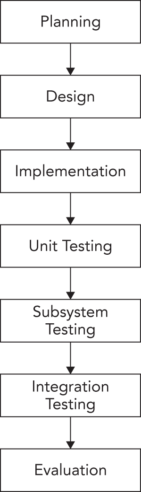
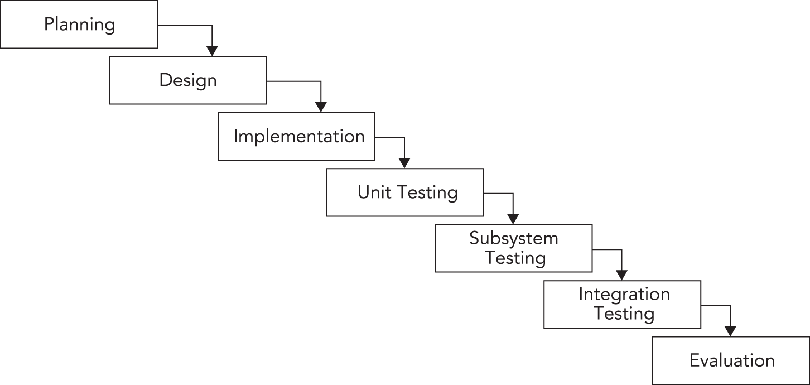
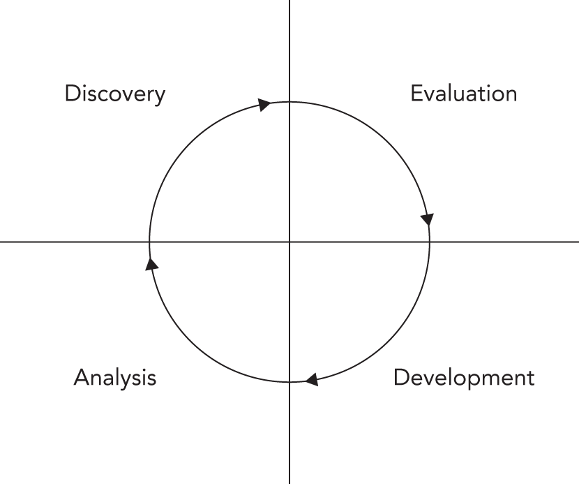
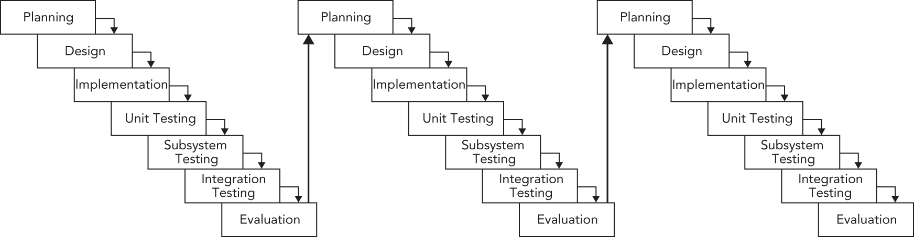

:::tip[WHAT'S IN THIS CHAPTER?]
- What a software life cycle model is, with examples of the waterfall model, the sashimi model, spiral-like models, and agile
- What software engineering methodologies are, with examples of the Unified Process, Rational Unified Process, Scrum, Extreme Programming, and Software Triage
- What version control means
:::

This chapter starts the last part of this book, which is about software engineering. This part describes software engineering methods, code efficiency, testing, debugging, design techniques, design patterns, and how to target multiple platforms.

When you first learned how to program, you were probably on your own schedule. You were free to do everything at the last minute if you wanted to, and you could radically change your design during implementation. When coding in the professional world, however, programmers rarely have such flexibility. Even the most liberal engineering managers admit that some amount of process is necessary. These days, knowing the software engineering process is as important as knowing how to code.

In this chapter, I will survey various approaches to software engineering. I will not go into great depth on any one approach—there are plenty of excellent books on software engineering processes. My intention is to cover some different types of processes in broad strokes so you can compare and contrast them. I will try not to advocate or discourage any particular methodology. Rather, I hope that by learning about the tradeoffs of several different approaches, you'll be able to construct a process that works for you and the rest of your team. Whether you're a contractor working alone on projects or your team consists of hundreds of engineers on several continents, understanding different approaches to software development will help you with your job on a daily basis.

The final part of this chapter discusses version control systems that make it easy to manage source code and keep track of its history. A version control system is mandatory in every company to avoid a source code maintenance nightmare. Even for one-person projects, I highly recommend you use such a system.

## THE NEED FOR PROCESS

The history of software development is filled with tales of failed projects. From over-budget and poorly marketed consumer applications to grandiose mega-hyped operating systems, it seems that no area of software development is free from this trend.

Even when software successfully reaches users, bugs have become so commonplace that end users are often forced to endure constant updates and patches. Sometimes the software doesn't accomplish the tasks it is supposed to do or doesn't work the way the user would expect. These issues all point to one fact: writing software is hard.

You may wonder why software engineering seems to differ from other forms of engineering in its frequency of failures. For example, while cars have their share of bugs, you rarely see them stop suddenly and demand a reboot due to a buffer overflow (though as more and more car components become software-driven, you just might). Your TV may not be perfect, but you don't have to upgrade to version 2.3 to get Channel 6 to work.

Is it the case that other engineering disciplines are just more advanced than software development? Is a civil engineer able to construct a working bridge by drawing upon the long history of bridge-building? Are chemical engineers able to build a compound successfully because most of the bugs were worked out in earlier generations? Is software engineering too new, or is it really a different type of discipline with inherent qualities contributing to the frequency of bugs, unusable results, and doomed projects?

It certainly seems as if there's something different about software engineering. For one thing, computer technology changes rapidly, creating uncertainty in the software development process. Even if no earth-shattering breakthrough occurs during your project, the pace at which the IT industry moves can lead to problems. Software also often needs to be developed quickly because competition is fierce.

Software development schedules can also be unpredictable. Accurate scheduling is nearly impossible when a single gnarly bug can take days or even weeks to fix. Even when things seem to be going according to schedule, the widespread tendency of product definition changes (known as *feature creep* or *scope creep*) can throw a wrench in the process. If left unchecked, such scope creep can eventually result in software bloat.

Software is often complex. There is no easy and accurate way to prove that a program is bug-free. Buggy or messy code can have an impact on software for years if it is maintained through several versions. Software systems are often so complex that when staff turnover occurs, nobody wants to get anywhere near some messy legacy code. This leads to a cycle of endless patching, hacks, and workarounds.

Of course, standard business risks apply to software as well. Marketing pressures and miscommunication get in the way. Many programmers try to steer clear of corporate politics, but it's not uncommon to have animosity between the development and product-marketing groups.

All of these factors working against software engineering products indicate the need for some sort of process. Software projects are big, complicated, and fast-paced. To avoid failure, engineering groups need to adopt a system to control this unwieldy process.

Elegantly designed software with clean and maintainable code can be developed. I'm convinced it is possible, but it takes continuous efforts of each individual team member and requires following proper software development processes and practices.

## SOFTWARE LIFE CYCLE MODELS

Complexity in software isn't new. The need for a formalized process was recognized decades ago. Several approaches to modeling the *software life cycle* have attempted to bring some order to the chaos of software development by defining the software process in terms of steps from the initial idea to the final product. These models, refined over the years, guide much of software development today.

### The Waterfall Model

A classic life cycle model for software is the *waterfall model*. This model is based on the idea that software can be built almost like following a recipe. There is a set of steps that, if followed correctly, will yield a mighty fine chocolate cake — or program, as the case may be. Each stage must be completed before the next stage can begin, as shown in [Figure 28.1](#c28-fig-0001). You can compare this process to a waterfall, as you can only go downward to the next phase.

 

[^FIGURE 28.1]

The process starts with formal planning, which includes gathering an exhaustive list of requirements. This list defines feature completeness for the product. The more specific the requirements are, the more likely it is that the project will succeed. Next, the software is designed and fully specified. The design step, like the requirements step, needs to be as specific as possible to maximize the chance of success. All design decisions are made at this time, often including pseudo-code and the definition of specific subsystems that will need to be written. Subsystem owners work out how their code will interact, and the team agrees on the specifics of the architecture. Implementation of the design occurs next. Because the design has been fully specified, the code needs to adhere closely to the design or else the pieces won't fit together. The final four stages are reserved for unit testing, subsystem testing, integration testing, and evaluation.

The main problem with the waterfall model is that, in practice, it is nearly impossible to complete one stage without at least exploring the next stage. A design cannot be set in stone without writing at least *some* code. Furthermore, if testing reveals bugs, you'll have to go “back up” the waterfall and do some more coding whether your model formally accounted for that or not.

Various incarnations have refined the process in different ways. For example, some plans include a “feasibility” step where experiments are performed before formal requirements are even gathered.

#### Benefits of the Waterfall Model

The value of the waterfall model lies in its simplicity. You, or your manager, may have followed this approach in past projects without formalizing it or recognizing it by name. The underlying assumption behind the waterfall model is that as long as each step is accomplished as completely and accurately as possible, subsequent steps will go smoothly. As long as all of the requirements are carefully specified in the first step, and all the design decisions and problems are hashed out in the second step, implementation in the third step should be a simple matter of translating the designs into code.

The simplicity of the waterfall model makes project plans based on this system organized and easy to manage. Every project is started the same way: by exhaustively listing all the features that are necessary. For example, managers using this approach can require that by the end of the design phase, all engineers in charge of a subsystem must submit their design as a formal design document or a functional subsystem specification. The benefit for the manager is that by having engineers specify requirements and designs up front, risks are (in theory) minimized.

From the engineer's point of view, the waterfall model forces resolution of major issues up front. All engineers will need to understand their project and design their subsystem before writing a significant amount of code. Ideally, this means that code can be written once instead of being hacked together or rewritten when the pieces don't fit.

For small projects with very specific requirements, the waterfall model can work quite well. Particularly for consulting arrangements, it has the advantage of specifying clearly defined metrics for success at the start of the project. Formalizing requirements helps the consultant to produce exactly what the client wants and forces the client to be specific about the goals for the project.

#### Drawbacks of the Waterfall Model

In many organizations, and almost all modern software engineering texts, the waterfall model has fallen out of favor. Critics disparage its fundamental premise that software development tasks happen in discrete, linear steps. The waterfall model generally does not allow backward movement. Unfortunately, in many projects today, new requirements are introduced throughout the development of the product. Often, a potential customer will request a feature that is necessary for the sale, or a competitor's product will have a new feature that requires parity.

:::note
The up-front specification of all requirements makes the waterfall model unusable for many organizations because it is not dynamic enough.
:::

Another drawback is that in an effort to minimize risk by making decisions as formally and early as possible, the waterfall model may actually be hiding risk. For example, a major design issue might be undiscovered, glossed over, forgotten, or purposely avoided during the design phase. When integration testing finally reveals the mismatch, the team has to go “back up” the waterfall to fix the issues. A mistake anywhere in the waterfall process will likely lead to delays at the end of the process. Early detection is difficult and occurs rarely.

If you do use the waterfall model, it is often necessary to make it more flexible by taking cues from other approaches.

### Sashimi Model

A number of refinements to the waterfall model have been formalized. One such refinement is called the *sashimi model*. The main advancement that the sashimi model brought was the concept of overlap between stages. The name, sashimi model, comes from a Japanese fish dish, called *sashimi*, in which different pieces of fish are overlapping each other. While the model still stresses a rigorous process of planning, designing, coding, and testing, successive stages can partially overlap. [Figure 28.2](#c28-fig-0002) shows an example of the sashimi model, illustrating the overlapping of stages. Overlap permits activities in two phases to occur simultaneously. This recognizes the fact that one stage can often not be finished completely without at least partially looking at the next stage.

 

[^FIGURE 28.2]

### Spiral-like Models

The *spiral model* was proposed by Barry W. Boehm in 1986 as a risk-driven software development process. Several derivatives have been formulated, which are called *spiral-like models*. The model discussed in this section is part of a family of techniques known as *iterative processes*. The fundamental idea is that it's okay if something goes wrong because you'll fix it in the next iteration. [Figure 28.3](#c28-fig-0003) shows a single spin through this spiral-like model.

The phases of this model are similar to the steps of the waterfall model. The discovery phase involves discovering requirements, determining objectives, determining alternatives (design alternatives, reuse, buying third-party libraries, and so on), and determining any constraints. During the evaluation phase, implementation alternatives are evaluated, risks are analyzed, and prototype options are considered. In a spiral-like model, particular attention is paid to evaluating and resolving risks in the evaluation phase. The tasks deemed riskiest are the ones that are implemented in the current cycle of the spiral. The tasks in the development phase are determined by the risks identified in the evaluation phase. For example, if evaluation reveals a risky algorithm that may be impossible to implement, the main task for development in the current cycle will be modeling, building, and testing that algorithm. The fourth phase is reserved for analysis and planning. Based on the results of the current cycle, a plan for the subsequent cycle is formed.

 

[^FIGURE 28.3]

[Figure 28.4](#c28-fig-0004) shows an example of three cycles through the spiral in the development of an operating system. The first cycle yields a plan containing the major requirements for the product. The second cycle results in a prototype showing the user experience. The third cycle builds a component that is determined to be a high risk.

 

[^FIGURE 28.4]

#### Benefits of a Spiral-like Model

A spiral-like model can be viewed as the application of an iterative approach to the best that the waterfall model has to offer. [Figure 28.5](#c28-fig-0005) shows a spiral-like model as a waterfall process that has been modified to allow iteration. Hidden risks and a linear development path, the main drawbacks of the waterfall model, are resolved through iterative cycles.

 

[^FIGURE 28.5]

Performing the riskiest tasks first is another benefit. By bringing risk to the forefront and acknowledging that new conditions can arise at any time, a spiral-like model avoids the hidden time bombs that can occur with the waterfall model. When unexpected problems arise, they can be dealt with by using the same four-stage approach that works for the rest of the process.

This iterative approach also allows to incorporate feedback from testers. For example, an early version of the product can be released for internal or even external evaluation. Testers could, for instance, say that a certain feature is missing or that an existing feature is not working as expected. A spiral-like model has a built-in mechanism to react to such input.

Finally, by repeatedly analyzing after each cycle and building new designs, the practical difficulties with the design-then-implement approach are virtually eliminated. With each cycle, there is more knowledge of the system that can influence the design.

#### Drawbacks of a Spiral-like Model

The main drawback of a spiral-like model is that it can be difficult to scope each iteration small enough to gain real benefit. In a worst-case scenario, a spiral-like model can degenerate into a waterfall model because the iterations are too long. Unfortunately, a spiral-like model only *models* the software life cycle; it cannot prescribe a specific way to break down a project into single-cycle iterations because that division varies from project to project.

Other possible drawbacks are the overhead of repeating all four phases for each cycle and the difficulty of coordinating cycles. Logistically, it may be difficult to assemble all the group members for design discussions at the right time. If different teams are working on different parts of the product simultaneously, they are probably operating in parallel cycles, which can get out of sync. For example, during the development of an operating system, the user interface group could be ready to start the discovery phase of the Window Manager cycle, but the core OS group could still be in the development phase of the memory subsystem.

Yet another problem is overall time planning for the project. If you continuously keep repeating the four phases, how do you break the cycle to stop the project? Often it will be up to management to decide on an endpoint condition and provide justification for it.

### Agile

To address the shortcomings of the waterfall model, the *agile model* was introduced in 2001 in the form of an *Agile Manifesto*.

# MANIFESTO FOR AGILE SOFTWARE DEVELOPMENT

The entire manifesto, taken from `http://agilemanifesto.org`, is as follows:

We are uncovering better ways of developing software by doing it and helping others do it. Through this work we have come to value:

- **Individuals and interactions** over processes and tools
- **Working software** over comprehensive documentation
- **Customer collaboration** over contract negotiation
- **Responding to change** over following a plan

That is, while there is value in the items on the right, we value the items on the left more.

As can be understood from this manifesto, the term *agile* is only a high-level description. Basically, it tells you to make the process flexible so that customers' changes can easily be incorporated into the project during development. *Scrum* is one of the most frequently used agile software development methodologies and is discussed in the next section.

## SOFTWARE ENGINEERING METHODOLOGIES

Software life cycle models provide a formal way of answering the question, “What do we do next?” but are rarely able to contribute an answer to the logical follow-up question, “How do we do it?” To provide some answers to the how question, a number of *software engineering methodologies* have been developed that provide practical rules of thumb for professional software development. Books and articles on software methodologies abound, but a few of these methodologies deserve particular attention: Scrum, Unified Process, Rational Unified Process, Extreme Programming, and Software Triage.

### Scrum

The agile model is just a high-level foundation; it does not specify exactly how the model should be implemented in real life. That's where *Scrum* comes into play; it's an agile methodology with precise descriptions of how to use it on a daily basis. It's one of the most frequently used software engineering methodologies in the industry.

Scrum is an iterative process. It is popular as a means to manage software development projects. In Scrum, each iteration is called a *sprint cycle*. The sprint cycle is the central part of the Scrum process. The length of sprints, which should be decided at the beginning of the project, is typically between two and four weeks. Before a sprint is started, the team decides on the *sprint goals*. The team makes a commitment to deliver these goals at the end of the sprint. At the end of each sprint, the aim is to have a version of the software available that is fully working and tested and that represents a subset of the customers' requirements. Scrum recognizes that customers will often change their minds during development, so it allows the result of each sprint to be shipped to the customer. This gives customers the opportunity to see iterative versions of the software and allows them to give feedback to the development team about potential issues.

#### Roles

There are three roles in Scrum. The first role, *product owner*, is the connection to the customer and to other people. The product owner writes high-level *user stories* based on input from the customer, gives each user story a priority, and puts the stories on the Scrum *product backlog*. Actually, everyone on the team is allowed to write high-level user stories for the product backlog, but the product owner decides which user stories are kept and which are removed.

The second role, *Scrum master*, is responsible for keeping the process running and can be part of the team but isn't considered the leader of the team, because with Scrum the team leads itself. The Scrum master is the contact person for the team so that the rest of the team members can concentrate on their tasks. The Scrum master ensures that the Scrum process is followed correctly by the team, for example, by organizing the daily Scrum meetings, discussed in the next section. The Scrum master and product owner should be two different people.

The third and final role in the Scrum process is the *team* itself. Teams develop the software and should be kept small, preferably fewer than 10 members.

#### The Process

Before the start of each sprint cycle, there is a *sprint planning* meeting in which team members must decide which product features they will implement in the new sprint. This is formalized in a *sprint backlog*. The features are selected from the product backlog containing prioritized user stories, which are high-level requirements of new features. User stories from the product backlog are broken down into smaller tasks with an *effort estimation* and are put on the sprint backlog. The duration of the sprint planning meeting depends on the length of the sprints and the size of the team; typically, there will be two to four hours of sprint planning for each two weeks of a sprint. The sprint planning meeting is usually split into two parts: a meeting with the product owner and the team to discuss the priority of product backlog items and a meeting with only the team to complete the sprint backlog.

In a Scrum team you will sometimes find a physical board, the *Scrum board* or *sprint board*, with three columns: *To Do*, *In Progress*, and *Done*. Every task for the sprint is written on a small piece of paper and stuck on the board in the correct column. Tasks are not assigned to people during a meeting; instead, every team member can go to the board, pick one of the To Do tasks, and move that paper to the In Progress column. When the team member is finished with that task, the paper is moved to the Done column. This method makes it easy for team members to get an overview of the work that still needs to be done and what tasks are in progress or finished. Instead of a physical Scrum board, you can also use software to work with a virtual Scrum board.

The three columns, To Do, In Progress, and Done, are not set in stone. Your team can add any additional columns to include other steps. For example, a Scrum board could contain the following columns:

- **To Do:** The tasks planned for the current sprint that have not been started yet
- **In Progress:** The tasks that are currently being worked on by developers in a development branch (see the “Version Control” section later in this chapter)
- **In Review:** The tasks that have been implemented and that are currently waiting to be reviewed by another team member, also known as *code review*
- **In Testing:** The tasks that have been implemented and code reviewed and that are waiting to be tested by the quality assurance (QA) team for approval
- **In Integration:** The tasks for which the code changes have been validated by a code review and approved by QA and for which the code from the development branch can be integrated into the main code base, but only if all tests are successful on that branch
- **Done:** The tasks that have been fully implemented, reviewed, tested, and integrated

It's recommended to keep individual tasks small. This results in short-lived development branches.

Sometimes, a burn-down chart is also created every day that displays the days of the sprint on the horizontal axis and the remaining development hours on the vertical axis. This gives a quick overview of the progress made and can be used to determine whether all planned tasks are likely to be completed during the sprint.

The Scrum process enforces a daily meeting called the *daily replanning*, *daily Scrum*, or *daily standup*. In this meeting, all team members stand together with the Scrum master. This meeting should start every day at the same time and location but should be no longer than 15 minutes. The sprint board should be visible for all team members during this meeting. In this meeting, the team looks at the current progress toward the sprint goal. Any blocking points or delays are discussed. If need be, the team can remove or add tasks to the current sprint to make sure the sprint goal can be reached at the end of the sprint.

This daily meeting usually includes the following three questions for all team members to answer:

- What did you do yesterday to help the team reach the sprint goal?
- What will you do today to help the team reach the sprint goal?
- Do you see any obstacles that hamper you or the team to reach the sprint goal?

Once a sprint cycle is finished, there are two meetings: the *sprint review* and the *sprint retrospective*. The duration of the sprint review meeting again depends on the length of the sprints and the size of the team, typically two hours per two weeks of a sprint. During the sprint review meeting, a *demo* is given to demonstrate the sprint results and the current state of the software to all interested stakeholders, such as product managers, support engineers, and so on. The sprint review meeting also includes a discussion of the results of the sprint cycle, including what tasks were completed, what tasks were not completed, and why. The sprint retrospective typically takes around one-and-a-half hours for each two weeks of a sprint and allows the team to think about how the last sprint cycle was executed. For example, the team can identify shortcomings in the process and adapt the process for the next sprint. Questions like “What went well?” and “What could be improved?” and “What do we want to start, continue, or stop doing?” are answered. This is called *continuous improvement*; that is, after every sprint, the process itself is examined and improved.

#### Benefits of Scrum

Scrum is resilient to unforeseen problems that come up during the development stage. When a problem pops up, it can be handled in one of the following sprints. The team is involved in every step of the project. They discuss user stories from the product backlog with the product owner and convert these user stories into smaller tasks for inclusion in a sprint backlog. The team autonomously assigns work to its members with the aid of the Scrum task board. This board makes it easy to see which team member is working on which task, and the daily Scrum meetings ensure that everyone knows what is happening to reach the sprint goals.

A huge benefit to the stakeholders is the demo that follows each sprint, which demonstrates the new iterative version of the project. Stakeholders quickly gets a sense of how the project is progressing and can make changes to the requirements, which usually can be incorporated into a future sprint.

#### Drawbacks of Scrum

Some companies might find it difficult to accept that the team itself decides who is doing what. Tasks are not assigned to team members by a manager or a team leader. All members pick their own tasks from the Scrum task board.

The Scrum master is a key person to make sure the team stays on track. It is important that the Scrum master trusts the team. Having too much control over the team members will cause the Scrum process to fail.

A possible problem with Scrum is called *feature creep*. Scrum allows new user stories to be added to the product backlog during development. There is a danger that project managers will keep adding new features to the product backlog. This problem is best solved by deciding early on a final release date or the end date of the final sprint.

### The Unified Process

The *Unified Process* (UP) is an iterative and incremental software development process. The UP is not set in stone; it's a framework that you should customize to the specific needs of your project. According to the Unified Process, a project can be split into four phases:

- **Inception:** This phase is usually very short. It includes a feasibility study, writing of a business case, deciding whether the project should be developed in-house or bought from a third-party vendor, defining a rough estimate of the cost and timeline, and defining the scope.
- **Elaboration:** Most of the requirements are documented. Risk factors are addressed, and the system architecture is validated. To validate the architecture, the most important parts of the core of the architecture are built as an executable delivery. This should demonstrate that the developed architecture will be able to support the entire system.
- **Construction:** All requirements are implemented on top of the executable architecture delivery from the elaboration phase.
- **Transition:** The product is delivered to the customer. Feedback from the customer is addressed in subsequent transition iterations.

All phases are split into time-boxed *iterations*, each having a tangible result. In each iteration, the teams are working on several *disciplines* of the project at the same time: business modeling, requirements, analysis and design, implementation, testing, and deployment. The amount of work done in each discipline changes with each iteration. [Figure 28.6](#c28-fig-0006) shows this iterative and overlapping development approach. In this example, the inception phase is done in one iteration, the elaboration phase in two, the construction phase in four, and the transition phase in two iterations.

 

[^FIGURE 28.6]

### The Rational Unified Process

The *Rational Unified Process (RUP)* is one of the best-known refinements of the Unified Process. It is a disciplined and formal approach to managing the software development process. The most important characteristic of the RUP is that, unlike the spiral model or the waterfall model, RUP is more than just a theoretical process model. RUP is actually a software product that is sold by Rational Software, a division of IBM. Treating the process itself as software brings about some interesting advantages:

- The process itself can be updated and refined, just as software products periodically have updates.
- Rather than simply suggesting a development framework, RUP includes a set of software tools for working with that framework.
- As a product, RUP can be rolled out to the entire engineering team so that all members are using the exact same processes and tools.
- Like many software products, RUP can be customized to the needs of its users.

#### RUP as a Product

As a product, RUP takes the form of a suite of software applications that guide developers through the software development process. The product also offers specific guidance for other Rational products, such as the Rational Rose visual modeling tool and the Rational ClearCase configuration management tool. Extensive groupware communication tools are included as part of the “marketplace of ideas” that allows developers to share knowledge.

One of the basic principles behind RUP is that each iteration on a development cycle should have a tangible result. During the Rational Unified Process, users will create numerous designs, requirement documents, reports, and plans. The RUP software provides visualization and development tools for the creation of these artifacts.

#### RUP as a Process

Defining an accurate model is the central principle of RUP. Models, according to RUP, help explain the complicated structures and relationships in the software development process. In RUP, models are often expressed in Unified Modeling Language (UML) format; see [Appendix D](../b04), “Introduction to UML.”

RUP defines each part of the process as an individual *workflow* (called *discipline* in the earlier discussion of the Unified Process). Workflows represent each step of a process in terms of who is responsible for the step, what tasks are being performed, the artifacts or results of these tasks, and the sequence of events that drives the tasks. Almost everything about RUP is customizable, but several *core process workflows* are defined “out of the box” by RUP.

The core process workflows bear some resemblance to the stages of the waterfall model, but each one is iterative and more specific in definition. The *business modeling workflow* models business processes, usually with the goal of driving software requirements forward. The *requirements workflow* creates the requirements definition by analyzing the problems in the system and iterating on its assumptions. The *analysis and design workflow* deals with system architecture and subsystem design. The *implementation workflow* covers the modeling, coding, and integration of software subsystems. The *testing workflow* models the planning, implementation, and evaluation of software quality tests. The *deployment workflow* is a high-level view of overall planning, releasing, supporting, and testing workflows. The *configuration management workflow* goes from new project conception to iteration and end-of-product scenarios. Finally, the *environment workflow* supports the engineering organization through the creation and maintenance of development tools.

#### RUP in Practice

RUP is aimed mainly at larger organizations and offers several advantages over the adoption of traditional life cycle models. Once the team has gotten over the learning curve of using the software, all members will be using a common platform for designing, communicating, and implementing their ideas. The process can be customized to the needs of the team, and each stage reveals a wealth of valuable artifacts that document each phase of the development.

A product like RUP can be too heavyweight for some organizations. Teams with diverse development environments or tight engineering budgets might not want to, or be able to, standardize on a software-based development system. The learning curve can also be a factor; new engineers who aren't familiar with the process software will have to learn how to use it, while at the same time getting up to speed on the product and the existing code base.

### Extreme Programming

When a friend of mine arrived home from work years ago and told his wife that his company had adopted some of the principles of Extreme Programming, she joked, “I hope you wear a safety harness for that.” Despite the somewhat hokey name, Extreme Programming (XP) effectively bundles up the best of other software development guidelines and adds some new material.

XP, popularized by Kent Beck in *Extreme Programming Explained* (Addison-Wesley, 1999), claims to take the best practices of good software development and turn them up a notch. For example, most programmers would agree that testing is a good thing. In XP, testing is deemed so good that you're supposed to write the tests before you write the code.

#### XP in Theory

The XP methodology is made up of twelve guiding principles, grouped into four categories. These principles are manifested throughout all phases of the software development process and have a direct impact on the daily tasks of engineers.

##### Category 1: Fine-Scale Feedback

XP provides four fine-grained guidelines related to coding, planning, and testing.

###### Code in Pairs

XP suggests that all production code should be written by two people working side-by-side, a technique called *pair programming*. Obviously, only one person can actually be in control of the keyboard. The other person reviews the code his peer is writing and takes a high-level approach, thinking about issues such as testing, necessary refactoring, and the overall model of the project.

As an example, if you are in charge of writing the user interface for a particular feature of your application, you might want to ask the original author of the feature to sit down with you. He can advise you about the correct use of the feature, warn you about any “gotchas” you should watch out for, and help oversee your efforts at a high level. Even if you can't acquire the help of the original author, just grabbing another member of the team can help. The theory is that working in pairs builds shared knowledge, ensures proper design, and puts an informal system of checks and balances in place.

###### Planning Game

In the waterfall model, planning happens once, at the beginning of the process. Under the spiral model, planning is the first phase of each iteration. Under XP, planning is more than just a step—it's a never-ending task. XP teams start with a rough plan that captures the major points of the product being developed. During each iteration of the process, there is a *planning game* meeting. Throughout the development process, the plan is refined and modified as necessary. The theory is that conditions are constantly changing and new information is obtained all the time. There are two major parts in the planning process:

- **Release planning:** This happens with the developers and the customers, and its goal is to determine which requirements need to be included in which upcoming releases.
- **Iteration planning:** This happens only with the developers, and it plans the actual tasks for the developers.

Under XP, estimates for a given feature are always made by the person who will be implementing that particular feature. This helps to avoid situations where the implementer is forced to adhere to an unrealistic and artificial schedule. Initially, estimates are very rough, perhaps on the order of weeks for a feature. As the time horizon shortens, the estimates become more granular. Features are broken down into tasks taking no more than five days.

###### Test Constantly

According to *Extreme Programming Explained*, “Any program feature without an automated test simply doesn't exist.” XP is zealous about testing. Part of your responsibility as an XP engineer is to write the unit tests that accompany your code. A unit test is generally a small piece of code that makes sure that an individual piece of functionality works. For example, individual unit tests for a file-based object store may include `testSaveObject`, `testLoadObject`, and `testDeleteObject`.

XP takes unit testing one step further by suggesting that unit tests should be written before the actual code is written. Of course, the tests won't pass because the code hasn't been written yet. In theory, if your tests are thorough, you should know when your code is complete because all the tests will run successfully. However, it's hard to know if your tests are thorough enough. You have to think about different kinds of bugs that you might introduce when implementing the code and whether your tests would catch those bugs. Writing good tests can be significantly harder than writing good code. The process of writing unit tests before the actual code is called *test-driven development* (TDD*)*. I told you it was “extreme.”

###### Have a Customer On-Site

Because an XP-savvy engineering group constantly refines its product plan and builds only what is currently necessary, having a customer contribute to the process is valuable. Although it is not always possible to convince a customer to be physically present during development, the idea that there should be communication between engineering and the end user is clearly a valuable notion. In addition to assisting with the design of individual features, customers can help prioritize tasks by conveying their individual needs.

##### Category 2: Continuous Process

XP advocates that you should continuously integrate subsystems so that mismatches between subsystems can be detected early. You should also refactor code whenever necessary and aim to build and deploy small incremental releases.

###### Integrate Continuously

All programmers are familiar with the dreaded chore of integrating code. This task becomes a nightmare when you discover that your view of a subsystem is a complete mismatch with the way it was actually written. When subsystems come together, problems are exposed. XP recognizes this phenomenon and advocates integrating code into the project frequently as it is being developed.

During development, engineers should run all tests before checking code into the repository. Additionally, a designated machine continually runs automated tests. When the automated tests fail, the team receives an e-mail indicating the problem and listing the most recent check-ins.

With development branches, it is recommended to set up your processes in such a way that a development branch can be merged back into the main code base only if all tests ran successfully on that branch.

###### Refactor When Necessary

Most programmers *refactor* their code from time to time. Refactoring is the process of redesigning existing working code to take into account new knowledge, new upstream APIs, or alternate uses that have been discovered since the code was written. Refactoring is difficult to build into a traditional software engineering schedule because its results are not as tangible as implementing a new feature. Good managers, however, recognize its importance for long-term code maintainability.

The extreme way of refactoring is to recognize situations during development when refactoring is useful and to do the refactoring at that time. Instead of deciding at the start of a release which existing parts of the product need design work, XP programmers learn to recognize the signs of code that is ready to be refactored. While this practice will almost certainly result in unexpected and unscheduled tasks, restructuring the code when appropriate should make future development easier.

###### Build Small Releases

One of the theories of XP is that software projects grow risky and unwieldy when they try to accomplish too much at one time. Instead of massive software releases that involve core changes and several pages of release notes, XP advocates smaller releases with a timeframe closer to two months than eighteen months. With such a short release cycle, only the most important features can make it into the product. This forces engineering and marketing to agree on what features are truly important.

##### Category 3: Shared Understanding

Software is developed by a team. Any code written is not owned by individuals but by the team as a whole. XP gives a couple of guidelines to make sure sharing the code and ideas is possible.

###### Share Common Coding Standards

Because of the collective ownership guideline and the practice of pair programming, coding in an extreme environment can be difficult if each engineer has their own naming and indenting conventions. XP doesn't advocate any particular style but recommends that if you can look at a piece of code and immediately identify the author, your group probably needs a better definition of its coding standards.

For additional information on various approaches to coding style, see [Chapter 3](../c03), “Coding with Style.”

###### Share the Code

In many traditional development environments, code ownership is strongly defined and often enforced. A friend of mine once worked in an environment where the manager explicitly forbade checking in changes to code written by any other member of the team. XP takes the extreme opposite approach by declaring that the code is collectively owned by everybody.

Collective ownership is practical for a number of reasons. From a management point of view, it is less detrimental when a single engineer leaves suddenly because there are others who understand that part of the code. This increases the *bus factor* or *bus number*, which represents the minimal number of engineers that need to be hit by a bus to make the project stall. From an engineer's point of view, collective ownership builds a common view of how the system works. This helps with design tasks and frees the individual programmer to make any changes that will add value to the overall project.

One important note about collective ownership is that it is not necessary for every programmer to be familiar with every single line of code. It is more of a mindset that the project is a team effort, and there is no reason for any one person to hoard knowledge.

###### Simplify Your Designs

A mantra frequently sung by XP-savvy engineers is “avoid speculative generality,” also known as KISS, or “Keep It Simple, Stupid.” This goes against the natural inclinations of many programmers. If you are given the task of designing a file-based object store, you may start down the path of creating the be-all, end-all solution to all file-based storage problems. Your design might quickly evolve to cover multiple languages and any type of object. XP says you should lean toward the other end of the generality–specificity continuum. Instead of making the ideal object store that will win awards and be celebrated by your peers, design the simplest possible object store that gets the job done. You should understand the current requirements and write your code to those specifications to avoid overly complex code.

It may be hard to get used to simplicity in design. Depending on the type of work you do, your code may need to exist for years and be used by other parts of the code that you haven't even dreamed of. As discussed in [Chapter 6](../c06), “Designing for Reuse,” the problem with building in functionality that *may* be useful in the future is that you don't know what those hypothetical use cases are, and there is no way to craft a good design that is purely speculative. In fact, designing up front for one of these use cases (which might never come to pass) might actually prevent you from being able to accommodate a different use case (which actually could have been useful) unless you refactor the entire design. XP says you should build something that is useful today and leave open the opportunity to modify it later.

###### Share a Common Metaphor

XP uses the term *metaphor* for the idea that all members of the team (including customers and managers) should share a common high-level view of the system. This does not refer to the specifics of how objects will communicate or the exact APIs that will be written. Rather, the metaphor is the mental model and naming model for the components of the system. Each component should be given a descriptive name so that each member of the team can guess its functionality simply based on its name. Team members should use the metaphor to drive shared terminology when discussing the project.

##### Category 4: Programmer Welfare

The final guideline of XP is about the welfare of developers.

###### Work Sane Hours

XP has a thing or two to say about the hours you've been putting in. The claim is that a well-rested programmer is a happy and productive programmer. XP advocates a workweek of approximately 40 hours and warns against putting in overtime for more than two consecutive weeks.

Of course, different people need different amounts of rest. The main idea, though, is that if you sit down to write code without a clear head, you're going to write poor code and abandon many of the XP principles.

#### XP in Practice

XP purists claim that the twelve tenets of Extreme Programming are so intertwined that adopting some of them without others would largely ruin the methodology. For example, pair programming is vital to testing because if you can't determine how to test a particular piece of code, your partner can help. Also, if you're tired one day and decide to skip the testing, your partner will be there to promote feelings of guilt.

Some of the XP guidelines, however, can prove difficult to implement. To some engineers, the idea of writing tests before code is too abstract. For those engineers, it may be sufficient to *design* the tests without actually writing them until there is code to test. Many of the XP principles are rigidly defined, but if you understand the theory behind them, you may be able to find ways to adapt the guidelines to the needs of your project.

The collaborative aspects of XP can be challenging as well. Pair programming has measurable benefits, but it may be difficult for a manager to rationalize having half as many people actually writing code each day. Some members of the team may even feel uncomfortable with such close collaboration, perhaps finding it difficult to type while others are watching. XP suits some personality types better than others; introverts in particular might dislike pair programming. Pair programming also has obvious challenges if the team is geographically spread out or if members tend to telecommute regularly.

For some organizations, Extreme Programming may be too radical. Large, established companies with formal policies in place for engineering may be slow to adopt approaches like XP. However, even if your company is resistant to the implementation of XP, you can still improve your own productivity by understanding the theory behind it.

### Software Triage

In the pessimistically named book *Death March* (Prentice Hall, 1997), Edward Yourdon describes the frequent and scary phenomenon of software that is behind schedule, short on staff, over-budget, or poorly designed. Yourdon's theory is that when software projects get into this state, even the best modern software development methodologies will no longer apply. As you have learned in this chapter, many approaches to software development are built around formalized documents or taking a user-centered approach to design. In a project that's already in “death march” mode, there simply isn't time for these approaches.

The idea behind Software Triage is that when a project is already in a bad state, resources are scarce. Time is scarce, engineers are scarce, and money may be scarce. The main mental obstacle that managers and developers need to overcome when a project is way behind schedule is that it will be impossible to satisfy the original requirements in the allotted time. The task then becomes organizing remaining functionality into must-have, should-have, and nice-to-have lists.

Software Triage is a daunting and delicate process. It often requires the leadership of an outside veteran of “death march” projects to make the tough decisions. For the engineer, the most important point is that in certain conditions, it may be necessary to throw familiar processes (and perhaps some existing code) out the window to finish a project on time.

## BUILDING YOUR OWN PROCESS AND METHODOLOGY

It's unlikely that any book or engineering theory will perfectly match the needs of your project or organization. I recommend that you learn from as many approaches as you can and design your own process. Combining concepts from different approaches may be easier than you think. For example, RUP optionally supports an XP-like approach. Here are some tips for building the software engineering process of your dreams.

### Be Open to New Ideas

Some engineering techniques seem crazy at first, or unlikely to work. Look at new innovations in software engineering methodologies as a way to refine your existing process. Try things out when you can. If XP sounds intriguing, but you're not sure if it will work in your organization, see if you can work it in slowly, taking a few of the principles at a time or trying it out with a smaller pilot project.

### Bring New Ideas to the Table

Most likely, your engineering team is made up of people from varying backgrounds. You may have startup veterans, long-time consultants, recent graduates, and PhDs all on your team. You all have different sets of experiences and different ideas of how a software project should be run. Sometimes the best processes turn out to be a combination of the way things are typically done in these very different environments.

### Recognize What Works and What Doesn't Work

At the end of a project (or better yet, during the project, as with the sprint retrospective of the Scrum methodology), get the team together to evaluate the process. Sometimes there's a major problem that nobody notices until the entire team stops to think about it. Perhaps there's a problem that *everybody* knows about but nobody has discussed.

Consider what isn't working and see how those parts can be fixed. Some organizations require formal code reviews prior to any source code check-in. If code reviews are so long and boring that nobody does a good job, discuss code-reviewing techniques as a group.

Also consider what is going well and see how those parts can be extended. For example, if maintaining the feature tasks as a group-editable wiki is working, then maybe devote some time to making the website even better.

### Don't Be a Renegade

Whether a process is mandated by your manager or custom-built by the team, it's there for a reason. If your process involves writing formal design documents, make sure you write them. If you think that the process is broken or too complex, talk to your manager about it. Don't just avoid the process—it will come back to haunt you.

## VERSION CONTROL

Managing all source code is important for any company, big or small, even for one-person projects. In a company, for example, it would be impractical to store all the source code on the machines of individual developers without it being managed by any *version control* software. This would result in a maintenance nightmare because not everyone would always have the latest code. Instead, all source code **must** be managed by version control software. There are three kinds of such software solutions:

- **Local:** These solutions store all source code files and their history locally on your machine and are not really suitable for use in a team. These are solutions from the '70s and '80s and shouldn't be used anymore. They are not discussed further.
- **Client/server:** These solutions are split into a client component and a server component. For a personal developer, the client and server components can run on the same machine, but the separation makes it easy to move the server component to a dedicated physical server machine if the need arises.
- **Distributed:** These solutions go one step further than the client/server model. There is no central place where everything is stored. Every developer has a copy of all the files, including all the history. A peer-to-peer approach is used instead of a client/server approach. Code is synchronized between peers by exchanging patches.

The client/server solution consists of two parts. The first part is the server software, which is software running on the central server and which is responsible for keeping track of all source code files and their history. The second part is the client software. This client software is installed on every developer's machine and is responsible for communicating with the server software to get the latest version of a source file, get a previous version of a source file, commit local changes back to the server, roll back changes to a previous version, and so on.

A distributed solution doesn't use a central server. The client software uses peer-to-peer protocols to synchronize with other peers by exchanging patches. Common operations such as committing changes, rolling back changes, and so on, are fast because no network access to a central server is involved. The disadvantage is that it requires more space on the client machine because it needs to store all the files, including the entire history.

Most version control systems have a special terminology, but unfortunately, not all systems use the same terms. The following list explains a number of terms that are commonly used:

- **Branch:** The source code can be *branched*, which means that multiple versions can be developed side by side. For example, one branch can be created for every released version. On those branches, bug fixes can be implemented for those released versions, while new features are added to the main branch (often known as the “trunk”). Bug fixes created for released versions can also be merged back to the main branch.
- **Check out:** This is the action of creating a local copy on the developer's machine, coming either from a central server or from peers.
- **Check in, commit, merge, or push:** A developer makes changes to the local copy of the source code. When everything works correctly on the local machine, the developer can check in/commit/merge/push those local changes back to the central server.
- **Conflict and resolve:** When multiple developers make overlapping changes to the same source file, a conflict might occur when committing that source file. The version control software often tries to automatically resolve these conflicts. If that is not possible, the client software asks the user to resolve any conflicts manually.
- **Label or tag:** A human-readable label or tag can be attached to all files or to a specific commit at any given time. This makes it easy to jump back to the version of the source code at that time.
- **Repository:** The collection of all files managed by the version control software, including their history. This also includes metadata about each commit, including when it was committed, by whom, and perhaps even a commit message explaining why.
- **Revision or version:** A revision, or version, is a snapshot of the contents of a file at a specific point in time. Versions represent specific points that the code can be reverted to or compared against.
- **Update or sync:** Updating or synchronizing means that the local copy on the developer's machine is synchronized with a version on the central server or with peers. Note that this requires merging that upstream code into the developer's local copy (with all their local changes), which may result in a conflict that needs to be resolved.
- **Working copy:** The working copy is the local copy on the individual developer's machine.

Several version control software solutions are available. Some of them are free, and some are commercial. The following table lists a few available solutions:

|  | FREE/OPEN-SOURCE | COMMERCIAL |
| --- | --- | --- |
| **Local Only** | SCCS, RCS | PVCS |
| **Client/Server** | CVS, Subversion | IBM Rational ClearCase, Azure DevOps Server, Perforce |
| **Distributed** | Git, Mercurial, Bazaar | TeamWare, BitKeeper, Plastic SCM |

:::note
The preceding list is definitely not an exhaustive one. It’s just a small selection to give you an idea of what’s available.
:::

This book does not recommend particular software solutions. Most software companies these days have a version control system already in place, which every developer needs to adopt. If this is not the case, the company should definitely invest some time into researching the available solutions and pick one that suits them. The bottom line is that it will be a maintenance nightmare without any version control system in place. Even for your personal projects, I recommend you investigate the available solutions. If you find one that you like, it will make your life easier. It will automatically keep track of different versions and a history of your changes. This makes it easy for you to roll back to an older version if a change didn't work out the way it was supposed to.

## SUMMARY

This chapter introduced you to several models and methodologies for the software development process. There are certainly many other ways of building software, both formal and informal. There probably isn't a single correct method for developing software except the method that works for your team. The best way to find this method is to do your own research, learn what you can from various methods, talk to your peers about their experiences, and iterate on your process. Remember, the only metric that matters when examining a process methodology is how much it helps your team to write code.

The final part of this chapter explained the concept of version control. This should be an integral part of any software company, big or small, and is even beneficial for personal projects at home. There are several version control software solutions available, both free and commercial. I recommend that you try a few and see which one of them works for you.

## EXERCISES

By solving the following exercises, you can practice the material discussed in this chapter. Solutions to all exercises are available with the code download on the book's website at `www.wiley.com/go/proc++6e`. However, if you are stuck on an exercise, first reread parts of this chapter to try to find an answer yourself before looking at the solution from the website.

1. **Exercise 28-1:** Give a few examples of software life cycle models and of software engineering methodologies.
2. **Exercise 28-2:** XP advocates to integrate continuously. If this sounds extreme to you, in recent years, some companies go even a step further with *continuous deployment*. Do some research into continuous deployment to find out what it means.
3. **Exercise 28-3:** Next to the continuous deployment from Exercise 28-2, there is also *continuous delivery*. Do some research into continuous delivery and contrast it with continuous deployment.
4. **Exercise 28-4:** Research the term *rapid application development* (RAD). How does it relate to the contents in this chapter?
