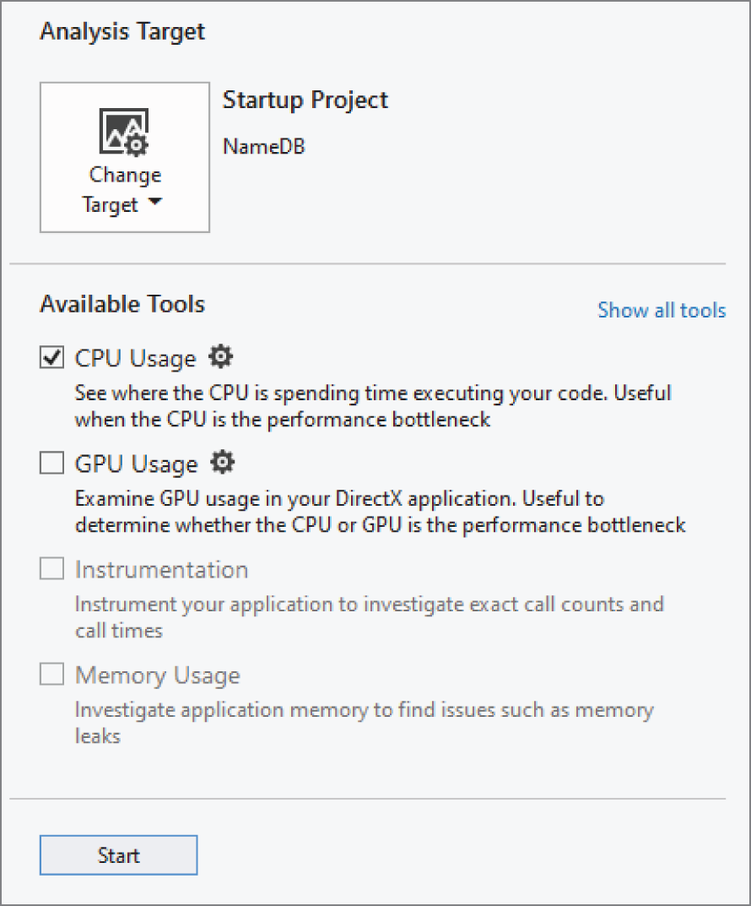

:::tip[WHAT'S IN THIS CHAPTER?]
- What \*efficiency\* and \*performance\* mean
- What kind of language-level optimizations you can use
- Which design-level guidelines you can follow to design efficient programs
- What profiling tools are
:::

:::tip[WILEY.COM DOWNLOADS FOR THIS CHAPTER]
Please note that all the code examples for this chapter are available as part of this chapter's code download on the book's website at `www.wiley.com/go/proc++6e` on the Download Code tab.
:::

The efficiency of your programs is important regardless of your application domain. If your product competes with others in the marketplace, speed can be a major differentiator: given the choice between a slower and a faster program, which one would you choose? No one would buy an operating system that takes two weeks to boot up. Even if you don't intend to sell your products, they will have users. Those users will not be happy with you if they end up wasting time waiting for your programs to complete tasks.

Now that you understand the concepts of professional C++ design and coding and have tackled some of the more complex facilities that the language provides, you are ready to incorporate performance into your programs. Writing efficient programs involves thought at the design level, as well as details at the implementation level. Although this chapter falls late in this book, remember to consider performance from the beginning of your projects.

## OVERVIEW OF PERFORMANCE AND EFFICIENCY

Before delving further into the details, it's helpful to define the terms *performance* and *efficiency*, as used in this book. The *performance* of a program can refer to several areas, such as speed, memory usage, disk access, and network use. This chapter focuses on speed performance. The term *efficiency*, when applied to programs, means running without wasted effort. An efficient program completes its tasks as quickly as possible within the given circumstances. A program can be efficient without being fast, if the application domain is inherently prohibitive to quick execution.

:::note
An efficient, or high-performance, program runs as fast as possible for its particular task.
:::

Note that the title of this chapter, “Writing Efficient C++,” means writing programs that run efficiently, not efficiently writing programs. That is, the time you learn to save by reading this chapter will be your users', not your own!

### Two Approaches to Efficiency

*Language-level efficiency* involves using the language as efficiently as possible; for example, passing objects by reference instead of by value. However, this will only get you so far. Much more important is *design-level efficiency*, which includes choosing efficient algorithms, avoiding unnecessary steps and computations, and selecting appropriate design optimizations. More often than not, optimizing existing code involves replacing a bad algorithm or data structure with a better, more efficient one.

### Two Kinds of Programs

As I've noted, efficiency is important for all application domains. Additionally, there is a small subset of programs, such as system-level software, embedded systems, intensive computational applications, and real-time games, that require extremely high levels of efficiency. Most programs don't. Unless you write those types of high-performance applications, you probably don't need to worry about squeezing every ounce of speed out of your C++ code. Think of it as the difference between building normal family cars and building race cars. Every car must be reasonably efficient, but sports cars require extremely high performance. You wouldn't want to waste your time optimizing family cars for speed when they'll never go faster than 70 miles per hour.

### Is C++ an Inefficient Language?

C programmers often resist using C++ for high-performance applications. They claim that the language is inherently less efficient than C or a similar procedural language because C++ includes high-level concepts, such as exceptions and virtual member functions. However, there are problems with this argument.

When discussing the efficiency of a language, you cannot ignore the effect of compilers. Recall that the C or C++ code you write is not the code that the computer executes. A compiler first translates that code into machine language, applying optimizations in the process. This means that you can't simply run benchmarks of C and C++ programs and compare the results. You're really comparing the compiler optimizations of the languages, not the languages themselves. C++ compilers can optimize away many of the high-level constructs in the language to generate machine code similar to, or even better than, the machine code generated from a comparable C program. These days, much more research and development is poured into C++ compilers than into C compilers, so C++ code might actually get better optimized and might run faster than C code.

Critics, however, still maintain that some features of C++ cannot be optimized away. For example, as [Chapter 10](../c10), “Discovering Inheritance Techniques,” explains, virtual member functions require the existence of a vtable, also known as virtual table, and an additional level of indirection at run time, possibly making them slower than regular nonvirtual function calls. However, when you really think about it, this argument is unconvincing. Virtual member function calls provide more than just a function call: they also give you a run-time choice of which function to call. A comparable non-virtual function call would need a conditional statement to decide which function to call. If you don't need those extra semantics, you can use a non-virtual function. A general design rule in the C++ language is that “if you don't use a feature, you don't need to pay for it.” If you don't use virtual member functions, you pay no performance penalty for the fact that you *could* use them. Thus, non-virtual function calls in C++ are identical to function calls in C in terms of performance.

Far more important, the high-level constructs of C++ enable you to write cleaner programs that are more efficient at the design level, are more readable, are more easily maintained, and avoid accumulating unnecessary and dead code.

I believe that you will be better served in your development, performance, and code maintenance by choosing C++ instead of a procedural language such as C.

There are also other higher-level object-oriented languages such as C# and Java, both of which run on top of a virtual machine. C++ code is executed directly by a CPU; there is no such thing as a virtual machine to run your code. C++ is closer to the hardware, which means that in most cases it runs faster than languages such as C# and Java.

## LANGUAGE-LEVEL EFFICIENCY

Many books, articles, and programmers spend a lot of time trying to convince you to apply language-level optimizations to your code. These tips and tricks are important and can speed up your programs in some cases. However, they are far less important than the overall design and algorithm choices in your program. You can pass-by-reference all you want, but it won't make your program fast if you perform twice as many disk writes as you need to. It's easy to get bogged down in references and pointers and forget about the big picture.

Furthermore, some of these language-level tricks can be performed automatically by good optimizing compilers. A rule of thumb is that you should never spend time optimizing a particular area, unless a profiler, discussed later in this chapter, tells you that that particular area is a bottleneck.

That being said, using certain language-level optimizations, such as pass-by-reference, is just considered good coding style.

In this book, I've tried to present a balance of strategies. So, I've included here what I feel are the most useful language-level optimizations. This list is not comprehensive but is a good start to write optimized code. However, make sure to read, and practice, the design-level efficiency advice that I offer later in this chapter as well.

:::warning
Apply language-level optimizations thoughtfully. I recommend making a clean, well-structured design and implementation first. Then use a profiler, and only invest time optimizing those parts that are flagged by a profiler as being a performance bottleneck.
:::

### Handle Objects Efficiently

C++ does a lot of work for you behind the scenes, particularly with regard to objects. You should always be aware of the performance impact of the code you write. If you follow a few simple guidelines, your code will become more efficient. Note that these guidelines are only relevant for objects, and not for primitive types such as `bool`, `int`, `float`, and so on.

#### Pass-by-Value or Pass-by-Reference

[Chapters 1](../c01), “A Crash Course in C++ and the Standard Library,” and [9](../c09), “Mastering Classes and Objects,” present a rule to decide between pass-by-value and pass-by-reference. The rule is worth repeating here.

:::warning
Prefer pass-by-value parameters for parameters that a function inherently would copy, but only if the parameter is of a type that supports move semantics. Otherwise, use reference-to-`const` parameters.
:::

With pass-by-value parameters, you have to keep a few things in mind. When you pass an object of a derived class by value as an argument for a function parameter that has one of the base classes as its type, then the derived object is “sliced” to fit into the base class type. This causes information to be lost; see [Chapter 10](../c10) for details. Pass-by-value could also incur copying costs that are avoided with pass-by-reference.

However, in certain cases, pass-by-value is actually the optimal way to pass an argument to a function. Consider a class to represent a person that looks as follows:

```cpp
class Person
{
    public:
        Person() = default;
        explicit Person(string firstName, string lastName, int age)
            : m_firstName { move(firstName) }, m_lastName { move(lastName) }
            , m_age { age } { }
        virtual ~Person() = default;
 
        const string& getFirstName() const { return m_firstName; }
        const string& getLastName() const { return m_lastName; }
        int getAge() const { return m_age; }
 
     private:
        string m_firstName, m_lastName;
        int m_age { 0 };
};
```

As the rule recommends, the `Person` constructor accepts `firstName` and `lastName` by value and then moves them to `m_firstName` and `m_lastName`, respectively, because it would make a copy of those anyway. See [Chapter 9](../c09) for an explanation of this idiom.

Now, take a look at the following function accepting a `Person` object by value:

```cpp
void processPerson(Person p) { /* Process the person. */ }
```

You can call this function like this:

```cpp
Person me { "Marc", "Gregoire", 42 };
processPerson(me);
```

This doesn't look like there's more code than if you write the function like this instead:

```cpp
void processPerson(const Person& p) { /* Process the person. */ }
```

The call to the function remains the same. However, consider what happens when you pass-by-value in the first version of the function. To initialize the `p` parameter of `processPerson()`, `me` must be copied with a call to its copy constructor. Even though you didn't write a copy constructor for the `Person` class, the compiler generates one that copies each of the data members. That still doesn't look so bad: there are only three data members. However, two of them are `string`s, which are themselves objects with copy constructors. So, each of their copy constructors will be called as well. The version of `processPerson()` that takes `p` by reference incurs no such copying costs. Thus, pass-by-reference in this example avoids a lot of overhead when the code enters the function.

And you're still not done. Remember that `p` in the first version of `processPerson()` is a local variable to the `processPerson()` function, and so must be destroyed when the function exits. This destruction requires a call to the `Person` destructor, which will call the destructor of all the data members. `string`s have destructors, so exiting this function (if you passed by value) incurs calls to three destructors. None of those calls are needed if the `Person` object is passed by reference.

:::note
If a function must modify an object, pass the object by reference-to-non-`const`. If the function should not modify the object, pass it by value or by reference-to-`const`, as in the preceding example.
:::

:::note
Avoid using pass-by-pointer, which is a relatively obsolete technique for pass-by-reference. It is a throwback to the C language and thus rarely suitable in C++ (unless passing `nullptr` has meaning in your design).
:::

#### Return-by-Value or Return-by-Reference

You could return objects by reference from functions to avoid copying the objects unnecessarily. Unfortunately, it is sometimes impossible to return objects by reference, such as when you write overloaded `operator+` and other similar operators. And, you should never return a reference or a pointer to a local object that will be destroyed when the function exits!

However, returning objects by value from functions is usually fine. This is due to mandatory and non-mandatory elision of copy/move operations and move semantics, both of which optimize returning objects by value, and both are discussed [Chapter 9](../c09).

#### Catch Exceptions by Reference

As noted in [Chapter 14](../c14), “Handling Errors,” you should catch exceptions by reference to avoid slicing and unnecessary copying. Throwing exceptions is heavy in terms of performance, so any little thing you can do to improve their efficiency will help.

#### Use Move Semantics

You should make sure your classes support move semantics (see [Chapter 9](../c09)), either through the compiler-generated move constructor and move assignment operator or by implementing them yourself. According to the rule of zero (see [Chapter 9](../c09)), you should try to design your classes such that the compiler-generated copy and move constructors and copy and move assignment operators are sufficient. If the compiler cannot implicitly define these for a class, try to explicitly default them if that works for your class. If that is also not an option, you should implement them yourself. With move semantics for your objects, lots of operations will be more efficient, especially in combination with Standard Library containers and algorithms.

#### Avoid Creating Temporary Objects

The compiler creates temporary, unnamed objects in several circumstances. [Chapter 9](../c09) explains that after writing a global `operator+` for a class, you can add objects of that class to other types, as long as those types can be converted to objects of that class. For example, the `SpreadsheetCell` class definition from [Chapter 9](../c09), which includes support for the arithmetic operators, looks in part like this:

```cpp
export class SpreadsheetCell
{
    public:
        // Other constructors omitted for brevity.
        SpreadsheetCell(double initialValue);
        // Remainder omitted for brevity.
};
 
export SpreadsheetCell operator+(const SpreadsheetCell& lhs,
    const SpreadsheetCell& rhs);
```

The non-`explicit` constructor that takes a `double` allows you to write code like this:

```cpp
SpreadsheetCell myCell { 4 }, aThirdCell;
aThirdCell = myCell + 5.6;
aThirdCell = myCell + 4;
```

The second statement constructs a temporary `SpreadsheetCell` object from the `5.6` argument; it then calls the `operator+` with `myCell` and this temporary object as arguments. The result is stored in `aThirdCell`. The third statement does the same thing, except that `4` must be coerced to a `double` to call the `double` constructor of the `SpreadsheetCell`.

The important point in this example is that the compiler generates code to create an extra, unnamed `SpreadsheetCell` object for both addition operations in this example. That object must be constructed and destructed with calls to its constructor and destructor. If you're still skeptical, try inserting `print()` statements in your constructor and destructor, and watch the printout.

In general, the compiler constructs a temporary object whenever your code converts a variable of one type to another type for use in a larger expression. This rule applies mostly to function calls. For example, suppose that you write a function with the following prototype:

```cpp
void doSomething(const SpreadsheetCell& s);
```

You can call this function like this:

```cpp
doSomething(5.56);
```

The compiler constructs a temporary `SpreadsheetCell` object from `5.56` using the `double` constructor. This temporary object is then passed to `doSomething()`. Note that if you remove the `const` from the `s` parameter, you can no longer call `doSomething()` with a constant; you must pass an lvalue.

You should generally attempt to avoid cases in which the compiler is forced to construct temporary objects. Although it is impossible to avoid in some situations, you should at least be aware of the existence of this “feature” so you aren't surprised by performance and profiling results.

Move semantics is used by the compiler to make working with temporary objects more efficient. That's another reason to make sure your classes support move semantics. See [Chapter 9](../c09) for details.

### Pre-allocate Memory

One of the main advantages of using containers such as those from the C++ Standard Library discussed in [Chapter 18](../c18), “Standard Library Containers,” is that they handle all memory management for you. The containers grow automatically when you add more elements to them. However, sometimes this causes a performance penalty. For example, an `std::vector` container stores its elements contiguously in memory. If it needs to grow in size, it needs to allocate a new block of memory and then move (or copy) all elements to this new memory. This has serious performance implications, for example, if you use `push_back()` in a loop to add millions of elements to a `vector`.

If you know in advance how many elements you are going to add to a `vector` or if you have a rough estimate, you should pre-allocate enough memory before starting to add your elements. A `vector` has a capacity, that is, the number of elements that can be added without reallocation, and a size, that is, the actual number of elements in the container. You can pre-allocate memory by changing the capacity using the `reserve()` member function or by resizing the `vector` using `resize()`. See [Chapter 18](../c18) for details.

### Use Inline Functions

Some compilers use the `inline` keyword as a hint to the optimizer to more aggressively optimize a marked function (especially at low optimization levels). If you notice that a particular small function is a performance bottleneck, try marking it `inline`. Do not overuse this feature, because it throws away a fundamental design principle stating that the interface and the implementation should be separated such that the implementation can evolve without changes to the interface.

### <cpp23></cpp23> Mark Unreachable Code

The C++ Standard Library includes `std::unreachable`, defined in `<utility>`, to mark source code locations as being *unreachable*. Doing so helps the compiler to better optimize the final executable code. For example,[^1] the following function accepts an integer parameter, and the programmer of this function knows for a fact that this parameter can only ever have the values 0, 1, 2, or 3, nothing else.

```cpp
void doSomething(int number_that_is_only_0_1_2_or_3)
{
    switch (number_that_is_only_0_1_2_or_3) {
        case 0:
        case 2:
            handle0Or2(); break;
        case 1:
            handle1();    break;
        case 3:
            handle3();    break;
    }
}
```

However, all the compiler sees is an `int` parameter, so it doesn't know that the value can be only 0, 1, 2, or 3. The `switch` statement in the function handles all possible values of the parameter. However, the compiler does not know this and thus must generate executable code to check that the value is 0, 1, 2, or 3, before it executes the jump to the correct `case` block; for any other value, it has to jump to the first statement after the `switch` statement.

By adding a `default` case to the `switch` statement and specifying to the compiler that this `default` case will never be reached, the compiler can omit the executable code to check that the parameter value is 0, 1, 2, or 3, and just immediately jump to the correct `case` block. In certain cases, for example in tight loops, this can improve the performance of the final executable code.

```cpp
void doSomething(int number_that_is_only_0_1_2_or_3)
{
    switch (number_that_is_only_0_1_2_or_3) {
        // Same cases for 0, 1, 2, and 3 as before, omitted for brevity…
        default:
            unreachable();
    }
}
```

If a call to `unreachable()` is ever reached at run time, the result is undefined behavior. For example, calling `doSomething()` with argument 8 triggers undefined behavior, and a compiler is free to choose what to do in such a case.

## DESIGN-LEVEL EFFICIENCY

The design choices in your program affect its performance far more than do language details such as pass-by-reference. For example, if you choose an algorithm for a fundamental task in your application that runs in *O*(*n*2) time instead of a simpler one that runs in *O*(*n*) time, you could potentially perform the square of the number of operations that you really need. To put numbers on that, a task that uses an *O*(*n*2) algorithm and performs 1 million operations would perform only 1,000 with an *O*(*n*) algorithm. Even if that operation is optimized beyond recognition at the language level, the simple fact that you perform 1 million operations when a better algorithm would use only 1,000 will make your program very inefficient. Always choose your algorithms carefully. Refer to [Part II](../p02), specifically [Chapter 4](../c04), “Designing Professional C++ Programs,” of this book for a detailed discussion of algorithm design choices and big-O notation.

In addition to your choice of algorithms, design-level efficiency includes specific tips and tricks. Instead of writing your own data structures and algorithms, you should use existing ones, such as those from the C++ Standard Library, the Boost libraries (`boost.org`), or other libraries, as much as possible because they are written by experts. These libraries have been, and are being, used a lot, so you can expect most bugs to have been discovered and fixed. You should also think about incorporating multithreading in your design to take full advantage of all the processing power available on a machine. See [Chapter 27](../c27), “Multithreaded Programming with C++,” for more details. The remainder of this section presents two more design techniques for optimizing your program: caching and using object pools.

### Cache Where Necessary

*Caching* means storing items for future use to avoid retrieving or recalculating them. You might be familiar with the principle from its use in computer hardware. Modern computer processors are built with memory caches that store recently and frequently accessed memory values in a location that is quicker to access than main memory. Most memory locations that are accessed at all are accessed more than once in a short time period, so caching at the hardware level can significantly speed up computations.

Caching in software follows the same approach. If a task or computation is particularly slow, you should make sure that you are not performing it more than necessary. Store the results in memory the first time you perform the task so that they are available for future needs. Here is a list of tasks that are usually slow:

- **Disk access:** You should avoid opening and reading the same file more than once in your program. If memory is available, save the file contents in RAM if you need to access it frequently.
- **Network communication:** Whenever you need to communicate over a network, your program is subject to the vagaries of the network. Treat network accesses like file accesses, and cache as much static information as possible.
- **Mathematical computations:** If you need the result of a complex computation in more than one place, perform the calculation once and share the result. However, if it's not very complex, then it's probably faster to just calculate it instead of retrieving it from a cache. Use a profiler to be sure.
- **Object allocation:** If you need to create and use a large number of short-lived objects in your program, consider using an object pool, described later in this chapter.
- **Thread creation:** Creating threads is slow. You can “cache” threads in a thread pool, similar to caching objects in an object pool.

One common problem with caching is that the data you store often comprises only copies of the underlying information. The original data might change during the lifetime of the cache. For example, you might want to cache the values in a configuration file so that you don't need to read it repeatedly. However, the user might be allowed to change the configuration file while your program is running, which would make your cached version of the information obsolete. In cases like this, you need a mechanism for *cache invalidation*: when the underlying data changes, you must either stop using your cached information or repopulate your cache.

One technique for cache invalidation is to request that the entity managing the underlying data notifies your program of every change. It could do this through a *callback* that your program registers with the manager. Alternatively, your program could poll for certain events that would trigger it to repopulate the cache automatically. Regardless of your specific cache invalidation technique, make sure that you think about these issues before relying on a cache in your program.

When adding caching to a data structure, make sure your design hides any details of this caching from the `public` interface. Client code should not be aware that the underlying implementation uses any kind of caching. This also allows you to change the caching mechanism without affecting the `public` interface.

:::note
Always keep in mind that maintaining caches takes code, memory, and processing time. On top of that, caches can be a source of subtle bugs. You should only add caching to a particular area when a profiler clearly shows that that area is a performance bottleneck. First write clean and correct code, then profile it, and only then optimize parts of it.
:::

### Use Object Pools

There are different kinds of object pools. This section discusses one kind of object pool where it allocates a large chunk of memory at once, in which the pool creates smaller objects in-place. These objects can be handed out to clients and reused when clients are done with them, without incurring any additional calls to the memory manager to allocate or deallocate memory for individual objects.

Where the following object pool implementation shines, as will be demonstrated with benchmarks, is for objects with big data members. Whether or not an object pool is the right solution for a specific use case can only be decided by profiling your code.

#### An Object Pool Implementation

This section provides an implementation of an object pool class template that you can use in your programs. The implementation keeps a `vector` of chunks of objects of type `T`. Additionally, it also keeps track of free objects in a `vector` that contains pointers to all free objects. The pool hands out objects via the `acquireObject()` member function. If `acquireObject()` is called but there are no free objects anymore, then the pool allocates another chunk of objects. `acquireObject()` returns a `shared_ptr`.

This implementation is using the `vector` Standard Library container without any synchronization. As such, this version is not thread-safe. See [Chapter 27](../c27) for a discussion on how you can make the implementation thread-safe.

Here is the class definition with comments explaining the details. The class template is parameterized on the type that is to be stored in the pool and on the type of allocator to use for allocating and deallocating chunks of memory.

```cpp
// Provides an object pool that can be used with any class.
//
// acquireObject() returns an object from the list of free objects. If
// there are no more free objects, acquireObject() creates a new chunk
// of objects.
// The pool only grows: objects are never removed from the pool, until
// the pool is destroyed.
// acquireObject() returns an std::shared_ptr with a custom deleter that
// automatically puts the object back into the object pool when the
// shared_ptr is destroyed and its reference count reaches 0.
export
template <typename T, typename Allocator = std::allocator<T>>
class ObjectPool final
{
    public:
        ObjectPool() = default;
        explicit ObjectPool(const Allocator& allocator);
        ~ObjectPool();
 
        // Prevent move construction and move assignment.
        ObjectPool(ObjectPool&&) = delete;
        ObjectPool& operator=(ObjectPool&&) = delete;
 
        // Prevent copy construction and copy assignment.
        ObjectPool(const ObjectPool&) = delete;
        ObjectPool& operator=(const ObjectPool&) = delete;
 
        // Reserves and returns an object from the pool. Arguments can be
        // provided which are perfectly forwarded to a constructor of T.
        template <typename… Args>
        std::shared_ptr<T> acquireObject(Args&&… args);
 
    private:
        // Creates a new block of uninitialized memory, big enough to hold
        // m_newChunkSize instances of T.
        void addChunk();
        // Contains chunks of memory in which instances of T will be created.
        // For each chunk, the pointer to its first object is stored.
        std::vector<T*> m_pool;
        // Contains pointers to all free instances of T that
        // are available in the pool.
        std::vector<T*> m_freeObjects;
        // The number of T instances that should fit in the first allocated chunk.
        static constexpr std::size_t ms_initialChunkSize { 5 };
        // The number of T instances that should fit in a newly allocated chunk.
        // This value is doubled after each newly created chunk.
        std::size_t m_newChunkSize { ms_initialChunkSize };
        // The allocator to use for allocating and deallocating chunks.
        Allocator m_allocator;
};
```

When using this object pool, you have to make sure that the object pool itself outlives all the objects handed out by the pool.

The constructor is trivial and just stores the given allocator in a data member:

```cpp
template <typename T, typename Allocator>
ObjectPool<T, Allocator>::ObjectPool(const Allocator& allocator)
    : m_allocator { allocator }
{
}
```

The `addChunk()` member function to allocate a new chunk is implemented as follows. The first part of `addChunk()` does the actual allocation of a new chunk. A “chunk” is just a block of *uninitialized* memory, allocated using an allocator and big enough to hold `m_newChunkSize` instances of `T`. By adding a chunk of objects, no objects are actually constructed yet; i.e., no object constructors are called. That is done later in `acquireObject()` when instances are handed out. The second part of `addChunk()` creates pointers to the new instances of `T`. It uses the `iota()` algorithm, defined in `<numeric>`. To refresh your memory, `iota()` fills a range given by its first two arguments with values. The values start with the value of the third argument and are incremented by one for each subsequent value. Since we are working with `T*` pointers, incrementing a `T*` pointer by one jumps ahead to the next `T` in the memory block. Finally, the `m_newChunkSize` value is doubled so that the next block that will be added is double the size of the currently added block. This is done for performance reasons and follows the principle of `std::vector`. Here is the implementation:

```cpp
template <typename T, typename Allocator>
void ObjectPool<T, Allocator>::addChunk()
{
    std::println("Allocating new chunk…");
 
    // Allocate a new chunk of uninitialized memory big enough to hold
    // m_newChunkSize instances of T, and add the chunk to the pool.
    // Care is taken that everything is cleaned up in the event of an exception.
    m_pool.push_back(nullptr);
    try {
        m_pool.back() = m_allocator.allocate(m_newChunkSize);
    } catch (…) {
        m_pool.pop_back();
        throw;
    }
 
    // Create pointers to each individual object in the new chunk
    // and store them in the list of free objects.
    auto oldFreeObjectsSize { m_freeObjects.size() };
    m_freeObjects.resize(oldFreeObjectsSize + m_newChunkSize);
    std::iota(begin(m_freeObjects) + oldFreeObjectsSize, end(m_freeObjects),
        m_pool.back());
 
    // Double the chunk size for next time.
    m_newChunkSize *= 2;
}
```

`acquireObject()`, a variadic member function template, returns a free object from the pool, allocating a new chunk if there are no more free objects available. As explained earlier, adding a new chunk just allocates a block of uninitialized memory. It is the responsibility of `acquireObject()` to properly construct a new instance of `T` at the right place in memory. This is done using a placement `new` operator. Any arguments passed to `acquireObject()` are perfectly forwarded to a constructor of type `T`.

`acquireObject()` uses a placement `new` operator to construct a new instance of an object of type `T` at an explicitly specified memory location. If type `T` contains any `const` or reference members, accessing the newly constructed object through the original pointer triggers undefined behavior. To turn this into defined behavior, you need to launder the memory using `std::launder()`, defined in `<new>`.[^2]

Finally, the laundered `T*` pointer is wrapped in a `shared_ptr` with a custom deleter. This deleter does not deallocate any memory; instead, it manually calls the destructor by using `std::destroy_at()` and then puts the pointer back on the list of available objects.

```cpp
template <typename T, typename Allocator>
template <typename… Args>
std::shared_ptr<T> ObjectPool<T, Allocator>::acquireObject(Args&&… args)
{
    // If there are no free objects, allocate a new chunk.
    if (m_freeObjects.empty()) { addChunk(); }
 
    // Get a free object.
    T* object { m_freeObjects.back() };
 
    // Initialize, i.e. construct, an instance of T in an
    // uninitialized block of memory using placement new, and
    // perfectly forward any provided arguments to the constructor.
    ::new(object) T { std::forward<Args>(args)… };
 
    // Launder the object pointer.
    T* constructedObject { std::launder(object) };
 
    // Remove the object from the list of free objects.
    m_freeObjects.pop_back();
 
    // Wrap the constructed object and return it.
    return std::shared_ptr<T> { constructedObject, [this](T* object) {
        // Destroy object.
        std::destroy_at(object);
        // Put the object back in the list of free objects. 
        m_freeObjects.push_back(object);
    } };
}
```

Finally, the destructor of the pool must deallocate any allocated memory using the given allocator:

```cpp
template <typename T, typename Allocator>
ObjectPool<T, Allocator>::~ObjectPool()
{
    // Note: this implementation assumes that all objects handed out by this
    //       pool have been returned to the pool before the pool is destroyed.
    //       The following statement asserts if that is not the case.
    assert(m_freeObjects.size() ==
        ms_initialChunkSize * (std::pow(2, m_pool.size()) - 1));
 
    // Deallocate all allocated memory.
    std::size_t chunkSize { ms_initialChunkSize };
    for (auto* chunk : m_pool) {
        m_allocator.deallocate(chunk, chunkSize);
        chunkSize *= 2;
    }
    m_pool.clear();
}
```

`assert()` is a macro defined in `<cassert>`. It takes a Boolean expression and, if the expression evaluates to `false`, prints an error message and terminates the program. [Chapter 31](../c31), “Conquering Debugging,” gives more details. The formula used in the `assert()` statement is based on the fact that each allocated chunk is double in size compared to the previous chunk.

#### Using the Object Pool

Consider an application that uses a lot of short-lived objects with big data members and hence are expensive to allocate. Let's assume we have an `ExpensiveObject` class definition that looks as follows:

```cpp
class ExpensiveObject
{
    public:
        ExpensiveObject() { /* … */ }
        virtual ~ExpensiveObject() = default;
        // Member functions to populate the object with specific information.
        // Member functions to retrieve the object data.
        // (not shown)
    private:
        // An expensive data member.
        array<double, 4 * 1024 * 1024> m_data;
        // Other data members (not shown)
};
```

Instead of allocating and deallocating large numbers of such objects throughout the lifetime of your program, you can use the object pool developed in the previous section. We can benchmark the pool using the chrono library (see [Chapter 22](../c22), “Date and Time Utilities”) as follows:

```cpp
using MyPool = ObjectPool<ExpensiveObject>;
 
shared_ptr<ExpensiveObject> getExpensiveObject(MyPool& pool)
{
    // Obtain an ExpensiveObject object from the pool.
    auto object { pool.acquireObject() };
    // Populate the object. (not shown)
    return object;
}
 
void processExpensiveObject(ExpensiveObject& object) { /* … */ }
 
int main()
{
    const size_t NumberOfIterations { 500'000 };
 
    println("Starting loop using pool…");
    MyPool requestPool;
    auto start1 { chrono::steady_clock::now() };
    for (size_t i { 0 }; i < NumberOfIterations; ++i) {
        auto object { getExpensiveObject(requestPool) };
        processExpensiveObject(*object.get());
    }
    auto end1 { chrono::steady_clock::now() };
    auto diff1 { end1 - start1 };
    println("{}", chrono::duration<double, milli>(diff1));
 
 
    println("Starting loop using new/delete…");
    auto start2 { chrono::steady_clock::now() };
    for (size_t i { 0 }; i < NumberOfIterations; ++i) {
        auto object { std::make_unique<ExpensiveObject>() };
        processExpensiveObject(*object);
    }
    auto end2 { chrono::steady_clock::now() };
    auto diff2 { end2 - start2 };
    println("{}", chrono::duration<double, milli>(diff2));
}
```

The `main()` function contains a small benchmark of the pool's performance. It asks for 500,000 objects in a loop and times how long it takes. The loop is done twice, once using our pool and once using the standard `new`/`delete` operators. The results on a test machine with a release build of the code are as follows:

```cpp
Starting loop using pool…
Allocating new chunk…
54.526ms
Starting loop using new/delete…
9463.2393ms
```

In this example, using the object pool is around 170 times faster. Keep in mind, though, that this object pool is tailored to work with objects with big data members. This is the case for the `ExpensiveObject` class used in the example, which contains a 32MB `array` as one of its data members.

## PROFILING

It is good to think about efficiency as you design and code. There is no point in writing obviously inefficient programs if this can be avoided with some common sense or experience-based intuition. However, I urge you not to get too obsessed with performance during the design and coding phases. It's best to first make a clean, well-structured design and implementation, then use a profiler, and only optimize parts that are flagged by the profiler as being performance bottlenecks. Remember the “90/10” rule, introduced in [Chapter 4](../c04), which states that 90 percent of the running time of most programs is spent in only 10 percent of the code (Hennessy and Patterson, *Computer Architecture, A Quantitative Approach, Fourth Edition*, [Morgan Kaufmann, 2006]). This means you could optimize 90 percent of your code, but still only improve the running time of the program by 10 percent. Obviously, you want to optimize the parts of the code that are exercised the most for the specific workload that you expect the program to run.

Consequently, it is often helpful to *profile* your program to determine which parts of the code require optimization. There are many *profiling tools* available that analyze programs as they run to generate data about their performance. Most profiling tools provide analysis at the function level by specifying the amount of time (or percent of total execution time) spent in each function in the program. After running a profiler on your program, you can usually tell immediately which parts of the program need optimization. Profiling before and after optimizing is essential to prove that your optimizations had an effect.

If you are using Microsoft Visual C++, you already have a great built-in profiler, which is discussed later in this chapter. If you are not yet using Visual C++, Microsoft has a community edition available (`visualstudio.microsoft.com`) that is free of charge for students, open-source developers, and individual developers to create both free and paid applications. It's also free of charge for up to five users in small organizations. Another great profiling tool is Rational PurifyPlus from IBM (`www.almtoolbox.com/purify.php`). There are also a number of smaller free profiling tools available: Very Sleepy (`www.codersnotes.com/sleepy`) and Luke Stackwalker (`lukestackwalker.sourceforge.net`) are popular profilers for Windows, Valgrind (`valgrind.org`) and gprof (GNU profiler, `sourceware.org/binutils/docs/gprof`) are well-known profilers for Unix/Linux systems, and there are plenty of other choices. This section demonstrates two profilers: gprof for Linux, and the profiler that comes with Visual C++ 2022.

### Profiling Example with gprof

The power of profiling can best be seen with a real coding example. As a disclaimer, the performance bugs in the first implementation shown are not subtle! Real efficiency issues would probably be more complex, but a program long enough to demonstrate them would be too lengthy for this book.

Suppose that you work for the US Social Security Administration. Every year the administration puts up a website that allows users to look up the popularity of new baby names from the previous year. Your job is to write the backend program that looks up names for users. Your input is a file containing the name of every new baby. This file will obviously contain duplicate names. For example, in the file for boys for 2003, the name Jacob was the most popular, showing up 29,195 times. Your program must read the file to construct an in-memory database. A user may then request the absolute number of babies with a given name or the rank of that name among all the babies.

#### First Design Attempt

A logical design for this program consists of a `NameDB` class with the following public member functions:

```cpp
export class NameDB
{
    public:
        // Reads list of baby names in nameFile to populate the database.
        // Throws invalid_argument if nameFile cannot be opened or read.
        explicit NameDB(const std::string& nameFile);
 
        // Returns the rank of the name (1st, 2nd, etc).
        // Returns –1 if the name is not found.
        int getNameRank(const std::string& name) const;
 
        // Returns the number of babies with a given name.
        // Returns –1 if the name is not found.
        int getAbsoluteNumber(const std::string& name) const;
 
        // Private members not shown yet …
};
```

The hard part is choosing a good data structure for the in-memory database. A first attempt is a `vector` of name/count `pair`s. Remember, `pair` is a utility class that combines two values of possibly different types. Each entry in the `vector` stores one of the names, along with a count of the number of times that name shows up in the raw data file. Here is the complete class definition with this design:

```cpp
export class NameDB
{
    public:
        explicit NameDB(const std::string& nameFile);
        int getNameRank(const std::string& name) const;
        int getAbsoluteNumber(const std::string& name) const;
    private:
        std::vector<std::pair<std::string, int>> m_names;
 
        // Helper member functions
        bool nameExists(const std::string& name) const;
        void incrementNameCount(const std::string& name);
        void addNewName(const std::string& name);
};
```

Here are the implementations of the constructor and the helper member functions `nameExists()`, `incrementNameCount()`, and `addNewName()`. The loops in `nameExists()` and `incrementNameCount()` iterate over all the elements of the `vector`.

```cpp
// Reads the names from the file and populates the database.
// The database is a vector of name/count pairs, storing the
// number of times each name shows up in the raw data.
NameDB::NameDB(const string& nameFile)
{
    // Open the file and check for errors.
    ifstream inputFile { nameFile };
    if (!inputFile) {
        throw invalid_argument { "Unable to open file" };
    }
 
    // Read the names one at a time.
    string name;
    while (inputFile >> name) {
        // Look up the name in the database so far.
        if (nameExists(name)) {
            // If the name exists in the database, just increment the count.
            incrementNameCount(name);
        } else {
            // If the name doesn't yet exist, add it with a count of 1.
            addNewName(name);
        }
    }
}
 
// Returns true if the name exists in the database, false otherwise.
bool NameDB::nameExists(const string& name) const
{
    // Iterate through the vector of names looking for the name.
    for (auto& entry : m_names) {
        if (entry.first == name) {
            return true;
        }
    }
    return false;
}
 
// Precondition: name exists in the vector of names.
// Postcondition: the count associated with name is incremented.
void NameDB::incrementNameCount(const string& name)
{
    for (auto& entry : m_names) {
        if (entry.first == name) {
            entry.second += 1;
            return;
        }
    }
}
 
// Adds a new name to the database.
void NameDB::addNewName(const string& name)
{
    m_names.emplace:back(name, 1);
}
```

Note that you could use an algorithm like `std::find_if()`, discussed in [Chapter 20](../c20), “Mastering Standard Library Algorithms,” to accomplish the same thing as the loops in `nameExists()` and `incrementNameCount()`. The loops are shown explicitly to emphasize the performance problems.

You might have noticed some performance problems already. What if there are hundreds of thousands of names? The many linear searches involved in populating the database will become slow.

To complete the example, here are the implementations of the two public member functions:

```cpp
// Returns the rank of the name.
// First looks up the name to obtain the number of babies with that name.
// Then iterates through all the names, counting all the names with a higher
// count than the specified name. Returns that count as the rank.
int NameDB::getNameRank(const string& name) const
{
    // Make use of the getAbsoluteNumber() member function.
    int num { getAbsoluteNumber(name) };
 
    // Check if we found the name.
    if (num == -1) {
        return -1;
    }
 
    // Now count all the names in the vector that have a
    // count higher than this one. If no name has a higher count,
    // this name is rank number 1. Every name with a higher count
    // decreases the rank of this name by 1.
    int rank { 1 };
    for (auto& entry : m_names) {
        if (entry.second > num) {
            ++rank;
        }
    }
    return rank;
}
 
// Returns the count associated with the given name.
int NameDB::getAbsoluteNumber(const string& name) const
{
    for (auto& entry : m_names) {
        if (entry.first == name) {
            return entry.second;
        }
    }
    return -1;
}
```

#### Profiling the First Design Attempt

To test the program, you need a `main()` function:

```cpp
import name_db;
import std;
using namespace std;
 
int main()
{
    NameDB boys { "boys_long.txt" };
    println("{}", boys.getNameRank("Daniel"));
    println("{}", boys.getNameRank("Jacob"));
    println("{}", boys.getNameRank("William"));
}
```

This `main()` function creates one `NameDB` database called `boys`, telling it to populate itself with the file `boys_long.txt`, which contains 500,500 names.

There are three steps to using gprof:

1. After having compiled the `name_db` module, you should compile the main program with a special flag that causes it to log raw execution information when it is run. When using GCC as your compiler, the flag is `-pg`, as in this example:

   ```cpp
   > gcc -lstdc++ -std=c++2b -pg -fmodules-ts -o namedb NameDB.cpp NameDBTest.cpp
   ```

   :::note
   At the time of this writing, GCC does not yet have full support for C++ modules. Once GCC fully supports modules, check its documentation to learn how to compile and work with modules.
   :::
2. Run your program. This should generate a file called `gmon.out` in the working directory. Be patient when you run the program because this first version is slow.
3. Run the `gprof` command. This final step enables you to analyze the `gmon.out` profiling information and produce a (somewhat) readable report. gprof outputs to standard out, so you should redirect the output to a file:

   ```cpp
   > gprof namedb gmon.out> gprof_analysis.out
   ```

Now you can analyze the data. Unfortunately, the output file is somewhat cryptic and intimidating, so it takes a little while to learn how to interpret it. gprof provides two separate sets of information. The first set summarizes the amount of time spent executing each function in the program. The second and more useful set summarizes the amount of time spent executing each function *and its descendants*; this set is also called a *call graph*. Here is some of the output from the `gprof_analysis.out` file, edited to make it more readable. Note that the numbers will be different on your machine.

```cpp
index  %time    self  children    called     name
[1]    100.0    0.00   14.06                 main [1]
                0.00   14.00       1/1           NameDB::NameDB [2]
                0.00    0.04       3/3           NameDB::getNameRank [25]
                0.00    0.01       1/1           NameDB::~NameDB [28]
```

The following list explains the different columns:

- **`index`:** An index to be able to refer to this entry in the call graph.
- **`%time`:** The percentage of the total execution time of the program required by this function and its descendants.
- **`self`:** How many seconds the function itself was executing.
- **`children`:** How many seconds the descendants of this function were executing.
- **`called`:** How often this function was called.
- **`name`:** The name of the function. If the name of the function is followed by a number between square brackets, that number refers to another index in the call graph.

The preceding extract tells you that `main()` and its descendants took 100 percent of the total execution time of the program, for a total of 14.06 seconds. The second line shows that the `NameDB` constructor took 14.00 seconds of the total 14.06 seconds. So, it's immediately clear where the performance issue is situated. To track down which part of the constructor is taking that long, you need to jump to the call graph entry with index 2, because that's the index in square brackets behind the name in the last column. The call graph entry with index 2 is as follows on my test system:

```cpp
[2] 99.6    0.00   14.00       1         NameDB::NameDB [2]
            1.20    6.14  500500/500500      NameDB::nameExists [3]
            1.24    5.24  499500/499500      NameDB::incrementNameCount [4]
            0.00    0.18    1000/1000        NameDB::addNewName [19]
            0.00    0.00       1/1           vector::vector [69]
```

The nested entries below `NameDB::NameDB` show which of its descendants took the most time. Here you can see that `nameExists()` took 6.14 seconds, and `incrementNameCount()`took 5.24 seconds. These times are the sums of all the calls to the functions. The fourth column in those lines shows the number of calls to the function (500,500 to `nameExists()` and 499,500 to `incrementNameCount()`). No other function took a significant amount of time.

Without going any further in this analysis, two things should jump out at you:

- Taking 14 seconds to populate the database of approximately 500,000 names is slow. Perhaps you need a better data structure.
- `nameExists()` and `incrementNameCount()` take an almost identical amount of time and are called almost the same number of times. If you think about the application domain, that makes sense: most names in the input text file are duplicates, so the vast majority of the calls to `nameExists()` are followed by a call to `incrementNameCount()`. If you look back at the code, you can see that these functions are almost identical; they could probably be combined. In addition, most of what they are doing is searching the `vector`. It would probably be better to use a sorted data structure to reduce the searching time.

#### Second Design Attempt

With these two observations from the gprof output, it's time to redesign the program. The new design uses a `map` instead of a `vector`. [Chapter 18](../c18) explains that the Standard Library `map` keeps the entries sorted and provides *O*(log *n*) lookup instead of the *O*(*n*) searches in a `vector`. A good exercise for you to try would be to use an `std::unordered_map`, which has an expected *O*(1) for lookups, and to use a profiler to see if that is faster than `std::map` for this application.

The new version of the program also combines `nameExists()` and i`ncrementNameCount()` into one `incrementIfExists()`.

Here is the new class definition:

```cpp
export class NameDB
{
    public:
        explicit NameDB(const std::string& nameFile);
        int getNameRank(const std::string& name) const;
        int getAbsoluteNumber(const std::string& name) const;
    private:
        std::map<std::string, int> m_names;
        bool incrementIfExists(const std::string& name);
        void addNewName(const std::string& name);
};
```

Here are the new member function implementations:

```cpp
// Reads the names from the file and populates the database.
// The database is a map associating names with their frequency.
NameDB::NameDB(const string& nameFile)
{
    // Open the file and check for errors.
    ifstream inputFile { nameFile };
    if (!inputFile) {
        throw invalid_argument { "Unable to open file" };
    }
 
    // Read the names one at a time.
    string name;
    while (inputFile >> name) {
        // Look up the name in the database so far.
        if (!incrementIfExists(name)) {
            // If the name exists in the database, the
            // member function incremented it, so we just continue.
            // We get here if it didn't exist, in which case
            // we add it with a count of 1.
            addNewName(name);
        }
    }
}
 
// Returns true if the name exists in the database, false
// otherwise. If it finds it, it increments it.
bool NameDB::incrementIfExists(const string& name)
{
    // Find the name in the map.
    auto res { m_names.find(name) };
    if (res != end(m_names)) {
        res->second += 1;
        return true;
    }
    return false;
}
 
// Adds a new name to the database.
void NameDB::addNewName(const string& name)
{
    m_names[name] = 1;
}
 
int NameDB::getNameRank(const string& name) const { /* Omitted, same as before */ }
 
// Returns the count associated with the given name.
int NameDB::getAbsoluteNumber(const string& name) const
{
    auto res { m_names.find(name) };
    if (res != end(m_names)) {
        return res->second;
    }
    return -1;
}
```

#### Profiling the Second Design Attempt

By following the same steps shown earlier, you can obtain the gprof performance data on the new version of the program. The data is quite encouraging:

```cpp
index %time  self  children    called        name
[1]   100.0  0.00    0.21                    main [1]
             0.02    0.18      1/1           NameDB::NameDB [2]
             0.00    0.01      1/1           NameDB::~NameDB [13]
             0.00    0.00      3/3           NameDB::getNameRank [28]
[2]    95.2  0.02    0.18      1             NameDB::NameDB [2]
             0.02    0.16 500500/500500      NameDB::incrementIfExists
[3]          0.00    0.00   1000/1000        NameDB::addNewName [24]
             0.00    0.00      1/1           map::map [87]
```

If you run this on your machine, the output will be different. It's even possible that you will not see any data for `NameDB` member functions in your output. Because of the efficiency of this second attempt, the timings are getting so small that you might see more `map` member functions in the output than `NameDB` member functions.

On my test system, `main()` now takes only 0.21 seconds—a 67-fold improvement! There are certainly further improvements that you could make to this program. For example, the current constructor performs a lookup to see if the name is already in the `map`, and if not, adds it to the `map`. You could combine these two operations simply with the following single line:

```cpp
m_names[name] += 1;
```

If the name is already in the `map`, this statement just increments its counter. If the name is not yet in the `map`, this statement first adds an entry to the `map` with the given name as key and a zero-initialized value, and then increments the value, resulting in a counter of 1.

With this improvement, you can remove the `incrementIfExists()` and `addNewName()` member functions and change the constructor as follows:

```cpp
NameDB::NameDB(const string& nameFile)
{
    // Open the file and check for errors.
    ifstream inputFile { nameFile };
    if (!inputFile) {
        throw invalid_argument { "Unable to open file" };
    }
 
    // Read the names one at a time.
    string name;
    while (inputFile >> name) {
        m_names[name] += 1;
    }
}
```

`getNameRank()` still uses a loop that iterates over all elements in the `map`. A good exercise for you to try is to come up with another data structure so that the linear iteration in `getNameRank()` can be avoided.

### Profiling Example with Visual C++ 2022

Most editions of Microsoft Visual C++ 2022 come with a great built-in profiler, which is briefly discussed in this section. The VC++ profiler has a complete graphical user interface. This book does not recommend one profiler over another, but it is always good to have an idea of what a command line–based profiler like gprof can provide in comparison with a GUI-based profiler like the one included with VC++.

To start profiling an application in Visual C++ 2022, you first need to open the project in Visual Studio. This example uses the same `NameDB` code as in the first inefficient design attempt from the previous sections. That code is not repeated here. Once your project is opened in Visual Studio, make sure the configuration is set to Release instead of Debug, then click the Debug menu, and choose Performance Profiler. A new window appears, similar to the one shown in [Figure 29.1](#c29-fig-0001).

 


[^FIGURE 29.1]

Depending on your version of VC++, there will be a number of different analysis tools available from this window. The following non-exhaustive list explains two of them:

- **CPU Usage:** Used to monitor applications with low overhead. This means that the act of profiling the application will not have a big performance impact on the target application.
- **Instrumentation:** Adds extra code to the application to be able to accurately count the number of function calls and to time individual function calls. However, this tool has a much bigger performance impact on the application. It is recommended to use the CPU Usage tool first to get an idea about the bottlenecks in your application. If that tool does not give you enough information, you can try the Instrumentation tool.

For this profiling example, enable only the CPU Usage tool and click the Start button. This executes your program and analyzes its CPU usage. When the program execution is finished, Visual Studio automatically opens the profiling report. [Figure 29.2](#c29-fig-0002) shows how this report might look like when profiling the first attempt of the `NameDB` application.

From this report, you can immediately see the hot path. Just like with gprof, it shows that the `NameDB` constructor takes up most of the running time of the program. The Visual Studio profiling report is interactive. For example, you can drill down the `NameDB::NameDB` constructor by clicking on it in the hot path tree in [Figure 29.2](#c29-fig-0002). This results in a drill-down report for that function, as show in [Figure 29.3](#c29-fig-0003).

 


[^FIGURE 29.2]

This drill-down view shows the hot path at the top and the actual code of the member function at the bottom. The code view shows the percentage of the running time that a line of code needed. The lines using up most of the time are shown in shades of red. This view instantly makes it clear that `incrementNameCount()` and `nameExists()` both roughly take the same time.

At the top of this report, there is a drop-down called Current View, which you can use to get different views of the profiling data.

 


[^FIGURE 29.3]

## SUMMARY

This chapter discussed the key aspects of efficiency and performance in C++ programs and provided several specific tips and techniques for designing and writing more efficient applications. Ideally, you gained an appreciation for the importance of performance and for the power of profiling tools.

There are two important things to remember from this chapter. The first thing is that you should not get too obsessed with performance while designing and coding. It's recommended to first make a correct, well-structured design and implementation, then use a profiler, and only optimize those parts that are flagged by a profiler as being a performance bottleneck.

The second and most important thing to remember from this chapter is that design-level efficiency is far more important than language-level efficiency. For example, you shouldn't use algorithms or data structures with bad complexity if there are better ones available.

## EXERCISES

By solving the following exercises, you can practice the material discussed in this chapter. Solutions to all exercises are available with the code download on the book's website at `www.wiley.com/go/proc++6e`. However, if you are stuck on an exercise, first reread parts of this chapter to try to find an answer yourself before looking at the solution from the website.

1. **Exercise 29-1:** What are the two most important things to remember from this chapter?
2. **Exercise 29-2:** Modify the final `NameDB` solution from the “Profiling” section to use an `std::unordered_map` instead of a `map`. Profile your code before and after your changes and compare the results.
3. **Exercise 29-3:** From the profiling results of Exercise 29-2, it now looks like `operator>>` in the `NameDB` constructor is the bottleneck. Can you change the implementation to avoid using `operator>>`? Since each line in the input file contains one name, maybe it's faster to simply use `std::getline()`? Try to modify your implementation as such and compare the profiling results before and after your changes.

## NOTES

[^1]: This example comes from the official proposal paper of std::unreachable(), P0627R6.
[^2]: C++23 introduces a slightly related function called std::start\_lifetime\_as(). The difference with launder() is that launder() doesn't create a new object, it just launders a pointer to an already constructed object. On the other hand, start\_lifetime\_as() actually creates a new object but without running any constructor code. This can be useful if you have a block of memory that you know represents an object, maybe received over the network, and that you want to turn into an object, e.g., start\_lifetime\_as<MyObjectType>(networkBuffer).
