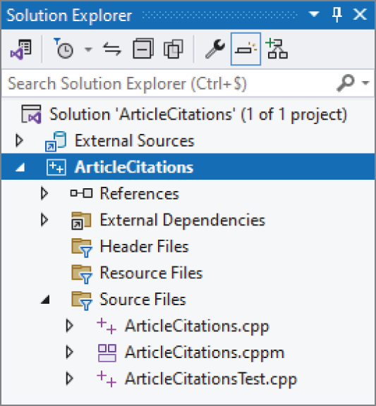
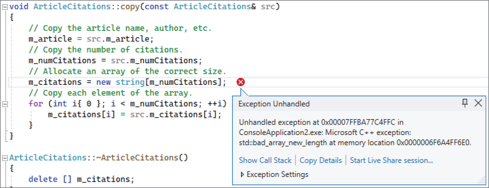
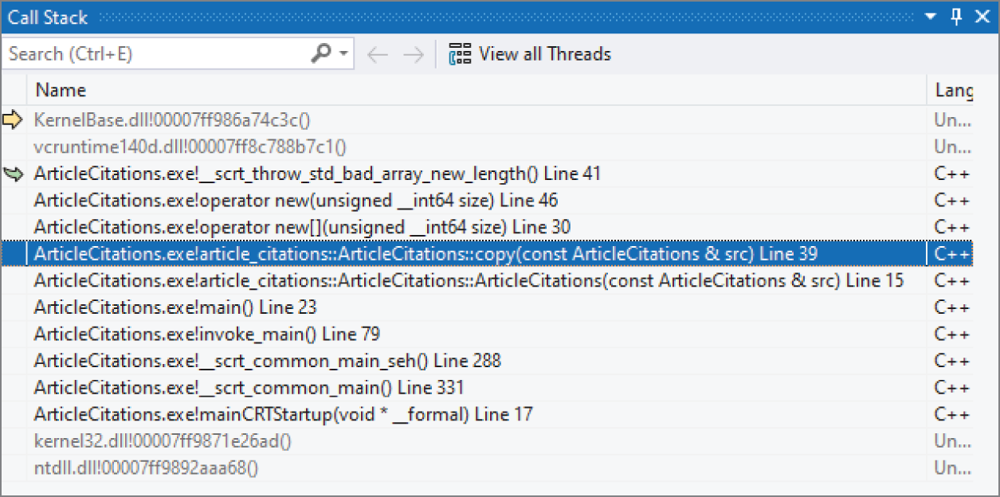
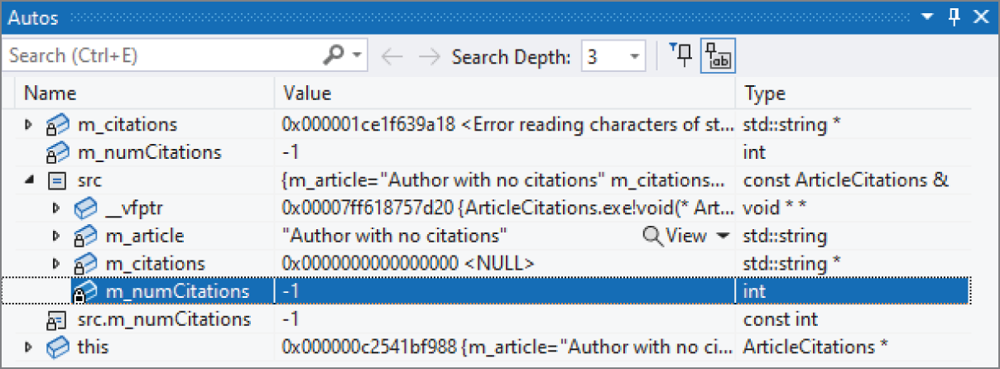

:::tip[WHAT'S IN THIS CHAPTER?]
- The fundamental law of debugging, and bug taxonomies
- Tips for avoiding bugs
- How to plan for bugs
- The different kinds of memory errors
- How to use a debugger to pinpoint code causing a bug
:::

:::tip[WILEY.COM DOWNLOADS FOR THIS CHAPTER]
Please note that all the code examples for this chapter are available as part of this chapter's code download on the book's website at `www.wiley.com/go/proc++6e` on the Download Code tab.
:::

Your code will contain bugs. Every professional programmer would like to write bug-free code, but the reality is that few software engineers succeed in this endeavor. As computer users know, bugs are endemic in computer software. The software that you write is probably no exception. Therefore, unless you plan to bribe your co-workers into fixing all your bugs, you cannot be a professional C++ programmer without knowing how to debug C++ code. One factor that often distinguishes experienced programmers from novices is their debugging skills.

Despite the obvious importance of debugging, it is rarely given enough attention in courses and books. Debugging seems to be the type of skill that everyone wants you to know, but no one knows how to teach. This chapter attempts to provide concrete debugging guidelines and techniques.

This chapter starts with the fundamental law of debugging and bug taxonomies, followed by tips for avoiding bugs. Techniques for planning for bugs include error logging, debug traces, assertions, and crash dumps. Specific tips are given for debugging the problems that arise, including techniques for reproducing bugs and debugging reproducible bugs, nonreproducible bugs, memory errors, and multithreaded programs. The chapter concludes with a step-by-step debugging example.

## THE FUNDAMENTAL LAW OF DEBUGGING

The first rule of debugging is to be honest with yourself and admit that your code will contain bugs! This realistic assessment enables you to put your best effort into preventing bugs from crawling into your code in the first place, while you simultaneously include the necessary features to make debugging as easy as possible.

:::warning
The fundamental law of debugging states that you should avoid bugs when you're coding, but plan for bugs in your code.
:::

## BUG TAXONOMIES

A *bug* in a computer program is incorrect run-time behavior. This undesirable behavior includes both *catastrophic* and *noncatastrophic bugs*. Examples of catastrophic bugs are program crashes, data corruption, operating system failures, or some other horrific outcome. A catastrophic bug can also manifest itself external to the software or computer system running the software; for example, medical software might contain a catastrophic bug causing a massive radiation overdose to a patient. Noncatastrophic bugs are bugs that cause the program to behave incorrectly in more subtle ways; for example, a web browser might return the wrong web page, or a spreadsheet application might calculate the standard deviation of a column incorrectly. These are also called *logical bugs*.

There are also *cosmetic bugs*, where something is visually not correct, but otherwise works correctly. For example, a button in a user interface is kept enabled when it shouldn't be—but clicking it does nothing. All computations are perfectly correct, the program does not crash, but it doesn't look as “nice” as it should.

The underlying cause, or *root cause*, of a bug is the mistake in the program that causes this incorrect behavior. The process of debugging a program includes both determining the root cause of the bug and fixing the code so that the bug will not occur again.

## AVOID BUGS

It's impossible to write completely bug-free code, so debugging skills are important. However, a few tips can help you to minimize the number of bugs:

- **Read this book from cover to cover:** Learn the C++ language intimately, especially pointers and memory management. Then, recommend this book to your friends and co-workers so they avoid bugs too.
- **Design before you code:** Starting to write code for a feature without thinking about the design at all tends to lead to convoluted designs that are harder to understand and are more error prone. It also makes you more likely to omit possible edge cases and error conditions. Thus, before you start writing code, think about the design. And, once you start the implementation, don't be afraid to change the design if you come across an issue that you didn't think of before. There is nothing wrong with making changes to the design once you start the implementation.
- **Do code reviews:** In a professional environment, every single line of code should be peer reviewed. Sometimes it takes a fresh perspective to notice problems.
- **Test, test, and test again:** Thoroughly test your code, and have *others* test your code! They are more likely to find problems you haven't thought of.
- **Write automated unit tests:** Unit tests are designed to test isolated functionality. You should write unit tests for all implemented features. Run these unit tests automatically as part of your continuous integration setup, or automatically after each local compilation. [Chapter 30](../c30), “Becoming Adept at Testing,” discusses unit testing in detail.
- **Expect error conditions, and handle them appropriately:** In particular, plan for and handle errors when working with files and network connections. They will occur. See [chapters 13](../c13), “Demystifying C++ I/O,” and [14](../c14), “Handling Errors.”
- **Use smart pointers to avoid resource leaks:** Smart pointers automatically free resources when they are not needed anymore.
- **Don't ignore compiler warnings:** Configure your compiler to compile with a high warning level. Do not blindly ignore warnings. Ideally, you should enable an option in your compiler to treat warnings as errors. This forces you to address each warning immediately. With GCC or Clang you can pass `-Werror` to the compiler to treat all warnings as errors. In Visual C++, open the properties of your project, go to Configuration Properties ➪ C/C++ ➪ General, and enable the option Treat Warnings As Errors.
- **Use static code analysis:** A static code analyzer helps to pinpoint problems in your code by analyzing your source code. Ideally, static code analysis is done in real time while typing code in your integrated development environment (IDE) to detect problems early. It can also be set up to run automatically by your build process. There are quite a few different analyzers available on the Internet, both free and commercial.
- **Use good coding style:** Strive for readability and clarity, use meaningful names, don't use abbreviations, add code comments (not only interface comments), use the `override` and `explicit` keywords, and so on. This makes it easier for other people to understand your code.

## PLAN FOR BUGS

Your programs should contain functionality that enables easier debugging when the inevitable bugs arise. This section describes some examples of such functionality and presents sample implementations, where appropriate, that you can incorporate into your own programs.

### Error Logging

Imagine this scenario: You have just released a new version of your flagship product, and one of the first users reports that the program “stopped working.” You attempt to pry more information from the user and eventually discover that the program died in the middle of an operation. The user can't quite remember what he was doing or if there were any error messages. How will you debug this problem?

Now imagine the same scenario, but in addition to the limited information from the user, you are also able to examine the error log on the user's computer. In the log you see a message from your program that says, “Error: unable to open config.xml file.” Looking at the code near the spot where that error message was generated, you find a line in which you read from the file without checking whether the file was opened successfully. You've found the root cause of your bug!

*Error logging* is the process of writing error messages to persistent storage so that they will be available following an application, or even machine, crash. Despite the example scenario, you might still have doubts about this strategy. Won't it be obvious by your program's behavior if it encounters errors? Won't the user notice if something goes wrong? As the preceding example shows, user reports are not always accurate or complete. In addition, many programs, such as the operating system kernel and long-running daemons like `inetd` (internet service daemon) or `syslogd` on Unix, are not interactive and run unattended on a machine. The only way these programs can communicate with users is through error logging. In many cases, a program might also want to automatically recover from certain errors and hide those errors from the user. Still, having logs of those errors available can be invaluable to improve the overall stability of the program.

Thus, your program should log errors as it encounters them. That way, if a user reports a bug, you will be able to examine the log files on the machine to see if your program reported any errors prior to encountering the bug. Unfortunately, error logging is platform-dependent: C++ does not contain a standard logging mechanism. Examples of platform-specific logging mechanisms include the `syslog` facility in Unix and the event reporting API in Windows. You should consult the documentation for your development platform. There are also some open-source implementations of cross-platform logging frameworks. Here are two examples:

- log4cpp at `log4cpp.sourceforge.net`
- Boost.Log at `boost.org`

Now that you're convinced that logging is a great feature to add to your programs, you might be tempted to log messages every few lines in your code so that, in the event of any bug, you'll be able to trace the code path that was executing. These types of log messages are appropriately called *traces*.

However, you should not write these traces to log files for two reasons. First, writing to persistent storage is slow. Even on systems that write the logs asynchronously, logging that much information will slow down your program. Second, and most important, most of the information that you would put in your traces is not appropriate for the end user to see. It will just confuse the user, leading to unwarranted service calls. That said, tracing is an important debugging technique under the correct circumstances, as described in the next section.

Here are some specific guidelines for the types of errors you should log:

- Unrecoverable errors, such as a system call failing unexpectedly.
- Errors for which an administrator can take action, such as low memory, an incorrectly formatted data file, an inability to write to disk, or a network connection being down.
- Unexpected errors such as a code path that you never expected to take or variables with unexpected values. On the other hand, your code should “expect” users to enter invalid data and should handle it appropriately. An unexpected error represents a bug in your program.
- Potential security breaches, such as a network connection attempted from an unauthorized address, or too many network connections attempted (denial of service).

A natural question you might be asking yourself is: What should be included in a logged error? At the very least, each logged error should contain the date and time the error occurred and the error message itself. In multithreaded applications, it's useful to log the ID of the thread that caused the error as well. Starting with C++23, the Standard Library includes `std::stacktrace`, discussed in [Chapter 14](../c14), which allows you to get a stack trace at any moment during the execution of your program. You could include such a stack trace, or at least part of it, with each logged error.

It is also useful to log warnings, or recoverable errors, giving you the option to investigate if they can possibly be avoided.

Most logging APIs allow you to specify a *log level* or *error level*, typically at least “error,” “warning,” or “info”. You can log non-error conditions under a log level that is less severe than “error.” For example, you might want to log significant state changes in your application, or startup and shutdown of the program. You also might consider giving your users a way to adjust the log level of your program at run time so that they can customize the amount of logging that occurs.

### Debug Traces

When debugging complicated problems, public error messages generally do not contain enough information. You often need a complete trace of the code path taken, or values of variables before the bug showed up. In addition to basic messages, it's sometimes helpful to include the following information in debug traces:

- The thread ID, if it's a multithreaded program
- The name of the function that generates the trace
- The name of the source file in which that function lives

You can add this tracing to your program through a special *debug mode*, or via a *ring buffer*. Both of these techniques are explained in detail in the following sections. Note that in multithreaded programs you have to make your trace logging thread-safe. See [Chapter 27](../c27), “Multithreaded Programming with C++,” for details on multithreaded programming.

:::warning
Trace files can be written in text format, but if you do, be careful with logging too much detail. You don't want to leak intellectual property through your log files! Logging too much implementation details can also be dangerous if hackers can get a hold of the trace output!
:::

#### Debug Mode

A first technique to add debug traces is to provide a debug mode for your program. In debug mode, the program writes trace output to standard error or to a file, and perhaps does extra checking during execution. There are several ways to add a debug mode to your program. All following examples are writing traces in text format.

##### Start-Time Debug Mode

Start-time debug mode allows your application to run with or without debug mode depending on a command-line argument. This strategy includes the debug code in the “release” binary and allows debug mode to be enabled at a customer site. However, it does require users to restart the program to run it in debug mode, which may prevent you from obtaining useful information about certain bugs.

The following example is a simple program implementing a start-time debug mode. This program doesn't do anything useful; it is only for demonstrating the technique.

All logging functionality is wrapped in a `Logger` class. This class has two `static` data members: the name of the log file and a Boolean saying whether logging is enabled or disabled. The class has a public `static log()` member function template. Variadic templates like this one are discussed in [Chapter 26](../c26), “Advanced Templates.” The log file is opened, flushed, and closed on each call to `log()`. This might lower performance a bit; however, it does guarantee correct logging, which is more important.

```cpp
class Logger
{
    public:
        static void enableLogging(bool enable) { ms_loggingEnabled = enable; }
        static bool isLoggingEnabled() { return ms_loggingEnabled; }
 
        template <typename… Args>
        static void log(const Args&… args)
        {
            if (!ms_loggingEnabled) { return; }
 
            ofstream logfile { ms_debugFilename, ios_base::app };
            if (logfile.fail()) {
                println(cerr, "Unable to open debug file!");
                return;
            }
            print(logfile, "{:L} UTC: ", chrono::system_clock::now());
            // Use a fold-expression; see Chapter 26.
            (logfile << … << args);
            logfile << endl;
        }
    private:
        static inline const string ms_debugFilename { "debugfile.out" };
        static inline bool ms_loggingEnabled { false };
};
```

The following helper macro is defined to make it easy to log something. It's a macro accepting a variable number of arguments. You get access to those arguments using `__VA_ARGS__`. The macro uses `__func__`, a predefined variable defined by the C++ standard that contains the name of the current function.

```cpp
#define LOG(…) Logger::log(__func__, "(): ", __VA_ARGS__)
```

This macro replaces every call to `LOG()` in your code with a call to `Logger::log()`. The macro automatically includes the function name as first argument to `Logger::log()`. For example, suppose you call the macro as follows:

```cpp
LOG("The value is: ", value);
```

The `LOG()` macro replaces this with the following:

```cpp
Logger::log(__func__, "(): ", "The value is: ", value);
```

Start-time debug mode needs to parse the command-line arguments to find out whether it should enable debug mode. Unfortunately, there is no standard functionality in C++ for parsing command-line arguments. This program uses a simple `isDebugSet()` function to check for the debug flag among all the command-line arguments, but a function to parse all command-line arguments would need to be more sophisticated.

```cpp
bool isDebugSet(int argc, char** argv)
{
    auto parameters { views::counted(argv, argc) };
    return ranges::contains(parameters, string_view { "-d" });
}
```

Some arbitrary test code is used to exercise the debug mode in this example. Two classes are defined, `ComplicatedClass` and `UserCommand`. Both classes define an `operator<<` to write instances of them to a stream. The `Logger` class uses this operator to dump objects to the log file.

```cpp
class ComplicatedClass { /* … */ };
ostream& operator<<(ostream& outStream, const ComplicatedClass& src)
{
    outStream << "ComplicatedClass";
    return outStream;
}
 
class UserCommand { /* … */ };
ostream& operator<<(ostream& outStream, const UserCommand& src)
{
    outStream << "UserCommand";
    return outStream;
}
```

Here is some test code with a number of log calls:

```cpp
UserCommand getNextCommand(ComplicatedClass* obj)
{
    UserCommand cmd;
    return cmd;
}
 
void processUserCommand(const UserCommand& cmd)
{
    // Details omitted for brevity.
}
 
void trickyFunction(ComplicatedClass* obj)
{
    LOG("given argument: ", *obj);
 
    for (size_t i { 0 }; i < 100; ++i) {
        UserCommand cmd { getNextCommand(obj) };
        LOG("retrieved cmd ", i, ": ", cmd);
 
        try {
            processUserCommand(cmd);
        } catch (const exception& e) {
            LOG("exception from processUserCommand(): ", e.what());
        }
    }
}
 
int main(int argc, char** argv)
{
    Logger::enableLogging(isDebugSet(argc, argv));
 
    if (Logger::isLoggingEnabled()) {
        // Print the command-line arguments to the trace.
        for (size_t i { 0 }; i < argc; ++i) {
            LOG("Argument: ", argv[i]);
        }
    }
 
    ComplicatedClass obj;
    trickyFunction(&obj);
 
    // Rest of the function not shown.
}
```

There are two ways to run this application:

```cpp
> STDebug
> STDebug -d
```

Debug mode is activated only when the `-d` argument is specified on the command line.

:::warning
Macros in C++ should be avoided as much as possible because they can be hard to debug. However, for logging purposes, using a simple macro can be acceptable, and it makes using the logging code much easier. Even so, with `std::source:location`, discussed in [Chapter 14](../c14), the example can be modified to avoid the use of a macro. This is the topic of one of the exercises at the end of this chapter.
:::

##### Compile-Time Debug Mode

Instead of enabling or disabling debug mode through a command-line argument, you could also use a preprocessor symbol such as `DEBUG_MODE` and `#ifdef`s to selectively compile the debug code into your program. To generate a debug version of this program, you would have to compile it with the symbol `DEBUG_MODE` defined. Your compiler allows you to define symbols during compilation; consult your compiler's documentation for details. For example, GCC allows you to specify `–Dsymbol` through the command line. Microsoft Visual C++ allows you to specify the symbols through the Visual Studio IDE or by specifying `/D symbol` if you use the Visual C++ command-line tools. Instead of using a custom `DEBUG_MODE` symbol, you could also use the `NDEBUG` symbol, which is defined by a compiler for release builds and not for debug builds.

The advantage of this technique is that your debug code is not compiled into the “release” binary and so does not increase its size. The disadvantage is that there is no way to enable debugging at a customer site for testing or following the discovery of a bug.

An example implementation is given in `CTDebug.cpp` in the downloadable source code archive. One important remark on this implementation is that it contains the following definition for the `LOG()` macro:

```cpp
#ifdef DEBUG_MODE
    #define LOG(…) Logger::log(__func__, "(): ", __VA_ARGS__)
#else
    #define LOG(…) (void)0
#endif
```

That is, if `DEBUG_MODE` is not defined, then all calls to `LOG()` are replaced with nothing, called *no-ops*.

:::warning
Be careful not to put any code that must be executed for correct program functioning inside your `LOG()` calls. For example, the following line of code could be asking for trouble:
:::

As logging code is removed if `DEBUG_MODE` is not defined, it could mean that certain variables might be unused, which can trigger compiler warnings. Using the `[[maybe_unused]]` attribute (see [Chapter 1](../c01), “A Crash Course in C++ and the Standard Library”) avoids such warnings. For example:

```cpp
int main([[maybe_unused]] int argc, [[maybe_unused]] char** argv)
{
#ifdef DEBUG_MODE
    // Print the command-line arguments to the trace.
    for (size_t i { 0 }; i < argc; ++i) { LOG("Argument: ", argv[i]); }
#endif
    ComplicatedClass obj;
    trickyFunction(&obj);
    // Rest of the function not shown.
}
```

##### Run-Time Debug Mode

The most flexible way to provide a debug mode is to allow it to be enabled or disabled at run time. One way to provide this feature is to supply an asynchronous interface that controls debug mode on the fly. This interface could be an asynchronous command that makes an interprocess call into the application (for example, using sockets, signals, or remote procedure calls). This interface could also take the form of a menu command in the user interface. C++ provides no standard way to perform interprocess communication or to implement user interfaces, so an example of this technique is not shown.

#### Ring Buffers

Debug mode is useful for debugging reproducible problems and for running tests. However, bugs often appear when the program is running in non-debug mode, and by the time you or the customer enables debug mode, it is too late to gain any information about the bug. One solution to this problem is to enable tracing in your program at all times. You usually need only the most recent traces to debug a program, so you should store only the most recent traces at any point in a program's execution. One way to provide for this is through careful use of log file rotations.

However, for performance reasons, it's better that you don't log these traces continuously to disk. Instead, store them in memory and provide a mechanism to dump all the trace messages to standard error or to a log file if the need arises.

A common technique is to use a *ring buffer*, or *circular buffer*, to store a fixed number of messages, or messages in a fixed amount of memory. When the buffer fills up, it starts writing messages at the beginning of the buffer again, overwriting the older messages. This cycle can repeat indefinitely. The following sections provide an implementation of a ring buffer and show you how you can use it in your programs.

##### Ring Buffer Interface

The following `RingBuffer` class provides a simple ring buffer storing messages. The client specifies the number of entries in the constructor and adds messages with the `addEntry()` member function. Once the number of entries exceeds the number allowed, new entries overwrite the oldest entries in the buffer. The buffer also provides the option to output entries to a stream as they are added to the buffer. The client can specify an output stream in the constructor and can reset it with the `setOutput()` member function. Finally, the `operator<<` streams the entire buffer to an output stream. This implementation uses a variadic template member function, discussed in [Chapter 26](../c26).

```cpp
export class RingBuffer final
{
    public:
        // Constructs a ring buffer with space for numEntries.
        // Entries are written to *outStream as they are queued (optional).
        explicit RingBuffer(std::size_t numEntries = DefaultNumEntries,
            std::ostream* outStream = nullptr);
 
        // Adds an entry to the ring buffer, possibly overwriting the
        // oldest entry in the buffer (if the buffer is full).
        template <typename… Args>
        void addEntry(const Args&… args)
        {
            std::ostringstream oss;
            std::print(oss, "{:L} UTC: ", std::chrono::system_clock::now());
            // Use a fold-expression; see Chapter 26.
            (oss << … << args);
            addStringEntry(std::move(oss).str());
        }
 
        // Streams the buffer entries, separated by newlines, to outStream.
        friend std::ostream& operator<<(std::ostream& outStream, RingBuffer& rb);
 
        // Streams entries as they are added to the given stream.
        // Specify nullptr to disable this feature.
        // Returns the old output stream.
        std::ostream* setOutput(std::ostream* newOutStream);
 
    private:
        std::vector<std::string> m_entries;
        std::vector<std::string>::iterator m_next;
 
        std::ostream* m_outStream { nullptr };
        bool m_wrapped { false };
 
        static constexpr std::size_t DefaultNumEntries { 500 };
 
        void addStringEntry(std::string entry);
};
```

##### Ring Buffer Implementation

This implementation of the ring buffer stores a fixed number of `string` objects. This approach certainly is not the most efficient solution. Other possibilities would be to provide a fixed number of bytes of memory for the buffer. However, this implementation should be sufficient unless you're writing a high-performance application.

For multithreaded programs, it's useful to add the ID of the thread to each trace entry. Of course, the ring buffer has to be made thread-safe before using it in a multithreaded application. See [Chapter 27](../c27) for multithreaded programming.

Here are the implementations:

```cpp
// Initialize the vector to hold exactly numEntries. The vector size
// does not need to change during the lifetime of the object.
// Initialize the other members.
RingBuffer::RingBuffer(size_t numEntries, ostream* outStream)
    : m_entries { numEntries }, m_outStream { outStream }, m_wrapped { false }
{
    if (numEntries == 0) {
        throw invalid_argument { "Number of entries must be > 0." };
    }
    m_next = begin(m_entries);
}
 
// The addStringEntry algorithm is pretty simple: add the entry to the next
// free spot, then reset m_next to indicate the free spot after
// that. If m_next reaches the end of the vector, it starts over at 0.
//
// The buffer needs to know if the buffer has wrapped or not so
// that it knows whether to print the entries past m_next in operator<<.
void RingBuffer::addStringEntry(string entry)
{
    // If there is a valid m_outStream, write this entry to it.
    if (m_outStream) { *m_outStream << entry << endl; }
 
    // Move the entry to the next free spot and increment
    // m_next to point to the free spot after that.
    *m_next = move(entry);
    ++m_next;
 
    // Check if we've reached the end of the buffer. If so, we need to wrap.
    if (m_next == end(m_entries)) {
        m_next = begin(m_entries);
        m_wrapped = true;
    }
}
 
// Set the output stream.
ostream* RingBuffer::setOutput(ostream* newOutStream)
{
    return exchange(m_outStream, newOutStream);
}
 
// operator<< uses an ostream_iterator to "copy" entries directly
// from the vector to the output stream.
//
// operator<< must print the entries in order. If the buffer has wrapped,
// the earliest entry is one past the most recent entry, which is the entry
// indicated by m_next. So, first print from entry m_next to the end.
//
// Then (even if the buffer hasn't wrapped) print from beginning to m_next-1.
ostream& operator<<(ostream& outStream, RingBuffer& rb)
{
    if (rb.m_wrapped) {
        // If the buffer has wrapped, print the elements from
        // the earliest entry to the end.
        copy(rb.m_next, end(rb.m_entries),
            ostream_iterator<string>{ outStream, "\n" });
    }
 
    // Now, print up to the most recent entry.
    // Go up to m_next because the range is not inclusive on the right side.
    copy(begin(rb.m_entries), rb.m_next,
        ostream_iterator<string>{ outStream, "\n" });
 
    return outStream;
}
```

##### Using the Ring Buffer

To use the ring buffer, you can create an instance of it and start adding messages to it. When you want to print the buffer, just use `operator<<` to print it to the appropriate `ostream`. Here is the earlier start-time debug mode program modified to use a ring buffer instead. Changes are highlighted. The definitions of the `ComplicatedClass` and `UserCommand` classes, and the functions `getNextCommand()`, `processUserCommand()`, and `trickyFunction()` are not shown. They are the same as before.

```cpp
RingBuffer debugBuffer;
 
#define LOG(…) debugBuffer.addEntry(__func__, "(): ", __VA_ARGS__)
 
int main(int argc, char** argv)
{
    // Log the command-line arguments.
    for (size_t i { 0 }; i < argc; ++i) {
        LOG("Argument: ", argv[i]);
    }
 
    ComplicatedClass obj;
    trickyFunction(&obj);
 
    // Print the current contents of the debug buffer to cout.
    cout << debugBuffer;
}
```

##### Displaying the Ring Buffer Contents

Storing trace debug messages in memory is a great start, but for them to be useful, you need a way to access these traces for debugging.

Your program should provide a “hook” to tell it to export the messages. This hook could be similar to the interface you would use to enable debugging at run time. Additionally, if your program encounters a fatal error that causes it to exit, it could export the ring buffer automatically to a log file before exiting.

Another way to retrieve these messages is to obtain a memory dump of the program. Each platform handles memory dumps differently, so you should consult a reference or expert for your platform.

### Assertions

`<cassert>` defines an `assert()` macro. It takes a Boolean expression and, if the expression evaluates to `false`, prints an error message and terminates the program. If the expression evaluates to `true`, it does nothing.

:::warning
Normally, you should avoid any library functions or macros that can terminate your program. The `assert()` macro is an exception. If an assertion triggers, it means that some assumption is wrong or that something is catastrophically, unrecoverably wrong, and the only sane thing to do is to terminate the application at that very moment, instead of continuing.
:::

Assertions allow you to “force” your program to exhibit a bug at the exact point where that bug originates. If you didn't assert at that point, your program might proceed with those incorrect values, and the bug might not show up until much later. Thus, assertions allow you to detect bugs earlier than you otherwise would.

:::note
The behavior of the standard `assert()` macro depends on the `NDEBUG` preprocessor symbol: if the symbol is not defined, the assertion takes place; otherwise, it is ignored. Compilers often define this symbol when compiling “release” builds. If you want to leave assertions in release builds, you may have to change your compiler settings or write your own version of `assert()` that isn't affected by the value of `NDEBUG`.
:::

`assert()` is a C-style macro whose implementation depends on whether client code defines the `NDEBUG` preprocessor symbol or not. That makes `<cassert>` an example of a *non-modular, non-importable header*, as explained in [Chapter 11](../c11), “Modules, Header Files, and Miscellaneous Topics.” Use `#include <cassert>` instead of `import <cassert>` to get access to the `assert()` macro.

You could use assertions in your code whenever you are “assuming” something about the state of your variables. For example, if you call a library function that is supposed to return a pointer and claims never to return `nullptr`, throw in an `assert()` after the function call to make sure that the pointer isn't `nullptr`.

However, you should assume as little as possible. For example, if you are writing a library function, don't assert that the parameters are valid. Instead, check the parameters, and return an error code or throw an exception if they are invalid.

As a rule, assertions should be used only for cases that are truly problematic and should therefore never be ignored when they occur during development. If you hit an assertion during development, fix it, don't just disable the assertion.

Let's look at a couple of examples on how to use `assert()`. Here is a `process()` function that requires three elements in a `vector` passed to the function:

```cpp
void process(const vector<int>& coordinate)
{
    assert(coordinate.size() == 3);
    // …
}
```

If the `process()` function is called with a `vector` that has less or more elements than three, the assertion fails and generates a message similar to the following (the exact message depends on the compiler that is used):

```cpp
Assertion failed: coordinate.size() == 3, file D:\test\test.cpp, line 12
```

If you want a custom error message, you can use the following trick using the comma operator and a set of extra parentheses:

```cpp
assert(("A custom message…", coordinate.size() == 3));
```

The output then will be something as follows:

```cpp
Assertion failed: ("A custom message…", coordinate.size() == 3), file D:\test\test.cpp, line 106
```

If at some point in your code you want that an assert always fails with a certain error message, you can use the following trick:

```cpp
assert(!"This should never happen.");
```

:::warning
Be careful not to put any code that must be executed for correct program functioning inside assertions. For example, the following line of code could be asking for trouble:
:::

### Crash Dumps

Make sure your programs create *crash dumps*, also called *memory dumps* or *core dumps*. A crash dump is a dump file that is created when your application crashes. It contains information about which threads were running at the time of the crash, a call stack of all the threads, and so on. How you create such dumps is platform dependent, so you should consult the documentation of your platform or use a third-party library that takes care of it for you. Breakpad (`github.com/google/breakpad/`) is an example of such an open-source cross-platform library that can write and process crash dumps.

Also make sure you set up a *symbol server* and a *version control server*. The symbol server is used to store debugging symbols of released binaries of your software. These symbols are used later to interpret crash dumps received from customers. The version control server, discussed in [Chapter 28](../c28), “Maximizing Software Engineering Methods,” stores all revisions of your source code. When debugging crash dumps, this version control server is used to download the correct source code for the revision of your software that created the crash dump.

The exact procedure of analyzing crash dumps depends on your platform and compiler, so consult their documentation.

From my personal experience, I have found that a crash dump is often worth more than a thousand bug reports.

## DEBUGGING TECHNIQUES

Debugging a program can be incredibly frustrating. However, with a systematic approach it becomes significantly easier. Your first step in trying to debug a program should always be to reproduce the bug. Depending on whether you can reproduce the bug, your subsequent approach will differ. The next four sections explain how to reproduce bugs, how to debug reproducible bugs, how to debug nonreproducible bugs, and how to debug regressions. Additional sections explain details about debugging memory errors and debugging multithreaded programs. The final sections show a step-by-step debugging example.

### Reproducing Bugs

If you can reproduce a bug consistently, it will be much easier to determine the root cause. Sometimes a bug might be reproducible by Alice but not by Bob. That in itself can be a clue for Alice to find the root cause. Finding the root cause of bugs that are not reproducible is difficult, if not impossible.

As a first step to reproduce the bug, run the program on a similar environment (hardware, operating system, and so on) and with the same inputs as the run when the bug first appeared. Be sure to include all inputs, from the program's startup to the time of the bug's appearance. A common mistake is to attempt to reproduce the bug by performing only the triggering action. This technique may not reproduce the bug because the bug might be caused by an entire sequence of actions.

For example, if your web browser dies when you request a certain web page, it may be due to memory corruption triggered by that particular request's network address. On the other hand, it may be because your program records all requests in a queue, with space for one million entries, and this entry was number 1,000,001. Starting the program over and sending one request certainly wouldn't trigger the bug in that case.

Sometimes it is impossible to emulate the entire sequence of events that leads to the bug. Perhaps the bug was reported by someone who can't remember everything that she did. Alternatively, maybe the program was running for too long to emulate every input. In that case, do your best to reproduce the bug. It takes some guesswork and can be time-consuming, but effort at this point will save time later in the debugging process. Here are some techniques you can try:

- Repeat the triggering action in the correct environment and with as many inputs as possible similar to the initial report.
- Do a quick review of the code related to the bug. More often than not, you'll find a likely cause that will guide you in reproducing the problem.
- Run automated tests that exercise similar functionality. Reproducing bugs is one benefit of automated tests. If it takes 24 hours of testing before the bug shows up, it's preferable to let those tests run on their own rather than spend 24 hours of your time trying to reproduce the bug.
- If you have the necessary hardware available, running slight variations of tests concurrently on different machines can sometimes save time.
- Run stress tests that exercise similar functionality. If your program is a web server that died on a particular request, try running as many browsers as possible simultaneously that make that request.

After you are able to reproduce the bug consistently, you should attempt to find the smallest sequence that triggers the bug. You can start with the minimum sequence, containing only the triggering action, and slowly expand the sequence to cover the entire sequence from startup until the bug is triggered. This will result in the simplest and most efficient test case to reproduce it, which makes it simpler to find the root cause of the problem and easier to verify the fix.

### Debugging Reproducible Bugs

When you can reproduce a bug consistently and efficiently, it's time to figure out the problem in the code that causes the bug. Your goal at this point is to find the exact lines of code that trigger the problem. You can use two different strategies:

- **Use a debugger:** Debuggers allow you to step through the execution of your program and to view the state of memory and the values of variables at various points. They are often indispensable tools for finding the root cause of bugs. When you have access to the source code, you should use a *symbolic debugger*: a debugger that utilizes the variable names, class names, and other symbols in your code. To use a symbolic debugger, you must instruct your compiler to generate debug symbols. Check the documentation of your compiler for details on how to enable symbol generation.
- **Log debug messages:** By adding enough debug messages to your program and watching its output when you reproduce the bug, you should be able to pinpoint the exact lines of code where the bug occurs. If you have a debugger at your disposal, adding debug messages is usually not recommended because it requires modifications to the program and can be time-consuming. However, if you have already instrumented your program with debug messages as described earlier, you might be able to find the root cause of your bug by running your program in debug mode while reproducing the bug. Note that bugs sometimes disappear simply when you enable logging because the act of enabling logging can slightly change the timings of your application.

The debugging example at the end of this chapter demonstrates both these approaches.

### Debugging Nonreproducible Bugs

Fixing bugs that are not reproducible is significantly more difficult than fixing reproducible bugs. You often have little information and must employ a lot of guesswork. Nevertheless, a few strategies can aid you:

- Try to turn a nonreproducible bug into a reproducible bug. By using educated guesses, you can often determine approximately where the bug lies. It's worthwhile to spend some time trying to reproduce the bug. Once you have a reproducible bug, you can figure out its root cause by using the techniques described earlier.
- Analyze error logs. This is easy to do if you have instrumented your program with error log generation, as described earlier. You should sift through this information because any errors that were logged directly before the bug occurred are likely to have contributed to the bug itself. If you're lucky (or if you coded your program well), your program will have logged the exact reason for the bug at hand.
- Obtain and analyze traces. Again, this is easy to do if you have instrumented your program with tracing output, for example, via a ring buffer as described earlier. At the time of the bug's occurrence, you ideally obtained a copy of the traces. These traces should lead you right to the location of the bug in your code.
- Examine a *crash/memory dump* file, if it exists. Some platforms automatically generate memory dump files of applications that terminate abnormally. On Unix and Linux, these memory dumps are called *core files*. Each platform provides tools for analyzing these memory dumps. They can, for example, be used to view the stack trace of the application and the contents of its memory before the application died.
- Inspect the code. Unfortunately, this is often the only strategy to determine the cause of a nonreproducible bug. Surprisingly, it often works. When you examine code, even code that you wrote yourself, with the perspective of the bug that just occurred, you can often find mistakes that you overlooked previously. I don't recommend spending hours staring at your code, but tracing through the code path manually can often lead you directly to the problem.
- Use a memory-watching tool, such as one of the tools described in the section “[Debugging Memory Problems](#c31-sec-0035),” later in this chapter. Such tools often alert you to memory errors that don't always cause your program to misbehave but could potentially be the cause of the bug in question.
- File or update a bug report. Even if you can't find the root cause of the bug right away, the report will be a useful record of your attempts if the problem is encountered again.
- If you are unable to find the root cause of the bug, be sure to add extra logging or tracing so that you will have a better chance next time the bug occurs.

Once you have found the root cause of a nonreproducible bug, you should create a reproducible test case and move it to the “reproducible bugs” category. It is important to be able to reproduce a bug before you actually fix it. Otherwise, how will you test the fix? A common mistake when debugging nonreproducible bugs is to fix the wrong problem in the code. Because you can't reproduce the bug, you don't know if you've really fixed it, so you shouldn't be surprised when it shows up again a month later.

### Debugging Regressions

If a feature contains a *regression* bug, it means that the feature used to work correctly, but at some point unexpectedly stopped working.

A useful debugging technique for investigating regressions is to look at the change log of relevant files. If you know at what time the feature was still working, look at all the change logs since that time. You might notice something suspicious that could lead you to the root cause.

Another approach that can save you a lot of time when debugging regressions is to use a binary search approach with older versions of the software (often called *bisecting*) to try to figure out when it started to go wrong. You can use binaries of older versions if you keep them, or you can revert the source code to an older revision. Once you know when it started to go wrong, inspect the change logs to see what changed at that time. This mechanism is possible only when you can reproduce the bug.

### Debugging Memory Problems

Most catastrophic bugs, such as application crashes, are caused by memory errors. Many non-catastrophic bugs are triggered by memory errors as well. Some memory bugs are obvious. For example, if your program attempts to dereference a null pointer, the default action is to terminate the program. However, nearly every platform enables you to respond to catastrophic errors and take remedial action. The amount of effort you devote to the response depends on the importance of this kind of recovery to your end users. For example, a text editor really needs to make a best attempt to save the modified buffers (possibly under a “recovered” name), while for other programs, users may find the default behavior acceptable, even if it is unpleasant.

Some memory bugs are more insidious. If you write past the end of an array in C++, your program will probably not crash at that point. However, if that array was on the stack, you may have written into a different variable or array, changing values that won't show up until later in the program. Alternatively, if the array was on the free store, you could cause memory corruption in the free store, which will cause errors later when you attempt to allocate or free more memory dynamically.

[Chapter 7](../c07), “Memory Management,” introduces some of the common memory errors from the perspective of what to avoid when you're coding. This section discusses memory errors from the perspective of identifying problems in code that exhibits bugs. You should be familiar with the discussion in [Chapter 7](../c07) before continuing with this section.

:::warning
Most, if not all, of the following memory problems can be avoided by using smart pointers instead of raw pointers.
:::

#### Categories of Memory Errors

To debug memory problems, you should be familiar with the types of errors that can occur. This section describes the major categories of memory errors. Each category lists different types of memory errors, including a small code example demonstrating each error, and a list of possible *symptoms* that you might observe. Note that a symptom is not the same thing as a bug: a symptom is an observable behavior caused by a bug.

##### Memory-Freeing Errors

The following table summarizes five major errors that involve freeing memory:

| ERROR TYPE | SYMPTOMS | EXAMPLE |
| --- | --- | --- |
| Memory leak | Process memory usage grows over time. Process runs more slowly over time. Eventually, depending on the OS, operations and system calls fail because of lack of memory. | ```cpp void memoryLeak() {   int* p { new int[1000] };   return; // Not freeing p! } ``` |
| Using mismatched allocation and free operations | Does not usually cause a crash immediately. This type of error can cause memory corruption on some platforms, which might show up as a crash later in the program. Certain mismatches can also cause memory leaks. | ```cpp void mismatchedFree() {   int* p1{(int*)malloc(sizeof(int))};   int* p2{new int};   int* p3{new int[1000]};   delete p1;  // Should use free()!   delete[] p2;// Should use delete!   free(p3);   // Should use delete[]! } ``` |
| Freeing memory more than once | Can cause a crash if the memory at that location has been handed out in another allocation between the two calls to delete. | ```cpp void doubleFree() {   int* p1 { new int[1000] };   delete[] p1;   int* p2 { new int[1000] };   delete[] p1; // Freeing p1 twice! } // Leaking memory of p2! ``` |
| Freeing unallocated memory | Usually causes a crash. | ```cpp void freeUnallocated() {   int* p{reinterpret_cast<int*>(10)};   delete p; // p not a valid pointer! } ``` |
| Freeing stack memory | Technically a special case of freeing unallocated memory. This usually causes a crash. | ```cpp void freeStack() {   int x;   int* p { &x };   delete p; // Freeing stack memory! } ``` |

The crashes mentioned in this table can have different manifestations depending on your platform, such as segmentation faults, bus errors, access violations, and so on.

As you can see, some of the errors do not cause immediate program termination. These bugs are more subtle, leading to problems later in the program's execution.

##### Memory-Access Errors

Another category of memory errors involves the actual reading and writing of memory:

| ERROR TYPE | SYMPTOMS | EXAMPLE |
| --- | --- | --- |
| Accessing invalid memory | Almost always causes the program to crash immediately. | ```cpp void accessInvalid() {   int* p {reinterpret_cast<int*>(10)};   *p = 5; // p is not a valid pointer! } ``` |
| Accessing freed memory | Does not usually cause a crash. If the memory has been handed out in another allocation, this error type can cause “strange” and potentially dangerous values to appear unexpectedly. | ```cpp void accessFreed() {   int* p1 { new int };   delete p1;   *p1 = 5; // The memory pointed to            // by p1 has been freed! } ``` |
| Accessing memory in a different allocation | Does not usually cause a crash. This error type can cause “strange” and potentially dangerous values to appear unexpectedly in other variables or temporary objects, or even change the control flow of the program. | ```cpp void accessElsewhere() {   int x, y[10], z;   x = 0;   z = 0;   for (int i { 0 }; i <= 10; ++i) {     y[i] = 5; // BUG for i==10! element              // 10 is past end of array   } } ``` |
| Reading uninitialized memory | Does not cause a crash, unless you use the uninitialized value as a pointer or array index and dereference it (as in the example). Even then, it will not always cause a crash. | ```cpp void readUninitialized() {   int* p;   print("{}",*p);// p is uninitialized! } ``` |

Memory-access errors don't always cause a crash. They can instead lead to subtle errors, in which the program does not terminate but instead produces erroneous results. Erroneous results can lead to serious consequences, for example, when external devices—such as robotic arms, X-ray machines, radiation treatments, life support systems, and so on—are being controlled by the computer.

Note that the symptoms discussed here for both memory-freeing and memory-access errors are the default symptoms for release builds of your program. Debug builds will most likely behave differently, and when you run the program inside a debugger, the debugger might break into the code when an error occurs.

#### Tips for Debugging Memory Errors

Memory-related bugs often show up in slightly different places in the code each time you run the program. This is usually the case with free store memory corruption. Free store memory corruption is like a time bomb, ready to explode at some attempt to allocate, free, or use memory on the free store. So, when you see a bug that is reproducible but that shows up in slightly different places, you should suspect memory corruption.

If you suspect a memory bug, your best option is to use a memory-checking tool for C++. Debuggers often provide options to run the program while checking for memory errors. For example, if you run a debug build of your application in the Microsoft Visual C++ debugger, it will catch almost all types of errors discussed in the previous sections. Additionally, there are some excellent third-party tools such as Purify from Rational Software (now owned by IBM) and Valgrind for Linux (discussed in [Chapter 7](../c07)). Microsoft also provides a free download called *Application Verifier* (Part of the Windows SDK, `https://developer.microsoft.com/windows/downloads/windows-sdk`), which can be used with release builds of your applications in a Windows environment. It is a run-time verification tool to help you find subtle programming errors like the previously discussed memory errors. These debuggers and tools work by interposing their own memory-allocation and -freeing routines to check for any misuse of dynamic memory, such as freeing unallocated memory, dereferencing unallocated memory, or writing off the end of an array.

If you don't have a memory-checking tool at your disposal and the normal strategies for debugging are not helping, you may need to resort to code inspection. First, narrow down the part of the code containing the bug. Then, as a general rule, look at all raw pointers. Provided that you work on moderate- to good-quality code, most pointers should already be wrapped in smart pointers. If you do encounter raw pointers, take a closer look at how they are used, because they might be the cause of the error. Here are some more items to look for in your code.

##### Object and Class-Related Errors

- Verify that your classes with dynamically allocated memory have destructors that free exactly the memory that's allocated in the object: no more, and no less.
- Ensure that your classes handle copying and assignment correctly with copy constructors and assignment operators, as described in [Chapter 9](../c09), “Mastering Classes and Objects.” Make sure move constructors and move assignment operators properly set pointers in the source object to `nullptr` so that their destructors don't try to free that memory.
- Check for suspicious casts. If you are casting a pointer to an object from one type to another, make sure that it's valid. When possible, use `dynamic_cast`s.

:::warning
Whenever you see raw pointers being used to handle ownership of resources, I highly recommend you replace those raw pointers with smart pointers and try to refactor your classes to follow the rule of zero, as discussed in [Chapter 9](../c09). This removes the types of errors explained in the first and second bullet points in the preceding list.
:::

##### General Memory Errors

- Make sure that every call to `new` is matched with exactly one call to `delete` and every call to `new[]` is matched with one call to `delete[]`. Similarly, every call to `malloc`, `alloc`, or `calloc` should be matched with one call to `free`. To avoid freeing memory multiple times or using freed memory, it's recommended to set your pointer to `nullptr` after freeing its memory. Of course, the best solution is to simply avoid using raw pointers to handle ownership of resources and instead use smart pointers.
- Check for buffer overruns. Whenever you iterate over an array or write into or read from a C-style string, verify that you are not accessing memory past the end of the array or string. These problems can often be avoided by using Standard Library containers and strings.
- Check for dereferencing of invalid pointers.
- When declaring a pointer (or really any scalar type) on the stack, make sure you always initialize it as part of its declaration. For example, use `T* p{nullptr};` or `T* p{new T};` but never `T* p;`. Better yet, use smart pointers!
- Similarly, make sure your classes always initialize pointer data members with in-class initializers or in their constructors, by either allocating memory in the constructor or setting the pointers to `nullptr`. Also here, the best solution is to use smart pointers.

### Debugging Multithreaded Programs

C++ includes a threading support library that provides mechanisms for threading and synchronization between threads. This threading support library is discussed in [Chapter 27](../c27). Multithreaded C++ programs are common, so it is important to think about the special issues involved in debugging a multithreaded program. Bugs in multithreaded programs are often caused by variations in timings in the operating system scheduling and can be difficult to reproduce. Thus, debugging multithreaded programs requires a special set of techniques:

- **Use a debugger:** A debugger makes it relatively easy to diagnose certain multithreaded problems, for example, deadlocks. When a deadlock appears, break into the debugger and inspect the different threads. You will be able to see which threads are blocked and on which line in the code they are blocked. Combining this with trace logs that show you how you came into the deadlock situation should be enough to fix deadlocks.
- **Use log-based debugging:** When debugging multithreaded programs, log-based debugging can sometimes be more effective than using a debugger to debug certain problems. You can add log statements to your program before and after critical sections, and before acquiring and after releasing locks. Log-based debugging is extremely useful in investigating race conditions. However, the act of adding log statements slightly changes run-time timings, which might hide the bug.
- **Insert forced sleeps and context switches:** If you are having trouble consistently reproducing a problem or you have a hunch about the root cause but want to verify it, you can force certain thread-scheduling behavior by making your threads sleep for specific amounts of time. `<thread>` defines `sleep_until()` and `sleep_for()` in the `std::this_thread` namespace, which you can use to sleep. The time to sleep is specified as an `std::time_point` or an `std::duration` respectively, both part of the chrono library discussed in [Chapter 22](../c22), “Date and Time Utilities.” Sleeping for several seconds right before releasing a lock, immediately before signaling a condition variable, or directly before accessing shared data can reveal race conditions that would otherwise go undetected. If this debugging technique reveals the root cause, it must be fixed so that it works correctly after removing these forced sleeps and context switches. Never leave these forced sleeps and context switches in your code! That would be the wrong “fix” for the problem.
- **Perform code review:** Reviewing your thread synchronization code often helps in finding and fixing race conditions. Try to prove over and over that what happened is not possible, until you see how it is. It doesn't hurt to write down these “proofs” in code comments. Also, ask a co-worker to do pair debugging; she might see something you are overlooking.

### Debugging Example: Article Citations

This section presents a buggy program and shows you the steps to take in order to debug it and fix the problem.

Suppose that you're part of a team writing a web page that allows users to search for research articles that cite a particular paper. This type of service is useful for authors who are trying to find work similar to their own. Once they find one paper representing a related work, they can look for every paper that cites that one to find other related work.

In this project, you are responsible for the code that reads the raw citation data from text files. For simplicity, assume that the citation information for each paper is found in its own file. Furthermore, assume that the first line of each file contains the author, title, and publication information for the paper; that the second line is always empty; and that all subsequent lines contain the citations from the article (one on each line). Here is an example file for one of the most important papers in computer science:

```cpp
Alan Turing, "On Computable Numbers, with an Application to the Entscheidungsproblem", Proceedings of the London Mathematical Society, Series 2, Vol.42 (1936-37), 230-265.
 
Gödel, "Über formal unentscheidbare Sätze der Principia Mathematica und verwandter Systeme, I", Monatshefte Math. Phys., 38 (1931), 173-198.
Alonzo Church. "An unsolvable problem of elementary number theory", American J. of Math., 58 (1936), 345-363.
Alonzo Church. "A note on the Entscheidungsproblem", J. of Symbolic Logic, 1 (1936), 40-41.
E.W. Hobson, "Theory of functions of a real variable (2nd ed., 1921)", 87-88.
```

#### Buggy Implementation of an ArticleCitations Class

You may decide to structure your program by writing an `ArticleCitations` class that reads the file and stores the information. This class stores the article information from the first line in one string, and the citations in a C-style array of strings.

:::warning
The design decision to use a C-style array is obviously a bad one! You should opt for one of the Standard Library containers to store the citations. This is just used here as a demonstration of memory problems. There are other obvious issues with this implementation, such as not using the copy-and-swap idiom (see [Chapter 9](../c09)) to implement the assignment operator. But, for the purpose of illustrating a buggy application, it's perfect.
:::

The `ArticleCitations` class definition, defined in an `article_citations` module, looks like this:

```cpp
export class ArticleCitations
{
    public:
        explicit ArticleCitations(const std::string& filename);
        virtual ˜ArticleCitations();
        ArticleCitations(const ArticleCitations& src);
        ArticleCitations& operator=(const ArticleCitations& rhs);
 
        const std::string& getArticle() const;
        int getNumCitations() const;
        const std::string& getCitation(int i) const;
    private:
        void readFile(const std::string& filename);
        void copy(const ArticleCitations& src);
 
        std::string m_article;
        std::string* m_citations { nullptr };
        int m_numCitations { 0 };
};
```

The implementation is as follows. Keep in mind that this program is buggy! Don't use it verbatim or as a model.

```cpp
ArticleCitations::ArticleCitations(const string& filename)
{
    // All we have to do is read the file.
    readFile(filename);
}
 
ArticleCitations::ArticleCitations(const ArticleCitations& src)
{
    copy(src);
}
 
ArticleCitations& ArticleCitations::operator=(const ArticleCitations& rhs)
{
    // Check for self-assignment.
    if (this == &rhs) {
        return *this;
    }
    // Free the old memory.
    delete [] m_citations;
    // Copy the data.
    copy(rhs);
    return *this;
}
 
void ArticleCitations::copy(const ArticleCitations& src)
{
    // Copy the article name, author, etc.
    m_article = src.m_article;
    // Copy the number of citations.
    m_numCitations = src.m_numCitations;
    // Allocate an array of the correct size.
    m_citations = new string[m_numCitations];
    // Copy each element of the array.
    for (int i { 0 }; i < m_numCitations; ++i) {
        m_citations[i] = src.m_citations[i];
    }
}
 
ArticleCitations::˜ArticleCitations()
{
    delete [] m_citations;
}
 
void ArticleCitations::readFile(const string& filename)
{
    // Open the file and check for failure.
    ifstream inputFile { filename };
    if (inputFile.fail()) {
        throw invalid_argument { "Unable to open file" };
    }
    // Read the article author, title, etc. line.
    getline(inputFile, m_article);
 
    // Skip the whitespace before the citations start.
    inputFile >> ws;
 
    int count { 0 };
    // Save the current position so we can return to it.
    streampos citationsStart { inputFile.tellg() };
    // First count the number of citations.
    while (!inputFile.eof()) {
        // Skip whitespace before the next entry.
        inputFile >> ws;
        string temp;
        getline(inputFile, temp);
        if (!temp.empty()) {
            ++count;
        }
    }
 
    if (count != 0) {
        // Allocate an array of strings to store the citations.
        m_citations = new string[count];
        m_numCitations = count;
        // Seek back to the start of the citations.
        inputFile.seekg(citationsStart);
        // Read each citation and store it in the new array.
        for (count = 0; count < m_numCitations; ++count) {
            string temp;
            getline(inputFile, temp);
            if (!temp.empty()) {
                m_citations[count] = temp;
            }
        }
    } else {
        m_numCitations = -1;
    }
}
 
const string& ArticleCitations::getArticle() const { return m_article; }
 
int ArticleCitations::getNumCitations() const { return m_numCitations; }
 
const string& ArticleCitations::getCitation(int i) const { return m_citations[i]; }
```

#### Testing the ArticleCitations Class

The following program asks the user for a filename, constructs an `ArticleCitations` instance for that file, and passes this instance by value to the `processCitations()` function, which prints out all the information. Passing the instance by value to the function is done for this buggy example. In production code, you should pass by reference-to-`const`.

```cpp
void processCitations(ArticleCitations cit)
{
    println("{}", cit.getArticle());
    for (int i { 0 }; i < cit.getNumCitations(); ++i) {
        println("{}", cit.getCitation(i));
    }
}
 
int main()
{
    while (true) {
        print("Enter a file name (\"STOP\" to stop): ");
        string filename;
        cin >> filename;
        if (filename == "STOP") { break; }
 
        ArticleCitations cit { filename };
        processCitations(cit);
    }
}
```

You decide to test the program on the Alan Turing example (stored in a file called `paper1.txt`). Here is the output:

```cpp
Enter a file name ("STOP" to stop): paper1.txt
Alan Turing, "On Computable Numbers, with an Application to the Entscheidungsproblem", Proceedings of the London Mathematical Society, Series 2, Vol.42 (1936-37), 230-265.
[ 4 empty lines omitted for brevity ]
Enter a file name ("STOP" to stop): STOP
```

That doesn't look right. There are supposed to be four citations printed instead of four blank lines.

##### Message-Based Debugging

For this bug, you decide to try log-based debugging, and because this is a console application, you decide to just print messages using `println()`. In this case, it makes sense to start by looking at the function that reads the citations from the file. If that doesn't work right, then obviously the object won't have the citations. You can modify `readFile()` as follows:

```cpp
void ArticleCitations::readFile(const string& filename)
{
    // Code omitted for brevity.
 
    // First count the number of citations.
    println("readFile(): counting number of citations");
    while (!inputFile.eof()) {
        // Skip whitespace before the next entry.
        inputFile>> ws;
        string temp;
        getline(inputFile, temp);
        if (!temp.empty()) {
            println("Citation {}: {}", count, temp);
            ++count;
        }
    }
 
    println("Found {} citations", count);
    println("readFile(): reading citations");
    if (count != 0) {
        // Allocate an array of strings to store the citations.
        m_citations = new string[count];
        m_numCitations = count;
        // Seek back to the start of the citations.
        inputFile.seekg(citationsStart);
        // Read each citation and store it in the new array.
        for (count = 0; count < m_numCitations; ++count) {
            string temp;
            getline(inputFile, temp);
            if (!temp.empty()) {
                println("{}", temp);
                m_citations[count] = temp;
            }
        }
    } else {
        m_numCitations = -1;
    }
    println("readFile(): finished");
}
```

Running the same test with this program gives the following output:

```cpp
Enter a file name ("STOP" to stop): paper1.txt
readFile(): counting number of citations
Citation 0: Gödel, "Über formal unentscheidbare Sätze der Principia Mathematica und verwandter Systeme, I", Monatshefte Math. Phys., 38 (1931), 173-198.
Citation 1: Alonzo Church. "An unsolvable problem of elementary number theory", American J. of Math., 58 (1936), 345-363.
Citation 2: Alonzo Church. "A note on the Entscheidungsproblem", J. of Symbolic Logic, 1 (1936), 40-41.
Citation 3: E.W. Hobson, "Theory of functions of a real variable (2nd ed., 1921)", 87-88.
Found 4 citations
readFile(): reading citations
readFile(): finished
Alan Turing, "On Computable Numbers, with an Application to the Entscheidungsproblem", Proceedings of the London Mathematical Society, Series 2, Vol.42 (1936-37), 230-265.
[ 4 empty lines omitted for brevity ]
Enter a file name ("STOP" to stop): STOP
```

As you can see from the output, the first time the program reads the citations from the file, to count them, it reads them correctly. However, the second time, they are not read correctly; nothing is printed between “readFile(): reading citations” and “readFile(): finished” — why not? One way to delve deeper into this issue is to add some debugging code to check the state of the file stream after each attempt to read a citation:

```cpp
void printStreamState(const istream& inputStream)
{
    if (inputStream.good()) { println("stream state is good"); }
    if (inputStream.bad()) { println("stream state is bad"); }
    if (inputStream.fail()) { println("stream state is fail"); }
    if (inputStream.eof()) { println("stream state is eof"); }
}
 
void ArticleCitations::readFile(const string& filename)
{
    // Code omitted for brevity.
 
    // First count the number of citations.
    println("readFile(): counting number of citations");
    while (!inputFile.eof()) {
        // Skip whitespace before the next entry.
        inputFile >> ws;
        printStreamState(inputFile);
        string temp;
        getline(inputFile, temp);
        printStreamState(inputFile);
        if (!temp.empty()) {
            println("Citation {}: {}", count, temp);
            ++count;
        }
    }
 
    println("Found {} citations", count);
    println("readFile(): reading citations");
    if (count != 0) {
        // Allocate an array of strings to store the citations.
        m_citations = new string[count];
        m_numCitations = count;
        // Seek back to the start of the citations.
        inputFile.seekg(citationsStart);
        // Read each citation and store it in the new array.
        for (count = 0; count < m_numCitations; ++count) {
            string temp;
            getline(inputFile, temp);
            printStreamState(inputFile);
            if (!temp.empty()) {
                println("{}", temp);
                m_citations[count] = temp;
            }
        }
    } else {
        m_numCitations = -1;
    }
    println("readFile(): finished");
}
```

When you run your program this time, you find some interesting information:

```cpp
Enter a file name ("STOP" to stop): paper1.txt
readFile(): counting number of citations
stream state is good
stream state is good
Citation 0: Gödel, "Über formal unentscheidbare Sätze der Principia Mathematica und verwandter Systeme, I", Monatshefte Math. Phys., 38 (1931), 173-198.
stream state is good
stream state is good
Citation 1: Alonzo Church. "An unsolvable problem of elementary number theory", American J. of Math., 58 (1936), 345-363.
stream state is good
stream state is good
Citation 2: Alonzo Church. "A note on the Entscheidungsproblem", J. of Symbolic Logic, 1 (1936), 40-41.
stream state is good
stream state is good
Citation 3: E.W. Hobson, "Theory of functions of a real variable (2nd ed., 1921)", 87-88.
stream state is eof
stream state is fail
stream state is eof
Found 4 citations 
readFile(): reading citations
stream state is fail
stream state is fail
stream state is fail
stream state is fail
readFile(): finished
Alan Turing, "On Computable Numbers, with an Application to the Entscheidungsproblem", Proceedings of the London Mathematical Society, Series 2, Vol.42 (1936-37), 230-265.
[ 4 empty lines omitted for brevity ]
Enter a file name ("STOP" to stop): STOP
```

It looks like the stream state is good until after the final citation is read for the first time. Because the `paper1.txt` file contains an empty last line, the `while` loop is executed one more time after having read the last citation. In this last loop, `inputFile >> ws` reads the whitespace of the last line, which causes the stream state to become `eof`. Then, the code still tries to read a line using `getline()`, which causes the stream state to become `fail` and `eof`. That is expected. What is not expected is that the stream state remains `fail` after all attempts to read the citations a second time. That doesn't appear to make sense at first: the code uses `seekg()` to seek back to the beginning of the citations before reading them a second time.

However, [Chapter 13](../c13) explains that streams maintain their error states until you clear them explicitly; `seekg()` doesn't clear the `fail` state automatically. When in an error state, streams fail to read data correctly, which explains why the stream state is also `fail` after trying to read the citations a second time. A closer look at the code reveals that it fails to call `clear()` on the `istream` after reaching the end of the file. If you modify the code by adding a call to `clear()`, it will read the citations properly.

Here is the corrected `readFile()` implementation without the debugging print statements:

```cpp
void ArticleCitations::readFile(const string& filename)
{
    // Code omitted for brevity.
 
    if (count != 0) {
        // Allocate an array of strings to store the citations.
        m_citations = new string[count];
        m_numCitations = count;
        // Clear the stream state.
        inputFile.clear();
        // Seek back to the start of the citations.
        inputFile.seekg(citationsStart);
        // Read each citation and store it in the new array.
        for (count = 0; count < m_numCitations; ++count) {
            string temp;
            getline(inputFile, temp);
            if (!temp.empty()) {
                m_citations[count] = temp;
            }
        }
    } else {
        m_numCitations = -1;
    }
}
```

Running the same test again on `paper1.txt` now shows the correct four citations.

##### Using the GDB Debugger on Linux

Now that your `ArticleCitations` class seems to work well on one citations file, you decide to blaze ahead and test some special cases, starting with a file with no citations. The file looks like this and is stored in a file named `paper2.txt`:

```
Author with no citations
```

When you try to run your program on this file, depending on your version of Linux and your compiler, you might get a crash that looks something like the following:

```cpp
Enter a file name ("STOP" to stop): paper2.txt
terminate called after throwing an instance of 'std::bad_alloc'
  what():  std::bad_alloc
Aborted (core dumped)
```

The message “core dumped” means that the program crashed. This time you decide to give the debugger a shot. The Gnu Debugger (GDB) is widely available on Unix and Linux platforms. First, you must compile your program with debugging information (`-g` with g++). Then you can launch the program under GDB. Here's an example session using the debugger to find the root cause of this problem. This example assumes your compiled executable is called `buggyprogram`. Text that you have to type is shown in bold.

```cpp
> gdb buggyprogram
[ Start-up messages omitted for brevity ]
Reading symbols from /home/marc/c++/gdb/buggyprogram…done.
(gdb) run
Starting program: buggyprogram
Enter a file name ("STOP" to stop): paper2.txt
terminate called after throwing an instance of 'std::bad_alloc'
  what():  std::bad_alloc
Program received signal SIGABRT, Aborted.
0x00007ffff7535c39 in raise () from /lib64/libc.so.6
(gdb)
```

When the program crashes, the debugger breaks the execution and allows you to poke around in the state of the program at that time. The `backtrace` or `bt` command shows the current stack trace. The last operation is at the top, with frame number zero (#0).

```cpp
(gdb) bt
#0  0x00007ffff7535c39 in raise () from /lib64/libc.so.6
#1  0x00007ffff7537348 in abort () from /lib64/libc.so.6
#2  0x00007ffff7b35f85 in __gnu_cxx::__verbose_terminate_handler() () from /lib64/libstdc++.so.6
#3  0x00007ffff7b33ee6 in ?? () from /lib64/libstdc++.so.6
#4  0x00007ffff7b33f13 in std::terminate() () from /lib64/libstdc++.so.6
#5  0x00007ffff7b3413f in __cxa_throw () from /lib64/libstdc++.so.6
#6  0x00007ffff7b346cd in operator new(unsigned long) () from /lib64/libstdc++.so.6
#7  0x00007ffff7b34769 in operator new[](unsigned long) () from /lib64/libstdc++.so.6
#8  0x00000000004016ea in ArticleCitations::copy (this=0x7fffffffe090, src=…) at ArticleCitations.cpp:39
#9  0x00000000004015b5 in ArticleCitations::ArticleCitations (this=0x7fffffffe090, src=…)
    at ArticleCitations.cpp:15
#10 0x0000000000401d0c in main () at ArticleCitationsTest.cpp:23
```

When you get a stack trace like this, you should try to find the first stack frame from the top that is in your own code. In this example, this is stack frame #8. From this frame, you can see that there seems to be a problem in the `copy()` member function of `ArticleCitations`. This member function is invoked because `main()` calls `processCitations()` and passes the argument by value, which triggers a call to the copy constructor, which calls `copy()`. Of course, in production code you should pass a reference-to-`const`, but pass-by-value is used in this example of a buggy program. You can tell the debugger to switch to stack frame #8 with the `frame` command, which requires the index of the frame that you want to jump to:

```cpp
(gdb) frame 8
#8  0x00000000004016ea in ArticleCitations::copy (this=0x7fffffffe090, src=…) at ArticleCitations.cpp:39
39    m_citations = new string[m_numCitations];
```

This output shows that the following line caused a problem:

```cpp
m_citations = new string[m_numCitations];
```

Now, you can use the `list` command to show the code in the current stack frame around the offending line:

```cpp
(gdb) list
34    // Copy the article name, author, etc.
35    m_article = src.m_article;
36    // Copy the number of citations.
37    m_numCitations = src.m_numCitations;
38    // Allocate an array of the correct size.
39    m_citations = new string[m_numCitations];
40    // Copy each element of the array.
41    for (int i { 0 }; i < m_numCitations; ++i) {
42        m_citations[i] = src.m_citations[i];
43    }
```

In GDB, you can print values available in the current scope with the `print` command. To find the root cause of the problem, you can try printing some of the variables. The error happens inside the `copy()` member function, so checking the value of the `src` parameter is a good start:

```cpp
(gdb) print src
$1 = (const ArticleCitations &) @0x7fffffffe060: {
  _vptr.ArticleCitations = 0x401fb0 <vtable for ArticleCitations+16>,
  m_article = "Author with no citations", m_citations = 0x000000000000,
  m_numCitations = -1}
```

A-ha! Here's the problem. This article isn't supposed to have any citations. Why is `m_numCitations` set to the strange value `-1`? Take another look at the code in `readFile()` for the case where there are no citations. In that case, it looks like `m_numCitations` is erroneously set to `-1`. The fix is easy: you always need to initialize `m_numCitations` to `0`, instead of setting it to `-1` when there are no citations. Another problem is that `readFile()` can be called multiple times on the same `ArticleCitations` object, so you also need to free a previously allocated `m_citations` array. Here is the fixed code:

```cpp
void ArticleCitations::readFile(const string& filename)
{
    // Code omitted for brevity.
 
    delete [] m_citations;  // Free previously allocated citations.
    m_citations = nullptr;
    m_numCitations = 0;
    if (count != 0) {
        // Allocate an array of strings to store the citations.
        m_citations = new string[count];
        m_numCitations = count;
 
        // Code omitted for brevity.
    }
}
```

As this example shows, bugs don't always show up right away. It often takes a debugger and some persistence to find them.

##### Using the Visual C++ 2022 Debugger

This section explains the same debugging procedure as described in the previous section but uses the Microsoft Visual C++ 2022 debugger instead of GDB.

First, you need to create a project. Either click the New Project button in the Visual Studio 2022's welcome screen or select File ➪ New ➪ Project. In the Create A New Project dialog, search for the Console App project template with tags C++, Windows, and Console, and click Next. Enter **ArticleCitations** as the name for the project, choose a folder where to save the project, and click Create. Once your project is created, you can see a list of project files in the Solution Explorer. If this docking window is not visible, select View ➪ Solution Explorer. The project will already contain a file called `ArticleCitations.cpp` listed under Source Files in the Solution Explorer tree. Select this file in the Solution Explorer and delete it, as you will add your own files.

Now let's add our files. Right-click the ArticleCitations project in the Solution Explorer and select Add ➪ Existing Item. Add all the files from the `06_ArticleCitations\04_AfterLogDebugging` folder in the downloadable source code archive to the project. Your Solution Explorer should look similar to [Figure 31.1](#c31-fig-0001).

 


[^FIGURE 31.1]

This example uses C++23 features which are not yet enabled by default in Visual C++ 2022 at the time of this writing. To enable them, right-click the ArticleCitations project in the Solution Explorer window and click Properties. In the Properties window, select Configuration Properties ➪ General and set the C++ Language Standard option to “ISO C++23 Standard” or “Preview - Features From The Latest C++ Working Draft”, whichever is available in your version of Visual C++. The ISO C++23 Standard option is not currently there yet, but it will appear in a future update of Visual C++. While still in the Properties window, go to Configuration Properties ➪ C/C++ ➪ Command Line and add /utf-8 as Additional Options. This makes sure that characters such as the ö in Gödel are properly printed.

Make sure the configuration is set to Debug and not Release and then compile the whole program by selecting Build ➪ Build Solution. Then copy the `paper1.txt` and `paper2.txt` test files to your `ArticleCitations` project folder, which is the folder containing the `ArticleCitations.vcxproj` file.

Run the application with Debug ➪ Start Debugging and test the program by first specifying the `paper1.txt` file. It should properly read the file and output the result to the console. Then, test `paper2.txt`. The debugger breaks the execution with a message similar to [Figure 31.2](#c31-fig-0002).

 


[^FIGURE 31.2]

This shows that an `std::bad_array_new_length` exception is thrown. If the code you see is not code you have written, then you need to find the line in your code that caused the exception. To do so, use the call stack window (Debug ➪ Windows ➪ Call Stack). In the call stack, you need to find the first line that contains code you wrote. This is shown in [Figure 31.3](#c31-fig-0003). You can double-click a line in the call stack window to jump to that line in the code.

 


[^FIGURE 31.3]

Just as with GDB, you see that the problem is in `ArticleCitations::copy()`.

You can now inspect variables by simply hovering your mouse over the name of a variable. If you hover over `src`, you'll notice that `m_numCitations` is `-1`. The reason and the fix are the same as in the GDB example.

Instead of hovering over variables to inspect their values, you can also use the Debug ➪ Windows ➪ Autos window, which shows a list of variables. [Figure 31.4](#c31-fig-0004) shows this list with the `src` variable expanded to show its data members. From this window, you can also see that `m_numCitations` is `-1`.

 


[^FIGURE 31.4]

### Lessons from the ArticleCitations Example

You might be inclined to disregard this example as too small to be representative of real debugging. Although the buggy code is not lengthy, many classes that you write will not be much bigger, even in large projects. Imagine if you had failed to test this example thoroughly before integrating it with the rest of the project. If these bugs showed up later, you and other engineers would spend more time narrowing down the problem before you could debug it as shown here. Additionally, the techniques shown in this example apply to all debugging, whether on a large or small scale.

## SUMMARY

The most important concept in this chapter is the fundamental law of debugging: *avoid bugs when you're coding, but plan for bugs in your code*. The reality of programming is that bugs will appear. If you've prepared your program properly, with error logging, debug traces, and assertions, then the actual debugging will be significantly easier.

This chapter also presented specific approaches for debugging bugs. The most important rule when debugging is to reproduce the problem. Then, you can use a symbolic debugger, or log-based debugging, to track down the root cause. Memory errors present particular difficulties and account for the majority of bugs in legacy C++ code. This chapter described various categories of memory bugs and their symptoms and showed examples of debugging errors in a program.

Debugging is a hard skill to learn. To take your C++ skills to a professional level, you will have to practice debugging a lot.

## EXERCISES

By solving the following exercises, you can practice the material discussed in this chapter. Solutions to all exercises are available with the code download on the book's website at `www.wiley.com/go/proc++6e`. However, if you are stuck on an exercise, first reread parts of this chapter to try to find an answer yourself before looking at the solution from the website.

1. **Exercise 31-1:** What is the fundamental law of debugging?
2. **Exercise 31-2:** Can you spot any problems with the following piece of code?

   ```cpp
   import std;
   using namespace std;
    
   int* getData(int value) { return new int { value * 2 }; }
    
   int main()
   {
       int* data { getData(21) };
       println("{}", *data);
    
       data = getData(42);
       println("{}", *data);
   }
   ```
3. **Exercise 31-3:** Given the following code snippet:

   ```cpp
   import std;
   using namespace std;
    
   int sum(int* values, int count)
   {
       int total { 0 };
       for (int i { 0 }; i <= count; ++i) { total += values[i]; }
       return total;
   }
    
   int main()
   {
       int values[] { 1, 2, 3 };
       int total { sum(values, sizeof(values)) };
       println("{}", total);
   }
   ```

   It calculates the sum of a set of values. For the values 1, 2, and 3, you expect the sum to be 6; however, when running the code on my machine, the result is -2 for a debug build and some different random number each time I execute a release build, e.g., 920865056, -321371431, and so on. What's going on? Use a symbolic debugger and its step-by-step execution mode to pinpoint the root cause of the wrong result. Consult the documentation of your debugger to learn how to step through individual lines of your code.
4. **Exercise 31-4:** (*advanced*) Modify the start-time debug mode example from earlier in this chapter to use `std::source:location`, discussed in [Chapter 14](../c14), to get rid of the old-style `LOG()` macro. This is trickier than it sounds. The problem is that `Logger::log()` is a variadic function template, so you cannot just add a named `source:location` parameter after the variadic parameter pack. One trick is to use a helper class, for example `Log`. The constructor accepts a variadic parameter pack and a `source:location` and forwards the work to `Logger::log()`. The final part of the trick is the following deduction guide; see [Chapter 12](../c12), “Writing Generic Code with Templates”:

   ```cpp
   template <typename… Ts>
   Log(Ts&&…) -> Log<Ts…>;
   ```
