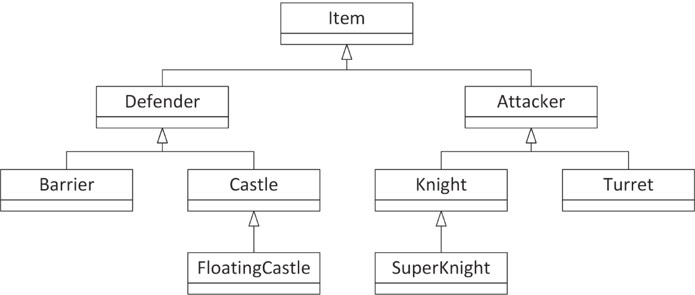
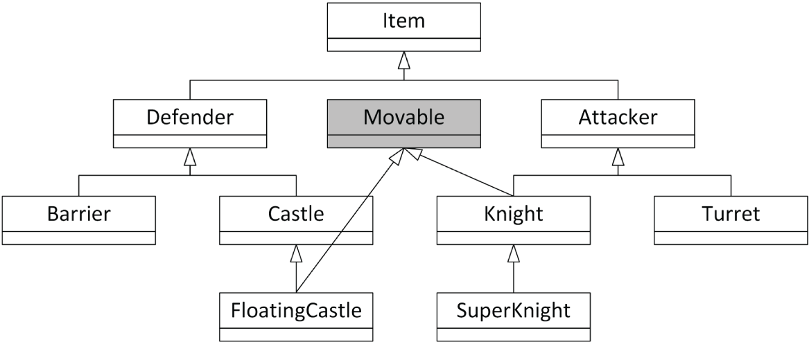
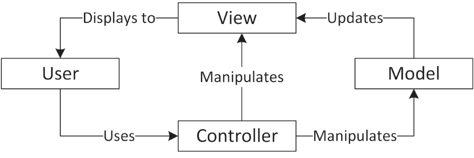

:::tip[WHAT'S IN THIS CHAPTER?]
- An overview of C++ language features that are common, but for which you might have forgotten the syntax
- What RAII is and why it is a powerful concept
- What the double dispatch technique is and how to use it
- Various techniques to implement and use mixin classes
- What frameworks are
- The model-view-controller paradigm
:::

:::tip[WILEY.COM DOWNLOADS FOR THIS CHAPTER]
Please note that all the code examples for this chapter are available as part of this chapter's code download on the book's website at `www.wiley.com/go/proc++6e` on the Download Code tab.
:::

One of the major themes of this book has been the adoption of reusable techniques and patterns. As a programmer, you tend to face similar problems repeatedly. With an arsenal of diverse approaches, you can save yourself time by applying the proper technique or pattern to a given problem.

This chapter is about *design techniques*, while the next chapter is about *design patterns*. Both represent standard approaches for solving particular problems; however, design techniques are specific to C++, whereas design patterns are less language-specific. Often, a design technique aims to overcome an annoying feature or language deficiency. Other times, a design technique is a piece of code that you use in many different programs to solve a common C++ problem.

Design techniques are C++ idioms that aren't necessarily built-in parts of the language but are nonetheless frequently used. The first part of this chapter covers the language features in C++ that are common, but for which you might have forgotten the syntax. This material is a review, but it is a useful reference tool when the syntax escapes you. The topics covered include the following:

- Starting a class from scratch
- Extending a class by deriving from it
- Writing a lambda expression
- Implementing the copy-and-swap idiom
- Throwing and catching exceptions
- Defining a class template
- Constraining class and function template parameters
- Writing to a file
- Reading from a file

The second part of this chapter focuses on higher-level techniques that build upon C++ language features. These techniques offer a better way to accomplish everyday programming tasks. Topics include the following:

- Resource Acquisition Is Initialization (RAII)
- The double dispatch technique
- Mixin classes

The chapter concludes with an introduction to frameworks, a coding technique that greatly eases the development of large applications.

## “I CAN NEVER REMEMBER HOW TO…”

[Chapter 1](../c01), “A Crash Course in C++ and the Standard Library,” explains that the C++ standard specification is more than 2,000 pages long. The standard defines a lot of keywords and a very large number of language features. It is impossible to memorize it all. Even C++ experts need to look things up sometimes. With that in mind, this section presents examples of coding techniques that are used in almost all C++ programs. When you remember the concept but forgot the syntax, turn to the following sections for a refresher.

### …Write a Class

Don't remember how to get started? No problem—here is the definition of a `Simple` class defined in a module interface file:

```cpp
export module simple;
 
// A simple class that illustrates class definition syntax.
export class Simple
{
    public:
        Simple();                              // Constructor
        virtual ~Simple() = default;           // Defaulted virtual destructor
 
        // Disallow copy construction and copy assignment.
        Simple(const Simple& src) = delete;
        Simple& operator=(const Simple& rhs) = delete;
 
        // Explicitly default move constructor and move assignment operator.
        Simple(Simple&& src) = default;
        Simple& operator=(Simple&& rhs) = default;
 
        virtual void publicMemberFunction();   // Public member function
        int m_publicInteger;                   // Public data member
 
    protected:
        virtual void protectedMemberFunction();// Protected member function
        int m_protectedInteger { 41 };         // Protected data member
 
    private:
        virtual void privateMemberFunction();  // Private member function
        int m_privateInteger { 42 };           // Private data member
        static constexpr int Constant { 2 };   // Private constant
        static inline int ms_staticInt { 3 };  // Private static data member
};
```

:::note
This class definition shows some things that are possible but not recommended. In your own class definitions, you should avoid having `public` or `protected` data members. A class should encapsulate its data; hence, you should make data members `private` and provide `public` or `protected` getter and setter member functions.
:::

As explained in [Chapter 10](../c10), “Discovering Inheritance Techniques,” if your class is meant to be a base class for other classes, you must make at least your destructor `virtual`. It's allowed to leave the destructor non-`virtual`, but then I recommend to mark the class as `final` so that no other classes can derive from it. If you only want to make your destructor `virtual` but you don't need any code inside the destructor, then you can explicitly default it, as in the `Simple` class example.

This example also demonstrates that you can explicitly delete or default special member functions. The copy constructor and copy assignment operator are deleted to prevent unintentional copying, while the move constructor and move assignment operator are explicitly defaulted.

Next, here is the module implementation file:

```cpp
module simple;
 
Simple::Simple() : m_publicInteger { 40 }
{
    // Implementation of constructor
}
 
void Simple::publicMemberFunction() { /* Implementation */ }
void Simple::protectedMemberFunction() { /* Implementation */ }
void Simple::privateMemberFunction() { /* Implementation */ }
```

:::note
Class member function definitions can also appear directly in the module interface file as demonstrated in the next section. You are not required to split a class up into a module interface file and a module implementation file.
:::

[Chapters 8](../c08), “Gaining Proficiency with Classes and Objects,” and [9](../c09), “Mastering Classes and Objects,” provide all the details for writing your own classes.

### …Derive from an Existing Class

To derive from an existing class, you declare a new class that is an extension of another class. Here is the definition for a class called `DerivedSimple`, deriving from `Simple`, and defined in a `derived_simple` module:

```cpp
export module derived_simple;
 
export import simple;
 
// A class derived from the Simple class.
export class DerivedSimple : public Simple
{
    public:
        DerivedSimple() : Simple{} // Constructor
        { /* Implementation of constructor */ }
 
        void publicMemberFunction() override // Overridden member function
        {
            // Implementation of overridden member function
            Simple::publicMemberFunction(); // Access the base class implementation
        }
 
        virtual void anotherMemberFunction() // New member function
        { /* Implementation of new member function */ }
};
```

Consult [Chapter 10](../c10) for details on inheritance techniques.

### …Write a Lambda Expression

Lambda expressions allow you to write small anonymous inline functions. They are especially powerful in combination with the C++ Standard Library algorithms. The following code snippet shows an example. It uses the `count_if()` algorithm and a lambda expression to count the number of even values in a `vector`. Additionally, the lambda expression captures the `callCount` variable by reference from its enclosing scope to keep track of the number of times it gets called.

```cpp
vector values { 1, 2, 3, 4, 5, 6, 7, 8, 9 };
int callCount { 0 };
auto evenCount { ranges::count_if(values,
    [&callCount](int value) {
        ++callCount;
        return value % 2 == 0;
    })
};
println("There are {} even elements in the vector.", evenCount);
println("Lambda was called {} times.", callCount);
```

[Chapter 19](../c19), “Function Pointers, Function Objects, and Lambda Expressions,” discusses lambda expressions in detail.

### …Use the Copy-and-Swap Idiom

The copy-and-swap idiom is discussed in detail in [Chapter 9](../c09). It's an idiom to implement a possibly throwing operation on an object with a strong exception-safety guarantee, that is, all-or-nothing. You simply create a copy of the object, modify that copy (can be a complex algorithm, possibly throwing exceptions), and finally, when no exceptions have been thrown, swap the copy with the original object using a non-throwing `swap()`. An assignment operator is an example of an operation for which you can use the copy-and-swap idiom. Your assignment operator first makes a local copy of the source object and then swaps this copy with the current object using only a non-throwing `swap()` implementation.

Here is a concise example of the copy-and-swap idiom used for a copy assignment operator. The class defines a copy constructor, a copy assignment operator, and a `swap()` member function marked as `noexcept`.

```cpp
export module copy_and_swap;
 
export class CopyAndSwap final
{
    public:
        CopyAndSwap() = default;
        ~CopyAndSwap();                                 // Destructor
 
        CopyAndSwap(const CopyAndSwap& src);            // Copy constructor
        CopyAndSwap& operator=(const CopyAndSwap& rhs); // Copy assignment operator
 
        void swap(CopyAndSwap& other) noexcept; // noexcept swap() member function
 
    private:
        // Private data members…
};
// Standalone noexcept swap() function
export void swap(CopyAndSwap& first, CopyAndSwap& second) noexcept;
```

Here are the implementations:

```cpp
CopyAndSwap::~CopyAndSwap() { /* Implementation of destructor. */ }
 
CopyAndSwap::CopyAndSwap(const CopyAndSwap& src)
{
    // This copy constructor can first delegate to a non-copy constructor
    // if any resource allocations have to be done. See the Spreadsheet
    // implementation in Chapter 9 for an example.
 
    // Make a copy of all data members…
}
 
void swap(CopyAndSwap& first, CopyAndSwap& second) noexcept
{
    first.swap(second);
}
 
void CopyAndSwap::swap(CopyAndSwap& other) noexcept
{
    using std::swap;
 
    // Swap each data member, for example:
    // swap(m_data, other.m_data);
}
 
CopyAndSwap& CopyAndSwap::operator=(const CopyAndSwap& rhs)
{
    // Copy-and-swap idiom.
    auto copy { rhs };  // Do all the work in a temporary instance.
    swap(copy);         // Commit the work with only non-throwing operations.
    return *this;
}
```

Consult [Chapter 9](../c09) for a more detailed discussion.

### …Throw and Catch Exceptions

If you've been working on a team that doesn't use exceptions (for shame!) or if you've gotten used to Java-style exceptions, the C++ syntax may escape you. Here's a refresher that uses the built-in exception class `std::runtime_error`. In most larger programs, you will write your own exception classes.

```cpp
import std;
using namespace std;
void throwIf(bool should)
{
    if (should) {
        throw runtime_error { "Here's my exception" };
    }
}
 
int main()
{
    try {
        throwIf(false); // Doesn't throw.
        throwIf(true);  // Throws.
    } catch (const runtime_error& e) {
        println(cerr, "Caught exception: {}", e.what());
        return 1;
    }
}
```

[Chapter 14](../c14), “Handling Errors,” discusses exceptions in more detail.

### …Write a Class Template

Template syntax can be confusing. The most forgotten piece of the template puzzle is that code that uses a class template needs to be able to see the class template definition as well as the member function implementations. The same holds for function templates. One technique to accomplish this is to simply put the class member function implementations directly in the interface file containing the class template definition. The following example demonstrates this and implements a class template that wraps a reference to an object and includes a getter. Here is the module interface file:

```cpp
export module simple_wrapper;
 
export template <typename T>
class SimpleWrapper
{
    public:
        explicit SimpleWrapper(T& object) : m_object { object } { }
        T& get() const { return m_object; }
    private:
        T& m_object;
};
```

The code can be tested as follows:

```cpp
import simple_wrapper;
import std;
using namespace std;
 
int main()
{
    // Try wrapping an integer.
    int i { 7 };
    SimpleWrapper intWrapper { i };  // Using CTAD.
    // Or without class template argument deduction (CTAD).
    SimpleWrapper<int> intWrapper2 { i }; 
    i = 2;
    println("wrapped value is {}", intWrapper.get());
    println("wrapped value is {}", intWrapper2.get());
 
    // Try wrapping a string.
    string str { "test" };
    SimpleWrapper stringWrapper { str };
    str += "!";
    println("wrapped value is {}", stringWrapper.get());
}
```

Details about templates can be found in [Chapter 12](../c12), “Writing Generic Code with Templates,” and [Chapter 26](../c26), “Advanced Templates.”

### …Constrain Template Parameters

With concepts, you can put constraints on template parameters of class and function templates. For example, the following code snippet constrains the template type parameter `T` of the `SimpleWrapper` class template from the previous section to be either a floating-point or an integral type. Specifying a type for `T` that does not satisfy these constraints will cause a compilation error.

```cpp
import std;
 
export template <typename T> requires (std::floating_point<T> || std::integral<T>)
class SimpleWrapper
{
    public:
        explicit SimpleWrapper(T& object) : m_object { object } { }
        T& get() const { return m_object; }
    private:
        T& m_object;
};
```

[Chapter 12](../c12) explains concepts in detail.

### …Write to a File

The following program outputs a message to a file and then reopens the file and appends another message. Additional details can be found in [Chapter 13](../c13), “Demystifying C++ I/O.”

```cpp
import std;
using namespace std;
 
int main()
{
    ofstream outputFile { "FileWrite.out" };
    if (outputFile.fail()) {
        println(cerr, "Unable to open file for writing.");
        return 1;
    }
    outputFile << "Hello!" << endl;
    outputFile.close();
 
    ofstream appendFile { "FileWrite.out", ios_base::app };
    if (appendFile.fail()) {
        println(cerr, "Unable to open file for appending.");
        return 2;
    }
    appendFile << "World!" << endl;
}
```

### …Read from a File

Details for file input are discussed in [Chapter 13](../c13). Here is a quick sample program for file reading basics. It reads the file written by the program in the previous section and outputs it one whitespace-separated token at a time.

```cpp
import std;
using namespace std;
 
int main()
{
    ifstream inputFile { "FileWrite.out" };
    if (inputFile.fail()) {
        println(cerr, "Unable to open file for reading.");
        return 1;
    }
 
    string nextToken;
    while (inputFile >> nextToken) {
        println("Token: {}", nextToken);
    }
}
```

The following reads an entire text file with a single call to `getline()`. This doesn't work with binary files, as they might contain `\0` characters in their contents.

```cpp
string fileContents;
getline(inputFile, fileContents, '\0');
println("{}", fileContents);
```

An alternative is to use an `istreambuf_iterator` (see [Chapter 17](../c17), “Understanding Iterators and the Ranges Library”):

```cpp
string fileContents {
    istreambuf_iterator<char> { inputFile },
    istreambuf_iterator<char> { }
};
println("{}", fileContents);
```

## THERE MUST BE A BETTER WAY

As you read this paragraph, thousands of C++ programmers throughout the world are solving problems that have already been solved. Someone in a cubicle in San Jose is writing a smart pointer implementation from scratch that uses reference counting. A young programmer on a Mediterranean island is designing a class hierarchy that could benefit immensely from the use of mixin classes.

As a professional C++ programmer, you ought to spend less of your time reinventing the wheel and more of your time adapting reusable concepts in new ways. This section gives some examples of general-purpose approaches that you can apply directly to your own programs or customize for your needs.

### Resource Acquisition Is Initialization

*Resource acquisition is initialization* (RAII) is a simple yet powerful concept. It is used to acquire ownership of some resources and to automatically free these acquired resources when an RAII instance goes out of scope. Both initialization and destruction happen at a deterministic point in time. Basically, the constructor of a new RAII instance *acquires ownership* of a certain resource and *initializes* the instance with that resource, which is why it's called *resource acquisition is initialization*. The destructor automatically frees the acquired resource when the RAII instance is destroyed.

Here is an example of a `File` RAII class that safely wraps a C-style file handle (`std::FILE`) and automatically closes the file when the RAII instance goes out of scope. The RAII class also provides `get()`, `release()`, and `reset()` member functions that behave similarly to the same member functions on certain Standard Library classes, such as `std::unique_ptr`. RAII classes usually disallow copy construction and copy assignment; hence, this implementation deletes those members.

```cpp
import std;
 
class File final
{
    public:
        explicit File(std::FILE* file) : m_file { file } { }
        ~File() { reset(); }
 
        // Prevent copy construction and copy assignment.
        File(const File& src) = delete;
        File& operator=(const File& rhs) = delete;
 
        // Allow move construction.
        File(File&& src) noexcept : m_file { std::exchange(src.m_file, nullptr) }
        {
        }
 
        // Allow move assignment.
        File& operator=(File&& rhs) noexcept
        {
            if (this != &rhs) {
                reset();
                m_file = std::exchange(rhs.m_file, nullptr);
            }
            return *this;
        }
 
        // get(), release(), and reset()
        std::FILE* get() const noexcept { return m_file; }
 
        [[nodiscard]] std::FILE* release() noexcept
        {
            return std::exchange(m_file, nullptr);
        }
 
        void reset(std::FILE* file = nullptr) noexcept
        {
            if (m_file) { std::fclose(m_file); }
            m_file = file;
        }
 
    private:
        std::FILE* m_file { nullptr };
};
```

It can be used as follows:

```cpp
File myFile { std::fopen("input.txt", "r") };
```

As soon as the `myFile` instance goes out of scope, its destructor is called, and the file is automatically closed.

There is one important pitfall with using RAII classes that you need to be aware of. You can accidentally write a statement that you think is properly creating an RAII instance within a certain scope, but that is instead creating a temporary object, which is immediately destroyed when that statement has finished executing. For example, the following statement correctly uses the `File` RAII class:

```cpp
File myFile { std::fopen("input.txt", "r") };
```

However, you could accidentally forget to give the RAII instance a name as follows:

```cpp
File { std::fopen("input.txt", "r") };
```

This statement creates a temporary `File` instance, which is immediately destroyed at the end of the statement. This does not trigger any warning or error from the compiler. To avoid this, you should mark the constructor of RAII classes with the `[[nodiscard]]` attribute. For example:

```cpp
[[nodiscard]] explicit File(std::FILE* file) : m_file{ file } { }
```

With this change, creating a `File` instance without giving it a name triggers a compiler warning such as the following:

```cpp
warning C4834: discarding return value of function with 'nodiscard' attribute
```

Of course, with the `File` RAII class, you probably will never forget to give it a name as you most likely will want to do something with the opened file. However, sometimes you need to create an instance of an RAII class in a certain scope, without having to directly interact any further with that created instance, e.g., mutex locks. Let's look at such an example using an RAII class from the Standard Library, `std::unique_lock` (see [Chapter 27](../c27), “Multithreaded Programming with C++”). The following code snippet shows proper use of a `unique_lock`. I'm initially not using the uniform initialization syntax to initialize the `unique_lock` but will get back to this in the subsequent discussion.

```cpp
class Foo
{
    public:
        void setData()
        {
            unique_lock<mutex> lock(m_mutex);
            // …
        }
    private:
        mutex m_mutex;
};
```

The `setData()` member function uses the `unique_lock` RAII class to construct a local `lock` object that locks the `m_mutex` data member and automatically unlocks that mutex at the end of the function.

However, because you do not directly use the `lock` variable after it has been defined, it is easy to make the following mistake:

```cpp
unique_lock<mutex>(m_mutex);
```

In this code, you accidentally forgot to give the `unique_lock` a name. This compiles, but it does not do what you intended it to do! It actually declares a local variable called `m_mutex` (hiding the `m_mutex` data member) and initializes it with a call to the `unique_lock`'s default constructor. The result is that the `m_mutex` data member is *not* locked! The compiler will give a warning, though, if the warning level is set high enough. Something along the lines of:

```cpp
warning C4458: declaration of 'm_mutex' hides class member
```

If you use uniform initialization syntax as follows, the compiler doesn't generate the “hiding class member” warning, but it also does not do what you want. The following creates a temporary lock on `m_mutex`, but since it's temporary, the lock is immediately released at the end of this statement.

```cpp
unique_lock<mutex> { m_mutex };
```

Recently, some compilers actually do mark the `unique_lock` constructors with `[[nodiscard]]`, just as I recommended with the `File` RAII example. One such compiler is Visual C++ 2022. If you use such a compiler, the previous statement generates a warning about the fact that the return value of the constructor is discarded.

Additionally, you could make a typo in the name passed as argument, for example as follows:

```cpp
unique_lock<mutex>(m);
```

Here you forgot to give a name for the lock, and you made a typo in the name of the argument. This code simply declares a local variable called `m` and initializes it with the default constructor of `unique_lock`. The compiler does not even generate a warning, unless maybe a warning that `m` is an unreferenced local variable. In this case, though, if you would use uniform initialization syntax as follows, then the compiler issues an error complaining about an undeclared identifier `m`:

```cpp
unique_lock<mutex> { m };
```

:::warning
Make sure you always name your RAII instances! Additionally, I recommend not to include a default constructor in an RAII class. That avoids some of the issues discussed here.
:::

### Double Dispatch

*Double dispatch* is a technique that adds an extra dimension to the concept of polymorphism. As described in [Chapter 5](../c05), “Designing with Classes,” polymorphism lets the program determine behavior based on types at run time. For example, you could have an `Animal` class with a `move()` member function. All `Animal`s move, but they differ in terms of *how* they move. The `move()` member function is defined for every derived class of `Animal` so that the appropriate member function can be called, or can be dispatched to, for the appropriate animal at run time without knowing the type of the animal at compile time. [Chapter 10](../c10) explains how to use virtual member functions to implement this run-time polymorphism.

Sometimes, however, you need a member function to behave according to the run-time type of two objects, instead of just one. For example, suppose you want to add a member function to the `Animal` class that returns `true` if the animal eats another animal, and `false` otherwise. The decision is based on two factors: the type of animal doing the eating and the type of animal being eaten. Unfortunately, C++ provides no language mechanism to choose a behavior based on the run-time type of more than one object. Virtual member functions alone are insufficient for modeling this scenario because they determine a member function, or behavior, depending on the run-time type of only the receiving object.

Some object-oriented languages provide the ability to choose a member function at run time based on the run-time types of two or more objects. They call this feature *multimethods*. In C++ there is no core language feature to support multimethods, but you can use the *double dispatch* technique, which provides a way to make functions virtual for more than one object.

:::note
Double dispatch is really a special case of multiple dispatch, in which a behavior is chosen depending on the run-time types of two or more objects. In practice, double dispatch, which chooses a behavior based on the run-time types of exactly two objects, is usually sufficient.
:::

#### Attempt #1: Brute Force

The most straightforward way to implement a member function whose behavior depends on the run-time types of two different objects is to take the perspective of one of the objects and use a series of `if`/`else` constructs to check the type of the other. For example, you could implement a member function called `eats()` in each class derived from `Animal` that takes the other animal as a parameter. The member function is declared pure virtual in the base class as follows:

```cpp
class Animal
{
    public:
        virtual bool eats(const Animal& prey) const = 0;
};
```

Each derived class implements the `eats()` member function and returns the appropriate value based on the type of the parameter. The implementation of `eats()` for several derived classes follows. Note that the `TRex` avoids any `if` statements because—according to the author—a T-rex, like any carnivorous dinosaur, eats anything.

```cpp
bool Bear::eats(const Animal& prey) const
{
    if (typeid(prey) == typeid(Fish)) { return true; }
    return false;
}
 
bool Fish::eats(const Animal& prey) const
{
    if (typeid(prey) == typeid(Fish)) { return true; }
    return false;
}
 
bool TRex::eats(const Animal& prey) const
{
    return true;
}
```

This brute-force approach works, and it's probably the most straightforward technique for a small number of classes. However, there are several reasons why you might want to avoid this approach.

- Object-oriented programming (OOP) purists often frown upon explicitly querying the type of an object because it implies a design that is lacking a proper object-oriented structure.
- As the number of types grows, such code can become messy and repetitive.
- This approach does not force derived classes to consider new types. For example, if you added a `Donkey`, the `Bear` class would continue to compile but would return `false` when told to eat a `Donkey`, even though everybody knows that bears eat donkeys. A bear would refuse to eat a donkey because there is no `else if` statement checking explicitly for `Donkey`s.

#### Attempt #2: Single Polymorphism with Overloading

You could attempt to use polymorphism with overloading to circumvent all of the cascading `if`/`else` constructs. Instead of giving each class a single `eats()` member function that takes an `Animal` reference, why not overload the member function for each derived class of `Animal`? The base class definition would look like this:

```cpp
class Animal
{
    public:
        virtual bool eats(const Bear&) const = 0;
        virtual bool eats(const Fish&) const = 0;
        virtual bool eats(const TRex&) const = 0;
};
```

Because the member functions are pure virtual in the base class, each derived class is forced to implement the behavior for every other type of `Animal`. For example, the `Bear` class contains the following member functions:

```cpp
class Bear : public Animal
{
    public:
        bool eats(const Bear&) const override { return false; }
        bool eats(const Fish&) const override { return true; }
        bool eats(const TRex&) const override { return false; }
};
```

This approach initially appears to work, but it really solves only half of the problem. To call the proper `eats()` member function on an `Animal`, the compiler needs to know the compile-time type of the animal being eaten. A call such as the following will be successful because the compile-time types of both the animal that eats and the animal that is eaten are known:

```cpp
Bear myBear;
Fish myFish;
println("Bear eats fish? {}", myBear.eats(myFish));
```

The missing piece is that the solution is polymorphic in only one direction. You can access `myBear` through an `Animal` reference, and the correct member function will be called:

```cpp
Animal& animalRef { myBear };
println("Bear eats fish? {}", animalRef.eats(myFish));
```

However, the reverse is not true. If you pass an `Animal` reference to the `eats()` member function, you will get a compilation error because there is no `eats()` member function that takes an `Animal`. The compiler cannot determine, at compile time, which version to call. The following example does not compile:

```cpp
Animal& animalRef { myFish };
println("Bear eats fish? {}",
    myBear.eats(animalRef)); // BUG! No member function Bear::eats(Animal&)
```

Because the compiler needs to know which overloaded version of the `eats()` member function is going to be called at compile time, this solution is not truly polymorphic. It would not work, for example, if you were iterating over an array of `Animal` references and passing each one to a call to `eats()`.

#### Attempt #3: Double Dispatch

The *double dispatch* technique is a truly polymorphic solution to the multiple-type problem. In C++, polymorphism is achieved by overriding member functions in derived classes. At run time, member functions are called based on the actual type of the object. The preceding single polymorphic attempt didn't work because it attempted to use polymorphism to determine which overloaded version of a member function to call instead of using it to determine on which class to call the member function.

To begin, focus on a single derived class, perhaps the `Bear` class. The class needs a member function with the following declaration:

```cpp
bool eats(const Animal& prey) const override;
```

The key to double dispatch is to determine the result based on a member function call on the argument. Suppose that the `Animal` class has a member function called `eatenBy()`, which takes an `Animal` reference as a parameter. This member function returns `true` if the current `Animal` gets eaten by the one passed in. With such a member function, the definition of `eats()` becomes simple:

```cpp
bool Bear::eats(const Animal& prey) const
{
    return prey.eatenBy(*this);
}
```

At first, it looks like this solution adds another layer of member function calls to the single polymorphic member function. After all, each derived class still has to implement a version of `eatenBy()` for every derived class of `Animal`. However, there is a key difference. Polymorphism is occurring twice! When you call the `eats()` member function on an `Animal`, polymorphism determines whether you are calling `Bear::eats()`, `Fish::eats()`, or one of the others. When you call `eatenBy()`, polymorphism again determines which class's version of the member function to call. It calls `eatenBy()` on the run-time type of the `prey` object. Note that the run-time type of `*this` is always the same as the compile-time type so that the compiler can call the correct overloaded version of `eatenBy()` for the argument (in this case `Bear`).

The following are the class definitions for the `Animal` hierarchy using double dispatch. The forward class declarations are necessary because the base class uses references to the derived classes. Note that each `Animal`-derived class implements the `eats()` member function in the same way, but it cannot be factored up into the base class. The reason is that if you attempt to do so, the compiler won't know which overloaded version of the `eatenBy()` member function to call because `*this` would be an `Animal`, not a particular derived class. Member function overload resolution is determined according to the compile-time type of the object, not its run-time type.

```cpp
// Forward declarations.
class Fish;
class Bear;
class TRex;
 
class Animal
{
    public:
        virtual bool eats(const Animal& prey) const = 0;
 
        virtual bool eatenBy(const Bear&) const = 0;
        virtual bool eatenBy(const Fish&) const = 0;
        virtual bool eatenBy(const TRex&) const = 0;
};
 
class Bear : public Animal
{
    public:
        bool eats(const Animal& prey) const override{ return prey.eatenBy(*this); }
 
        bool eatenBy(const Bear&) const override { return false; }
        bool eatenBy(const Fish&) const override { return false; }
        bool eatenBy(const TRex&) const override { return true; }
};
 
class Fish : public Animal
{
    public:
        bool eats(const Animal& prey) const override{ return prey.eatenBy(*this); }
 
        bool eatenBy(const Bear&) const override { return true; }
        bool eatenBy(const Fish&) const override { return true; }
        bool eatenBy(const TRex&) const override { return true; }
};
 
class TRex : public Animal
{
    public:
        bool eats(const Animal& prey) const override{ return prey.eatenBy(*this); }
 
        bool eatenBy(const Bear&) const override { return false; }
        bool eatenBy(const Fish&) const override { return false; }
        bool eatenBy(const TRex&) const override { return true; }
};
```

Double dispatch is a concept that takes a bit of getting used to. I suggest playing with this code to familiarize yourself with the concept and its implementation.

### Mixin Classes

[Chapters 5](../c05) and [6](../c06), “Designing for Reuse,” introduce mixin classes. They answer the question, “What else is this class able to do?” and the answer often ends with “-able.” Examples are `Clickable`, `Drawable`, `Printable`, `Lovable`, and so on. Mixin classes are a way that you can add functionality to a class without committing to a full *is-a* relationship. There are several techniques to implement mixin classes in C++. This section looks at the following:

- Using multiple inheritance
- Using class templates
- Using CRTP
- Using CRTP and “deducing `this`”

#### Using Multiple Inheritance

This section examines how to design, implement, and use a mixin class using the multiple inheritance technique.

##### Designing a Mixin Class

Mixin classes contain actual code that can be reused by other classes. A single mixin class implements a well-defined piece of functionality. For example, you might have a mixin class called `Playable` that is mixed into certain types of media objects. The mixin class could, for example, contain most of the code to communicate with the computer's sound drivers. By mixing in the class, the media object would get that functionality for free.

When designing a mixin class, you need to consider what behavior you are adding and whether it belongs in the object hierarchy or in a separate class. Using the previous example, if all media classes are playable, the base class should derive from `Playable` instead of mixing the `Playable` class into all of the derived classes. If only certain media classes are playable and they are scattered throughout the hierarchy, a mixin class makes sense.

One of the cases where mixin classes are particularly useful is when you have classes organized into a hierarchy on one axis, but they also contain similarities on another axis. For example, consider a war simulation game played on a grid. Each grid location can contain an `Item` with attack and defense capabilities and other characteristics. Some items, such as a `Castle`, are stationary. Others, such as a `Knight` or `FloatingCastle`, can move throughout the grid. When initially designing the object hierarchy, you might end up with something like [Figure 32.1](#c32-fig-0001), which organizes the classes according to their attack and defense capabilities.

The hierarchy in [Figure 32.1](#c32-fig-0001) ignores the movement functionality that certain classes contain. Building your hierarchy around movement would result in a structure similar to [Figure 32.2](#c32-fig-0002).

Of course, the design of [Figure 32.2](#c32-fig-0002) throws away all the organization of [Figure 32.1](#c32-fig-0001). What's a good object-oriented programmer to do?

Assuming that you go with the first hierarchy, organized around attackers and defenders, you need some way to work movement into the equation. One possibility is that, even though only a portion of the derived classes support movement, you *could* add a `move()` member function to the `Item` base class. The default implementation would do nothing, but certain derived classes would override `move()` to actually change their location on the grid.

 


[^FIGURE 32.1]

 


[^FIGURE 32.2]

Another approach is to write a `Movable` mixin class. The elegant hierarchy from [Figure 32.1](#c32-fig-0001) could be preserved, but certain classes in the hierarchy would derive from `Movable` in addition to their parent. [Figure 32.3](#c32-fig-0003) shows this design.

 


[^FIGURE 32.3]

Yet another approach is to flatten the hierarchy and don't use run time polymorphism at all. Instead, you can use static polymorphism and/or type-erasure whenever you need to deal polymorphically with a subset of your types. These approaches are not further discussed in this text.

##### Implementing a Mixin Class

Writing a mixin class is no different from writing a normal class. In fact, it's usually much simpler. Using the earlier war simulation, the `Movable` mixin class might look as follows:

```cpp
class Movable
{
    public:
        virtual void move() { /* Implementation to move an item… */ }
};
```

This `Movable` mixin class implements the actual code to move an item on the grid. It also provides a type for `Item`s that can be moved. This allows you to create, for example, an array of all movable items without knowing or caring what actual derived class of `Item` they belong to.

##### Using a Mixin Class

The code for using a mixin class is syntactically equivalent to multiple inheritance. In addition to deriving from your parent class in the main hierarchy, you also derive from the mixin class. Here's an example:

```cpp
class FloatingCastle : public Castle, public Movable { /* … */ };
```

This *mixes in* the functionality provided by the `Movable` mixin class into the `FloatingCastle` class. Now you have a class that exists in the most logical place in the hierarchy, but still shares commonality with objects elsewhere in the hierarchy.

#### Using Class Templates

A second option to implement a mixin class in C++ is to make the mixin class itself a class template accepting a template type parameter and then deriving itself from that type.

[Chapter 6](../c06) explains the mechanism for implementing a `SelfDrivable` mixin class template that can then be used to create self-drivable cars and trucks. Now that you are fluent in class templates ([Chapters 12](../c12) and [26](../c26)), the `SelfDrivable` mixin example from [Chapter 6](../c06) should hold no surprises anymore. The mixin class is defined as follows:

```cpp
template <typename T>
class SelfDrivable : public T { /* … */ };
```

If you then have a `Car` and a `Truck` class, you can easily define a self-drivable car and truck as follows:

```cpp
SelfDrivable<Car> selfDrivingCar;
SelfDrivable<Truck> selfDrivingTruck;
```

This way, functionality can be added to existing classes, `Car` and `Truck`, without having to modify those classes at all.

Here is a complete example:

```cpp
template <typename T>
class SelfDrivable : public T
{
    public:
        void drive() { this->setSpeed(1.2); }
};
 
class Car
{
    public:
        void setSpeed(double speed) { println("Car speed set to {}.", speed); }
};
 
class Truck
{
    public:
        void setSpeed(double speed) { println("Truck speed set to {}.", speed); }
};
 
int main()
{
    SelfDrivable<Car> car;
    SelfDrivable<Truck> truck;
    car.drive();
    truck.drive();
}
```

#### Using CRTP

Another technique to implement a mixin class in C++ is to use the *curiously recurring template pattern* (CRTP).

The mixin class itself is again a class template, but this time it accepts a template type parameter representing the type of a derived class and doesn't inherit itself from any other class. In the implementation a `static_cast()` is required to cast `this` to the type of the derived class.

```cpp
template <typename Derived>
class SelfDrivable
{
    public:
        void drive()
        {
            auto& self { static_cast<Derived&>(*this) };
            self.setSpeed(1.2);
        }
};
```

Concrete classes, such as `Car` and `Truck`, then inherit from `SelfDrivable` and pass their own type as the template type argument for `SelfDrivable`.

```cpp
class Car : public SelfDrivable<Car>
{
    public:
        void setSpeed(double speed) { println("Car speed set to {}.", speed); }
};
 
class Truck : public SelfDrivable<Truck>
{
    public:
        void setSpeed(double speed) { println("Truck speed set to {}.", speed); }
};
```

These can be used as follows:

```cpp
Car car;
Truck truck;
car.drive();
truck.drive();
```

#### <cpp23></cpp23> Using CRTP and Deducing this

The implementation of `SelfDrivable::drive()` in the previous CRTP example requires a `static_cast()` to get access to the correct derived type. Thanks to the C++23 “deducing `this`” feature, the `SelfDrivable` class can be implemented more elegantly as follows using an explicit object parameter. In this implementation, the `SelfDrivable` mixin class is no longer a class template, but `SelfDrivable::drive()` is now a member function template. The parameter annotated with `this` is known as an explicit object parameter (see [Chapter 8](../c08), “Gaining Proficiency with Classes and Objects”).

```cpp
class SelfDrivable
{
    public:
        void drive(this auto& self) { self.setSpeed(1.2); }
};
```

`Car` and `Truck` then simply derive from `SelfDrivable`:

```cpp
class Car : public SelfDrivable { /* Same as before */ };
class Truck : public SelfDrivable { /* Same as before */ };
```

## OBJECT-ORIENTED FRAMEWORKS

When graphical operating systems first came on the scene in the 1980s, procedural programming was the norm. At the time, writing a GUI application usually involved manipulating complex data structures and passing them to OS-provided functions. For example, to draw a rectangle in a window, you might have had to populate a `Window` struct with the appropriate information and pass it to a `drawRect()` function.

As object-oriented programming (OOP) grew in popularity, programmers looked for a way to apply the OOP paradigm to GUI development. The result is known as an *object-oriented framework*. In general, a framework is a set of classes that are used collectively to provide an object-oriented interface to some underlying functionality. By frameworks, programmers usually mean large class libraries that are used for general application development. However, a framework can really represent functionality of any size. If you write a suite of classes that provides database functionality for your application, those classes could be considered a framework.

### Working with Frameworks

The defining characteristic of a framework is that it provides its own set of techniques and patterns. Frameworks usually require a bit of learning to get started with because they have their own mental model. Before you can work with a large application framework, such as the Microsoft Foundation Classes (MFC), you need to understand its view of the world.

Frameworks vary greatly in their abstract ideas and in their actual implementation. Many frameworks are built on top of legacy procedural APIs, which may affect various aspects of their design. Other frameworks are written from the ground up with object-oriented design in mind. Some frameworks might ideologically oppose certain aspects of the C++ language. For example, a framework could consciously shun the notion of multiple inheritance.

When you start working with a new framework, your first task is to find out what makes it tick. To what design principles does it subscribe? What mental model are its developers trying to convey? What aspects of the language does it use extensively? These are all vital questions, even though they may sound like things that you'll pick up along the way. If you fail to understand the design, model, or language features of the framework, you will quickly get into situations where you overstep the bounds of the framework.

An understanding of the framework's design will also make it possible for you to extend it. For example, if the framework omits a feature, such as support for printing, you could write your own printing classes using the same model as the framework. By doing so, you retain a consistent model for your application, and you have code that can be reused by other applications.

Additionally, a framework might use certain specific data types. For example, the MFC framework uses the `CString` data type to represent strings, instead of using the Standard Library `std::string` class. This does not mean you have to switch to the data types provided by the framework for your entire code base. Instead, you could convert the data types on the boundaries between the framework code and the rest of your code.

### The Model-View-Controller Paradigm

As I mentioned earlier, frameworks vary in their approaches to object-oriented design. One common paradigm is known as *model-view-controller* (MVC). This paradigm models the notion that many applications commonly deal with a set of data, one or more views on that data, and manipulation of the data.

In MVC, a set of data is called the *model*. In a race car simulator, the model would keep track of various statistics, such as the current speed of the car and the amount of damage it has sustained. In practice, the model often takes the form of a class with many getters and setters. The class definition for the model of the race car might look as follows:

```cpp
class RaceCar
{
    public:
        RaceCar();
        virtual ~RaceCar() = default;
 
        virtual double getSpeed() const;
        virtual void setSpeed(double speed);
 
        virtual double getDamageLevel() const;
        virtual void setDamageLevel(double damage);
    private:
        double m_speed { 0.0 };
        double m_damageLevel { 0.0 };
};
```

A *view* is a particular visualization of the model. For example, there could be two views on a `RaceCar`. The first view could be a graphical view of the car, and the second could be a graph that shows the level of damage over time. The important point is that both views are operating on the same data—they are different ways of looking at the same information. This is one of the main advantages of the MVC paradigm: by keeping data separated from its display, you can keep your code more organized and easily create additional views.

The final piece to the MVC paradigm is the *controller*. The controller is the piece of code that changes the model in response to some event. For example, when the driver of the race car simulator runs into a concrete barrier, the controller instructs the model to bump up the car's damage level and reduce its speed. The controller can also manipulate the view. For example, when the user scrolls a scrollbar in the user interface, the controller instructs the view to scroll its content.

The three components of MVC interact in a feedback loop. Actions are handled by the controller, which adjusts the model and/or views. If the model changes, it notifies the views to update themselves. [Figure 32.4](#c32-fig-0004) shows this interaction.

 


[^FIGURE 32.4]

The model-view-controller paradigm has gained widespread support within many popular frameworks. Even nontraditional applications, such as web applications, are moving in the direction of MVC because it enforces a clear separation between data, the manipulation of data, and the displaying of data.

The MVC pattern has evolved into several different variants, such as model-view-presenter (MVP), model-view-adapter (MVA), model-view-viewmodel (MVVM), and so on.

## SUMMARY

In this chapter, you've read about some of the common techniques that professional C++ programmers use consistently in their projects. As you advance as a software developer, you will undoubtedly form your own collection of reusable classes and libraries. Discovering design techniques opens the door to developing and using *patterns*, which are higher-level reusable constructs. You will experience the many applications of patterns next in [Chapter 33](../c33), “Applying Design Patterns.”

## EXERCISES

By solving the following exercises, you can practice the material discussed in this chapter. Solutions to all exercises are available with the code download on the book's website at `www.wiley.com/go/proc++6e`. However, if you are stuck on an exercise, first reread parts of this chapter to try to find an answer yourself before looking at the solution from the website.

1. **Exercise 32-1:** Write an RAII class template, `Pointer<T>`, that can store a pointer to a `T` and automatically deletes the memory when such an RAII instance goes out of scope. Provide a `reset()` and `release()` member function, and an overloaded `operator*`.
2. **Exercise 32-2:** Modify your class template from Exercise 32-1 so that it throws an exception if the argument given to the constructor is `nullptr`.
3. **Exercise 32-3:** Take your solution from Exercise 32-2 and add a member function template called `assign()` with a template type parameter `E`. The function should accept an argument of type `E` and assign this argument to the data to which the wrapped pointer is pointing. Add a constraint to the member function template to make sure type `E` is in fact assignable to an lvalue of type `T`.
4. **Exercise 32-4:** Write a lambda expression returning the sum of two arguments. Both arguments must be of the same type. The lambda expression should work with all kind of data types, such as integral types, floating-point types, and even `std::string`s. Try out your lambda expression by calculating the sum of 11 and 22, 1.1 and 2.2, and “Hello ” and “world!”
