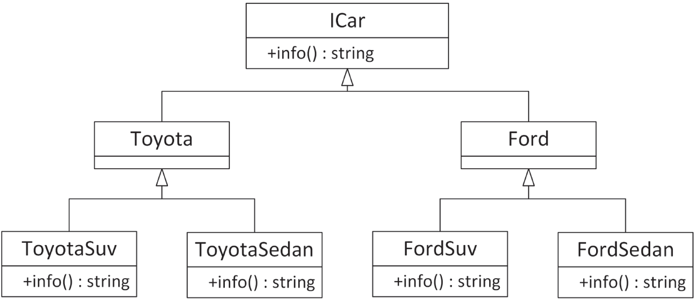
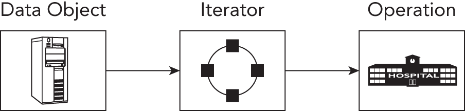
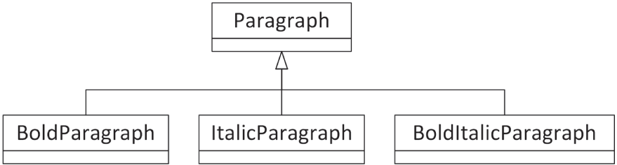
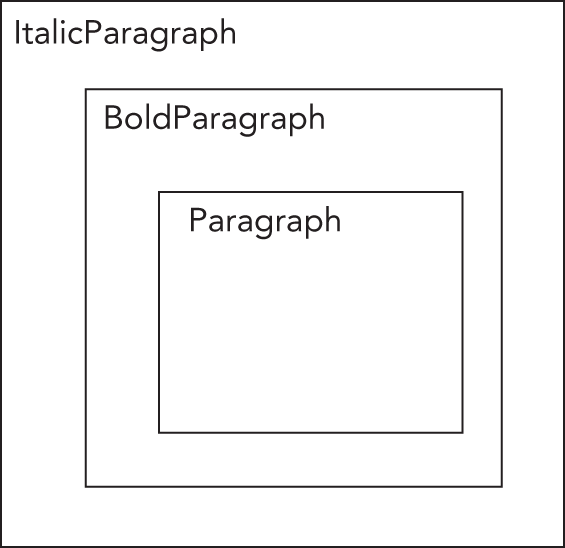

:::tip[WHAT'S IN THIS CHAPTER?]
- What a pattern is and what the difference is with a design technique
- How to use the following patterns:
- Strategy
- Abstract factory
- Factory method
- Adapter
- Proxy
- Iterator
- Observer
- Decorator
- Chain of responsibility
- Singleton
:::

:::tip[WILEY.COM DOWNLOADS FOR THIS CHAPTER]
Please note that all the code examples for this chapter are available as part of this chapter's code download on the book's website at `www.wiley.com/go/proc++6e` on the Download Code tab.
:::

A *design pattern* is a standard approach to program organization that solves a general problem. Design patterns are less language-specific than are techniques. The difference between a pattern and a technique is admittedly fuzzy, and different books employ different definitions. This book defines a technique as a strategy particular to the C++ language, while a pattern is a more general strategy for object-oriented design applicable to any object-oriented language, such as C++, C#, Java, or Smalltalk. In fact, if you are familiar with C# or Java programming, you will recognize many of these patterns.

Design patterns have names, and that's a big advantage. The name carries meaning and therefore helps to more easily communicate about solutions. The names of patterns also help developers to more quickly understand a solution. However, certain patterns have several different names, and the distinctions between certain patterns is sometimes a bit vague with different sources describing and categorizing them slightly differently. In fact, depending on the books or other sources you use, you may find the same name applied to different patterns. There is even disagreement as to which design approaches qualify as patterns. With a few exceptions, this book follows the terminology used in the seminal book *Design Patterns: Elements of Reusable Object-Oriented Software*, by Erich Gamma et al. (Addison-Wesley Professional, 1994). Other pattern names and variations are noted when appropriate.

The design pattern concept is a simple but powerful idea. Once you are able to recognize the recurring object-oriented interactions that occur in a program, finding an elegant solution often becomes a matter of selecting the appropriate pattern to apply.

As there are books available discussing nothing but design patterns, this chapter briefly describes just a small selection of the more important design patterns in detail and presents sample implementations. This gives you a pretty good idea about what design patterns are all about.

Any aspect of design is likely to provoke debate among programmers, and I believe that is a good thing. Don't simply accept these patterns as the only way to accomplish a task—draw on their approaches and ideas to refine them and form new patterns.

## THE STRATEGY PATTERN

The *strategy design pattern* is one way to support the *dependency inversion principle* (DIP); see [Chapter 6](../c06), “Designing for Reuse.” With this pattern, interfaces are used to invert dependency relationships. Interfaces are created for every provided service. If a component needs a set of services, interfaces to those services are injected into the component, a mechanism called *dependency injection*. Using the strategy pattern makes unit testing easier, as you can easily mock services away. As an example, this section discusses a logging mechanism implemented with the strategy pattern.

### Example: A Logging Mechanism

The strategy-based logger example uses an interface, or abstract base class, called `ILogger`. Any code that wants to log something uses this `ILogger` interface. Subsequently, a concrete implementation of this interface is then injected into any code that needs to be able to use the logging functionality. With this pattern, a unit test can, for example, inject a special mock implementation for the `ILogger` interface to verify that the right information gets logged. A huge advantage of this pattern is that concrete loggers can easily be swapped without having to modify any library code; client code simply passes in the logger it wants to use.

### Implementation of a Strategy-Based Logger

This implementation provides a `Logger` class with the following features:

- It can log single strings.
- Each log message is prefixed with the current system time and an associated log level.
- The logger can be set up to only log messages above a certain log level.
- Every logged message is flushed to disk so that it will appear in the file immediately.

Let's first define the `ILogger` interface:

```cpp
export class ILogger
{
    public:
        virtual ˜ILogger() = default; // Virtual destructor.
 
        // Enumeration for the different log levels.
        enum class LogLevel { Debug, Info, Error };
 
        // Sets the log level.
        virtual void setLogLevel(LogLevel level) = 0;
 
        // Logs a single message at the given log level.
        virtual void log(std::string_view message, LogLevel logLevel) = 0;
};
```

Next, a concrete `Logger` class is implemented as follows:

```cpp
export class Logger : public ILogger
{
    public:
        explicit Logger(const std::string& logFilename);
        void setLogLevel(LogLevel level) override;
        void log(std::string_view message, LogLevel logLevel) override;
    private:
        // Converts a log level to a human readable string.
        std::string_view getLogLevelString(LogLevel level) const;
 
        std::ofstream m_outputStream;
        LogLevel m_logLevel { LogLevel::Error };
};
```

The implementation of the `Logger` class is straightforward. Once the log file has been opened, each log message is written to it with the log level prepended and then flushed to disk.

```cpp
Logger::Logger(const string& logFilename)
{
    m_outputStream.open(logFilename, ios_base::app);
    if (!m_outputStream.good()) {
        throw runtime_error { "Unable to initialize the Logger!" };
    }
    println(m_outputStream, "{}: Logger started.", chrono::system_clock::now());
}
 
void Logger::setLogLevel(LogLevel level)
{
    m_logLevel = level;
}
 
string_view Logger::getLogLevelString(LogLevel level) const
{
    switch (level) {
        case LogLevel::Debug: return "DEBUG";
        case LogLevel::Info: return "INFO";
        case LogLevel::Error: return "ERROR";
    }
    throw runtime_error { "Invalid log level." };
}
 
void Logger::log(string_view message, LogLevel logLevel)
{
    if (m_logLevel > logLevel) { return; }
    println(m_outputStream, "{}: [{}] {}", chrono::system_clock::now(),
        getLogLevelString(logLevel), message);
}
```

### Using the Strategy-Based Logger

Suppose you have a class called `Foo` that wants to use the logging functionality. With the strategy pattern, a concrete `ILogger` instance is injected into the class, for example through the constructor:

```cpp
class Foo
{
    public:
        explicit Foo(ILogger* logger) : m_logger { logger }
        {
            if (m_logger == nullptr) {
                throw invalid_argument { "ILogger cannot be null." };
            }
        }
        void doSomething()
        {
            m_logger->log("Hello strategy!", ILogger::LogLevel::Info);
        }
    private:
        ILogger* m_logger;
};
```

When a `Foo` instance is created, a concrete `ILogger` is injected into it:

```cpp
Logger concreteLogger { "log.out" };
concreteLogger.setLogLevel(ILogger::LogLevel::Debug);
 
Foo f { &concreteLogger };
f.doSomething();
```

## THE ABSTRACT FACTORY PATTERN

A factory in real life constructs tangible objects, such as tables or cars. Similarly, a *factory* in object-oriented programming constructs objects. When you use factories in your program, portions of code that want to create a particular object ask a factory for an instance of the object instead of calling the object constructor themselves. For example, an interior decorating program might have a `FurnitureFactory` object. When part of the code needs a piece of furniture such as a table, it calls the `createTable()` member function of the `FurnitureFactory` object, returning a new table. This is the main benefit of factories; they abstract the object creation process.

At first glance, factories seem to lead to complicated designs. It appears that you're only adding another layer of indirection to the program. Instead of calling `createTable()` on a `FurnitureFactory`, you could simply create a new `Table` object directly. However, a benefit of using factories is that they can be used alongside class hierarchies to construct objects without knowing their exact type. As you'll see in the following example, factories can run parallel to class hierarchies. This is not to say they must run parallel to class hierarchies. Factories may as well just create any number of concrete types.

Another benefit of factories is that instead of directly creating various objects all over your code, you pass around factories that allow different parts of the program to create objects of the same kind for a particular domain.

Another reason to use a factory is when the creation of your objects requires certain information, states, resources, and so on, owned by the factory, and which clients of the factory should not know about. A factory can also be used if creating your objects requires a complex series of steps to be executed in the right order, or if all created objects need to be linked to other objects in a correct manner, and so on.

Factories can be swapped; using dependency injection, you can easily substitute a different factory in your program. And, just as you can use polymorphism with the created objects, you can use polymorphism with factories. The following example demonstrates this.

There are two major types of factory-related patterns in object-oriented programming: the *abstract factory pattern* and the *factory method pattern*. This section discusses the abstract factory pattern, while the next section discusses the factory method pattern.

### Example: A Car Factory Simulation

Imagine a factory capable of producing cars. The factory creates the type of car that is requested from it. First, a hierarchy is needed to represent several types of cars. [Figure 33.1](#c33-fig-0001) introduces an `ICar` interface with a `virtual` member function to retrieve information about a specific car. The `Toyota` and `Ford` cars derive from `ICar`, and finally, both Ford and Toyota have a sedan and an SUV model.

Next to the car hierarchy, we need a factory hierarchy. An abstract factory just exposes an interface to create a sedan or an SUV independent of the brand, with concrete factories constructing concrete models from concrete brands. [Figure 33.2](#c33-fig-0002) shows this hierarchy.

 


[^FIGURE 33.1]

 


[^FIGURE 33.2]

### Implementation of an Abstract Factory

The implementation of the car hierarchy is straightforward:

```cpp
export class ICar
{
    public:
        virtual ˜ICar() = default;  // Always a virtual destructor!
        virtual std::string info() const = 0;
};
 
export class Ford : public ICar { };
 
export class FordSedan : public Ford
{
    public:
        std::string info() const override { return "Ford Sedan"; }
};
 
export class FordSuv : public Ford
{
    public:
        std::string info() const override { return "Ford SUV"; }
};
 
export class Toyota : public ICar { };
 
export class ToyotaSedan : public Toyota
{
    public:
        std::string info() const override { return "Toyota Sedan"; }
};
 
export class ToyotaSuv : public Toyota
{
    public:
        std::string info() const override { return "Toyota SUV"; }
};
```

Next up is the `ICarFactory` interface. It simply exposes member functions to create a sedan or an SUV without knowing any concrete factory or car.

```cpp
export class ICarFactory
{
    public:
        virtual ˜ICarFactory() = default;  // Always a virtual destructor!
        virtual std::unique_ptr<ICar> makeSuv() = 0;
        virtual std::unique_ptr<ICar> makeSedan() = 0;
};
```

Then finally we have the concrete factories, creating concrete car models. Only the `FordFactory` is shown; the `ToyotaFactory` is similar.

```cpp
export class FordFactory : public ICarFactory
{
    public:
        std::unique_ptr<ICar> makeSuv() override {
            return std::make_unique<FordSuv>(); }
        std::unique_ptr<ICar> makeSedan() override {
            return std::make_unique<FordSedan>(); }
};
```

The approach used in this example is called an *abstract factory* because the type of object created depends on which *concrete* factory is being used.

### Using an Abstract Factory

The following example shows how to use the implemented factories. It has a function that accepts an abstract car factory and uses that to build both a sedan and an SUV and prints out information about each produced car. This function has no idea about any concrete factory or any concrete cars; i.e., it only uses interfaces. The `main()` function creates two factories, one for Fords and one for Toyotas, and then asks the `createSomeCars()` function to use each of these factories to create some cars.

```cpp
void createSomeCars(ICarFactory& carFactory)
{
    auto sedan { carFactory.makeSedan() };
    auto suv { carFactory.makeSuv() };
    println("Sedan: {}", sedan->info());
    println("SUV: {}", suv->info());
}
 
int main()
{
    FordFactory fordFactory;
    ToyotaFactory toyotaFactory;
    createSomeCars(fordFactory);
    createSomeCars(toyotaFactory);
}
```

The output of this code snippet is as follows:

```cpp
Sedan: Ford Sedan
SUV: Ford SUV
Sedan: Toyota Sedan
SUV: Toyota SUV
```

## THE FACTORY METHOD PATTERN

The second type of factory-related pattern is called the *factory method pattern*. With this pattern, it is entirely up to the concrete factory to decide what kind of object to create. In the earlier abstract factory example, the `ICarFactory` had a member function to either create an SUV or create a sedan. With the factory method pattern, you just ask for a car from the factory, and the concrete factories decide what exactly to build. Let's look at another car factory simulation.

### Example: A Second Car Factory Simulation

In the real world, when you talk about driving a car, you can do so without referring to the specific type of car. You could be discussing a Toyota or a Ford. It doesn't matter, because both Toyotas and Fords are drivable. Now, suppose that you want a new car. You would then need to specify whether you wanted a Toyota or a Ford, right? Not always. You could just say, “I want a car,” and depending on where you were, you would get a specific car. If you said “I want a car” in a Toyota factory, chances are you'd get a Toyota. (Or you'd get arrested, depending on how you asked.) If you said “I want a car” in a Ford factory, you'd get a Ford.

The same concepts apply to C++ programming. The first concept, a generic car that's drivable, is nothing new; it's standard polymorphism, described in [Chapter 5](../c05), “Designing with Classes.” You could write an abstract `ICar` interface that defines a virtual `drive()` member function. Both `Toyota` and `Ford` could be implementing such an interface.

Your program could drive cars without knowing whether they were really `Toyota`s or `Ford`s. However, with standard object-oriented programming, the one place that you'd need to specify `Toyota` or `Ford` would be when you created the car. Here, you would need to call the constructor for one or the other. You couldn't just say, “I want a car.” However, suppose that you also had a parallel class hierarchy of car factories. The `CarFactory` base class could define a `public` non-virtual `requestCar()` member function that forwards the work to a `private` virtual `createCar()` member function. The `ToyotaFactory` and `FordFactory` derived classes override the `createCar()` member function to build a `Toyota` or a `Ford`. [Figure 33.3](#c33-fig-0003) shows the `ICar` and `CarFactory` hierarchies.

 


[^FIGURE 33.3]

Now, suppose that there is one `CarFactory` object in a program. When code in the program, such as a car dealer, wants a new car, it calls `requestCar()` on the `CarFactory` object. Depending on whether that car factory is really a `ToyotaFactory` or a `FordFactory`, the code gets either a `Toyota` or a `Ford`. [Figure 33.4](#c33-fig-0004) shows the objects in a car dealer program using a `ToyotaFactory`.

 


[^FIGURE 33.4]

[Figure 33.5](#c33-fig-0005) shows the same program, but with a `FordFactory` instead of a `ToyotaFactory`. Note that the `CarDealer` object and its relationship with the factory stay the same.

 


[^FIGURE 33.5]

This example demonstrates using polymorphism with factories. When you ask the car factory for a car, you might not know whether it's a Toyota factory or a Ford factory, but either way it will give you a car that you can drive. This approach leads to easily extensible programs; simply changing the factory instance can allow the program to work on a completely different set of objects and classes.

### Implementation of a Factory Method

One reason for using factories is that the type of the object you want to create may depend on some condition. For example, if you want a car, you might want to put your order into the factory that has received the fewest requests so far, regardless of whether the car you eventually get is a `Toyota` or a `Ford`. The following implementation shows how to write such factories in C++.

The first thing we need is the hierarchy of cars:

```cpp
export class ICar
{
    public:
        virtual ˜ICar() = default;  // Always a virtual destructor!
        virtual std::string info() const = 0;
};
 
export class Ford : public ICar
{
    public:
        std::string info() const override { return "Ford"; }
};
 
export class Toyota : public ICar
{
    public:
        std::string info() const override { return "Toyota"; }
};
```

The `CarFactory` base class is a bit more interesting. Each factory keeps track of the number of cars produced. When the `public` non-virtual `requestCar()` member function is called, the number of cars produced at the factory is increased by one, and the `private` virtual `createCar()` member function is called, which creates and returns a new concrete car. This idiom is also called the *non-virtual interface idiom (NVI)*. The idea is that individual factories override `createCar()` to return the appropriate type of car. The `CarFactory` itself implements `requestCar()`, which takes care of updating the number of cars produced. The `requestCar()` member function is an example of the *template method design pattern*.

The `CarFactory` also provides a `public` member function to query the number of cars produced at each factory. The class definitions for the `CarFactory` class and derived classes are as follows:

```cpp
export class CarFactory
{
    public:
        virtual ˜CarFactory() = default;  // Always a virtual destructor!
        // Omitted defaulted default ctor, copy/move ctor, copy/move assignment op.
 
        std::unique_ptr<ICar> requestCar()
        {
            // Increment the number of cars produced and return the new car.
            ++m_numberOfCarsProduced;
            return createCar();
        }
 
        unsigned getNumberOfCarsProduced() const { return m_numberOfCarsProduced; }
    private:
        virtual std::unique_ptr<ICar> createCar() = 0;
        unsigned m_numberOfCarsProduced { 0 };
};
 
export class FordFactory final : public CarFactory
{
    private:
        std::unique_ptr<ICar> createCar() override {
            return std::make_unique<Ford>(); }
};
 
export class ToyotaFactory final : public CarFactory
{
    private:
        std::unique_ptr<ICar> createCar() override {
            return std::make_unique<Toyota>(); }
};
```

As you can see, the derived classes simply override `createCar()` to return the specific type of car that they produce.

:::note
Factory methods are one way to implement virtual constructors, which are member functions that create objects of different types. For example, the `requestCar()` member function creates both `Toyota`s and `Ford`s, depending on the concrete factory object on which it is called.
:::

### Using a Factory Method

The simplest way to use a factory is to instantiate it and to call the appropriate member function, as in the following piece of code:

```cpp
ToyotaFactory myFactory;
auto myCar { myFactory.requestCar() };
println("{}", myCar->info());    // Outputs Toyota
```

A more interesting example makes use of the virtual constructor idea to build a car in the factory that has the fewest cars produced. To do this, you can create a new factory, called `LeastBusyFactory`, that derives from `CarFactory` and that accepts a number of other `CarFactory` objects in its constructor. As all `CarFactory` classes have to do, `LeastBusyFactory` overrides the `createCar()` member function. Its implementation finds the least busy factory in the list of factories passed to the constructor and asks that factory to create a car. Here is the implementation of such a factory:

```cpp
class LeastBusyFactory final : public CarFactory
{
    public:
        // Constructs an instance, taking ownership of the given factories.
        explicit LeastBusyFactory(vector<unique_ptr<CarFactory>> factories);
    private:
        unique_ptr<ICar> createCar() override;
        vector<unique_ptr<CarFactory>> m_factories;
};
 
LeastBusyFactory::LeastBusyFactory(vector<unique_ptr<CarFactory>> factories)
    : m_factories { move(factories) }
{
    if (m_factories.empty()) {
        throw runtime_error { "No factories provided." };
    }
}
 
unique_ptr<ICar> LeastBusyFactory::createCar()
{
    auto leastBusyFactory { ranges::min_element(m_factories,
        [](const auto& factory1, const auto& factory2) {
            return factory1->getNumberOfCarsProduced() <
                   factory2->getNumberOfCarsProduced(); }) };
    return (*leastBusyFactory)->requestCar();
}
```

The following code makes use of this factory to build 10 cars, whatever brand they might be, from the factory that has produced the least number of cars:

```cpp
vector<unique_ptr<CarFactory>> factories;
 
// Create 3 Ford factories and 1 Toyota factory.
factories.push_back(make_unique<FordFactory>());
factories.push_back(make_unique<FordFactory>());
factories.push_back(make_unique<FordFactory>());
factories.push_back(make_unique<ToyotaFactory>());
 
// To get more interesting results, preorder some cars from specific factories.
for (size_t i : {0, 0, 0, 1, 1, 2}) { factories[i]->requestCar(); }
 
// Create a factory that automatically selects the least busy
// factory from a list of given factories.
LeastBusyFactory leastBusyFactory { move(factories) };
 
// Build 10 cars from the least busy factory.
for (unsigned i { 0 }; i < 10; ++i) {
    auto theCar { leastBusyFactory.requestCar() };
    println("{}", theCar->info());
}
```

When executed, the program prints out the make of each car produced.

```cpp
Toyota
Ford
Toyota
Ford
Ford
Toyota
Ford
Ford
Ford
Toyota
```

### Other Uses

You can use a factory method pattern for more than just modeling real-world factories. For example, consider a word processor in which you want to support documents in different languages, where each document uses a single language. There are many aspects of the word processor in which the choice of document language requires different support: the character set used in the document (whether accented characters are needed), the spell checker, the thesaurus, and the way the document is displayed, to name just a few. You could use factories to design a clean word processor by writing a `LanguageFactory` base class and derived factories for each language of interest, such as `EnglishLanguageFactory` and `FrenchLanguageFactory`. When the user specifies a language for a document, the program uses the appropriate `LanguageFactory` to create language-specific instances of certain functionality. For example, it calls the `createSpellchecker()` member function on the factory to create a language-specific spell checker. It then replaces the current spell checker for the previous language attached to the document with the newly constructed spell checker for the new language.

## OTHER FACTORY PATTERNS

The previous sections describe two concrete patterns related to factories: the abstract factory pattern and the factory method pattern.

There are other types of factories. For example, a factory can also be implemented in a single class instead of a class hierarchy. In that case, a single `create()` member function on the factory takes a type or string parameter from which it decides which object to create, instead of delegating that work to concrete subclasses. Such a function is commonly called a *factory function*. This factory pattern does not provide dependency inversion and does not allow customization of the construction process.

An example of using a factory function is an alternative implementation of the pimpl idiom, discussed in [Chapter 9](../c09), “Mastering Classes and Objects.” It provides a wall between the public interface and the concrete implementation of the provided functionality. This use of a factory function looks as follows. First, the following is publicly exposed, with a `create()` factory function:

```cpp
// Public interface (to be included in the rest of the program,
// shared from a library, …)
class Foo
{
    public:
        virtual ˜Foo() = default;  // Always a virtual destructor!
        // Omitted defaulted copy/move ctor, copy/move assignment op.
        static unique_ptr<Foo> create();  // Factory function.
        // Public functionality…
        virtual void bar() = 0;
    protected:
        Foo() = default; // Protected default constructor.
};
```

Next, the implementation is hidden from the outside world:

```cpp
// Implementation
class FooImpl : public Foo
{
    public:
        void bar() override { /* … */ }
};
 
unique_ptr<Foo> Foo::create()
{
    return make_unique<FooImpl>();
}
```

Any client code that needs a `Foo` instance can create one as follows:

```cpp
auto fooInstance { Foo::create() };
fooInstance->bar();
```

## THE ADAPTER PATTERN

Sometimes, the abstraction given by a class doesn't suit the current design and can't be changed. In this case, you can build an *adapter* class. The adapter provides the abstraction that the rest of the code uses and serves as the link between the desired abstraction and the actual underlying code. There are two main use cases:

- Implementing a certain interface by reusing some existing implementation. In this use case, the adapter typically creates an instance of the implementation behind the scenes.
- Allowing existing functionality to be used through a new interface. In this use case, the constructor of the adapter typically receives an instance of the underlying object in its constructor.

[Chapter 18](../c18), “Standard Library Containers,” discusses how the Standard Library uses the adapter pattern to implement containers like `stack` and `queue` in terms of other containers, such as `deque` and `list`.

### Example: Adapting a Logger Class

For this adapter pattern example, let's assume a very basic `Logger` class. Here is the interface and class definition:

```cpp
// Definition of a logger interface.
export class ILogger
{
    public:
        virtual ˜ILogger() = default;  // Always a virtual destructor!
        enum class LogLevel { Debug, Info, Error };
        // Logs a single message at the given log level.
        virtual void log(LogLevel level, const std::string& message) = 0;
};
 
// Concrete implementation of ILogger.
export class Logger : public ILogger
{
    public:
        Logger();
        void log(LogLevel level, const std::string& message) override;
    private:
        // Converts a log level to a human readable string.
        std::string_view getLogLevelString(LogLevel level) const;
};
```

The `Logger` class has a constructor, which outputs a line of text to the standard console, and a member function called `log()` that writes the given message to the console prefixed with the current system time and a log level. Here are the implementations:

```cpp
Logger::Logger() { println("Logger constructor"); }
 
void Logger::log(LogLevel level, const string& message)
{
    println("{}: [{}] {}", chrono::system_clock::now(),
        getLogLevelString(level), message); 
}
 
string_view Logger::getLogLevelString(LogLevel level) const
{ /* See the strategy-based logger earlier in this chapter. */ }
```

One reason why you might want to write an adapter class around this basic `Logger` class is to change its interface. Maybe you are not interested in the log level and you would like to call the `log()` member function with just one argument, the actual message. You might also want to change the interface to accept an `std::string_view` instead of a `string` as the argument for the `log()` member function.

### Implementation of an Adapter

The first step in implementing the adapter pattern is to define the new interface for the underlying functionality. This new interface is called `IAdaptedLogger` and looks like this:

```cpp
export class IAdaptedLogger
{
    public:
        virtual ˜IAdaptedLogger() = default; // Always virtual destructor!
        // Logs a single message with Info as log level.
        virtual void log(std::string_view message) = 0;
};
```

This class is an abstract class, which declares the desired interface that you want for your new logger. The interface defines only one pure virtual member function, that is, a `log()` member function accepting just a single argument of type `string_view`.

The next step is to write the concrete new logger class, `AdaptedLogger`, which implements `IAdaptedLogger` so that it has the interface that you designed. The implementation wraps a `Logger` instance, i.e., it uses composition.

```cpp
export class AdaptedLogger : public IAdaptedLogger
{
    public:
        AdaptedLogger();
        void log(std::string_view message) override;
    private:
        Logger m_logger;
};
```

The constructor of the new class writes a line to the standard output to keep track of which constructors are being called. The code then implements the `log()` member function from `IAdaptedLogger` by forwarding the call to the `log()` member function of the `Logger` instance that is wrapped. In that call, the given `string_view` is converted to a `string`, and the log level is hard-coded as `Info`.

```cpp
AdaptedLogger::AdaptedLogger() { println("AdaptedLogger constructor"); }
 
void AdaptedLogger::log(string_view message)
{
    m_logger.log(Logger::LogLevel::Info, string { message });
}
```

### Using an Adapter

Because adapters exist to provide a more appropriate interface for the underlying functionality, their use should be straightforward and specific to the particular case. Given the previous implementation, the following code snippet uses the new simplified interface for the logging functionality:

```cpp
AdaptedLogger logger;
logger.log("Testing the logger.");
```

It produces the following output:

```cpp
Logger constructor
AdaptedLogger constructor
2023-08-12 14:06:53.3694244: [INFO] Testing the logger.
```

## THE PROXY PATTERN

The *proxy* pattern is one of several patterns that divorce the abstraction of a class from its underlying representation. A proxy object serves as a stand-in for a real object. Such objects are generally used when using the real object would be time-consuming or impossible. For example, take a document editor. A document could contain several big objects, such as images. Instead of loading all those images when opening the document, the document editor could substitute *proxy objects* for all the images. These proxies don't immediately load the images. Only when the user scrolls down in the document and reaches an image does the document editor ask the image proxy to draw itself. At that time, the proxy delegates the work to the real image object, which loads the image.

Proxies can also be used to properly shield certain functionality from clients, while at the same time making sure that clients can't even use casts to get around the shielding.

### Example: Hiding Network Connectivity Issues

Consider a networked game with a `Player` class that represents a person on the Internet who has joined the game. The `Player` class includes functionality that requires network connectivity, such as an instant messaging feature. If a player's connection becomes unresponsive, the `Player` object representing that person can no longer receive instant messages.

Because you don't want to expose network problems to the user, it may be desirable to have a separate class that hides the networked parts of a `Player`. This `PlayerProxy` object would substitute for the actual `Player` object. Either clients of the class would use the `PlayerProxy` class at all times as a gatekeeper to the real `Player` class, or the system would substitute a `PlayerProxy` when a `Player` became unavailable. During a network failure, the `PlayerProxy` object could still display the player's name and last known state and could continue to function when the original `Player` object could not. Thus, the proxy class hides some undesirable semantics of the underlying `Player` class.

### Implementation of a Proxy

The first step is defining an `IPlayer` interface containing the public interface for a `Player`:

```cpp
class IPlayer
{
    public:
        virtual ˜IPlayer() = default; // Always virtual destructor.
        virtual string getName() const = 0;
        // Sends an instant message to the player over the network and
        // returns the reply as a string.
        virtual string sendInstantMessage(string_view message) const = 0;
};
```

The `Player` class implements the `IPlayer` interface as follows. Imagine for this example that `sendInstantMessage()` requires network connectivity to properly function and raises an exception if the network connection is down.

```cpp
class Player : public IPlayer
{
    public:
        string getName() const override;
        // Network connectivity is required.
        // Throws an exception if network connection is down.
        string sendInstantMessage(string_view message) const override;
};
```

The `PlayerProxy` class also implements the `IPlayer` interface and contains another `IPlayer` instance (the “real” `Player`):

```cpp
class PlayerProxy : public IPlayer
{
    public:
        // Create a PlayerProxy, taking ownership of the given player.
        explicit PlayerProxy(unique_ptr<IPlayer> player);
        string getName() const override;
        // Network connectivity is optional.
        string sendInstantMessage(string_view message) const override;
    private:
        bool hasNetworkConnectivity() const;
        unique_ptr<IPlayer> m_player;
};
```

The constructor takes ownership of the given `IPlayer`:

```cpp
PlayerProxy::PlayerProxy(unique_ptr<IPlayer> player)
    : m_player { move(player) } { }
```

The `getName()` member function just forwards to the underlying player:

```cpp
string PlayerProxy::getName() const { return m_player->getName(); }
```

The implementation of the `PlayerProxy`'s `sendInstantMessage()` member function checks the network connectivity and either returns a default string or forwards the request. This hides the fact that the `sendInstantMessage()` member function on the underlying `Player` object raises an exception when the network connection is down.

```cpp
string PlayerProxy::sendInstantMessage(string_view message) const
{
    if (hasNetworkConnectivity()) { return m_player->sendInstantMessage(message); }
    else { return "The player has gone offline."; }
}
```

### Using a Proxy

If a proxy is well written, using it should be no different from using any other object. For the `PlayerProxy` example, the code that uses the proxy could be completely unaware of its existence. The following function, designed to be called when the `Player` has won, could be dealing with an actual `Player` or a `PlayerProxy`. The code is able to handle both cases in the same way because the proxy ensures a valid result.

```cpp
bool informWinner(const IPlayer& player)
{
    auto result { player.sendInstantMessage("You have won! Play again?") };
    if (result == "yes") {
        println("{} wants to play again.", player.getName());
        return true;
    } else {
        // The player said no, or is offline.
        println("{} does not want to play again.", player.getName());
        return false;
    }
}
```

## THE ITERATOR PATTERN

The *iterator* pattern provides a mechanism for separating algorithms or operations from the structure of the data on which they operate. Basically, an iterator allows algorithms to navigate a data structure without having to know the actual structure of the data. At first glance, this pattern seems to contradict the fundamental principle in object-oriented programming of grouping together in classes data and the behaviors that operate on that data. While that argument is true on a certain level, the iterator pattern does not advocate removing fundamental behaviors from classes. Instead, it solves two problems that commonly arise with tight coupling of data and behaviors.

The first problem with tightly coupling data and behaviors is that it precludes generic algorithms that work on a variety of data structures. To write generic algorithms, you need some standard mechanism to navigate/access the contents of a data structure without knowledge of the concrete structure.

The second problem with tightly coupled data and behaviors is that it's sometimes difficult to add new behaviors. At the least, you need access to the source code for the data objects. However, what if the class hierarchy of interest is part of a third-party framework or library that you cannot change? It would be nice to be able to add an algorithm or operation that works on the data without modifying the original hierarchy of classes that hold the data.

You've already seen an example of the iterator pattern in the Standard Library. Conceptually, Standard Library *iterators* provide a mechanism for an operation or algorithm to access a container of elements in a sequence. The name comes from the English word *iterate*, which means “repeat.” It applies to iterators because they repeat the action of moving forward in a sequence to reach each new element. In the Standard Library, the generic algorithms use iterators to access the elements of the containers on which they operate. By defining a standard iterator interface, the Standard Library allows you to write algorithms that can work on any container that supplies an iterator with the appropriate interface. You can even provide several different iterators for a single data structure. This allows an algorithm to navigate that data in different ways, for example, top-down and bottom-up traversal for a tree data structure. Thus, iterators allow you to write generic algorithms that can traverse the contents of a data structure without having to know anything about the structure. [Figure 33.6](#c33-fig-0006) shows an iterator as the central coordinator; operations depend on iterators, and data objects provide iterators.

 


[^FIGURE 33.6]

[Chapter 25](../c25), “Customizing and Extending the Standard Library,” illustrates a detailed example of how to implement a Standard Library-compliant iterator for a data structure, which means that the iterator can be used by the generic Standard Library algorithms.

## THE OBSERVER PATTERN

The *observer* pattern is used to have observers be notified by observable objects (= subjects). Concrete observers are *registered* with the observable object they are interested in. When the observable object's state changes, it notifies all registered observers of this change. The main benefit of using the observer pattern is that it decreases coupling. The observable class does not need to know the concrete observer types that are observing it.

### Example: Exposing Events from Subjects

This example consists of generic-purpose events with a variadic number of arguments. Subjects can expose specific events, for example an event raised when the subject's data is modified, an event raised when the subject's data is deleted, and so on.

### Implementation of an Observable

First, a variadic class template `Event` is defined. Variadic class templates are discussed in [Chapter 26](../c26), “Advanced Templates.” The class stores a `map` of `function`s with a variadic number of arguments. An `addObserver()` member function is provided to register a new observer in the form of a `function` that should be notified when this event is raised. `addObserver()` returns an `EventHandle` that subsequently can be passed to `removeObserver()` to unregister the observer. This `EventHandle` is just a number that is increased with every registered observer. Finally, the `raise()` member function notifies all registered observers that the event has been raised.

```cpp
using EventHandle = unsigned int;
 
template <typename… Args>
class Event final
{
    public:
        // Adds an observer. Returns an EventHandle to unregister the observer.
        [[nodiscard]] EventHandle addObserver(
            function<void(const Args&…)> observer)
        {
            auto number { ++m_counter };
            m_observers[number] = move(observer);
            return number;
        }
 
        // Unregisters the observer pointed to by the given handle.
        void removeObserver(EventHandle handle)
        {
            m_observers.erase(handle);
        }
 
        // Raise event: notifies all registered observers.
        void raise(const Args&… args)
        {
            for (const auto& [_, callback] : m_observers) { callback(args…); }
        }
    private:
        unsigned int m_counter { 0 };
        map<EventHandle, function<void(const Args&…)>> m_observers;
};
```

Any class that wants to expose events on which observers can register themselves just needs to provide register and unregister member functions. Thanks to the use of a variadic class template, `Event` instances can be created with any number of parameters. This allows an observable object to pass any relevant information to observers. Here is an example:

```cpp
class ObservableSubject
{
    public:
        EventHandle registerDataModifiedObserver(const auto& observer) {
            return m_eventDataModified.addObserver(observer); }
        void unregisterDataModifiedObserver(EventHandle handle) {
            m_eventDataModified.removeObserver(handle); }
 
        EventHandle registerDataDeletedObserver(const auto& observer) {
            return m_eventDataDeleted.addObserver(observer); }
        void unregisterDataDeletedObserver(EventHandle handle) {
            m_eventDataDeleted.removeObserver(handle); }
 
        void modifyData()
        {
            // …
            m_eventDataModified.raise(1, 2.3);
        }
 
        void deleteData()
        {
            // …
            m_eventDataDeleted.raise();
        }
    private:
        Event<int, double> m_eventDataModified;
        Event<> m_eventDataDeleted;
};
```

### Using an Observer

The following is some test code that demonstrates how to use the implemented observer pattern. Suppose we have the following stand-alone global function `modified()` that can handle modification events:

```cpp
void modified(int a, double b) { println("modified({}, {})", a, b); }
```

Suppose that we also have a class `Observer` capable of handling modification events:

```cpp
class Observer final
{
    public:
        explicit Observer(ObservableSubject& subject) : m_subject { subject }
        {
            m_subjectModifiedHandle = m_subject.registerDataModifiedObserver(
                [this](int i, double d) { onSubjectModified(i, d); });
        }
 
        ˜Observer()
        {
            m_subject.unregisterDataModifiedObserver(m_subjectModifiedHandle);
        }
    private:
        void onSubjectModified(int a, double b)
        {
            println("Observer::onSubjectModified({}, {})", a, b);
        }
        ObservableSubject& m_subject;
        EventHandle m_subjectModifiedHandle;
};
```

Finally, we can construct an `ObservableSubject` instance and register some observers:

```cpp
ObservableSubject subject;
 
auto handleModified { subject.registerDataModifiedObserver(modified) };
auto handleDeleted { subject.registerDataDeletedObserver(
    []{ println("deleted"); }) };
Observer observer { subject };
 
subject.modifyData();
subject.deleteData();
 
println("");
 
subject.unregisterDataModifiedObserver(handleModified);
subject.modifyData();
subject.deleteData();
```

The output is as follows:

```cpp
modified(1, 2.3)
Observer::onSubjectModified(1, 2.3)
deleted
 
Observer::onSubjectModified(1, 2.3)
deleted
```

:::note
One issue with the observer pattern that you need to keep in mind is the lifetime coupling between observers and subjects. In the previous example, for instance, the destructor of `Observer` works only if the subject is still alive.
:::

## THE DECORATOR PATTERN

The *decorator* pattern is exactly what it sounds like: a “decoration” on a class. The pattern is used to augment or change the behavior of a class at run time. Decorators are a lot like derived classes but are able to dynamically change the decorated class's behavior. The trade-off is that decorators have fewer ways to change behavior compared to derived classes, because, for example, a decorator cannot override certain helper member functions. On the other hand, the major benefit of decorators is that they are non-intrusive; that is, they allow you to adapt behavior without having to change code in the underlying class. Decorators can also easily be composed to accomplish exactly what you need without having to write derived classes for each combination.

For example, if you have a stream of data that you are parsing and you reach data that represents an image, you could temporarily decorate the stream object with an `ImageStream` object. The `ImageStream` constructor would take the stream object as a parameter and would have built-in knowledge of image parsing. Once the image is parsed, you could continue using the original object to parse the remainder of the stream. The `ImageStream` acts as a decorator because it adds new functionality (image parsing) to an existing object (a stream).

### Example: Defining Styles in Web Pages

As you may already know, web pages are written in a simple text-based structure called HyperText Markup Language (HTML). In HTML, you can apply styles to a text by using style tags, such as `<b>` and `</b>` for bold and `<i>` and `</i>` for italic. The following line of HTML displays the message in bold:

```cpp
<b>A party? For me? Thanks!</b>
```

The following line displays the message in bold and italic:

```cpp
<i><b>A party? For me? Thanks!</b></i>
```

Paragraphs in HTML are wrapped in `<p>` and `</p>` tags. Here's an example:

```cpp
<p>This is a paragraph.</p>
```

Suppose you are writing an HTML editing application. Your users should be able to type in paragraphs of text and apply one or more styles to them. You *could* make each type of paragraph a new derived class, as shown in [Figure 33.7](#c33-fig-0007), but that design is cumbersome and would grow exponentially as new styles are added.

 


[^FIGURE 33.7]

The alternative is to consider styled paragraphs not as *types* of paragraphs, but as *decorated* paragraphs. This leads to situations like the one shown in [Figure 33.8](#c33-fig-0008), where an `ItalicParagraph` operates on a `BoldParagraph`, which in turn operates on a `Paragraph`. The recursive decoration of objects nests the styles in code just as they are nested in HTML.

 


[^FIGURE 33.8]

### Implementation of a Decorator

To start, you need an `IParagraph` interface:

```cpp
class IParagraph
{
    public:
        virtual ˜IParagraph() = default;  // Always a virtual destructor!
        virtual std::string getHTML() const = 0;
};
```

The `Paragraph` class implements this `IParagraph` interface:

```cpp
class Paragraph : public IParagraph
{
    public:
        explicit Paragraph(std::string text) : m_text { std::move(text) } {}
        std::string getHTML() const override {return format("<p>{}</p>", m_text); }
    private:
        std::string m_text;
};
```

To decorate a `Paragraph` with zero or more styles, you need styled `IParagraph` classes, each one constructible from an existing `IParagraph`. This way, they can all decorate a `Paragraph` or a styled `IParagraph`. The `BoldParagraph` class derives from `IParagraph` and implements `getHTML()`. The key here is that since you only intend to use it as a decorator, its single `public` non-copy constructor takes a reference-to-`const` to an `IParagraph`.

```cpp
class BoldParagraph : public IParagraph
{
    public:
        explicit BoldParagraph(const IParagraph& paragraph)
            : m_wrapped { paragraph } { }
 
        std::string getHTML() const override {
            return format("<b>{}</b>", m_wrapped.getHTML()); }
    private:
        const IParagraph& m_wrapped;
};
```

The `ItalicParagraph` class is similar:

```cpp
class ItalicParagraph : public IParagraph
{
    public:
        explicit ItalicParagraph(const IParagraph& paragraph)
            : m_wrapped { paragraph } { }
 
        std::string getHTML() const override {
            return format("<i>{}</i>", m_wrapped.getHTML()); }
    private:
        const IParagraph& m_wrapped;
};
```

### Using a Decorator

From the user's point of view, the decorator pattern is appealing because it is easy to apply and is transparent once applied. A `BoldParagraph` behaves just like a `Paragraph`. Keep in mind, though, that since a `BoldParagraph` contains just a reference to an `IParagraph`, if you somehow change the text of that `IParagraph`, that change will be visible through the `BoldParagraph` as well.

Here is an example that creates and outputs a paragraph, first in bold and then in bold and italic:

```cpp
Paragraph text { "A party? For me? Thanks!" };
// Bold
println("{}", BoldParagraph{text}.getHTML());
// Bold and Italic
println("{}", ItalicParagraph{BoldParagraph{text}}.getHTML());
```

The output is as follows:

```cpp
<b><p>A party? For me? Thanks!</p></b>
<i><b><p>A party? For me? Thanks!</p></b></i>
```

## THE CHAIN OF RESPONSIBILITY PATTERN

A *chain of responsibility* is used when you want a number of objects to get a crack at performing a particular action. Chains of responsibility are perhaps most commonly used for event handling. Many modern applications, particularly those with graphical user interfaces, are designed as a series of events and responses. For example, when a user clicks the *File* menu and selects *Open*, an “open” event is triggered. When the user moves the mouse over the drawable area of a paint program, mouse move events are generated continuously. If the user presses down a button on the mouse, a “mouse down” event for that button-press is generated. The program can then start paying attention to the mouse move events, allowing the user to “draw” some object and continue doing this until the “mouse up” event occurs. Each operating system has its own way of naming and using these events, but the overall idea is the same: when an event occurs, it is somehow propagated to different objects to take appropriate action.

You might find the chain of responsibility pattern to be similar to the decorator pattern. However, there is a difference. You should see the chain of responsibility pattern as the architectural equivalent of an if-else cascade; that is, find a first match. The decorator pattern on the other hand extends functionality.

As you know, C++ does not have any built-in facilities for graphical programming. It also has no notion of events, event transmission, or event handling. A chain of responsibility is a reasonable approach to give different objects a chance to handle certain events.

### Example: Event Handling

Consider a drawing program: an application with a window in which shapes can be drawn. The user can press a mouse button somewhere in the application's window. If that happens, the application should figure out whether the user clicked a shape. If so, the shape is asked to handle the “mouse button down” event. If it decides it doesn't need to handle the event, it passes the event to the window, which gets the next crack at the event. If the window is also not interested in the event, it forwards it to the application itself, which is the final object in the chain to handle the event. It's a chain of responsibility because each handler may either handle the event or pass the event to the next handler in the chain.

### Implementation of a Chain of Responsibility

Suppose all possible events are defined in an enumeration as follows:

```cpp
enum class Event { LeftMouseButtonDown, LeftMouseButtonUp,
    RightMouseButtonDown, RightMouseButtonUp };
```

Next, the following `Handler` base class is defined:

```cpp
class Handler
{
    public:
        virtual ˜Handler() = default;
        // Omitted defaulted default ctor, copy/move ctor, copy/move assignment op.
        explicit Handler(Handler* nextHandler) : m_nextHandler { nextHandler } { }
        virtual void handleMessage(Event message) = 0;
    protected:
        void nextHandler(Event message)
        {
            if (m_nextHandler) { m_nextHandler->handleMessage(message); }
        }
    private:
        Handler* m_nextHandler { nullptr };
};
```

Next, the `Application`, `Window`, and `Shape` classes are concrete handlers, all deriving from the `Handler` class. In this example, `Application` handles only `RightMouseButtonDown` messages, `Window` handles only `LeftMouseButtonUp` messages, and `Shape` handles only `LeftMouseButtonDown` messages. If any of the handlers receives a message it doesn't know about, it calls the next handler in the chain.

```cpp
class Application : public Handler
{
    public:
        explicit Application(Handler* nextHandler) : Handler { nextHandler } { }
 
        void handleMessage(Event message) override
        {
            println("Application::handleMessage()");
            if (message == Event::RightMouseButtonDown) {
                println("   Handling message RightMouseButtonDown");
            } else { nextHandler(message); }
        }
};
 
class Window : public Handler
{
    public:
        explicit Window(Handler* nextHandler) : Handler { nextHandler } { }
 
        void handleMessage(Event message) override
        {
            println("Window::handleMessage()");
            if (message == Event::LeftMouseButtonUp) {
                println("   Handling message LeftMouseButtonUp");
            } else { nextHandler(message); }
        }
};
 
class Shape : public Handler
{
    public:
        explicit Shape(Handler* nextHandler) : Handler { nextHandler } { }
 
        void handleMessage(Event message) override
        {
            println("Shape::handleMessage()");
            if (message == Event::LeftMouseButtonDown) {
                println("   Handling message LeftMouseButtonDown");
            } else { nextHandler(message); }
        }
};
```

### Using a Chain of Responsibility

The chain of responsibility implemented in the previous section can be tested as follows:

```cpp
Application application { nullptr };
Window window { &application };
Shape shape { &window };
 
shape.handleMessage(Event::LeftMouseButtonDown);
println("");
 
shape.handleMessage(Event::LeftMouseButtonUp);
println("");
 
shape.handleMessage(Event::RightMouseButtonDown);
println("");
 
shape.handleMessage(Event::RightMouseButtonUp);
```

The output is as follows:

```cpp
Shape::handleMessage()
   Handling message LeftMouseButtonDown
 
Shape::handleMessage()
Window::handleMessage()
   Handling message LeftMouseButtonUp
 
Shape::handleMessage()
Window::handleMessage()
Application::handleMessage()
   Handling message RightMouseButtonDown
 
Shape::handleMessage()
Window::handleMessage()
Application::handleMessage()
```

Of course, in a real application there must be some other class that *dispatches* the events to the correct object, i.e., calls `handleMessage()` on the correct object. Because this task varies greatly by framework or platform, the following example shows pseudo-code for handling a left mouse button down event, in lieu of platform-specific C++ code:

```cpp
MouseLocation location { getMouseLocation() };
Shape* clickedShape { findShapeAtLocation(location) };
if (clickedShape) {
    clickedShape->handleMessage(Event::LeftMouseButtonDown);
} else {
    window.handleMessage(Event::LeftMouseButtonDown);
}
```

The chained approach is flexible and has an appealing structure for object-oriented hierarchies. The downside is that it requires diligence on the part of the programmer. If a class forgets to chain to the next handler in the chain, events will effectively get lost. Worse, if you chain to the wrong class, you could end up in an infinite loop!

## THE SINGLETON PATTERN

The *singleton* is one of the simplest design patterns. In English, the word *singleton* means “one of a kind” or “individual.” It has a similar meaning in programming. The singleton pattern is a strategy for enforcing the existence of exactly one instance of a class in a program. Applying the singleton pattern to a class guarantees that only one object of that class type will ever be created. The singleton pattern also specifies that the one object is globally accessible from anywhere in the program. Programmers usually refer to a class following the singleton pattern as a *singleton class*.

If your program relies on the assumption that there will be exactly one instance of a class, you could enforce that assumption with the singleton pattern. Technically, in C++, you could achieve the same thing using global variables and free functions in some namespace instead of a class, but other languages, such as Java, don't have the concept of global variables.

However, the singleton pattern has a number of disadvantages that you need to be aware of. If you have multiple singletons, it's not always easy to guarantee that they are initialized in the right order at program startup. It's also not easy to ensure a singleton is still there when callers need it during program shutdown. On top of that, singleton classes introduce hidden dependencies, cause tight coupling, and complicate unit testing. In a unit test, for example, you might want to write a mock version (see [Chapter 30](../c30), “Becoming Adept at Testing”) of a singleton that accesses the network or a database, but given the nature of a typical singleton implementation, that's hard to do.

A more appropriate design pattern is the strategy design pattern, discussed earlier in this chapter. With the strategy design pattern, you create an interface for each service you provide and inject the interfaces a component needs into the component. Strategy makes it easy to introduce different implementations which helps with mocking (stub versions) for unit testing. Still, the singleton pattern is discussed here because you will encounter it, especially in legacy code bases.

:::warning
Avoid using the singleton pattern in new code because of its numerous problems. Prefer other patterns, such as the strategy design pattern.
:::

### Example: A Logging Mechanism

Many applications have a notion of a logger—a class that is responsible for writing status information, debugging data, and errors to a central location. A logging class could have the following characteristics:

- It is available at all times.
- It is easy to use.
- There is only one instance.

The singleton pattern could be used to accomplish these requirements. But again, in new code I recommend avoiding introducing new singletons.

### Implementation of a Singleton

There are two approaches to implement singleton behavior in C++. The first approach uses a class with only static member functions. Such a class needs no instantiation and is accessible from anywhere. The problem with this technique is that it lacks a built-in mechanism for construction and destruction. And, technically, a class that uses all static member functions doesn't really follow the singleton design pattern but the *monostate* design pattern; that is, such a class can have multiple instances but only one state. The term *singleton* implies that there is exactly one instance of the class. The monostate design pattern is not further discussed in this section.

The second approach uses access control levels to regulate the creation and access of one single instance of a class. This is a true singleton and illustrated with the example of a `Logger` class, providing similar features as the strategy-based `Logger` discussed earlier in this chapter.

To build a true singleton in C++, you can use the access control mechanisms as well as the `static` keyword. An actual `Logger` instance exists at run time, and the class enforces that only one instance is ever instantiated. Clients can always get a hold of that single instance through a `static` member function called `instance()`. The class definition looks like this:

```cpp
export class Logger final
{
    public:
        enum class LogLevel { Debug, Info, Error };
 
        // Sets the name of the log file.
        // Note: needs to be called before the first call to instance()!
        static void setLogFilename(std::string logFilename);
 
        // Returns a reference to the singleton Logger object.
        static Logger& instance();
 
        // Prevent copy/move construction.
        Logger(const Logger&) = delete;
        Logger(Logger&&) = delete;
 
        // Prevent copy/move assignment operations.
        Logger& operator=(const Logger&) = delete;
        Logger& operator=(Logger&&) = delete;
 
        // Sets the log level.
        void setLogLevel(LogLevel level);
 
        // Logs a single message at the given log level.
        void log(std::string_view message, LogLevel logLevel);
    private:
        // Private constructor and destructor.
        Logger();
        ˜Logger();
 
        // Converts a log level to a human-readable string.
        std::string_view getLogLevelString(LogLevel level) const;
 
        static inline std::string ms_logFilename;
        std::ofstream m_outputStream;
        LogLevel m_logLevel { LogLevel::Error };
};
```

This implementation is based on Scott Meyers’ singleton pattern. This means that the `instance()` member function contains a local `static` instance of the `Logger` class. C++ guarantees that this local `static` instance is initialized in a thread-safe fashion, so you don't need any manual thread synchronization in this version of the singleton pattern. These are called *magic statics* or *thread-safe static local variables*. Note that only the initialization is thread-safe! If multiple threads are going to call member functions on the `Logger` class, then you should make the `Logger` member functions themselves thread safe as well. See [Chapter 27](../c27), “Multithreaded Programming with C++,” for a detailed discussion on synchronization mechanisms to make a class thread-safe.

The implementation of the `Logger` class is straightforward. Once the log file has been opened, each log message is written to it with a timestamp and the log level prepended, and then flushed to disk. The constructor and destructor are called automatically when the `static` instance of the `Logger` class in the `instance()` member function is created and destroyed. Because the constructor and destructor are `private`, no external code can create or delete a `Logger`.

Here are the implementations of the `setLogFilename()` and `instance()` member functions and the constructor and destructor. The other member functions have the same implementations as in the strategy-based logger example earlier in this chapter.

```cpp
void Logger::setLogFilename(string logFilename)
{ ms_logFilename = move(logFilename); }
 
Logger& Logger::instance()
{
    static Logger instance; // Thread-safe static local variable.
    return instance;
}
 
Logger::Logger()
{
    m_outputStream.open(ms_logFileName, ios_base::app);
    if (!m_outputStream.good()) {
        throw runtime_error { "Unable to initialize the Logger!" };
    }
    println(m_outputStream, "{}: Logger started.", chrono::system_clock::now());
}
 
Logger::~Logger()
{ println(m_outputStream, "{}: Logger stopped.", chrono::system_clock::now()); }
```

### Using a Singleton

The singleton `Logger` class can be tested as follows:

```cpp
// Set the log filename before the first call to instance().
Logger::setLogFilename("log.out");
// Set log level to Debug.
Logger::instance().setLogLevel(Logger::LogLevel::Debug);
// Log some messages.
Logger::instance().log("test message", Logger::LogLevel::Debug);
// Set log level to Error.
Logger::instance().setLogLevel(Logger::LogLevel::Error);
// Now that the log level is set to Error, logging a Debug
// message will be ignored.
Logger::instance().log("A debug message", Logger::LogLevel::Debug);
```

After executing, the file `log.out` contains the following lines:

```cpp
2023-08-12 17:36:15.1370238: Logger started.
2023-08-12 17:36:15.1372522: [DEBUG] test message
2023-08-12 17:36:15.1373057: Logger stopped.
```

## SUMMARY

This chapter has given you just a taste of how patterns can help you organize object-oriented concepts into high-level designs. A lot of design patterns are cataloged and discussed on Wikipedia (`en.wikipedia.org/wiki/Software_design_pattern`). It's easy to get lost with the sheer number of available patterns. I recommend that you concentrate on a few patterns that interest you and slowly build up your arsenal of patterns.

I would like to conclude this chapter with the following quote, which expresses the reason why we use patterns:

> *The use of [design patterns] provides us in our daily lives with decisive speed advantages for understanding complex structures. This is also why patterns found their way into software development years ago…. Consistently applied patterns help us deal with the complexity of source code.*
>
> CAROLA LILIENTHAL, SOFTWARE ARCHITECTURE METRICS, O’REILLY MEDIA

## EXERCISES

By solving the following exercises, you can practice the material discussed in this chapter. Solutions to all exercises are available with the code download on the book's website at `www.wiley.com/go/proc++6e`. However, if you are stuck on an exercise, first reread parts of this chapter to try to find an answer yourself before looking at the solution from the website.

The concept of the exercises for this chapter is different compared to other chapters. The following exercises briefly introduce new patterns and ask you to do research into those patterns to learn more about them.

1. **Exercise 33-1:** Although this chapter discussed a nice selection of patterns, there are of course many more patterns available. One such pattern is the *command pattern*. It encapsulates an operation or operations in an object. One major use case of this pattern is to implement undoable operations. Use one of the patterns-related references in [Appendix B](../b02), “Annotated Bibliography,” to research and learn about the command pattern, or, alternatively, start from the Wikipedia article, `en.wikipedia.org/wiki/Software_design_pattern`, to start your research.
2. **Exercise 33-2:** Another pattern is the *facade pattern*. With this pattern, you provide an easy-to-use higher-level interface to hide the complexity of a subsystem. This makes the subsystem easier to use. Research the facade pattern to learn more about it.
3. **Exercise 33-3:** With the *prototype pattern*, you specify different kinds of objects that can be created by constructing prototypical instances of those objects. These prototypical instances are usually registered in some kind of registry. A client can then ask the registry for the prototype of a specific kind of object and subsequently clone the prototype for further use. Research the prototype pattern to learn more about it.
4. **Exercise 33-4:** The *mediator pattern* is used to control the interactions between a set of objects. It advocates loose coupling between the different subsystems in play. Research the mediator pattern to learn more about it.
